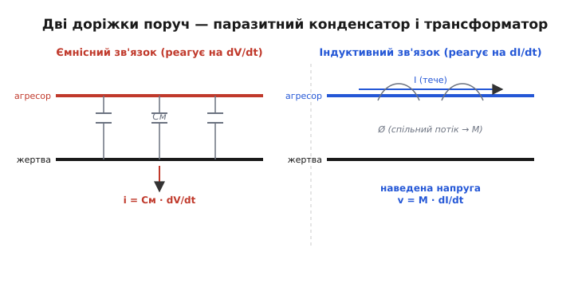
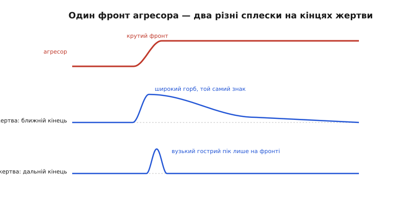
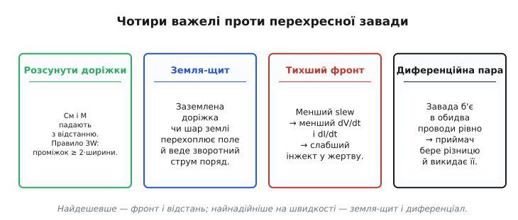

# Перехресна завада: коли сусідній провід підслуховує ваш сигнал

Дві доріжки на платі, два дроти в шлейфі, дві жили в кабелі. Кожна веде свій сигнал і, здавалося б, нікого не обходить, що робить сусідка. Але це ілюзія ізольованості. Досить одному проводу різко змінити напругу чи струм — і на сусідньому, до якого ніхто його не під'єднував, вискакує сплеск. Ніби провід підслухав чужу розмову й повторив уголос шматочок. Саме цей ефект і називають **перехресною завадою** (*crosstalk*, буквально «перехресна балачка» — термін прийшов із ранньої телефонії, де в трубці справді було чути чужу розмову з сусідньої лінії). Розберімо, **чому** сигнал перескакує туди, куди його не пускали, **скільки** його перескакує, і **чому** для цифрової схеми це не дрібниця, а причина загадкових збоїв, яких «не може бути».

### Чому взагалі два ізольовані проводи «чують» один одного

Почнімо з наївного питання: якщо доріжки не з'єднані, звідки на одній береться сигнал з іншої? Річ у тім, що електрика не тече лише мідними доріжками — вона живе в **полях** навколо них. Будь-які два провідники поруч утворюють між собою маленький **конденсатор**: дві «обкладки», а між ними діелектрик (повітря, скло-текстоліт плати). І будь-який провід зі струмом обгортає себе **магнітним полем**, яке частково прошиває сусіда, — тобто два проводи поводяться як слабенький **трансформатор**. Ці паразитні конденсатор і трансформатор нікуди не подіти: вони існують уже тому, що провідники мають розмір і лежать поруч у просторі.

Поки сигнали спокійні — нічого не відбувається: конденсатор заряджений і мовчить, трансформатор без зміни струму мертвий. Уся біда починається на **перемиканні**. Цифровий сигнал тим і живе, що стрибає між 0 і 1, і робить це різко — за одиниці наносекунд. А різка зміна — це саме те, на що обидва паразитні зв'язки реагують. Тому в статичному стані сусід тихий, а щойно лінія перемкнулася — на ньому вискакує сплеск. Провід, який змінює свій стан і збурює сусіда, називають **агресором** (*aggressor*), а той, хто мовчки страждає, — **жертвою** (*victim*).

> 🔧 **Навіщо це.** Це пояснює цілий клас «неможливих» багів. Лінія скидання (*reset*), яку ніхто не смикав, раптом дає імпульс — і мікроконтролер перезавантажується. Вхід переривання спрацьовує сам собою. Тактовий сигнал ловить зайвий фронт. У дев'яти випадках з десяти винна не «магія», а сусідня швидка доріжка, що через паразитний зв'язок впорснула сплеск у вашу тиху лінію. Хто розуміє механізм — шукає винуватця поруч на платі, а не переставляє прошивку навмання.

### Два механізми: один реагує на напругу, другий — на струм

Ці два паразитні шляхи — ємнісний і індуктивний — працюють за різними законами, і їх варто розрізняти, бо лікують їх теж по-різному.


*Дві доріжки поруч — це одночасно паразитний конденсатор і паразитний трансформатор. Ліворуч: між ними є ємність Cм; коли на агресорі напруга змінюється, крізь Cм у жертву тече струм i = Cм·dV/dt. Праворуч: струм в агресорі створює магнітний потік, частина якого прошиває жертву (взаємна індуктивність M), і на ній наводиться напруга v = M·dI/dt.*

**Ємнісний зв'язок** відгукується на **зміну напруги**. Між агресором і жертвою висить паразитна ємність, назвімо її Cм (*mutual capacitance*, взаємна). Заряд на конденсаторі пропорційний напрузі (Q = C·V), тож коли напруга агресора стрибає, крізь Cм мусить перетекти заряд — а перетікання заряду в часі і є струм. Виходить, у жертву впорскується струм, пропорційний **швидкості** зміни напруги:

```
i = Cм · dV/dt
```

Не самій напрузі, а її похідній! Стоїть агресор на 3.3 В нерухомо — струму нема. Скочив із 0 у 3.3 В за наносекунду — dV/dt величезне, і крізь Cм у жертву влітає добрий струмовий поштовх. Цей струм тече по опору жертви й лишає на ній сплеск напруги. [Ємність — це і є про заряд на різниці потенціалів](topic:hw-components/capacitive-reactance), і саме тому вона «бачить» лише зміни.

**Індуктивний зв'язок** відгукується на **зміну струму**. Струм агресора обгортається магнітним полем; частина силових ліній прошиває контур жертви. Скільки саме — задає взаємна індуктивність M ([взаємна індукція](topic:ph-electromagnetism/mutual-inductance): змінне поле одного контуру наводить напругу в іншому, як у трансформаторі). І знову працює не струм, а його **швидкість** зміни:

```
v = M · dI/dt
```

Тече в агресорі постійний струм — жертва спокійна. Струм різко змінився (а він змінюється щоразу, коли вентиль перемикає навантаження) — у контурі жертви наводиться напруга. Обидва механізми, як бачимо, дітища **похідної**: їх годує не рівень сигналу, а стрімкість його перемикання. Тримайте цю думку — з неї випливе головний практичний висновок.

### Ближній і дальній кінець: чому сплеск не однаковий

Тут криється тонкість, яка спершу спантеличує. Уявімо, що жертва — це доріжка з двома кінцями: один поряд із джерелом агресора («ближній», *near-end*), другий — далеко, біля приймача агресора («дальній», *far-end*). Впорснутий струм із місця зв'язку розтікається **в обидва боки** жертви. І доходить до кінців він по-різному, тому й сплески на кінцях виходять різні за формою та навіть знаком.


*Один-єдиний крутий фронт агресора породжує на жертві два несхожі сплески. На ближньому кінці — широкий горб того самого знаку, розтягнутий на подвійний час пробігу лінії. На дальньому — вузький гострий пік, що триває лише поки летить фронт агресора; у нього інша природа й часто протилежний знак.*

Різниця не випадкова, вона має чітку причину — інтерференцію хвиль, що біжать доріжкою, і різне складання ємнісного та індуктивного внесків на кожному кінці. Це вже [окрема невеличка теорія завади в лініях](topic:hw-pcb/crosstalk/math-coupling-derivation.md): чому ближня завада «насичується» на довгих лініях і тримається довго, а дальня росте з довжиною й крутістю фронту, і як внески Cм та M на дальньому кінці частково гасять або підсилюють один одного. Для практики досить запам'ятати сам факт: **на ближньому й дальньому кінці жертви завада різна**, тож міряти й ловити її треба на тому кінці, де сидить ваш приймач, а не «десь на лінії».

### Справжній винуватець — не частота, а крутість фронту

Ось найважливіше, і воно спантеличує найдужче. Інтуїція підказує: що вища тактова частота, то гірша завада. Це майже завжди хибно. Погляньмо на формули ще раз: обидва механізми годуються dV/dt та dI/dt — тобто **крутістю фронту**, а не тим, скільки разів за секунду ці фронти трапляються.

Уявіть дві системи. Перша тактується на 10 МГц, але зроблена на швидкій логіці з фронтами по 1 нс. Друга — на 100 МГц, зате з навмисне пологими фронтами по 5 нс. Хоч друга «вдесятеро швидша» за частотою, її dV/dt **у п'ять разів менше** — і завади вона наводить менше. Бо жертві байдуже, як часто агресор перемикається; їй болить, **наскільки різко** він це робить у мить самого перемикання. Саме [час наростання фронту](topic:hw-digital/edges-rise-time) — а конкретніше, [швидкість наростання, slew rate](topic:hw-digital/slew-rate-control) — і є важіль завади, не частота на корпусі кварцу.

Звідси випливає перше й найдешевше правило боротьби: **не роби фронти крутішими, ніж потрібно**. Модерна логіка вміє перемикатися за частки наносекунди, і часто ця скорострільність зовсім не потрібна лінії, яка передає повільний сигнал, — а завади вона наводить сповна. Пригальмуєш фронт (меншим драйвером, послідовним резистором, вибором повільнішої підродини логіки) — і завада падає, хоча дані ходять з тією ж швидкістю.

> 🔧 **Навіщо це.** Це рятує від хибної діагностики. Бачиш заваду — і рука тягнеться «сповільнити тактову частоту». Марно: частоту скинув, а фронти лишились ті самі круті — завада на місці. Правильний хід — цілитися у **фронт**: поставити послідовний резистор на 22–47 Ом на виході агресора, увімкнути в мікроконтролері «повільний» режим виходу (більшість GPIO мають біт вибору slew rate), узяти підродину логіки з м'якшим фронтом. Часто один резистор на агресорі прибирає сплеск на жертві повністю.

### Скільки саме перескакує: прикинемо на пальцях

Формула i = Cм·dV/dt дозволяє прикинути глибину лиха, не діставши осцилограф. Порахуймо типовий випадок на платі.

**Приклад (ємнісний сплеск на сусідній доріжці).** Дві доріжки йдуть паралельно 5 см; погонна взаємна ємність — близько 2 пФ на сантиметр, разом Cм ≈ 10 пФ. Агресор — вихід швидкого вентиля: перепад ΔV = 3.3 В за час фронту tr = 1 нс. Жертва — тиха лінія з підтяжкою до живлення через резистор Rж = 10 кОм (типова лінія скидання чи переривання). Який сплеск наведеться?

:::tabs
```cpp
const double dV = 3.3;             // В  — перепад на агресорі
const double tr = 1e-9;            // с  — час фронту, 1 нс
const double Cm = 10e-12;          // Ф  — взаємна ємність, 10 пФ
const double Rv = 10e3;            // Ом — опір жертви, 10 кОм

double dVdt   = dV / tr;           // 3.3e9 В/с
double i      = Cm * dVdt;         // ≈ 33 мА — піковий інжект-струм
double Vspike = i * Rv;            // = 330 В (!?) — грубо, для повільної лінії
```
```python
dV = 3.3      # В  — перепад на агресорі
tr = 1e-9     # с  — час фронту, 1 нс
Cm = 10e-12   # Ф  — взаємна ємність, 10 пФ
Rv = 10e3     # Ом — опір жертви, 10 кОм

dVdt   = dV / tr      # 3.3e9 В/с
i      = Cm * dVdt    # ≈ 33 мА — піковий інжект-струм
Vspike = i * Rv       # = 330 В (!?) — грубо, для повільної лінії
```
:::

Число абсурдне — і саме тому воно повчальне. Насправді 330 В нізвідки не візьметься: сплеск обмежать власна ємність жертви (яка розмаже гострий струмовий поштовх у м'якший горб напруги) і захисні діоди входу, що зріжуть викид на рівні живлення. Але висновок залізний: **інжектований струм цілком реальний і чималий**, і на високоомній лінії він дає сплеск на кілька вольтів — цього з головою досить, щоб перескочити [поріг логіки](topic:hw-digital/logic-levels-as-ranges) і зімітувати фальшивий фронт. Що вища опірність жертви (слабша підтяжка) і що крутіший фронт агресора — то більший сплеск. Ось чому тихі високоомні лінії скидання й переривання страждають першими.

І тут же — рецепт номер два: **знижуй опір жертви**. Той самий інжект-струм на резисторі підтяжки 1 кОм замість 10 кОм дасть удесятеро менший сплеск. Тому критичні тихі лінії тягнуть «жорсткою» підтяжкою, а не кволою.

### Чим це б'є по цифровій схемі

Аналоговому вуху завада — це шурхіт; цифровій схемі — це **брехливий біт**, і наслідки різкіші. Перше й найпряміше: фальшивий фронт. Сплеск на лінії переривання чи такту приймач може прийняти за справжній перепад — і зреагувати на подію, якої не було. Полічильник рахує зайвий імпульс, автомат станів робить зайвий крок, процесор ловить примарне переривання.

Друге, підступніше: **зіпсований момент рішення**. Навіть якщо сплеск не дотяг до порога, він може підвернутися рівно в ту мить, коли [тригер защіпає дані](topic:hw-digital/d-flip-flop), і зсунути напругу так, що замість певного 0 чи 1 тригер защіпає щось невизначене. Це шлях до [метастабільності](topic:hw-digital/metastability-timing) й прихованих порушень [часу утримання](topic:hw-digital/hold-violation). Найгидкіше, що збій **перемежовується**: завада б'є лише коли агресор перемикається, тобто збій з'являється й зникає залежно від того, що якраз роблять сусідні лінії, — і повторити його в лабораторії часом майже неможливо.

Третє, часто недооцінене — завада в **колі оброблення дискретизованих сигналів**. Коли [аналого-цифровий перетворювач](topic:hw-analog/adc) знімає відлік, а поруч перемикається шумна цифрова шина, наведений на аналоговий вхід сплеск домішується просто до виміряного числа. У готовому масиві даних це виглядає як зайвий шум, від якого жоден цифровий фільтр уже не порятує — бо він потрапив у число **до** дискретизації. Тому в змішаних схемах чутливі аналогові входи ретельно відсувають і екранують від цифрового «галасу»: зіпсований відлік не виправити алгоритмом, його можна лише не допустити.

### Як прибити заваду: чотири важелі

Усе лікування випливає з двох формул — i = Cм·dV/dt та v = M·dI/dt. Хочеш меншу заваду — зменшуй один із трьох множників: паразитний зв'язок (Cм, M), крутість (dV/dt, dI/dt) або опір жертви, на якому струм стає напругою.


*Чотири практичні важелі. Відстань послаблює обидва паразитні зв'язки. Земля-щит між лініями перехоплює поле й дає струмові короткий шлях назад. Пологіший фронт прямо зменшує dV/dt і dI/dt. Диференційна пара робить заваду спільною для обох проводів, і приймач її віднімає.*

**Відстань.** І Cм, і M швидко спадають, щойно доріжки розсунути. Практичне «правило 3W»: лишай між центрами сусідніх ліній проміжок не менший за три ширини доріжки (тобто зазор ≈ 2 ширини). Це найдешевший крок, коли є місце на платі.

**Земля-щит.** Заземлена доріжка, протягнута між агресором і жертвою, перехоплює на себе більшу частину силових ліній поля — ємнісний зв'язок з жертвою слабшає. А суцільний **шар землі** під доріжками робить ще важливіше: дає струмові агресора короткий зворотний шлях просто під ним, тож магнітний контур стискається й індуктивний зв'язок падає. Саме тому багатошарові плати зі суцільною землею страждають від завади куди менше за дешеві двошарові.

**Пологіший фронт.** Як уже видно з формул — прямий удар по dV/dt і dI/dt. Послідовний резистор, слабший драйвер, «повільний» режим GPIO, м'якша підродина логіки. Безкоштовно за грошима, коштує лише трохи запасу за швидкістю, якого повільній лінії й не треба.

**Диференційна пара.** Наймогутніший засіб для справді швидких ліній. [Диференційна сигналізація](topic:hw-analog/differential-signaling) веде сигнал двома проводами як різницю напруг, і якщо завада б'є в обидва однаково (а вона так і б'є, коли проводи поруч), приймач, віднімаючи один від другого, **викидає** спільну заваду разом. На цьому стоять усі швидкі інтерфейси — [LVDS](topic:com-devices/lvds), USB, Ethernet: вони не намагаються не наводити заваду, вони роблять її нешкідливою. Здоров'я такої лінії, до речі, зручно читати з [діаграми ока](topic:hw-pcb/eye-diagram) — стулене згори око якраз і виказує наведений шум.

Варто відрізняти перехресну заваду від спорідненого лиха — [стрибка землі](topic:hw-pcb/ground-bounce), коли сплеск наводиться не через сусідній сигнал, а через спільний зворотний провід і його індуктивність. Механізм інший, але корінь той самий: різка зміна струму на паразитній індуктивності. І лікуються вони суголосно — коротший зворотний шлях, суцільна земля, пологіший фронт.

Підсумок простий і чіткий. Перехресна завада — не поломка й не магія, а неминучий наслідок того, що провідники мають розмір і лежать поруч, обплетені полями. Вона мовчить, доки сигнали спокійні, і оживає на крутих фронтах, бо годується **швидкістю** зміни, а не її частотою. Тому три головні важелі — відсунути, заекранувати землею й пригальмувати фронт, а для швидкого — перейти на диференційну пару, яка перетворює заваду з ворога на нешкідливий спільний фон.
