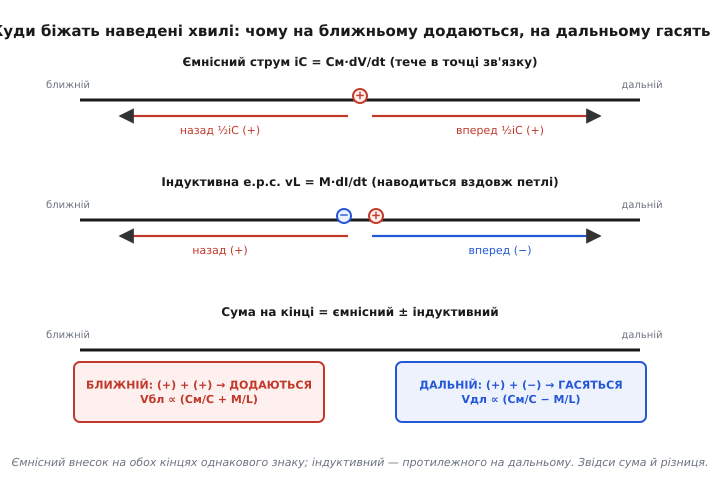
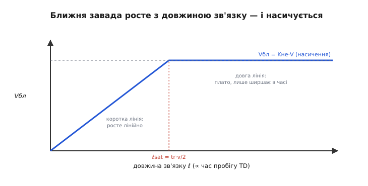

# 🧮 Перехресна завада в лініях: звідки ближній і дальній кінець

Сам факт завади пояснюється двома формулами, і вони прості: ємнісний зв'язок впорскує в жертву струм i = Cм·dV/dt, індуктивний наводить напругу v = M·dI/dt. Але щойно жертва перестає бути точкою й стає **лінією з довжиною**, з цих двох формул виростає щось несподіване. На одному кінці лінії сплеск виходить широкий, тримається довго й насичується — хоч скільки видовжуй лінію, більшим не стає. На другому — гострий, вузький, часто **протилежного знаку**, і тим вищий, чим довша лінія й крутіший фронт. Той самий агресор, та сама жертва, ті самі два механізми — а два кінці поводяться як два різні світи.

Це не примха схемотехніки, це прямий наслідок того, що збурення в лінії не сидить на місці, а **біжить** — і біжить в обидва боки з визначеною швидкістю. Завдання цієї вставки — вивести обидві завади з першопричини: показати, куди рушать наведені хвилі, чому на ближньому кінці ємнісний та індуктивний внески **додаються**, а на дальньому **віднімаються**, звідки береться насичення ближньої й ріст дальньої, і як усе це стискається в два коефіцієнти зв'язку — Kне (ближній, *backward*) і Kfe (дальній, *forward*) — через погонні Cм, Lм і швидкість поширення. Наприкінці ці коефіцієнти стануть числом, яке можна підставити для конкретної плати ще до осцилографа.

## Основа: збурення в лінії — це дві хвилі, що біжать назустріч

Перш ніж рахувати заваду, треба чітко бачити одну річ про лінію передачі. Коли десь на лінії з'являється локальне збурення — впорснутий струм чи наведена напруга, — воно **не лишається на місці й не розтікається миттєво в усі боки**. Воно народжує дві хвилі, що біжать уздовж лінії у протилежних напрямках зі швидкістю поширення сигналу v (для доріжки на платі це десь 15 см/нс, близько половини швидкості світла, бо їх гальмує діелектрик під доріжкою). Одна хвиля йде ліворуч, друга праворуч; ту, що йде туди ж, куди сигнал агресора, звемо **прямою** (*forward*), протилежну — **зворотною** (*backward*).

> 🔧 **Навіщо це.** Уся несхожість двох кінців жертви вміщається в одну думку: збурення розкладається на дві біжучі хвилі, і кожен кінець лінії ловить лише **одну** з них. Ближній кінець (той, що поряд із джерелом агресора) бачить зворотну хвилю; дальній (біля приймача агресора) — пряму. Тож питання «яка завада на кінці?» — це насправді питання «яка з двох хвиль сюди добігає й що вона несе». Хто це бачить, той не дивується, чому на осцилографі два щупи на одній жертві показують різне.

Тепер додаймо другу основу — те, що збурення в жертві народжує **не одне джерело, а два одразу**: ємнісний струм і індуктивна напруга. Кожне з них по-своєму задає ці дві біжучі хвилі. Уся сіль — у тому, що ці два джерела кидають свої хвилі **з різною симетрією**. Розберімо кожне окремо, а тоді складемо.

## Ємнісний внесок кидає однакові хвилі в обидва боки

Почнімо з ємнісного зв'язку, бо його симетрія найпрозоріша. Коли фронт агресора проходить над якоюсь ділянкою жертви, крізь погонну взаємну ємність Cм у цю ділянку впорскується струм i = Cм·dV/dt. Цей струм має кудись піти по жертві — і йому **байдуже, наліво чи направо**: жертва в обидва боки виглядає однаково (той самий хвильовий опір лінії ліворуч і праворуч від точки впорскування). Тож ємнісний струм розтікається **порівну на дві сторони** — половина рушає прямою хвилею, половина зворотною.

Головне тут — знак. Струм влетів у жертву й підняв на ній напругу; і зворотна хвиля, і пряма несуть **той самий позитивний знак** — обидві піднімають потенціал жертви. Ємнісний зв'язок симетричний не лише за величиною, а й за знаком: на обох кінцях він дає викид **однакової полярності**. Запам'ятаймо: ємнісна складова на ближньому і на дальньому кінці — **однакова за знаком**.

[Що ємність — це заряд на різниці потенціалів, тому струм крізь неї пропорційний швидкості зміни напруги (i = C·dV/dt), а не самій напрузі](topic:hw-components/capacitive-reactance) — це та основа, з якої випливає весь ємнісний внесок; на постійній напрузі Cм мовчить, оживає лише на фронті.

## Індуктивний внесок кидає хвилі протилежного знаку

Тепер індуктивний зв'язок — і тут ховається вся інтрига. Струм агресора dI/dt наводить у ділянці жертви напругу v = M·dI/dt через погонну взаємну індуктивність Lм. Але напруга — не струм; вона не «розтікається порівну», вона **штовхає** струм жертвою, і тут напрямок раптом стає важливим.

Уявімо наведену е.р.с. як маленьке джерело напруги, вставлене в жертву в точці зв'язку. Воно жене струм по жертві — і цей струм в один бік лінії тече «за напрямком джерела», а в другий — «проти». Через це дві породжені хвилі виходять **протилежного знаку**: зворотна хвиля від індуктивного зв'язку піднімає потенціал жертви, а пряма — **опускає** (або навпаки — важлива саме різниця знаків між прямою і зворотною). Фізична причина глибша за аналогію: індуктивний зв'язок — це закон Ленца в дії, наведений струм намагається протидіяти зміні потоку, і ця «протидія» дивиться в різні боки для прямої й зворотної хвиль.

[Взаємоіндукція — це коли змінне магнітне поле одного контуру наводить напругу в іншому (v = M·dI/dt), як у трансформаторі](topic:ph-electromagnetism/mutual-inductance); знак наведеної напруги диктує закон Ленца, і саме він робить прямий і зворотний внески індуктивного зв'язку протилежними.

Отже, ключова асиметрія двох механізмів:

```
ємнісний зв'язок:   зворотна (+)   пряма (+)      ← однаковий знак
індуктивний зв'язок: зворотна (+)   пряма (−)      ← протилежний знак
```

Далі — проста, але вирішальна арифметика складання.

## Складаємо: назад — сума, вперед — різниця

На кожному кінці жертви обидва механізми діють одночасно, тож викид на кінці — це **сума їхніх хвиль**, що туди добігають. Тепер просто складімо знаки.

**Ближній кінець** ловить дві зворотні хвилі: ємнісну (+) та індуктивну (+). Обидві одного знаку — вони **додаються**. Ближня завада — це **сума** ємнісного й індуктивного внесків.

**Дальній кінець** ловить дві прямі хвилі: ємнісну (+) та індуктивну (−). Знаки протилежні — вони **частково гасять один одного**. Дальня завада — це **різниця** ємнісного й індуктивного внесків.


*Чому кінці різні, в одному малюнку. Угорі: ємнісний струм у точці зв'язку розтікається порівну назад і вперед, обидві хвилі «+». Посередині: індуктивна е.р.с. жене хвилі протилежного знаку — назад «+», вперед «−». Унизу підсумок: на ближньому кінці ємнісний і індуктивний внески одного знаку й додаються, на дальньому — протилежного й гасяться. Звідси сума (Cм/C + M/L) для ближнього і різниця (Cм/C − M/L) для дальнього.*

Оце і є коріння всього явища. Дві прості формули, i = Cм·dV/dt та v = M·dI/dt, дали два джерела; лінія розклала кожне на пару біжучих хвиль; різна симетрія знаків призвела до того, що на одному кінці вони склалися, а на другому відняли. Звідси випливає геть усе інше — і форма сплесків, і насичення, і протилежний знак дальньої завади. Лишилося перекласти «сума» й «різниця» в числа.

> 🔧 **Навіщо це.** Ось чому дальня завада на платі майже завжди виходить **від'ємною** щодо фронту агресора, а ближня — того самого знаку. На доріжці над суцільною землею індуктивний внесок зазвичай пересилює ємнісний, тож у різниці (Cм/C − M/L) перемагає магнітний член — і дальній сплеск «провалюється» вниз під час наростання агресора. Побачив на дальньому кінці жертви від'ємну голку рівно на фронті сусіда — це підпис індуктивно-домінованого forward crosstalk, а не якийсь загадковий «викид».

## Ближня завада: звідки насичення й тривалість 2·TD

Тепер найтонше — форма ближнього сплеску в часі. Чому він широкий і насичується?

Розгляньмо, як зворотна хвиля збирається на ближньому кінці, поки фронт агресора летить лінією. Фронт рухається вперед зі швидкістю v. У кожній точці, яку він проходить, він народжує порцію зворотної хвилі, і ця порція рушає **назад**, до ближнього кінця, теж зі швидкістю v. Ключове спостереження: **ближній кінець безперервно отримує нові й нові порції зворотної хвилі весь той час, поки фронт іще десь на лінії**. Кожна ділянка лінії, яку фронт торкає, доливає свою краплю до ближнього сплеску.

Простежмо в часі. Фронт стартує від ближнього кінця й летить до дальнього — це один час пробігу лінії, TD. Найдальша точка, з якої зворотна хвиля ще встигне повернутися на ближній кінець, — це дальній кінець; але хвиля звідти має ще й **добігти назад**, а це ще один TD. Отже, ближній кінець приймає внесок протягом **двох** часів пробігу — від t = 0 (перша порція з-під самого ближнього кінця) до t = 2·TD (остання порція, що народилася біля дальнього кінця й повернулася). Ось звідки знамените **тривалість ближньої завади ≈ 2·TD** — подвійний час пробігу лінії.

```
тривалість ближнього сплеску ≈ 2 · TD        (TD — час пробігу лінії в один бік)
```

А тепер — насичення. Поки триває фронт агресора (час наростання tr), джерело зворотної хвилі «включене». Ближній сплеск росте, доки або фронт іще наростає, або ще прибувають порції з лінії. Тут два випадки, і саме вони дають насичення.

- **Коротка лінія (2·TD < tr):** уся лінія коротша, ніж «довжина фронту». Фронт іще не встиг дорости, а порції з усієї лінії вже прийшли й скінчилися. Ближній сплеск не встигає набрати повну амплітуду — він тим менший, чим коротша лінія. Тут **завада росте з довжиною**.
- **Довга лінія (2·TD ≥ tr):** фронт устигає повністю доростати, поки біжить лінією; порції прибувають безперервно й **перекриваються** так, що ближній кінець тримає повну амплітуду. Додаткова довжина вже **не піднімає** сплеск вище — вона лише **продовжує** його в часі (плато робиться ширшим, бо 2·TD росте). Тут **завада насичена**.


*Ближня завада проти довжини зв'язку. На коротких лініях (ліворуч від ℓsat) амплітуда росте лінійно з довжиною — фронт не встигає доростати. За критичної довжини ℓsat = tr·v/2 (де 2·TD зрівнюється з tr) сплеск досягає стелі Kне·V і далі не росте: довші лінії дають той самий за висотою, але ширший у часі горб. Тому «наскільки погано» на ближньому кінці впирається не в довжину, а в коефіцієнт зв'язку.*

Критична довжина, за якої настає насичення, — там, де 2·TD зрівнюється з часом фронту. Оскільки TD = ℓ/v, маємо 2·ℓ/v = tr, звідки

```
ℓsat = tr · v / 2        (довжина зв'язку, за якої ближня завада насичується)
```

Це надзвичайно практичне число. Наприклад, при фронті tr = 1 нс і швидкості v = 15 см/нс критична довжина ℓsat = 1·15/2 ≈ 7.5 см. Коротші паралельні пробіги дають недонасичену (меншу) ближню заваду; довші — вже повну, і видовжувати їх сенсу немає — гірше не стане (за амплітудою), лише довше дзвенітиме.

## Ближній коефіцієнт зв'язку Kне

Тепер запишемо саму амплітуду насиченого ближнього сплеску. Зворотна хвиля збирає ємнісний і індуктивний внески, обидва пропорційні відповідно погонним Cм і Lм, віднесеним до власних погонних параметрів лінії C і L (бо саме відношення зв'язку до власного визначає, яку частку сигналу перехопить жертва). Насичена ближня завада — це стала частка від перепаду агресора V:

```
Vне(насич.) = Kне · V

           1 ⎛ Cм    Lм ⎞
Kне = ──── ⎜ ── + ── ⎟          (backward, ближній коефіцієнт зв'язку)
           4 ⎝ C     L  ⎠
```

Множник ¼ — не підгін, він випливає з двох ділень навпіл, що трапляються дорогою: ємнісний струм ділиться порівну на дві хвилі (звідси одна ½), а перерахунок наведеної величини у власне біжучу хвилю лінії дає ще одну ½; разом ¼. Сума `Cм/C + Lм/L` під дужкою — це те саме «додаються» з нашої арифметики знаків: на ближньому кінці ємнісний і індуктивний внески одного знаку, тож стоять зі знаком плюс.

Це усталений результат теорії зв'язаних ліній (його наводять як формулу коефіцієнта NEXT у літературі з цілісності сигналу — Говард Джонсон, Ерік Богатін, Берт Симонович; статус — усталено). Величина безрозмірна: Kне = 0.05 означає, що на ближньому кінці жертви вискочить 5 % перепаду агресора незалежно від довжини (аби лінія була довша за ℓsat).

> 🔧 **Навіщо це.** Kне — це стеля, і вона від довжини **не залежить**. Тому боротьба з ближньою завадою — це боротьба з самим коефіцієнтом: розсунути доріжки (падають і Cм, і Lм), покласти землю між ними чи під ними (стискає магнітний контур і перехоплює електричне поле). Видовжувати чи вкорочувати лінію на насиченій ділянці марно — Kне однаковий. А от на **ненасиченій** (короткій) лінії вкорочення таки допомагає, бо там завада ще не дійшла до стелі.

## Дальня завада: похідна фронту, помножена на довжину

Дальній кінець — інша історія, і починається вона з того самого спостереження про хвилі, але з протилежним висновком. Дальній кінець ловить **пряму** хвилю, що біжить туди ж, куди й фронт агресора, з тією ж швидкістю v. Через це фронт і породжена ним пряма хвиля жертви летять **пліч-о-пліч**, ніколи не відстаючи одне від одного. Порція прямої хвилі, народжена на початку лінії, і порція, народжена в кінці, приходять на дальній кінець **одночасно з фронтом** — вони не розмазуються в часі, а **накладаються одна на одну в одну мить**.

Ось чому дальня завада **росте з довжиною**, а не насичується: що довша лінія, то більше ділянок устигли долити свою порцію в ту саму прямую хвилю, і всі ці порції додаються в один вузький імпульс на дальньому кінці. Довжина не розмазує дальній сплеск — вона його **накопичує**.

А чому він вузький і схожий на похідну фронту? Бо на дальньому кінці стоїть **різниця** двох майже однакових внесків (Cм/C − Lм/L). Там, де агресор тримає сталу напругу й сталий струм, обидва внески нулюються (немає ні dV/dt, ні dI/dt). Ненульова різниця виникає лише **під час фронту**, коли dV/dt і dI/dt великі. Тому дальній сплеск живе рівно стільки, скільки триває фронт агресора, і формою повторює **похідну** цього фронту — гостру голку там, де напруга агресора найкрутіша.

Складімо це в формулу. Амплітуда дальньої завади пропорційна різниці погонних зв'язків, довжині лінії ℓ і крутості фронту, вираженій через перепад на час наростання (dV/dt ≈ V/tr):

```
                1  ⎛ Lм    Cм ⎞    ℓ
Vfe ≈ − ── ⎜ ── − ── ⎟ · ── · V
                2  ⎝ L     C  ⎠    v · tr

або через погонні швидкості й дальній коефіцієнт зв'язку:

               1  ⎛ Cм    Lм ⎞
Kfe = ── ⎜ ── − ── ⎟          (forward, дальній коефіцієнт зв'язку, на одиницю ℓ/tr)
              2v ⎝ C     L  ⎠

              Vfe        ℓ
             ─── = ── · Kfe
              V         tr
```

Дужка `Cм/C − Lм/L` — це «віднімаються» з нашої арифметики знаків. Знак дальньої завади визначає, хто пересилив: на мікросмужці над землею зазвичай Lм/L > Cм/C, тож Kfe виходить **від'ємним**, і дальній сплеск дивиться протилежно до фронту агресора. Множник `ℓ/tr` — серце дальньої завади: **пряма пропорція довжині** й **обернена часу фронту** (тобто пряма — крутості). Подвоїли довжину — подвоїли дальню заваду; удвічі загострили фронт — знову подвоїли.

Це теж усталений результат (форму Vfe = −½·(Lм/L − Cм/C)·(ℓ/v)·(dV/dt) наводять ті самі джерела; статус — усталено).

> 🔧 **Навіщо це.** Дальня завада — головний ворог довгих швидких шин, бо вона накопичується з довжиною без стелі. І звідси випливає її найкоштовніша особливість: у **однорідному** діелектрику (смужкова лінія, *stripline*, повністю в текстоліті) ємнісний і індуктивний зв'язки збалансовані, Cм/C = Lм/L, різниця обертається на нуль — і дальня завада **зникає**. Саме тому критичні довгі диференційні пари й швидкі шини ведуть у stripline між двома шарами землі: це вимикає forward crosstalk у принципі. На мікросмужці (доріжка зверху, поле частково в повітрі) баланс порушений, тож дальня завада є завжди.

## Порахуймо обидві завади в числах

Абстракцію варто посадити на конкретну плату. Візьмімо типову пару мікросмужкових доріжок і прикиньмо обидва сплески.

**Ближня і дальня завада на парі доріжок 10 см.** Дві паралельні доріжки на платі, довжина зв'язку ℓ = 10 см. Виміряні (чи з польового калькулятора) погонні відношення зв'язку: ємнісне Cм/C = 0.04 (4 %), індуктивне Lм/L = 0.09 (9 %) — типово для мікросмужки, де магнітний зв'язок сильніший. Швидкість поширення v = 15 см/нс, отже час пробігу TD = ℓ/v = 10/15 ≈ 0.667 нс. Агресор: перепад V = 3.3 В за фронт tr = 0.5 нс. Порахуймо Kне, ближній сплеск, ℓsat, і дальній сплеск.

```
ближній коефіцієнт:
   Kне = ¼·(Cм/C + Lм/L) = ¼·(0.04 + 0.09) = ¼·0.13 = 0.0325

перевірка насичення (чи довша лінія за критичну):
   ℓsat = tr·v/2 = 0.5·15/2 = 3.75 см
   ℓ = 10 см > 3.75 см  →  лінія ДОВГА, ближня завада насичена

ближній сплеск (насичений):
   Vне = Kне·V = 0.0325·3.3 ≈ 0.107 В  (≈ 107 мВ)
   тривалість ≈ 2·TD = 2·0.667 ≈ 1.33 нс

дальній коефіцієнт і сплеск:
   (Lм/L − Cм/C) = 0.09 − 0.04 = +0.05      (індуктивний член більший — тому Vfe від'ємна)
   Vfe = −½·(Lм/L − Cм/C)·(ℓ/v)·(V/tr)
       = −½·(0.09 − 0.04)·(10/15)·(3.3/0.5)
       = −½·0.05·0.667·6.6
       ≈ −0.110 В   (≈ −110 мВ, протилежно фронту агресора)
   тривалість ≈ tr = 0.5 нс  (вузька голка на фронті)
```

Обидві завади вийшли близько сотні мілівольтів — і це на цілком буденній платі. Ближня — широкий горб +107 мВ, що дзвенить 1.33 нс; дальня — гостра голка −110 мВ завширшки з фронт, 0.5 нс. Для лінії скидання чи такту зі своїм порогом обидві вже небезпечні. І видно, які ручки що крутять: ближню зменшить лише менший коефіцієнт (розсунути, заекранувати); дальню — те саме плюс коротша лінія й пологіший фронт (обидва входять у `ℓ/tr`), а на межі — перехід у stripline, де вона просто зникає.

Зберімо оцінку в короткий робочий код — такий «крос-калькулятор» інженер тримає під рукою, щоб прикинути обидва сплески до розводки.

:::tabs
```cpp
#include <stdio.h>

// Оцінка ближньої (NEXT) і дальньої (FEXT) перехресної завади
// для пари зв'язаних ліній. Усе в узгоджених одиницях:
//   cm_c, lm_l — погонні відношення зв'язку (Cм/C та Lм/L), безрозмірні
//   len_cm     — довжина зв'язку, см
//   v_cm_ns    — швидкість поширення, см/нс
//   v_swing    — перепад агресора, В
//   tr_ns      — час фронту агресора, нс
int main(void) {
    const float cm_c   = 0.04f;    // ємнісне відношення зв'язку
    const float lm_l   = 0.09f;    // індуктивне відношення зв'язку
    const float len_cm = 10.0f;    // довжина зв'язку, см
    const float v      = 15.0f;    // швидкість, см/нс
    const float vsw    = 3.3f;     // перепад агресора, В
    const float tr     = 0.5f;     // час фронту, нс

    float td    = len_cm / v;              // час пробігу лінії, нс
    float k_ne  = 0.25f * (cm_c + lm_l);   // ближній коефіцієнт (сума!)
    float l_sat = tr * v / 2.0f;           // критична довжина насичення, см

    // ближня завада: насичена, якщо лінія довша за критичну
    float v_ne  = k_ne * vsw;              // насичена амплітуда
    if (len_cm < l_sat)                    // коротка лінія — недонасичена
        v_ne *= (len_cm / l_sat);          // грубе лінійне масштабування

    // дальня завада: -0.5*(lm_l - cm_c)*...; провідний мінус робить її від'ємною (на мікросмужці lm_l > cm_c)
    float v_fe  = -0.5f * (lm_l - cm_c) * (len_cm / v) * (vsw / tr);

    printf("TD = %.3f ns,  l_sat = %.2f cm  (%s)\n",
           td, l_sat, (len_cm >= l_sat) ? "насичено" : "недонасичено");
    printf("NEXT: Kне = %.4f,  Vне = %.1f mV,  триває ~%.2f ns\n",
           k_ne, v_ne * 1000.0f, 2.0f * td);
    printf("FEXT: Vfe = %+.1f mV,  триває ~%.2f ns\n",
           v_fe * 1000.0f, tr);
    return 0;
}
```
```python
# Оцінка ближньої (NEXT) і дальньої (FEXT) перехресної завади
# для пари зв'язаних ліній. Усе в узгоджених одиницях:
#   cm_c, lm_l — погонні відношення зв'язку (Cм/C та Lм/L), безрозмірні
#   len_cm     — довжина зв'язку, см
#   v          — швидкість поширення, см/нс
#   vsw        — перепад агресора, В
#   tr         — час фронту агресора, нс
cm_c   = 0.04    # ємнісне відношення зв'язку
lm_l   = 0.09    # індуктивне відношення зв'язку
len_cm = 10.0    # довжина зв'язку, см
v      = 15.0    # швидкість, см/нс
vsw    = 3.3     # перепад агресора, В
tr     = 0.5     # час фронту, нс

td    = len_cm / v              # час пробігу лінії, нс
k_ne  = 0.25 * (cm_c + lm_l)    # ближній коефіцієнт (сума!)
l_sat = tr * v / 2.0            # критична довжина насичення, см

# ближня завада: насичена, якщо лінія довша за критичну
v_ne = k_ne * vsw               # насичена амплітуда
if len_cm < l_sat:              # коротка лінія — недонасичена
    v_ne *= len_cm / l_sat      # грубе лінійне масштабування

# дальня завада: -0.5*(lm_l - cm_c)*...; провідний мінус робить її від'ємною (на мікросмужці lm_l > cm_c)
v_fe = -0.5 * (lm_l - cm_c) * (len_cm / v) * (vsw / tr)

print(f"TD = {td:.3f} ns,  l_sat = {l_sat:.2f} cm  "
      f"({'насичено' if len_cm >= l_sat else 'недонасичено'})")
print(f"NEXT: Kне = {k_ne:.4f},  Vне = {v_ne * 1000.0:.1f} mV,  "
      f"триває ~{2.0 * td:.2f} ns")
print(f"FEXT: Vfe = {v_fe * 1000.0:+.1f} mV,  "
      f"триває ~{tr:.2f} ns")
```
:::

Очікуваний вивід:

```
TD = 0.667 ns,  l_sat = 3.75 cm  (насичено)
NEXT: Kне = 0.0325,  Vне = 107.3 mV,  триває ~1.33 ns
FEXT: Vfe = -110.0 mV,  триває ~0.50 ns
```

(Тепер код рахує `v_fe = -0.5 * (lm_l - cm_c) * …` з провідним мінусом, тож знак результату — це вже фізична полярність, а не просто «хто пересилив»: від'ємне значення означає, що дальній сплеск дивиться протилежно до фронту агресора. На мікросмужці lm_l > cm_c, тож дужка `(lm_l - cm_c)` додатна, а мінус спереду робить Vfe від'ємною — звідси −110 мВ у роздруку.)

## Що з цього виносити

Обидві завади народжуються з тих самих двох формул — i = Cм·dV/dt та v = M·dI/dt, — але лінія робить з ними різне, бо збурення в ній **біжить двома хвилями**. Ємнісний струм кидає ці хвилі симетрично, однакового знаку в обидва боки; індуктивна напруга — антисиметрично, протилежного знаку вперед і назад. Через це на ближньому кінці внески **додаються** (звідси Kне = ¼·(Cм/C + Lм/L), той самий знак сплеску, що в агресора), а на дальньому **віднімаються** (звідси Kfe ∝ (Cм/C − Lм/L), часто протилежний знак).

Форма теж випливає з хвиль. Ближній кінець приймає зворотні порції з усієї лінії протягом **подвійного часу пробігу**, тож сплеск широкий (≈ 2·TD) і **насичується**: на лінії довшій за ℓsat = tr·v/2 його амплітуда впирається в стелю Kне·V і від довжини більше не залежить. Дальній кінець ловить прямі порції, що летять пліч-о-пліч із фронтом і **накопичуються** в одну вузьку голку завширшки з фронт; тому дальня завада **росте з довжиною** (∝ ℓ) і **з крутістю** (∝ 1/tr = dV/dt), а формою повторює похідну фронту. І найкорисніший наслідок різниці: у однорідному діелектрику (stripline) Cм/C = Lм/L, дальня завада обертається на нуль — тому довгі швидкі лінії ховають між шарами землі, де forward crosstalk просто не існує.

Ці два коефіцієнти — Kне (сума, безрозмірна, стеля за амплітудою) і Kfe (різниця, множиться на ℓ/tr) — і є вся кількісна відповідь на питання, чому два кінці однієї жертви поводяться як два різні світи. [Практичні важелі проти обох — розсунути, заекранувати землею, пригальмувати фронт, а для швидкого перейти на диференційну пару](topic:hw-analog/differential-signaling) — прямо читаються з того, який множник у якій формулі більший.
