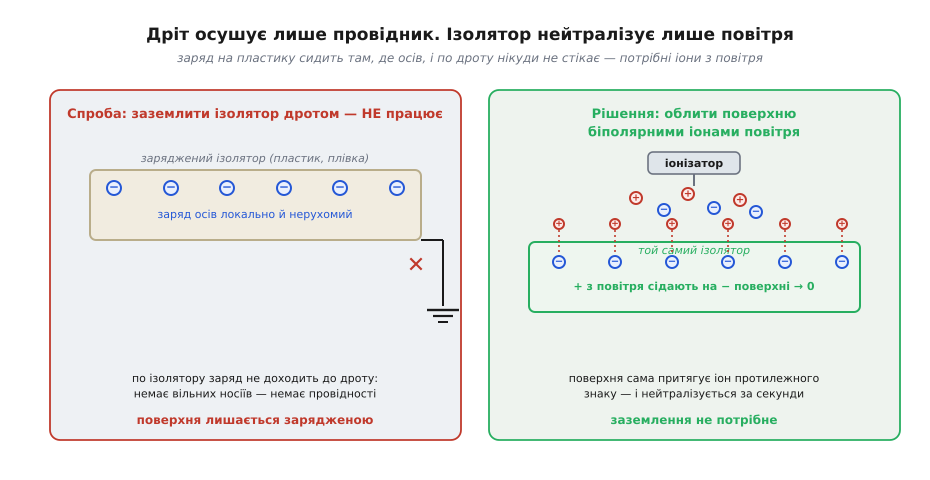
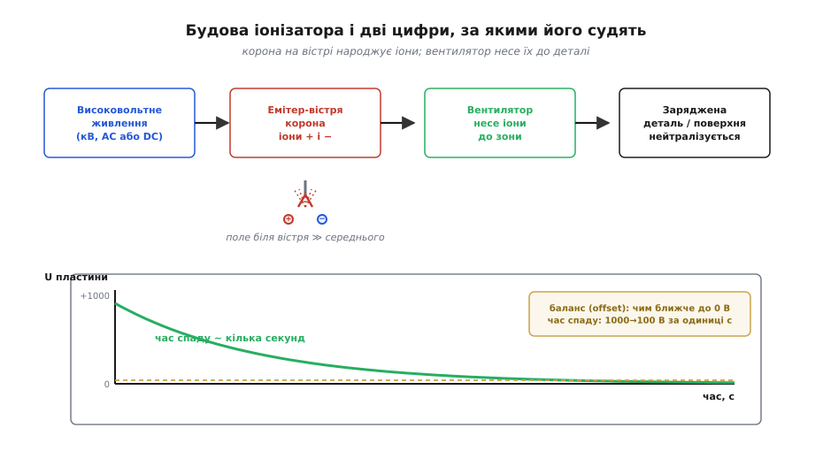

# 🔌 Іонізатор повітря: нейтралізувати заряд там, де не можна заземлити

> Браслет і мат [антистатичного робочого місця](topic:hw-pcb/antistatic-workplace) стікають заряд **через провідник** — крізь шкіру, метал, антистатичний пластик. Але половина деталей на столі **не провідники**: корпус приладу, котушка скотчу, захисна плівка дисплея, сама плата без оголеного металу. До ізолятора дріт не причепиш — заряд сидить там, де осів, і нікуди по ньому не тече. Саме на цей випадок є **іонізатор повітря** (*air ionizer*).

### Що це за клас

Іонізатор — це **активний нейтралізатор статики**: маленький прилад, що робить з повітря джерело рухомих зарядів обох знаків. Чому без нього не обійтися, видно з межі заземлення: воно прибирає заряд **тільки з того, що проводить**. Ізолятор же тримає заряд локально (немає вільних носіїв — немає й провідності, як у [діелектриках](topic:ph-condensed/conductors-insulators)), і єдиний спосіб його зняти — піднести **протилежні заряди ззовні**. Саме їх іонізатор і постачає по повітрю.


*Ліворуч: заряд на пластику не доходить до заземлювального дроту — стікати нічим. Праворуч: потік біполярних іонів накриває поверхню, і заряджені ділянки самі притягують іон протилежного знаку, аж поки не стануть нейтральними. Заземлення тут ні до чого.*

### Блок-схема: звідки беруться іони

Звідки ж прилад бере ці іони? Його серце — **корона** (*corona discharge*) на гострому вістрі, та сама фізика [пробою повітря](topic:ph-electromagnetism/air-breakdown), що й у громовідводу. На емітер подають **кіловольти**; біля вістря радіус малий, тож поле там у кілька разів вище за середнє і рве молекули повітря на іони, не доходячи до повного пробою-іскри. Далі **вентилятор** (у настільних «обдувачах») жене цю іонізовану хмару до робочої зони; у стельових та компактних моделях іони розходяться самі.


*Високовольтне живлення → корона на вістрі (іони + і −) → потік повітря → заряджена деталь. Унизу — як це міряють пластиною-мішенню: важливі дві цифри — **час спаду** (як швидко напруга падає до нуля) і **баланс**, тобто на яку напругу прилад сідає сам.*

Ключова вимога — **біполярність**: іонізатор має давати **порівну** додатних і від'ємних іонів. Тоді поверхня сама «вибирає» з потоку іон потрібного знаку: додатна ділянка притягне від'ємні іони, від'ємна — додатні, і кожна нейтралізується незалежно. У змінному (*AC*) типі знаки чергуються в часі на одному вістрі; у постійному (*DC*) — окремі емітери на + і −, інколи імпульсами.

Звідси й дві цифри, якими прилад судять, — і обидві міряють тією самою **пластиною-мішенню** (ізольована металева пластина відомої ємності, до якої під'єднано вольтметр). Перша — **час спаду**: пластину заряджають до якоїсь напруги й дивляться, за скільки потік іонів зведе її майже до нуля. Галузевий вимір беруть на ділянці від ±1000 до ±100 В; добрий настільний прилад проходить її за одиниці секунд, кепський — за десятки. Друга — **баланс** (offset): на яку напругу пластина сяде, якщо просто тримати її під потоком досить довго. В ідеалі це 0, але розбаланс знаків лишає невеликий «свій» заряд; типова межа — кілька десятків вольтів, а добрі прилади тримають одиниці. Час спаду каже, чи **встигне** прилад, а баланс — чи не **нашкодить** він сам, тож одну без одної не дивляться.

### Розпіновка й підключення

З погляду користувача це **майже не компонент, а прилад**: на вході — низьковольтне живлення (часто 5–24 В чи мережа через адаптер), усередині — підвищувач до кіловольтів. Назовні високовольтні дроти **не виводять** — там небезпечна напруга. Корпус приладу заземлюють на ту саму спільну «землю» столу, що й [антистатичний мат](topic:hw-pcb/antistatic-workplace), щоб струм корони мав куди повертатися. Більших «шин даних» немає; складніші моделі дають хіба сигнал тривоги «потрібне чищення/калібрування».

### «Перший байт»

Заговорити до іонізатора — це не команда по шині, а **ввімкнути живлення й націлити потік** на ізолятор, який не вдається зняти інакше:

```
1. подати живлення (вентилятор загув, корона тихо шипить)
2. спрямувати обдув на заряджену деталь, відстань ~0.3–0.6 м
3. витримати кілька секунд — стільки, скільки триває «час спаду»
4. перевірити поверхню вимірювачем поля; має впасти до ~0
```

Якщо чути тихе сичання корони й легкий запах озону — прилад працює.

### Типові граблі

- **Розбалансований потік.** Якщо + і − не порівну, прилад сам **залишає** на поверхні залишковий заряд (offset). Тому баланс періодично перевіряють пластиною-мішенню і калібрують.
- **Брудні вістря.** Корона осаджує на емітери пил і нагар; забруднене вістря іонізує гірше й порушує баланс. Вістря чистять за графіком.
- **Озон.** Корона побічно дає **озон** (*ozone, O₃*) — у малих дозах дратує дихання. Зону провітрюють; беруть моделі з низькою емісією.
- **Заміна заземленню — ні.** Іонізатор **доповнює**, а не замінює браслет і [мат робочого місця](topic:hw-pcb/antistatic-workplace). Провідні речі заземлюють напряму; іонізатор — для ізоляторів, до яких дроту не причепиш.
- **Повільно — отже, замало.** Якщо час спаду великий (десятки секунд), потік слабкий або вістря брудні: деталь устигне розрядитися крізь чутливий вузол раніше, ніж її нейтралізує повітря.

### Скільки чекати: поріг у коді лінії

На автоматичній лінії «витримати кілька секунд» очима не зробиш — рішення «деталь уже безпечна, бери її» має ухвалити контролер. Він робить те саме, що людина з вимірювачем: стежить за напругою наведеного поля й чекає, поки вона впаде під поріг. Польовий датчик біля зони видає напругу, пропорційну до заряду поверхні, а АЦП мікроконтролера її оцифровує. Лишається перевести «безпечний поріг» із вольтів поверхні в коди АЦП — і чекати, поки відлік опуститься нижче.

**Приклад (поріг нейтралізації в кодах АЦП).** Польовий датчик дає 1.00 В на кожні 1000 В поверхні; «безпечно» вважаємо ≤ 100 В (та сама точка, де галузь зупиняє вимір часу спаду). АЦП 12-розрядний, опорна напруга 3.3 В. Який код відповідає порогу?

```
поле→напруга:   k = 1.00 В / 1000 В = 1.0 mV на 1 В поверхні
поріг поверхні: U_thr = 100 В
напруга датчика: V_thr = 100 × 1.0 mV = 0.100 В
крок АЦП:        LSB = 3.3 В / 4096 ≈ 0.806 мВ
поріг у кодах:   N_thr = 0.100 / 0.000806 ≈ 124
```

:::tabs
```cpp
// поле впало під безпечний поріг? (12-біт АЦП, 0.806 мВ/крок)
#define ADC_THRESHOLD 124        // ≈ 100 В на поверхні
#define SETTLE_MS     300        // підряд триматись нижче порогу

bool surface_is_safe(void) {
    uint32_t below = 0;
    while (below < SETTLE_MS) {
        if (adc_read(FIELD_SENSOR) < ADC_THRESHOLD)
            below += 10;         // ще 10 мс «чисто»
        else
            below = 0;           // підскочило — лік спочатку
        delay_ms(10);
    }
    return true;                 // тримається нижче порогу → нейтралізовано
}
```
```python
# поле впало під безпечний поріг? (12-біт АЦП, 0.806 мВ/крок)
ADC_THRESHOLD = 124              # ≈ 100 В на поверхні
SETTLE_MS     = 300              # підряд триматись нижче порогу

def surface_is_safe() -> bool:
    below = 0
    while below < SETTLE_MS:
        if adc_read(FIELD_SENSOR) < ADC_THRESHOLD:
            below += 10           # ще 10 мс «чисто»
        else:
            below = 0             # підскочило — лік спочатку
        time.sleep_ms(10)
    return True                   # тримається нижче порогу → нейтралізовано
```
```micropython
# поле впало під безпечний поріг? (12-біт АЦП, 0.806 мВ/крок)
from machine import ADC, Pin
import time

ADC_THRESHOLD = 124              # ≈ 100 В на поверхні
SETTLE_MS     = 300              # підряд триматись нижче порогу
field = ADC(Pin(34))            # польовий датчик

def surface_is_safe():
    below = 0
    while below < SETTLE_MS:
        if field.read() < ADC_THRESHOLD:
            below += 10           # ще 10 мс «чисто»
        else:
            below = 0             # підскочило — лік спочатку
        time.sleep_ms(10)
    return True                   # тримається нижче порогу → нейтралізовано
```
```go
// поле впало під безпечний поріг? (12-біт АЦП, 0.806 мВ/крок)
const (
    adcThreshold = 124                 // ≈ 100 В на поверхні
    settle       = 300 * time.Millisecond // підряд триматись нижче порогу
)

func surfaceIsSafe() bool {
    var below time.Duration
    for below < settle {
        if adcRead(fieldSensor) < adcThreshold {
            below += 10 * time.Millisecond // ще 10 мс «чисто»
        } else {
            below = 0                      // підскочило — лік спочатку
        }
        time.Sleep(10 * time.Millisecond)
    }
    return true // тримається нижче порогу → нейтралізовано
}
```
:::

Висновок: контролер не відлічує «магічні секунди», а вимірює **факт** — поле під порогом і тримається там. Якщо датчик довго не сходить під 124, це той самий діагноз, що й повільний час спаду: потік слабкий або вістря брудні, і лінію треба зупинити, а не пропускати деталі наосліп.

### Варіації класу

Бувають **настільні обдувачі** (вентилятор + кілька вістер — на одне робоче місце), **стельові смуги** (накривають іонами цілу лінію), **пістолети-обдувачі** зі стиснутим повітрям (здувають і нейтралізують пил водночас) і компактні **точкові** іонізатори на конвеєрах. За принципом їх ділять на **AC** (одне вістря, знаки по черзі), **DC-біполярні** (роздільні емітери) та **імпульсні** (керують часом і часткою кожного знаку). Спільне в усіх одне: де заземлити **нічого**, заряд знімають не дротом, а зустрічними іонами з повітря.

> 🔧 **Навіщо це.** Щойно на столі з'являється заряджений **ізолятор** — корпус, плівка, скотч, плата без оголеного металу — браслет і [мат](topic:hw-pcb/antistatic-workplace) безсилі: стікати нічим. Тоді в хід іде іонізатор: він обливає поверхню біполярними іонами (корона — [пробій повітря](topic:ph-electromagnetism/air-breakdown)), і та сама нейтралізується за секунди — без жодного дроту. Дивишся на дві цифри: баланс (щоб не лишав свого заряду) і час спаду (щоб устигав до того, як деталь розрядиться через чутливий вузол).
