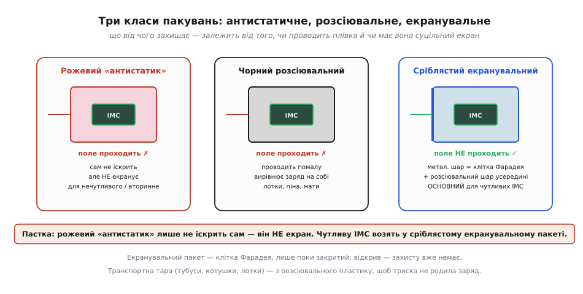
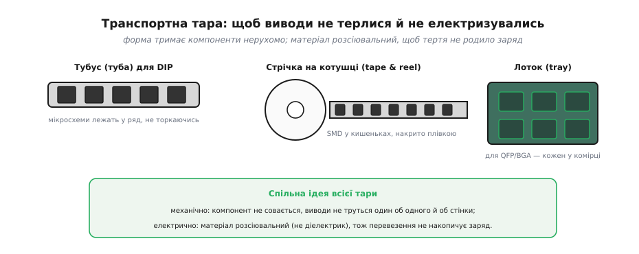

# Пакування й транспортування: розсіювальні та екранувальні пакети, тубуси, котушки

Коли компонент лежить на заземленому маті під захистом браслета на [антистатичному робочому місці](topic:hw-pcb/antistatic-workplace), він у безпеці. Але більшу частину життя деталь проводить **не на столі**: на складі, у коробці, у дорозі від виробника до тебе. Там немає ні браслета, ні мата — лише пакування. Тому правильна тара так само критична, як правильний стіл. І тут на новачка чекає головна пастка всього розділу: інтуїтивне переконання, що «антистатичний пакет = захист». Насправді пакування буває **кількох різних класів**, і вони захищають від **різних** небезпек. Сплутати їх — означає везти чутливу мікросхему в тому, що її не захищає.

### Три класи матеріалів: антистатичний, розсіювальний, екранувальний

Розберемо три типи плівок і коробок за двома ознаками: чи **електризується** сам матеріал і чи **екранує** він вміст від зовнішнього поля.


***Рожевий «антистатик»** не електризується сам, але поле зовні пропускає — це НЕ екран. **Чорний розсіювальний** проводить помалу по поверхні, вирівнюючи заряд на собі. **Сріблястий екранувальний** має металевий шар — справжню клітку Фарадея, що не пускає поле всередину; це основна тара для чутливих ІМС. Зверни увагу: екранувальний пакет працює, лише поки закритий.*

Перший клас — **антистатичний** (*antistatic*), знайомий рожевий або рожево-прозорий поліетилен. Його єдина чеснота: він **сам не електризується** при терті (на відміну від звичайної плівки, що стоїть скраю трибоелектричного ряду). Тобто він безпечний як **обгортка** й підкладка. Але — і це треба підкреслити тричі — він **не екранує**: зовнішнє поле й розряд проходять крізь нього до вмісту. Рожевий пакет годиться для нечутливих деталей або як вторинне пакування, але **не** для голої чутливої мікросхеми.

Другий клас — **розсіювальний** (*dissipative*), зазвичай чорний пластик, піна, мати, лотки. Він **проводить помалу** по поверхні (опір середній — між ізолятором і металом), тож заряд на ньому не застрягає точково, а розтікається й повільно стікає. Це матеріал столу й тари, що сама не накопичує заряд і безпечно знімає його з покладених деталей. Слабкий екран, але непогане «вирівнювання».

Третій клас — **екранувальний** (*shielding*), той сріблястий металізований пакет, у якому приходять плати й мікросхеми. Він має тонкий **металевий шар**, що утворює справжню [клітку Фарадея](topic:ph-electromagnetism/faraday-cage): зовнішнє електричне поле всередину не проникає, а зовнішній розряд обтікає пакет по поверхні, не торкаючись вмісту. Зазвичай він багатошаровий: усередині розсіювальний шар (щоб не іскрило об саму деталь), назовні — металевий екран. Це **основна** тара для чутливих компонентів.

Варто докладніше зрозуміти, **чому** металевий шар захищає, — бо це пряме застосування [клітки Фарадея](topic:ph-electromagnetism/faraday-cage). Коли заряджений палець або інструмент торкається пакета зовні, розряд приходить на **зовнішню** металеву оболонку. А в провіднику [надлишковий заряд і струм течуть **по поверхні**](root:embedded/field-and-potential), не заходячи всередину. Тож увесь струм розряду розтікається по зовнішньому шарі пакета й стікає геть, а всередині — там, де лежить плата — поля від цього майже немає. Виходить, екранувальний пакет не «поглинає» розряд і не «гасить» його якоюсь хитрою речовиною — він просто **відводить** струм в обхід вмісту по своїй металевій шкірці. Саме тому ціла оболонка критична: дірка, надрив чи відкритий верх руйнують клітку, і розряд знаходить шлях усередину.

> 🔧 **Навіщо це.** Запам'ятай головну пастку: **рожевий ≠ екран**. Везти процесор або датчик у рожевому «антистатику» — все одно що везти яйце в паперовому конверті: само не подряпає, але від удару ззовні не врятує. Чутливі ІМС возять **тільки** в сріблястому екранувальному пакеті. І ще: екранувальний пакет — це клітка Фарадея, лише поки **закритий**. Відкрив, заглянув, поклав плату зверху на пакет — і [екран уже не працює](topic:ph-electromagnetism/faraday-cage). Тому дістають виріб із пакета вже **на заземленому місці**, ставши заземленим через браслет.

### Дві різні роботи пакування: «не родити» й «не пустити»

Щоб три класи не злились у голові в кашу, корисно явно розвести **дві задачі**, які пакування може виконувати, — бо саме їх плутанина й народжує пастку «рожевий = захист». Перша задача — **не родити заряд самому** (low charging): матеріал не повинен сильно електризуватись від тертя об вміст і об усе довкола. Це вміють і антистатичний (рожевий), і розсіювальний матеріали — обидва стоять близько до середини трибоелектричного ряду й не іскрять. Друга задача — **не пустити зовнішній розряд і поле всередину** (shielding): а це вміє **лише** екранувальний пакет із суцільним металевим шаром.

Рожевий «антистатик» виконує **тільки першу** задачу й геть не виконує другу — звідси й уся плутанина. Він безпечний як підкладка чи обгортка (сам не нашкодить), але голу чутливу ІМС від зовнішнього удару не врятує. Екранувальний пакет — навпаки — закриває обидві задачі одразу (зовні екран, усередині розсіювальний шар), тому він і основний. Тримаючи в голові цю пару «не родити / не пустити», легко перевірити будь-яку тару: спитати, котрі з двох робіт вона реально робить — і чи цього досить для саме цього компонента.

Окремо про **піну й поролон**. Темна провідна (розсіювальна) піна, у яку втикають ніжки мікросхем, робить ще третю корисну річ: вона **замикає всі виводи між собою**. Поки всі ноги чипа на одному потенціалі, між ними не виникає різниці напруг — а отже, нема чому пробити вхід відносно живлення. Це той самий принцип [«усе на одному потенціалі»](topic:hw-pcb/antistatic-workplace), лише в мініатюрі для одного компонента. А от звичайний білий пакувальний пінопласт — навпаки, чудовий ізолятор, що шалено електризується від тертя; класти на нього електроніку не можна.

Проженімо три класи через один конкретний сценарій — **заряджена людина бере пакет із полиці** — щоб різниця стала відчутною. Випадок із рожевим пакетом: рука торкається плівки, але та поля не екранує, тож наведене зарядженою рукою поле спокійно проходить крізь стінку до плати; якщо при цьому пакет іще й лежить на чомусь, через що заряд може перерозподілитись, плата дістає удар. Випадок із розсіювальним: трохи краще — заряд із руки помалу розтечеться по провідній поверхні пакета, але суцільного екрана все одно немає. Випадок із екранувальним: рука торкається зовнішнього металевого шару, увесь заряд розтікається по ньому й стікає геть, а всередині — там, де плата — поля майже немає (клітка Фарадея). Той самий дотик зарядженої руки — три різні результати: пробій, напівзахист, повний захист. Ось чому для справді чутливого возять саме екранувальне.

**Приклад (наскільки екран послаблює поле).** Хай заряджений предмет створює зовні пакета поле, що відповідає кільком кіловольтам. Металевий шар екранувального пакета — провідник, тож усередині суцільної цілої оболонки поле спадає практично до нуля:

```
зовні оболонки:        E_зовн — від зарядженого предмета (сильне)
всередині провідної
суцільної оболонки:    E_всер ≈ 0   (екранування провідником)
→ виріб усередині «не бачить» зовнішнього поля
АЛЕ: дірка / надрив / відкритий верх
→ оболонка вже не суцільна, поле проникає → захисту немає
```

Висновок числа простий і жорсткий: цілий закритий екран послаблює зовнішнє поле майже до нуля, а от **порушений** (відкритий, надірваний) екран не послаблює майже нічого. Тому стан пакета — «закритий і цілий» — це не формальність, а умова, без якої вся ідея екранування не працює.

### Тара для виводів: тубуси, котушки, лотки

Окремо — про тару, що тримає **багато однакових компонентів**. Тут до електричної вимоги додається ще й **механічна**: компоненти не повинні совгатись і терти виводами один об одного й об стінки (бо це знову [контакт-розрив, що родить заряд](topic:ph-electromagnetism/triboelectricity)).


***Тубус (туба)** тримає DIP-мікросхеми в ряд, не даючи їм торкатись. **Стрічка на котушці** (tape & reel) несе SMD-компоненти в окремих кишеньках під плівкою. **Лоток (tray)** дає кожному QFP/BGA свою комірку. Усе це — з розсіювального пластику, щоб тряска в дорозі не родила заряд.*

**Тубус** (*tube*) — довга планка-жолоб, у якій мікросхеми в корпусі DIP лежать рядком, кожна у своїй позиції, не торкаючись сусідів. **Стрічка на котушці** (*tape & reel*) — основний спосіб для SMD: компоненти сидять у штампованих кишеньках паперової чи пластикової стрічки, накриті плівкою, і стрічка намотана на котушку (так їх і подають у автомати складання). **Лоток** (*tray*, часто стандарту JEDEC) — пластикова таця з комірками-гніздами під великі корпуси QFP і BGA. У всіх трьох випадках працює та сама подвійна ідея: **механічно** зафіксувати, щоб виводи не терлись, і зробити тару з **розсіювального** матеріалу, щоб саме перевезення не накопичувало заряд.

**Приклад (чому форма тари важить не менше за матеріал).** Уяви 1000 мікросхем, насипом у звичайному пакеті, у кузові авто на вибоїстій дорозі. Оцінимо порядок числа контактів-розривів за поїздку:

```
тряска ≈ кілька коливань на секунду  →  ~3 Гц
поїздка ≈ 1 година  →  3600 с
циклів струсу ≈ 3 × 3600 ≈ 10⁴ на компонент
× 1000 компонентів × (десятки контактів за струс)
≈ 10⁸ – 10⁹ актів контакт↔розрив за поїздку
```

Сотні мільйонів мікроперетинів заряду — і якби пакет був зі звичайної плівки, кожен компонент приїхав би наелектризованим до кіловольтів. Ось чому насип у будь-чому — погано: навіть у непоганому матеріалі тертя виводів сама себе генерує статику. Тара має тримати деталі **нерухомо**.

Зверни увагу, що тут об'єднуються **обидві** небезпеки розділу. Рух у тарі — це джерело заряду ([контакт-розрив](topic:ph-electromagnetism/triboelectricity)), а зіткнення виводів об стінки — ще й шанс на дрібний розряд між зарядженими деталями. Тому хороша тара водночас і не дає **родитись** заряду (розсіювальний матеріал), і не дає компонентам **рухатись** (форма-фіксація). Це знову та сама пара задач, що й для пакетів вище, лише тепер механічна фіксація виходить на перший план: для розсипу дрібних SMD саме нерухомість важливіша за все, бо їх багато й вони легкі, тож труться найохочіше.

> 🔧 **Навіщо це.** Практичне правило приймання: компонент має лишатись у заводській тарі (стрічці, тубусі, лотку, екранувальному пакеті) аж **до моменту встановлення** на заземленому місці. Перекладати чутливі деталі «у щось своє» — звичайну коробочку, пакетик, поролон — це або зняти екран, або додати тертя, або і те, й те. А там, де заземлити тару взагалі не можна (скажімо, рухома лінія), заряд знімають іонізатором повітря — вставка 🔌 [Іонізатор повітря](topic:hw-pcb/esd-packaging/comp-ionizer.md).

### Як пакування й стіл працюють у парі: правильна послідовність

Пакування саме по собі лишає одну небезпечну мить — **момент діставання**. Поки плата в закритому екранувальному пакеті, вона захищена; коли вона вже на заземленому маті під браслетом — теж. Але між цими станами є секунда, коли пакет відкрито, а плату ще не «прив'язано» до спільної землі. Якщо в цю мить ти заряджений, перший же дотик до виводу пустить розряд просто в чип. Тому пакування й [заземлений стіл](topic:hw-pcb/antistatic-workplace) — це не два окремі заходи, а **одна послідовність**, і порядок дій критичний.

Правильний порядок такий. Спершу — стати заземленим: надіти браслет на голу шкіру й під'єднати, прибрати зі столу зайві діелектрики. Тоді — покласти **закритий** пакет на заземлений мат, щоб його зовнішній заряд (якщо він є) стік на мат. І лише після цього відкрити пакет і дістати плату, тримаючи її за краї. Зворотний шлях — дзеркальний: повертати виріб у пакет теж на заземленому місці. Сенс простий: ми ніколи не лишаємо чутливий виріб «голим» поза спільним потенціалом. Пакет передає його з рук у руки заземленому столу, як естафету, без жодної незахищеної миті.

Звідси випливає й те, чому **тару теж заземлюють** там, де це можливо. Металеву котушку, тубус чи лоток у складальному цеху не просто кладуть, а ставлять на заземлену поверхню або в заземлене гніздо: щоб заряд, наведений під час перевезення, стік ще до того, як автомат візьме компонент. Це той самий принцип [«усе на одному потенціалі»](topic:hw-pcb/antistatic-workplace), розширений з робочого столу на весь шлях деталі — від складу до місця на платі.

Варто згадати й сусідню, хоч і відмінну, проблему — **вологу всередині пакета**. Деякі компоненти (зокрема у пластикових корпусах) бояться поглинутої вологи: при швидкому нагріві паяння вона скипає й розриває корпус. Тому такі деталі возять у герметичних **вологозахисних** пакетах із пакетиком-осушувачем та індикатором вологості. Це **не** про статику (механізм геть інший), але про те саме пакування — і плутати дві функції не варто: екранувальний пакет захищає від розряду, вологозахисний — від вологи. Гарна тара часто поєднує обидві властивості, але це дві різні роботи, як і «не родити / не пустити» вище.

Отже, пакування буває **антистатичне** (само не іскрить, але не екранує), **розсіювальне** (повільно проводить, вирівнює заряд) і **екранувальне** (клітка Фарадея — основна тара для чутливих ІМС); головна пастка — плутати рожевий «антистатик» з екраном. Транспортна тара (тубуси, котушки, лотки) додатково тримає виводи **нерухомо**, щоб тряска не родила статику. А наскільки взагалі небезпечним стає кожен із цих сценаріїв, сильно залежить від [сухості повітря](topic:ph-electromagnetism/humidity-static-control): чим воно сухіше, тим легше народжується й довше живе заряд.

---
