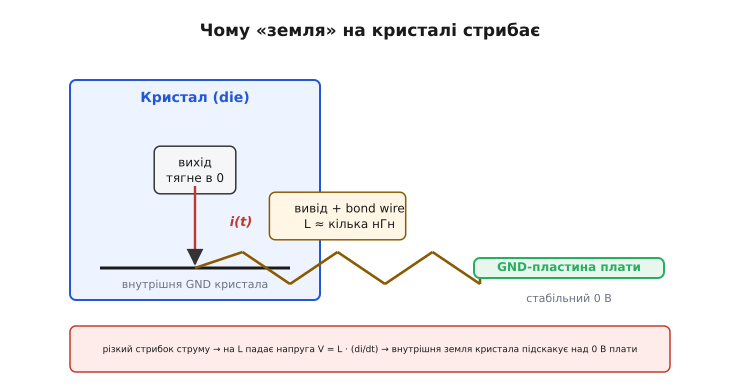
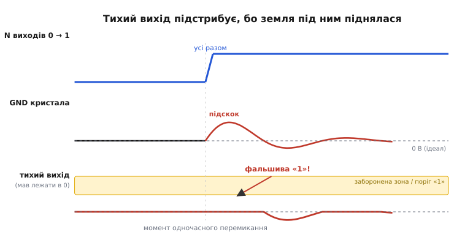

# Стрибок землі (ground bounce)

Слово «земля» на схемі звучить як щось непорушне: нуль вольтів, спільна опора, від якої все відлічують. Ми ставимо GND і мовчки припускаємо, що це та сама тверда підлога скрізь — на платі, на ніжці мікросхеми, всередині кристала. Але підлога буває хистка. У певні короткі миті земля **всередині** чипа підскакує над землею плати на сотні мілівольтів, а буває — і за вольт. І робить це вона саме тоді, коли шкодить найдужче: у момент, коли кристал перемикає багато виходів одночасно. Цей підскок і звуть **стрибком землі** (*ground bounce* — «підстрибування землі»). Розберімо, **чому** непорушна на вигляд земля стрибає, **коли** саме, чим це небезпечно для тихого сусіднього виходу — і якими важелями стрибок притискають.

## Земля не одна: вона з'єднана дротиком

Почнімо з того, що ламає інтуїцію. Ми кажемо «земля мікросхеми» так, ніби це один вузол. Насправді земляних вузлів **два**, і між ними — провідник.

Є земля **плати**: широка мідна пластина (*ground plane*), до якої припаяні всі корпуси. Це справді стабільний нуль — велика площа, мала опора, купа конденсаторів поряд її тримають. І є земля **кристала** (die) — та внутрішня шина всередині кремнію, від якої логіка чипа реально відлічує свої нулі й одиниці. Ці дві землі з'єднані не безпосередньо: сигнал від кристала до ніжки корпусу біжить тонким золотим дротиком-перемичкою (*bond wire*), далі — металевим виводом корпусу, і лише тоді потрапляє на пластину плати.

А будь-який провідник, навіть найкоротший, має **індуктивність** (*inductance* — властивість опиратися зміні струму). Для короткого дротика вона крихітна — одиниці наногенрі (нГн, 10⁻⁹ Гн). У сталому режимі вона нічого не робить: постійний струм тече крізь неї без жодної напруги. Проблема в тому, що індуктивність реагує не на сам струм, а на **швидкість його зміни**:

```
V = L · (di/dt)
```

Напруга на індуктивності дорівнює її величині L, помноженій на те, **як швидко міняється струм** (di/dt). Стоїть струм на місці — падіння нуль. Але щойно струм смикнувся — на дротику з'являється напруга. І ця напруга буквально **піднімає** землю кристала над землею плати: адже саме на цьому дротику вони й розділені.



*Дві різні землі, зшиті виводом із паразитною індуктивністю: у сталому струмі різниці нема, але різкий стрибок струму піднімає землю кристала над платою.*

## Звідки береться різкий струм

Лишилося зрозуміти, **звідки** береться той різкий смик струму. І тут головний винуватець — сам акт перемикання виходу.

Коли цифровий вихід перемикає лінію з 1 у 0, він **скидає** заряд, накопичений на ємності лінії (доріжка, вхід приймача, паразитні ємності), у землю кристала. Це короткий, але потужний імпульс струму: десятки міліампер за одиниці наносекунд. Що [крутіший фронт перемикання](root:hw-digital/edges-rise-time) — то за коротший час протікає той самий заряд, то більший di/dt, то вищий стрибок землі. Ось чому швидкі логічні родини страждають найдужче: їхня перевага (гострий фронт) — це і є їхня біда.

> 🔧 **Навіщо це.** Тому «зробити фронт якнайкрутішим» — не завжди добре. Драйвер, що перемикає різко, і землю смикає різко. Саме тому в мікросхемах є біти [керування крутістю фронту](root:hw-digital/slew-rate-control): навмисне пригальмувати перехід — це навмисне зменшити di/dt, а отже, і стрибок землі. Швидкість, яка нікому не потрібна, — це шум, за який усі платять.

Один вихід дає невеликий підскок. Але виходів на чипі багато — 8, 16, 32 лінії шини. І от коли **всі вони перемикаються одночасно** (типова ситуація: паралельна шина виставила новий байт, і половина ліній разом пішла 1→0), їхні струмові імпульси **складаються** й течуть крізь **той самий** спільний вивід землі. Струм у dротику вискакує в N разів більший, di/dt — теж, і стрибок землі росте пропорційно кількості виходів, що перемкнулися разом. Саме тому в інженерів є друга, точніша назва цього явища — **шум одночасного перемикання** (*Simultaneous Switching Noise*, SSN; або *Simultaneous Switching Output*, SSO): стрибок землі — це його найпомітніший бік. [Як оцінити величину підскоку за цифрами з даташита](root:hw-pcb/ground-bounce/math-bounce-magnitude.md) — окрема коротка викладка: скільки виходить у мілівольтах при типових L, струмі й фронті, і чому масштабування з N — ключ до розуміння, чому широкі шини найнебезпечніші.

## Чому страждає тихий сусід

Тепер найпідступніше. Здавалося б: ну підскочила земля разом із виходами, що перемикаються, — вони ж однаково рухаються, різниця між ними та їхньою землею збереглася. І це правда. Небезпека не в них, а в **тихому** сусідньому виході.

Уяви лінію, яка **не перемикається** — вона стабільно тримає логічний 0. «Тримати 0» означає: вихід притиснутий до землі **кристала**. Але приймач на іншому кінці лінії дивиться на цей рівень відносно землі **плати** — своєї, стабільної. І поки все спокійно, обидві землі збігаються, приймач бачить чистий нуль.

А тепер поряд перемкнулися 16 інших виходів, земля кристала підскочила на, скажімо, 0.8 В над платою — на короткий дзвінкий момент. Тихий вихід слухняно піднявся разом зі своєю землею, бо він до неї прив'язаний. Але приймач цього не знає: він бачить, що лінія, яка мала лежати в нулі, раптом стрибнула до 0.8 В над **його** нулем. А 0.8 В — це вже може бути вище [порога, за яким рівень читається як «1»](root:hw-digital/logic-thresholds). Приймач ловить **фальшиву одиницю** — короткий хибний імпульс на лінії, яка нічого не передавала.



*Стрибок землі перетворюється на хибний імпульс саме на тихій лінії: вона рухається разом зі своєю землею, а приймач міряє від своєї — і бачить неіснуючу «1».*

Ось чому стрибок землі такий підступний: збій виникає не там, де подія (перемикання шини), а на **сторонній** тихій лінії поряд. Найчастіші жертви — сигнали, для яких важливий кожен короткий імпульс: [тактовий сигнал](root:hw-digital/clock-signal), лінії скидання, входи-переривання, стробувальні сигнали. Хибний фронт на такті — це зайвий такт, який [лічильник](root:hw-digital/counters) або [тригер](root:hw-digital/d-flip-flop) сприймає як справжній, і схема ловить стан, якого не мало б бути.

**Приклад: оцінка величини стрибка.** Порахуймо порядок величини для типового CMOS-виходу.

```
Дано:  L  ≈ 10 нГн   (вивід + bond wire + доріжка до пластини)
       I  ≈ 50 мА    (піковий струм скидання ємності лінії)
       t  ≈ 2 нс     (за такий час струм наростає й спадає — гострий фронт)

Один вихід:
  di/dt ≈ I / t = 0.05 А / 2·10⁻⁹ с = 2.5·10⁷ А/с = 25 мА/нс
  V = L · di/dt = 10·10⁻⁹ · 2.5·10⁷ ≈ 0.25 В

Вісім виходів разом крізь ту саму землю:
  V ≈ 8 · 0.25 = 2.0 В   ← набагато вище будь-якого порога
```

Чверть вольта від одного виходу — ще стерпно, це в межах запасу. Але **вісім** одночасно дають два вольти на землі кристала — і тихий сусід гарантовано ловить фальшиву одиницю. Реальність трохи м'якша (не всі струми ідеально збігаються в часі, частина заряду встигає прийти з конденсаторів), але порядок саме такий: одиничний стрибок дрібний, груповий — руйнівний. Саме тому широкі паралельні шини — головна арена стрибка землі.

Цю недобру славу свого часу здобули швидкі логічні родини кінця 1980-х: коли з'явилися чипи з надгострими фронтами, а живлення в них досі підводили через кутові ніжки з найдовшими дротиками, [стрибок землі став гучною проблемою — на тихих виходах ловили за вольт шуму](root:hw-pcb/ground-bounce/hist-ac-family.md). Це історія про те, як гонитва за швидкістю випередила корпус, і як виробники відповіли новою розпіновкою живлення.

## Як притиснути стрибок

Уся боротьба зі стрибком землі — це боротьба з тими самими двома множниками у `V = L · (di/dt)`. Зменшуй L або зменшуй di/dt — стрибок падає. Інших важелів немає, і це дуже зручно: будь-який трюк, який роблять на практиці, зводиться до одного з двох.

**Бити по L — робити спільний шлях землі коротшим і товщим.**

- Найпряміше — **більше пінів землі й живлення**, розкиданих поряд із виходами. Кожен додатковий вивід — це ще одна індуктивність **паралельно**, а паралельні індуктивності зменшують загальну: два дротики замість одного — удвічі менша L. Тому чипи з широкими шинами мають не одну ніжку GND, а багато, рівномірно між сигналами.
- **Живлення ближче до кристала.** Стрибок породжує дротик між кристалом і платою; що він коротший — то менша L. Саме тому пізніші корпуси відмовилися від довгих кутових виводів на користь виводів прямо під кристалом.
- **Суцільна земляна пластина** замість тонких доріжок-«павука». Широка мідь має мізерну індуктивність; тонка звивиста доріжка — велику. Земля мусить бути площиною, а не ниткою.

**Бити по di/dt — не смикати струм так різко.**

- **Повільніший фронт.** Якщо додаток не потребує гострого краю — [пригальмуй крутість виходу](root:hw-digital/slew-rate-control). Той самий заряд, розтягнутий у часі, дає менший di/dt і менший стрибок. Це найдешевший важіль, коли швидкість зайва.
- **Не перемикати все одночасно.** Якщо є вибір — розведи фронти в часі, щоб піки струму не збігалися. Іноді навмисно ставлять невеликі затримки між лініями шини саме заради цього.
- **Конденсатор поряд.** [Розв'язувальний конденсатор](root:hw-components/decoupling) біля ніжок живлення тримає локальний запас заряду просто на кристалі: пік струму бере його з конденсатора за міліметри, а не з далекого джерела крізь довгі дротики. Це не прибирає стрибок повністю, але помітно його гасить, бо частина струму більше не мусить смикатися крізь індуктивний вивід.


*Два множники — два фронти боротьби: менша індуктивність спільного шляху землі й менша швидкість зміни струму. На практиці тиснуть на обидва.*

> 🔧 **Навіщо це.** Ці правила пояснюють дрібниці розведення плати, які інакше здаються забобоном: чому GND-пін не можна тягнути тонкою доріжкою через пів-плати, чому конденсатор ставлять **упритул** до ніжки живлення, а не «десь поряд», чому на швидкій шині лишають кілька земляних виводів між сигналами. Кожне з цих правил — це прицільний удар по L або по di/dt у формулі стрибка.

## Що лишається в голові

Стрибок землі — це нагадування, що «земля» на схемі й «земля» в кремнії — не завжди те саме. Дві землі зшиті провідником, провідник має індуктивність, а індуктивність оживає на різкому струмі: `V = L · (di/dt)`. Різкий струм дає перемикання виходів — і що більше їх спрацьовує **одночасно** крізь спільний вивід, то вищий підскок землі кристала над землею плати. Небезпека падає не на самі виходи-винуватці, а на **тихого сусіда**, який раптом здається приймачеві логічною одиницею. А вся оборона зводиться до двох множників: зробити спільний шлях землі коротшим і товщим (менша L) або перемикати м'якше й не все разом (менший di/dt). Хто це тримає в голові, той дивиться на скромний символ GND уже без ілюзії непорушності — і знає, куди поставити зайвий земляний пін і конденсатор, щоб хистка підлога не хитнулася в найгіршу мить.
