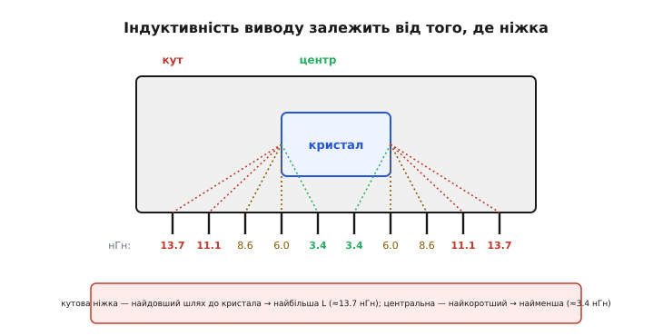

# 📜 Як швидка логіка кінця 1980-х здобула недобру славу

Стрибок землі не завжди був відомою проблемою. Ціле покоління інженерів проектувало на TTL і не думало про нього щодня — і мало причини не думати. А тоді, наприкінці 1980-х, з'явилися логічні родини, які цю проблему зробили гучною, майже скандальною: чипи, що на цілком тихому виході видавали за вольт шуму просто тому, що поряд перемкнулася шина. Це історія про те, як гонитва за швидкістю обігнала корпус мікросхеми, як виробники сперечалися про це на сторінках галузевої преси, і як одна елегантна відповідь — переставити живлення з кутів у центр — так до пуття й не прижилася. Історія усталена, добре задокументована самими виробниками; спірних атрибуцій тут немає, є інженерна драма.

## Чому старий TTL спав спокійно

Щоб зрозуміти, чому саме нові родини нарвалися на стрибок землі, треба спершу побачити, **чому старі його майже не помічали**. Річ не в тім, що фізика раптом змінилася — вона була та сама завжди. Змінилися дві речі: наскільки різко чип смикає струм і наскільки великий у нього розмах напруги.

Класичний TTL (транзисторно-транзисторна логіка) 1970-х — родини на кшталт 74LS — мав два рятівні для землі властивості. По-перше, його виходи гойдалися не від рейки до рейки: логічний нуль сидів десь коло 0.2 В, одиниця — коло 3.4 В, тобто повний розмах був близько трьох вольтів, а не всі п'ять. По-друге, фронти були відносно неквапні — одиниці-десятки наносекунд на перехід. А стрибок землі, як ми знаємо, живиться саме **швидкістю зміни струму** через індуктивність виводу:

```
V = −L · (di/dt)
```

Помірний розмах напруги означає помірний заряд, який треба перекинути; неквапний фронт означає, що цей заряд перекидається за довший час; а довший час — це менший di/dt. Обидва множники грали на боці спокою. TTL, звісно, теж давав якийсь підскок землі, але його амплітуда губилася в порівняно широких запасах завадостійкості біполярної логіки. Земля хиталася — та не настільки, щоб хтось будував навколо цього окрему науку.

> 🔧 **Навіщо це.** Ця історія — щеплення від наївного «швидше завжди краще». Той самий логічний вентиль, зроблений удвічі швидшим, не просто рахує швидше — він удвічі різкіше смикає спільну землю. Розуміння, що *швидкість фронту та шум землі — це одна медаль із двох боків*, лишається чинним і сьогодні, коли вибираєш між повільною й гострою родиною під конкретну плату.

## Швидкість, яку не встиг корпус

А тоді інженерія зробила саме те, що завжди робить — пришвидшила логіку. У середині 1980-х дозріла ідея, яка довго здавалася майже суперечливою: узяти CMOS (комплементарну структуру метал-оксид-напівпровідник), відому доти малим споживанням і невисокою швидкістю, і розігнати її до швидкостей найгарячішого біполярного TTL. Спершу з'явилася родина 74HC (High-speed CMOS — «швидкісний CMOS»), яка дотягнулася до швидкості 74LS. А слідом — **74AC** (Advanced CMOS — «просунутий CMOS») і її TTL-порогова сестра **74ACT**, які вже змагалися зі справді швидкими біполярними родинами 74F та 74AS.

Тут варто зупинитися на іменах і датах, бо їх легко переплутати. Родину FAST (**F**airchild **A**dvanced **S**chottky **T**TL) фірма Fairchild випустила ще 1978 року — це той самий біполярний 74F, гострий і швидкий, із затримкою вентиля близько 3.4 нс. А просунутий CMOS — це вже друга половина 1980-х: технологію FACT (Fairchild Advanced CMOS Technology) Fairchild подала близько 1985 року, і саме на ній виросли родини 74AC/74ACT. Дрібна деталь корпоративної історії пояснює плутанину з іменами виробників: Fairchild після 1979-го належала Schlumberger, а 1987-го її напівпровідникову частину купила National Semiconductor — тому той самий FACT-довідник виходив і під маркою Fairchild, і під маркою National. Технологію ж паралельно виготовляли за ліцензіями кілька фірм — Philips, Signetics, Texas Instruments, National — тож «просунутий CMOS» був справою галузі, а не одного заводу.

І от у чому фокус: CMOS-вихід гойдається **від рейки до рейки** — чистий нуль вольтів у нулі, повні п'ять вольтів в одиниці. Це на два вольти більший розмах, ніж у TTL. А фронти в 74AC вийшли надзвичайно гострими — переходи за одиниці наносекунд, драйвери з великим струмом, здатні прокачати навантажену лінію майже миттєво. Обидва множники, які колись присипляли землю, тепер працювали проти неї: більший розмах → більший заряд, гостріший фронт → коротший час → величезний di/dt. Кремній стрибнув уперед на ціле покоління за один крок. А корпус — ні.

Корпус лишився тим самим пластиковим DIP (dual in-line package — «корпус із двома рядами виводів»), у якому мікросхеми жили десятиліттями. І в ньому за традицією ще з часів перших 7400 живлення підводили через **кутові ніжки**: VCC — в одному куті, GND (земля) — у протилежному. Ця традиція мала свій резон у минулому — так було зручно розводити плату. Але для стрибка землі це була найгірша з можливих домовленостей.

## Чому саме кутова ніжка — найгірша

Щоб побачити, чому кутова ніжка так шкодить, треба уявити шлях струму **всередині** корпусу. Кристал сидить у центрі корпусу. Від краю кристала до кожної зовнішньої ніжки тягнеться тонкий золотий дротик-перемичка (bond wire), а далі — металевий вивід рамки корпусу. Що далі ніжка від центру — то довший цей внутрішній шлях, а довший провідник — це більша індуктивність. Кутова ніжка лежить якнайдалі від кристала, тож і дротик до неї найдовший, і індуктивність найбільша.

Скільки саме — Texas Instruments зміряла й опублікувала в своєму довіднику з просунутого CMOS 1988 року. Для двадцятививодного пластикового DIP індуктивність виводів залежно від позиції виявилася такою:

```
позиція ніжки        L, нГн (DIP-20)
кутова (1, 20)          13.7
                        11.1
                         8.6
                         6.0
центральна (5, 6)        3.4
```

Різниця — вчетверо. Кутова ніжка мала 13.7 нГн, центральна — 3.4 нГн. І саме через кутові ніжки, з найбільшою L, традиційно текли струми живлення й землі — тобто той самий струм, що смикається найрізкіше під час перемикання, проходив через найгіршу, найіндуктивнішу ділянку корпусу.



*Індуктивність виводу росте з довжиною дротика до кристала: кути — найгірші, центр — найкращий. Живлення за традицією підводили саме через кути.*

Помножте це на решту формули. Гострий фронт 74AC дає великий di/dt; вісім чи більше виходів октального буфера перемикаються синхронно, і їхні струми складаються в спільному виводі землі; а сам вивід має ті самі 13.7 нГн. Результат був не теоретичний, а лабораторний.

## Вольт шуму на тихому виході

Ось цифри, які й зробили стрибок землі гучним. TI прогнала стандартний тест одночасного перемикання: узяла октальний буфер-драйвер '244 (вісім виходів), сімом виходам дала синхронно перемкнутися, а один тримала притиснутим у нулі — і дивилася, який шум наведеться на цьому тихому, нібито мовчазному виході. Це класична проба, бо саме тихий сусід — головна жертва стрибка землі: він рухається разом зі своєю підскочилою землею, а приймач на іншому кінці лінії міряє від своєї, стабільної, і бачить хибний імпульс.

Результати для чужих чипів у стандартному корпусі з кутовим живленням:

```
корпус             шум на тихому виході
DIP-20 (кути)          2.24 В
SOIC (кути)            ≈1.82 В   (на 0.42 В менше)
```

Понад **два вольти** наведеного шуму на виході, який мав тихо лежати в нулі. Для CMOS із п'ятивольтовою рейкою це катастрофа: TI прямо зазначила, що спайк близько 2 В з'їдає майже 90% запасу завадостійкості й порушує граничну специфікацію VIL max — рівень, вище якого нуль уже не гарантовано читається як нуль. Тихий вихід, що стрибнув на два вольти, — це не «трохи шуму», це готовий фальшивий фронт. А якщо той тихий вихід ніс такт, скидання чи стробувальний сигнал — це збій системи.

Перехід на менший корпус SOIC (small-outline IC — «малий планарний корпус» для поверхневого монтажу) трохи допомагав: коротші виводи, менша індуктивність (кутові 4.2 нГн замість 13.7), і шум падав приблизно до 1.82 В. Помітно — але, як сухо констатувала TI, «це все ще не гарантує надійної роботи системи». Півтора вольта на тихій лінії — так само за межею.

І от цей факт вийшов за стіни лабораторій. У вересні 1988-го галузева газета EE Times присвятила цьому окремий матеріал (випуск від 29 вересня); той самий TI-довідник посилається на нього, коли пише про «перероблені розпіновки, які запровадили кілька виробників швидкого CMOS, щоб уникнути „стрибка землі“». Проблема з внутрішньої стала публічною: про неї писали, її обговорювали, виробники змагалися, у кого чип тихіший. Стрибок землі перетворився з дрібної технічної примітки на конкурентну перевагу.

## Відповідь: переставити живлення в центр

Тепер найцікавіше — що з цим зробили. Логіка відповіді випливає з формули напряму. Бити по di/dt складно: це властивість технології, гострі фронти — це і є те, за що 74AC купують. Отже, головний важіль — **L**. А найбільша частка L, як показали виміри, — це довжина дротика від виводу живлення до кристала. Висновок майже сам напрошується: заберіть живлення з кутів, де дротик найдовший, і посадіть його **в центр**, де він найкоротший.

Саме це й зробила Texas Instruments у своїй родині просунутого CMOS під маркою EPIC (Enhanced-Performance Implanted CMOS). Розпіновка нових чипів отримала **центральні виводи VCC і GND** — там, де індуктивність із 13.7 нГн падає до 3.4 нГн у DIP, а в SOIC ще нижче. Але саму центральну позицію TI поєднала з двома додатковими ходами.

Перший — **здвоєні й потроєні виводи живлення**. Кожен додатковий вивід землі — це ще одна індуктивність **паралельно** до попередніх, а паралельні індуктивності зменшують загальну: два дротики замість одного дають удвічі меншу L. TI виявила просту закономірність — амплітуда шуму прямо залежить від кількості виходів, що перемикаються, — і тому для функцій із трьома й більше виходами додала більше виводів VCC і GND. Наприклад, для двадцятиконтактних корпусів із багатьма виходами живлення розводилося на кілька центральних пінів замість однієї пари. У підсумку індуктивність шляху живлення обвалилася разюче: у DIP-20 із центральними множинними пінами вона склала **1.7 нГн для VCC і 1.1 нГн для GND** — проти 13.7 нГн у старій кутовій розпіновці. Майже вдесятеро.

Другий хід — **наскрізна («flow-through») архітектура виводів**: входи оточують піни VCC, виходи оточують піни GND, а керувальні сигнали виносяться на краї корпусу. Це не лише зменшувало індуктивність, а й спрощувало розведення плати — вхід і відповідний вихід опинялися на протилежних боках корпусу, сигнал ішов «наскрізь».


*Той самий вентиль, дві розпіновки: живлення з кутів (велика L, багато шуму) проти живлення в центрі зі здвоєними пінами (мала L, тихо). Ціна — несумісність зі стандартним 7400.*

Ці нові чипи отримали й окремий знак у назві: у номер вставляли цифри **11**. Звичайний октальний буфер називався 74AC244, а його тихий родич із центральним живленням — **74AC11244**; проста NAND-збірка — 74AC11000; тригери — 74AC11074. «11» посеред номера означало: це той самий логічний вентиль, але в новому, антистрибковому корпусі з іншою розпіновкою. Уся родина 74AC11xxx (і TTL-порогова 74ACT11xxx) — це і є та відповідь на стрибок землі.

І вона працювала. Той самий тест, що давав 2.24 В на чужому чипі, на TI-шному 74AC11244 у двадцятичотириконтактному DIP із двома пінами VCC і чотирма пінами GND у центрі показав приблизно **0.68–0.82 В** — уже в межах прийнятного. TI додала до цього ще й схемний трюк під назвою OEC (Output Edge Control — керування краєм виходу): вихідний транзистор ділили на багато дрібних секцій із послідовним, «градуйованим» умиканням, щоб той самий заряд наростав не одним різким стрибком, а сходинками — це збивало пік di/dt, злегка пригальмовуючи фронт без відчутної втрати швидкості. Це та сама ідея, що й сучасне [навмисне пригальмування крутості виходу](root:hw-digital/slew-rate-control), тільки зашита в кремній: розтягнути перехід у часі, щоб зменшити di/dt, — а отже, і стрибок землі, — свідомо жертвуючи зайвою швидкістю, якої додаток не потребує. Разом — центральне живлення (менша L) плюс градуйований фронт (менший di/dt) — обидва множники формули були приборкані одночасно.

TI була не сама. Той самий довідник прямо зазначає: «спільно з TI, Signetics/Philips також пропонує родину просунутого CMOS із центральною розпіновкою». Тобто це був справжній галузевий рух, а не примха одного виробника: кілька великих гравців незалежно дійшли того самого висновку й переставили живлення в центр.

## Чому елегантна відповідь не прижилася

І тут — найповчальніший поворот історії. Розв'язок був технічно бездоганний: виміри незаперечні, шум упав удесятеро, фізика чиста. А проте родина 74AC11xxx так і не стала стандартом. Сьогодні, коли інженер тягнеться за швидким CMOS, він майже завжди бере звичайний 74AC чи 74ACT — а не 74AC11xxx. Чому елегантне рішення програло?

Причина не в фізиці, а в **сумісності**. Уся сила серії 7400 за півстоліття виросла з однієї простої обіцянки: пінаут стандартний. Ти можеш узяти 74LS00, викинути й поставити на те саме місце 74HC00 чи 74AC00 — ніжки збігаються, плата не міняється, це drop-in заміна. Ця сумісність — не дрібниця, це фундамент, на якому тримається вся екосистема: бібліотеки корпусів, готові плати, звичка розробників, десятиліття напрацьованих схем. А розпіновка 74AC11xxx цю обіцянку **порушувала**. Живлення переїхало з кутів у центр — отже, ніжки більше не збігалися зі стандартним 7400. Це вже не drop-in: під новий чип треба нове розведення плати, часто в більшому корпусі з зайвими пінами живлення. Ти отримував тихішу землю ціною відмови від головної переваги всієї серії.

Для більшості проектів обмін виявився невигідним. Стрибок землі — проблема гостра, але **не всюдисуща**: вона кусає широкі синхронні шини, гарячі такти, критичні лінії — а на звичайній логіці помірної щільності з нею чудово справлялися дешевшими способами. Уважне розведення (суцільна земляна пластина, а не тонкі доріжки), розв'язувальний конденсатор упритул до ніжки живлення, а часом і просто вибір трохи повільнішої родини там, де гострий фронт не потрібен, — цього вистачало. А сам той схемний трюк із градуйованим фронтом (OEC) не вимагав нової розпіновки: пригальмувати край виходу можна було й у стандартному корпусі. Тобто більшу частину виграшу вдавалося зібрати, **не ламаючи** сумісності. Коли те саме можна отримати дешевше й без переробки плат, ринок голосує за звичне.

Так вийшов класичний випадок, коли **технічно найкраще рішення програло достатньо доброму й сумісному**. 74AC11xxx лишилися в каталогах як спеціалізований інструмент для тих небагатьох задач, де стрибок землі справді нестерпний і де готові платити несумісністю. А масовий інженер узяв звичайний 74AC, навчився ставити конденсатор ближче й тягнути землю пластиною — і на тому заспокоївся. Історія цієї родини — тиха пересторога всім, хто закохується у власне елегантне рішення: у реальному світі перемагає не те, що найчистіше на папері, а те, що найлегше вставити в те, що вже працює.

## Що лишилося

Недобра слава швидкої логіки кінця 1980-х дала галузі три речі, які пережили саму родину 74AC11xxx. По-перше, чітке ім'я й розуміння явища: **шум одночасного перемикання**, стрибок землі — тепер це стандартний пункт будь-якого курсу з цілісності сигналу, а не сюрприз для інженера. По-друге, звичку класти багато виводів землі й живлення поряд із сигналами та тримати їх якнайближче до кристала — це перекочувало в усі сучасні швидкі корпуси, від процесорів до FPGA, просто вже без окремої рекламної назви. І по-третє — той самий OEC-трюк із керованим краєм виходу, який сьогодні живе в кожній сучасній родині як «біт вибору швидкості фронту»: навмисне пригальмувати вихід, коли гострота не потрібна.

А сама історія лишається взірцевою ілюстрацією того, як тісно сплетені швидкість і шум. Логіка стала швидшою за один крок на ціле покоління — і виявилося, що корпус, який десятиліттями всіх влаштовував, раптом став вузьким місцем. Виробники дали красиву відповідь — і ринок її переважно відхилив, бо вона коштувала занадто дорогою валютою — сумісністю. Наступного разу, коли на схемі трапиться скромний 74AC зі звичайним пінаутом, варто згадати: колись існував його тихіший, розумніший брат — і програв саме тому, що був іншим.
