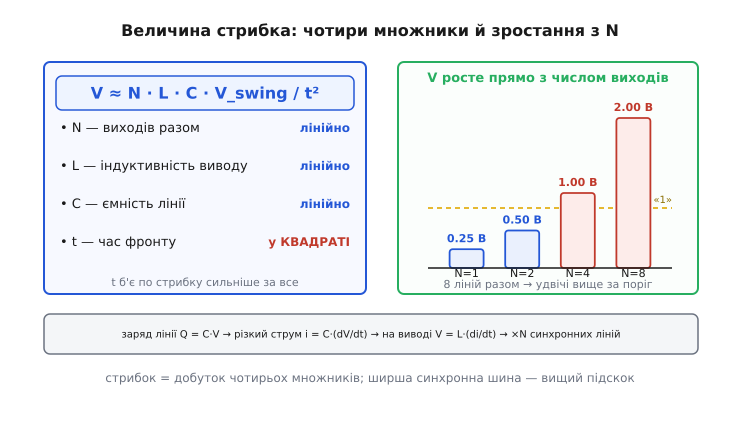

# 🧮 Скільки вольтів у стрибку землі

Стаття про стрибок землі тримається на одному короткому рядку: `V = L · (di/dt)`. Це вірно й корисно, але доки в ньому лишаються дві невідомі літери, воно нічого не передбачає. Скільки насправді буде — сотня мілівольтів чи два вольти? Від чого це залежить лінійно, а від чого квадратично? Чому інженери бояться саме широких шин, а не швидких поодиноких ліній? І чому проста арифметика «склади струми й помнож на індуктивність» завжди дає число, трохи більше за виміряне на осцилографі?

Тут ми зберемо величину стрибка **з нуля** — від заряду на ємності лінії до мілівольтів на землі кристала — так, щоб кожна цифра мала походження, а не бралася зі стелі. Наприкінці ти зможеш глянути на рядок даташита й на власне око сказати, скільки вольтів принесе шина, коли вона смикнеться вся разом.

## Що ми взагалі рахуємо

Спершу домовмося, **яку саме напругу** ми шукаємо, бо в цьому вся суть — і саме тут найлегше заплутатися.

Земляних вузлів два. Є земля **плати** — широка мідна пластина, справжній стабільний нуль. І є земля **кристала** (die) — внутрішня шина в кремнії, від якої логіка чипа фізично відлічує свої рівні. Між ними — вивід корпусу з паразитною індуктивністю. Шукана величина — це **різниця потенціалів між цими двома землями** в момент перемикання:

```
V_bounce = φ(земля кристала) − φ(земля плати)
```

Чому саме ця різниця вирішує все? Бо логічний вихід, коли тримає нуль, притискає лінію до землі **кристала** — це його опора. А приймач на іншому кінці міряє рівень на лінії відносно землі **плати** — своєї опори. Поки обидві землі збігаються, нуль є нулем. Щойно земля кристала підскочила на V_bounce над платою — тиха лінія, прив'язана до неї, теж піднялася на V_bounce у **системі відліку приймача**, хоча «за задумом» мала лежати в нулі. Ось чому вся небезпека — це буквально **падіння напруги на спільному виводі землі**: приймач бачить його як зсув чужого сигналу.

> 🔧 **Навіщо це.** З цього одразу випливає, що міряти стрибок треба **не на землі плати** (там його майже нема — пластина стабільна) і **не всередині кристала** (туди щупом не дістатися), а як **різницю**. На практиці цю різницю ловлять на тихому виводі: ставлять на нього стабільний нуль і дивляться, наскільки він підстрибне, коли поряд перемкнеться шина. Те, що ти побачиш на щупі, — і є V_bounce, спроєктований на лінію.

Отже, мета: знайти V_bounce. Формула вже є — `V = L · (di/dt)`. Лишилося чесно здобути обидва множники.

## Перша цегла: чому взагалі L·(di/dt)

Індуктивність (*inductance*, від лат. *inducere* — «наводити») — це властивість провідника опиратися **зміні** струму крізь себе. Не струму, а саме його зміні. Механізм фізичний: струм створює навколо провідника магнітне поле; змінюється струм — змінюється поле; змінне поле наводить у самому провіднику напругу, спрямовану **проти** зміни (закон електромагнітної індукції). Кількісно цей опір зміні й задає рядок:

```
V = L · (di/dt)
```

Прочитаймо його по-людськи. Ліворуч — напруга, що з'являється на кінцях провідника. Праворуч — добуток двох речей: **скільки** індуктивності (L, у генрі) і **як швидко** міняється струм крізь неї (di/dt, в амперах за секунду). Стоїть струм на місці — di/dt = 0 — напруги нема, хоч би яким великим був сам струм: постійний струм тече крізь ідеальну котушку без жодного падіння. Смикнувся струм — на провіднику миттєво виросла напруга, тим більша, чим різкіший смик.

Розмірність сходиться й підтверджує сенс:

```
[L]·[di/dt] = Гн · (А/с) = (В·с/А) · (А/с) = В
```

Генрі за визначенням — це «вольт-секунда на ампер» (така індуктивність, що зміна струму на 1 А за 1 с дає 1 В). Помножили на «ампер за секунду» — секунди й ампери скоротилися, лишилися чисті вольти. Формула не з повітря: це просто означення генрі, розгорнуте назад.

Для нашого спільного виводу землі L — крихітна. Золотий дротик-перемичка (*bond wire*) плюс металевий вивід корпусу плюс коротка доріжка до пластини — разом одиниці наногенрі, 10⁻⁹ Гн. У сталому режимі ця дрібнота спить. Її будить лише **різкий** струм. А різкий струм у цифрового виходу буває рівно тоді, коли він перемикається.

## Друга цегла: звідки береться di/dt

Тепер найцікавіше — здобути di/dt, не вгадуючи його, а вивівши з того, що чип реально робить. А робить він просте: **перезаряджає ємність лінії**.

Кожна цифрова лінія — це не абстрактний дріт, а **конденсатор**. Доріжка над пластиною, вхідна ємність приймача, паразитні ємності корпусу — усе це разом дає ємність навантаження C_L, зазвичай десятки пікофарад (пФ, 10⁻¹² Ф). Логічний рівень на лінії — це заряд на цьому конденсаторі. «Одиниця» — конденсатор заряджений до напруги живлення; «нуль» — розряджений у землю.

Коли вихід перемикає лінію з 1 у 0, він **скидає** весь цей заряд у землю кристала. Скільки заряду? Це знову означення — тепер ємності:

```
Q = C_L · V_swing
```

Заряд Q, що треба зняти, дорівнює ємності лінії, помноженій на розмах напруги V_swing (перепад між рівнями, зазвичай близький до напруги живлення). Ось перший місток до струму: **струм — це заряд за одиницю часу**. Якщо весь заряд Q іде в землю за час фронту t, то середній струм скидання — просто Q/t.

Але нам потрібен не середній струм, а di/dt — швидкість його зміни. Зв'яжімо їх через ту саму ємність, тепер у диференціальному вигляді. Струм у конденсатор (чи з нього) — це:

```
i = C_L · (dV/dt)
```

Це те саме `Q = C·V`, лише продиференційоване в часі: як швидко міняється заряд (тобто струм), так само як швидко міняється напруга на конденсаторі (dV/dt), з коефіцієнтом C_L. Читається прозоро: **щоб швидко змінити напругу на конденсаторі, треба великий струм**. Хочеш перекинути лінію за 2 нс замість 20 — жени вдесятеро більший струм. Ось де народжується різкість: гострий фронт (велике dV/dt) **вимагає** великого струму, і то струму, що вискакує з нуля до піка й падає назад за одиниці наносекунд.

Тепер зберімо di/dt. Фронт триває час t; за цей час струм наростає від нуля до піка i_pik і спадає назад. Груба, але чесна оцінка швидкості зміни:

```
di/dt ≈ i_pik / t
```

А пікове значення струму отримаємо з `i = C·(dV/dt)`, оцінивши dV/dt як «увесь розмах за час фронту», V_swing/t:

```
i_pik ≈ C_L · (V_swing / t)
```

Підставмо одне в одне й побачимо, від чого насправді залежить di/dt поодинокого виходу:

```
di/dt ≈ i_pik / t ≈ C_L · V_swing / t²
```

Ось перше нетривіальне відкриття цієї викладки: **di/dt росте не як 1/t, а як 1/t²**. Час фронту входить у квадраті. Скоротив фронт удвічі — di/dt вискочив у **чотири** рази, і стрибок землі — теж у чотири. Це і є математична причина, чому швидкі логічні родини так болюче поплатилися за свою гостроту: їхня перевага (малий t) б'є по стрибку **квадратично**, а не лінійно. Гонитва за наносекундами — це гонитва проти квадрата.

> 🔧 **Навіщо це.** Квадрат у знаменнику — це чому [керування крутістю фронту](topic:hw-digital/slew-rate-control) працює так добре. Розтягнув фронт удвічі (свідомо пригальмував вихід) — і стрибок землі впав учетверо, а не вдвічі, як здається на перший погляд. Один параметр, за який мало хто платить, коли швидкість зайва, гасить шум із квадратичною силою. Тому перше, що роблять із «дзвінкою» шиною, якій не потрібна гострота, — вмикають повільніший драйвер.

## Третя цегла: множник N — чому широкі шини найнебезпечніші

Поки що ми рахували **один** вихід. Але вся драма стрибка землі — у слові «одночасно».

Виходів на чипі багато: 8, 16, 32 лінії шини. Коли шина виставляє новий байт, добра половина ліній перемикається **в одну мить** — типово, коли попередній байт і новий різняться на багато бітів. І кожен із цих виходів скидає свій заряд крізь **той самий** спільний вивід землі. Струми не течуть окремими шляхами — вони **зливаються** в одному дротику.

А раз шлях спільний, струми **додаються** ще до того, як дійдуть до індуктивності. Якщо N виходів перемикаються синхронно, повний струм крізь вивід — це сума N однакових імпульсів, і швидкість його зміни — теж у N разів більша:

```
(di/dt)_повне ≈ N · (di/dt)_один
```

Індуктивність спільного виводу L при цьому одна на всіх — вона не ділиться між виходами, бо дротик фізично один. Тому напруга на ньому масштабується напряму:

```
V_bounce ≈ L · N · (di/dt)_один ≈ N · L · C_L · V_swing / t²
```

Ось повна формула стрибка землі, зібрана з першопринципів. Прочитаймо, від чого він залежить і **як сильно**:

- **N (кількість одночасних виходів)** — лінійно. Удвічі ширша шина — удвічі вищий стрибок. Це найпряміший і найбезжальніший множник, і саме він робить широкі паралельні шини головною ареною біди: 32-бітна шина, що перемкнулася вся, дає стрибок у 32 рази вищий за одну лінію.
- **L (індуктивність спільного шляху)** — лінійно. Один спільний вивід на всю шину — найгірше; кілька виводів землі паралельно зменшують L.
- **C_L (ємність лінії)** — лінійно. Довша доріжка, більше приймачів на лінії — більший заряд треба смикнути.
- **t (час фронту)** — обернено-квадратично. Найпідступніший множник: гостріший фронт б'є по стрибку у квадраті.

Ці чотири літери — увесь стрибок землі. Будь-який трюк розведення плати, будь-який біт у драйвері, будь-яка порада «постав ще один земляний пін» — це прицільний удар по одному з цих чотирьох. Інших важелів у формулі просто немає.



*Величина стрибка — добуток чотирьох множників; час фронту входить у квадраті, а кількість одночасних виходів множить усе лінійно, тож саме широка синхронна шина дає найвищий підскок.*

## Числовий приклад: збираємо мілівольти

Тепер від літер до цифр. Візьмімо типові значення для CMOS-виходу середньої швидкості й пройдімо весь ланцюг — від заряду до вольтів на землі — не пропускаючи жодної ланки.

**Умова: 8-бітна шина CMOS перемикається вся разом з 1 у 0.**

```
Дано:
  C_L      ≈ 20 пФ    = 20·10⁻¹² Ф   (доріжка + вхід приймача + паразитки)
  V_swing  ≈ 5 В                      (розмах, близький до живлення)
  t        ≈ 2 нс     = 2·10⁻⁹ с      (час фронту — гострий край)
  L        ≈ 10 нГн   = 10·10⁻⁹ Гн    (вивід + bond wire + доріжка до пластини)
  N        = 8                         (усі 8 ліній шини разом)

Крок 1 — заряд, що треба скинути з однієї лінії:
  Q = C_L · V_swing = 20·10⁻¹² · 5 = 100·10⁻¹² Кл = 100 пКл

Крок 2 — піковий струм скидання (i = C·dV/dt, оцінка dV/dt = V_swing/t):
  i_pik ≈ C_L · V_swing / t = 100·10⁻¹² / 2·10⁻⁹ = 0.05 А = 50 мА

Крок 3 — швидкість зміни струму на фронті (di/dt ≈ i_pik/t):
  di/dt ≈ 50·10⁻³ / 2·10⁻⁹ = 2.5·10⁷ А/с = 25 мА/нс

Крок 4 — стрибок від ОДНОГО виходу:
  V₁ = L · di/dt = 10·10⁻⁹ · 2.5·10⁷ = 0.25 В = 250 мВ

Крок 5 — вісім виходів крізь ту саму землю:
  V_bounce ≈ N · V₁ = 8 · 0.25 = 2.0 В
```

Зупинімося на цих числах, бо вони показові. Один вихід дає **чверть вольта** — прикро, але в межах запасу завадостійкості; тиха лінія це переживе. А **вісім** одночасно дають **два вольти** на землі кристала — і це вже вище будь-якого логічного порога з великим запасом. Тиха сусідня лінія, що мала лежати в нулі, у системі відліку приймача стрибає на два вольти вгору й **гарантовано** читається як фальшива одиниця. Різниця між «стерпно» і «руйнівно» — це той самий множник N: не природа виходу змінилася, а те, що їх спрацювало вісім замість одного.

Зверни увагу на внутрішню узгодженість: піковий струм 50 мА, який ми взяли «з голови» в основній статті, тут **вивівся** з ємності лінії — 20 пФ, перекинутих на 5 В за 2 нс, і дають рівно ці 50 мА. Цифри не підганялися; вони випливають одна з одної.

## Чому реальність трохи м'якша за цю суму

Формула `V ≈ N · L · (di/dt)` — це **верхня оцінка**, стеля. Реальний осцилограф майже завжди покаже менше за ідеальні два вольти. Причин дві, і обидві варто розуміти, бо вони показують, де саме модель спрощує.

**Перша: фронти не збігаються ідеально.** Наша сума N·V₁ припускає, що всі вісім піків струму настали в **одну й ту саму** наносекунду. Насправді виходи перемикаються з мікроскопічним розкидом у часі — через різні довжини внутрішніх доріжок, різне навантаження на лініях, тепловий і технологічний розкид самих транзисторів. Піки струму розмазуються по часу, їхня сума **розтягується** й **сплощується**: та сама площа під кривою (той самий сумарний заряд), але нижчий і ширший горб. А стрибок реагує на **висоту** піка di/dt, не на площу. Тому сумарний di/dt виходить меншим за ідеальну суму — часом помітно. Формально: якби всі N фронтів настали строго синхронно, ми мали б повне N·(di/dt); розкид у часі знижує цей коефіцієнт від N до чогось на кшталт (0.6…0.9)·N, залежно від того, наскільки щільно чип синхронізує свої виходи.

**Друга: частина струму приходить не крізь довгий вивід, а з конденсатора поряд.** Пік струму треба звідкись узяти. Якщо біля ніжок живлення стоїть [розв'язувальний конденсатор](topic:hw-components/decoupling), він тримає локальний запас заряду просто на кристалі — і віддає його за міліметри, а не тягне крізь довгий індуктивний вивід від далекого джерела. Та частина піка, яку взяв конденсатор, **не смикається** крізь L спільного виводу — а отже, не дає падіння L·(di/dt). Конденсатор фактично **шунтує** частину імпульсу повз індуктивність. Він не прибирає стрибок повністю (миттєвий пік усе одно частково йде крізь вивід, бо й до конденсатора є своя маленька індуктивність доріжки), але помітно збиває його висоту.

Обидві поправки діють в один бік — **вниз** від ідеальної суми. Тому практичне правило таке: формула `N · L · (di/dt)` дає **найгірший випадок**, і це добре — краще проєктувати із запасом, ніж недооцінити. Якщо навіть верхня оцінка вкладається в запас завадостійкості — спиш спокійно. Якщо стеля пробиває поріг, як наші два вольти, — треба тиснути на множники, бо реальність хоч і м'якша, але не настільки, щоб урятувати.

## Стеля через заряд: перевірка з іншого боку

Є ще один спосіб оцінити стрибок — не через di/dt, а через **повний заряд**, який мусить пройти крізь вивід. Він корисний як незалежна перевірка: якщо два різні шляхи дають той самий порядок, ми не помилилися в множнику.

Індуктивність накопичує «магнітний заряд» — потік, пов'язаний зі струмом. Повна зміна струму крізь вивід за перемикання — від нуля до N·i_pik і назад — вимагає, щоб на L з'явилася напруга, а її інтеграл за час фронту дорівнював зміні потоку. Але простіше міркувати так: увесь заряд однієї лінії Q = C_L·V_swing = 100 пКл проходить крізь вивід за час t = 2 нс, а для N ліній — N·Q за той самий час. Середній струм крізь вивід:

```
i_сер = N · Q / t = 8 · 100·10⁻¹² / 2·10⁻⁹ = 0.4 А = 400 мА
```

Це середній струм; пік вищий приблизно вдвічі (струм наростає й спадає трикутником), тобто близько 0.8 А, а швидкість його зміни на фронті — під 0.4 А/нс. Помножимо на L:

```
V ≈ L · (i_pik / t) = 10·10⁻⁹ · (0.8 / 2·10⁻⁹) ≈ 4 В (пік-до-піка розмаху)
```

Число вийшло того ж порядку, що й наші 2 В (тут ми оцінили розмах пік-до-піка, а раніше — амплітуду підскоку; вони різняться приблизно вдвічі). Головне — **обидва підходи дають одиниці вольтів, а не десятки мілівольтів і не десятки вольтів**. Порядок стійкий, звідки б ми не заходили: одиничний вихід дає сотні мілівольтів, широка синхронна шина — одиниці вольтів. Саме тому 500 мА/нс і більше сумарного di/dt на спільному виводі — не рідкість для широких шин, а звична цифра з практики.

## Дзвін: чому стрибок не просто підскок, а осциляція

Останній штрих до величини. На осцилографі стрибок землі виглядає не як чистий горб, що піднявся й опустився, а як **затухаюча осциляція** — підскочив, задзвенів, згас. Звідки дзвін?

Бо в шляху є не лише індуктивність, а й ємність — і разом вони утворюють **коливальний контур**. Індуктивність виводу L, ємність кристала між живленням і землею (та ж, що тримає локальний заряд), плюс ємність розв'язувального конденсатора — це LC-ланка. Різкий імпульс струму штовхає її, і вона відгукується власною частотою, як дзвін від удару:

```
f ≈ 1 / (2π · √(L · C))
```

Для типових L у одиниці нГн і C у сотні пФ ця частота — сотні мегагерців. Осциляція затухає завдяки опору шляху (доріжки, виводи мають свій маленький активний опір, який гасить коливання): що менша повна індуктивність петлі й більший опір, то швидше дзвін гасне. Якщо петля коротка й ємність достатня, коливання гаситься за один-два періоди; якщо шлях до конденсатора довгий, L велика — контур виходить високодобротний, і дзвін тягнеться довго, роблячи гірше, ніж узагалі без конденсатора.

Для оцінки **амплітуди** стрибка дзвін не змінює головного: перший, найвищий підскок задає саме `V = L · (di/dt)`, і саме він пробиває поріг. Але розуміти природу дзвону важливо, бо вона пояснює, чому [конденсатор треба ставити впритул](topic:hw-components/decoupling) до ніжки живлення: далекий конденсатор не гасить дзвін, а **розгойдує** його, додаючи індуктивність довгої доріжки в контур. Величина стрибка — це висота першого підскоку; дзвін — це його хвіст, і хвіст буває не менш шкідливим, бо кожен його горб — ще одна нагода зловити фальшивий фронт.

## Що лишається в руках

Уся арифметика стрибка землі складається в один зібраний рядок, який тепер має **походження**, а не береться як заклинання:

```
V_bounce ≈ N · L · C_L · V_swing / t²
```

Чотири множники, кожен зі своєю вагою: кількість одночасних виходів N і індуктивність спільного виводу L та ємність лінії C_L входять лінійно, а час фронту t — у квадраті. Стрибок народжується з простого факту, що перекинути напругу на конденсаторі лінії за наносекунди можна лише різким струмом (`i = C·dV/dt`), а різкий струм на паразитній індуктивності виводу дає напругу (`V = L·di/dt`), яка розводить землю кристала й землю плати. Помнож на кількість ліній, що смикнулися разом, — і дрібний підскок одного виходу стає руйнівним стрибком широкої шини.

Числа тримаються в межах одиниць вольтів для синхронної шини й сотень мілівольтів для поодинокого виходу — і цей порядок стійкий, звідки б ти не заходив, через di/dt чи через повний заряд. Реальність трохи м'якша за ідеальну суму (фронти розходяться в часі, конденсатор підживлює пік повз індуктивність), але формула чесно дає стелю — найгірший випадок, за яким і треба проєктувати. Хто тримає ці чотири літери в голові, той дивиться на даташит шини вже не з тривогою, а з калькулятором: скільки ліній, який фронт, скільки виводів землі — і чи вкладеться стеля в запас, чи час ставити ще один пін і конденсатор упритул.
