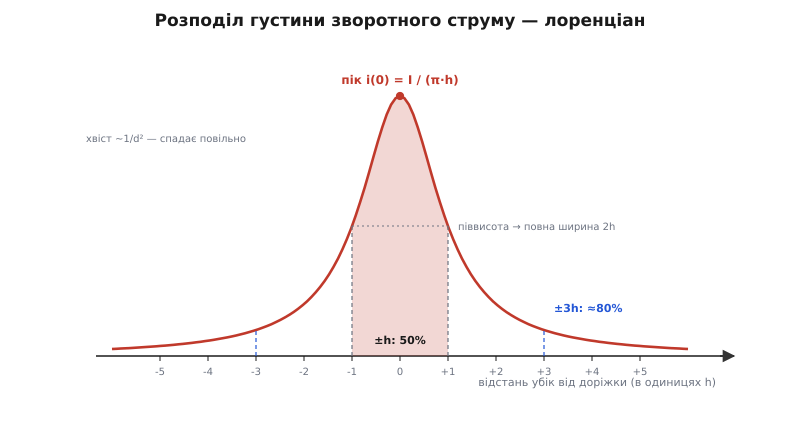
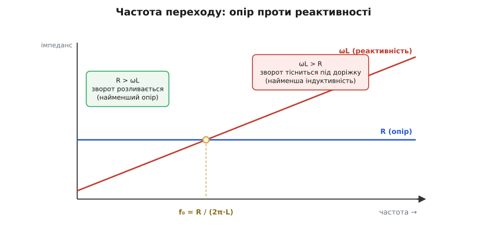
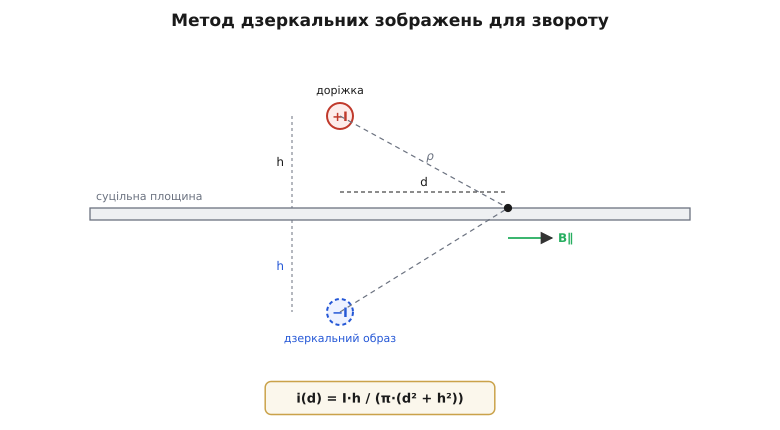

# 🧮 Чому зворот тулиться під доріжку

<preknowlist>
- [Індуктивність](topic:ph-electromagnetism/inductance) — площа контуру дає паразитну котушку L, а різкий струм на ній — викид V = L·di/dt.
- [Магнітне поле](topic:ph-electromagnetism/magnetic-field) — навколо прямого струму поле кільцями, B = μ₀·I/(2π·r) на відстані r від проводу.
- [Реактивність](topic:hw-components/reactance) — індуктивний опір ωL росте з частотою: на постійному струмі його нема, на високій він домінує.
</preknowlist>

Твердження «на високій частоті зворотний струм біжить точно під доріжкою» звучить як магія: мідь суцільна, струмові дозволено розтектися будь-куди в площині — а він раптом стягується у вузьку смужку. Ніхто його туди не заганяє. Отже, або твердження неточне, або за ним стоїть кількісний закон, який каже **де саме** й **скільки** струму тече. Він стоїть — і він напрочуд простий. Розберімо його від першопричини: спершу точно спитаймо, що ми міряємо, тоді виведемо форму розподілу з магнітостатики, а вже наприкінці побачимо, коли цей режим вмикається і чому розріз у міді його руйнує.

## Що саме ми питаємо

Уявімо нескінченно довгу доріжку, що несе струм I на висоті h над суцільною площиною. Струм мусить кудись вертатися; він вертається площиною. Але площина широка, а струм — один. Тож у площині виникає **розподіл**: під самою доріжкою густо, обабіч дедалі рідше. Опишімо його густиною зворотного струму `i(d)` — скільки ампер звороту припадає на кожен міліметр ширини площини на відстані d убік від точки просто під доріжкою. Одиниця `i(d)` — ампер на метр (це поверхнева густина, лінійна, а не на квадрат).

Уся річ у формі цієї кривої. Якщо вона широка й пласка — струм розмазаний, контур великий, індуктивність висока. Якщо вузька й гостра — струм зібраний під доріжку, контур тісний, індуктивність мала. «Тулиться під доріжку» означає рівно одне: крива `i(d)` гостра. Наша задача — знайти її форму, а тоді порахувати, яка частка струму сидить у смузі завширшки в кілька h.

## Інтуїція: чому взагалі є розподіл, а не одна лінія

Чом би зворотові не зібратися в нескінченно тонку нитку точно під доріжкою — там же контур найтісніший? Бо тонка нитка має малий переріз, а отже великий опір, і — що важливіше на високій частоті — сусідні лінії струму **відштовхуються** власним магнітним полем. Стиснути весь зворот в одну лінію означало б напхати паралельні струми впритул, а їхнє поле цьому опирається. З іншого боку, розповзтися нескінченно широко теж невигідно: далекі лінії звороту утворюють із доріжкою величезні контури з великим потоком, тобто велику індуктивність. Розподіл `i(d)` — це компроміс, який природа знаходить сама: досить тісно, щоб контур був малий, але не тісніше, ніж дозволяє відштовхування. Знайти цей компроміс точно — робота магнітостатики, і вона дає навдивовижу чисту відповідь.

## Формальний апарат: дзеркальний струм

Пряма атака — розв'язувати рівняння поля над провідною площиною — важка. Але є трюк, що обертає задачу на елементарну: [метод дзеркальних зображень](topic:ph-electromagnetism/image-theory). Ідея така. Суцільний провідник на змінному струмі поле в себе не пускає: магнітний потік не проходить крізь товщу міді, тож **нормальна** до площини складова поля на її поверхні дорівнює нулю. Це гранична умова. І виявляється, що поле над площиною з такою умовою тотожне полю двох проводів у вільному просторі: справжнього струму +I на висоті +h і його **дзеркального образу** — струму −I на глибині −h. Площину прибираємо, образ ставимо; поле згори не змінюється. Провідник ми замінили на один уявний провід-близнюк із протилежним струмом.

> 🔧 **Навіщо це.** Дзеркальний образ — не хитрий фокус для іспиту, а робочий інструмент проєктувальника. Щойно ви уявили зворот як образ −I на тій самій глибині, стає очевидним усе інше: контур «доріжка + образ» має висоту 2h, тож індуктивність тим менша, чим ближча площина; а прибрати мідь під доріжкою (розрізом) — це відсунути образ, роздути контур. Одна картинка образу заміняє півсторінки формул.

Тепер порахуймо поле на поверхні площини, у точці на відстані d від точки просто під доріжкою. Кожен із двох проводів — справжній і образ — стоїть на однаковій відстані ρ = √(d² + h²) від цієї точки. Поле прямого струму спадає як 1/ρ (це закон для прямого проводу, B = μ₀·I/(2π·ρ)), і напрямлене кільцем довкола проводу. Розкладімо кожне поле на складову вздовж площини (горизонтальну) і поперек (вертикальну).

Ключ — у симетрії. Справжній струм +I і образ −I стоять дзеркально по різні боки площини, а струми в них протилежні. Через це їхні **вертикальні** складові поля в точці на площині гасяться (саме цього ми й хотіли: нормальне поле нуль), а **горизонтальні** — додаються. Склавши їх, дістаємо тангенційне поле вздовж площини:

```text
B_∥(d) = 2 · (μ₀·I / 2π·ρ) · (h/ρ) = μ₀·I·h / (π·(d² + h²))
```

множник h/ρ — це проєкція поля на горизонталь (косинус кута між напрямком поля й площиною). А поверхнева густина струму в провіднику дорівнює тангенційному полю на його поверхні, поділеному на μ₀ (це та сама гранична умова, що зв'язує стрибок поля з поверхневим струмом):

```text
i(d) = B_∥(d) / μ₀ = I·h / (π·(d² + h²))
```

Винесімо h за дужки — і форма стає прозорою:

```text
              I        1
   i(d)  =  ─────  ·  ───────────
             π·h       1 + (d/h)²
```

Це і є відповідь. Крива зветься **лоренціаном** (за формою резонансного піка) або розподілом Коші. Під самою доріжкою (d = 0) густина максимальна, `i(0) = I/(π·h)`; далі вона спадає, і — от що важливо — падає до **половини** піка там, де (d/h)² = 1, тобто на d = ±h. Уся ширина піка на його піввисоті — рівно **2h**. Форма кривої задана єдиним параметром: висотою h. Нижча площина під доріжкою (тонший діелектрик) — вищий, гостріший пік; вища — ширший, пласкіший. Проєктувальник керує тіснотою звороту буквально товщиною діелектрика.


*Форма розподілу `i(d) = (I/π·h)·1/(1+(d/h)²)`. Пік під доріжкою, повна ширина на піввисоті — 2h. Заштрихована смуга ±h тримає рівно половину звороту, смуга ±3h — близько 80%. Хвіст важкий: він спадає повільно, тож частину струму завжди винесено далеко вбік.*

Перевірмо, що ми не загубили й не вигадали струму: проінтегруймо `i(d)` по всій ширині площини. Інтеграл лоренціана береться точно — це арктангенс:

```text
∫ i(d) dd  (від −∞ до +∞)  =  (I/π) · [arctan(d/h)]  =  (I/π) · π  =  I
```

Уся крива несе рівно I — весь зворотний струм, ані ампера більше. Форму ми вгадали не на око: вона єдина, що і задовольняє граничну умову провідника, і повертає повний струм.

### Скільки струму в смузі ±3h

Тепер до головного числа. Яка частка звороту тече в смузі ±d₀ обабіч доріжки? Той самий інтеграл, лише в скінченних межах:

```text
          d₀                          
   1  ∫  i(d) dd   =   (2/π) · arctan(d₀/h)
   I  −d₀                         
```

Підставмо круглі кратні h:

```text
смуга ±h  :  (2/π)·arctan(1)  = (2/π)·(π/4) = 0.500  →  50 %
смуга ±3h :  (2/π)·arctan(3)  = (2/π)·1.249  = 0.795  →  ≈ 80 %
смуга ±5h :  (2/π)·arctan(5)  = (2/π)·1.373  = 0.874  →  ≈ 87 %
смуга ±10h:  (2/π)·arctan(10) = (2/π)·1.471  = 0.937  →  ≈ 94 %
```

Половина всього звороту вкладається в смугу завширшки лише 2h — тобто в межах однієї висоти обабіч доріжки. У межах ±3h сидить чотири п'ятих. Ось точний зміст слів «тулиться під доріжку»: не абстрактна близькість, а **80% струму в смузі ±3h**.

Але придивімося до хвоста — тут ховається чесна й важлива тонкість. Частки ростуть, а до 100% не доходять ніколи: 87% на ±5h, 94% на ±10h. Лоренціан спадає лише як 1/d², надто повільно, щоб струм колись «скінчився». Формально в цього розподілу **нескінченна дисперсія** — немає скінченного «середнього розкиду», яким можна було б обмежити струм раз і назавжди. Тому й неправильно казати «зворот тече в межах ±X»: завжди є хвіст, винесений далі. Коректно — лише через частку: більшість струму в кількох h. Ця повільність хвоста — не математична дрібниця, а причина, чому площину бережуть широкою: навіть далеко вбік від швидкої доріжки в міді ще тече відчутний зворот, і там теж не можна ставити перешкод.

**Умова.** Швидка доріжка на висоті h = 0.2 мм над площиною несе I = 4 А. Де тече зворот?

```text
пік густини:   i(0) = I/(π·h) = 4 / (π · 2·10⁻⁴) = 6.37·10³ А/м = 6.4 А/мм
півширина 2h:  0.4 мм  — тут густина вже вдвічі менша
80% струму:    у смузі ±3h = ±0.6 мм  (лише 1.2 мм завширшки)
87% струму:    у смузі ±5h = ±1.0 мм
```

Просто під доріжкою мідь несе 6.4 ампера на кожен міліметр своєї ширини, а чотири п'ятих усього звороту втиснуто в смужку 1.2 мм. Ось чому суцільна площина під доріжкою нічого не коштує проєктувальникові: фізика сама збирає зворот у найтісніший контур, аби лишень під доріжкою була безперервна мідь.

## Коли вмикається цей режим: частота переходу

Уся розповідь дотепер мовчки припускала високу частоту. А на постійному струмі? Там лоренціана немає: зворот розтікається широко, по всій доступній міді. Розподіл під доріжкою — не єдиний можливий, а той, який струм обирає **лише вище певної частоти**. Знайдімо цю межу, бо вона диктує, чи стосується вся ця математика конкретного кола.

Причина двоїстості — у тому, що площина пропонує зворотові не один шлях, а суцільне віяло паралельних шляхів: від тісних під доріжкою до широких по краях. Кожен такий шлях має свій опір R і свою петльову індуктивність L, а разом — імпеданс Z = R + jωL. Струм між паралельними шляхами ділиться обернено до їхнього імпедансу: де Z менший, туди більше струму. І тут усе вирішує частота.

- **Постійний струм і низькі частоти.** ω малий, тож jωL знітилось, і Z ≈ R. Струм тече туди, де опір найменший. А найменший опір — у **найширшого** розливу: що більше міді задіяно паралельно, то нижчий сумарний опір. Тому зворот розтікається по всій площині. Розподіл широкий, контур великий — але на низькій частоті велика індуктивність байдужа, бо ωL усе одно нікчемний.

- **Високі частоти.** ω великий, тож ωL переростає R, і Z ≈ jωL. Тепер струм тече туди, де найменша **індуктивність** — тобто в найтісніший контур, під доріжку. Народжується лоренціан. Опір цієї вузької смуги вищий, ніж у широкого розливу, — але на високій частоті опір губиться на тлі ωL, тож ним можна знехтувати.

Перехід відбувається там, де ці два доданки імпедансу зрівнюються, ωL = R. Звідси частота переходу:

```text
         R
   f₀ = ──────
        2π·L
```

Нижче f₀ панує опір — зворот розливається якнайширше (режим найменшого опору). Вище f₀ панує реактивність — зворот тісниться під доріжку (режим найменшої індуктивності). Перехід не стрибком, а плавно, десь протягом декади довкола f₀; але орієнтир задає саме f₀.

**Умова.** Відтинок звороту завдовжки ~25 мм (близько дюйма) у площині з міді 35 мкм (1 унція). Петльова індуктивність тісного контуру під доріжкою L ≈ 8 нГн (класична цифра ~8 нГн на дюйм мікросмужки). Опір цього ж відтинка, коли струм розлитий по площині завширшки ~40 мм, R ≈ 0.3 мОм. Де межа?

```text
R = 0.3 мОм = 3·10⁻⁴ Ом
L = 8 нГн   = 8·10⁻⁹ Гн

f₀ = R / (2π·L) = 3·10⁻⁴ / (2π · 8·10⁻⁹)
   = 3·10⁻⁴ / 5.03·10⁻⁸
   ≈ 5.97·10³ Гц  ≈ 6 кГц
```

Межа лягла коло шести кілогерц. Нижче — зворот ще розлитий; вище — уже зібраний під доріжку. А тепер згадаймо, з чим має справу силовий перетворювач: різані фронти з di/dt у сотні мільйонів ампер за секунду мають спектр, що тягнеться в десятки й сотні мегагерц — на чотири-п'ять декад вище цих шести кілогерц. Для будь-якої швидкої гармоніки перетворювача зворот **давно** в тісному режимі. Ось чому на практиці кажуть просто «вище кількох кілогерц зворот уже під доріжкою»: усе, що нас турбує в силовій електроніці, лежить далеко за f₀.


*Два доданки імпедансу звороту проти частоти. Ліворуч від f₀ = R/(2π·L) домінує опір — струм шукає найширший розлив (найменший R). Праворуч домінує реактивність ωL — струм шукає найтісніший контур (найменший L) і стягується під доріжку. Різані фронти перетворювача лежать на декади правіше за f₀, тож для них зворот завжди тісний.*


*Метод дзеркальних зображень. Справжній струм +I на висоті h над площиною і уявний образ −I на глибині h дають над площиною те саме поле, що й провідник; обидва стоять на однаковій відстані ρ від точки на площині. Тангенційне поле B∥ у цій точці задає густину поверхневого звороту `i(d) = I·h/(π·(d²+h²))` — найбільшу просто під доріжкою (d = 0).*

## Ціна розрізу: паразитна індуктивність в обхід щілини

Тепер видно, чому проріз у площині такий руйнівний — і його можна оцінити числом. Індуктивність — це потік на ампер, L = Φ/I, а потік прошиває **площу контуру**. Тож індуктивність тим більша, чим більший контур обіймають прямий і зворотний струми разом. Порівняймо два контури: над суцільною міддю і в обхід розрізу.

**Над суцільною площиною.** Зворот сидить під доріжкою, образ — на глибині h, тож ефективна висота контуру всього 2h — частка міліметра. Для мікросмужки петльова індуктивність виходить близько 0.3 нГн на міліметр довжини. Над зоною перетину завдовжки ~10 мм це дає:

```text
L_суцільна ≈ 0.3 нГн/мм · 10 мм ≈ 3 нГн
```

**В обхід розрізу.** Доріжка перетинає щілину, але зворотові прямо не пройти — мідь під ним обірвано. Він мусить бігти вздовж розрізу до його кінця й вертатися з іншого боку. Якщо доріжка перетинає щілину на відстані a ≈ 8 мм від найближчого кінця, зворот мусить винести вбік зайвий провід завдовжки λ ≈ 2a ≈ 16 мм, що біжить далеко від прямої доріжки. Його власна (часткова) індуктивність оцінюється формулою для прямого провідника завширшки w (тут w ≈ 0.4 мм, тож радіус-еквівалент r ≈ w/2):

```text
ΔL ≈ (μ₀·λ / 2π) · [ ln(2λ/r) − 3/4 ]

     μ₀·λ/2π = (4π·10⁻⁷ · 0.016) / 2π = 3.2·10⁻⁹
     2λ/r    = 0.032 / 2·10⁻⁴ = 160,   ln 160 = 5.08
     [5.08 − 0.75] = 4.33

ΔL ≈ 3.2·10⁻⁹ · 4.33 ≈ 1.4·10⁻⁸ Гн ≈ 14 нГн
```

Отже, розріз додає до тісних ~3 нГн ще ~14 нГн, і контур перетину зростає до ~17 нГн — майже вшестеро. А що це коштує в напрузі? Візьмімо той самий різаний фронт, що й у силовому колі: I = 4 А обривається за tᵣ = 8 нс, тобто di/dt = 4/8·10⁻⁹ = 5·10⁸ А/с. Викид напруги на контурі V = L·di/dt:

```text
суцільна площина:  V = 3 нГн  · 5·10⁸ А/с = 1.5 В
в обхід розрізу:   V = 17 нГн · 5·10⁸ А/с = 8.5 В
```

Півтора вольта проти восьми з половиною — одна щілина під швидкою доріжкою вшестеро підняла і стрибок «нуля», і випромінювання з контуру (потужність рамкової антени росте з площею контуру). І це для скромного восьмиміліметрового обходу; довший розріз чи перетин посередині довгої щілини роздуває контур ще дужче — до порядку різниці. Число підтверджує правило голими вольтами: під швидкою доріжкою площину не ріжуть.

## Де ця математика працює в проєкті

Три результати — форма, частота, індуктивність — це не окремі вправи, а три відповіді на три робочі питання проєктувальника площини землі.

**Форма `i(d)` каже, скільки міді берегти суцільною.** Оскільки 80% звороту сидить у ±3h, а помітний хвіст тягнеться й далі, суцільну мідь під швидкою доріжкою тримають щонайменше на кілька h обабіч (радше ±5h), і на стільки ж відсувають від доріжки будь-який край площини чи виріз. «Скільки h» — це прямо товщина діелектрика між доріжкою й площиною: тонший діелектрик не лише знижує індуктивність, а й звужує смугу звороту, роблячи розведення терпимішим до сусідів.

**Частота f₀ каже, що режим уже ввімкнено.** Оскільки f₀ для типової плати лежить у кілогерцах, а спектр різаних фронтів — у мегагерцах, для всього швидкого в перетворювачі зворот **завжди** тісний. Тобто суцільна площина віддає свою користь без жодних умов: не треба ні вгадувати шлях звороту, ні прокладати спеціальних доріжок — фізика вже зібрала струм під доріжку сама.

**Індуктивність обходу каже, чому розріз карається.** Тісний контур над суцільною міддю коштує одиниці нГн; обхід щілини — десятки. Помножені на силовий di/dt, ці десятки нГн обертаються вольтами стрибка землі й ватами випромінювання. Саме тому суцільна площина плюс розмежування розкладкою б'є будь-який розріз: розріз не «відокремлює» зони, а роздуває контур того звороту, що біг точно під доріжкою.

Уся якісна порада — «суцільна мідь, не ріж, тримай площину близько» — зводиться до цих трьох формул. Лоренціан показує, що зворот сам збирається під доріжку; f₀ показує, що це вже сталося на робочих частотах; а індуктивність обходу показує ціну кожної щілини у вольтах. Магії немає — є магнітостатика, яка щоразу зводить контур до мінімуму, поки мідь під доріжкою суцільна.

Ще тонший шар цієї ж картини додає [скін-ефект](topic:hw-components/skin-effect): на дуже високих частотах зворот не лише збирається під доріжку вбік, а й тисне до самої поверхні площини, зверненої до доріжки, роблячи ефективну висоту контуру ще меншою за геометричну. Лоренціан описує розлив упоперек; скін-ефект стискає струм углиб. Разом вони й роблять зворот над суцільною площиною найтіснішим з можливих.
