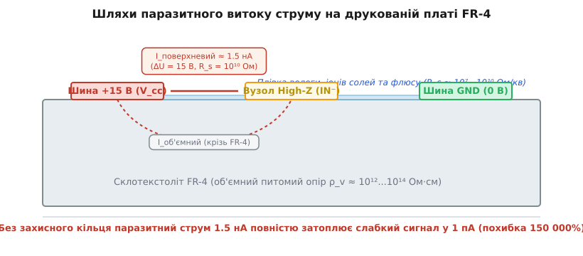
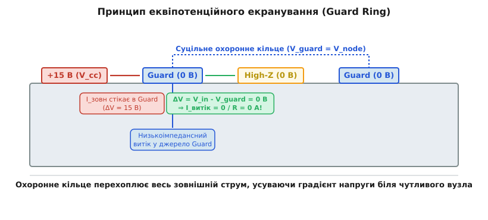
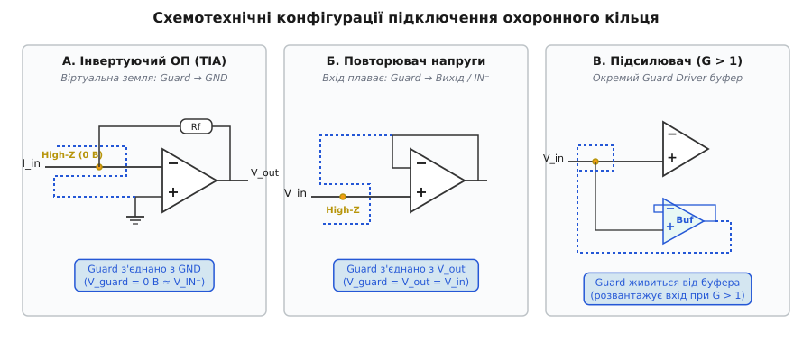
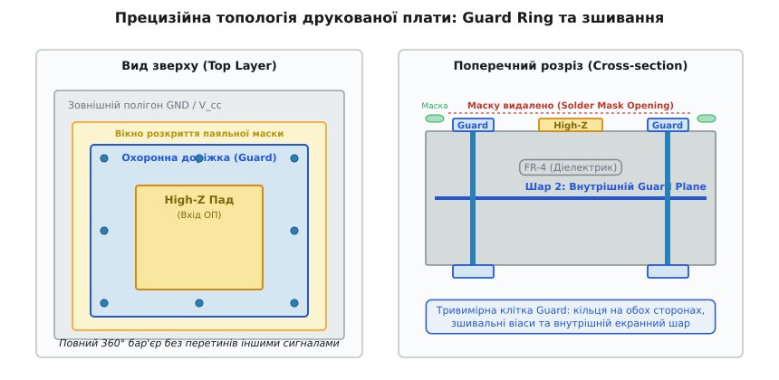
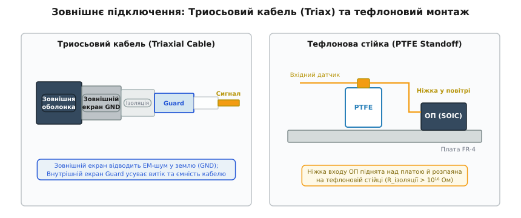

# 🛡️ Охоронне кільце на платі

<preknowlist>
- [Закон Ома](root:hw-analog/ohms-law) — зв'язок між струмом, спадом напруги та опором провідника.
- [Операційний підсилювач](root:hw-analog/opamp) — диференціальне підсилення, зворотний зв'язок та віртуальна земля.
- [Вузли й контури](root:hw-analog/nodes-branches-loops) — розподіл струмів у розгалужених електричних колах.
- [Трансімпедансний підсилювач](root:hw-analog/transimpedance-amplifier) — перетворення слабкого вхідного струму на вихідну напругу.
- [Фільтр нижніх частот](root:hw-analog/rc-low-pass) — формування частотної смуги та вплив паразитної ємності.
</preknowlist>

Коли аналогова схема працює зі звичайними струмами міліамперного чи мікроамперного діапазону, склотекстоліт друкованої плати сприймається як ідеальний ізолятор. Проте в прецизійній вимірювальній електроніці — підсилювачах фотодіодів, електрометрах, іонізаційних камерах, сенсорах pH, газоаналізаторах та зарядових підсилювачах п'єзодавачів — рівень корисного сигналу опускається до одиниць пікоамперів (`1 пА = 10⁻¹² А`) або навіть фемтоамперів (`1 фА = 10⁻¹⁵ А`).

На цих масштабах звичні уявлення про ізоляцію руйнуються. Друкована плата перетворюється на складну мережу розподілених паразитних резисторів. Тонка плівка атмосферної вологи, іонні залишки флюсу після паяння, мікроскопічні жирові сліди від дотику пальців та об'ємна провідність склотекстоліту утворюють паразитні шляхи витоку. Струм, що сочиться з сусідньої доріжки живлення чи цифрової шини, виявляється у сотні й тисячі разів більшим за корисний сигнал датчика. Сигнал безповоротно тоне у паразитному витоку ще до того, як встигне дійти до вхідного каскаду операційного підсилювача.

Спроба розв'язати цю проблему пасивним шляхом — збільшенням фізичної відстані між доріжками або звичайним заземленням — виявляється неефективною. Фізичним інженерним рішенням є **охоронне кільце** (англ. *guard ring*, *guard trace*): активний еквіпотенційний провідник, що повністю оточує чутливий вузол на платі та утримується під потенціалом, строго рівним потенціалу захищуваного сигналу.

---

### Фізика поверхневих та об'ємних витоків на платі

Будь-який діелектрик володіє скінченним електричним опором. У друкованих платах на основі класичного склотекстоліту FR-4 (композиту зі склотканини та епоксидної смоли) розрізняють два фізичні механізми протікання паразитного струму: об'ємний та поверхневий.

Об'ємний питомий опір якісного сухого склотекстоліту FR-4 становить `ρ_v ≈ 10¹²...10¹⁴ Ом·см`. Це високе значення, але на платі завтовшки 1.6 мм між сусідніми шарами міді опір ізоляції на площі в кілька квадратних міліметрів опускається до `10¹¹...10¹² Ом`.

Набагато небезпечнішим є **поверхневий опір** (Sheet Resistance `R_s`). За ідеальних лабораторних умов (абсолютно чиста, знежирена та суха поверхня за відносної вологості менше 30%) поверхневий опір FR-4 становить близько `10¹¹...10¹² Ом/квадрат`. Проте в реальних умовах експлуатації поверхня плати миттєво зазнає впливу зовнішнього середовища:

1. **Атмосферна вологість:** Молекули води є полярними диполями. За відносної вологості повітря понад 60–70% на поверхні полімерів утворюється неперервна тонка плівка адсорбованої вологи товщиною в кілька молекулярних шарів.
2. **Іонне забруднення:** Залишки каніфольних або водорозчинних флюсів містять активатори — галогеніди (хлориди, броміди) та органічні кислоти. При контакті з вологою повітря вони дисоціюють на вільні іони, перетворюючи плівку вологи на рідкий електроліт.
3. **Органічні забруднення:** Шкірне сало (жирові сліди від дотику пальців без антистатичних рукавичок) містить хлорид натрію (`NaCl`), сечовину та жирні кислоти, які різко підвищують поверхневу іонну провідність.
4. **Атмосферний пил:** Осідаючи на плату, мікрочастинки пилу гігроскопічно вбирають вологу, створюючи мікроскопічні струмопровідні містки.

Під сукупною дією цих факторів поверхневий опір плати FR-4 падає на 3–5 порядків — до величини `10⁷...10¹⁰ Ом/квадрат`.


*Фізика поверхневих та об'ємних витоків на склотекстоліті FR-4: високовольтна шина інжектує паразитний струм крізь плівку вологи та іонного забруднення безпосередньо у чутливий вузол.*

#### Масштаб похибки у цифрах

Оцінимо струм витоку на реальній друкованій платі. Нехай на відстані 1.5 мм від чутливого входу операційного підсилювача (High-Z node) проходить доріжка живлення операційного підсилювача з напругою `+15 В`. Вхідний вузол працює як віртуальна земля (потенціал `0 В`).

Якщо плата експлуатується при вологості 75% і має типовий поверхневий опір забрудненої ділянки `R_leak = 10¹⁰ Ом` (10 ГОм), струм витоку за законом Ома становить:

```
ΔU = V_rail - V_in = 15 В - 0 В = 15 В                [різниця потенціалів між шиною живлення та входом]
I_leak = ΔU / R_leak = 15 В / 10¹⁰ Ом = 1.5×10⁻⁹ А = 1.5 нА  [паразитний струм витоку]
```

Якщо до цього входу підключено фотодіод, корисний струм якого становить `1 пА` (`10⁻¹² А`), співвідношення похибки становить:

```
Похибка = (I_leak / I_сигнал) · 100% = (1.5×10⁻⁹ / 1.0×10⁻¹²) · 100% = 150 000%
```

Паразитний струм витоку перевищує корисний сигнал у 1500 разів. Жодне калібрування чи цифрова фільтрація не здатні відновити сигнал, оскільки поверхневий опір не є сталим: він нелінійно й хаотично змінюється зі зміною вологості та температури повітря.

---

### Принцип еквіпотенційного охоронного кільця (Guard Ring)

Чому класичне рішення — заземлити мідний полігон навколо чутливого вузла — не працює в колах із плаваючим потенціалом?

Якщо навколо чутливого провідника з потенціалом `+2.5 В` прокласти заземлену доріжку (`0 В`), різниця напруг між провідником і землею становитиме `2.5 В`. Струм витоку продовжуватиме витікати з чутливого вузла прямо в землю: `I = 2.5 В / 10¹⁰ Ом = 250 пА`. Заземлення захищає від зовнішніх завад, але створює власний струм витоку.

Фундаментальний принцип охоронного кільця полягає не в спробі створити нескінченно великий опір ізоляції, а в **усуненні рушійної сили струму — різниці потенціалів**.

Струм витоку через будь-який ізолятор тече виключно за наявності електричного поля: `I = ΔV / R`. Якщо напруга на охоронному провіднику строго дорівнює напрузі захищуваного вузла:

```
V_guard = V_node                                      [умова еквіпотенційного екранування]
ΔV = V_node - V_guard = 0 В                           [різниця напруг між вузлом і охоронним кільцем]
I_leak = ΔV / R_surface = 0 В / R_surface = 0 А       [струм витоку повністю зникає]
```


*Еквіпотенційний бар'єр: оскільки напруга охоронного кільця дорівнює напрузі чутливого вузла, різниця потенціалів дорівнює нулю, і струм витоку через внутрішній ізоляційний зазор зникає.*

#### Куди дівається зовнішній витік?

Охоронне кільце фізично оточує захищений вузол з усіх боків. Усі зовнішні напруги (шини живлення +15 В, -15 В, лінії цифрових сигналів) контактують виключно із зовнішнім краєм охоронного кільця. Між шиною живлення та кільцем діє повна різниця напруг `ΔV_ext = 15 В - V_guard`, і крізь зовнішній діелектрик тече струм витоку:

```
I_ext = (V_rail - V_guard) / R_ext                    [зовнішній струм витоку на охоронне кільце]
```

Але охоронне кільце підключене до **низькоімпедансного виходу** джерела напруги (сигнальної землі або виходу операційного підсилювача-повторювача з вихідним опором менше 1 Ома). Низькоімпедансне джерело легко відводить (або постачає) наноамперні чи мікроамперні струми витоку без найменшої зміни власного потенціалу.

Внутрішній простір між кільцем та High-Z вузлом залишається абсолютно еквіпотенційним: градієнт електричного поля дорівнює нулю (`∇V = 0`), а отже, жоден електрон не перетікає в чутливий сигнальний тракт.

> 🔧 **Навіщо це.** Вхідні каскади мікросхем класу Electrometer (наприклад, ADA4530-1 з типовим вхідним струмом зміщення 20 фА за 125 °C або LMP7721 з гарантованим струмом 3 фА за 25 °C) фізично неможливо протестувати чи використати на звичайній друкованій платі без охоронного кільця. Без Guard Ring власні струми витоку плати будуть у 10 000–100 000 разів вищими за паспортні параметри мікросхеми.

---

### Схемотехнічні топології підключення Guard

Спосіб підключення охоронного кільця до схеми повністю визначається режимом роботи операційного підсилювача та потенціалом його вхідних вузлів.


*Три базові конфігурації: інвертуючий трансімпедансний підсилювач (Guard на GND), неінвертуючий повторювач (Guard на вихід) та схема з коефіцієнтом підсилення понад одиницю з окремим буферним драйвером.*

#### 1. Інвертуюча конфігурація та трансімпедансний підсилювач (TIA)

В інвертуючому увімкненні (типова схема для фотодіодів, іонізаційних камер та вимірювання струмів) неінвертуючий вхід `IN+` підключається до опорного потенціалу — зазвичай до аналогової землі (GND, `0 В`).

Завдяки глибокому негативному зворотному зв'язку через резистор `Rf`, операційний підсилювач підтримує різницю напруг між входами близькою до нуля. На інвертуючому впуску `IN-` виникає **віртуальна земля**:

```
V_IN- ≈ V_IN+ = 0 В                                   [потенціал віртуальної землі на вході TIA]
```

Оскільки потенціал захищуваного вузла `IN-` строго фіксований і дорівнює нулю вольтів, охоронне кільце Guard **з'єднується безпосередньо з неінвертуючим входом `IN+` або з аналоговою землею GND**.

У такій схемі не потрібні додаткові активні буфери. Охоронна доріжка просто прокладається навколо виводу `IN-`, резистора зворотного зв'язку `Rf` та контактного майданчика фотодіода й підключається до полігону GND біля виводу `IN+`.

Залишкова різниця напруг між кільцем Guard та інвертуючим входом дорівнює лише власній напрузі зміщення нуля операційного підсилювача `V_os`:

```
ΔV_residual = |V_IN- - V_guard| = V_os                [залишкова різниця потенціалів у TIA]
```

Для сучасних прецизійних ОП з автопідстроюванням нуля (Zero-Drift / Chopper) напруга зміщення становить `V_os < 5...20 мкВ`. При такому зміщенні струм витоку крізь зазор `10¹⁰ Ом` становить менше `2×10⁻¹⁵ А` (2 фА), що забезпечує коефіцієнт придушення витоку понад 500 000 разів.

#### 2. Неінвертуюча конфігурація та повторювач напруги (Electrometer Follower)

Коли вимірюється напруга від високоомного джерела (скляного електрода pH-метра, п'єзоелектричного сенсора, електростатичного вольтметра або високоомного дільника напруги), сигнал подається на неінвертуючий вхід `IN+`. Потенціал цього вузла не є фіксованим: він вільно змінюється разом із вхідним сигналом `V_in` (наприклад, у діапазоні від -5 В до +5 В).

Якщо з'єднати охоронне кільце із землею, при будь-якій ненульовій вхідній напрузі виникне значний струм витоку на землю.

Тому охоронне кільце має стати **активно веденим** (Active Driven Guard):
- У схемі повторювача напруги (коефіцієнт підсилення `G = 1`) вихідна напруга підсилювача строго повторює вхідну: `V_out = V_in`.
- Охоронне кільце підключається безпосередньо до **виходу операційного підсилювача `V_out`** або до інвертуючого входу `IN-`.

Вихід ОП має вихідний імпеданс у частки ома та здатний видавати струми до десятків міліамперів. Він керує потенціалом охоронного кільця так, що кільце синхронно відстежує всі коливання вхідної напруги `V_in`. Між входом `IN+` та охоронним кільцем напруга завжди підтримується на рівні `ΔV = V_os ≈ 0 В`.

#### 3. Неінвертуючий підсилювач із підсиленням більше одиниці (G > 1)

Якщо неінвертуючий підсилювач має коефіцієнт підсилення по напрузі `G = 1 + R2/R1 > 1`, його вихідна напруга більша за вхідну: `V_out = G · V_in`.

У цьому випадку **заборонено підключати Guard до виходу `V_out`**, оскільки між кільцем і входом виникне різниця напруг `ΔV = V_out - V_in = (G - 1) · V_in`, що призведе до масивного витоку струму з виходу назад у вхідний вузол.

Правильні схемотехнічні рішення:
- **Підключення до вузла зворотного зв'язку `IN-`:** Потенціал інвертуючого входу `IN-` підтримується зворотним зв'язком рівним вхідній напрузі `V_IN- = V_in`. Охоронне кільце з'єднують із середньою точкою дільника `R1-R2` (за умови, що опір дільника досить низький, щоб витік не спотворював коефіцієнт підсилення).
- **Застосування виділеного буфера Guard Driver:** Використовується допоміжний операційний підсилювач-повторювач з наднизьким вхідним струмом зміщення (окремий канал здвоєного ОП). Його вхід підключається до `IN+`, а низькоомний вихід живить охоронне кільце та екрани кабелів.

Детальний математичний аналіз залишкових струмів витоку, коефіцієнта придушення та впливу напруги зміщення ОП наведено у вставці про [математичне виведення еквівалентної ємності та придушення витоку](root:hw-pcb/guard-ring-pcb/math-guard-bootstrapping.md).

---

### Ефект вольтододавання (Bootstrapping) та частотна смуга

Окрім усунення статичних витоків постійного струму, активно ведене охоронне кільце та екран кабелю виконують другу найважливішу функцію — **динамічну нейтралізацію паразитної ємності** (Bootstrapping).

Будь-який провідник на платі має паразитну ємність відносно навколишніх провідників та земляних шарів (типово 1–5 пФ на кожен сантиметр доріжки). Екранований кабель має погонну ємність близько 50–150 пФ на метр.

Коли джерело сигналу має екстремально високий внутрішній опір (наприклад, електрод pH-метра з опором `R_s = 1 ГОм`), навіть мізерна паразитна ємність лінії `C_p = 100 пФ` утворює паразитна RC-ланку з гігантською сталою часу:

```
τ = R_s · C_p = 10⁹ Ом · 100×10⁻¹² Ф = 0.1 секунди     [стала часу вхідного RC-фільтра]
f_cut = 1 / (2π · τ) = 1 / (2π · 0.1) ≈ 1.59 Гц         [частота зрізу сигналу]
```

Частота зрізу падає до 1.6 Гц. Сигнал стає надзвичайно інерційним: час наростання перехідного процесу (`t_rise ≈ 2.2 · τ`) становить майже чверть секунди. Вимірювання швидких змін стає фізично неможливим.

#### Як Guard усуває паразитну ємність

Струм через конденсатор протікає лише тоді, коли напруга на його обкладках змінюється у часі:

```
i_c(t) = C_p · (d(ΔV) / dt) = C_p · (d/dt)[v_sig(t) - v_guard(t)]  [закон протікання струму через ємність]
```

Коли екран Guard синхронно відстежує напругу сигналу (`v_guard(t) ≈ v_sig(t)`), змінна напруга на паразитному конденсаторі дорівнює нулю у будь-який момент часу:

```
ΔV(t) = v_sig(t) - v_guard(t) ≈ 0 В
d(ΔV)/dt = 0 ⇒ i_c(t) = 0 А                           [струм перезаряджання ємності зникає]
```

Джерело сигналу не витрачає свій слабкий струм на заряджання паразитної ємності лінії. Еквівалентна вхідна ємність лінії `C_eff` зменшується пропорційно коефіцієнту підсилення буфера:

```
C_eff = C_p · (1 - A_v)                               [формула динамічної bootstrapped-ємності]
```

Для прецизійного буфера `A_v ≈ 0.9999`, тому фізична ємність 100 пФ перетворюється на віртуальну ємність усього `0.01 пФ` (10 фемтофарадів). Частотна смуга пропускання системи розширюється на 3–4 порядки (з 1.6 Гц до кількох кілогерців), а швидкість наростання фронтів зростає у тисячі разів.

---

### Топологія та прецизійне трасування на друкованій платі

Реалізація Guard Ring на друкованій платі вимагає дотримання суворих топологічних правил. Будь-яка помилка в розведенні перетворює захисну структуру на марний елемент декору.


*Пошарове трасування: замкнене кільце на зовнішніх шарах зі знятою паяльною маскою, зшивальні перехідні отвори та внутрішній екранний шар утворюють замкнену еквіпотенційну клітку навколо сигналу.*

#### 1. Нерозривність контуру (Повне 360° охоплення)

Охоронне кільце повинно формувати **абсолютно замкнений контур** навколо всіх контактних майданчиків, доріжок і компонентів, підключених до High-Z вузла.
- Заборонено залишати щілини в кільці для прокладання інших доріжок на тому ж шарі.
- Якщо до вузла підключається резистор зворотного зв'язку `Rf`, конденсатор `Cf` або вхідний роз'єм, охоронне кільце має охоплювати всі ці компоненти цілком, включаючи їхні пади.
- Всі інші сигнальні лінії, цифрові шини та живлення мають огинати зовнішній периметр Guard Ring на безпечній відстані (не менше 1–2 мм).

#### 2. Видалення паяльної маски (Solder Mask Opening / Mask Expansion)

Паяльна маска (зелена, синя чи чорна плівка фотополімеру, що покриває плату) є поганим діелектриком для прецизійних кіл:
- Паяльна маска має вищу гігроскопічність, ніж склотекстоліт, вбираючи вологу з повітря.
- Під плівкою маски під час монтажу утворюються мікропорожнини, в яких запікаються рідкі компоненти флюсу, утворюючи приховані іонні канали витоку.
- Поверхневий опір паяльної маски за високої вологості опускається до `10⁸...10⁹ Ом/кв`.

**Правило:** Над охоронною доріжкою Guard та над усім ізоляційним проміжком між кільцем і High-Z вузлом **паяльну маску повністю видаляють** (у САПР створюється Solder Mask Opening / Stop Mask Window). Оголена мідна доріжка Guard покривається хімічним золоченням (ENIG — Electroless Nickel Immersion Gold) або гарячим лудінням, а оголений склотекстоліт ретельно відмивається.

#### 3. Пошарове тривимірне екранування та захисні віаси (Guard Vias / Stitching)

Об'ємний витік через товщу склотекстоліту відбувається не лише у горизонтальній площині, але й вертикально — між шарами плати.

Для створення повноцінної тривимірної еквіпотенційної клітки:
- Охоронне кільце дублюється **на верхньому (Top) та нижньому (Bottom) шарах** плати у дзеркальному відображенні.
- Верхнє та нижнє кільця зшиваються масивом **наскрізних перехідних отворів (Guard Vias)** з кроком 1.5–3 мм вздовж усього периметра.
- На внутрішньому шарі (Layer 2, безпосередньо під High-Z доріжкою) замість загального полігону землі розміщують **внутрішній полігон Guard Plane**, з'єднаний із захисним кільцем. Це усуває вертикальний витік із внутрішніх шарів живлення та землі крізь діелектрик препрегу.

#### 4. Фрезерування ізоляційних прорізів (PCB Isolation Slots / Air Routing)

Повітря є значно кращим діелектриком, ніж будь-який полімер: об'ємний опір сухого повітря перевищує `10¹⁶...10¹⁸ Ом·см`, а його діелектрична проникність дорівнює одиниці (`ε_r = 1.0`), що усуває діелектричні втрати та абсорбцію.

Для вимірювання субпікоамперних струмів у платі фрезерують **наскрізні пази (Air Slots)** шириною 1–2 мм між охоронною доріжкою та сусідніми шинами живлення/землі. Паз фізично перериває діелектрик плати, збільшуючи довжину шляху струму витоку по поверхні (Creepage Distance) та змушуючи будь-який поверхневий струм виходити в повітряний зазор з гігантським опором.

---

### Корпуси мікросхем, виводи та монтажні технології

Стандартне розташування виводів класичних операційних підсилювачів створює значні топологічні труднощі при розведенні охоронного кільця.

#### Трасування стандартного корпусу SOIC-8

У класичному корпусі SOIC-8 (наприклад, OPA129, AD549):
- Вивід 2 — інвертуючий вхід `IN-` (High-Z);
- Вивід 3 — неінвертуючий вхід `IN+`;
- Вивід 4 — шина негативного живлення `V-` (наприклад, `-15 В`);
- Вивід 1 — балансування зсуву (Offset Null) або вільний (NC).

Головна небезпека полягає в тому, що високовольтна шина `V-` (вивід 4) розташована безпосередньо поруч із чутливим входом `IN+` (вивід 3). Якщо схема працює як інвертуючий підсилювач, вивід 2 оточують кільцем Guard, пропускаючи тонку доріжку між виводами 1 і 2. Якщо вивід 1 не задіяний (NC), його пад на платі не розпаюють, а натомість проводять крізь нього охоронну доріжку.

#### Спеціалізовані електрометричні корпуси

Сучасні ультрапрецизійні операційні підсилювачі (LMP7721 від Texas Instruments, ADA4530-1 від Analog Devices) випускаються у спеціалізованих корпусах із нестандартним розташуванням виводів:
- Вхідні виводи `IN+` та `IN-` рознесені на протилежний бік корпусу від шин живлення `V+` та `V-`.
- Між вхідними виводами та рештою мікросхеми інтегровано **виділені виводи Guard Pins**, які під'єднані до внутрішнього екрана на кристалі кремнію.
- Це дозволяє прокласти пряме, широке мідне охоронне кільце навколо входів без звуження доріжок та без ризику пробою на живлення.

#### Металоскляні корпуси TO-99 та підвішування в повітрі

Для вимірювання струмів нижче 100 фА (`10⁻¹³ А`) навіть відмитий склотекстоліт FR-4 із кільцем Guard виявляється джерелом похибок через п'єзоелектричні ефекти скловолокна та діелектричну абсорбцію епоксиду.

У таких застосуваннях використовують класичні монтажні техніки:

1. **Металевий корпус TO-99 з виводом 8 (Case Pin):** Металевий ковпачок транзисторного корпусу TO-99 ізольований від схеми і виведений на окремий вивід 8. Цей вивід припаюється до охоронного кільця, перетворюючи весь металевий корпус мікросхеми на тривимірний Guard-екран.
2. **Монтаж на тефлонових стійках (PTFE Standoffs):** Вхідний резистор зворотного зв'язку та роз'єм датчика монтуються на окремих ізоляційних стійках із первинного тефлону (політетрафторетилену), опір якого перевищує `10¹⁶ Ом`.
3. **Метод «підвішеної ніжки» (Air-wiring / Dead-bug):** Чутливий вхідний вивід мікросхеми відгинають горизонтально вгору так, щоб він не вставлявся в отвір плати й не торкався контактного майданчика. Провід від датчика або резистор зворотного зв'язку припаюють безпосередньо до висячої в повітрі ніжки ОП навісним монтажем.


*Граничні заходи захисту: триосьовий кабель із веденим внутрішнім екраном та підвішування чутливого виводу мікросхеми в повітрі на тефлоновій стійці для усунення контакту зі склотекстолітом.*

Для передачі сигналу від зовнішніх датчиків застосовують спеціалізовані триосьові кабелі та роз'єми (Triaxial BNC), де внутрішній екран живиться від Guard. Детальний аналіз конструкції та трибоелектричних властивостей кабелів наведено у вставці про [триосьовий кабель і роз'єми в прецизійних вимірюваннях](root:hw-pcb/guard-ring-pcb/comp-triaxial-cable.md).

Чисельне моделювання двовимірного розподілу електростатичних потенціалів та струмів витоку на платі методом скінченних різниць (FDM) реалізовано у проєкті [чисельного моделювання поверхневих витоків](root:hw-pcb/guard-ring-pcb/proj-surface-leakage.md).

---

### Технологічний регламент очищення та захисту від вологи

Найдосконаліша топологія друкованої плати втрачає сенс, якщо на ній залишилися мікроскопічні забруднення після монтажу.

#### Класифікація флюсів та небезпека «No-Clean»

- **Флюси No-Clean (безвідмивні):** Поширена помилка — залишати безвідмивний флюс на платах прецизійної аналогової електроніки. Хоча смоляна основа No-Clean флюсу є діелектриком у сухому стані, вона містить незв'язані активатори, які вбирають вологу з повітря, утворюючи струмопровідні доріжки з опором менше `10⁹ Ом`. **Будь-який флюс на прецизійній платі підлягає обов'язковому змиванню.**
- **Водозмивні флюси (Water-Soluble / OA):** Містять агресивні органічні кислоти. Якщо їх не вимити повністю протягом кількох годин після паяння, вони викликають корозію міді та утворюють концентровані іонні солі з катастрофічним рівнем витоку.
- **Чисті каніфольні флюси (Rosin Mildly Activated, RMA):** Найбезпечніший тип для ручного монтажу прецизійних плат, оскільки залишки каніфолі легко розчиняються спиртом і є гідрофобними.

#### Чотириетапний протокол відмивання плати

1. **Первинне ультразвукове очищення:** Плату занурюють в ультразвукову ванну зі спеціалізованим розчинником флюсу або чистим ізопропіловим спиртом (IPA вищої кваліфікації або оптичної чистоти `> 99.8%`). Ультразвукова кавітація видаляє залишки флюсу з-під корпусів SMD-компонентів протягом 5–10 хвилин.
2. **Промивання деіонізованою водою:** Плату промивають у потоці деіонізованої води (DI Water з питомим опором `> 18 МОм·см`) для повного розчинення та вимивання іонних солей і полярних активаторів, які погано розчиняються в спирті.
3. **Фінальне знежирення спиртом:** Повторне промивання в чистому ізопропіловому спирті для витіснення залишків води та швидкого первинного сушіння.
4. **Термічне зневоднення (Baking):** Плату поміщають у сушильну термошафу при температурі **85–105 °C на 2–4 години**. Це критичний етап: склотекстоліт FR-4 є пористим матеріалом, що вбирає до 0.2–0.5% вологи за масою. Нагрівання десорбує молекули води з глибини полімерної матриці, повністю відновлюючи об'ємний опір діелектрика.

#### Захисні конформні покриття (Conformal Coating)

Після термічного сушіння плату необхідно негайно захистити від повторного проникнення вологи з навколишнього повітря. Для цього на очищену поверхню наносять захисне конформне покриття:
- **Силіконові покриття (Silicone):** Володіють відмінною гідрофобністю, зберігають еластичність у широкому діапазоні температур, але мають середню адгезію.
- **Акрилові лаки (Acrylic):** Легко наносяться та ремонтуються, забезпечують добрий базовий захист від вологи.
- **Париленові плівки (Parylene C):** Наносяться методом вакуумного газофазного осадження. Утворюють абсолютно монолітну, безпористу плівку товщиною в кілька мікрометрів, що повністю повторює мікрорельєф компонентів і забезпечує поверхневий опір понад `10¹⁵ Ом` навіть при 100% вологості.

---

### Розрахункові інженерні приклади (Worked Examples)

#### Приклад 1. Розрахунок придушення витоку в підсилювачі фотодіода (TIA)

**Вхідні умови:**
- Інвертуючий трансімпедансний підсилювач на ОП з напругою зміщення нуля `V_os = 15 мкВ`.
- Поруч із входом `IN-` на відстані 1 мм проходить доріжка живлення `+15 В`.
- Вхід `IN+` заземлений (`0 В`).
- Плата забруднена залишками флюсу у вологому приміщенні: поверхневий опір діелектрика `R_surface = 5×10⁹ Ом` (5 ГОм).
- Корисний струм фотодіода: `I_photo = 20 пА`.

**Розрахунок без охоронного кільця:**
```
ΔU = 15 В - 0 В = 15 В
I_leak,unshielded = 15 В / (5×10⁹ Ом) = 3.0×10⁻⁹ А = 3000 пА
Відносна похибка = (3000 пА / 20 пА) · 100% = 15 000%
```

**Розрахунок з охоронним кільцем Guard Ring (підключеним до GND):**
```
ΔU_guard = V_os = 15 мкВ = 1.5×10⁻⁵ В
I_leak,guarded = 1.5×10⁻⁵ В / (5×10⁹ Ом) = 3.0×10⁻¹⁵ А = 3.0 фА
Залишкова похибка = (0.003 пА / 20 пА) · 100% = 0.015%
```
**Висновок:** Охоронне кільце зменшило паразитний струм витоку в один мільйон разів (з 3000 пА до 3 фА), знизивши похибку вимірювання з катастрофічних 15 000% до непомітних 0.015%.

---

#### Приклад 2. Розрахунок часу реакції та смуги пропускання pH-електрода

**Вхідні умови:**
- pH-зонд має внутрішній опір `R_source = 2 ГОм = 2×10⁹ Ом`.
- З'єднувальний кабель довжиною 1.5 метра має сумарну ємність `C_cable = 150 пФ = 1.5×10⁻¹⁰ Ф`.
- Вхідний каскад — неінвертуючий буфер з коефіцієнтом передачі `A_v = 0.9998` та смугою `f_b = 2 МГц`.

**Розрахунок без активного Guard (звичайний заземлений екран):**
```
τ_unshielded = R_source · C_cable = (2×10⁹ Ом) · (1.5×10⁻¹⁰ Ф) = 0.3 секунди
f_cutoff = 1 / (2π · 0.3 с) ≈ 0.53 Гц
Час наростання (10%–90%) = 2.2 · τ_unshielded = 2.2 · 0.3 с = 0.66 секунди
Час встановлення до 0.1% = 7 · τ_unshielded = 7 · 0.3 с = 2.1 секунди
```

**Розрахунок з активно веденим екраном (Active Driven Guard):**
```
C_eff = C_cable · (1 - A_v) = 150 пФ · (1 - 0.9998) = 150 пФ · 0.0002 = 0.03 пФ = 30 фФ
τ_guarded = R_source · C_eff = (2×10⁹ Ом) · (3.0×10⁻¹⁴ Ф) = 6.0×10⁻⁵ секунди = 60 мкс
f_cutoff,guarded = 1 / (2π · 60 мкс) ≈ 2.65 кГц
Час наростання = 2.2 · 60 мкс = 132 мкс
Час встановлення до 0.1% = 7 · 60 мкс = 420 мкс (0.42 мс)
```
**Висновок:** Використання веденого екрана скоротило час реакції вимірювального тракту з 2.1 секунди до 0.42 мілісекунди (прискорення у 5000 разів), дозволивши вимірювальній системі реєструвати динамічні хімічні перехідні процеси у реальному часі.

---

### Підсумковий інженерний чеклист розробника

1. **Визначте потенціал вузла:** Для інвертуючого TIA підключайте Guard до GND (`IN+`); для неінвертуючого буфера — до виходу `V_out` або окремого повторювача Guard Driver.
2. **Замкніть контур на 360°:** Жодна доріжка не повинна перетинати охоронне кільце на сигнальному шарі; захистіть усі компоненти вузла (резистори, конденсатори, пади датчика).
3. **Очистіть маску:** Відкрийте паяльну маску (Solder Mask Opening) над доріжкою Guard та ізоляційним проміжком.
4. **Забезпечте 3D-захист:** Продублюйте кільце на зворотному боці плати, прошийте контур віасами та закладіть внутрішній Guard Plane на шарі під High-Z трасою.
5. **Розведіть виводи мікросхеми:** Не допускайте прокладання шин живлення поруч із High-Z входами; використовуйте спеціалізовані електрометричні корпуси або підвішуйте вивід у повітрі при струмах < 100 фА.
6. **Дотримуйтесь хімічної гігієни:** Використовуйте тільки чисті флюси, проводьте повне ультразвукове змивання спиртом та деіонізованою водою з фінальним термічним просушуванням плати (85–105 °C).
