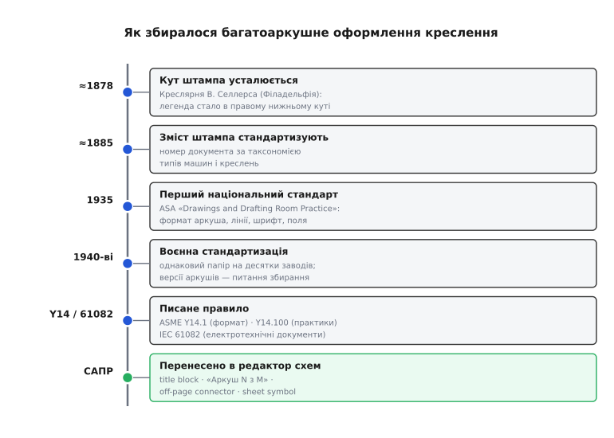

# 📜 Звідки взялися багатоаркушні креслення

Сьогодні «Аркуш 3 з 12» у кутовому штампі та конектор «продовження на аркуші 7» здаються самоочевидними — наче інженерне креслення завжди вміло розкладати документ на пронумеровані сторінки, зшиті перехресними посиланнями. Та це не вроджена риса креслення, а **виборене надбання**, яке збиралося майже сторіччя — спершу в машинобудівних кресленнях парової доби, потім у воєнних кресленнях, де від однакового документа залежали тисячі заводів, і вже звідти прийшло у редактори схем як міжаркушевий конектор (англ. *off-page connector*) і блок-символ дочірнього аркуша (англ. *sheet symbol*).

Історія тут не про «хто намалював перший прямокутник у куті». Вона про конкретну інженерну біду, яка змусила креслення подорослішати: коли деталі стали **взаємозамінними**, а виготовляли їх **різні люди в різних місцях за тим самим папером**, креслення перестало бути особистою запискою майстра самому собі й мусило стати **документом, який читає чужий**. А чужому потрібні дороговкази: де ця сторінка в наборі, якого вона пристрою, якої версії, і куди йде сигнал, що добіг до краю аркуша. Розберімо, як народилися три ці дороговкази — наскрізна нумерація, кутовий штамп і перехресне посилання, — і як вони перетекли з паперу в редактор схем.

## Доки креслення було запискою самому собі

Щоб відчути, **навіщо** креслення взагалі знадобилися службові поля, варто уявити майстерню до епохи взаємозамінності. Механік XVIII — початку XIX століття часто й сам проєктував, і сам виготовляв ту саму річ. Креслення (де воно взагалі було) правило за **особисту пам'ятку**: розміри, які тримати, пропорції, які не забути. Читала його одна людина — той, хто його накреслив. Тож і питання «яка це сторінка з якого набору» не існувало: набору не було, була одна людина й одна річ, яку вона робила від початку до кінця.

Усе змінила **взаємозамінність деталей** (англ. *interchangeable parts*) — ідея, що деталь, зроблену на одному верстаті, можна без припасовування поставити в виріб, зібраний деінде. Цей принцип, що визрівав від французьких збройових майстерень кінця XVIII століття й розгорнувся на повну в американській збройовій промисловості першої половини XIX (так звана *American system of manufacturing*), переніс центр ваги з майстра на **папір**. Якщо деталь робить один завод, а складає інший, то єдине, що їх пов'язує, — креслення. Воно мусить бути **однозначним для того, хто його не малював**. Саме тут і починається тиск, що зрештою виліпив штамп і нумерацію: щойно креслення стало інтерфейсом між незнайомими людьми, йому знадобилися підписи, версії та дороговкази.

> 🔧 **Навіщо це.** Це той самий тиск, що й сьогодні диктує дисципліну багатоаркушної схеми. Поки плату малюєш ти один і сам її паяєш, можна обійтися й абияк підписаними аркушами. Та щойно схему читає рецензент, передаєш її на завод, повертаєшся до неї через рік — вона вже не записка, а документ для чужого. І чужому потрібні рівно ті ж дороговкази, що знадобилися машинобудуванню півтора століття тому: який це аркуш, якого пристрою, якої версії, куди йде сигнал з краю сторінки.

## Кут, у якому оселився штамп: креслярня Селлерса

Перше, що мусило стабілізуватися, — **де** на аркуші стоїть службовий запис і **що** в ньому. Тут історія дає несподівано конкретну адресу. Чоловік, чия креслярня закріпила багато з того, що ми звемо сучасним інженерним кресленням, — **Вільям Селлерс** (William Sellers, 1824–1905), машинобудівник із Філадельфії, постать першого ряду американської промислової стандартизації. Його ім'я знають передусім за **стандартом різі**: у квітні 1864 року Селлерс виклав свою систему гвинтових різей у доповіді у Франклінівському інституті (Franklin Institute) у Філадельфії, а 15 грудня 1864-го спеціальний комітет інституту її схвалив. Профіль із кутом 60° (замість 55° у британській системі Вітворта) було простіше нарізати звичайному механікові — і саме ця система лягла в основу американської взаємозамінної машинобудівної культури. (Це усталений факт, добре задокументований і самим інститутом, і пізнішими істориками техніки.)

Та для нашої історії важливіша не різь, а **креслярська практика** фірми Селлерса. Дослідники, що вивчали його збережені креслення, відзначають конкретну річ: одним з останніх елементів, який у тих кресленнях усталився, була позиція **легенди** — і **після 1878 року** вона незмінно стоїть у **правому нижньому куті**, тому самому, що знайомий нині кожному інженерові. А **близько 1885-го** усталився й сам **зміст** штампа: Селлерс запровадив стандартний номер документа в дусі десяткової класифікації — таксономію типів машин і креслень, де номер сам казав, що це за креслення. (Статус: добре задокументована історична практика конкретної фірми; «винахідником штампа» одну людину не роблять — це усталення, що визрівало в кількох інженерних школах, але креслярня Селлерса — один із найточніше датованих його осередків.)

Чому саме **правий нижній** кут, а не, скажімо, верхній? Тут проста механіка паперу. Великі креслення зберігали й передавали **згорнутими або в стосі**; коли аркуш складають за усталеними згинами або кладуть у теку, на видноті лишається саме правий нижній ріг. Поклади туди підпис — і не треба розгортати весь аркуш, щоб дізнатися, що це й чия. Та сама логіка згодом перейде в стандарти дослівно: штамп **завжди** в правому нижньому куті, щоб його було видно на складеному кресленні. Дрібниця з геометрії згину закам'яніла в правило на наступне століття.

> 🔧 **Навіщо це.** Коли редактор схем ставить кутовий штамп саме в правий нижній ріг кожного аркуша, він не «так заведено» — він повторює рішення, ухвалене заради паперу, який складають. На екрані згин не потрібен, але правило лишилося: око інженера натреноване шукати «хто-що-яка версія» **праворуч унизу**, і будь-який редактор, від KiCad до промислових САПР, кладе штамп туди ж, щоб креслення читалося звично хоч на моніторі, хоч на роздруківці, складеній у теку.

## Від особистого почерку до національного стандарту

Поки штамп і нумерація жили як **звичай** окремих солідних фірм, єдиного вигляду в них не було: кожна велика креслярня — Селлерса, збройові арсенали, залізничні депо — мала свій канон. Доки документ ходив усередині однієї компанії, цього вистачало. Та що ширшою ставала кооперація — субпідрядники, постачальники, армія, що замовляє в десятка заводів, — то болючіше різнобій давався взнаки: однакове креслення кожен оформляв по-своєму, і читати чуже доводилося, щоразу переучуючись.

Розв'язок прийшов через **національний стандарт**. У **травні 1935 року** Американська асоціація стандартів (American Standards Association, ASA) ухвалила документ під назвою «American Standard Drawings and Drafting Room Practice» — перший національний стандарт креслярської практики у США, що звів докупи розташування видів, лінії, простановку розмірів, **розміри аркушів** і шрифт. Спонсорували його Американське товариство інженерів-механіків (ASME) і Товариство сприяння інженерній освіті. (Усталений факт: запис цього видання 1935 року зберігся в бібліотечних каталогах із точним формулюванням і складом спонсорів.) Саме звідси тягнеться родовід усієї пізнішої американської серії креслярських стандартів — тих, що нумеруються префіксом **Y14** (історично — **Z14**, як позначала ранні стандарти ASA).

Тут важливо розрізняти **два виміри**, які стандарт упорядкував окремо. Перший — **розмір і формат аркуша**: щоб «аркуш» узагалі мав визначений габарит, поля й рамку, інакше «Аркуш 3 з 12» нічого не означає, коли сторінки різні завбільшки. Другий — **склад службових полів**: що писати в штампі, як вести версії, як підписувати. Перший вимір зрештою виокремився в стандарт розмірів і формату аркуша (нащадок його — теперішній **ASME Y14.1**, що задає ряд форматів від «ANSI A» завбільшки з лист 8½×11 дюйма й більші); другий — у стандарт самих креслярських практик. Поділ не випадковий: габарит аркуша й зміст штампа — різні рішення, які зручно вести різними документами.

## Війна, що зробила однаковий папір питанням життя

Найдужчий поштовх до жорсткої стандартизації дала **Друга світова війна**. Масштаб воєнного виробництва зробив колишню зручність — «добре б оформляти креслення однаково» — питанням, від якого залежали літаки в небі. Один літак проєктували в одному місці, а виготовляли **різні заводи в різних містах**, нерідко в різних країнах; деталь з одного складального цеху мусила без припасування стати у виріб з іншого. Це і є взаємозамінність, доведена до межі, — і трималася вона **виключно на кресленні**, однаковому для всіх.

Масштаб промовляє сам за себе: тисячі креслярів виготовляли десятки тисяч креслень на кожну модель літака — настільки точних і детальних, що різні заводи робили за ними деталі, які сходилися разом. Збережені архіви воєнних креслень (приміром, тисячі аркушів на P-51, B-25, T-6) показують креслення з заводів у різних містах і навіть країнах, зведені до спільного канону. У такій кооперації **різнобій оформлення коштує дорого**: якщо «Аркуш 5 з 18» на одному заводі означає не те, що на іншому, або версію позначено різними способами, складуть **не те, що накреслили**. Війна не лишала на це права. Саме звідси — з воєнних і повоєнних військових креслярських вимог 1940-х — виросла дисциплінована серія, що згодом стала цивільними стандартами **Y14**.

> 🔧 **Навіщо це.** Найважче в багатоаркушному наборі — **версії**, і саме цей урок воєнне виробництво вписало в стандарти кров'ю. Коли аркуші правлять по черзі, а зберуть з них один пристрій, розбіжність версій між сторінками — пряма дорога до «зібрали несумісне». Тому в кутовому штампі живе поле версії (англ. *revision*), а поряд — журнал змін (англ. *revision block*): що, коли й ким змінено. Сучасний редактор схем веде версію аркуша рівно з тієї ж причини, з якої воєнний завод не міг дозволити аркушу 3 бути версії B, а аркушу 5 застрягти на версії A.

## Як службові поля стали писаним правилом

Після війни розрізнені військові й галузеві практики поступово зводили в **єдині писані стандарти**, чинні донині. Тут варто назвати два роди джерел, що зійшлися на тому самому: американський (ASME/ANSI) і міжнародний (IEC).

**Американський бік.** Військові креслярські вимоги довго жили окремим документом — стандартом **MIL-STD-100** (Engineering Drawing Practices), що збирав, як оборонне відомство хоче бачити креслення. У 1990-х узяли курс на заміну суто військових стандартів цивільними «негосподарськими» (non-government standards): у лютому 1993-го для цього створили окрему робочу групу, і зрештою **30 січня 1998 року** ухвалили **ASME Y14.100** (Engineering Drawing Practices) — стандарт, що звів спільні для оборони й промисловості креслярські практики в один цивільний документ (військові ж особливості лишилися в паралельній редакції MIL-STD-100G). Саме **Y14.100** разом із **Y14.1** (розміри й формат аркуша) і задає сьогодні те, що інженер бачить як належне: набір службових полів штампа, порядок ведення версій, правила багатоаркушного документа. (Усталені факти: дату ухвалення Y14.100 1998 року й походження від MIL-STD-100 фіксують і архіви оборонної стандартизації, і сам ASME.)

**Міжнародний бік.** Паралельно Міжнародна електротехнічна комісія (International Electrotechnical Commission, IEC) вела свою лінію — для **електротехнічної** документації, тобто саме для схем. Стандарт **IEC 61082** «Preparation of documents used in electrotechnology» (підготовка документів, що вживаються в електротехніці) вперше вийшов **1991 року** (перша частина — IEC 61082-1:1991), замінивши старішу серію IEC 113. Він описує, як готувати схемну документацію: формат, поля, **посилання між частинами документа** — те, що для багатоаркушної схеми перетворюється на правила перехресних посилань між аркушами. (Усталений факт: рік першої публікації 1991 і заміну серії IEC 113 фіксує каталог самої IEC.)

Чому два роди стандартів, а не один? Бо креслення машинобудівне (ASME Y14) і документ електротехнічний (IEC 61082) виросли з різних традицій — механічної й електричної — і впорядковують різні речі. Та в **багатоаркушній схемі вони сходяться**: габарит і штамп приходять переважно з машинобудівної лінії оформлення креслень, а правила, як зшивати сигнал між сторінками, — з електротехнічної. Інженер, що креслить схему, фактично стоїть на двох цих фундаментах одночасно, навіть не задумуючись, котре поле з якого роду стандартів.

## Сітка зон і клітинка «B3»: як знайти місце на аркуші

Перш ніж сигнал зміг «переходити на аркуш 7, зона B3», знадобилася ще одна винахідка — **спосіб назвати місце** всередині аркуша. Тут машинобудівне креслення дало елегантне рішення: **сітку зон** (англ. *zone grid*, *grid reference frame*). Краї аркуша розмічають **літерами по вертикалі** (A, B, C, D знизу вгору) і **цифрами по горизонталі** (1, 2, 3, 4… вздовж верху й низу), і будь-яку точку креслення можна назвати парою «літера-цифра»: B3, D2, A5 — як клітинку на шахівниці чи квадрат на мапі.

Навіщо це багатоаркушній схемі? Бо інакше перехресне посилання **неповне**. Сказати «продовження на аркуші 7» — лише півсправи: на аркуші 7 повно ліній, і шукати серед них потрібний конектор — морока. А «продовження на аркуші 7, зона B3» веде **просто в клітинку**. Сітка зон перетворює посилання між аркушами з натяку на **точну адресу**: не «десь на тій сторінці», а «осьде». Та сама ідея працює, коли труба чи шина тягнеться з креслення на креслення: на другому аркуші позначають не лише номер першого, а й **координати** в його сітці, де лінія продовжується.

> 🔧 **Навіщо це.** Сітка зон — це чому штамп містить поле «зона», а перехресні посилання на схемі виглядають як «арк. 7 / B3», а не просто «арк. 7». На паперовій роздруківці без координат простежити сигнал крізь десяток аркушів майже неможливо: дійшов до краю — і шукай голку в сіні на сусідній сторінці. Координата зони веде око прямо в потрібну клітинку. Багато редакторів схем досі малюють цю сітку по краях аркуша саме для перехресних посилань — спадок машинобудівного креслення, що пережив перехід на екран.

## Як це перейшло в редактор схем

Тепер видно, **з чим** прийшли в електронні редактори схем готові поняття. Коли в 1980–90-х схеми перебралися з кульмана в програму, розробники редакторів не вигадували оформлення з нуля — вони **перенесли вже усталений канон** машинобудівного й електротехнічного креслення в новий носій. І три наші дороговкази перетворилися на конкретні елементи редактора.

**Наскрізна нумерація** стала автоматичною: редактор сам рахує аркуші й проставляє «Аркуш N з M», тож додавання сторінки більше не вимагає вручну перенумеровувати решту — машина веде лік. Те, що на папері було джерелом помилок (забув виправити «з 11» на «з 12»), редактор робить безпомилково.

**Кутовий штамп** перетворився на **шаблон** (англ. *title block template*): поля штампа — назва, номер документа, аркуш, версія, дата, автор — редактор заповнює сам із властивостей проєкту, а позицію тримає в тому самому правому нижньому куті, заповіданому ще паперовою практикою. Поля ці — прямі нащадки того, що описали Y14.100 та IEC 61082.

**Перехресне посилання** стало **міжаркушевим конектором** (off-page connector): значок на місці, де ланцюг добігає до краю аркуша, з вказівкою аркуша-адресата (а часто й зони), і дзеркальний значок на тій сторінці. У редакторі він нерідко **клікабельний** — тицьнув і перестрибнув на парну сторінку, чого папір дати не міг. А **блок-символ дочірнього аркуша** (sheet symbol) — прямокутник на верхньому аркуші, за яким сховано окрему сторінку з деталями, — це електронне втілення тієї самої ідеї підпорядкування аркушів, що в паперовому світі трималася на змісті й посиланнях. Сам устрій такого набору — плоский, простий чи складно-ієрархічний — і те, як блок-символ ховає під собою дочірній аркуш, докладно розібрано у статті про [ієрархічні та багатоаркушні схеми](root:hw-pcb/multi-sheet-schematics); а механіку зшивання ланцюгів «за іменем» через межі сторінок — у статті про [лінії та з'єднання на схемі](root:hw-pcb/schematic-line-conventions).

*Спадковий ланцюг багатоаркушного оформлення. Кутовий штамп у правому нижньому куті усталився в машинобудівних креслярнях кінця XIX століття; національні (ASA, 1935) і воєнні стандарти звели практику в правила; повоєнні ASME Y14 та IEC 61082 її закріпили; редактори схем перенесли все це в title block, off-page connector і sheet symbol.*

Один цікавий поворот варто назвати прямо: редактор схем **відв'язав** оформлення від паперу там, де зв'язок був суто механічний, але **зберіг** його там, де він ніс зміст. Згин аркуша зник — а штамп лишився в правому нижньому куті, бо око вже звикло. Ручний лік сторінок зник — а формула «N з M» лишилася, бо вона несе сенс: скільки всього й котра ця. Перемальовування конектора зникло — а сама ідея «сигнал виходить тут, входить там за іменем» лишилася, бо без неї багатоаркушна схема розсипалася б на непов'язані картинки. Редактор викинув працю, але зберіг **граматику**, виборену на папері.

## Що з цього винести

Наскрізна нумерація, кутовий штамп і перехресні посилання — не оздоба й не примха стандарту, а **відповідь на конкретну історичну потребу**: зробити креслення зрозумілим тому, хто його не малював, коли деталі стали взаємозамінними, а виготовляли їх різні люди в різних місцях. Кут для штампа закам'янів із того, що креслення складали в теку; зміст полів і ведення версій викристалізувалися в національних (ASA, 1935) і воєнних стандартах, де однаковий папір став питанням життя; повоєнні **ASME Y14.1 / Y14.100** та міжнародний **IEC 61082** звели це в писане правило; а сітка зон дала перехресному посиланню точну адресу «аркуш 7, зона B3». Редактори схем не вигадали нічого з цього заново — вони перенесли готовий канон у title block, off-page connector і sheet symbol, відкинувши ручну працю, але зберігши граматику.

Тому, ставлячи на схемі «Аркуш 3 з 12» і конектор «на аркуш 7», інженер користується інструментом, відшліфованим півтора століттями кооперативного виробництва — від різі Селлерса й воєнних літакових креслень до сьогоднішнього редактора. Дороговкази ті самі: де ця сторінка, якого пристрою, якої версії, куди йде сигнал з краю аркуша. Змінився лише носій — а потреба, що їх породила, нікуди не поділася.
