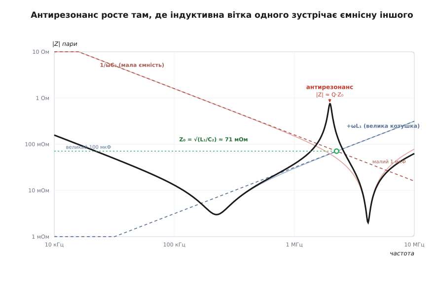
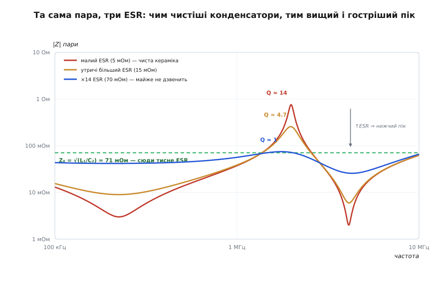

# 🧮 Імпеданс мережі живлення: від однієї галочки до антирезонансного піка

Мережу живлення проєктують за однією кривою — залежністю її повного опору |Z| від частоти. Уся практика — гнати цю криву донизу й тримати під стелею. Але щойно ми ставимо в паралель не один конденсатор, а кілька (а інакше й не буває), крива перестає бути простою сумою окремих галочок: між ними виростає гострий **пік**, якого не було в жодного конденсатора поодинці. Звідки він береться, на якій він частоті й наскільки високий — усе це не здогад, а наслідок кількох рядків алгебри з комплексними числами. Виведемо їх від першопричини, бо саме ці формули кажуть інженерові, скільки й яких конденсаторів ставити.

Домовимося про мову з самого початку. Опір реактивного елемента на змінному струмі — комплексне число: у котушки це +jωL, у конденсатора 1/(jωC) = −j/(ωC), де ω = 2π·f — колова частота, а j — уявна одиниця, що кодує зсув фази на 90°. Складати такі опори треба **як вектори на площині**, а не як звичайні числа, бо вони по-різному зсувають струм за фазою. Чому саме так і чому це неминуче — докладно розібрано у [виведенні галочки |Z| одного конденсатора](root:hw-power/esr-capacitor/math-impedance-curve.md); тут ми беремо той результат за цеглину й будуємо з цеглин мережу.

## Атом мережі: одна галочка

Реальний конденсатор — не чиста ємність, а три опори поспіль на шляху струму: послідовний опір втрат ESR, паразитна індуктивність виводів і монтажу L та власне ємність C. Той самий струм тече крізь усіх трьох, тож їхні комплексні опори просто додаються:

```
Z(ω) = ESR + jωL + 1/(jωC) = ESR + j·(ωL − 1/(ωC))
```

Дійсна частина — самий ESR (тепло, від частоти майже не залежить). Уся уявна частина зібралась у дужку **ωL − 1/(ωC)** — це різниця двох реактивностей, що тягнуть у протилежні боки. Модуль повного опору — довжина цієї стрілки за теоремою Піфагора:

```
|Z(ω)| = √( ESR² + (ωL − 1/(ωC))² )
```

Читаємо криву очима, женучи ω від малої до великої:

- **Низька частота** — панує 1/(ωC), решта дрібна: |Z| ≈ 1/(ωC), спадає обернено до частоти. Ємнісна асимптота. Конденсатор поводиться як конденсатор.
- **Висока частота** — 1/(ωC) зник, натомість виріс ωL: |Z| ≈ ωL, росте лінійно. Індуктивна асимптота. Конденсатор поводиться як котушка.
- **Посередині** дужка проходить через нуль — реактивності гасять одна одну. Це **частота власного резонансу** (SRF, self-resonant frequency):

```
ωL = 1/(ωC)   ⟹   ω² = 1/(L·C)   ⟹   f_SRF = 1/(2π·√(L·C))
```

У цій точці під коренем лишається саме ESR², тож |Z| падає до **самого ESR** — це дно галочки, найменший опір, який дає конденсатор. Ось три числа деталі, читані з однієї кривої: ліва вітка — це C, дно — це ESR, права вітка — це L. Кожен конденсатор має власне дно на власній SRF: об'ємний електроліт — на кілогерцах, дрібна кераміка — на десятках мегагерц. Тепер поставмо два таких поруч і подивимось, що вийде.

## Складаємо два конденсатори: паралель — це сума провідностей

Два конденсатори в паралель бачать **одну й ту саму напругу**, а струми крізь них додаються. Провідність (адмітанс) Y = 1/Z — це «скільки струму на вольт»; коли елементи ділять напругу, їхні провідності просто додаються, бо додаються струми:

```
I = I₁ + I₂ = V·Y₁ + V·Y₂   ⟹   Y_пар = Y₁ + Y₂   ⟹   Z_пар = 1/(Y₁ + Y₂) = Z₁·Z₂/(Z₁ + Z₂)
```

Спершу — добра новина, заради якої конденсатори й ставлять пачками. **Нижче обох SRF** обидва ще суто ємнісні: Y₁ ≈ jωC₁, Y₂ ≈ jωC₂, а їхня сума jω(C₁ + C₂). Дві ємності в паралель дають одну більшу — заряду вдвічі більше, опір удвічі нижчий. На низьких частотах паралель працює бездоганно: додав конденсатор — опустив криву.

Підступ починається вище. Візьмімо великий конденсатор і малий. Великий має низьку SRF; **вище за неї він уже індуктивний** — котушка з опором Y₁ ≈ 1/(jωL₁) = −j/(ωL₁). Малий на тих же частотах ще не дійшов до своєї SRF і лишається **ємнісним**: Y₂ ≈ jωC₂. І ось у паралелі зустрічаються котушка й конденсатор — а це коливальний контур.



*Дві похилі пунктирні прямі — асимптоти: індуктивна вітка великого конденсатора (+ωL₁, росте) і ємнісна вітка малого (1/ωC₂, спадає). Вони перетинаються в одній точці на рівні характеристичного опору Z₀ = √(L₁/C₂). Рівно під цим перетином спільна крива (жирна) не провалюється, а вистрілює вгору антирезонансним піком — там, де в обох конденсаторів окремо опір ще низький.*

## Звідки береться пік антирезонансу

Складімо дві провідності в цій смузі — індуктивну від великого й ємнісну від малого:

```
Y_пар ≈ −j/(ωL₁) + jωC₂ = j·(ωC₂ − 1/(ωL₁))
```

Провідність вийшла **чисто уявною** — сама реактивна, без втрат (ESR поки відкинули). І в ній та сама гра, що й у галочці, тільки навпаки. Раніше в послідовному колі занулювався **опір** — і |Z| сідав на дно. Тут занулюється **провідність**: коли ωC₂ = 1/(ωL₁), уявна частина Y пропадає, Y_пар → 0, а отже Z_пар = 1/Y_пар → **∞**. Не дно, а стеля. Не мінімум, а гострий максимум. Це **антирезонанс** — паралельний резонанс тієї самої пари L і C, дзеркальне відображення звичайного [резонансу](root:ph-waves/resonance): там послідовний контур на резонансі коротшає до нуля, тут паралельний — розривається до нескінченності.

Умова піка дає його частоту одразу:

```
ωC₂ = 1/(ωL₁)   ⟹   ω² = 1/(L₁·C₂)   ⟹   f_анти = 1/(2π·√(L₁·C₂))
```

Придивімося, що саме резонує. Це **не** власні L і C одного конденсатора (то була б його SRF). Це індуктивність L₁ **великого** конденсатора разом з ємністю C₂ **малого** — паразит однієї деталі, замкнений на корисну ємність іншої. Енергія починає гойдатися між ними: заряд з малого конденсатора розганяє струм в індуктивності великого, той перезаряджає малий у зворотний бік, і так туди-сюди. Мережа в цій точці не гасить збурення струму, а **підсилює** відгук напруги — рівно те, чого від мережі живлення не можна допустити.

Фізично зрозуміло, чому пік сидить **між** двома SRF. Нижче SRF великого обидва конденсатори ємнісні — просто додають ємність. Вище SRF малого обидва вже індуктивні — просто додають індуктивність (дві котушки в паралель, опір росте, але без піка). І лише у вузькій смузі поміж, де один уже котушка, а другий ще конденсатор, стоїть контур, здатний на антирезонанс. Чим ширший розрив між номіналами, тим ширша ця небезпечна смуга.

## Яка висота піка: характеристичний опір і добротність

Нескінченність — ідеалізація без втрат. Насправді в кожній вітці сидить ESR, і саме він визначає, наскільки високо злетить пік. Порахуймо |Z| у точці антирезонансу вже з опорами.

Ключ — одне спостереження. На частоті f_анти реактивність кожної вітки дорівнює одній і тій самій величині. Підставмо ω_анти = 1/√(L₁·C₂):

```
ω_анти·L₁ = L₁/√(L₁·C₂) = √(L₁/C₂)
1/(ω_анти·C₂) = √(L₁·C₂)/C₂ = √(L₁/C₂)
```

Обидві реактивності зійшлися на спільному значенні — це **[характеристичний опір](root:com-medium/characteristic-impedance)** контуру:

```
Z₀ = √(L₁/C₂)
```

Та сама комбінація √(L/C), що задає хвильовий опір лінії передачі чи опір коливального контуру на резонансі. Тепер знайдімо дійсну частину провідності кожної вітки — саме вона лишиться, коли уявні скоротяться. Для індуктивної вітки з малим опором R₁:

```
Re(Y₁) = R₁/(R₁² + (ω L₁)²) ≈ R₁/(ω_анти L₁)² = R₁/Z₀²
```

і так само Re(Y₂) ≈ R₂/Z₀² для ємнісної. У точці антирезонансу уявні частини гасяться, лишається сума дійсних:

```
Y_пар(f_анти) ≈ (R₁ + R₂)/Z₀²   ⟹   |Z|_пік ≈ Z₀²/(R₁ + R₂) = (L₁/C₂)/R
```

де R = R₁ + R₂ — сумарний ESR двох віток на цій частоті. Перепишемо через добротність контуру Q = Z₀/R — і формула висоти набуває найпромовистішого вигляду:

```
|Z|_пік ≈ Q·Z₀ = Q·√(L₁/C₂),   Q = Z₀/R = √(L₁/C₂)/R
```

Ось усе, що керує піком, у двох літерах. **Z₀ = √(L₁/C₂)** задає базовий рівень — тим вищий, чим більша індуктивність великого й чим менша ємність малого. А **Q** множить цей рівень — тим більше, чим чистіші (малоомніші) конденсатори. Ідеальна кераміка без втрат дає Q у сотні й пік до неба; трохи ESR — і пік осідає.

> 🔧 **Навіщо це.** Три множники піка — це три ручки, за які його тягнуть донизу, і всі три видно прямо у формулі |Z|_пік ≈ Q·√(L₁/C₂). Побільшити R (ESR) — упаде Q, осяде пік. Зменшити L₁ (коротша монтажна петля, кілька конденсаторів у паралель) — упаде і Z₀, і Q. Не робити прірви між номіналами — не даси C₂ стати надто малим, а Z₀ надто великим. Інженер не вгадує кількість конденсаторів: він рахує пік і дивиться, чи не протикає той стелю.

**Умова: великий конденсатор 100 мкФ (з монтажною індуктивністю L₁ = 5 нГн, ESR = 3 мОм) паралельно з малим 1 мкФ (ESR = 2 мОм).**
```
f_анти = 1/(2π·√(L₁·C₂))
       = 1/(2π·√(5·10⁻⁹ · 1·10⁻⁶))
       = 1/(2π·√(5·10⁻¹⁵))
       = 1/(2π·7.07·10⁻⁸)
       ≈ 2.25·10⁶ Гц  ≈  2.25 МГц

Z₀     = √(L₁/C₂) = √(5·10⁻⁹ / 1·10⁻⁶) = √(5·10⁻³)
       = 0.0707 Ом  ≈  71 мОм

R      = R₁ + R₂ = 3 + 2 = 5 мОм = 0.005 Ом
Q      = Z₀/R = 0.0707 / 0.005 ≈ 14.1
|Z|пік ≈ Q·Z₀ = 14.1 · 0.0707 ≈ 1.0 Ом
```

Спинімося на цьому числі. Кожен із двох конденсаторів окремо на 2 МГц має опір лічені міліоми. А в парі, рівно на 2.25 МГц, мережа показує **1 Ом** — у двісті разів вище за типову стелю в 5 мОм. Два добрих конденсатори разом дали вузьку смугу, де живлення провалюється дужче, ніж не було б їх узагалі. Ось чому антирезонанс — головна пастка: він народжується саме там, де «конденсаторів досить».

Чесна засторога про «≈». Формули f_анти й |Z|_пік — оцінки: ми відкинули власну індуктивність малого конденсатора й залишкову ємність великого. Врахуй їх — і точний пік зсунеться (у цьому прикладі вниз, до ~2.0 МГц і ~0.76 Ом): та сама декада частоти, той самий порядок висоти, та сама небезпека. Тому реальні розрахунки мережі розв'язують рівняння Y(ω) = 0 чисельно, а виведені формули дають правильну частоту, правильний масштаб і — головне — правильні важелі керування.

## Приборкання піка: та сама формула, три графіки

Найяскравіше з формули |Z|_пік ≈ Q·Z₀ видно роль ESR. Побільшуй сумарний R — і Q = Z₀/R тане, а з ним осідає пік, аж поки при Q ≈ 1 (коли R доростає до Z₀) від піка лишається пологий горбок: контур входить у критичне гасіння й перестає дзвеніти.



*Спільний імпеданс тієї самої пари конденсаторів за трьох значень ESR. Зелена пунктирна лінія — рівень Z₀ = √(L₁/C₂) ≈ 71 мОм. Малий ESR (Q ≈ 14) вистрілює піком до ~1 Ом; удесятеро більший ESR (Q ≈ 1) притискає пік майже до самого Z₀ — контур майже не дзвенить. Занадто «чиста» кераміка дає найгостріші й найнебезпечніші піки.*

Тому трохи ESR у мережі живлення — не вада, а ліки; надчиста кераміка з мізерним ESR дзвенить найдужче. Це та сама [добротність Q](root:hw-analog/quality-factor), що робить корисним коливальний контур у фільтрі, — лише повернута навспак: тут висока Q шкідлива.

Другий важіль — **не лишати прірв між номіналами**. Пік стоїть на Z₀ = √(L₁/C₂): стрибок 100 мкФ → 100 нФ робить C₂ малою, а Z₀ великим і пік високим; проміжна сходинка (скажімо, 1 мкФ між ними) тримає C₂ більшою, Z₀ нижчим, а сусідні галочки перекривають небезпечну смугу своїми низькими ділянками. Третій — **кількість**: N однакових конденсаторів у паралель ділять індуктивність вітки (L₁/N — паразитні котушки теж додаються як паралельні), а з нею падає і Z₀, і пік. Усі три прийоми, що в практиці звучать як окремі поради, — це одна нерівність: **|Z|_пік = Q·√(L₁/C₂) мусить лишатися нижчою за цільовий імпеданс** на всій смузі. Антирезонанс небезпечний рівно тим, що легко протикає цю стелю там, де самі галочки її не сягають.

## Ємність площин: плоский конденсатор під усім кристалом

Вище сотень мегагерц навіть найдрібніша кераміка вже безсила: заряд не встигає добігти крізь монтажну петлю. Там працює конденсатор без виводів узагалі — **пара суцільних площин** живлення й землі одна над одною. Дві мідні пластини з тонким діелектриком між ними — це буквально плоский конденсатор, і його ємність виводиться з нуля.

Прикладімо між площинами напругу V. Заряд розтечеться по пластинах і створить між ними майже однорідне поле напруженістю E = V/d, де d — відстань між площинами. Поле в діелектрику зв'язане з поверхневою густиною заряду σ через [діелектричну проникність](root:ph-electromagnetism/permittivity): σ = ε₀·ε_r·E, де ε₀ = 8.854·10⁻¹² Ф/м — електрична стала, а ε_r — відносна проникність діелектрика (для склотекстоліту FR-4 ε_r ≈ 4.3). Повний заряд на пластині площею A:

```
Q = σ·A = ε₀·ε_r·E·A = ε₀·ε_r·(V/d)·A
```

Ємність за означенням — заряд на вольт, C = Q/V. Напруга скорочується, і лишається чиста геометрія з проникністю:

```
C = ε₀·ε_r·A/d
```

Формула каже все: ємність зростає з площею перекриття A і з проникністю ε_r, але найдужче — від **тонкості** діелектрика d, бо він у знаменнику. Хочеш більше ємності площин — зближуй площини.

**Умова: пара площин 10×10 см (A = 0.01 м²), звичайний зазор d = 0.1 мм, FR-4 (ε_r = 4.3).**
```
C = ε₀·ε_r·A/d
  = 8.854·10⁻¹² · 4.3 · 0.01 / (1·10⁻⁴)
  = 8.854·10⁻¹² · 4.3 · 100
  = 8.854·10⁻¹² · 430
  ≈ 3.8·10⁻⁹ Ф  ≈  3.8 нФ
```

Три-чотири нанофаради з цілої долоні міді — небагато; звичайні площини дають скромну ємність. Але цінність її не в номіналі, а в тому, що ця ємність розподілена по всій площі просто під корпусом і має **майже нульову** послідовну індуктивність: тут немає ні виводів, ні петлі, ні перехідних отворів до конденсатора — заряд уже під кристалом. Тому площини працюють там, де жоден навісний конденсатор уже не встигає. А коли ємності треба більше, зменшують d: тонкі ламінати «вбудованої ємності» із зазором 8–25 мкм піднімають ту саму площу до десятків нанофарад (при d = 25 мкм — уже близько 15 нФ, учетверо більше).

Одна тонкість замикає коло цієї вставки. Ємність площин C_площ — теж конденсатор, і теж стоїть у паралелі з навісними. Отже вона так само антирезонує з їхніми індуктивностями, за тією ж формулою f_анти = 1/(2π·√(L·C_площ)) і |Z|_пік = Q·√(L/C_площ) — просто на вищих частотах. Пара площин з власною індуктивністю дає ще й свої резонанси порожнини. Тобто площини не окремий трюк, а ще один голос у тому самому хорі, який ми весь час зводимо до однієї кривої імпедансу.

## Де ця математика працює

Уся мережа живлення — це паралельне поєднання багатьох Z(ω), кожен з яких — галочка √(ESR² + (ωL − 1/ωC)²) зі своїм дном на своїй SRF. Складаються вони через суму провідностей Y = ΣYᵢ, і спільна крива |Z| = 1/|ΣYᵢ| має триматися під цільовим імпедансом на всій смузі. Донизу її тягнуть ємнісні ділянки багатьох конденсаторів; догори її штовхає **антирезонанс** — паралельний резонанс індуктивності одного конденсатора з ємністю сусіда.

Три формули цієї вставки — це три числа, якими інженер керує піком і рахує, чи впишеться мережа у стелю:

- **f_анти = 1/(2π·√(L_вел·C_мал))** каже, **де** з'явиться пік — між сусідніми номіналами, у робочій смузі.
- **Z₀ = √(L/C)** і **|Z|_пік ≈ Q·√(L_вел/C_мал)** кажуть, **наскільки він високий** — і що збити його можна лиш трьома ходами: побільшити ESR (менша Q), урізати індуктивність петлі (менші L і Z₀), не лишати прірв між номіналами (більша C_мал).
- **C = ε₀·ε_r·A/d** каже, **скільки** ємності дає остання лінія оборони — площини — і що вирішує тут не площа, а тонкість діелектрика.

Хто побачив, що дно галочки й вершина антирезонансу — це та сама піфагорова стрілка, прочитана то як послідовне коло (опір занулився, |Z| сів на ESR), то як паралельне (провідність занулилась, |Z| злетів до Q·Z₀), тому вся мережа живлення складається в одну картину: боротьба за те, щоб суму провідностей ніде не «продзвенів» антирезонанс вище за дозволену стелю.
