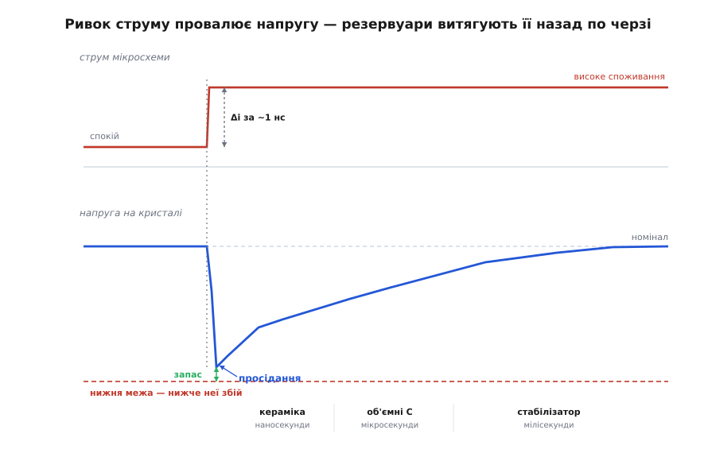
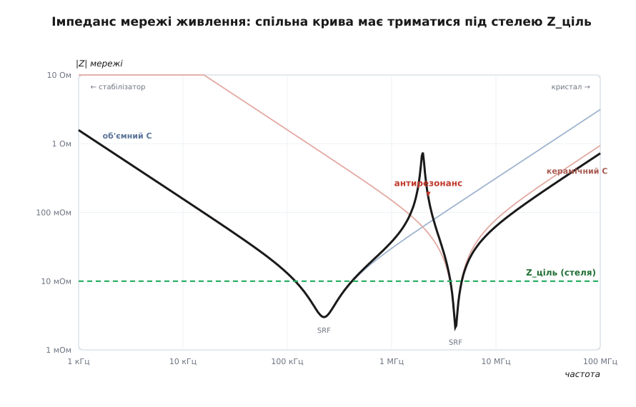

# Цілісність живлення (Power Integrity)

<preknowlist>
- [Закон Ома](root:hw-analog/ohms-law) — напруга дорівнює струм · опір; звідки береться сталий спад на міді.
- [Індуктивність](root:ph-electromagnetism/inductance) — чому провідник опирається саме ШВИДКІЙ зміні струму: V = L·(di/dt).
- [Конденсатор](root:hw-components/capacitor) — як він запасає заряд і здатен віддати його майже миттєво.
- [Імпеданс](root:ph-electromagnetism/impedance) — частотно залежний «опір» кола; мова, якою описують мережу живлення.
- [Розв'язувальний конденсатор](root:hw-components/decoupling) — локальний резервуар заряду впритул до мікросхеми.
</preknowlist>

Стабілізатор чесно видає рівно 1.0 В — а на ніжках мікросхеми в ту саму мить лише 0.93 В. Не через несправність: так поводиться будь-яка реальна плата. Між виходом стабілізатора й кристалом лежить мідь — доріжки, площини, перехідні отвори, виводи конденсаторів — і ця мідь живе за законами фізики, а не за нашими сподіваннями. Цілісність живлення (англ. power integrity — незіпсованість, «цілість» живлення) — це вміння тримати напругу на самому кристалі в дозволеному вікні попри те, що струм крізь цю мідь смикається шалено й швидко.

А смикається він тому, що цифрова мікросхема не сьорбає струм рівномірно. На кожному такті мільйони вентилів перемикаються разом, і споживання здатне стрибнути від часток ампера до кількох амперів за одну-дві наносекунди. Стабілізатор, що годує цей кристал, сидить за кілька сантиметрів і реагує за мікросекунди — у тисячі разів повільніше за сам стрибок. Виходить парадокс: мікросхема псує собі живлення власним же струмом, протягнутим крізь недосконалу мідь. Уся дисципліна виростає з цього одного факту.

## Два способи, якими мідь краде напругу

Мідь відбирає напругу двома різними механізмами, і сплутати їх — головна помилка початківця, бо лікуються вони по-різному.

Перший — **опір**. Будь-який провідник має якийсь опір, і струм на ньому лишає сталий спад за законом Ома: V = I·R. Протягнули 10 А крізь доріжку з опором 2 мОм — втратили 20 мВ, і ці 20 мВ не залежать від того, швидко чи повільно тече струм. Спад сталий, передбачуваний, його зменшують товщою міддю та ширшими площинами.

Другий механізм підступніший — **індуктивність**. Індуктивність — це інерція струму: провідник опирається не самому струмові, а його *зміні*. Коли струм намагається стрибнути, індуктивність наводить зустрічну напругу, що віднімається від шини рівно в найгіршу мить — коли мікросхемі струм найпотрібніший. Кількісно:

```
V = L · (di/dt)
```

Тут di/dt — швидкість зміни струму. І саме ця формула пояснює, чому швидкі кристали неможливо годувати «дротом»:

**Умова: коротка петля 1 нГн, ривок струму 3 А за 1 нс.**
```
L      = 1 нГн   = 1·10⁻⁹ Гн
di     = 3 А
dt     = 1 нс    = 1·10⁻⁹ с
V_прос = L · di/dt = 1·10⁻⁹ · (3 / 1·10⁻⁹)
       = 1·10⁻⁹ · 3·10⁹
       = 3 В
```
Три вольти просідання на шині, де вся напруга — один вольт. І це від жалюгідної петлі в один наногенрі, яку дає навіть пара сантиметрів доріжки. Тимчасовий провал напруги на швидкому фронті струму так і називають — **просідання** (англ. droop, «спад»). Годувати логіку прямим дротом від далекого стабілізатора означало б заганяти її в такі провали на кожному такті — кристал просто не працюватиме.

## Ліки: локальний резервуар заряду

Наздогнати наносекундний ривок стабілізатор не може — надто далеко, надто повільно. Тож ми його про це й не просимо. Замість гонитви ми ставимо запас заряду впритул до мікросхеми — [розв'язувальний конденсатор](root:hw-components/decoupling). Він тримає заряд поруч і віддає його майже миттєво, поки повільний стабілізатор наздоганяє.

Картина як з водою: далеке водосховище — це стабілізатор, труба до нього довга. Раптовий великий ковток закриває не водосховище, а маленький бак просто над краном; повільна труба спокійно доливає бак у паузах між ковтками. Аналогія точна рівно до одного місця, де й ламається: бак-конденсатор теж має власну інерцію — індуктивність своїх виводів і монтажу, — тож і в нього є межа швидкодії. Саме через цю межу один конденсатор ніколи не рятує.

## Чому одного конденсатора замало

Реальний конденсатор — не чиста ємність. Це ємність C, послідовно з якою природа вмонтувала паразитну індуктивність виводів ESL (equivalent series inductance) і послідовний опір ESR (equivalent series resistance). Через це його [імпеданс залежить від частоти «галочкою»](root:hw-components/capacitor-parasitics): на низьких частотах панує ємність і опір падає як 1/(ωC); на найнижчій точці «галочки» лишається сам ESR; далі бере гору індуктивність ESL і опір знову *росте* як ωL. Дно припадає на **частоту власного резонансу** (SRF, self-resonant frequency):

```
f_SRF = 1 / (2π · √(L · C))
```

**Умова: конденсатор 100 нФ з паразитною індуктивністю 1 нГн.**
```
L     = 1 нГн   = 1·10⁻⁹ Гн
C     = 100 нФ  = 1·10⁻⁷ Ф
f_SRF = 1 / (2π · √(1·10⁻⁹ · 1·10⁻⁷))
      = 1 / (2π · √(1·10⁻¹⁶))
      = 1 / (2π · 1·10⁻⁸)
      ≈ 15.9 МГц
```
Вище приблизно 16 МГц цей «конденсатор» поводиться як котушка — розв'язувати ним уже нічого не можна. Ось де корінь проблеми: великий електролітичний конденсатор має низьку SRF (добрий на кілогерцах, мертвий на мегагерцах), а дрібна кераміка — високу (живе до сотень мегагерц, зате мало заряду). Жоден номінал не закриває всю смугу сам. Потрібна команда. [Як саме виводиться форма цієї кривої, точка SRF і частота антирезонансу](root:hw-pcb/power-integrity/math-pdn-impedance.md) — окремо в математичній вставці.

## Ланцюг рубежів: естафета в частотах

Тому мережу живлення будують як естафету резервуарів, де кожен закриває свою смугу частот і передає естафету наступному, щойно його власний імпеданс починає рости:

- **Стабілізатор ([VRM](root:hw-power/switching-converter))** — від постійного струму до одиниць кілогерц (доти дістає його петля керування).
- **Об'ємні конденсатори** (десятки–сотні мкФ) — від кілогерц до приблизно мегагерца.
- **Керамічні розв'язувальні** (100 нФ – 10 мкФ) — приблизно від мегагерца до сотень мегагерц.
- **Ємність у корпусі й на самому кристалі** — вище сотень мегагерц, де жодна плата вже не встигає.

Той самий ланцюг у часі виглядає як черга дедалі швидших і дрібніших баків: перший удар струму гасить внутрішньокристальна ємність, за наносекунди її підхоплює кераміка, за мікросекунди — об'ємні конденсатори, а за мілісекунди повертає номінал стабілізатор. Кожен рубіж викуповує час для наступного, повільнішого.



*Ривок струму (угорі) миттєво провалює напругу на кристалі; кераміка, об'ємні конденсатори й стабілізатор по черзі витягують її назад — аби провал не пробив нижню межу вікна живлення.*

## Одне число замість усього: цільовий імпеданс

Тепер зведімо всю цю складність до однієї величини — і побачимо, як інженер її насправді проєктує. Струм мікросхеми має багато частотних складників; на кожній частоті мережа відповідає своїм імпедансом, а брижі напруги — це просто закон Ома в частотній області: пульсація = струм · імпеданс на цій частоті. Щоб пульсація ніде не вилізла за бюджет, потрібно, щоб імпеданс мережі всюди був нижчий за стелю. Цю стелю й називають **цільовим імпедансом**:

```
Z_ціль = ΔV / ΔI
```

**Умова: шина 1.0 В із допуском ±5%, кидок споживання 10 А.**
```
ΔV     = 5% від 1.0 В = 0.05 В
ΔI     = 10 А
Z_ціль = ΔV / ΔI = 0.05 / 10
       = 0.005 Ом = 5 мОм
```
П'ять міліомів — і тримати їх треба не на одній частоті, а суцільно від постійного струму до сотень мегагерц. Це в рази менше за опір звичайної доріжки на платі; ось чому цілісність живлення — інженерна задача, а не «поставив конденсатор і забув». Уся робота зводиться до одного: **утримати криву імпедансу мережі під лінією Z_ціль на всій смузі частот**. Сама ідея згорнути мережу до однієї частотно-рівної цілі й проєктувати під неї викристалізувалася наприкінці 1990-х; [коротка історія методу цільового імпедансу](root:hw-pcb/power-integrity/hist-target-impedance.md) — окремою вставкою. А [порахувати цю криву для конкретного набору конденсаторів і перевірити її проти цілі можна кодом](root:hw-pcb/power-integrity/proj-pdn-calculator.md) — робочий скрипт у проєктній вставці.

> 🔧 **Навіщо це.** Цільовий імпеданс перетворює розпливчасте «поставте достатньо конденсаторів» на конкретне технічне завдання з числом. Знаючи Z_ціль і паразити конденсаторів, інженер добирає *номінали й кількість* під бюджет, а не навмання: шина 5 мОм до 100 МГц може вимагати кількох десятків керамічних конденсаторів у правильних місцях — і рівно стільки, скільки треба, ані менше (провали живлення), ані більше (зайва вартість і місце).



*Кожен конденсатор дає свою «галочку» з дном на власній SRF; їхнє паралельне поєднання (жирна крива) має триматися під стелею Z_ціль — але між двома номіналами вигулькує пік антирезонансу, що протикає ціль.*

## Пастка: антирезонанс

Найпідступніше в цій картині ховається саме *між* конденсаторами. Візьмімо великий і малий у паралель. На частотах вище SRF великого він уже індуктивний (котушка), а малий на цих же частотах ще ємнісний. Індуктивність паралельно з ємністю — це коливальний контур, і на його резонансі імпеданс не падає, а *підскакує*. Це **антирезонанс** (паралельний резонанс): рівно в робочій смузі виростає гострий пік, що легко протикає лінію Z_ціль — і мережа, яка «має досить конденсаторів», раптом провалює живлення на одній прикрій частоті. Це та сама фізика, що й у [резонансному контурі](root:ph-waves/resonance), лише повернута навспак: тут гострий пік — не корисний, а шкідливий.

Приборкують його трьома важелями: невеликий ESR конденсаторів гасить добротність піка (надто «чиста» кераміка дає найгостріші піки); не лишають великих провалів між номіналами (стрибок 100 мкФ → 100 нФ дає ширший небезпечний зазор, ніж кілька проміжних сходинок); і ставлять багато конденсаторів кількох добре підібраних номіналів, а не по одному кожного. [Частоту й висоту цього піка](root:hw-pcb/power-integrity/math-pdn-impedance.md) виводить математична вставка.

## Де насправді виграється бій: петля й розташування

Найважливіше відкриття цілісності живлення таке: вирішальна індуктивність — здебільшого *не* власна ESL конденсатора, а індуктивність **монтажної петлі**. Струм від конденсатора мусить пройти крізь його контактні площадки, перехідні отвори, площини, дійти до ніжок живлення й землі мікросхеми — і повернутися назад. Уся ця петля має індуктивність, і вона тим більша, чим більша *площа*, яку петля охоплює.

Звідси все практичне проєктування: конденсатори садять якнайближче до ніжок (часто на зворотному боці плати просто під корпусом BGA), ведуть до площин короткі товсті отвори, роблять діелектрик між площинами тонким. Чудовий конденсатор, посаджений за два сантиметри доріжки, вище кількох мегагерц уже марний — його рятівний заряд не встигає добігти крізь власну петлю. Ось чому цілісність живлення — це насамперед дисципліна *топології* [плати](root:hw-pcb/pcb-stackup), а не просто перелік деталей у специфікації. Однакові за списком плати з різним розведенням поводяться геть по-різному.

## Площини живлення й стрибок землі

Суцільна пара площин — живлення й землі одна над одною — працює одразу на два фронти. По-перше, це плоский конденсатор: дві мідні пластини з тонким діелектриком між ними дають розподілену **ємність площин**, що допомагає на високих частотах. По-друге, широка площина — це найменш індуктивний шлях, яким струм розтікається до всіх споживачів. Що тонший діелектрик між площинами, то більша ємність і то менша індуктивність — обидва виграші разом.

Зворотний бік тієї самої медалі — **стрибок землі**. Коли багато виходів мікросхеми перемикаються одночасно, їхній зворотний струм тече крізь спільну індуктивність землі, і локальна «земля» кристала на мить підстрибує відносно землі плати. Цей [стрибок землі](root:hw-pcb/ground-bounce) (разом із просіданням живлення його звуть шумом одночасного перемикання, SSN) з'їдає запас по завадостійкості так само, як просідання шини. Тому [проєктування площини землі](root:hw-pcb/ground-plane-design) — невіддільна половина задачі про цілісність живлення: живлення й земля утворюють одну петлю, і рахувати їх нарізно не можна.

## Що з усього цього складається

Цілісність живлення — це утримання напруги на кристалі в його вузькому вікні попри блискавичні кидки струму. Досягається воно не одним прийомом, а зведенням усіх до однієї мети: **притиснути криву імпедансу мережі під лінію цільового імпедансу на всій смузі частот**. Для цього вибудовують ланцюг резервуарів (стабілізатор → об'ємні → керамічні → ємність на кристалі), у кожного зважають на паразити, садять їх так, щоб петля струму була якнайменша, кладуть на площини, що додають ємності й розтікають струм, — і всюди обходять антирезонансні піки.

Коли цей ланцюг рветься, наслідки не абстрактні. Просіла шина — і логіка читає нулі замість одиниць, лічильники збиваються, процесор зависає; підстрибнула земля — і зростає тремтіння тактів (джитер), тане запас за часовими діаграмами; а різкі струмові петлі, не притиснуті конденсаторами близько, вихлюпуються назовні електромагнітними завадами. Тому цілісність живлення — це не окрема галочка наприкінці проєкту, а те, що визначає, чи взагалі працюватиме швидка цифрова плата.
