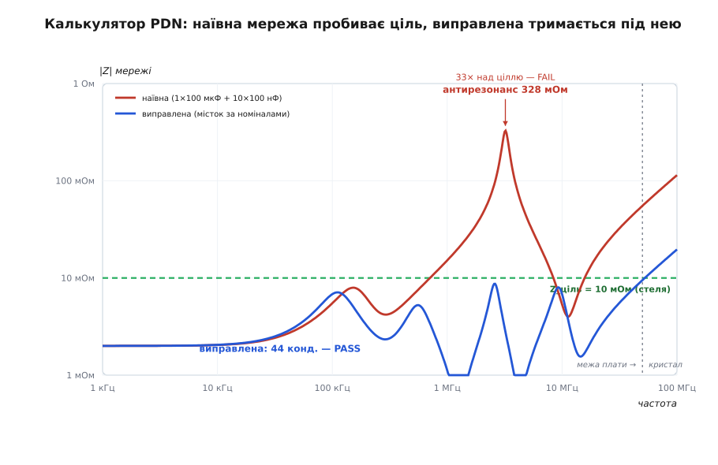

# ⚙️ Калькулятор імпедансу мережі живлення: від списку конденсаторів до вироку pass/fail

Формула антирезонансу дає оцінку: пік стоїть десь коло 1/(2π·√(L·C)) і сягає приблизно Q·√(L/C). «Десь» і «приблизно» тут — не окраса, а чесне зізнання. Щойно мережа перестає бути парою конденсаторів і стає стабілізатором плюс жменею номіналів, де в кожного свій опір втрат, своя монтажна індуктивність і своя кількість штук у паралель, точні частота й висота піка зсуваються так, що вгадати їх наосліп годі. А проєкт живлення провалюється саме на цій точності: пік, який за грубою прикидкою ледь торкався стелі, насправді протикає її вдвічі — і плата, у якій «конденсаторів досить», збоїть на одній прикрій частоті.

Чесний спосіб дізнатися правду — не вгадувати, а порахувати. Уся мережа зводиться до однієї кривої |Z(f)|, а крива — до кількох рядків арифметики з комплексними числами: скласти провідності всіх гілок, обернути суму, взяти модуль на кожній частоті. Це рівно та задача, для якої створений Python із вбудованим типом `complex` і numpy: цілий частотний свіп рахується однією векторною дією, без жодного циклу по частоті. Нижче — робочий скрипт, який будує мережу зі списку конденсаторів, проходить смугу логарифмічною сіткою, знаходить найгіршу точку й піки антирезонансу та друкує вирок проти цільового імпедансу.

### Задача

На вході — три речі. Перша: **специфікація конденсаторів**, тобто список, у якому кожен рядок задає один номінал чотирма числами — ємність C, послідовний опір втрат ESR, паразитну індуктивність монтажу ESL і кількість однакових штук у паралель. Друга: проста модель [стабілізатора (VRM)](topic:hw-power/switching-converter) — його вихідний опір і індуктивність, бо на низах криву тримає саме він. Третя: **цільовий імпеданс** Z_ціль — стеля, під якою крива мусить лишатися на всій смузі. Для шини 1.0 В із допуском ±5 % і кидком споживання 5 А стеля виходить Z_ціль = 0.05 В / 5 А = 10 мОм.

На виході потрібні не картинки, а числа для рішення: найгірше значення |Z| на всій смузі й **частота**, де воно трапляється; усі піки антирезонансу, що протикають стелю; і один підсумковий вирок — pass чи fail. Саме частота найгіршої точки цінна найбільше: вона каже інженерові, *між якими* номіналами зяє діра, а отже, який конденсатор додати, щоб її закрити.

### Ідея

Уся фізика мережі складається в один рядок: **провідності паралельних гілок додаються**. Провідність (адмітанс) Y = 1/Z — це «скільки струму на вольт»; коли всі гілки бачать одну напругу шини, їхні струми додаються, а з ними й провідності. Тому мережу не треба зводити хитрими формулами — її треба просто підсумувати:

```
Yᵢ(ω)      = 1 / (ESRᵢ + jωLᵢ + 1/(jωCᵢ))     ← галочка одного конденсатора
Y_мережі(ω) = Y_VRM(ω) + Σ nᵢ · Yᵢ(ω)          ← сума всіх гілок
|Z(ω)|     = 1 / |Y_мережі(ω)|                  ← те, що тримаємо під стелею
```

Кожен конденсатор — це [та сама «галочка»](topic:hw-components/capacitor-parasitics): три опори поспіль на шляху струму, ESR + jωL + 1/(jωC), з дном на власній частоті резонансу. [Звідки береться форма цієї кривої й чому реактивності складають як вектори](topic:hw-power/esr-capacitor/math-impedance-curve.md) — окрема алгебра; тут ми беремо галочку за цеглину. Множник nᵢ — це кількість однакових конденсаторів: N штук у паралель множать провідність гілки на N (рівно те саме, що поділити її ESL і ESR на N). VRM входить у суму як ще одна гілка з провідністю 1/(R + jωL): нижче смуги своєї петлі керування він тримає шину малим опором, вище — здається просто індуктивністю виходу й естафету віддає конденсаторам.

І весь фокус у тому, що ω тут може бути не одним числом, а цілим масивом частот. numpy проганяє комплексну арифметику поелементно, тож `1/(esr + 1j*w*esl + 1/(1j*w*C))` при масиві `w` одразу дає масив провідностей на всій сітці. Свіп зникає як окремий цикл — лишається кілька векторних виразів, а тоді `argmax` по модулю знаходить найгіршу точку, а простий перебір локальних максимумів — піки антирезонансу.

> 🔧 **Навіщо це.** Сума провідностей — не просто зручна формула, а пояснення, чому мережу не рятує «докинути ще таких самих». Антирезонансний пік — це точка, де Y_мережі занулюється (реактивні частини гілок гасять одна одну), а Z = 1/Y злітає вгору. Додати ще N однакових конденсаторів до тієї ж гілки — помножити її Y на константу; нуль суми від множення однієї доданки на число нікуди не дівається, лише трохи зсувається. Тому діру затуляє не *кількість* того самого номіналу, а *інший* номінал, чия галочка сідає низько рівно там, де в сусідів провал. Калькулятор показує це на очах: докидаєш рядок у список — і дивишся, чи присів пік.

### Код

Скрипт цілком поміщається на екран. Клас `Cap` тримає модель однієї галочки з кількістю штук, `VRM` — стабілізатор, `pdn_impedance` складає всі провідності на заданій сітці частот, а `analyse` проганяє смугу, шукає найгірше й друкує вирок.

```python
import numpy as np


class Cap:
    """Реальний конденсатор: ємність C, паразитна індуктивність монтажу ESL,
    опір втрат ESR. n однакових штук у паралель."""
    def __init__(self, C, esr, esl, n=1):
        self.C, self.esr, self.esl, self.n = C, esr, esl, n

    def admittance(self, w):                      # w — масив колових частот
        z = self.esr + 1j * w * self.esl + 1.0 / (1j * w * self.C)
        return self.n / z                         # n у паралель → провідність ×n


class VRM:
    """Стабілізатор як R + jωL: нижче смуги петлі керування тримає шину малим
    опором, вище — здається просто індуктивністю виходу."""
    def __init__(self, esr, esl):
        self.esr, self.esl = esr, esl

    def admittance(self, w):
        return 1.0 / (self.esr + 1j * w * self.esl)


def pdn_impedance(freqs, vrm, caps):
    """|Z(f)| паралельного поєднання VRM і всіх конденсаторів — на всій сітці."""
    w = 2 * np.pi * freqs
    Y = vrm.admittance(w)
    for c in caps:
        Y += c.admittance(w)                      # провідності просто додаються
    return 1.0 / Y                                # комплексний Z, поелементно


def analyse(name, vrm, caps, z_target, f_lo=1e3, f_hi=50e6, n=4000):
    f = np.logspace(np.log10(f_lo), np.log10(f_hi), n)   # логарифмічна сітка
    Z = np.abs(pdn_impedance(f, vrm, caps))
    i = int(np.argmax(Z))                         # найгірша точка всієї смуги
    ok = Z[i] <= z_target
    ntot = sum(c.n for c in caps)
    print(f"[{name}]  {ntot} конденсаторів,  ціль Z_ціль = {z_target*1e3:.0f} мОм")
    print(f"    найгірше   |Z|max = {Z[i]*1e3:6.1f} мОм @ {f[i]/1e6:5.2f} МГц"
          f"   ({Z[i]/z_target:.1f}× цілі)  ->  {'PASS' if ok else 'FAIL'}")
    # піки антирезонансу — локальні максимуми кривої, що вилізли над стелю
    for k in range(1, n - 1):
        if Z[k] > Z[k-1] and Z[k] > Z[k+1] and Z[k] > z_target:
            print(f"    антирезонанс {Z[k]*1e3:6.1f} мОм @ {f[k]/1e6:5.2f} МГц"
                  f"  (протикає ціль)")
    print()
    return ok


if __name__ == "__main__":
    vrm = VRM(esr=2e-3, esl=6.4e-9)
    Z_CIL = 10e-3                                  # стеля: 1.0 В ±5% при кидку 5 А

    # наївна мережа: один об'ємний плюс банка дрібної кераміки
    naive = [Cap(100e-6, 5e-3,  3.5e-9),          # 1× 100 мкФ (об'ємний)
             Cap(100e-9, 40e-3, 2.0e-9, n=10)]    # 10× 100 нФ (кераміка)

    # виправлена: сходинки між номіналами замість прірви
    fixed = [Cap(100e-6, 5e-3,  2.8e-9, n=2),     # 2× 100 мкФ
             Cap(10e-6,  3e-3,  1.6e-9, n=6),     # 6× 10 мкФ  — місток
             Cap(1e-6,   8e-3,  1.4e-9, n=12),    # 12× 1 мкФ  — місток
             Cap(100e-9, 40e-3, 1.3e-9, n=24)]    # 24× 100 нФ

    analyse("наївна",     vrm, naive, Z_CIL)
    analyse("виправлена", vrm, fixed, Z_CIL)
```

Ядро — три рядки в `pdn_impedance`: завести провідність VRM, доскладати провідності конденсаторів, обернути. Усе інше — обгортка: сітка частот, пошук максимуму, друк. Якщо numpy під рукою немає (скажімо, на голому мікроконтролері у складі самоперевірки прошивки), той самий вираз працює й на стандартному `complex` у циклі по частотах — просто повільніше й багатослівніше; сенс від цього не міняється, бо арифметика та сама.

### Прогін: об'ємний плюс керамічний

Наївна мережа — те, що зробить кожен за старим рецептом «насипати конденсаторів»: один об'ємний резервуар на 100 мкФ для повільних коливань і банка з десяти керамічних по 100 нФ упритул до мікросхеми. За списком деталей — з надлишком. Ось що каже калькулятор:

```
[наївна]  11 конденсаторів,  ціль Z_ціль = 10 мОм
    найгірше   |Z|max =  327.9 мОм @  3.21 МГц   (32.8× цілі)  ->  FAIL
    антирезонанс  327.9 мОм @  3.21 МГц  (протикає ціль)

[виправлена]  44 конденсаторів,  ціль Z_ціль = 10 мОм
    найгірше   |Z|max =    9.5 мОм @ 50.00 МГц   (0.9× цілі)  ->  PASS
```

Вирок безжальний: на 3.21 МГц мережа показує 328 мОм — у тридцять три рази вище за стелю, хоч кожен із одинадцятьох конденсаторів окремо на цій частоті має лічені міліоми. Це та сама пастка, тільки полічена: об'ємний на 100 мкФ вище своєї частоти резонансу вже індуктивний, керамічна банка ще ємнісна, і між ними стоїть коливальний контур, що не гасить збурення, а підсилює його. Прірва номіналів — 100 мкФ проти 100 нФ, тисячократний стрибок — робить цей контур широким і високим. Одинадцять правильних деталей, поставлених неправильним набором, дали вузьку смугу, де живлення провалюється гірше, ніж коли б їх не було зовсім.

Виправлення видно в другому рядку виводу й у списку `fixed`: не «ще керамики», а **сходинки** між крайніми номіналами. Між 100 мкФ і 100 нФ вставлено 10 мкФ і 1 мкФ — кожен закриває своєю низькою ділянкою ту смугу, де сусіди провалюються; кожного номіналу поставлено по кілька штук, щоб поділити індуктивність гілки. Сорок чотири конденсатори чотирьох номіналів тримають криву під 10 мОм на всій смузі до 50 МГц — вирок PASS. Порівняння двох кривих і промовляє суть методу: справа не в кількості міді, а у **формі кривої проти частоти**.



*Червона крива — виправлена мережа з 44 конденсаторів чотирьох номіналів: пласка, під стелею Z_ціль = 10 мОм аж до межі плати (50 МГц), де естафету підхоплює ємність на кристалі. Зелена — наївний набір з тих самих деталей одним стрибком номіналів: гострий пік антирезонансу на 3.2 МГц пробиває ціль у тридцять три рази. Той самий бюджет міді, протилежний результат — уся різниця у формі кривої.*

### Складність і пастки

Обчислювальна складність тут дитяча — O(N·M): N точок сітки на M гілок, частки секунди навіть для сотні конденсаторів. Уся підступність не в математиці, а в **числах, які ти згодовуєш моделі**, і в **тому, як читаєш результат**. Ось де калькулятор бреше найохочіше.

**Монтажна індуктивність домінує над паспортною ESL.** Найдорожча помилка — узяти ESL із даташита конденсатора. Там стоїть власна індуктивність корпусу — часток наногенрі; а струм від конденсатора біжить не в корпусі, а в петлі: контактні площадки, перехідні отвори, ділянка площини, ніжки мікросхеми й назад. Ця монтажна петля додає одиниці наногенрі — на порядок більше за паспорт. Підставмо в наївну мережу паспортні 0.5 нГн — калькулятор пообіцяє мирний пік 52 мОм на 7 МГц. Підставмо чесні 2 нГн монтажу — і той самий пік підскакує до 328 мОм на 3.2 МГц. Шестикратна різниця висоти й зсув частоти вниз — з нічого, з одного оптимістичного числа. У поле ESL мусить іти індуктивність **петлі**, полічена з [топології плати](topic:hw-pcb/pcb-stackup), а не цифра з даташита; інакше калькулятор дасть заспокійливий, але фальшивий вирок.

**Прірва номіналів роздуває пік.** Висота антирезонансу росте з характеристичним опором контуру Z₀ = √(L_вел/C_мал): що більша індуктивність об'ємного й що менша ємність дрібного сусіда, то вищий пік. Стрибок 100 мкФ → 100 нФ робить C_мал крихітною, а Z₀ величезним. Місток лікує це прямо: додаймо в наївну мережу проміжні 1 мкФ — і пік осідає з 328 до 60 мОм, ще й з'їжджає на мегагерц, де його легше добити. Кожна проміжна сходинка не дає жодному контуру розкластися на широку індуктивність проти малої ємності.

**«Надто чиста» кераміка дає гостріший пік.** Найконтрінтуїтивніша пастка: кращий конденсатор псує мережу. Висоту піка задає добротність Q = Z₀/R, а R — це сумарний ESR гілок; що менший ESR, то вища Q і гостріший пік. Проженімо наївну мережу з трьома значеннями ESR кераміки:

```
ESR кераміки   5 мОм (чиста)   →  пік  728 мОм
ESR кераміки  40 мОм (звичайна) →  пік  328 мОм
ESR кераміки 200 мОм (втратна)  →  пік  101 мОм
```

Ідеальна малоомна кераміка дзвенить найдужче — це та сама [добротність Q](topic:hw-analog/quality-factor), що робить корисним контур у фільтрі, лише повернута навспак: тут висока Q шкідлива. Практичний висновок дражливий: трохи опору в мережі живлення — не вада, а ліки, і подеколи гострий пік гасять свідомо втратнішим (керамічним із контрольованим ESR) конденсатором. Це прямий родич звичайного [резонансу](topic:ph-waves/resonance) — паралельний контур, у якого мала втрата означає високу стелю замість глибокого дна.

**Сітка не має проґавити пік.** Гострий пік високої Q вузький, і рідка сітка може переступити його, недорахувавши висоту. Тридцять логарифмічних точок на смугу дадуть за пік 138 мОм замість справжніх 328 — усе ще FAIL, але зсунутий і вдвічі занижений; а якби пік стояв на межі стелі, рідка сітка збрехала б PASS. Тому смугу проходять густо (сотні точок на декаду), а надійний калькулятор ще й **уточнює** кожен знайдений максимум — переганяє вузьку сітку навколо нього, поки частота піка не перестане зсуватися. Дешева перевірка: згусти сітку вдвічі; якщо пік підрос — вона ще рідка.

**Межа смуги — це рішення, а не дрібниця.** Вирок залежить від того, де поставити f_hi. Виправлена мережа тримається під 10 мОм до 50 МГц, але це не край її кривої: до 100 МГц вона вже показала б 20 мОм, до 200 МГц — 40 мОм, бо вище всі конденсатори індуктивні й крива невпинно росте. PASS означає лише, що плата чесно робить свою частину **до тієї частоти, де естафету бере ємність у корпусі й на самому кристалі**. Постав f_hi надто високо — і засудиш плату за роботу, яка їй не належить; надто низько — і проґавиш реальний пік. Межу треба класти там, де починає діяти внутрішньокристальна ємність (десятки–сотні мегагерц), а не де попало.

**Це зосереджена модель, а не польова.** Уся мережа тут — одна точка: усі конденсатори ніби висять на спільному вузлі. Реальна плата розподілена: між конденсатором і мікросхемою лежить індуктивність розтікання по площині, а самі пари площин мають власні резонанси порожнини на високих частотах. Зосереджений калькулятор їх не бачить — і не має бачити: він дає **перший, найдешевший зріз**, яким добирають номінали й кількість за десяток прогонів, перш ніж чіпати повільні польові симулятори (SPICE із моделлю розведення, електромагнітний розв'язувач). Знати цю межу — частина ремесла: калькулятор відповідає на питання «які номінали й скільки», а не «де саме їх посадити».

### Що дає цей інструмент

Сорок рядків перетворюють розпливчасте «постав достатньо конденсаторів» на дві конкретні відповіді: **наскільки** крива протикає стелю й **на якій частоті**. Друге число — головне: воно показує пальцем на діру між номіналами, а отже, підказує не «ще міді», а *який саме* номінал додати. Інженер тепер добирає специфікацію на екрані — докидає рядок, дивиться, чи присів пік, зважує вартість проти ризику проти швидкодії — замість того щоб паяти плату й ловити збій на стенді. Те саме трирядкове ядро (Y = ΣYᵢ, Z = 1/Y) однаково працює для двох конденсаторів і для сотні; фізика не змінюється, довшає лише список. А коли крива лягла під ціль на всій потрібній смузі, у інженера є не відчуття «начебто досить», а перевірне число — те саме, заради якого метод цільового імпедансу колись і народився.
