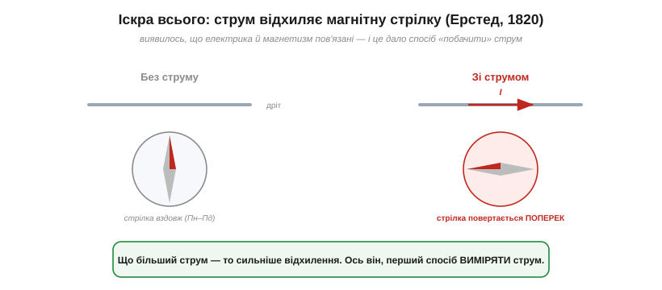
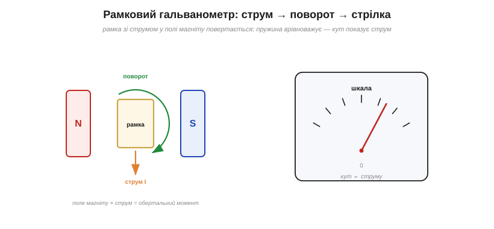
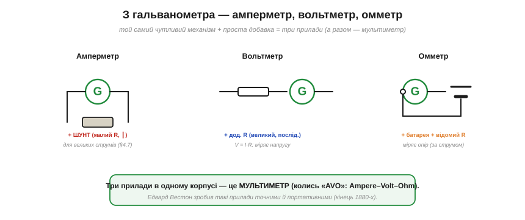
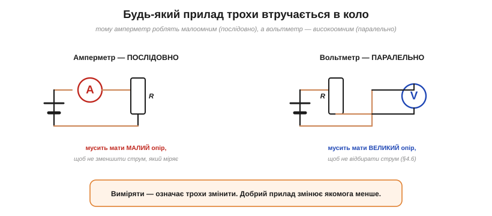

# 📜 Як побачити невидиме: від компасної стрілки до мультиметра

> Уся наука кіл — заряд, струм, напруга, опір — оперує **невидимими** величинами. Та щоб із ними працювати, інженерові треба їх **бачити**: скільки тече струму, яка напруга, який опір. Ця історія — про те, як людство навчилося міряти електрику: від випадкового тремтіння компасної стрілки до мультиметра у вашій кишені. І червоною ниткою тут проходить думка, яку варто засвоїти раз і назавжди: **виміряти — означає трохи втрутитися**.

---

## Як зробити невидиму електрику видимою

Уявіть науку без приладів. Струм не видно, не чути, не помацати; напруга — тим паче. Перші дослідники електрики мали лише грубі чуття: іскру, удар струму, відхилення бузинової кульки. Цього вистачало, щоб **помітити** явище, але не **виміряти**. А без числа немає інженерії: не скажеш «тут 0.5 ампера», не порівняєш, не розрахуєш. Потрібен був спосіб обернути невидимий струм на щось **видиме й мірне** — стрілку, кут, число. І такий спосіб з'явився майже випадково.

---

## Ерстед і компасна стрілка (1820)

1820 року данський фізик **Ганс Крістіан Ерстед** (*Hans Christian Ørsted*) — який зв'язку між електрикою та магнетизмом шукав уже від 1818-го — на лекційній демонстрації побачив дивовижу: коли він пускав струм дротом, **магнітна стрілка** компаса поруч **поверталася**. Електрика рухала магніт! (Популярний переказ про «випадкове» відкриття просто під час лекції — спрощення: Ерстед давно цілеспрямовано шукав цей зв'язок.) Це відкриття **електромагнетизму** сколихнуло всю фізику — а для нас важливий його практичний бік.

*Без струму магнітна стрілка стоїть уздовж північ–південь. Щойно дротом тече струм — вона повертається поперек, і то тим сильніше, чим більший струм. Ось він, перший спосіб **побачити** і навіть **виміряти** струм.*

Ключове: відхилення стрілки **тим більше, чим сильніший струм**. А це вже не просто «помітити» — це **виміряти**! Невидимий струм нарешті дістав видимий прояв, та ще й кількісний. Лишалося перетворити цю грубу вказівку на точний прилад.

---

## Від стрілки до приладу: гальванометр

Першу ж надбудову зробив того самого 1820 року **Йоганн Швайггер** (*Johann Schweigger*): він намотав дріт **багатьма витками** навколо стрілки. Кожен виток додавав свій вплив, тож слабкий струм відхиляв стрілку набагато помітніше. Цей «помножувач» і став першим **гальванометром** (*galvanometer*) — приладом для вимірювання струму (назва — на честь Луїджі Гальвані з його дослідами над жаб'ячими лапками).

*Зрілий, рамковий гальванометр: котушка (рамка) зі струмом висить у полі постійного магніту. Струм створює обертальний момент, рамка повертається, а пружинка його врівноважує — тож кут повороту стрілки **пропорційний струму**. Це серце всіх стрілкових приладів.*

Згодом прилад дозрів у **рамковий** (магнітоелектричний) механізм — той, що ви бачите в усіх стрілкових приладах. Тут навпаки: **постійний магніт нерухомий**, а в його полі висить легка **котушка** (рамка), крізь яку пускають струм. Струм у магнітному полі зазнає сили, котушка повертається, а спіральна **пружинка** опирається — і кут, на який повернеться стрілка, рівно **пропорційний струму**. Такий механізм (його пов'язують з іменами **д'Арсонваля** й **Депре**, 1880-ті) стабільний, точний і не боїться земного магнетизму. Невидимий струм остаточно став **кутом стрілки на шкалі**.

Чутливість таких приладів вражала. Дзеркальний гальванометр **Вільяма Томсона** (лорда Кельвіна) ловив настільки кволі струми, що саме ним «вичитували» ледь живі сигнали першого **трансатлантичного телеграфного кабелю**: крихітний промінчик світла, відбитий від дзеркальця на рамці, стрибав по шкалі від мікроскопічних струмів із-за океану. Вимірювальний прилад став не лише оком науки, а й вухом зв'язку.

---

## Один механізм — три прилади

Гальванометр міряє лише **малий струм**. Та геніальність у тому, що з цього єдиного чутливого механізму, додавши дрібницю, роблять **три різні прилади**.

*Той самий гальванометр стає: **амперметром** (паралельний шунт відводить більшість струму); **вольтметром** (послідовний великий опір; струм крізь нього ∝ напрузі, V = I·R); **омметром** (внутрішня батарея + відомий опір — за струмом судять про опір). Усі три в одному корпусі — це мультиметр.*

Логіка чудова. Щоб виміряти **великий струм** (амперметр), паралельно гальванометру ставлять **шунт** — малоомний резистор, що відводить більшість струму повз механізм, а той міряє відому частку (це прямо [дільник струму](root:hw-analog/current-divider)). Щоб виміряти **напругу** (вольтметр), послідовно додають **великий опір**; струм крізь нього пропорційний прикладеній напрузі (V = I·R), і шкалу градуюють у вольтах. Щоб виміряти **опір** (омметр), усередину ставлять **батарейку** й відомий резистор: за струмом, який жене батарейка крізь вимірюваний опір, судять про сам опір. Три прилади — амперметр, вольтметр, омметр — об'єднують в одному корпусі, і виходить **мультиметр** (колись його звали «AVO» — *Ampere–Volt–Ohm*).

Саме тому на стрілковому мультиметрі стільки **меж** і великий **перемикач** посередині: ним ви під'єднуєте то один шунт (для різних діапазонів струму), то інший додатковий опір (для діапазонів напруги), то внутрішню батарейку (для опору) — а сам чутливий механізм усередині завжди той самий. Покрутивши ручку, ви буквально перебудовуєте оту просту добавку довкола одного гальванометра.

> 🔧 **Навіщо це.** Тут красиво сходиться вся базова теорія кіл. **Шунт** амперметра — це [дільник струму](root:hw-analog/current-divider). **Додатковий опір** вольтметра — [закон Ома](root:hw-analog/ohms-law). **Омметр** живиться внутрішньою батарейкою — тому, до речі, опір **не міряють** на ввімкненому колі (чужа напруга зіб'є показ). Один простий механізм плюс знання дільників і закону Ома — і ви розумієте, що саме діється всередині будь-якого стрілкового мультиметра.

Зробити такі прилади **точними й портативними** судилося американцеві **Едварду Вестону** (*Edward Weston*) наприкінці 1880-х. Він підібрав спеціальні сплави (манганін), чий опір майже не «пливе» від температури, і дав світові надійні переносні прилади та **еталон напруги** — «вестонів елемент». Доти точно міряти можна було лише в лабораторії; Вестон зробив вимір буденним.

---

## Прилад завжди втручається

А тепер — найважливіший урок усієї історії, який варто закарбувати. **Будь-який прилад, що його ввімкнули в коло, трохи це коло змінює.** Виміряти — значить втрутитися.

*Амперметр вмикають **послідовно**, тож він мусить мати **малий** опір — інакше зменшить той самий струм, що міряє. Вольтметр вмикають **паралельно**, тож він мусить мати **великий** опір — інакше відбере струм і занизить напругу (ефект навантаження).*

Звідси два золоті правила. **Амперметр** вмикають **послідовно** (щоб увесь струм ішов крізь нього), а отже, він мусить мати **якомога менший** опір — бо інакше сам зменшить струм, який збирався виміряти. **Вольтметр** вмикають **паралельно** (між двома точками), а отже, мусить мати **якомога більший** опір — бо інакше відбере частину струму й «просадить» напругу, точно як зайве навантаження на [дільник напруги](root:hw-analog/voltage-divider). Ідеальний амперметр мав би нульовий опір, ідеальний вольтметр — нескінченний; реальні лише наближаються до цього, бо мають [власний скінченний опір](root:hw-analog/internal-resistance). Тому будь-який вимір — трохи неточний **за самою природою**: ви міряєте коло, яке вже змінили фактом вимірювання. Гарний прилад змінює його якнайменше.

---

## Цифрова ера

Стрілкові прилади панували понад століття, доки їх не потіснила **цифрова** техніка. Сучасний **цифровий мультиметр** (DMM) усередині перетворює напругу на **число** за допомогою [аналого-цифрового перетворювача](root:hw-analog/adc) (АЦП) — того самого, яким мікроконтролер читає давачі. Цифрові прилади точніші, з величезним вхідним опором (менше втручаються!) і не мають крихкої стрілки. Цифри додали й нову мову точності: **розрядність** приладу (скільки знаків на табло) каже, наскільки дрібну зміну він розрізнить. Та принцип лишився Ерстедів — обернути електричну величину на щось, що людина прочитає; змінилося тільки те, що тепер це не кут стрілки, а число на екрані. А щоб побачити не лише **значення**, а й **форму** сигналу в часі, винайшли [осцилограф](root:hw-sensing/oscilloscope) — але це вже окрема історія.

---

## Чим це відгукнулося

Зведімо цей шлях довжиною у два століття:

- **Ерстед** (1820) — струм відхиляє магнітну стрілку: електрику стало **видно**.
- **Гальванометр** (Швайггер, далі д'Арсонваль) — кут стрілки **пропорційний струму**: видно стало **точно**.
- **Три прилади** з одного механізму — амперметр (+шунт), вольтметр (+опір), омметр (+батарея) — разом **мультиметр**; Вестон зробив їх точними й портативними.
- **Урок про втручання** — амперметр малоомний, вольтметр високоомний; ідеальних немає, тож вимір завжди трохи змінює коло.

Головна думка лишається з нами й у цифрову епоху: **виміряти — значить перетворити невидиме на видиме, трохи втрутившись**. Розуміючи, як влаштований прилад і як він впливає на коло, ви довірятимете його показам саме настільки, наскільки вони того варті, — а це і є мудрість інженера-вимірювача.
