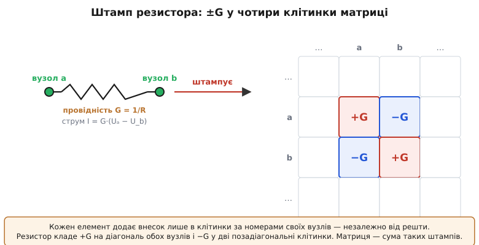
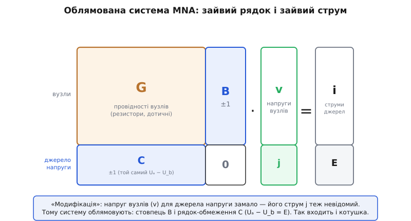

# 🧮 Вузловий аналіз і його модифікація (MNA)

Симулятор дістає на вхід голий перелік з'єднань — «резистор R1 між вузлами 3 і 0», «транзистор M4 колектором у вузол 7» — і мусить з цього переліку сам скласти систему рівнянь, ту саму `G · v = i`, про яку йшлося в темі. Питання, яке ми тут розберемо до дна, звучить просто: **як програма, не думаючи, за один прохід по списку елементів будує потрібну матрицю?** І чому наївний спосіб, гарний для резисторів, ламається на першому ж ідеальному джерелі напруги — так, що довелося вигадати «модифікацію», яка й дала методу назву **MNA** (англ. *Modified Nodal Analysis* — модифікований вузловий аналіз).

Це не суха бухгалтерія. Саме ця матриця стоїть у самому серці кожного симулятора: її перебирає метод Ньютона на кожній ітерації, її розв'язує кожен режим аналізу, і саме на її виродженні ґрунтується половина повідомлень про помилки, які видає SPICE. Зрозумівши, як вона складається, ви перестанете сприймати симулятор як чорну скриньку.

## Що взяти за невідомі

Почнімо з вибору, який визначає все подальше. Схема — це купа елементів, з'єднаних у вузлах. У ній повно чисел, які нас цікавлять: напруга на кожному вузлі, струм крізь кожну гілку. Що з цього оголосити **невідомими**, які шукаємо, а що потім вирахувати з них? Вибір не однозначний, і різні його варіанти дають різні за розміром і зручністю системи.

Найдавніший спосіб — контурний аналіз — бере за невідомі струми, що циркулюють у незалежних контурах. Він тісно пов'язаний із [законом напруг Кірхгофа](root:hw-analog/kirchhoff-laws) і чудово працює олівцем для дрібних схем. Але для програми він незручний: щоб виписати незалежні контури, треба спершу знайти в графі схеми кістякове дерево — окрема морока, яка погано лягає на «просто пройтися списком елементів». Тож симулятори пішли іншим шляхом.

Вузловий аналіз бере за невідомі **потенціали вузлів**. Один вузол оголошуємо опорним — «землею» з потенціалом 0 (напруга завжди відносна, тож нульову точку відліку обрати можна вільно), а решту вузлів шукаємо відносно нього. Чому саме це виявилось зручним для машини? Тому що напруга — властивість **вузла**, а не з'єднання. У вузлі сходиться скільки завгодно гілок, але потенціал у них усіх один — це один спільний вузол, тож і одне невідоме на нього. Схема на N вузлів (плюс земля) дає рівно N невідомих. І, головне, кожне рівняння прив'язане теж до вузла — а елемент завжди знає, до яких вузлів він приєднаний. Це і є та зачіпка, що дозволяє будувати систему, просто читаючи список.

> 🔧 **Навіщо це.** Кількість невідомих — це розмір матриці, а розмір матриці визначає, скільки симулятор рахуватиме. Вузлів у схемі зазвичай менше, ніж гілок чи контурів, тож вузловий метод дає меншу систему — і це одна з причин, чому саме він у промислових симуляторах. Коли ви бачите, що велика схема рахується довго, у корені лежить саме це: N вузлів → матриця N×N → розв'язання, що росте з N круто.

## Одне рівняння на вузол — це закон збереження заряду

Тепер напишемо для одного вузла рівняння. Основа — [закон струмів Кірхгофа](root:hw-analog/kirchhoff-laws): у будь-якому вузлі сума струмів, що втікають, дорівнює сумі, що витікають. Це не правило зі стелі, а прямий наслідок збереження заряду: заряд не накопичується у вузлі-точці (той не має об'єму), тож скільки заряду за секунду прийшло — стільки й пішло. Приберемо знак і скажемо строгіше: **алгебрична сума всіх струмів, що виходять із вузла, дорівнює нулю**.

Кожен із цих струмів треба виразити через наші невідомі — потенціали. Візьмімо резистор R між вузлами a і b. Струм крізь нього — це [закон Ома](root:hw-analog/ohms-law): різниця потенціалів поділена на опір, або, зручніше, помножена на **провідність** G = 1/R (лат. *conductus* — «проведене»). Струм, що витікає з вузла a крізь цей резистор у бік b, дорівнює:

```
I(a→b) = (Uₐ − U_b) · G
```

Тепер уявімо вузол a, до якого підходять три резистори (у вузли b, c і земля) і одне джерело струму, що вливає в нього струм Is ззовні. Запишемо баланс — сума витікань нуль:

```
G₁·(Uₐ − U_b) + G₂·(Uₐ − U_c) + G₃·(Uₐ − 0) − Is = 0
```

Розкриємо дужки й згрупуємо за невідомими напругами:

```
(G₁ + G₂ + G₃)·Uₐ − G₁·U_b − G₂·U_c = Is
```

Придивімося до форми — вона напрочуд регулярна. Коефіцієнт при «своїй» напрузі Uₐ — це **сума всіх провідностей, приєднаних до вузла a**. Коефіцієнт при кожній «чужій» напрузі — це **мінус провідність тієї вітки, що прямо з'єднує a із сусідом**. А праворуч — струм, який ззовні заганяють у вузол джерела. Ця регулярність не випадкова: вона повторюється для кожного вузла однаково, і саме вона перетворює складання системи на механічну процедуру.

Зберемо рівняння всіх вузлів у матричну форму `G · v = i`. Тут `v` — стовпчик невідомих потенціалів, `i` — стовпчик струмів джерел (те, що ззовні вливається у вузли), а `G` — квадратна **матриця провідностей**. З щойно поміченого правила читаємо її будову без жодних викладок:

```
на діагоналі  G[k][k] = сума всіх провідностей, приєднаних до вузла k
поза діагоналлю G[k][m] = − (провідність вітки прямо між вузлами k і m)
```

Ось чому цей метод такий машинний: щоб дізнатися будь-яку клітинку матриці, не треба розв'язувати схему — досить порахувати провідності на місцях з'єднань. Матриця виходить **симетрична** (вітка між k і m однаково входить у G[k][m] і G[m][k]) і **діагонально переважна** (діагональ — сума, позадіагональ — окремі доданки з тієї ж суми). Обидві властивості дуже добрі для чисельного розв'язання: така система стійка й розв'язується надійно.

## Штамп: як елемент сам «вписує» себе в матрицю

Тепер — центральна ідея, заради якої все й затівалося. Погляньмо на попереднє ще раз, але з іншого боку: не «збираємо рівняння вузла з усіх його елементів», а **«кожен елемент сам додає свій внесок у матрицю»**. Це переставлення погляду і є те, що робить симулятор.

Візьмімо один-єдиний резистор G між вузлами a і b — і забудьмо на мить про решту схеми. Куди він взагалі втручається? Він з'являється у балансі струмів вузла a (рядок a) і вузла b (рядок b), і в обох через напруги Uₐ та U_b (стовпці a і b). Тобто весь його слід у величезній матриці — це рівно **чотири клітинки** на перетинах {рядок a, рядок b} × {стовпець a, стовпець b}. І значення в них диктує та сама формула струму:

```
        стовпець a   стовпець b
рядок a     +G          −G
рядок b     −G          +G
```

Струм крізь резистор із вузла a є `+G·Uₐ − G·U_b` — звідси `+G` у [a][a] і `−G` у [a][b]. Той самий струм із боку вузла b має протилежний знак — звідси `−G` у [b][a] і `+G` у [b][b]. Цей маленький хрестик і називають **штампом** елемента (англ. *stamp* — «відбиток, тавро»): фіксований візерунок, який елемент «відтискає» в матриці, знаючи лише номери своїх двох вузлів.


*Штамп резистора. Елемент нічого не «знає» про решту схеми — він лише додає свій внесок у клітинки, адресовані номерами його вузлів: +G на діагональ обох вузлів і −G у дві позадіагональні клітинки. Уся матриця провідностей — це сума таких відбитків, накладених один на одного.*

Ключове слово тут — **додає**. Штампи різних елементів накладаються: якщо до вузла a приєднано три резистори, кожен додасть свій +G у клітинку [a][a], і в сумі там стане повна сума провідностей — рівно те, що ми вивели вручну. Тому алгоритм складання матриці стає до сміховинного простим: **обнули матрицю, потім пройдися списком елементів і для кожного додай його штамп у клітинки за номерами вузлів**. Жодного аналізу топології, жодних контурів — сліпий однопрохідний прохід. Порядок елементів у списку не має значення, бо додавання комутативне; те, що з'єднано в одному вузлі, автоматично складеться в одну клітинку.

У кожного типу елемента — свій штамп. Резистор ми розібрали. Незалежне **джерело струму** ще простіше: воно не входить у матрицю зліва взагалі (його струм не залежить від напруг — він заданий), а лише додає своє значення у стовпчик правих частин: `+Is` у рядок вузла, куди вливає, і `−Is` у рядок, звідки витягує. Лінеаризований на кроці Ньютона транзистор чи діод теж зводиться до штампа: його дотична провідність (крутість) стає таким самим ±g-хрестиком між своїми вузлами, плюс поправка у праву частину. Так уся схема — резистори, джерела, лінеаризовані нелінійні прилади — вкладається в матрицю однаковою механікою.

**Worked-приклад: збираємо матрицю дільника напруги.** Візьмімо найпростіше: джерело струму Is = 1 мА вливає у вузол 1, від вузла 1 до вузла 2 стоїть R1 = 1 кОм, від вузла 2 до землі — R2 = 2 кОм. Проведімо алгоритм штампів руками й розв'яжімо систему.

```
провідності:  G1 = 1/1000 = 1.0 мСм  (між вузлами 1 і 2)
              G2 = 1/2000 = 0.5 мСм  (між вузлом 2 і землею)

старт: матриця 2×2 і права частина — нулі
   G = [ 0   0 ]      i = [ 0 ]
       [ 0   0 ]          [ 0 ]

штамп R1 (вузли 1,2): +G1 у [1][1] і [2][2], −G1 у [1][2] і [2][1]
   G = [ +1.0  −1.0 ]
       [ −1.0  +1.0 ]

штамп R2 (вузли 2, земля): земля — опорна, її рядок/стовпець не пишемо,
   лишається тільки +G2 у [2][2]
   G = [ +1.0  −1.0 ]
       [ −1.0  +1.5 ]

штамп джерела струму (вливає 1 мА у вузол 1): +1.0 у i[1]
   i = [ 1.0 ]   (мА)
       [ 0.0 ]

система (струми в мА, напруги у В, провідності в мСм):
    1.0·U₁ − 1.0·U₂ = 1.0
   −1.0·U₁ + 1.5·U₂ = 0

розв'язок:  з 2-го рівняння U₁ = 1.5·U₂
            підставляємо в 1-ше: 1.5·U₂ − U₂ = 1 → 0.5·U₂ = 1
            U₂ = 2.0 В,  U₁ = 3.0 В
```

Перевіримо здоровим глуздом: 1 мА тече крізь послідовні 1 кОм і 2 кОм, тобто крізь 3 кОм разом, даючи на вузлі 1 три вольти, а на вузлі 2 (після спаду на R1) два вольти. Збіглося з тим, що видала матриця, — а матрицю ми не «розв'язували як схему», а сліпо склали зі штампів. Ось та сама збірка в робочому C, де видно, що функція штампа не знає нічого, крім номерів вузлів і значення провідності:

:::tabs
```c
#include <stdio.h>

#define N 2                     // кількість невузлів-опорних вузлів (без землі)
double G[N + 1][N + 1];         // +1: індекс 0 віддамо під землю й не чіпаємо
double rhs[N + 1];              // права частина (струми джерел)

// Штамп резистора: додати провідність у чотири клітинки за номерами вузлів.
// Вузол 0 — земля (опорний): його рядок/стовпець просто пропускаємо.
void stamp_resistor(int a, int b, double g) {
    if (a) G[a][a] += g;
    if (b) G[b][b] += g;
    if (a && b) { G[a][b] -= g;  G[b][a] -= g; }
}

// Штамп джерела струму: у праву частину, знак — за напрямком.
void stamp_isource(int from, int to, double is) {
    if (to)   rhs[to]   += is;   // вливається у вузол to
    if (from) rhs[from] -= is;   // витягується з вузла from
}

int main(void) {
    stamp_resistor(1, 2, 1.0e-3);   // R1 = 1 кОм між вузлами 1 і 2
    stamp_resistor(2, 0, 0.5e-3);   // R2 = 2 кОм між вузлом 2 і землею
    stamp_isource(0, 1, 1.0e-3);    // 1 мА із землі у вузол 1

    // (тут SPICE викликав би розв'язувач лінійної системи; матриця вже зібрана)
    printf("G[1][1]=%.4f  G[1][2]=%.4f\n", G[1][1] * 1e3, G[1][2] * 1e3);
    printf("G[2][1]=%.4f  G[2][2]=%.4f\n", G[2][1] * 1e3, G[2][2] * 1e3);
    printf("rhs = [%.3f, %.3f] мА\n", rhs[1] * 1e3, rhs[2] * 1e3);
    return 0;
}
```
```python
import numpy as np

N = 2                       # кількість неопорних вузлів (без землі)
G = np.zeros((N + 1, N + 1))  # +1: індекс 0 віддамо під землю й не чіпаємо
rhs = np.zeros(N + 1)         # права частина (струми джерел)

# Штамп резистора: додати провідність у чотири клітинки за номерами вузлів.
# Вузол 0 — земля (опорний): його рядок/стовпець просто пропускаємо.
def stamp_resistor(a, b, g):
    if a: G[a][a] += g
    if b: G[b][b] += g
    if a and b:
        G[a][b] -= g;  G[b][a] -= g

# Штамп джерела струму: у праву частину, знак — за напрямком.
def stamp_isource(frm, to, is_):
    if to:  rhs[to]  += is_   # вливається у вузол to
    if frm: rhs[frm] -= is_   # витягується з вузла frm

stamp_resistor(1, 2, 1.0e-3)    # R1 = 1 кОм між вузлами 1 і 2
stamp_resistor(2, 0, 0.5e-3)    # R2 = 2 кОм між вузлом 2 і землею
stamp_isource(0, 1, 1.0e-3)     # 1 мА із землі у вузол 1

# (тут SPICE викликав би розв'язувач лінійної системи; матриця вже зібрана)
print(f"G[1][1]={G[1][1]*1e3:.4f}  G[1][2]={G[1][2]*1e3:.4f}")
print(f"G[2][1]={G[2][1]*1e3:.4f}  G[2][2]={G[2][2]*1e3:.4f}")
print(f"rhs = [{rhs[1]*1e3:.3f}, {rhs[2]*1e3:.3f}] мА")
```
:::

Функція `stamp_resistor` не бачить схеми — вона бачить два числа-вузли й одну провідність, і акуратно кладе свій хрестик. Виклич її сто разів для ста резисторів — і матриця готова. Оце й є той «переклад схеми в рівняння», який на верхньому рівні здавався магією: сто рядків сліпого додавання.

## Де наївний метод ламається

Здавалось би, все зроблено: маємо механіку, що з будь-якого списку елементів складає `G · v = i`. Але сховаймо на секунду радість і поставмо незручне питання. Уся будова трималася на одній тихій умові: **струм кожного елемента можна виразити через напруги вузлів**. Резистор — можна (I = G·ΔU). Джерело струму — тривіально (струм заданий). Лінеаризований транзистор — можна (через дотичну провідність). А що, як елемент такій умові **не підкоряється**?

Найгостріший приклад — **ідеальне джерело напруги**. Воно робить прямо протилежне резистору: не задає струм за напругою, а **задає напругу незалежно від струму**. Скажімо, джерело 5 В між вузлом a і землею просто змушує Uₐ = 5, і крапка — а який струм крізь нього потече, визначає вже решта схеми: скільки треба, стільки джерело й віддасть. Спробуймо втиснути його у вузловий метод — і одразу впираємось у стіну. Провідність джерела напруги нескінченна (ΔU фіксоване за будь-якого струму, тобто G = I/ΔU не існує). Клітинку матриці нескінченністю не заповниш. А головне — струм крізь джерело, який мусить увійти в баланс сусіднього вузла, узагалі **не виражається через напруги**: він самостійна невідома, якої в нашому наборі немає.

Той самий клопіт, тільки м'якший, дає **котушка**. Її закон — U = L·(dI/dt): напруга задається швидкістю зміни струму, а не самим струмом. У режимі спокою (постійний струм, dI/dt = 0) котушка — ідеальний провідник, тобто те саме джерело нуля вольт: закорочені вузли й невизначений струм крізь них. Знову провідність нескінченна, знову струм — окрема невідома. Коротко кажучи, будь-який елемент, чий закон формулюється **«напруга задана — струм вільний»**, наївний вузловий метод переварити не може. А без джерел напруги й котушок жодної реальної схеми не опишеш.

> 🔧 **Навіщо це.** Це не академічна тонкість, а причина, чому симулятор іноді буквально не може порахувати «правильну» на вигляд схему. Дві ідеальні батарейки, з'єднані паралельно, або джерело напруги, закорочене ідеальним дротом, — це саме той випадок «напруга задана двічі й суперечливо». Наївна матриця тут або ділить на нуль, або стає виродженою. Розуміння, звідки росте проблема, підказує й ліки: додати крихітний послідовний опір джерелу — і невизначеність зникає, бо струм знову стає функцією напруги.

## Модифікація: додаємо струм у невідомі

Вихід, який знайшли **Чунг-Вень Го (Chung-Wen Ho), Альберт Руелі (Albert E. Ruehli) і Пірс Бреннан (Pierce A. Brennan)** — троє інженерів компанії IBM — у статті «The Modified Nodal Approach to Network Analysis» (IEEE Transactions on Circuits and Systems, червень 1975), гарний своєю чесністю. Якщо струм проблемного елемента не виражається через напруги — **не будемо його виражати. Оголосимо його ще однією невідомою.** Саме звідси й слово «модифікований» у назві методу: до звичайного вузлового аналізу додають додаткові невідомі-струми для тих елементів, які інакше не вкладаються.

Але тоді невідомих стало на одну більше, ніж рівнянь: до N потенціалів додався струм j крізь джерело напруги. Щоб система лишалась розв'язною, потрібне ще одне рівняння. І воно є — це власний **закон самого джерела**, який досі не було куди подіти: «напруга між моїми вузлами дорівнює E».

```
Uₐ − U_b = E
```

Ось і вся ідея. Тепер джерело напруги дає в систему **два** внески замість резисторового хрестика:

Перше — його струм j входить у баланс струмів обох вузлів (адже фізично щось же тече крізь джерело). Це додає **новий стовпець** j у матрицю: у рядку вузла a — коефіцієнт +1 при j (струм витікає з a крізь джерело), у рядку вузла b — −1 (втікає в b). Цей блок називають B.

Друге — саме рівняння Uₐ − U_b = E стає **новим рядком** матриці: у стовпці Uₐ ставимо +1, у стовпці U_b ставимо −1, а в праву частину — задану напругу E. Цей блок дзеркальний до першого й зветься C.

Складімо все в блочну картину. Була система `G · v = i`; тепер вона обрамлена ще одним рядком і одним стовпцем:

```
┌         ┐ ┌   ┐   ┌   ┐
│  G   B  │ │ v │   │ i │
│         │ │   │ = │   │
│  C   0  │ │ j │   │ E │
└         ┘ └   ┘   └   ┘
```


*Облямована система MNA. Верхній лівий блок G — звичайна матриця провідностей вузлів. Джерело напруги додає невідомий струм j (розширює вектор невідомих) і рядок-обмеження C, що каже «Uₐ − U_b = E», разом зі стовпцем B, яким струм j входить у баланс вузлів. Так у ту саму єдину систему вкладаються й ідеальні джерела напруги, і котушки, для яких плаский вузловий метод не має клітинки.*

Верхня частина блочного рівняння — це старі вузлові рівняння, тепер уже з доданком B·j (струм джерела в балансі вузлів). Нижня частина — це нове рівняння C·v = E, тобто буквально Uₐ − U_b = E. Разом рівнянь рівно стільки ж, скільки невідомих: N потенціалів плюс кожен доданий струм. Система знову квадратна й розв'язна — тільки трохи більша.

Краса в тому, що **механіка штампів уціліла повністю**. Джерело напруги просто має свій штамп — трохи хитріший: воно заводить собі новий рядок-стовпець (свій номер струму) і ставить чотири одиниці ±1 на перетинах цього нового індексу зі своїми вузлами. Алгоритм лишається той самий сліпий однопрохідний: ідемо списком, кожен елемент відтискає свій штамп; просто у джерела напруги штамп зачіпає не лише вузлові клітинки, а й додатковий рядок. Ось стамп джерела напруги в тому ж дусі, що й резисторовий:

```c
// Джерело напруги E між вузлами a і b.
// k — індекс ДОДАТКОВОГО рядка/стовпця під невідомий струм цього джерела
// (SPICE відводить його одразу за всіма вузловими індексами).
void stamp_vsource(int a, int b, int k, double E) {
    // блок B: струм джерела входить у баланс струмів вузлів
    if (a) { G[a][k] += 1.0;  G[k][a] += 1.0; }   // (B і C симетричні: ±1)
    if (b) { G[b][k] -= 1.0;  G[k][b] -= 1.0; }
    // права частина рядка-обмеження: Uₐ − U_b = E
    rhs[k] += E;
}
```

Помітьте: жодних нескінченних провідностей, жодного ділення на нуль. Проблемний елемент, який не мав скінченного місця в плоскій матриці, дістав своє чесне рівняння — і все стало на місця. Той самий трюк рятує й **котушку**: у перехідному аналізі її закон U = L·dI/dt після дискретизації часу перетворюється на алгебричний зв'язок між напругою, струмом на новому кроці й струмом на попередньому — і цей зв'язок кладеться таким самим рядком-обмеженням із струмом-невідомою. Тому в MNA струм котушки завжди серед невідомих, і його значення симулятор віддає «безкоштовно», просто зчитавши відповідну компоненту розв'язку.

Ту саму додаткову невідому-струм заводять і для інших елементів, чий струм комусь потрібен явно або чий закон не «провідниковий»: керованих джерел напруги, ідеальних амперметрів. Тому реальна MNA-матриця має верхній лівий провідниковий блок G, а під ним і збоку — тонку рамку з ±1 для всіх таких «струмових» елементів. Її й розв'язує симулятор.

## Де ця матриця працює в симуляторі

Тепер зберімо все докупи й повернімося до теми. Складена MNA-система — це не одноразова конструкція, а **та сама матриця, з якою симулятор працює безперервно**, і кілька важливих речей стають прозорими саме звідси.

По-перше, **цикл Ньютона**. Нелінійні прилади (діоди, транзистори) на кожній ітерації замінюють дотичною провідністю — а дотична провідність, ми бачили, штампується так само, як резистор. Тому один крок методу Ньютона — це «перезбери штампи всіх нелінійних елементів за поточної здогадки й розв'яжи MNA-систему наново». Матриця перескладається щоітерації (провідності зсуваються слідом за робочою точкою), права частина оновлюється — і так, поки нев'язка не впаде. Метод Ньютона перетворює нелінійну схему на **послідовність** таких лінійних MNA-задач; про сам механізм збіжності — у [методі Ньютона](root:math-numeric/newtons-method). Виходить чіткий поділ праці: Ньютон бореться з нелінійністю, MNA — з топологією, а розв'язувач лінійних систем — з арифметикою.

По-друге, **розв'язання самої системи**. `G · v = i` (в облямованому вигляді) — це система лінійних рівнянь, і розв'язують її не оберненням матриці, а розкладанням на множники — по суті, [методом Гаусса](root:math-algebra/gauss-elimination), пристосованим до того, що матриця майже порожня. Адже кожен елемент чіпає лише кілька клітинок, тож у схемі на тисячу вузлів переважна більшість клітинок — нулі; таку **розріджену** матрицю зберігають і розкладають хитро, не витрачаючись на нулі. Це і є та операція, вартість якої круто росте з розміром: подвоїли схему — розв'язання подорожчало більш ніж удвічі. Звідси й практичне відчуття, що велика схема «думає» непропорційно довго. Загальне тло — у [лінійних системах](root:math-algebra/linear-systems).

По-третє — і це найкорисніше на щодень — **звідки беруться «singular matrix»**. Симулятор скаржиться на вироджену матрицю тоді, коли в неї немає єдиного розв'язку, і майже завжди за цим стоїть конкретна вада схеми, яку тепер видно наскрізь:

Якщо якийсь вузол **ні до чого не приєднаний** (або з'єднаний з рештою схеми лише через розімкнене), його рядок і стовпець у G порожні — сама-самісінька нульова лінія. Матриця з нульовим рядком вироджена: рівняння для того вузла звучить «0 = 0», його потенціал невизначений. Фізично так і є — плаваючий вузол може мати будь-яку напругу. Класична пастка — вхід підсилювача, з'єднаний лише з ідеальним конденсатором: за постійним струмом конденсатор розриває коло, вузол «висить», матриця вироджується. Ліки — дати вузлу шлях до відомого потенціалу (величезний резистор на землю).

Якщо ж у схемі є **контур із самих ідеальних джерел напруги** (чи джерело напруги, закорочене ідеальним дротом), вироджується вже нижня, «струмова» частина матриці: рядки-обмеження C суперечать один одному або дублюються («ця напруга водночас 5 В і 3 В», або «ця напруга дорівнює сама собі»). Струм крізь такий контур лишається невизначеним — джерела нескінченно «перекидають» його між собою. І тут симулятор не вередує: він чесно каже, що ви описали фізично невизначену схему.

Отже, коли SPICE видає «singular matrix», він не зламався — він повідомляє, що зібрана з вашого нетліста MNA-система не має єдиного розв'язку. Знаючи її будову, ви одразу шукаєте одне з двох: висячий вузол (порожній рядок у G) або петлю ідеальних джерел напруги (суперечливі рядки в C). Це перетворює загадкове повідомлення на конкретний діагноз.

І останнє, що варто втримати. Усі чотири режими аналізу — робоча точка, розгортка постійного струму, частотний і перехідний — розв'язують **цю саму** MNA-систему, лише по-різному її заповнюючи: `.op` бере штампи за постійного струму; `.ac` кладе замість дійсних провідностей комплексні (для конденсаторів і котушок) і розв'язує з комплексними числами; `.tran` на кожному кроці часу додає в штампи котушок та конденсаторів доданок-пам'ять від попереднього кроку. Ядро — незмінне: скласти штампами матрицю, за потреби прокрутити Ньютоном, розв'язати. Уся зовнішня складність симулятора обслуговує цю одну, тепер уже не таємничу, машинерію: **схема → штампи → матриця → розв'язок**.
