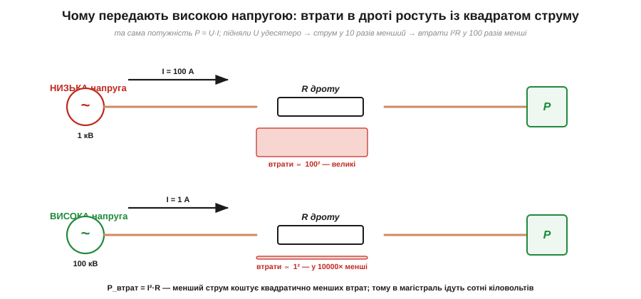
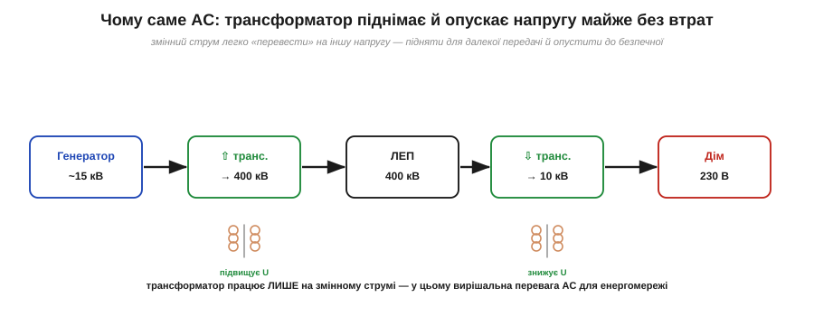

# Чому мережа змінна: транспорт енергії

<preknowlist>
- [Постійний і змінний струм](root:ph-electromagnetism/dc-vs-ac) — чим стала напруга відрізняється від тієї, що коливається в часі.
- [Опір](root:ph-condensed/resistance) — чому провідник чинить опір струму й від чого залежить його величина.
- [Електрична потужність](root:ph-electromagnetism/electric-power) — потужність як добуток напруги на струм (P = U·I).
- [Нагрів струмом](root:ph-electromagnetism/joule-heating) — струм в опорі виділяє тепло за законом P = I²·R.
- [Електромагнітна індукція](root:ph-electromagnetism/electromagnetic-induction) — змінне магнітне поле наводить напругу; на цьому стоїть трансформатор.
</preknowlist>

Чому світова електромережа — змінна? Коротка відповідь звучить так: мережа змінна, бо змінну напругу легко перетворює **трансформатор** — підвищує для передачі, знижує для споживача, — а постійну тоді так перетворювати не вміли. Та за цим фактом стоїть глибша фізика: не просто «бо трансформатор», а **чому без трансформації передати енергію на великі відстані фізично неможливо** і яку саме перешкоду долає підвищення напруги. Цей механізм і розберемо кількісно.

Питання слушне й гостре. Уся ж електроніка — мікросхеми, процесори, телефони — працює на [постійному струмі](root:ph-electromagnetism/dc-vs-ac); кожен пристрій усередині перетворює мережеву змінну напругу назад на постійну. То навіщо взагалі городити змінну мережу, якщо споживачеві потрібна постійна? Чому не передавати одразу постійний струм? Відповідь криється не в споживачі, а в **дорозі** від станції до розетки — у сотнях кілометрів дроту.

### Ворог далекої передачі — опір дроту

Уявімо, що енергію треба доправити від електростанції до міста за сотню кілометрів. Дроти — мідні чи алюмінієві, чудові провідники, — та на такій довжині навіть їхній малий [опір](root:ph-condensed/resistance) складається в помітну величину. І це не випадковість: опір дроту дорівнює ρ·L/A — питомий опір матеріалу ρ, помножений на довжину L і поділений на переріз A. Довжина стоїть у чисельнику, тож сотня кілометрів неминуче дає відчутний опір, хоч би яка гарна була мідь.

Здавалося б, опір можна побороти товщим дротом: більший переріз A — менший R. Та мідь важка й дорога. Щоб зрізати опір удесятеро, треба вдесятеро більше металу на всій сотні кілометрів — тисячі тонн міді й щогли, що втримають цю вагу. Тому переріз завжди компроміс, і повністю прибрати опір ним не вийде: якийсь R у лінії лишиться завжди.

А щойно дротом тече струм, цей опір **гріється**, безповоротно з'їдаючи частину переданої потужності. Ключове — за яким законом ці втрати ростуть. Потужність, що [виділяється теплом](root:ph-electromagnetism/joule-heating) на опорі R, яким тече струм I, дорівнює:

```
P_втрат = I² · R
```

Зверніть увагу на **квадрат струму**. Це і є серце всієї історії. Втрати в дротах залежать не від напруги передачі, а від **струму** — і то квадратично. Подвоїте струм — втрати вчетверо; зменшите струм удесятеро — втрати впадуть у **сто** разів. А опір дроту R — заданий (його не змінити, не потовщивши й не вкоротивши лінію). Отже, єдиний спосіб різко зрізати втрати в лінії — гнати по ній **якомога менший струм**.

### Хитрість: та сама потужність — або великим струмом, або високою напругою

Але як передати велику потужність малим струмом? Тут і спрацьовує друга формула — [потужність](root:ph-electromagnetism/electric-power) як добуток напруги на струм:

```
P = U · I
```

Одну й ту саму потужність P можна доставити **двома різними способами**: або помірною напругою й великим струмом, або високою напругою й малим струмом — бо важить лише їхній добуток. А оскільки втрати залежать тільки від струму (квадратично!), вибір очевидний: треба **підняти напругу** якомога вище, тоді струм для тієї самої потужності впаде, а з ним обвалом — і втрати.

Це видно й прямо з формул, якщо їх поєднати. Струм для заданої потужності дорівнює I = P/U; підставмо його у втрати:

```
P_втрат = I²·R = (P/U)²·R = P²·R / U²
```

Потужність P фіксована (стільки треба місту), опір R заданий — а от напруга U стоїть у знаменнику, ще й у квадраті. Тобто втрати падають як 1/U²: піднявши напругу вдвічі, ріжемо їх вчетверо; удесятеро — у сто разів. Формула сама вказує на єдиний вільний важіль — напругу, — і тиснути на нього треба щосили.


*Та сама потужність двома способами. Угорі — низька напруга, тож великий струм (100 А); втрати ∝ 100². Унизу — піднята вдесятеро напруга, тож струм у 10 разів менший (1 А); втрати ∝ 1². Оскільки втрати йдуть із квадратом струму, передача високою напругою коштує у 100 разів менших утрат у дротах. Тому магістральні лінії несуть сотні кіловольтів.*

Покажемо силу цього на числах — вона вражає.

**Приклад (виграш від підвищення напруги).** Треба передати потужність P = 100 кВт лінією, опір якої R = 10 Ом. Порівняймо передачу при 1 кВ і при 100 кВ.

```
Варіант А — 1 кВ:
  струм   I = P/U = 100 000 / 1 000   = 100 А
  втрати  P_втрат = I²·R = 100² · 10   = 100 000 Вт = 100 кВт  (!!)
  → втрачаємо в дротах УСЮ потужність — передача безглузда

Варіант Б — 100 кВ (та сама потужність):
  струм   I = P/U = 100 000 / 100 000 = 1 А
  втрати  P_втрат = I²·R = 1² · 10     = 10 Вт
  → втрачаємо 10 Вт зі 100 000 — мізер (0.01 %)
```

Різниця приголомшлива: підняли напругу в 100 разів — струм упав у 100 разів — а втрати впали в **100² = 10 000** разів, із цілковито з'їденої потужності до незначних десятків ватів. Ось чому магістральні лінії електропередачі несуть **сотні кіловольтів**: це не примха, а єдиний фізичний спосіб доправити енергію далеко, не спаливши її дорогою в самих дротах. Без підвищення напруги далека передача просто неможлива.

Постає природне питання: коли вже висока напруга така вигідна, чому не підняти її до мільйонів вольтів і не звести втрати нанівець? Заважає повітря. За надто високої напруги електричне поле біля дроту стає таким сильним, що починає **іонізувати повітря** довкола — виникає коронний розряд (*corona* — «вінець»: тонкий світний шар, що тріщить над проводом). Він сам з'їдає енергію й роз'їдає ізоляцію, тобто з якогось рівня напруга починає губитися вже не в опорі, а прямо в повітрі. Тому напругу піднімають високо, але не безмежно: практична стеля магістралей — сотні кіловольтів (типово 220–750 кВ), де виграш у втратах уже величезний, а корона й ізоляція ще керовані.

### Чому це означає саме змінний струм

Отже, передавати треба **високою напругою**, а споживати — **низькою й безпечною** (у розетці 230 В, а не 100 000, бо висока напруга для людини смертельна). Значить, напругу треба двічі **перетворити**: круто підняти на виході станції й знизити перед містом і будинком. І ось тут постійний струм програє начисто, а змінний — виграє.

Бо перетворити рівень **змінної** напруги вміє напрочуд простий, надійний і майже без втрат пристрій — **трансформатор** (*transformer*, від *transform* — «перетворювати»). Він працює саме на тому, що напруга **змінюється** в часі (на сталій постійній він просто не діє): в його основі лежить [електромагнітна індукція](root:ph-electromagnetism/electromagnetic-induction) — та сама, що дає [синусоїдну напругу генератора](root:ph-waves/sine-wave). Дві обмотки на спільному осерді, і напруга перетворюється рівно у стільки разів, у скільки одна обмотка має більше витків за іншу: U₁/U₂ = N₁/N₂.

І головне — трансформатор не просто змінює напругу, він **обмінює її на струм**. Працює він майже без втрат — у ньому немає рухомих частин, енергія просто переходить з обмотки в обмотку через магнітне поле спільного осердя, і реальні трансформатори віддають 98–99 % потужності. Тож потужність на вході й виході однакова:

```
U₁ · I₁ = U₂ · I₂
```

Піднявши напругу в 100 разів, він у ті самі 100 разів **знижує струм** — а це рівно те, чого вимагає лінія. Ось де замикається весь ланцюг: трансформатор віддає магістралі саме той малий струм, за який закон I²·R дякує стократ меншими втратами.

А на іншому кінці такий самий трансформатор робить зворотне — опускає напругу назад до 230 В і піднімає струм для споживача. Та це вже не страшно: великий струм тече лише короткими товстими дротами будинку, де опір мізерний, а не сотнями кілометрів магістралі. Тобто загрозливо великий струм так і не потрапляє на довгу лінію — його впускають аж там, де дроти вже короткі. Тому шлях енергії від станції до розетки — це сходинки напруги, і кожну робить трансформатор:


*Шлях енергії — це сходинки напруги. Генератор дає помірні кіловольти; підвищувальний трансформатор піднімає їх до сотень кіловольтів для далекої лінії (малий струм, малі втрати); наприкінці знижувальні трансформатори опускають напругу — спершу до розподільчих кіловольтів, тоді до безпечних 230 В у домі. Кожну сходинку робить трансформатор — а він працює лише на змінному струмі.*

Саме ця **легкість перетворення** і зробила світову мережу змінною. Постійний струм у часи [«війни струмів»](root:ph-electromagnetism/dc-vs-ac) трансформувати не вміли взагалі — тож із ним кожне місто довелося б живити з електростанції чи не на сусідній вулиці, бо передати далеко низьку напругу неможливо, а підняти її було нічим. Змінний струм цю стіну обходив одним пристроєм — і переміг.

Тут варто бути чесним і не впадати в спрощення «AC завжди кращий». Перевага AC — саме й тільки в **легкості перетворення напруги** заради передачі. У самій передачі високою напругою постійний струм навіть **кращий** за змінний (у нього немає ні «реактивних» втрат на ємності й індуктивності лінії, ні складнощів із синхронізацією) — і сьогодні наддалекі магістралі часом будують саме постійними, **HVDC** (*High-Voltage Direct Current* — «постійний струм високої напруги»). Та можливим це стало лише тоді, коли навчилися дешево перетворювати рівень постійної напруги силовою електронікою (це вже зовсім інша, пізніша техніка). У XIX же столітті, коли закладали мережу, єдиним перетворювачем напруги був трансформатор — а він вимагає змінного струму. Тому світ і став на змінний, і досі переважно на ньому.

> 🔧 **Навіщо це.** Ця фізика пояснює, чому світ влаштований так, як він влаштований, — і дає кілька твердих практичних висновків. По-перше, **високовольтні лінії смертельно небезпечні** саме тому, що несуть сотні кіловольтів; повага до них — питання життя. По-друге, у кожному пристрої сидить **блок живлення**, що знижує мережеву напругу й випрямляє її на потрібну приладу постійну, — і саме він є місток між [«мережею змінною» і «електронікою постійною»](root:ph-electromagnetism/dc-vs-ac). По-третє, розуміння «втрати ∝ I²·R» працює не лише в енергетиці: усюди, де тече великий струм — у дротах живлення плати, у роз'ємах, у доріжках, — вигідно тримати струм меншим (а напругу, де можна, вищою), бо нагрів і просадка ростуть зі струмом. Це той самий закон, що жене напругу в магістраль на сотні кіловольтів, лише в мініатюрі вашого пристрою.
