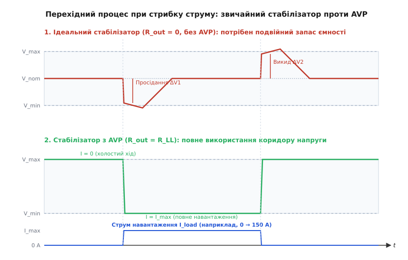
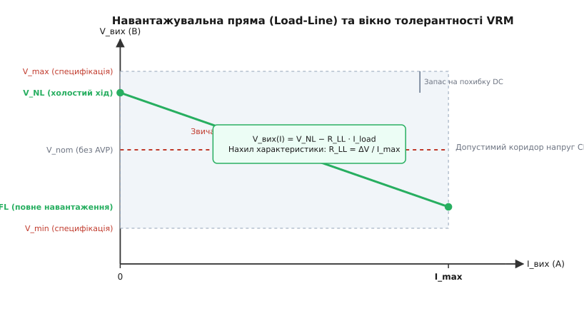
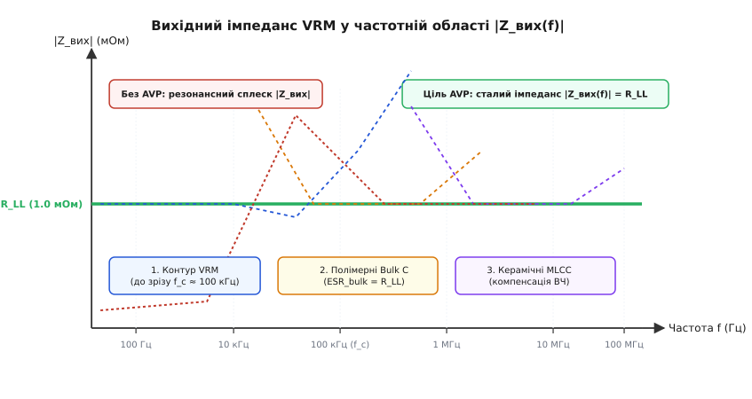
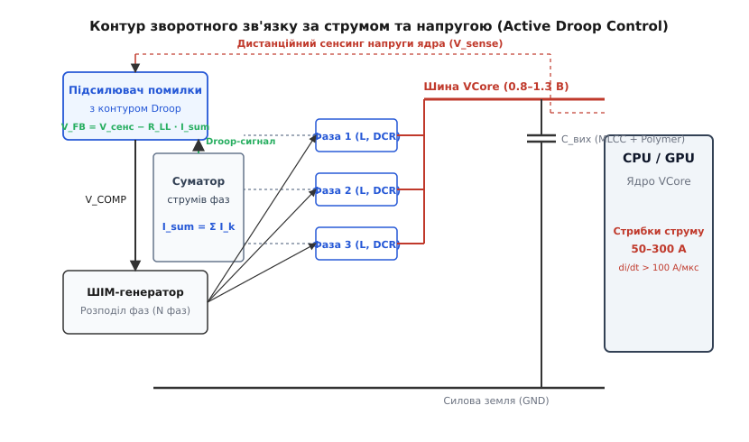
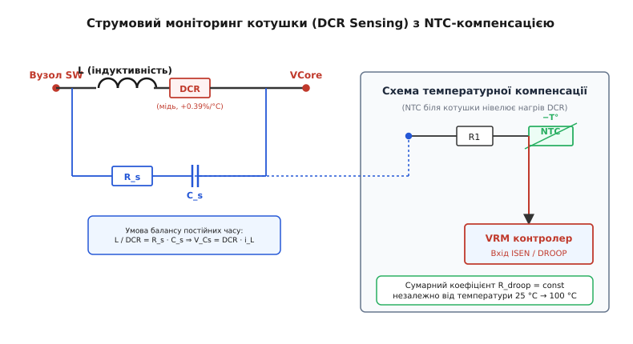

# Адаптивне позиціонування напруги (AVP / Droop Control)

<preknowlist>
- [Buck-перетворювач](topic:hw-power/buck) — імпульсне зниження напруги, дросель і комутація ключів.
- [Паралельно-фазний перетворювач](topic:hw-power/interleaved-converter) — багатофазна топологія та зсув тактів.
- [Зворотний зв'язок](topic:hw-power/feedback-stability) — передатна функція петлі регулювання, компенсація та час реакції на збурення.
- [Конденсатори перетворювача](topic:hw-power/converter-caps) — еквівалентний послідовний опір (ESR) та індуктивність (ESL) у фільтрації перехідних процесів.
</preknowlist>

Сучасний мікропроцесор або графічний прискорювач у режимі енергозбереження споживає від шини живлення всього 5–10 амперів при напрузі близько 1.0 вольта. Проте за дві-три наносекунди ядро отримує команду виконати масивні матричні обчислення, вмикає всі векторні конвеєри, і споживання миттєво злітає до 150–300 амперів. Швидкість наростання струму `di/dt` у цей момент сягає сотень амперів за мікросекунду. Для перетворювача напруги на материнській платі це еквівалентно майже миттєвому замиканню виходу на наднизький опір у кілька міліомів.

Напруга живлення кремнієвої логіки має перебувати у вкрай вузькому технологічному коридорі: наприклад, 1.00 В ± 50 мВ (вікно толерантності від 0.95 В до 1.05 В). Якщо в момент раптового старту обчислень напруга ядра хоча б на кілька мікросекунд просяде нижче 0.95 В, транзистори логічних вентилів не встигнуть перезарядити свої паразитні ємності за час тактового імпульсу. Це призведе до спотворення даних, збою тактової синхронізації та аварійної зупинки всієї системи. Якщо ж у момент раптового припинення обчислень напруга підскочить вище 1.05 В, ультратонкий підзатворний діелектрик польових транзисторів зазнає електричного пробою, що незворотно деградує або спалить процесор.

Жоден імпульсний перетворювач у світі не здатний зреагувати на такий стрибок за наносекунди виключно за рахунок свого контуру керування. Швидкість наростання струму в групі силових дроселів жорстко обмежена законами електромагнітної індукції: `di_L/dt = (V_in - V_out) / L`. Поки контур зворотного зв'язку за кілька мікросекунд розпізнає просідання напруги, відкриє силові ключі на максимальний коефіцієнт заповнення й накачає магнітне поле в котушках, весь колосальний струм у перші миті викачується виключно з вихідних конденсаторів материнської плати.

Класичний інженерний рефлекс вимагає зробити вихідну напругу стабілізатора абсолютно незалежною від струму навантаження, тобто отримати нульовий статичний вихідний опір `R_out = 0`. Але для надшвидких процесорів цей «ідеальний» підхід виявляється глухим кутом, що вимагає тисяч мікрофарад дорогої конденсаторної батареї. Виходом із цієї кризи стала протиінтуїтивна ідея: **навмисно змусити напругу просідати строго пропорційно до сили струму**. Цей метод отримав назву **адаптивного позиціонування напруги** (AVP — Adaptive Voltage Positioning, від лат. *adaptare* — пристосовувати) або **активного спаду напруги** (Active Droop Control, від англ. *droop* — провисати, спадати).

---

### Пастка ідеального стабілізатора з нульовим опором

Щоб зрозуміти, чому нульовий опір стабілізатора шкодить живленню процесорів, розглянемо поведінку звичайного регулятора напруги з класичним інтегральним зворотним зв'язком.

Такий стабілізатор підтримує фіксовану номінальну напругу `V_nom` незалежно від того, споживає схема 0 амперів чи 200 амперів. Щоб мати однаковий запас надійності в обидва боки, номінальну напругу встановлюють рівно посередині дозволеного коридору специфікації:

```
V_nom = (V_max + V_min) / 2
```

Якщо допустиме вікно становить від 0.95 В до 1.05 В (повний розмах `ΔV_tol = 100 мВ`), то регулятор тримає рівно 1.00 В.


*Динамічний відгук напруги на стрибок струму навантаження. Угорі — звичайний регулятор (R_out = 0): перехідний процес симетричний навколо V_nom, тому допустимий розмах стрибка становить лише половину вікна (ΔV_tol / 2). Унизу — регулятор з AVP: напруга плавно спадає від V_max до V_min, використовуючи весь допустимий розмах вікна (ΔV_tol), що зменшує потрібну ємність конденсаторів удвічі.*

Розглянемо дві критичні динамічні події:

1. **Раптовий накид навантаження (Load Step: 0 → I_max).**
   Процесор миттєво починає споживати 150 А. Струм у дроселях ще нульовий, тому весь струм віддають вихідні конденсатори. Напруга на виході миттєво падає через активний опір виводів та обкладок конденсаторів (ESR — Equivalent Series Resistance) і паразитарну індуктивність (ESL):

   ```
   ΔV_under = I_max · ESR + ESL · (di/dt) + ΔV_C
   ```

   Виникає глибоке динамічне просідання (англ. *undershoot*). Оскільки початкова напруга становила 1.00 В, а мінімально дозволена — 0.95 В, допустима амплітуда просідання становить лише `1.00 В - 0.95 В = 50 мВ`. Якщо провал перевищить 50 мВ, процесор зависне.
   Через 5–10 мікросекунд контур стабілізатора нарешті розганяє струм у дроселях, інтегратор підсилювача помилки відновлює заряд конденсаторів, і напруга повертається назад на рівень 1.00 В, незважаючи на те, що процесор продовжує споживати повні 150 А.

2. **Раптове скидання навантаження (Load Release: I_max → 0).**
   Процесор завершив обчислення й миттєво припинив споживання струму. Але в групі багатофазних дроселів у цей момент тече сумарний струм 150 А! Вони накопичили значну магнітну енергію:

   ```
   E_L = (1 / 2) · L_eq · I_max²
   ```

   Струм індуктивності не може зупинитися миттєво. Навіть якщо ШІМ-контролер негайно закриє всі верхні польові транзистори, струм дроселів рине у вихідні конденсатори, заряджаючи їх вище номінального рівня. Виникає високовольтний динамічний викид (англ. *overshoot*).
   Оскільки перед скиданням напруга стабілізатора перебувала на рівні 1.00 В, допустимий викид напруги знову обмежений лише 50 мілівольтами (`1.05 В - 1.00 В = 50 мВ`).

Головний дефект системи з `R_out = 0` полягає в тому, що **повне технологічне вікно допустимих напруг розривається на дві незалежні половини**:
- Верхня половина вікна (`V_max - V_nom`) резервується виключно під викид при вимкненні;
- Нижня половина вікна (`V_nom - V_min`) резервується виключно під просідання при ввімкненні.

У будь-якому перехідному процесі система має право використати лише `ΔV_tol / 2`. Щоб утримати просідання та викид у межах мізерних 50 мВ при струмах 150–200 А, розробникам доводиться ставити десятки паралельних полімерних і керамічних конденсаторів з екстремально низьким сумарним опором `ESR ≤ 0.3 мОм` та гігантською ємністю.

---

### Суть AVP: навантажувальна пряма та активний спад напруги

Адаптивне позиціонування напруги вирішує цю проблему радикально: стабілізатор свідомо програмують мати **постійний активний вихідний опір** (Load-Line Resistance, або `R_LL`), переводячи зв'язок напруги та струму в лінійну залежність:

```
V_out(I_load) = V_NL - R_LL · I_load
```

де `V_NL` — напруга холостого ходу (No-Load Voltage), тобто вихідна напруга перетворювача при нульовому струмі споживання (`I_load = 0`).


*Статична навантажувальна характеристика (Load-Line). На відміну від горизонтальної прямої класичного стабілізатора, пряма AVP має строго розрахований нахил R_LL. При нульовому струмі напруга встановлюється на верхню межу V_NL, а при максимальному струмі плавно опускається до нижньої межі V_FL.*

Налаштування навантажувальної прямої виконують за такими правилами:
1. **У стані спокою (I_load = 0):** напругу стабілізатора встановлюють на **верхню межу** допустимого діапазону:

   ```
   V_NL = V_max - V_margin
   ```

   (наприклад, 1.05 В).
2. **Під максимальним навантаженням (I_load = I_max):** напруга плавно й передбачувано опускається рівно до **нижньої межі** діапазону:

   ```
   V_FL = V_min + V_margin
   ```

   (наприклад, 0.95 В).
3. **Нахил прямої (опір навантажувальної прямої):**

   ```
   R_LL = (V_NL - V_FL) / I_max = ΔV_tol / I_max
   ```

   Для нашого прикладу: `R_LL = (1.05 В - 0.95 В) / 150 А = 100 мВ / 150 А ≈ 0.67 мОм`.

Погляньмо, що тепер відбувається під час перехідних процесів:

1. **Стрибок струму 0 → I_max:**
   Перед початком стрибка напруга перебуває на самій верхівці коридору (1.05 В). Коли процесор починає тягнути 150 А, напруга на конденсаторах падає на величину `ΔV = I_max · R_LL = 100 мВ` і опускається рівно до 0.95 В.
   Але тепер для системи 0.95 В — це не аварійна яма, з якої треба негайно вистрибувати, а **нова законна точка статичної рівноваги**! Контур зворотного зв'язку фіксує напругу на рівні 0.95 В і не намагається тягнути її вгору.
   Завдяки цьому для поглинання початкового просідання стабілізатор використав **увесь розмах вікна толерантності** `ΔV_tol = 100 мВ`, а не його половину!

2. **Скидання струму I_max → 0:**
   Перед вимкненням напруга сиділа внизу коридору (0.95 В). Коли струм зникає, надлишкова магнітна енергія дроселів викидається у вихідні конденсатори, піднімаючи напругу на 100 мВ — акуратно до верхнього рівня 1.05 В.
   Напруга зупиняється на позначці 1.05 В, яка є її штатним рівнем холостого ходу.
   Знову перехідний процес використав повні 100 мВ вікна без ризику пробити транзистори!

> 🔧 **Навіщо це.** Введення активного спаду напруги AVP перетворює перехідний процес із коливального на монотонний: замість глибокого провалу з подальшим дзвоном напруга сходинкою переходить із верхнього рівня на нижній і залишається там. Це дає системі максимальний динамічний запас в обох напрямках.

---

### Дві фундаментальні переваги AVP

Впровадження AVP у стабілізатори живлення процесорів (VRM — Voltage Regulator Module) принесло два результати, що визначили розвиток комп'ютерної техніки на десятиліття вперед.

#### 1. Скорочення кількості конденсаторів удвічі (50% BOM Reduction)

Оскільки допустимий динамічний розмах коливань напруги `ΔV` збільшився рівно в 2 рази (з `ΔV_tol / 2` до повної `ΔV_tol`), вимоги до вихідного фільтра пом'якшуються вдвічі:
- Максимально дозволений опір конденсаторів `ESR_bank` зростає у 2 рази:

  ```
  ESR_allowed = ΔV_tol / I_max
  ```

- Мінімальна необхідна ємність `C_out`, потрібна для поглинання енергії дроселів при скиданні навантаження, зменшується рівно в 2 рази:

  ```
  C_out_min = (L_eq · I_max²) / (2 · V_nom · ΔV_tol)
  ```

Строге алгебраїчне виведення цих співвідношень та частотних умов нерозривності наведено в [🧮 математичному виводі імпедансу навантажувальної прямої та розрахунку конденсаторної батареї](topic:hw-power/adaptive-voltage-positioning/math-loadline-impedance.md).

Зменшення необхідної ємності на 50% означає, що замість 60 керамічних конденсаторів типорозміру 1206 та 12 масивних танталових або полімерних конденсаторів навколо сокета процесора можна встановити вдвічі менше. Це звільняє критично важливу площу друкованої плати для розведення сотень швидкісних ліній пам'яті DDR5 та шини PCI Express, а також знижує собівартість силової підсистеми материнської плати на десятки доларів.

#### 2. Зниження енергоспоживання та нагріву процесора під навантаженням

Потужність, яку споживає цифровий кристал, складається з динамічної комутаційної потужності перемикання вентилів та статичної потужності витоків:

```
P_cpu = α · C_total · f_clk · V_out² + V_out · I_leak
```

Ключовий фактор тут — **квадратична залежність потужності від напруги**.

Коли процесор працює на повну потужність (тягне 150–250 А), його кристали розігріваються до 80–95 °C. Якщо живити його за класичною схемою без AVP, стабілізатор буде примусово утримувати завищену напругу 1.05 В навіть під час найважчих стрес-тестів.

При використанні AVP напруга під повним навантаженням автоматично падає до нижньої межі 0.95 В. Оцінимо економію потужності:

```
P_no_avp = 1.05 В · 150 А = 157.5 Вт
P_avp    = 0.95 В · 150 А = 142.5 Вт
ΔP_saved = 157.5 Вт - 142.5 Вт = 15.0 Вт
```

Зниження тепловиділення на **15 Вт** безпосередньо в кремнієвому кристалі дозволяє процесору довше утримувати максимальні частоти Turbo Boost без скидання частот через перегрів (thermal throttling).

А що ж відбувається в простої? У простої напруга ядра піднімається до 1.05 В. Але оскільки струм споживання становить лише кілька амперів, абсолютне тепловиділення становить мізерні 5–8 Вт. Підвищена напруга на холостому ходу ніяк не загрожує охолодженню, проте вона завчасно створює максимальний запас потенціалу для зустрічі наступного раптового стрибка навантаження.

---

### Фізика постійного вихідного імпедансу у частотній області

Справжня мета AVP полягає не просто в тому, щоб нахилити статичну вольт-амперну характеристику. Завдання значно глибше: **зробити вихідний імпеданс джерела живлення абсолютно плоским і постійним на всіх частотах**:

```
|Z_out(f)| = R_LL = const
```

від постійного струму (0 Гц) аж до частот у десятки мегагерців.


*Формування вихідного імпедансу шини живлення (PDN) у різних частотних діапазонах. Завдяки узгодженню контуру AVP, полімерних конденсаторів (ESR = R_LL) та керамічних MLCC, сумарний імпеданс залишається плоским і строго рівним R_LL без резонансних піків.*

Шина доставки живлення (PDN — Power Delivery Network) розбивається на три частотні домени, кожен із яких відповідає за утримання імпедансу на рівні `R_LL`:

1. **Низькочастотна область (від 0 Гц до частоти зрізу петлі f_c ≈ 50–100 кГц):**
   У цій зоні працює активний зворотний зв'язок ШІМ-контролера. Підсилювач помилки вимірює струм дроселів і штучно знижує напругу регулювання, створюючи активний вихідний опір `R_LL`.
2. **Середньочастотна область (від 100 кГц до 2–5 МГц):**
   На цих частотах контур підсилювача стабілізатора вже не має достатнього підсилення для відпрацювання збурень. Тут імпеданс утримується об'ємними полімерними та танталовими конденсаторами (Bulk Capacitors).
   Щоб на частотній характеристиці не виникло провалу або сплеску, сумарний активний опір цих конденсаторів обирають рівним опору навантажувальної прямої:

   ```
   ESR_bulk = R_LL
   ```

3. **Високочастотна область (від 5 МГц до 50–100 МГц):**
   Тут імпеданс формують сотні мініатюрних керамічних конденсаторів (MLCC — Multi-Layer Ceramic Capacitors), розташованих на зворотному боці сокета та всередині корпусу самого процесора. Їхня висока власна резонансна частота компенсує паразитну індуктивність виводів полімерних ємностей.

Якщо всі три ланки узгоджені між собою (`ESR = R_LL` і `C_out = L_eq / R_LL²`), вихідний імпеданс системи стає чистим активним опором без реактивних піків. Будь-який стрибок струму будь-якої тривалості та форми викликає виключно пропорційну зміну напруги `ΔV(t) = R_LL · ΔI(t)` без фазового дзвону й коливань.

---

### Схемотехнічна реалізація Active Droop Control

Як саме змусити імпульсний перетворювач створити точний нахил навантажувальної прямої?

У сучасних багатофазних контролерах VRM застосовують структуру комбінованого зворотного зв'язку за напругою та сумарним струмом.


*Функціональна схема багатофазного контролера з контуром активного спаду. Сигнали струму окремих фаз підсумовуються й віднімаються від сигналу напруги дистанційного сенсингу на вході підсилювача помилки.*

Контур складається з таких обов'язкових вузлів:

1. **Дистанційний диференціальний сенсинг напруги (Remote Sense):**
   При струмах 200 А навіть опір мідних полігонів материнської плати у 0.5 мОм викликає паразитичне падіння напруги в 100 мВ. Тому контролер не може вимірювати напругу біля своїх ніжок. Дві тонкі сенсорні доріжки (`V_SENSE` та `V_RTN`) підключаються безпосередньо до виводів живлення в центрі сокета або на самому кремнієвому кристалі процесора.
2. **Вузол сумування струмів фаз:**
   Спеціальний вимірювальний блок збирає дані про струм кожної з `N` фаз стабілізатора й формує сигнал сумарного миттєвого струму `I_total`.
3. **Введення сигналу Droop:**
   Струмовий сигнал перетворюється на спад напруги за допомогою прецизійного підсилювача або інжекції струму у вузол зворотного зв'язку:

   ```
   V_FB = V_SENSE - R_droop_internal · I_total
   ```

4. **Підсилювач помилки (Error Amplifier):**
   Підсилювач помилки порівнює сигнал `V_FB` з опорною напругою внутрішнього цифро-аналогового перетворювача `V_DAC` (значення VID, задане процесором), утримуючи рівність:

   ```
   V_FB = V_DAC
   ```

Підставляючи одне рівняння в інше, отримуємо вихідну напругу безпосередньо на кристалі процесора:

```
V_SENSE = V_DAC - R_droop_internal · I_total
```

Контролер підтримує точний нахил навантажувальної прямої в замкненому контурі. Якщо струм зростає, сигнал зворотного зв'язку штучно занижується, змушуючи контролер підтримувати на виході нижчу напругу.

---

### DCR-сенсинг струму та температурна компенсація

Найкритичніший елемент усієї системи AVP — це точність вимірювання миттєвого струму фаз перетворювача.

У сучасних багатофазних стабілізаторах струм вимірюють без застосування резистивних шунтів, використовуючи власний активний опір мідного дроту силових котушок — **DCR-сенсинг** (Inductor DCR Sensing).


*Принцип DCR-моніторингу з компенсацією нагріву міді. Паралельний RC-ланцюг (R_s, C_s) узгоджується з параметрами дроселя (L/DCR), а NTC-терморезистор нейтралізує температурне зростання опору обмотки.*

Паралельно силовій індуктивності `L`, яка має паразитичний послідовний опір міді `DCR`, підключають вимірювальний фільтр низьких частот `R_s - C_s`.

Напруга на конденсаторі `C_s` в операторній формі описується виразом:

```
V_Cs(s) = I_L(s) · DCR · (1 + s · (L / DCR)) / (1 + s · (R_s · C_s))
```

Якщо розрахувати номінали пасивних компонентів так, щоб постійна часу RC-ланцюга точно збігалася з постійною часу котушки:

```
R_s · C_s = L / DCR
```

то дріб у формулі перетворюється на одиницю, і напруга на конденсаторі `C_s` стає прямо пропорційною струму дроселя без будь-якої фазової затримки:

```
v_Cs(t) = DCR · i_L(t)
```

#### Проблема нагріву міді та NTC-компенсація

Головна небезпека DCR-сенсингу криється у фізиці міді: її питомий електричний опір зростає з ростом температури з коефіцієнтом:

```
α_Cu ≈ +0.393 % / °C
```

Коли процесор працює під навантаженням, силові дроселі нагріваються від 25 °C до 100 °C. Опір обмотки `DCR` зростає майже на **30%**:

```
DCR(100 °C) = DCR(25 °C) · (1 + 0.00393 · 75) = 1.295 · DCR(25 °C)
```

Якщо це не скомпенсувати, гарячий стабілізатор буде помилково вважати, що струм зріс на 30% сильніше, ніж є насправді. Нахил навантажувальної прямої `R_LL` збільшиться на 30%, напруга ядра просяде нижче допустимого рівня `V_min`, і процесор аварійно зависне через нестачу живлення.

Для нейтралізації цього ефекту в ланцюг сенсингу струму додають терморезистор з негативним температурним коефіцієнтом (**NTC** — Negative Temperature Coefficient). Опір NTC спадає при нагріванні, компенсуючи зростання опору міді дроселя.

Повний схемотехнічний розрахунок параметрів узгодження `R_s · C_s`, схем лінеаризації NTC-дільників та правил 4-провідного трасування Кельвіна детально розібрано в [🔌 схемотехніці DCR-моніторингу та контурі термічної компенсації з NTC](topic:hw-power/adaptive-voltage-positioning/comp-dcr-sensing.md).

---

### Стандарти VR13 / VR14 та цифрові шини SVID / SVI3

В сучасних обчислювальних системах взаємодія між процесором та стабілізатором VRM стандартизована на рівні відкритих та пропрієтарних специфікацій:
- **Intel VR12 / VR13 / VR14 (IMVP8 / IMVP9):** специфікації для настільних і серверних процесорів Intel Core та Xeon;
- **AMD SVI2 / SVI3 (Serial Voltage Identification):** швидкісні послідовні протоколи керування живленням для процесорів AMD Ryzen та EPYC.

Замість старовинних паралельних ліній задання напруги (VID-перемикачів) зв'язок здійснюється через цифрову шину (клок, дані та лінія апаратного переривання ALERT#).

Процесор передає у VRM-контролер такі параметри:
1. **Базовий рівень напруги VID:** код цільової напруги холостого ходу `V_NL` із дискретністю 5 мВ або 10 мВ.
2. **Профіль навантажувальної прямої (LoadLine Target):** процесор вказує контролеру конкретне значення опору `R_LL` (наприклад, 0.8 мОм для 8-ядерного чипа або 0.4 мОм для 64-ядерного серверного процесора).
3. **Швидкість зміни напруги (Slew Rate):** темп, з яким контролер повинен змінювати напругу при зміні режимів енергоспоживання (наприклад, 10–30 мВ/мкс при переході в динамічний буст).

VRM-контролер у зворотному напрямку передає процесору телеметрію в режимі реального часу:
- Виміряний сумарний струм `I_out`;
- Реальна вихідна напруга ядра `V_out`;
- Температура силових каскадів `T_VRM`;
- Сигнал попередження про наближення до струмового ліміту (VR_HOT# / ICC_MAX).

Цифрові контролери VRM (наприклад, виробництва Infineon, Renesas, Monolithic Power Systems або Texas Instruments) мають внутрішній цифровий сигнальний процесор (DSP). Нахил навантажувальної прямої `R_LL` у них формується в цифровому коді: струмові сигнали оцифровуються швидкісними АЦП, множаться на програмний коефіцієнт нахилу і віднімаються від значення цифрового ШІМ-модулятора. Це дозволяє змінювати нахил навантажувальної прямої на льоту через команди шини PMBus / I2C без перепаювання компонентів на платі.

---

### Практичні пастки та помилки проектування

Робота з контурами AVP вимагає глибокого розуміння прихованих фізичних процесів. Розглянемо три головні інженерні пастки.

#### 1. Небезпека відключення AVP при оверклокінгу (Load-Line Calibration = Flat)

У меню BIOS більшості оверклокерських материнських плат є параметр **Load-Line Calibration (LLC)**. Він дозволяє користувачеві змінювати нахил навантажувальної прямої `R_LL` від штатного стандарту (Level 1 / Standard) до абсолютно горизонтальної лінії `R_LL = 0` (Level 8 / Extreme / 100% Flat).

Ентузіасти розгону часто вмикають режим `LLC = Flat`, помилково вважаючи, що відсутність просідання напруги під навантаженням зробить систему стабільнішою.

Ціна цього рішення виявляється фатальною:
- При раптовому скиданні навантаження (вихід із важкої гри або завершення рендерингу) виникає найпотужніший динамічний викид напруги (overshoot).
- Якщо номінальна напруга була задерта до 1.35 В для розгону, то при відключеному AVP викид напруги легко закидає пік до 1.50–1.55 В на 5–10 мікросекунд.
- Користувач не бачить цих мікросекундних сплесків на звичайних моніторах або мультиметрах, але підзатворний оксид транзисторів зазнає регулярних ударів перенапруги. За 2–4 місяці такої роботи кристал деградує через тунельний пробій і електроміграцію, процесор втрачає стабільність навіть на базових частотах і остаточно виходить із ладу.

#### 2. Теплова інерція датчика NTC (Thermal Lag)

Якщо NTC-терморезистор розташований на відстані кількох міліметрів від силового дроселя або розведений на слабкому мідному полігоні без якісного теплового контакту, виникає ефект теплового запізнення.

При подачі важкого навантаження тонкий дріт усередині котушки розігрівається за 1–2 секунди, а масивний корпус NTC через текстоліт прогрівається лише за 15–30 секунд. Протягом цих 20 секунд схема термокомпенсації не працює: опір міді вже виріс, а опір NTC ще не встиг зменшитися. Напруга ядра зазнає тимчасового аномального просідання, що часто стає причиною загадкових зависань системи саме на перших секундах запуску важких тестів.

#### 3. Насичення осердя силових дроселів (Inductor Saturation)

При екстремальних струмах феритове або композитне осердя силового дроселя починає насичуватися. Його реальна індуктивність `L` може впасти на 20–30% при досягненні пікового струму.

Падіння індуктивності миттєво руйнує точний баланс DCR-фільтра `R_s · C_s = L / DCR`. Постійна часу котушки стає меншою за постійну часу RC-ланцюга (`τ_L < τ_RC`). На вимірювальному конденсаторі `C_s` з'являються високочастотні диференційні викиди напруги, контур AVP починає генерувати фазовий шум і тремтіння ШІМ-імпульсів (jitter), порушуючи стабільність стабілізатора.

---

### Підсумок

Адаптивне позиціонування напруги — це класичний приклад інженерної мудрості, коли замість безглуздої боротьби з фундаментальними законами природи інженери підпорядковують їх своїм цілям:
- Фізичний факт неминучого розряду конденсаторів перетворили на законне використання повного технологічного вікна напруги;
- Необхідність накопичення енергії в індуктивностях узгодили з природним спадом напруги на навантажувальній прямій;
- Завдяки AVP потреба в конденсаторах скоротилася вдвічі, тепловиділення процесорів знизилося на десятки ватів, а шини живлення сучасних мікропроцесорів набули ідеальної динамічної стабільності.
