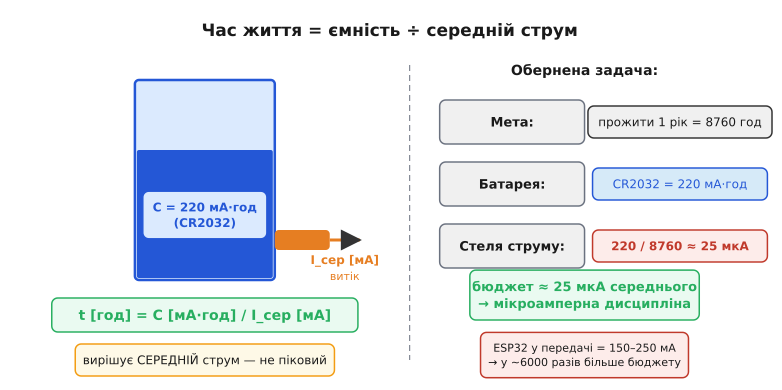
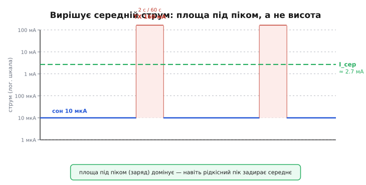

# Бюджет батареї

Кожна батарея — резервуар заряду, і цей резервуар скінченний. Скільки заряду в ньому, кажуть міліампер-години (мА·год): якщо пристрій тягне 1 мА, а батарейки вистачає на 100 годин такого струму, її ємність — 100 мА·год. Сама назва «ємність» (латиною *capacitas* — «місткість») і означає, скільки заряду посудина здатна вмістити й віддати.

Логічне питання: чому не в кулонах, хоча 1 мА·год = 3.6 Кл? Причина суто практична. Споживання пристрою ми міряємо в міліамперах, тож коли ємність теж записана «в міліамперах помножити на години», досить поділити одне на друге — і час виходить одразу в годинах, без жодного переведення одиниць. Уявіть бак із водою: ємність — це його об'єм, струм споживання — швидкість витоку через дірку внизу. Час, поки бак не спорожніє, — об'єм поділити на швидкість витоку. Аналогія точна й тримається щоразу, коли треба прикинути, надовго вистачить живлення. Ламається вона лише там, де реальна хімія відступає від ідеалу.

Звідси **головна формула бюджету**:

```
t_життя [год] ≈ C [мА·год] / I_сер [мА]
```

> 🔧 **Навіщо це.** Бюджет рахують ДО проєктування, не після. Перше питання, яке ставить досвідчений інженер, — «скільки маю мА·год і скільки годин маю прожити». Звідси випливає стеля середнього струму, і вже під цю стелю добирають режим сну, частоту прокидань, навіть саму батарею. Пристрій, що бадьоро працює на столі, а в полі вмирає за тиждень, — це майже завжди пропущений бюджет.

У цій формулі вирішує **середній** струм, а не піковий. З першого погляду це не очевидно, та на цьому тримається вся мікроамперна дисципліна автономного живлення. Хай чип раз на хвилину на дві секунди виходить у радіо при 80 мА, а решту часу лежить у глибокому [сні](root:hw-arch/sleep-modes) при 10 мкА — малий струм сну оманливий. Ті дві секунди тягнуть середнє вгору набагато дужче, ніж 10 мкА за всю хвилину.

Щоб відчути масштаб, поставмо задачу навпаки: не «скільки проживе», а «скільки маю права споживати». Типові ємності круглими числами: CR2032 (кнопкова таблетка) — близько 220 мА·год, лужна АА — 2000–3000 мА·год, літій-іонний 18650 — 2500–3500 мА·год. Ціль — прожити рік, тобто 8760 годин. Ділимо 220 на 8760 і дістаємо **25 мкА**. Ось вона, стеля середнього струму для CR2032 на рік. Двадцять п'ять мікроампер — це у шість тисяч разів менше, ніж ESP32 у момент передачі. Тут і ховається весь «шок» бюджету: мало сказати «треба спати» — треба тримати середнє в межах мікроампер, поки пікові потреби лишаються в міліамперах.



*Ліворуч — аналогія резервуару: ємність C — об'єм, середній струм — швидкість витоку, час дорівнює об'єм поділити на витік. Праворуч — обернена задача: щоб CR2032 прожила рік (8760 год), середній струм не може перевищити приблизно 25 мкА. Звідси й мікроамперна дисципліна автономного живлення.*

## Чому ідеальна формула завжди бреше у бік оптимізму

Формула `C / I_сер` — лише відправна точка. Реальний час життя завжди коротший, і винні три поправки, кожна з яких відкушує свій шматок.

**Саморозряд.** Батарея витрачає заряд сама, навіть коли до неї нічого не підключено: всередині комірки повільно йдуть хімічні реакції незалежно від зовнішнього кола. Це наче невидимий постійний струм витоку. Для якісних літієвих елементів він близько 1–3% на рік, для лужних — помітно більший. Поки пристрій тягне сотні міліампер, цей витік — дрібниця. Та щойно власне споживання падає до десятка мікроампер, саморозряд стає рівноправним гравцем: якщо пристрій бере 10 мкА, а батарея сама губить еквівалент 3–5 мкА, третину бюджету з'їдає вже не пристрій, а хімія комірки.

**Температура.** На холоді хімічні реакції уповільнюються, внутрішній опір росте, доступна ємність помітно падає. [Літій-іонний акумулятор](root:embedded/battery-chemistries) при −20 °C нерідко віддає вдвічі менше, ніж при +20 °C. Давач, випробуваний у теплій лабораторії, узимку в полі дістане від тієї самої батареї куди менше, ніж показував розрахунок.

**Недосяжний «хвіст».** Кожна схема має нижню напругу відсічки — поріг, нижче якого вона перестає коректно працювати. Останні відсотки ємності в комірці формально є, але лежать «під підлогою» робочої напруги: витягти їх не вийде, бо пристрій вимкнеться раніше. Точна математика всіх трьох поправок — у вставці [математики батарейного бюджету](root:hw-power/battery-budget/math-battery-math.md).



*Профіль струму пристрою в часі: довгий низький сон (синій) і рідкісні піки передачі (червоні). Пунктир — середній струм: він стоїть значно вище плато сну, бо площа під піками (заряд) переважує площу під плато, навіть коли піки вузькі. Вирішує не висота і не тривалість окремо, а їхній добуток — заряд за цикл.*

## Worked-приклад: скільки проживе давач від CR2032

**Дано: CR2032 на 220 мА·год; сон 10 мкА; раз на хвилину пристрій на 2 секунди вмикає радіо при 80 мА.**

```
Крок 1. Частка активного часу (duty cycle):
        D = t_act / T = 2 с / 60 с = 0.0333

Крок 2. Середній струм:
        I_сер = I_sleep × (1 − D) + I_act × D
              = 0.010 мА × 0.9667 + 80 мА × 0.0333
              = 0.010 + 2.667 мА
              ≈ 2.677 мА

Крок 3. Час життя:
        t = 220 / 2.677 ≈ 82 год ≈ 3.4 доби
```

Три доби замість очікуваних місяців — і це при «рідкісному» прокиданні раз на хвилину. Подивимось, куди подівся заряд. За одну хвилину радіо бере 80 мА × 2 с = 160 мА·с, а сон — лише 10 мкА × 58 с = 0.58 мА·с. Радіо з'їло у 275 разів більше за сон, хоч тривало у 29 разів менше. Звідси ключова теза: **домінує заряд активної фази, а не струм сну**. Керувати бюджетом — означає керувати саме цим зарядом: рідше прокидатися, коротше передавати, тримати [частку активного часу](root:embedded/duty-cycle-current) (англ. *duty cycle*, «робочий цикл») якомога меншою.

> 🔧 **Навіщо це.** Цифра «82 години» — це вирок конкретному задуму, винесений ще до паяння. Якщо технічне завдання вимагає рік, а розрахунок дає три доби, варіантів небагато: рідше виходити в ефір, скоротити пакет даних, узяти ємнішу батарею — або визнати, що CR2032 тут не підходить. Усе це дешевше вирішити на папері, ніж після того, як партію пристроїв уже розвезли по полю.

Той самий важіль працює і в інший бік. Скоротіть передачу вдвічі — до 1 секунди — і середній струм одразу падає майже вдвічі, бо в ньому майже все дає активна фаза. Зробіть вихід в ефір раз на п'ять хвилин замість щохвилини — і виграєте ще кратно. Перший крок оптимізації автономного пристрою — це завжди робота над активною фазою, а не «закопування» струму сну на зайвий мікроампер: коли активна фаза дає 2.667 мА, а сон 0.010 мА, навіть ідеальний нульовий сон скоротив би середнє лише на частку відсотка.

Те, що інженери автономних систем формулюють сьогодні цією формулою, інші відкрили задовго до них і за куди вищу ціну — коли «розрядилась батарея» означало смерть пацієнта. Як кардіостимулятор змусив одну маленьку комірку жити роками, розповідає [історія про батарейку у грудях людини](root:hw-power/battery-budget/hist-pacemaker.md).

---
