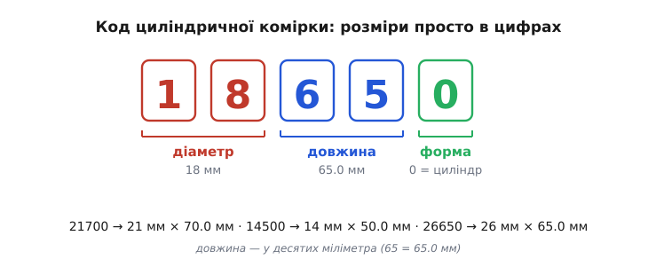
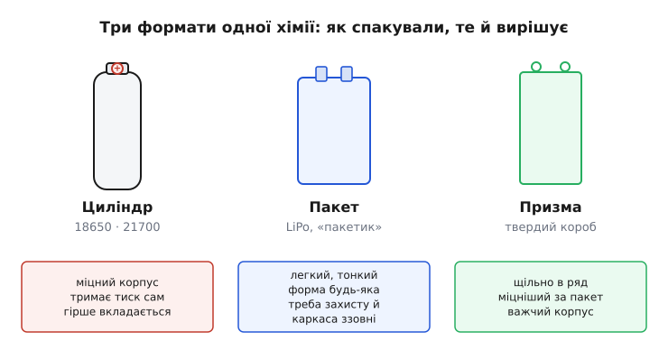
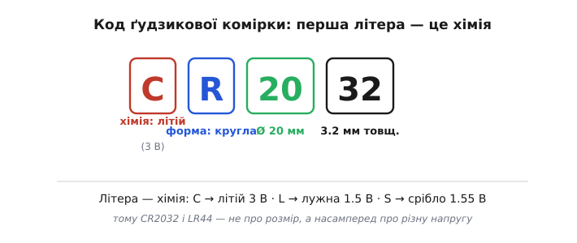

# Формати акумуляторних елементів

Візьміть у руки акумулятор ноутбука, батарею дрона й «таблетку» з материнської плати комп'ютера. Усередині всіх трьох може бути **та сама** літієва хімія — той самий рух іонів літію між електродами, що дає ту саму напругу близько 3.7 вольта на комірку. А виглядають вони цілком по-різному: тверда металева «пальчикова» банка, м'який плаский пакетик і крихітна срібляста монетка. І кожна ще й підписана якимось кодом — 18650, а на монетці CR2032. Формат акумулятора — це **не хімія, а спосіб, у який ту хімію запакували в корпус**; і саме він, а не сама по собі хімія, найчастіше вирішує, чи стане батарея в апарат, як її туди закріпити й скільки вона важитиме.

Ці коди не випадкові й не маркетингові. За кожним стоїть проста система: коли розумієш, що означає кожна цифра й літера, «18650» перестає бути шифром і починає **говорити розмір і форму** ще до того, як ти взяв комірку в руки. Розберімо три речі: як читаються коди циліндричних комірок, чим відрізняються три головні формати корпусу (циліндр, пакет, призма) і як влаштовані окремим світом крихітні ґудзикові комірки.

### Код циліндричної комірки: розмір просто в цифрах

Почнімо з найпоширенішого — циліндричної комірки, тієї самої «банки», що стоїть у ноутбуках, акумуляторних інструментах, повербанках і тисячами — в електромобілях. Її код на кшталт **18650** здається загадковим лише доти, доки не знаєш ключа. А ключ простий: **цифри — це розміри в міліметрах**.


*Код циліндричної комірки — це її мірка. Перші дві цифри — **діаметр** у міліметрах (18 → 18 мм), наступні дві — **довжина** в десятих міліметра (65 → 65.0 мм), остання зазвичай **0** і позначає круглий, циліндричний корпус. Тож 18650 — це «18 міліметрів у діаметрі, 65 завдовжки, циліндр». За тим самим правилом 21700 — це 21 × 70.0 мм, 14500 — 14 × 50.0 мм (на вигляд як «пальчикова» AA, але з літієвою напругою), 26650 — 26 × 65.0 мм.*

Ось чому назви такі різні на слух, а логіка одна. Коли виробники переходили з **18650** на трохи товщу й довшу **21700**, вони не вигадували нову систему — просто вклали в той самий шаблон нові розміри: 21 мм замість 18, 70.0 мм замість 65.0. Ширша й вища банка вміщає більше активної речовини, а отже, більше енергії; тому індустрія і зробила цей крок, коли він дав відчутний виграш на елемент. Той самий код одразу каже, наскільки нова комірка більша за стару — без жодної таблиці.

Чому саме десяті міліметра в довжині? Бо реальні комірки бувають, скажімо, 65.0 чи 70.0 мм, і система лишає місце для дробової частини, якої в діаметрі зазвичай не потребують. Остання цифра-«форма» майже завжди 0 (круглий корпус); зустрічаються рідкі варіанти з іншою літерою на позначення дрібної конструктивної відмінності, але для читання коду досить пам'ятати: **дві цифри — діаметр, дві — довжина, остання — «це циліндр»**.

Історія тут коротка й показова. Перші літій-іонні комірки випустила компанія Sony на початку 1990-х, а сам розмір 18650 як стандарт закріпився в тому ж десятилітті (першість між Sony та Panasonic джерела приписують по-різному, тож це радше *усталений формат*, ніж чийсь одноосібний винахід); цифрове маркування «діаметр-довжина» пасувало до вже наявної традиції називати круглі елементи їхніми розмірами. Відтоді 18650 стала найпоширенішою циліндричною коміркою у світі — саме тому її розмір знають напам'ять, як колись знали «пальчикову» AA. [Звідки взявся формат 18650 і чому індустрія роками трималася саме за нього](root:hw-power/battery-formats/hist-18650.md) — окрема історія про камкодери, ноутбуки та несподіваний поворот до електромобілів.

> 🔧 **Навіщо це.** Код формату — перше, що звіряють, підбираючи тримач, зарядний пристрій чи місце в корпусі: тримач «18650» фізично не прийме товщу 21700, а відсік, розрахований на 21700, лишить 18650 бовтатися. Розмір ти читаєш **прямо з назви**, тож можеш прикинути, чи влізе комірка й скільки їх стане в ряд, ще на етапі креслення — не тримаючи жодної в руках.

Одне застереження, яке рятує від халепи. Циліндрична комірка буває у двох виконаннях: **гола** (*flat top*, плаский плюсовий контакт) і **з захистом** (*protected*, із вбудованою платкою, що додає кілька міліметрів довжини й опуклий контакт). Захищена комірка «18650» насправді довша за свої номінальні 65 мм — інколи на 2–3 мм — і в тісний тримач може не влізти. Тому в специфікації дивляться не лише на код, а й на реальну довжину та тип контакту. Про те, що це за платка й навіщо вона, — у темі [захисту акумулятора](root:hw-power/battery-protection).

### Три формати одної хімії: циліндр, пакет, призма

Тепер головне питання: якщо хімія та сама, **навіщо взагалі різні форми**? Відповідь у тому, що корпус вирішує три речі одразу — як щільно комірки вкладаються в об'єм апарата, хто тримає механічний тиск і скільки важить сама «обгортка». Різні задачі тягнуть у різні боки, і звідси три родини форматів.


*Три формати одної хімії. **Циліндр** — рулон електродів у твердій металевій банці: корпус міцний і сам тримає внутрішній тиск, але круглі банки лишають порожнечі між собою й гірше вкладаються в об'єм. **Пакет** (*pouch*, «пакетик») — електроди в м'якій фользі-ламінаті: найлегший і будь-якої плоскої форми, зате не має власної жорсткості й потребує захисту й каркаса ззовні. **Призма** — ті самі плоскі електроди, але в твердому прямокутному коробі: щільно стають у ряд і міцніші за пакет, ціною важчого корпусу.*

Розгляньмо кожну як розв'язок конкретного компромісу.

**Циліндр** — це рулон: тонкі стрічки електродів і сепаратора скручують і вставляють у металеву банку. Форма кругла не з примхи, а тому що **циліндр — природно міцна оболонка**: внутрішній тиск (а він у літієвій комірці зростає при нагріві й старінні) рівномірно розходиться по стінках, і банка тримає його сама, без зовнішнього каркаса. Це велика перевага: комірка самодостатня й груба до механіки. Розплата — геометрія. Круглі банки, як не клади, лишають між собою порожні жолоби; корисний об'єм апарата вони заповнюють гірше, ніж плоскі формати. Тому циліндр беруть там, де цінують міцність, стандартність і дешевизну масового виробництва, а не гранично щільне пакування: інструмент, ліхтарі, повербанки, автомобільні збірки з тисяч однакових банок.

**Пакет** (*pouch*, англ. — «мішечок») жертвує саме тим, що є силою циліндра, і навзамін виграє в іншому. Тут електроди не скручують у банку, а складають плоскими шарами й заварюють у **гнучку фольгу-ламінат** — по суті, метал-пластикову плівку. Корпус майже нічого не важить, тому пакетна комірка дає найбільше енергії на грам — і саме тому [літій-полімерні (LiPo) батареї](root:hw-power/batteries) панують на дронах, де кожен грам коштує тяги. Пакет ще й будь-якої плоскої форми: його роблять під конкретний виріб — тонким під смартфон, довгим під планшет. Але за легкість платиться беззахисністю: м'який пакет **не має власної жорсткості**, його легко проколоти, зім'яти чи роздути. Тому пакетну комірку завжди ставлять у захисний каркас або корпус пристрою, а роздуту (напнуту газом) вважають небезпечною й не використовують. Ця крихкість і поведінка під навантаженням — уже питання [механіки й безпеки батареї](root:hw-power/battery-mechanics).

**Призма** (лат. *prisma* — тіло з паралельними гранями) — компроміс між двома попередніми. Це ті самі плоскі складені електроди, що й у пакеті, але вкладені в **твердий прямокутний короб** (метал або жорсткий пластик). Прямокутники стають один до одного без порожнеч — тож призматичні комірки вкладаються в об'єм майже так само щільно, як пакет, — і водночас мають власний міцний корпус, як циліндр. Ціна — вага цього корпусу й трохи нижча енергія на грам, ніж у голого пакета. Тому призму беруть там, де важлива щільність пакування **разом** із міцністю: великі стаціонарні накопичувачі, тягові батареї, техніка, де комірки мають жити довго й не боятися механіки.

Жодна з трьох не «найкраща» — кожна виграє свій компроміс:

```
циліндр  — міцний, дешевий, стандартний;  гірше вкладається в об'єм
пакет    — найлегший, будь-яка форма;      крихкий, треба захист ззовні
призма   — щільно + міцно;                 важчий корпус, дорожче
```

> 🔧 **Навіщо це.** Формат диктує **механіку монтажу**, а не лише електрику. Циліндри ставлять у пружинні тримачі й можна замінювати поштучно; пакет треба **закріпити й захистити** корпусом, лишивши запас на невелике розбухання з часом; призму кріплять за жорсткий короб. Обравши хімію й ємність, ти ще маєш обрати формат — і саме він визначить, як батарея триматиметься в апараті та чи переживе вібрацію й удари.

Є ще один практичний бік формату — як окремі комірки **з'єднують у збірку**. Циліндричні банки часто зварюють нікелевими стрічками контактним (точковим) зварюванням, бо паяти їх довгим нагрівом небезпечно; пакетні комірки мають плоскі виводи-«язички», які приварюють або притискають. Ці способи складання — окрема тема про [контактне зварювання в батарейних збірках](root:hw-power/spot-welding-batteries), але сам вибір способу теж випливає з формату: до круглої банки і до плоского язичка підходять по-різному.

### Літерний код: коли розмір мало що каже

Циліндричний код 18650 — це чиста геометрія, він мовчить про хімію: банка «18650» може бути з будь-яким катодом. Але існує й строгіша система підпису, яку задає міжнародний стандарт (IEC 61960 для літієвих акумуляторів). Там перед розміром ставлять **літери, що кодують саме хімію катода** — бо від неї залежать і напруга, і безпека, і те, який струм можна тягнути.

Схема така: перша літера **I** означає літій-іонний акумулятор, друга — матеріал катода, третя **R** — round, круглий (циліндричний) корпус. Друга літера й несе головне:

```
ICR — катод кобальтовий (LiCoO₂):   найбільше енергії, але вимогливий до безпеки
IMR — марганцевий (LiMn₂O₄):         терпить великі струми, безпечніший
INR — нікель-марганець-кобальт (NMC): збалансований, найпоширеніший сьогодні
IFR — залізо-фосфат (LiFePO₄):        найбезпечніший і найдовговічніший, нижча напруга
```

Тому підпис «INR18650» каже вже дві речі: **розмір** (18 × 65 мм циліндр) і **хімію** (нікель-марганець-кобальт). Це важить, бо дві однакові на вигляд банки «18650» з різними катодами поводяться по-різному: одна віддасть шалений струм на інструмент, інша — довше проживе на м'якому режимі. Про самі відмінності катодів — у темі [акумуляторів](root:hw-power/batteries), де розібрано, як хімія задає напругу й характер; тут головне — що **літери попереду коду це і підказують**.

### Ґудзикові комірки: окремий світ, де літера — це напруга

Крихітні круглі «таблетки», що живлять годинники, материнські плати, ключі-брелоки й дитячі іграшки, називають ґудзиковими або монетними (*coin / button cells*). Вони заслуговують окремої розмови, бо їхній код влаштований **інакше** за циліндричний — і плутанина тут коштує зіпсованого пристрою.


*Код ґудзикової комірки починається з **хімії**, а не з розміру. У «CR2032»: **C** — літієва хімія (діоксид марганцю), що дає **3 вольти**; **R** — round, кругла; **20** — діаметр 20 мм; **32** — товщина 3.2 мм. Тобто цифри знову геометрія, але **перша літера задає напругу**. Порівняйте з лужною «LR44»: **L** — лужна хімія на **1.5 вольта**, і це вже зовсім інша комірка, хай і схожа на вигляд. Літера **S** позначає срібно-оксидну (~1.55 В), теж поширену в годинниках.*

Ось звідки береться найчастіша помилка. Людина шукає заміну «CR2032», бачить схожу монетку «LR44» і думає, що це те саме, бо обидві круглі й дрібні. Але **CR** — це літій на 3 вольти, а **LR** — лужна на 1.5 вольта: удвічі менша напруга й інша крива розряду. Поставиш лужну туди, де чекали літієву, — пристрій або не запуститься, або поведеться дивно. Тому в ґудзикових комірках **першим читають не розмір, а літеру**: вона каже напругу, і лише потім цифри кажуть, чи фізично влізе.

Розшифруймо цифри до кінця на прикладі. У «2032» перші дві цифри — **діаметр** у міліметрах (20 мм), другі дві — **товщина** в десятих міліметра (32 → 3.2 мм). За тим самим правилом CR2016 — та сама монетка діаметром 20 мм, але вдвічі тонша (1.6 мм), а отже, і ємності в ній менше. Тобто система близька до циліндричної (розмір у цифрах), але порядок інший: тут це «діаметр-товщина», бо комірка плоска.

Корисно вміти рахувати, надовго вистачить такої «таблетки». Візьмімо типову CR2032, яка тримає резервний годинник материнської плати:

**Приклад (термін життя CR2032).** Комірка CR2032 має ємність близько 220 мА·год, а годинник реального часу споживає в резерві близько 5 мікроампер:

```
ємність     = 220 мА·год = 220 000 мкА·год
споживання  = 5 мкА
термін       = 220 000 мкА·год / 5 мкА = 44 000 год
44 000 год / 24 / 365 ≈ 5 років
```

Ось чому батарейку на материнській платі міняють раз на кілька років, а не щомісяця: мікроамперне споживання розтягує ці скромні 220 мА·год на роки. І та сама арифметика підказує, чому пристрій із помітно більшим фоновим струмом «з'їсть» ту саму таблетку набагато швидше — досить порахувати відношення ємності до струму.

Одне важливе застереження безпеки саме про ці комірки. Ґудзикові літієві батарейки небезпечні для малих дітей: проковтнута монетка застряє в стравоході й хімічно палить тканину за години. Тому пристрої з такими комірками роблять із гвинтовим чи тугим відсіком, а самі батарейки тримають подалі від дітей — це не формальність, а реальна медична пересторога.

> 🔧 **Навіщо це.** Підбираючи ґудзикову комірку, спершу звіряй **літеру (напругу)**, а тоді цифри (розмір): CR2032 і CR2016 стануть в один тримач, але тонша дасть менше годин; а «схожа» LR44 — це вже 1.5 В і не заміна для 3-вольтової схеми. І закладай у пристрій відсік, який дитина не відкриє, — цього вимагає сама хімія цих батарейок.

### Що формат означає для розробника

Формат акумулятора — це рівень, що стоїть **між хімією й апаратом**. Хімія задає напругу, енергію на грам і характер розряду; а формат вирішує, у якому корпусі ту хімію тобі дають — і звідси все механічне: як закріпити, скільки важить обгортка, чи витримає удар, як з'єднати комірки між собою, чи влізе в наявний об'єм.

Читати формати після цього просто. **Циліндричний код** (18650, 21700) — це геометрія в цифрах: дві на діаметр, дві на довжину, остання «це циліндр»; сам циліндр міцний і стандартний, але гірше вкладається в об'єм. **Літерний код** (INR, IFR) додає попереду хімію катода, коли вона важлива. Три **родини форматів** розв'язують один компроміс по-різному: циліндр — міцність і стандартність, пакет — легкість і будь-яка форма ціною крихкості, призма — щільне пакування разом із міцністю. А **ґудзикові комірки** живуть окремим правилом, де перша літера каже напругу (CR — літій 3 В, LR — лужна 1.5 В), і цифри вже про розмір. Обравши батарею за хімією та ємністю, останній крок — обрати **формат**: саме він визначить, як вона житиме в твоєму апараті.
