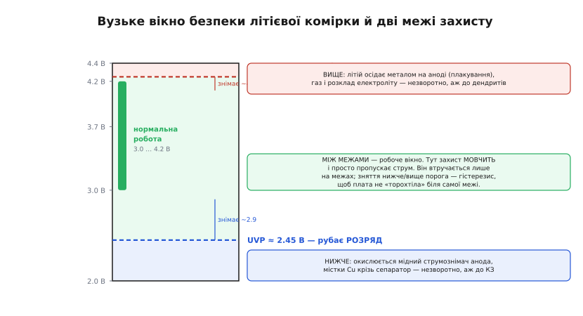
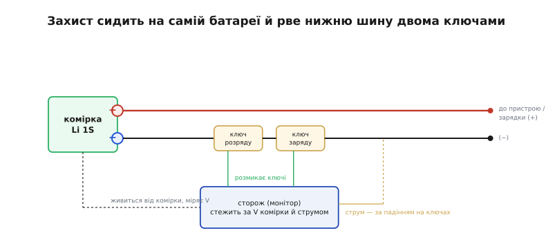
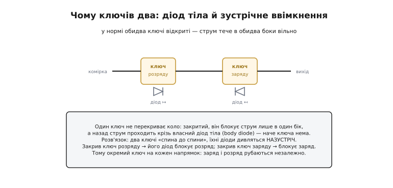

# Захист акумулятора

Літієва комірка — це маленька хімічна бочка з порохом, яка більшу частину часу поводиться взірцево. Але за двома вузькими межами напруги в ній починається хімія, яку не відкотити назад: угорі метал літію осідає на аноді, унизу розчиняється мідь струмознімача. Ще далі — газ, нагрів, тепловий розгін і, у найгіршому разі, полум'я. Захист акумулятора — це вартовий, що фізично сидить на самій батареї й **розриває коло**, щойно комірка підходить до цих меж. Він нічого не перетворює й не заряджає; у нормі він мовчить і просто пропускає струм. Уся його робота — вчасно сказати «стоп».

Слово «акумулятор» (лат. *accumulare* — накопичувати) тут означає перезаряджувану комірку — на відміну від одноразової батарейки. Саме перезаряджуваність і робить захист потрібним: одноразову клітинку розрядили — і викинули, а літієву заряджають і розряджають сотні разів, і на кожному циклі вона має шанс зайти за небезпечну межу.

## Чому комірка потребує окремого вартового

Здавалося б, досить «розумного» зарядника, який сам не нашкодить. Але зарядник керує лише **фазою заряду** — тими годинами, поки комірка висить на його клемах. А комірка живе власним життям ще довго після того: її від'єднали, ввімкнули в пристрій, розрядили в польоті, кинули в шухляду на пів року. Усе це — поза полем зору зарядника. Хто вбереже комірку, коли пристрій випадково лишили ввімкненим і той висмоктав її «в нуль»? Хто зупинить струм, коли у виході стався коротун? Зарядника там немає.

Тому захист має бути **при самій батареї**, між коміркою й рештою світу, і живитися від неї ж. Це принципова вимога: вартовий мусить працювати тоді, коли не працює вже ніщо інше. Він бере свої мікроампери з тієї самої комірки, яку боронить, і стоїть на її клемах роками, чекаючи на аварію, якої може й не статися.

> 🔧 **Навіщо це.** У будь-якому виробі на літії — від навушників до дрона — захисна ланка не опція, а обов'язковий елемент між коміркою й схемою. Забути її означає, що перший же випадковий глибокий розряд або коротке в кабелі не просто зіпсує батарею, а може закінчитися займанням. Це та ланка, що стоїть між справним пристроєм і новиною про пожежу від саморобки.

## Чотири межі, за якими нема вороття

Захист стереже комірку по двох осях — **напрузі** й **струму** — і на кожній має по дві межі. Разом виходить чотири класичні пороги. Щоб зрозуміти, чому вони саме там, де вони є, треба спершу побачити, що ламається за кожним із них.

### Зверху по напрузі: перезаряд (OVP)

Заряджена літієва комірка має близько 4.20 В. Трохи вище — і починається лихо. За цією межею іони літію заходять у графітовий анод **швидше**, ніж той встигає прийняти їх у свою кристалічну структуру (інтеркалювати). Зайвий літій уже не має куди сісти всередині — і осідає на **поверхні** анода металевою плівкою. Це **літієве плакування** (англ. *lithium plating*): анод, у нормі вкритий іонами, вкривається шаром металевого літію.

Ця плівка не повертається назад в оборот. Частина металу вступає в реакцію з електролітом і випадає з гри назавжди — ємність комірки падає. Гірше: метал росте не гладко, а голками — **дендритами** (гр. *déndron* — дерево), і ці голки з часом можуть проколоти сепаратор (тонку пористу плівку між анодом і катодом) і замкнути комірку зсередини. Паралельно висока напруга розкладає сам електроліт — звідси газ і нагрів. Тому захист ставить поріг перезаряду (OVP, over-voltage protection) трохи вище 4.20 В — типово біля **4.25–4.30 В**: це той вузький запас, де ще нічого фатального не сталося, але далі пускати вже не можна.

### Знизу по напрузі: переглибокий розряд (UVP)

Нижня межа критичніша за верхню — і за зовсім іншою хімією. Робочий мінімум комірки — близько 3.0 В; нижче вона майже порожня. Якщо тягти струм і далі, потенціал анода починає **повзти вгору** (бо з нього вичерпується літій), і за глибокого розряду доходить до рівня, на якому окислюється вже не літій, а **мідна фольга струмознімача анода** (англ. *copper current collector*) — той мідний листок, до якого приклеєний графіт. Мідь розчиняється в електроліті іонами Cu²⁺, мандрує крізь сепаратор і осідає там металевими містками. При наступному заряді ці містки ростуть — і повільно вбивають комірку зсередини, аж до внутрішнього короткого замикання.

Це так само незворотно, як плакування зверху, тільки підступніше: зовні комірка ще ціла, а всередині вже проросли мідні перемички. Тому захист розмикає розряд десь на **2.4–2.5 В** — трохи нижче робочого мінімуму, поки мідь ще не пішла розчинятися (UVP, under-voltage protection).

> 🔧 **Навіщо це.** Саме UVP найчастіше рятує реальні пристрої: користувач лишив вимкнути прилад, той тижнями тихенько тягнув струм спокою — і без захисту комірка пішла б у переглибокий розряд і померла (а то й спалахнула б при наступному заряді). З захистом вона просто відрубається на 2.5 В і чекає.

### По струму: перевантаження (OCP) і коротке (SCP)

Дві межі по струму бороняться не від хімії напруги, а від **тепла й лавини**. Надмірний струм гріє і комірку, і провідники; коротке замикання здатне за секунди розігнати комірку в тепловий розгін. Тому захист стежить і за струмом:

- **OCP** (over-current protection) — перевантаження: струм перевищив стелю (скажімо, до виходу підключили надто «ненажерливе» навантаження). Поріг помірний, реакція — з невеликою затримкою.
- **SCP** (short-circuit protection) — коротке замикання: струм лавиноподібний, це прямий коротун у виході. Поріг набагато вищий, а реакція — майже миттєва, за мікросекунди.

Тонкість у тому, **як** захист міряє струм. Найдешевший спосіб — не ставити окремий вимірювальний резистор, а дивитися на **падіння напруги на самих ключах**, якими захист і так рве коло: відкритий ключ має малий опір, тож струм створює на ньому пропорційне падіння, і це падіння править за міру струму. Дешево — але неточно, бо опір ключа «гуляє» з температурою (докладніше — у прикладі нижче). Точні системи ставлять окремий [струмовий шунт](topic:hw-components/shunt-resistor) відомого опору й міряють струм по ньому.


*Робоче вікно комірки затиснуте між двома жорсткими межами: вище OVP починається плакування літію, нижче UVP — розчинення міді. Усередині вікна захист мовчить; зняття порогів зсунуте (гістерезис), щоб плата не «торохтіла» на самій межі.*

## Гістерезис і затримка: чому захист не панікує

Якби захист вмикав і вимикав коло точно на порозі, він би тремтів. Уяви: напруга під навантаженням просіла до 2.45 В — захист відрубав розряд. Струм зник — і напруга «відпружинила» назад до 2.6 В. Захист бачить, що вже вище порога, і знову вмикає. Навантаження знову тягне вниз до 2.45 — і знову відруб. Так плата затріщала б десятки разів на секунду, добиваючи виснажену комірку.

Щоб цього не було, поріг **спрацювання** і поріг **зняття** рознесені — це **гістерезис** (гр. *hystéresis* — відставання). Розряд рубається на 2.4–2.5 В, але **знімається** аж коли напруга підніметься до ~2.9–3.0 В: щойно навантаження відключилося, плата не поспішає вмикатися назад. Так само вгорі: перезаряд рубається на 4.25 В, а знімається біля 4.10 В.

Друга страховка від панік — **затримка спрацювання** (detection delay). Усі пороги напруги ловляться не миттєво, а через десятки-сотні мілісекунд (типово ~100 мс). Це навмисний фільтр: він відсіює короткі сплески — стрибок струму при пуску двигуна, просадку напруги під ривком навантаження — щоб плата не рубала живлення від кожного нормального перехідного процесу. І лише коротке замикання (SCP) — виняток: його треба зловити за мікросекунди, бо чекати ніколи.

## Де захист стоїть і що саме він рве

Тепер — топологія. Комірка має два виводи, плюс і мінус; захист вставляють у розрив **однієї** з шин, а другу пускають навпростець. У переважній більшості однокоміркових плат ріжуть **нижню (мінусову)** шину, а плюс іде на вихід прямо. Це не примха монтажу — так дешевше, і ось чому.

Ключем служить [польовий транзистор (MOSFET)](topic:hw-components/mosfet-power-switch) — електронний вимикач без рухомих контактів. N-канальний MOSFET відкривається, коли його затвор піднято на кілька вольтів **вище за витік**. Найлегше це забезпечити, коли витік прибитий до найнижчого потенціалу схеми — до мінуса комірки. Тоді сторож живиться від тих самих 3–4 В комірки й легко піднімає затвор над витоком: відкрити ключ дешево й надійно. Якби ключ стояв у плюсовій шині, його витік «висів» би біля плюса комірки, і щоб відкрити N-канал, затвор довелося б тягти **вище за плюс батареї** — а такої напруги на платі просто немає, довелося б ставити [зарядну помпу](topic:hw-power/charge-pump). Тому дешеві однокоміркові плати майже завжди ріжуть мінус: це дозволяє обійтися звичайними N-MOSFET без жодного підвищувача напруги.


*Плюс комірки йде на вихід навпростець, уся комутація — на мінусовій шині. Сторож живиться від комірки, міряє її напругу і струм (за падінням на самих ключах) і на аварії розмикає потрібний ключ.*

## Чому ключів завжди два

Найнесподіваніше в цій топології — що ключів **два**, увімкнені «спина до спини», хоча рве вони одну шину. Причина — у фізиці самого транзистора.

Польовий транзистор не симетричний: усередині нього паразитом сидить **[діод тіла](topic:hw-components/body-diode)** (англ. *body diode*) — вбудований діод між витоком і стоком. Коли MOSFET закритий, він блокує струм лише в **один** бік; у зворотному напрямку струм усе одно протече через цей діод, наче ключа й немає. Виходить, один транзистор не може перекрити коло в обидва боки — а захисту треба вміти зупиняти і **розряд** (комірка → навантаження), і **заряд** (зарядник → комірка), тобто струм обох напрямків.

Розв'язок — два ключі в зустрічному ввімкненні (back-to-back), так, щоб їхні діоди тіла дивилися **назустріч**. Тоді який би напрямок ми не хотіли заблокувати, на шляху завжди стоїть хоча б один діод, повернений «глухим» боком. У нормі обидва ключі відкриті, коло провідне в обидва боки — заряд і розряд ідуть вільно, а на малому опорі відкритих ключів діоди навіть не вмикаються. На аварії сторож закриває **потрібний** ключ: перезаряд — закриває ключ заряду (його діод блокує зарядний струм, але розряджати комірку ще можна); переглибокий розряд — закриває ключ розряду (його діод блокує розрядний струм, але зарядити комірку вже можна). Ось чому ключі розряду й заряду — окремі: вони рубають протилежні напрямки незалежно.


*Один ключ пропускає струм назад через свій діод тіла. Два зустрічні ключі мають діоди, повернені назустріч: закрив ключ розряду — блокується розряд, закрив ключ заряду — блокується заряд.*

## Що це коштує: числовий приклад

Візьмімо, як саме «пливе» струмовий поріг у дешевого захисту, що міряє струм по власних ключах. Нехай поріг OCP заданий падінням напруги на ключах V_OCP ≈ 150 мВ (типове значення), а сумарний опір пари ключів у відкритому стані R ≈ 50 мОм за кімнатної температури. Захист розмикає коло, щойно падіння перевищить 150 мВ. Струм спрацювання:

```
I_trip = V_OCP / R
I_trip = 0.150 В / 0.050 Ом
I_trip = 3.0 А        (за ~25 °C)
```

Тепер під навантаженням ключі прогрілися до ~75 °C. Опір каналу MOSFET росте з температурою (у кремнію рухливість носіїв падає з нагрівом); для типового ключа коефіцієнт ≈ +0.4 %/°C, тож за ΔT = 50 °C опір зросте приблизно на 20 %:

```
R_hot = R × (1 + 0.004 × 50)
R_hot = 0.050 × 1.20
R_hot = 0.060 Ом

I_trip(hot) = V_OCP / R_hot
I_trip(hot) = 0.150 / 0.060
I_trip(hot) ≈ 2.5 А
```

Той самий поріг у мілівольтах за гарячих ключів спрацьовує вже на 2.5 А замість 3.0 А — на ~17 % раніше. Ось чому OCP такого класу — груба «запобіжна стеля», а не точне обмеження струму: сам вимірювальний елемент (ключ) міняє свій опір від нагріву. Якщо проєкту потрібен точний ліміт — скажімо, силовий каскад, де поріг має триматися з точністю до сотень міліампер, — беруть захист із **окремим шунтом** відомого й стабільного опору.

Цю залежність порога від опору ключів, разом із виведенням температурного дрейфу, детальніше розбирає [окрема викладка](topic:hw-power/battery-protection/math-ocp-threshold.md).

## Реальне залізо: чип плюс ключі

У однокоміркових пристроях усе це вкладається в крихітну плату з двох деталей: **захисний чип** (сторож, що міряє напругу й струм і керує затворами) і **спарений MOSFET** (два ключі в одному корпусі). Це найтиражніший захисний вузол у світі — та сама смужка, що висить майже на кожному літій-полімерному пакеті, і коштує вона копійки. Плата повністю аналогова й автономна: жодного коду, жодної шини — усі пороги зашиті в кремній на етапі виробництва. Припаяв між коміркою й пристроєм — і захист працює сам. Типову розпіновку, підключення й класичні граблі такого вузла розбирає [окремий опис класу однокоміркових захисних мікросхем](topic:hw-power/battery-protection/comp-single-cell-protection-ic.md).

Важливо не сплутати захист із сусідніми функціями:

- **Захист — це не зарядка.** Він лише боронить межі; заряджати комірку правильним профілем (струм, потім напруга) — робота окремого [зарядного контролера](topic:hw-power/li-ion-charger). «Зарядні плати з захистом», що продають на модулях, — це якраз зарядник **плюс** захисна ланка поряд, дві різні мікросхеми.
- **Захист однієї комірки — це не балансування.** Дешева плата стереже одну комірку (1S). Коли комірок кілька й вони з'єднані послідовно, до захисту меж додається ще й [вирівнювання заряду між комірками](topic:hw-power/battery-balancing) — бо навіть однакові з виду комірки старіють по-різному, і без балансування одна почне «тікати» за напругою.
- **Захист — це не BMS.** Проста захисна ланка тупа й надійна: зашиті пороги, жодного розуму. Коли ж потрібно стежити за кожною коміркою окремо, рахувати заряд, спілкуватися шиною й керувати зарядом розумно — це вже [система керування батареєю (BMS)](topic:hw-power/bms). У серйозних пакетах ставлять і те, і те: розумна BMS оптимізує батарею щодня, а тупий незалежний захист стоїть останньою стіною на випадок, коли BMS осліпне чи зависне.

Історію того, як народилася сама ідея «сторожа при батареї» — від перших літієвих пакетів 1990-х і їхніх гучних аварій до канонічної пари «чип + два ключі», — розповідає [окрема замітка](topic:hw-power/battery-protection/hist-lithium-protection.md).

## Чого захист НЕ робить

Наостанок — межі можливостей, бо саме тут виникають хибні сподівання. Захисна ланка боронить рівно за своїми чотирма порогами й нічим більше:

- **Не рятує від переполюсування.** Ткнув зарядник навпаки — і захист це не ловить; для цього є окремий [захист від переполюсування](topic:hw-power/reverse-polarity-protection).
- **Не рятує від зовнішньої перенапруги** понад своє вікно — прилетів стрибок від несправного зарядника, і чип за ним не встежить.
- **Не рятує від механічного пошкодження чи проколу** — тут не допоможе жодна електроніка.
- **Після UVP батарея «прикидається мертвою».** Коли захист відрубав розряд, на виході напруга падає до нуля, хоча комірка ще жива. Звичайний зарядник бачить нуль вольт і вважає таку батарею дохлою — вивести її з цього стану вміє не кожен зарядник.

Тому захист акумулятора — це необхідна, але не єдина ланка безпеки. Він тримає комірку в її вузькому вікні життя; від усього іншого її боронять інші вартові.
