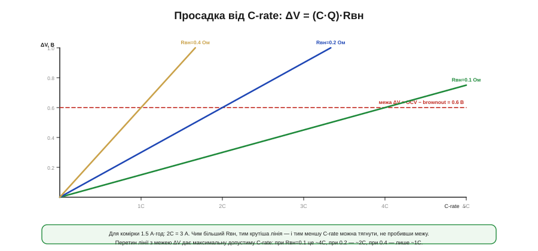
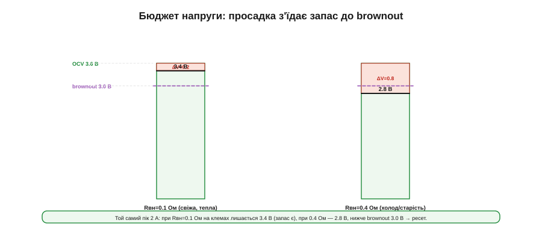

# 🧮 Просадка під імпульсним навантаженням: з Rвн і C-rate

> Пік струму просаджує напругу комірки на [внутрішньому опорі](topic:hw-power/battery-sag) — на величину I·Rвн. Тут ми зв'язуємо цю просадку з **C-rate** і ємністю та рахуємо, який запас до brownout лишається у пристрою.

### Означення

**Просадка** (*voltage sag*) ΔV — це падіння напруги на клемах під навантаженням проти напруги спокою (OCV), спричинене внутрішнім опором комірки:

```
ΔV = I_пік · Rвн
```

Щоб говорити про струм у «батарейних» одиницях, його виражають через **C-rate** — кратність ємності за годину. Якщо ємність комірки Q (в ампер-годинах), то струм у C одиницях C-rate дорівнює:

```
I = (C-rate) · Q
   напр. 2C комірки 1.5 А·год = 2 · 1.5 = 3 А
```

### Інтуїція: дві ручки, що керують глибиною

Глибина просадки залежить лише від **двох** величин: який струм ми смикаємо (через C-rate і ємність) і який опір у комірки. Підкрутити будь-яку з ручок — і провал глибшає лінійно.


*ΔV росте прямо пропорційно до C-rate, а нахил задає Rвн. Горизонтальна межа — максимально допустима просадка (OCV − brownout). Перетин кожної лінії з нею дає **граничну** C-rate: при Rвн=0.1 Ом це ~4C, при 0.2 — ~2C, при 0.4 — лише ~1C. Більший опір — менше дозволеної потужності.*

Звідси й головна думка вставки: для кожної комірки існує **стеля C-rate**, понад яку просадка пробиває поріг brownout, — і ця стеля тим нижча, чим більший Rвн.

### Формальний апарат

З'єднаймо просадку з порогом brownout. Напруга на клемах і запас до зриву:

```
V_клем = OCV − ΔV = OCV − (C-rate)·Q·Rвн
запас  = V_клем − V_brownout
```

Прирівнявши запас до нуля, дістаємо два корисні граничні вирази — максимальний опір і максимальну C-rate, за яких пристрій ще не ресетиться:

```
Rвн_max = (OCV − V_brownout) / I_пік
C_max   = (OCV − V_brownout) / (Rвн · Q)
```


*Просадка I·Rвн відкушує шматок від OCV; що лишилось на клемах — порівнюємо з порогом brownout. При малому Rвн запас додатний (пристрій живий), при великому — напруга провалюється під поріг, і пристрій ресетиться.*

**Приклад (запас до brownout у двох кутах).** Пристрій у середині розряду: OCV = 3.6 В, поріг brownout = 3.0 В. Пік 2 А, комірка Q = 1.5 А·год.

```
Дозволена просадка:  ΔV_доп = 3.6 − 3.0 = 0.6 В
Гранична Rвн:        Rвн_max = 0.6 / 2 = 0.30 Ом

Свіжа тепла комірка (Rвн ≈ 0.1 Ом):
   ΔV = 2 · 0.1 = 0.2 В → V_клем = 3.4 В   ✓ запас 0.4 В
Холодна / стара (Rвн ≈ 0.4 Ом):
   ΔV = 2 · 0.4 = 0.8 В → V_клем = 2.8 В   ✗ нижче 3.0 В → ресет

У термінах C-rate: пік 2 А = 2 / 1.5 ≈ 1.33C.
   При Rвн = 0.1 Ом:  C_max = 0.6 / (0.1 · 1.5) = 4C  → запас великий
   При Rвн = 0.4 Ом:  C_max = 0.6 / (0.4 · 1.5) = 1C  → 1.33C вже забагато
```

Видно все одразу: гранична Rвн для цього піку — 0.30 Ом, тож свіжа комірка (0.1) проходить із запасом, а холодна стара (0.4) пробиває поріг. І та сама комірка, виражена через C-rate, тягне 4C новою й лише 1C в найгіршому куті.

### Де це працює

Цей розрахунок перетворює якісне «великий [внутрішній опір](topic:hw-power/battery-sag) валить пристрій під піком» на число, яким можна проєктувати. Підставивши свій пік (через [C-rate і ємність](root:embedded/battery-chemistries)), OCV у робочій точці й поріг brownout, ви одразу бачите **граничний Rвн** — а отже, чи годиться обрана комірка, який запас закладати й коли пора брати товщу батарею або нижчий поріг. Найважливіше — рахувати на **найгірший кут**: Rвн росте на низькому заряді, на морозі й [з віком](topic:hw-power/battery-aging), тож у формулу підставляють не паспортний опір нової теплої комірки, а очікуваний максимальний. Бо саме там, де всі три біди складаються, пристрій і впаде — і саме на цей випадок його треба порахувати.
