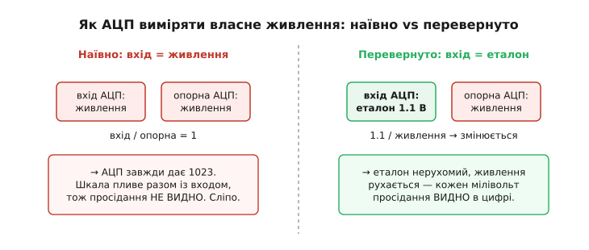
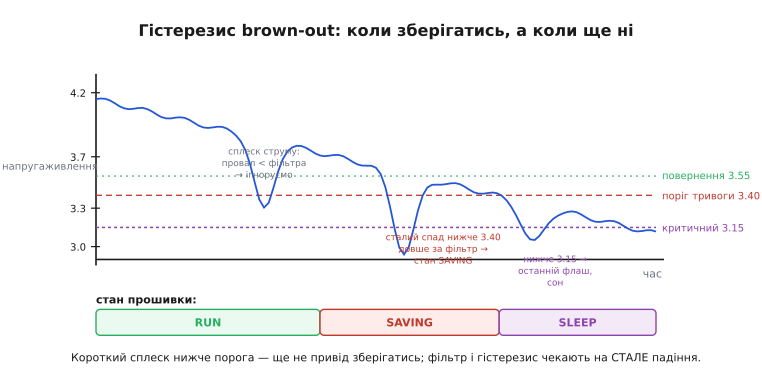
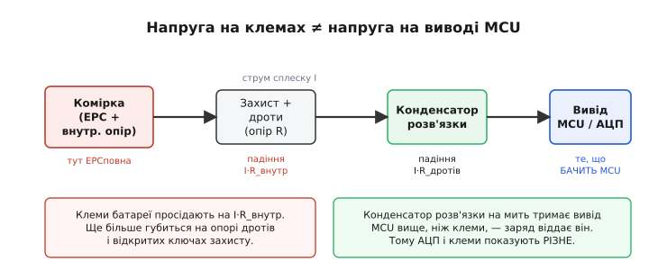

# ⚙️ Стеження за напругою батареї: гідне вимкнення до того, як згасне живлення

Уяви типовий провал у житті пристрою на батареї. Датчик тижнями пише вимірювання у флаш-пам'ять; батарея тихо сідає; аж якоїсь ночі, посеред запису чергового блоку, напруга падає нижче порога, контролер миттєво гасне — і прокидається вранці з **напівзаписаним сектором**, зіпсованою таблицею файлів, а часом і мертвою файловою системою. Дані за тиждень — коту під хвіст, і не тому, що бракувало заряду взагалі, а тому, що останні мілівольти витратилися на операцію, яку не можна було переривати.

Отже, задача цієї прошивки формулюється так: **контролер має сам стежити за напругою свого живлення й, помітивши, що батарея сідає, встигнути гідно завершити роботу — дописати те, що в буфері, закрити файли, оновити лічильники — поки живлення ще є**. Не «якось реагувати», а зробити це надійно: не панікувати від кожного сплеску струму, не гальмувати роботу зайвими вимірами, і в критичний момент виконати рівно ту послідовність, яка лишить пам'ять у цілісному стані.

Розберімо це від першопричини: як контролер узагалі бачить власну напругу, як відрізнити справжнє падіння від шуму, що саме й у якому порядку зберігати, — і поверх усього накрутимо просту **кулонометрію** (лат. *coulomb* — на честь Шарля Кулона; метрія — вимірювання), лічбу спожитих мА·год, щоб знати запас іще до того, як напруга почне провалюватися.

> 🔧 **Навіщо це.** Апаратний захист від глибокого розряду (мікросхема захисту в акумуляторі) рятує **батарею** — рве коло, коли вже пізно. Він нічого не знає про твої файли. Гідне завершення — це суто **програмна** ланка, яка спрацьовує **раніше** за апаратну відсічку й рятує **дані та стан пристрою**. Ці дві ланки не замінюють одна одну: одна береже хімію комірки, друга — цілісність того, що контролер устиг записати.

## Як контролер бачить власну напругу

Перша, зовсім не очевидна перешкода: **аналого-цифровий перетворювач вимірює не напругу, а відношення**. АЦП завжди відповідає на питання «яку частку від опорної напруги (англ. *reference*) становить вхід?» — і видає число від 0 до максимуму шкали. Для 10-бітного АЦП максимум — 1023, для 12-бітного — 4095. Формула перетворення проста:

```
результат = вхід / U_опорна × (2ᴺ − 1)
```

де N — розрядність. Наче все ясно: подай напругу батареї на аналоговий вхід, прочитай — і маєш вольти. Але тут криється пастка, на якій горять новачки.

**Наївний спосіб і чому він не працює.** Найпряміша думка — завести живлення (чи його поділену дільником частину) на аналоговий вхід і взяти опорною напругою саме живлення (так налаштований АЦП за замовчуванням у більшості дрібних контролерів). Що станеться? Вхід дорівнює опорній — отже, відношення завжди рівно одиниця, і АЦП завжди повертає 1023. Скільки б не сіла батарея, результат не змінюється, бо шкала «пливе» разом із вимірюваним. Це те саме, що міряти зріст лінійкою, яка розтягується й стискається пропорційно до людини: усі виходять «одного зросту з лінійкою».

**Правильна ідея — фокус із перевертанням.** Раз опорна напруга сама пливе з живленням, треба **щось стале, з чим порівнювати**. І таке стале є прямо всередині чипа — **внутрішнє опорне джерело** (bandgap, від англ. *band gap* — ширина забороненої зони напівпровідника; на ній ґрунтується схема, що дає майже незалежну від температури й живлення напругу, зазвичай близько 1.1–1.25 В). Ключовий хід: вимірюємо не батарею відносно живлення, а **внутрішній еталон відносно живлення**. Тоді АЦП каже, яку частку від живлення становить відомий 1.1-вольтовий еталон — а звідси живлення обчислюється в лоб.

> Внутрішнє опорне джерело (bandgap) — це маленька схема, що видає напругу, майже не залежну ні від живлення, ні від температури, спираючись на фізику p-n-переходу. Її роль тут — бути «нерухомою міткою», відносно якої видно рух живлення. Точність її сирого значення посередня (одиниці відсотків), тож для акуратного виміру її калібрують. Докладніше — [джерело опорної напруги](topic:hw-sensing/voltage-reference).

Перевернімо формулу. АЦП міряє еталон U_bg, а опорною є живлення U_живл:

```
результат = U_bg / U_живл × (2ᴺ − 1)
```

Розв'язуємо відносно живлення — того, що нам треба:

```
U_живл = U_bg × (2ᴺ − 1) / результат
```

Тепер шкала стоїть на місці (еталон), а рухається вхід (живлення) — і кожен мілівольт просідання видно в цифрі. Оце і є весь фокус: **щоб виміряти власне живлення, контролер міряє свій незмінний внутрішній еталон, а живлення обчислює зворотним відношенням**. Жодного зовнішнього дротика, жодного дільника — усе всередині чипа.



*Чому наївний вимір сліпий, а перевернутий — бачить. Якщо опорна напруга АЦП сама пливе з живленням, будь-який «вимір живлення» дає сталу цифру (завжди 1023). Треба нерухома мітка: внутрішній bandgap-еталон вимірюють відносно живлення, і тоді просідання шини видно як зміну відношення.*

### Той самий фокус, дві реалізації

Родини контролерів роблять цей трюк трохи по-різному — варто знати обидва канонічні способи, бо на них написана більшість реальної прошивки.

**AVR (класичні ATmega/ATtiny): міряємо bandgap, опорна — живлення.** Тут внутрішній еталон номінально 1.1 В, і його заводять на вхід АЦП як «канал», тоді як опорною лишається живлення (AVcc). Прочитавши результат, обчислюємо живлення просто за формулою вище. Число 1.1 В — усталене й задокументоване виробником (специфікація дає розкид 1.0–1.2 В за 25 °C), тож для грубого brown-out його беруть як є, а для точності — калібрують один раз проти виміряного вольтметром живлення.

```c
#include <avr/io.h>
#include <util/delay.h>

// Прочитати живлення (Vcc) у мілівольтах через внутрішній bandgap 1.1 В.
// Опорна АЦП = живлення (AVcc), канал = внутрішнє опорне (1.1 В).
uint16_t read_vcc_mv(void) {
    // REFS0 → опорна = AVcc; MUX3..0 = 1110 → канал внутрішнього 1.1 В
    ADMUX = _BV(REFS0) | _BV(MUX3) | _BV(MUX2) | _BV(MUX1);

    _delay_us(500);              // bandgap і вхід АЦП мають устоятися (старт ~70 мкс + запас)

    ADCSRA |= _BV(ADSC);         // запустити одне перетворення
    while (ADCSRA & _BV(ADSC));  // чекати завершення

    uint16_t adc = ADC;          // 0..1023
    if (adc == 0) return 0;      // захист від ділення на нуль

    // Vcc = U_bg × 1023 / результат.  1100 мВ × 1023 = 1 125 300 (сталу згорнули).
    // 1125300 = 1.1 В × 1023 × 1000 (щоб дістати мілівольти).
    return (uint16_t)(1125300UL / adc);
}
```

Зверни увагу на дві дрібниці, що коштують багатьом годин налагодження. По-перше, **затримка після перемикання каналу** обов'язкова: bandgap стартує не миттєво (десятки мікросекунд), і без паузи перше перетворення бреше. По-друге, стала `1125300` — це `1.1 × 1023 × 1000`, згорнута заздалегідь, щоб не тягати дробові множення в контролер без співпроцесора з рухомою комою: **цілочисельна арифметика замість float** — окрема важлива звичка прошивки, до якої повернемося.

**STM32 (та більшість сучасних Cortex-M): міряємо VREFINT, а виробник уже поклав калібрування у чип.** Тут ідея та сама, але акуратніша. Внутрішній еталон зветься VREFINT, і — ключова відмінність — на заводі кожен окремий чип виміряли й записали в системну пам'ять «сире» значення АЦП для цього еталона, зняте за строго відомих умов: живлення рівно 3.3 В, температура близько 30 °C. Ця стала зветься VREFINT_CAL. Маючи її, живлення обчислюють без жодного припущення про «номінальні 1.1 В»:

```
U_живл = 3.3 В × VREFINT_CAL / результат_VREFINT
```

Логіка проста: якщо за живлення 3.3 В еталон дав відлік VREFINT_CAL, а зараз той самий еталон дає менший відлік — значить, живлення піднялося (шкала розтяглася), більший — живлення сіло. Оскільки калібрування зняте персонально для цього кристала, точність виходить куди краща за AVR-варіант «з номіналу».

```c
#include "stm32l0xx.h"   // приклад для родини STM32L0; регістри аналогічні в інших

// Адреса заводського калібрування VREFINT (див. довідник конкретного чипа).
// Значення знято за Vdd = 3.300 В, T ≈ 30 °C.
#define VREFINT_CAL   (*(volatile uint16_t *)0x1FF80078U)
#define VREFINT_CAL_VDD_MV   3300U

// Прочитати живлення (Vdda) у мілівольтах через заводськи калібрований VREFINT.
uint16_t read_vdda_mv(uint16_t vrefint_raw) {
    if (vrefint_raw == 0) return 0;
    // Vdda = 3300 мВ × VREFINT_CAL / поточний_відлік
    return (uint16_t)((uint32_t)VREFINT_CAL_VDD_MV * VREFINT_CAL / vrefint_raw);
}
```

Тут `vrefint_raw` — свіжий відлік каналу VREFINT (його треба ввімкнути в АЦП і теж дати устоятися). Множення `3300 × VREFINT_CAL` не влізає в 16 біт, тож проміжок беремо 32-бітним (`uint32_t`) — типова пастка переповнення, про яку легко забути.

> 🔧 **Навіщо це.** Якщо контролер живиться **прямо від батареї** (типово для дрібних датчиків без окремого регулятора), то виміряне «живлення» **і є напруга батареї** — стеження за brown-out і оцінка розряду зливаються в один вимір. Якщо ж між батареєю і контролером стоїть регулятор, то цей метод бачить **уже стабілізовану шину** (3.3 В), яка тримається рівно, поки регулятор має запас, — тоді brown-out ловиться в момент, коли **вхід регулятора** просів так, що той уже не витягує вихід. Обидва випадки корисні, але означають різне: у першому ти міряєш саму батарею, у другому — «здоров'я» шини за регулятором.

## Шум — головний ворог порога

Тепер, коли контролер уміє читати живлення, з'являється підступніша проблема, ніж сам вимір. Живлення пристрою на батареї — **брудна, тремтлива величина**, а не рівна лінія. Кожен вимір АЦП несе шум: теплові флуктуації, наведення від цифрової частини, а найгірше — **просадки від власного споживання**. Увімкнув передавач, крутнув мотор, спалахнув світлодіодом — і напруга на клемах на мілісекунди провалюється, бо в комірки є внутрішній опір, а струм стрибнув.

Про фізику цієї просадки — окрема тема: [просідання напруги батареї під навантаженням](topic:hw-power/battery-sag) пояснює, чому саме внутрішній опір комірки перетворює сплеск струму на провал напруги й наскільки глибокий цей провал у зношеній батареї.

Чому це вбиває наївний детектор? Уяви поріг «нижче 3.30 В — рятуйся». Пристрій із повною батареєю (3.9 В) вмикає радіо, напруга на мілісекунду провалюється до 3.25 В — і детектор верещить «批арея сідає, зберігай усе й засинай!», хоча заряду ще на місяці. Пристрій то починає завершення, то скасовує його, смикається туди-сюди — класичне **тремтіння (англ. *chattering*)** навколо порога. У найгіршому разі він зберігається й засинає з майже повною батареєю через один сплеск струму. Один поріг, зчитаний із сирого шумного виміру, — це детектор, що бреше в обидва боки.

Ліки дві, і працюють вони разом.

**Перше — згладити вимір.** Замість того щоб вірити одному відліку, беруть кілька й **фільтрують**. Найпростіше — усереднити, але середнє легко зіпсувати одним диким викидом (той самий сплеск струму дасть різко занижений відлік, і середнє «поповзе»). Надійніше — **медіана** (лат. *medianus* — серединний): узяти, скажімо, п'ять відліків, відсортувати й узяти середній. Медіана **пропускає повз вуха поодинокі викиди** — один аномально низький відлік просто відсунеться в кінець і не потрапить у середину. Саме те, що треба проти коротких просадок.

:::tabs
```cpp
// Медіана з 5 відліків: стійка до поодиноких викидів (просадок від сплесків струму).
static uint16_t median5(uint16_t *a) {
    // Проста сортувальна вставка — для 5 елементів швидша й коротша за будь-що інше.
    for (uint8_t i = 1; i < 5; i++) {
        uint16_t key = a[i];
        int8_t j = i - 1;
        while (j >= 0 && a[j] > key) { a[j + 1] = a[j]; j--; }
        a[j + 1] = key;
    }
    return a[2];   // середній елемент відсортованого масиву з 5
}

uint16_t read_vcc_filtered_mv(void) {
    uint16_t s[5];
    for (uint8_t i = 0; i < 5; i++) s[i] = read_vcc_mv();
    return median5(s);
}
```
```python
# Медіана з 5 відліків: стійка до поодиноких викидів (просадок від сплесків струму).
def median5(a):
    # Проста сортувальна вставка — для 5 елементів швидша й коротша за будь-що інше.
    for i in range(1, 5):
        key = a[i]
        j = i - 1
        while j >= 0 and a[j] > key:
            a[j + 1] = a[j]
            j -= 1
        a[j + 1] = key
    return a[2]   # середній елемент відсортованого масиву з 5


def read_vcc_filtered_mv():
    s = [read_vcc_mv() for _ in range(5)]
    return median5(s)
```
:::

**Друге — гістерезис (гр. hystéresis — відставання, запізнення): два різні пороги замість одного.** Це головна ідея, і вона проста до неможливості. Один поріг тремтить тому, що межа «спрацювати» й межа «відпустити» — та сама точка; варто виміру трохи поколивати навколо неї, як реакція торохтить. Розведімо ці межі: **спрацьовуємо на нижчому порозі, а повертаємось у норму лише на помітно вищому**. Тоді між ними — «мертва зона», у якій стан не міняється, і дрібне тремтіння в неї просто не дотягується.

Той самий принцип «дві межі проти торохтіння» лежить в основі надійного зчитування кнопок — [усунення брязку контактів](topic:hw-digital/contact-debounce); там механічний контакт стрибає між замкнутим і розімкнутим, тут напруга стрибає навколо порога, а ліки однакові.

Для brown-out розумно мати **два пороги** різного призначення, а не просто гістерезис навколо одного:

- **Поріг тривоги** (скажімо, 3.40 В): «батарея явно сідає, час згортатися — дописати буфери, закрити файли, перейти в економний режим». Ще не аварія, але вже готуємось.
- **Критичний поріг** (скажімо, 3.15 В): «часу майже нема — зроби останній обов'язковий флаш і засинай/вимикайся негайно».
- **Поріг повернення** (скажімо, 3.55 В): у нормальний режим повертаємось лише коли напруга впевнено вища за тривогу — це і є гістерезис, що не дає торохтіти на межі 3.40.

І — критично важливо — реагуємо не на **миттєве** перетинання, а на **стале**: напруга має протриматися нижче порога кілька вимірів поспіль (наприклад, три виміри по 100 мс = 300 мс), перш ніж ми повіримо, що це справжнє падіння, а не черговий сплеск. Це **лічильник підтвердження** — часовий гістерезис на додачу до амплітудного.



*Чому потрібні і фільтр, і два пороги, і підтвердження часом. Повільний розряд опускає напругу по-справжньому, але поверх нього — короткі глибокі просадки від сплесків струму. Наївний поріг спрацював би на кожній із них. Фільтр (медіана) гасить поодинокі викиди, лічильник підтвердження вимагає сталого падіння, а два рознесені пороги (тривога 3.40 і критичний 3.15) дають гладкий перехід RUN → SAVING → SLEEP без торохтіння.*

## Скінченний автомат гідного завершення

Складімо стеження в акуратний **скінченний автомат** (англ. *finite state machine* — машина зі скінченною кількістю станів), бо саме він робить поведінку передбачуваною: у кожен момент прошивка в одному з чітких станів, а переходи між ними — за виміряною напругою.

Три стани якраз відповідають трьом порогам:

- **RUN** — нормальна робота. Пристрій робить своє: міряє, пише у буфер, час від часу скидає у флаш. Живлення здорове.
- **SAVING** — тривога. Напруга стало нижче 3.40 В. Пристрій **згортається**: дописує все, що в буфері, закриває файли, вимикає зайве споживання (радіо, підсвітку, датчики), готується або чекати підзарядки, або йти в сон. Якщо напруга відновилася вище 3.55 В — повертаємось у RUN.
- **CRITICAL/SLEEP** — напруга нижче 3.15 В. Часу немає: останній обов'язковий флаш найважливішого, оновлення лічильника заряду в незалежну пам'ять — і глибокий сон або вимкнення, поки апаратний захист сам не відітне комірку.

Ось кістяк такого автомата — цілком робочий цикл прошивки:

:::tabs
```cpp
typedef enum { ST_RUN, ST_SAVING, ST_SLEEP } power_state_t;

// Пороги в мілівольтах (для випадку «контролер живиться прямо від Li-ion»).
#define V_WARN_MV      3400U   // нижче — тривога (починаємо згортатися)
#define V_CRIT_MV      3150U   // нижче — критично (останній флаш і сон)
#define V_RESUME_MV    3550U   // вище — назад у норму (гістерезис проти торохтіння)
#define CONFIRM_N      3U      // стільки вимірів поспіль має підтвердити падіння

static power_state_t state = ST_RUN;
static uint8_t low_count = 0;   // лічильник підтвердження «стало низько»

void power_fsm_tick(void) {
    uint16_t v = read_vcc_filtered_mv();   // згладжений вимір, мВ

    switch (state) {
    case ST_RUN:
        if (v < V_WARN_MV) {
            if (++low_count >= CONFIRM_N) {   // не сплеск, а стале падіння
                begin_graceful_save();        // почати згортання (див. нижче)
                state = ST_SAVING;
                low_count = 0;
            }
        } else {
            low_count = 0;                    // напруга ще здорова — скидаємо лічильник
        }
        break;

    case ST_SAVING:
        if (v < V_CRIT_MV) {
            final_flush_and_park();           // останній обов'язковий флаш
            enter_deep_sleep();               // або вимкнення живлення
            state = ST_SLEEP;
        } else if (v > V_RESUME_MV) {
            resume_normal_operation();        // батарея відновилась (напр., підзарядка)
            state = ST_RUN;
        }
        // між V_CRIT і V_RESUME лишаємось у SAVING — та сама «мертва зона»
        break;

    case ST_SLEEP:
        // Прокидаємось лише за зовнішньою подією (підзарядка/скид).
        if (v > V_RESUME_MV) { resume_normal_operation(); state = ST_RUN; }
        break;
    }
}
```
```python
from enum import Enum

class PowerState(Enum):
    RUN = 0
    SAVING = 1
    SLEEP = 2

# Пороги в мілівольтах (для випадку «контролер живиться прямо від Li-ion»).
V_WARN_MV   = 3400   # нижче — тривога (починаємо згортатися)
V_CRIT_MV   = 3150   # нижче — критично (останній флаш і сон)
V_RESUME_MV = 3550   # вище — назад у норму (гістерезис проти торохтіння)
CONFIRM_N   = 3      # стільки вимірів поспіль має підтвердити падіння

state = PowerState.RUN
low_count = 0        # лічильник підтвердження «стало низько»

def power_fsm_tick():
    global state, low_count
    v = read_vcc_filtered_mv()   # згладжений вимір, мВ

    if state is PowerState.RUN:
        if v < V_WARN_MV:
            low_count += 1
            if low_count >= CONFIRM_N:   # не сплеск, а стале падіння
                begin_graceful_save()    # почати згортання (див. нижче)
                state = PowerState.SAVING
                low_count = 0
        else:
            low_count = 0                 # напруга ще здорова — скидаємо лічильник

    elif state is PowerState.SAVING:
        if v < V_CRIT_MV:
            final_flush_and_park()        # останній обов'язковий флаш
            enter_deep_sleep()            # або вимкнення живлення
            state = PowerState.SLEEP
        elif v > V_RESUME_MV:
            resume_normal_operation()     # батарея відновилась (напр., підзарядка)
            state = PowerState.RUN
        # між V_CRIT і V_RESUME лишаємось у SAVING — та сама «мертва зона»

    elif state is PowerState.SLEEP:
        # Прокидаємось лише за зовнішньою подією (підзарядка/скид).
        if v > V_RESUME_MV:
            resume_normal_operation()
            state = PowerState.RUN
```
:::

Зверни увагу, як гістерезис вбудований у переходи: з RUN виходимо на 3.40 В, а повертаємось лише на 3.55 В — між ними стан «липкий». Лічильник `low_count` додає часовий фільтр: три підтвердження поспіль, інакше не віримо. Це і є той автомат, що не смикається від сплесків, але надійно ловить справжній розряд.

> Такий підхід — окремі стани й переходи за подіями — це не примха, а стандартний спосіб будувати надійну прошивку. Один цикл, один вимір, один явний перехід — і поведінку легко і прогнозувати, і налагоджувати. Докладніше про цей стиль — [скінченні автомати у прошивці](topic:sf-apps/state-machine-embedded).

### Що саме означає «гідно завершити»

Найважливіша й найтонша частина — **порядок дій усередині завершення**. Тут легко написати код, який «начебто зберігає», але лишає пам'ять у гіршому стані, ніж якби нічого не робив. Правило одне: **послідовність має бути такою, щоб обрив живлення на будь-якому її кроці лишав дані цілісними**.

Розгляньмо типове згортання датчика, що пише лог у флаш-файлову систему:

```c
// Почати згортання: викликається один раз при вході в SAVING.
void begin_graceful_save(void) {
    radio_power_off();          // 1. прибрати найбільшого пожирача струму —
                                //    менше просадка, більше часу на решту
    stop_sampling();            // 2. припинити набирати нові дані в буфер

    log_flush_buffer();         // 3. дописати те, що вже в RAM-буфері, у флаш
    fs_sync();                  // 4. скинути метадані ФС (таблицю, довжини) на носій
    log_file_close();           // 5. коректно закрити файл (запис довжини, контрольної суми)

    coulomb_save_to_nvram();    // 6. зберегти лічильник спожитих мА·год у незалежну пам'ять
}
```

Чому саме такий порядок? **Спершу глушимо найбільше споживання** (радіо) — це не про дані, а про час: прибравши сплески струму, ми піднімаємо напругу й даємо собі більше мілісекунд на решту кроків, поки не спрацював критичний поріг. Далі **зупиняємо приплив нових даних**, щоб буфер не поповнювався, поки ми його скидаємо. Тоді **дописуємо буфер**, **синхронізуємо метадані** файлової системи (без цього файл на носії може лишитися з правильними даними, але неправильною довжиною — і при наступному монтуванні виглядатиме побитим), **коректно закриваємо файл** і, нарешті, **зберігаємо лічильник заряду**.

Порядок кроків 3–5 не випадковий: спершу дані, потім метадані, що на них указують. Якщо живлення обірветься **між** кроками, найгірше, що станеться, — втратимо кілька останніх вимірів, але **файлова система лишиться монтованою й цілісною**. Це і є суть «гідного» завершення: не «зберегти все за будь-яку ціну», а «на кожному кроці бути в стані, який переживе раптовий обрив».

Про те, чому саме порядок «дані → метадані» рятує файлову систему від напівзаписаного стану й що таке журналювання, — [файлові системи на флеші](topic:sf-data/flash-filesystem). А про фізичне обмеження, що ховається під усім цим — флеш можна перезаписувати лише скінченну кількість разів, тож зловживати частими флашами не можна, — [вирівнювання зношування флешу](topic:hw-components/flash-wear-leveling).

> 🔧 **Навіщо це.** Ключова помилка новачка — «на brown-out запишу все й перезавантажусь». Але запис у флеш **сам споживає підвищений струм і час**, а напруга вже низька — легко не встигнути й обірватися на середині запису, зробивши тільки гірше. Тому гідне завершення завжди йде **від найдешевшого і найважливішого до дорожчого**: спершу скинь навантаження, потім рятуй критичне малими порціями, і ніколи не починай довгу операцію (стирання великого блоку флешу), якщо напруга вже за критичним порогом — на неї може не вистачити заряду.

### Скільки часу лишається після тривоги

Резонне питання: а чи взагалі встигне контролер зробити все це між тривогою і повним згасанням? Відповідь дає **конденсатор розв'язки** (англ. *decoupling capacitor*) на живленні контролера — той самий, що фільтрує шум, підробляє тут другу службу: він **запас енергії на останні мілісекунди**. Коли зовнішнє живлення провалюється, цей конденсатор іще якийсь час тримає напругу на виводі MCU, розряджаючись у нього.

Скільки саме часу? З визначення ємності, час утримання напруги над потрібним рівнем:

```
Δt = C × ΔU / I
```

де C — ємність конденсатора, ΔU — на скільки напрузі дозволено просісти (від порога тривоги до мінімуму роботи MCU), I — струм споживання під час завершення.

**Приклад — чи вистачить конденсатора на закриття файлів.** Конденсатор розв'язки 100 мкФ, від тривоги маємо запас ΔU = 0.3 В (з 3.40 до мінімальних 3.10 В), контролер під час запису бере 10 мА.

```
Δt = C × ΔU / I
Δt = 100·10⁻⁶ Ф × 0.3 В / 0.010 А
Δt = 30·10⁻⁶ / 0.010 = 0.003 с = 3 мс
```

Три мілісекунди — і це якщо зовнішнє живлення **зникло геть**. Для короткого запису одного сектора може вистачити, для стирання великого блоку — точно ні. Ось чому [конденсатор розв'язки](topic:hw-components/decoupling) біля контролера не розкіш: він і фільтрує шум у нормі, і купує ці дорогоцінні мілісекунди в аварії. А ще саме він створює одну з головних пасток вимірювання, до якої ми зараз дійдемо.

Висновок практичний: **не покладайся на конденсатор як на основне джерело часу**. Він дає крихти на найостанніший, найкоротший флаш. Основний запас часу дає **завчасність тривоги** — поріг 3.40 В спрацьовує задовго до того, як живлення реально зникне, лишаючи цілі секунди на впорядковане згортання, поки батарея ще тягне. Конденсатор — лише страховка на самий фінал.

## Кулонометрія: лічити заряд, а не вгадувати за напругою

Досі ми ловили момент, коли батарея **вже** сідає. Але напруга — кепський вимірювач того, **скільки заряду лишилось**: у літій-іонної комірки крива розряду майже пласка в середині (від ~90% до ~20% ємності напруга ледь повзе), тож за напругою «скільки відсотків лишилось» майже не вгадаєш — вона стрімко падає лише в самому кінці, коли рятуватись уже пізно.

Про те, чому напруга — ненадійна лінійка заряду і які взагалі є способи оцінити залишок, — [оцінка стану заряду (SoC)](topic:hw-power/state-of-charge). А що криву розряду можна знімати, зберігати й потім по ній перекладати напругу в заряд — робить спеціалізована мікросхема-лічильник, [паливний лічильник (fuel gauge)](topic:hw-power/fuel-gauge); наша ж задача — зробити грубий, але корисний еквівалент **самою прошивкою**.

Ідея кулонометрії пряма, як закон збереження: **скільки заряду з комірки витекло, стільки з рахунку й списуємо**. Заряд — це струм, помножений на час (кулон = ампер × секунда). Якщо періодично міряти струм споживання й множити на проміжок часу, накопичена сума — це витрачений заряд:

```
ΔQ = I × Δt         (заряд, що витік за проміжок Δt)
Q_витрачено = Σ (Iᵢ × Δtᵢ)   (сума по всіх проміжках)
```

Зазвичай заряд рахують у **мА·год** (міліампер-годинах) — тих самих одиницях, що пишуть на батареї (наприклад, «2000 мА·год»). Тоді залишок — це початкова ємність мінус накопичена сума. Ось лічильник, що тикається за таймером:

:::tabs
```cpp
// Груба кулонометрія: накопичуємо витрачений заряд у мікроампер-секундах,
// щоб не втрачати точність на малих струмах, і переводимо в мА·год за запитом.

static uint64_t spent_uas = 0;         // витрачено, мкА·с (мікроампер-секунди)
#define BATTERY_CAPACITY_MAH   2000U   // паспортна ємність комірки

// Викликається періодично (напр., раз на секунду) з поточним струмом у мкА.
void coulomb_tick(uint32_t current_ua, uint32_t dt_ms) {
    // ΔQ [мкА·с] = струм [мкА] × час [с] = current_ua × dt_ms / 1000
    spent_uas += (uint64_t)current_ua * dt_ms / 1000U;
}

// Скільки мА·год лишилось (0, якщо перебрали).
uint16_t coulomb_remaining_mah(void) {
    // 1 мА·год = 1000 мкА × 3600 с = 3 600 000 мкА·с
    uint32_t spent_mah = (uint32_t)(spent_uas / 3600000ULL);
    if (spent_mah >= BATTERY_CAPACITY_MAH) return 0;
    return (uint16_t)(BATTERY_CAPACITY_MAH - spent_mah);
}
```
```python
# Груба кулонометрія: накопичуємо витрачений заряд у мікроампер-секундах,
# щоб не втрачати точність на малих струмах, і переводимо в мА·год за запитом.

spent_uas = 0                    # витрачено, мкА·с (мікроампер-секунди)
BATTERY_CAPACITY_MAH = 2000      # паспортна ємність комірки

# Викликається періодично (напр., раз на секунду) з поточним струмом у мкА.
def coulomb_tick(current_ua, dt_ms):
    global spent_uas
    # ΔQ [мкА·с] = струм [мкА] × час [с] = current_ua × dt_ms / 1000
    spent_uas += current_ua * dt_ms // 1000

# Скільки мА·год лишилось (0, якщо перебрали).
def coulomb_remaining_mah():
    # 1 мА·год = 1000 мкА × 3600 с = 3 600 000 мкА·с
    spent_mah = spent_uas // 3600000
    if spent_mah >= BATTERY_CAPACITY_MAH:
        return 0
    return BATTERY_CAPACITY_MAH - spent_mah
```
:::

Звідки береться `current_ua` — поточний струм? Три шляхи, від простого до точного. **Найпростіший**: у пристрої з відомими режимами струм для кожного режиму заміряний наперед (сон — 5 мкА, вимір — 3 мА, радіо — 40 мА), і кулонометр просто підсумовує «стільки-то секунд у такому режимі». Грубо, але для передбачуваного датчика працює на диво добре. **Точніший**: увімкнути [вимірювальний резистор (шунт)](topic:hw-components/shunt-resistor) у коло живлення й міряти падіння на ньому тим самим АЦП — реальний струм у кожну мить. **Найточніший**: віддати цю роботу спеціальній мікросхемі-лічильнику, що інтегрує струм апаратно.

І тут — головна причина, чому кулонометрію все одно доводиться час від часу **підправляти за напругою**: помилка вимірювання струму **накопичується**. Кожен вимір трохи бреше (шум, зсув нуля АЦП), і ці дрібні похибки, підсумовуючись годинами, поволі відводять лічильник від правди — «дрейф» (англ. *drift*). Тому в реальних пристроях кулонометр раз-по-раз калібрують за реперними точками, де напруга таки інформативна: **повний заряд** (напруга уперлася в 4.2 В — обнуляємо «витрачено») і **край розряду** (напруга круто пішла вниз під 3.0 В — знаємо, що майже порожньо). Кулонометрія дає гладку оцінку між цими точками, а напруга не дає їй збитися надовго.

> 🔧 **Навіщо це.** Кулонометр і brown-out-детектор — дві половини одного стеження, що доповнюють одна одну. Кулонометр каже «в тебе лишилось ~15% заряду» **завчасно й гладко**, поки напруга ще нічого не виказує, — це дає час підготуватися (попередити користувача, знизити активність). Brown-out-детектор ловить **сам момент** критичного падіння точно, коли завчасну оцінку вже пізно уточнювати. Разом: кулонометр планує, детектор рятує. І обидва зберігай у **незалежну пам'ять** (EEPROM/флеш) при кожному згортанні — інакше після перезавантаження лічильник спожитого обнулиться й почне брехати з чистого аркуша.

## Складність і пастки

Тепер найцінніше — граблі, на які наступають навіть ті, хто все зробив «за підручником». Кожна з них тихо руйнує надійність, і кожна має конкретний механізм.

**Пастка 1: клеми батареї — це не вхід MCU.** Найпідступніше непорозуміння. Ти міряєш живлення на виводі контролера й думаєш, що бачиш напругу батареї, — а це різні речі, іноді дуже різні. Між клемами комірки й виводом MCU лежать: внутрішній опір комірки, опір дротів і доріжок, падіння на відкритих ключах мікросхеми захисту, іноді дільник. Коли пристрій смикає струм, на всіх цих опорах падає напруга (I·R), тож **на клемах напруга одна, а на виводі MCU — нижча**. Ба більше — конденсатор розв'язки на виводі MCU **на мить тримає його вище**, ніж клеми, віддаючи власний заряд під час сплеску. Тому АЦП контролера й вольтметр на клемах у той самий момент показують **різне**, і це не помилка вимірювання, а фізика.



*Чому напруга «батареї» залежить від того, де міряти. Струм сплеску тече крізь внутрішній опір комірки, дроти й ключі захисту, і на кожному падає своя частка (I·R). Вивід MCU бачить те, що лишилось, — та ще й конденсатор розв'язки короткочасно підпирає його власним зарядом. Тому «напруга на клемах» і «напруга, яку читає АЦП» — це дві різні величини, надто під навантаженням.*

Що з цим робити? По-перше, **усвідомити, яку саме точку ти міряєш** — майже завжди це вивід MCU (бо саме звідти живиться АЦП), а не клеми, тож і пороги став для цієї точки. По-друге, **міряти в спокої**: якщо перед виміром напруги на секунду приглушити велике навантаження (радіо), просадка I·R зникне й вимір відбиватиме справжній стан батареї, а не миттєвий сплеск. Багато пристроїв так і роблять — беруть «чесний» вимір батареї в тихі проміжки між сплесками.

**Пастка 2: шум АЦП саме тоді, коли він критичний.** Прикра іронія: АЦП шумить найдужче тоді, коли важливо не помилитися, — під навантаженням. Цифрова частина перемикається, регулятор чи ключі створюють наведення, і сирий відлік стрибає на десятки мілівольт. Якщо взяти вимір **під час** сплеску струму, він буде і занижений (реальна просадка), і зашумлений (наведення) водночас. Ліки ми вже заклали — медіана й підтвердження часом, — але є ще один шар: точність самого еталона.

Сире значення внутрішнього bandgap на AVR розкидане (1.0–1.2 В — це похибка близько ±9%!), тож і вимір живлення без калібрування має таку саму похибку. Для грубого brown-out це стерпно (поріг однаково з запасом), але якщо треба точніше — **калібруй еталон один раз**: заміряй живлення точним вольтметром, прочитай сирий відлік, обчисли справжнє U_bg для цього чипа й зашивай його замість номіналу. STM32-варіант це вже має «з коробки» (заводський VREFINT_CAL), тому там точність краща без зусиль. Про самий цей шум еталона й способи з ним боротися — [шум опорної напруги АЦП](topic:hw-sensing/adc-vref-noise).

**Пастка 3: реакція на просадку від сплеску замість справжнього розряду.** Це узагальнення перших двох, але варте окремого слова, бо саме воно найчастіше псує поведінку. Пристрій із доброю батареєю вмикає щось потужне, напруга провалюється на мілісекунди, детектор без фільтра приймає це за розряд і починає завершення — або й засинає з майже повною батареєю. Механізм завжди той самий: **короткий провал від струму сплутано зі сталим падінням від розряду**. Захист теж завжди той самий і трирівневий: (1) **фільтр** гасить поодинокі викиди, (2) **лічильник підтвердження** вимагає, щоб падіння протрималося довше за будь-який реальний сплеск, (3) **вимір у спокої** взагалі прибирає сплеск із картини, міряючи батарею між навантаженнями. Разом ці три правила відрізняють «на мить просіло, бо ввімкнули радіо» від «поволі сідає вже пів години».

**Пастка 4: цілочисельна арифметика й переповнення.** Дрібніша технічно, але кусюча. Дрібні контролери часто без співпроцесора з рухомою комою, тож обчислення в `float` — це і повільно, і роздуває код. Усе рахують у цілих: напругу — в мілівольтах, заряд — у мікроампер-секундах, як вище. Але ціле легко **переповнити**: `3300 × VREFINT_CAL` не влізає у 16 біт, `current_ua × dt_ms` за години не влізе у 32 біти. Правило: **прикидай найбільший можливий проміжок і бери тип із запасом** (32- чи 64-бітний там, де множиш великі числа), а сталі згортай наперед (`1.1 × 1023 × 1000 = 1125300`), щоб не тягати дроби в контролер. Одне пропущене розширення типу — і лічильник заряду мовчки обнулиться на переповненні посеред ночі.

**Пастка 5: читати живлення надто часто.** Спокуса міряти напругу в кожному циклі велика, але сам вимір **коштує струму й часу** (АЦП треба ввімкнути, дати устоятися еталону — сотні мікросекунд), а для пристрою, що бореться за кожен мікроампер у сплячці, це відчутно. Розумний ритм: у **RUN** міряти зрідка (раз на секунди), у **SAVING** — частіше (стан тривожний, хочемо швидко зловити критичний поріг), а прокидатися заради самого лише виміру напруги — якнайрідше. І неодмінно **вимикати АЦП між вимірами** (він у роботі тягне помітний струм), інакше найкраще стеження за батареєю саме ж її й посадить.

Складімо все в одну картину. Гідне вимкнення на brown-out — це маленька, але щільна система з кількох ланок, де кожна закриває конкретну діру. **Вимір** обертає безпорадне «АЦП бачить лише відношення» на робочий вольтметр власного живлення — через внутрішній еталон. **Фільтр і гістерезис** відрізняють справжній розряд від сплесків струму, щоб детектор не торохтів. **Скінченний автомат** робить реакцію передбачуваною: три стани, три пороги, чисті переходи. **Порядок згортання** гарантує, що обрив живлення на будь-якому кроці лишає пам'ять цілісною. А **кулонометрія** додає завчасності — гладку оцінку залишку, поки напруга ще мовчить. Витримай усі п'ять — і пристрій, у якого сідає батарея, завершить роботу так само гідно, як людина, що спокійно зберігає документ і вимикає комп'ютер, а не падає замертво посеред речення.
