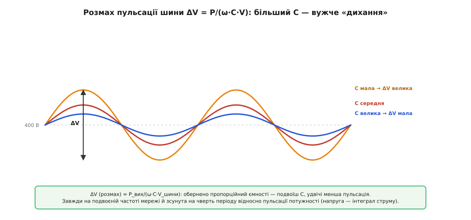

# 🧮 Еталон струму PFC і пульсація шини: два добутки, з яких усе випливає

Уся керуюча математика boost-PFC тримається на двох добутках, і обидва варто відчути до кісток. Перший — це **еталон струму**: контролер будує його як добуток форми випрямленої напруги на сигнал похибки напругової петлі, і саме тому струм виходить синусоїдним, а середня потужність — сталою. Другий добуток з'являється сам собою як наслідок: миттєва вхідна потужність — це напруга на струм, а коли обидва синусоїдні й у фазі, їхній добуток пульсує на **подвоєній частоті мережі**. Ці пульсації доводиться комусь ковтати, і той хтось — бульк-конденсатор. Розберімо обидва добутки від першопричини: спершу звідки береться еталон і чому він так добре працює, тоді як з нього народжується пульсація шини, і нарешті — як під цю пульсацію та під час утримання (англ. *hold-up time*) добирають ємність.

## Означення: що таке еталон струму

Контролер PFC не намагається задати струм навпростець. Він задає **завдання** — миттєве число, якому середній струм котушки має дорівнювати в кожну мить. Це завдання й звуть **еталоном струму** (англ. *current reference*), позначимо його i\*(t). Швидка струмова петля потім своєю справою жене реальний середній струм котушки ⟨i_L⟩ услід за цим i\*(t), підправляючи шпаруватість від такту до такту. Тобто вся «розумність» PFC зводиться до одного питання: **як обчислити i\*(t)** так, щоб струм вийшов синусоїдним, а шина не просіла.

Відповідь коротка: еталон — це добуток двох сигналів.

```
i*(t) = k_mult · v_форма(t) · v_помилка(t)
```

Розберімо кожен множник окремо, бо в кожному захований свій зміст.

**v_форма(t) — форма випрямленої напруги.** Це просто масштабована копія миттєвої напруги після діодного мосту. Якщо вхід мережі — синусоїда амплітудою V_пік, то після випрямлення маємо огинальну |V_пік·sin(ω·t)|, а v_форма — її зменшена подоба (контролер бачить її крізь дільник напруги). Головне тут: v_форма несе **обрис** — де зараз вершина, де перехід через нуль. Вона каже струмові, якої він має бути **форми й фази**, але нічого не каже про **величину**.

**v_помилка(t) — сигнал похибки напругової петлі.** Це вихід повільного регулятора, що стежить за напругою шини. Просіла шина нижче цілі — v_помилка росте (треба тягнути більше струму); піднялася вище — v_помилка падає. Цей сигнал майже сталий у межах періоду мережі (чому саме майже сталий — ключове питання, до нього повернемось), і несе він **масштаб**: скільки саме струму тягнути, тобто наскільки «голодне» навантаження.

**k_mult** — просто стала помножувача, що зводить розмірності докупи; на суть вона не впливає, тож далі носитимемо її як коефіцієнт.

> 🔧 **Навіщо це.** Цей добуток — буквально те, що робить кремнієвий помножувач усередині будь-якого класичного PFC-контролера (UC3854, L6562, NCP1653 і рідні їм). На платі це два входи: MULT (сюди йде дільник випрямленої напруги, форма) і вихід підсилювача похибки напруги (масштаб). Розумієте цей добуток — розумієте, чому ці два входи є й що станеться, якщо переплутати дільники: занизили форму — струм малий, шина просяде; зашумили похибку — струм спотвориться. Уся налагодка PFC крутиться навколо цих двох сигналів.

## Інтуїція: чому добуток форми на масштаб дає одразу і синусоїду, і сталу потужність

Тепер найважливіше — **чому** такий простий добуток розв'язує обидві задачі одразу. Задачі ж дві, і на перший погляд вони тягнуть у різні боки: (1) струм має бути синусоїдним — цього вимагає коефіцієнт потужності; (2) навантаження має отримувати **сталу** потужність — цього вимагає стабільна робота. Як один добуток задовольняє обидві?

Почнімо з форми струму. У межах одного періоду мережі v_помилка майже не міняється — назвімо її поки сталою E. Тоді

```
i*(t) = k_mult · v_форма(t) · E = (k_mult · E) · |V_пік · sin(ω·t)| / n_дільника
```

де n_дільника — коефіцієнт дільника напруги. Усе, що в дужках, — стале в межах періоду. Отже, форма i\*(t) — це **точна копія** форми |sin(ω·t)|, помножена на сталий множник. Струм повторює випрямлену синусоїду один-в-один. Це і є **емуляція опору** (англ. *resistor emulation*): струм пропорційний напрузі, а стала пропорційності — це не що інше, як **емульований опір**:

```
i_вх(t) = V_вх(t) / R_e        де R_e = n_дільника / (k_mult · E)
```

Погляньте на R_e уважно: у ньому немає нічого, крім сталих і E. Мережа бачить за вилкою чистий резистор R_e — саме тому коефіцієнт потужності підходить до одиниці й гармонік нема. А тепер найтонше: **величиною цього резистора керує напругова петля через E**. Просіла шина → E зросло → R_e **зменшився** → мережа бачить меншого опору резистор → з неї тече більший струм → більше потужності. Напругова петля буквально **крутить ручку емульованого опору**, підганяючи скільки енергії брати. Ось де зустрічаються дві задачі: форму дає множник v_форма, а величину R_e (а отже й потужність) — множник E.

> 🔧 **Навіщо це.** Поняття R_e — не абстракція, а робочий інструмент проєктувальника. Знаючи бажану вхідну потужність P і діюче значення напруги мережі V_rms, одразу маєте цільовий емульований опір R_e = V_rms²/P. Наприклад, блок на 300 Вт від мережі 230 В має вдавати резистор R_e = 230²/300 ≈ 176 Ом. Це негайно дає й пікові струми, і потрібний масштаб сигналів у контролері. Мислення «PFC = керований резистор R_e» рятує, коли треба швидко прикинути, чи не завеликий струм тягне ваша схема.

Тепер — чому потужність **у середньому** стала, хоч миттєво вона гуляє. Це вже другий добуток, і він заслуговує окремого розбору, бо саме з нього ростуть усі вимоги до конденсатора.

## Формальний апарат: миттєва потужність — це sin², і в ній сидить пульсація 2ω

Візьмімо миттєву вхідну потужність. За означенням це напруга помножена на струм:

```
p(t) = V_вх(t) · i_вх(t)
```

Ми щойно домоглися, що i_вх у фазі з V_вх і повторює її форму. Підставмо синусоїди (для чистоти беремо ідеальну емуляцію, амплітуда струму — I_пік):

```
p(t) = [V_пік · sin(ω·t)] · [I_пік · sin(ω·t)] = V_пік · I_пік · sin²(ω·t)
```

Ось він, другий добуток — **sin²**. І тут спрацьовує одна з найкорисніших тотожностей усієї силової електроніки. Квадрат синуса розкладається так:

```
sin²(ω·t) = ½ · [1 − cos(2·ω·t)]
```

Ця формула — не фокус, її легко відчути. Синус гуляє між −1 і +1, а його квадрат — між 0 і +1, тобто ніколи не буває від'ємним і має **удвічі частіші** горби (бо і при sin = +1, і при sin = −1 квадрат дорівнює 1). Значення, що завжди додатне й коливається вдвічі частіше навколо середини ½, — це рівно ½ мінус косинус подвоєної частоти, зменшений удвічі. Підставмо назад:

```
p(t) = V_пік · I_пік · ½ · [1 − cos(2·ω·t)]
     = (V_пік · I_пік)/2  −  (V_пік · I_пік)/2 · cos(2·ω·t)
       └────────┬────────┘   └───────────────┬──────────────┘
         СТАЛА складова          пульсація на ПОДВОЄНІЙ частоті
```

Розклад промовляє сам. Миттєва вхідна потужність — це **сталий рівень плюс косинусна хвиля подвоєної частоти**. Погляньмо на обидві частини.

**Сталий рівень (V_пік·I_пік)/2** — це і є **середня** потужність, яку схема віддає навантаженню. Перепишімо її через діючі (RMS) значення, бо V_пік = V_rms·√2 та I_пік = I_rms·√2:

```
P_сер = (V_пік · I_пік)/2 = (V_rms·√2 · I_rms·√2)/2 = V_rms · I_rms
```

Виходить знайома формула чисто активного навантаження: P = V_rms·I_rms без жодного косинуса кута, бо кута тут і нема — струм у фазі з напругою. Це підтверджує: емуляція опору справді віддає навантаженню стільки, скільки резистор із таким струмом.

> 🔧 **Навіщо це.** Те, що коефіцієнт потужності дорівнює одиниці, тут не постульовано, а **виведено**: середня потужність вийшла рівно V_rms·I_rms — максимум, який фізично можна взяти при цих діючих значеннях. Будь-яке відхилення струму від синусоїдної форми в фазі неминуче зменшило б цей добуток. Тому «синусоїдний струм у фазі» й «PF = 1» — це буквально одне й те саме твердження, побачене з двох боків.

**Пульсуюча складова −(V_пік·I_пік)/2·cos(2·ω·t)** — ось джерело всіх подальших клопотів. Вона гойдається на частоті 2ω, тобто **вдвічі вищій за частоту мережі**: 100 Гц у Європі (2 × 50), 120 Гц в Америці (2 × 60). Її амплітуда дорівнює самому сталому рівню P_сер — тобто миттєва потужність гуляє від нуля (у переходах через нуль, де і напруга, і струм малі) аж до подвоєного середнього (на вершинах, де обидва великі). Це не помилка й не завада — це **фундаментальна властивість** будь-якого однофазного джерела: миттєва потужність однофазної мережі принципово пульсує на подвоєній частоті, і подіти цього нікуди.


*Миттєва вхідна потужність p(t) = V_пік·I_пік·sin²(ω·t) точно дорівнює сумі сталого рівня P_сер і косинусної хвилі на 2ω з такою самою амплітудою. Сталу частину віддають навантаженню; косинусну на подвоєній частоті мусить кудись подіти конденсатор шини — саме її він поперемінно накопичує й віддає двічі за період мережі.*

## Куди подіти пульсацію: конденсатор інтегрує різницю потужностей

Тепер зведімо два світи. Мережа **дає** потужність p(t) = P_сер − P_сер·cos(2ω·t), тобто пульсуючу. Навантаження за шиною **бере** потужність приблизно сталу — назвімо її P_вих (для ідеального перетворювача P_вих ≈ P_сер). У кожну мить ці дві потужності не збігаються, і різниця мусить кудись подітися. Єдине місце, здатне поглинати й віддавати енергію без втрат, — **бульк-конденсатор** шини (англ. *bulk capacitor*). Складімо баланс:

```
p_конденсатора(t) = p_вх(t) − P_вих = −P_сер · cos(2·ω·t)
```

Стала частина потужності проходить крізь конденсатор наскрізь до навантаження, а от **уся пульсуюча частина осідає на конденсаторі**: коли p_вх більша за P_вих (на вершинах), надлишок заряджає конденсатор; коли менша (у переходах через нуль), конденсатор віддає накопичене. Конденсатор працює **буфером енергії на подвоєній частоті**.

Тепер знайдімо, як від цієї пульсуючої потужності гойдається **напруга** на конденсаторі. Струм через конденсатор пов'язаний із його потужністю: p_конденсатора = V_шини · i_C. Оскільки пульсація напруги мала супроти самої напруги (типово одиниці вольт проти 400 В), у знаменнику можна взяти сталу V_шини:

```
i_C(t) = p_конденсатора(t) / V_шини = −(P_вих / V_шини) · cos(2·ω·t)
```

Струм конденсатора — косинус подвоєної частоти амплітудою I_C,пік = P_вих/V_шини. А напруга на конденсаторі — це інтеграл струму, поділений на ємність (з означення C: i = C·dV/dt, отже V = (1/C)·∫i·dt):

```
v_ripple(t) = (1/C) · ∫ i_C(t) dt = −(P_вих)/(V_шини · C) · ∫cos(2·ω·t) dt
            = −(P_вих)/(V_шини · C · 2·ω) · sin(2·ω·t)
```

Ось і вся пульсація напруги шини. Це синус подвоєної частоти (зверніть увагу: **зсунутий на чверть періоду** відносно пульсації потужності — інтеграл косинуса дає синус, тобто напруга відстає від потужності на 90°). Її розмах від піка до піка — подвоєна амплітуда:

```
                    P_вих
ΔV_шини = ─────────────────────────
              ω · C · V_шини
```

Розпишемо, щоб не було двозначності. Амплітуда синуса — P_вих/(2·ω·C·V_шини); повний **розмах** (peak-to-peak, від дна до вершини) — удвічі більший, тобто P_вих/(ω·C·V_шини). Далі під ΔV_шини розумітимемо саме **розмах** (peak-to-peak) — так його й нормують у документації на блоки живлення.

> 🔧 **Навіщо це.** Ця формула — головний інструмент добору бульк-конденсатора під пульсацію. Прочитайте її як інженер: пульсація **обернено пропорційна ємності** (більший конденсатор — менше «дихання»), **обернено пропорційна частоті** (у Європі на 50 Гц пульсація гірша, ніж в Америці на 60 Гц, за тієї ж ємності — бо ω менше), і **прямо пропорційна потужності** (потужніший блок — сильніша пульсація). Три ручки, і всі три поводяться так, як підказує здоровий глузд.

**Приклад (розмах пульсації на заданому конденсаторі).** Блок P_вих = 300 Вт, шина V_шини = 400 В, мережа 50 Гц (ω = 2π·50 ≈ 314 рад/с), конденсатор C = 220 мкФ. Який розмах пульсації?

```c
// ΔV_шини (розмах) = P_вих / (ω · C · V_шини)
float P    = 300.0f;        // потужність виходу, Вт
float w    = 2.0f * 3.14159f * 50.0f;   // 2πf, ≈ 314.16 рад/с
float C    = 220e-6f;       // ємність бульк-конденсатора, Ф
float Vbus = 400.0f;        // напруга шини, В

float dV_pp = P / (w * C * Vbus);
// = 300 / (314.16 · 220e-6 · 400)
// = 300 / 27.65  ≈  10.9 В (розмах peak-to-peak)
```

**Висновок.** На 220 мкФ шина гуляє приблизно на ±5.4 В навколо 400 В — це близько 2.7% і цілком прийнятно. Якби мережа була 60 Гц, та сама ємність дала б пульсацію менше (ω більше на 20%), тож ту саму схему в Європі перевіряють по гіршому — на 50 Гц. Якщо потрібна пульсація вдвічі менша, ємність беруть удвічі більшу — залежність пряма й проста.


*Розмах пульсації шини ΔV = P_вих/(ω·C·V_шини) обернено пропорційний ємності: подвоїш конденсатор — удвічі вужче «дихання» шини. Пульсація завжди на подвоєній частоті мережі (100 або 120 Гц) і зсунута на чверть періоду відносно пульсації потужності, бо напруга — це інтеграл струму.*

## Другий бік ємності: час утримання (hold-up)

Пульсація — не єдине, що диктує ємність. Часто головним виявляється зовсім інший критерій — **час утримання** (англ. *hold-up time*): скільки шина протримає навантаження, якщо мережа раптово зникне (просів напруги, коротке пропадання живлення). Норми для комп'ютерних блоків живлення традиційно вимагають протриматися **один період мережі** — близько 16–20 мс — щоб апаратура встигла коректно зберегтися чи щоб пропадання просто не помітилось.

Логіка тут енергетична, не про пульсацію. Коли мережа зникає, конденсатор лишається єдиним джерелом: він віддає навантаженню накопичену енергію, а його напруга падає. Наступний DC-DC каскад працює, лише поки напруга шини не впала нижче за свій мінімум V_min (нижче цього він уже не тримає вихід). Отже, весь запас — це енергія, яку конденсатор віддасть, поки напруга йде від робочої V_шини до критичної V_min. Енергія конденсатора — ½·C·V² ([детальніше](root:ph-electromagnetism/capacitor-energy)), тож віддана порція:

```
ΔW = ½·C·(V_шини² − V_min²)
```

Ця енергія має живити навантаження потужністю P_вих упродовж часу утримання t_hold:

```
½·C·(V_шини² − V_min²) = P_вих · t_hold
```

Звідси прямо виводиться **потрібна ємність** під заданий час утримання:

```
            2 · P_вих · t_hold
C ≥ ──────────────────────────────
         V_шини² − V_min²
```

Ось чому бульк-конденсатор PFC такий великий. Погляньте на різницю квадратів у знаменнику: саме тому висока шина 400 В — благо. Якби наступний каскад тримав вихід аж до V_min = 300 В, то запас V_шини² − V_min² = 400² − 300² = 70 000 — солідний резервуар. Що нижче вміє опускатися V_min, то більше енергії витягуємо з того самого конденсатора, то менша ємність потрібна.

**Приклад (ємність під час утримання один період).** Блок P_вих = 300 Вт, шина V_шини = 400 В, наступний каскад тримає вихід до V_min = 320 В, потрібен час утримання t_hold = 20 мс (один період 50 Гц).

```c
// C ≥ 2·P·t_hold / (Vbus² − Vmin²)
float P      = 300.0f;      // потужність, Вт
float t_hold = 20e-3f;      // час утримання, с (один період 50 Гц)
float Vbus   = 400.0f;      // робоча напруга шини, В
float Vmin   = 320.0f;      // мінімум, до якого тримає DC-DC, В

float C_min = 2.0f * P * t_hold / (Vbus*Vbus - Vmin*Vmin);
// = 2·300·0.020 / (160000 − 102400)
// = 12.0 / 57600
// ≈ 208e-6 Ф = 208 мкФ
```

**Висновок.** Час утримання вимагає щонайменше ~208 мкФ — і саме цей критерій тут головує над пульсацією (на 220 мкФ пульсація вже й так була комфортні ~11 В розмаху). На практиці беруть найближчий стандартний номінал із запасом — 220 чи 270 мкФ на 450 В — і перевіряють, що він проходить **обидва** критерії: і пульсацію, і час утримання. Зазвичай саме hold-up виявляється жорсткішим і диктує ємність, а пульсація виходить прийнятною сама собою.

> 🔧 **Навіщо це.** Два критерії — пульсація й hold-up — тягнуть ємність угору **незалежно**, і забути про будь-який означає недобрати конденсатор. Молодий проєктувальник часто рахує лише пульсацію, ставить умовні 100 мкФ — і блок падає на тесті короткого пропадання мережі, бо шина провалюється за пів періоду. Правило просте: порахуй ємність за обома формулами й візьми **більшу**. І пам'ятай про різницю квадратів: підняти V_шини чи дозволити нижчу V_min — часто дешевший спосіб виконати hold-up, ніж роздувати ємність.

## Чому напругова петля мусить бути повільною: другий добуток кусає керування

Лишилося замкнути логіку й повернутися до обіцяного: **чому смуга напругової петлі має бути нижчою за подвоєну частоту мережі**. Це не примха налагодки, а прямий наслідок того самого другого добутку — і тепер ми маємо апарат, щоб побачити механізм точно.

Пригадаймо: пульсація напруги шини v_ripple(t) реальна, вона фізично присутня на конденсаторі й гойдається на 2ω. Напругова петля вимірює напругу шини, щоб виробити сигнал похибки v_помилка — той самий множник масштабу в еталоні струму. Але петля не може відрізнити «шина просіла, бо навантаження зросло» (повільна корисна зміна, на яку **треба** реагувати) від «шина гойднулась на 2ω, бо так улаштована фізика» (пульсація, яку реагувати **не можна**). Обидві доходять до неї як зміни виміряної напруги.

Тепер уявімо, що петля **швидка** — її смуга вища за 2ω. Тоді вона «побачить» пульсацію v_ripple як помилку й почне її **виправляти**: коли шина на 2ω йде вниз, петля піддасть струму, коли вгору — прибере. Інакше кажучи, v_помилка перестане бути сталою в межах періоду й почне сама гойдатися на 2ω. Але ж v_помилка — це **множник масштабу** в еталоні струму! Простежмо, що станеться з еталоном. Замість сталого E маємо E·[1 + m·cos(2ω·t)] (петля домішала пульсацію глибиною m). Підставмо в добуток:

```
i*(t) = k_mult · sin(ω·t) · E·[1 + m·cos(2·ω·t)]
      = k_mult·E · [ sin(ω·t) + m·sin(ω·t)·cos(2·ω·t) ]
```

Розкриймо другий доданок за тотожністю sin(A)·cos(B) = ½·[sin(A+B) + sin(A−B)]:

```
sin(ω·t)·cos(2·ω·t) = ½·[ sin(3·ω·t) + sin(−ω·t) ] = ½·[ sin(3·ω·t) − sin(ω·t) ]
```

Погляньте, що вискочило: **sin(3ω·t)** — **третя гармоніка** струму. Швидка напругова петля, ганяючись за пульсацією 2ω, домішує в еталон струму компоненту на потроєній частоті мережі. Струм перестає бути чистою синусоїдою — у ньому заводиться третя гармоніка, форма кривиться, коефіцієнт потужності падає, а норми на гармоніки летять шкереберть. Причому це не якийсь дрібний паразит, а прямий алгебричний наслідок: пульсація на 2ω, помножена на синус на ω, **математично не може** дати нічого, крім компонент на ω та 3ω. Ось чому саме третя гармоніка — характерна хвороба PFC із зашвидкою напруговою петлею.

> 🔧 **Навіщо це.** Тепер зрозуміло, чому смугу напругової петлі навмисне тримають **низькою** — типово одиниці—десятки герц, значно нижче за 100/120 Гц. Петля просто **не встигає** відреагувати на пульсацію 2ω, тож v_помилка лишається практично сталою в межах періоду мережі, а еталон струму — чистою синусоїдою. Пульсацію шини петля тоді ігнорує й лишає її конденсатору — рівно так, як ми й хотіли, коли рахували ємність. Ба більше, у якісних контролерах у напругову петлю додатково вставляють **режекторний фільтр** (англ. *notch*) саме на 100/120 Гц, щоб добити залишок пульсації, який ще пролазить, і дозволити трохи вищу смугу без спотворення струму. Практичний симптом на плозі однозначний: PFC «свистить» на низькій частоті або струм спотворений — майже завжди винна зашвидка напругова петля, що взялася боротися з природною пульсацією 2ω. Лікування — сповільнити її або поглибити режекцію.

## Уся картина в одній нитці

Зведімо два добутки докупи, бо разом вони й складають математичний кістяк PFC.

**Перший добуток** — еталон струму i\* = k·v_форма·v_помилка — розв'язує задачу керування. Множник форми дає струмові обрис синусоїди й фазу мережі (звідси емуляція опору R_e = V_вх/i_вх та PF = 1), а множник похибки дає масштаб — рівно стільки струму, скільки просить навантаження. Обидві задачі, форму й величину, один добуток задовольняє тому, що ці дві вимоги живуть у **різних множниках** і не заважають одна одній.

**Другий добуток** — миттєва потужність p = V·i = V_пік·I_пік·sin² — розв'язує (точніше, ставить) задачу енергії. Тотожність sin² = ½(1 − cos2ω) розколює його на сталу частину (яку бере навантаження, і вона дорівнює V_rms·I_rms — доказ, що PF = 1) та пульсацію на подвоєній частоті (яку ковтає конденсатор). З пульсації напруги ΔV = P/(ω·C·V) виростає добір ємності під «дихання» шини; з енергетичного балансу ½C(V² − V_min²) = P·t_hold — добір під час утримання; беремо більшу з двох ємностей. А з того, що пульсація фізично сидить на 2ω, випливає остання ланка: напругова петля мусить бути повільнішою за 2ω, інакше вона домішає в перший добуток третю гармоніку й зруйнує все, чого домоглася.

Обидва добутки — це, по суті, дві сторони однієї медалі однофазного PFC: щоб узяти з мережі струм у формі напруги (перший добуток), доводиться змиритися з пульсуючою миттєвою потужністю (другий добуток) і поставити конденсатор, що її згладить, а керування розвести на дві петлі різної швидкості, щоб пульсація не проникла назад у форму струму. Уся інша складність PFC — лише деталі навколо цих двох рівнянь.
