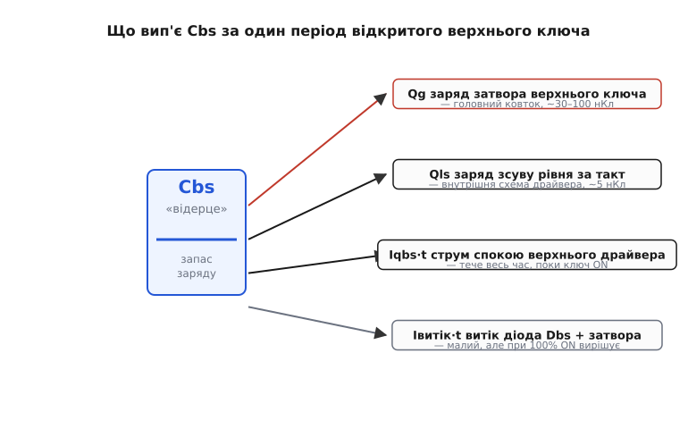
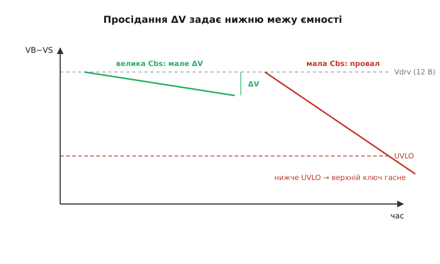
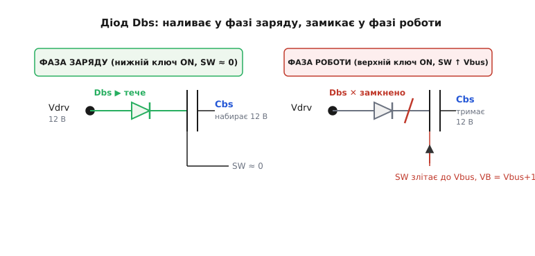

# Bootstrap-конденсатор у драйвері затвора

<preknowlist>
- [Верхній ключ](root:hw-power/high-side-switch) — чому верхньому N-канальному ключу треба на затворі напругу вище за шину і як бутстреп її «виготовляє».
- [Драйвер затвора](root:hw-power/gate-driver) — двотактний вихід, що вливає й відсмоктує заряд затвора; звідки береться вимога до струму.
- [Ємність затвора](root:hw-components/gate-capacitance) — затвор MOSFET як конденсатор; заряд затвора Qg як міра «скільки треба влити».
- [Стала RC](root:hw-analog/rc-time-constant) — конденсатор не змінює свою напругу миттєво; зв'язок заряду, ємності й напруги Q = C·V.
- [ESR конденсатора](root:hw-power/esr-capacitor) — послідовний опір реального конденсатора й чому він шкодить на різких імпульсах струму.
</preknowlist>

Біля кожного верхнього ключа на платі драйвера мотора чи перетворювача сидить крихітний конденсатор — часто зовсім поруч із діодом, ніби «у повітрі», без видимої причини. Це **бутстреп-конденсатор** *(англ. bootstrap — «підтягнути себе за власні шнурки»; вислів XIX ст. про фізично неможливе — самому підняти себе за петельки чобіт; тут іронія обертається інженерним фактом: схема таки піднімає власне живлення над найвищою шиною, не маючи жодного зовнішнього джерела вищої напруги)*. Він — те саме «плаваюче відерце» заряду, з якого драйвер годує затвор верхнього ключа, поки той висить над силовою шиною. Питання, як саме керувати верхнім ключем, — окрема тема; тут же розберімо **сам конденсатор як деталь**: що його спорожняє, як обрати ємність, який діелектрик ставити й чому він не любить надто довгих пауз.

### Конденсатор як тимчасова батарея над шиною

Уся хитрість тримається на одному факті: конденсатор [не може миттєво змінити напругу на собі](root:hw-analog/rc-time-constant). Поки нижній ключ півмоста відкритий, спільна точка плеча (вузол SW — витік верхнього ключа) притиснута до землі, і бутстреп-конденсатор Cbs заряджається від низьковольтного живлення драйвера Vdrv (типово 10–12 В) крізь діод. Наповнили «відерце» до 12 В.

Далі нижній ключ закривається, верхній відкривається — і SW злітає майже до силової шини Vbus. Нижній кінець Cbs прибитий до SW, тож він теж злітає. А напруга **на самому конденсаторі** лишилася 12 В — миттєво вона змінитися не встигла. Отже, верхній кінець (вузол VB — «плюс» живлення верхнього драйвера) опиняється на Vbus + 12 В, вище за будь-що в схемі. Ось цими 12-ма вольтами (VB відносно SW) драйвер і тримає затвор верхнього ключа відкритим, поки той «плаває» вгорі.

Отже, роль Cbs проста й водночас підступна: **весь час, поки верхній ключ відкритий, він — єдине джерело живлення верхнього драйвера.** Живлення Vdrv у цю фазу відрізане діодом. Тобто конденсатор працює тимчасовою батареєю, і питання лише в тому, чи вистачить у ній заряду, доки не настане нагода долити.

> 🔧 **Навіщо це.** Побачивши на чужій платі маленький конденсатор (часто 100 нФ – 1 мкФ, керамічний) упритул до діода біля верхнього ключа півмоста, ви одразу читаєте вузол: це бутстреп, а конденсатор — плаваюча батарея верхнього затвора. Якщо він не тієї ємності або не того типу, верхній ключ гріється чи взагалі не відкривається на повну — тому вибір цієї копійчаної деталі не дрібниця.

### Чотири споживачі, що спорожняють «відерце»

Щоб обрати ємність, треба точно знати, **скільки заряду вип'ють із конденсатора** за час, поки верхній ключ відкритий (за один період ШІМ у найгіршому — найдовшому — випадку). Заряд витікає не в одне горло, а в чотири, і кожне варто відчути окремо.


*Що вип'є Cbs за один період відкритого верхнього ключа. Головний ковток — заряд затвора Qg; далі заряд зсуву рівня Qls, струм спокою верхнього драйвера Iqbs і дрібні струми витоку. Сума всіх чотирьох, поділена на дозволене просідання, задає мінімальну ємність.*

**Перше — заряд затвора Qg.** Це головний ковток. Щоб відкрити верхній ключ, драйвер мусить влити в його [ємність затвора](root:hw-components/gate-capacitance) повний заряд Qg — для типового силового MOSFET це 30–100 нКл. Цей заряд бере просто з Cbs. Одне відкриття — одна порція Qg геть із «відерця».

**Друге — заряд зсуву рівня Qls.** Драйвер верхнього боку сам живиться з Cbs, і щоб передати йому команду «відкрий/закрий» через межу напруги, всередині спрацьовує схема зсуву рівня *(англ. level shift)*. Кожен такий перехід з'їдає невелику порцію заряду — для драйверів на 600 В це орієнтовно 5 нКл за такт. Порівняно з Qg дрібно, але в баланс входить.

**Третє — струм спокою верхнього драйвера Iqbs.** Плаваюча частина драйвера споживає струм постійно, весь час, поки живиться від Cbs *(англ. quiescent — спокою; струм навіть тоді, коли нічого не перемикається)*. Це вже не разова порція, а **струм × час**: що довше тримаємо ключ відкритим (більша шпаруватість), то більше цей струм вип'є. Саме він робить високу шпаруватість небезпечною.

**Четверте — струми витоку.** Діод не ідеальний: у зворотному напрямку крізь нього тече малий зворотний струм витоку, стікаючи заряд «назад» до Vdrv. Плюс дещиця крізь сам затвор і корпус конденсатора. Поодинці мізерні, але при дуже високій шпаруватості (коли перезаряд трапляється рідко) саме вони визначають, чи стече «відерце».

Складімо все, що йде з конденсатора за один найдовший період відкритого ключа:

```
Qвитрат = Qg  +  Qls  +  (Iqbs + Iвитік)·t(ON)
```

Тут t(ON) — найдовший час, який верхній ключ лишається відкритим за один цикл (за найбільшої робочої шпаруватості). Це — та кількість заряду, яку «відерце» мусить віддати, не просівши надто глибоко.

### Розмір: рівняння з дозволеного просідання

Коли конденсатор віддає заряд Qвитрат, його напруга падає — це прямий наслідок Q = C·V. Наскільки падає, задає ємність:

```
ΔV = Qвитрат / Cbs
```

Тепер логіка вибору стає очевидною. Ми не хочемо, щоб напруга на верхньому драйвері (VB−SW) просіла надто глибоко: якщо вона впаде нижче порога UVLO *(англ. undervoltage lockout — блокування за зниженої напруги)*, драйвер вирішить, що живлення зникло, і **вимкне верхній ключ** посеред такту. А ще раніше, задовго до UVLO, недостатня напруга на затворі не відкриє силовий ключ повністю — його Rds(on) зросте, і ключ почне грітися. Тож ми **задаємо** дозволене просідання ΔV — типово 0.5–1.5 В — і з нього знаходимо мінімальну ємність:

```
Cbs ≥ Qвитрат / ΔV
```


*Напруга на бутстреп-конденсаторі (VB−VS) між перезарядами. Достатня ємність дає мале просідання ΔV — верхній драйвер тримається вище UVLO. Замала ємність провалюється нижче порога, і верхній ключ гасне посеред такту.*

**Скільки нанофарад для типового ключа.**
Півміст на 20 кГц, шпаруватість до 90 %. Ключ із Qg = 50 нКл. Драйвер: Qls = 5 нКл за такт, струм спокою верхнього боку Iqbs = 150 мкА, витік діода приймемо ще 50 мкА. Дозволене просідання ΔV = 0.5 В.

```
період T      = 1 / 20e3        = 50 мкс
t(ON) макс    = 0.9 · 50 мкс    = 45 мкс
заряд від струмів = (Iqbs + Iвитік)·t(ON)
              = (150e-6 + 50e-6)·45e-6
              = 200e-6 · 45e-6   = 9 нКл
Qвитрат       = Qg + Qls + 9 нКл
              = 50 + 5 + 9       = 64 нКл
Cbs(min)      = Qвитрат / ΔV
              = 64e-9 / 0.5      = 128 нФ
```

Отже, суто з балансу заряду виходить близько 130 нФ. Але на практиці беруть **у 10–20 разів більше** — часто 1 мкФ. Чому такий запас? Кілька причин відразу. По-перше, реальний керамічний конденсатор **втрачає ємність під напругою зміщення** (ефект DC-bias у діелектриках X5R/X7R — номінал «1 мкФ» під робочою напругою може впасти вдвічі й більше). По-друге, за кожен перезаряд «відерце» треба **встигнути** налити назад за короткий час відкритого нижнього ключа — а надто велика ємність теж погана (про це нижче), тож обирають розумну середину. По-третє, запас страхує від холодного пуску, розкиду параметрів і піків струму. Тому «порахував 130 нФ — постав 1 мкФ» тут не марнотратство, а норма.

> 🔧 **Навіщо це.** Порахуйте Qвитрат за формулою, поділіть на дозволене ΔV (беріть 0.5 В консервативно) і помножте результат на 10–20. Це вбереже від найпідступнішого дефекту: верхній ключ, що відкривається **майже**, але не до кінця, і тихо гріється — на осцилографі Vgs верхнього ключа «повзе» вниз до кінця такту. Формула вивідна докладніше, з усіма похибками діелектрика: [виведення розміру бутстреп-конденсатора](root:hw-power/bootstrap-capacitor/math-bootstrap-sizing.md).

### Чому надто велика ємність — теж погано

Здавалося б, постав ємність із головою — і про просідання можна забути. Але «відерце» треба не лише спорожняти, а й **наповнювати** — і саме тут велика ємність б'є у відповідь.

Наповнення трапляється лише у фазі заряду, поки відкритий нижній ключ, крізь діод і його опір. Це звичайне [RC-заряджання](root:hw-analog/rc-time-constant): що більша ємність, то довше вона набирає повну напругу. Якщо шпаруватість висока, фаза заряду **коротка** — і надто велика ємність просто **не встигне** долитися до 12 В за той короткий проблиск. Виходить дивна пастка: ви поставили «більше про запас», а напруга верхнього боку недобирає, бо конденсатор хронічно недозаряджений.

Друга біда — **кидок струму на першому заряді**. Порожній конденсатор у перший момент виглядає як коротке замикання; крізь діод б'є пік струму, обмежений лише його опором і опором доріжок. Що більша ємність, то довший і сильніший цей кидок — він навантажує діод і живлення драйвера. Тому бутстреп-конденсатор — це завжди **компроміс**: достатньо великий, щоб пережити найдовший відкритий такт без глибокого просідання, але не такий великий, щоб не встигати перезаряджатися чи бити струмом. Звідси й типова «вилка» 100 нФ – 4.7 мкФ залежно від Qg ключа й частоти.

### Діод — воротар «відерця»

Конденсатор сам по собі нічого не тримав би: без діода заряд, щойно SW злетить угору, миттю ринув би назад у Vdrv, і жодного підняття над шиною не сталося б. Діод Dbs — це **воротар**, що впускає заряд у фазі наповнення й замикає вихід у фазі роботи.


*Ліворуч — фаза заряду: SW ≈ 0, діод відкритий, струм тече з Vdrv у Cbs. Праворуч — фаза роботи: SW злетів до Vbus, VB піднявся над шиною, діод замкнений і не дає зарядові втекти назад до Vdrv.*

До цього діода — жорсткі вимоги, і кожна випливає з фізики вузла. **Витримати повну шину у зворотному напрямку.** У фазі роботи на діоді опиняється майже вся напруга Vbus (з боку VB тепер Vbus+12, з боку Vdrv лише 12), тож його зворотна напруга має бути не нижчою за шину з запасом: для 48-вольтового плеча — щонайменше 100 В, для 300-вольтового — 400 В і вище. **Бути швидким.** Це має бути ультрашвидкий діод: у момент, коли SW злітає вгору, звичайний діод із повільним відновленням ще якусь мить провідний у зворотному напрямку й **зливає** частину заряду назад — саме тому тут ставлять fast/ultrafast recovery, а на нижчих напругах часто [Шотткі](root:hw-power/schottky-diode) з майже нульовим відновленням. **Малий зворотний витік** — бо це прямий четвертий споживач із балансу вище: чим більший витік, тим швидше стікає «відерце» при високій шпаруватості.

### Що ставити: діелектрик і опір

Тип конденсатора теж не байдужий, бо струм у нього йде **різкими імпульсами** — глибокий провал під час перезаряду й на початку відкриття ключа. Тут вирішує [послідовний опір ESR](root:hw-power/esr-capacitor): на кожному стрибку струму він додає падіння напруги I·ESR прямо на живленні верхнього драйвера, тобто «краде» ще трохи запасу. Тому бутстреп-конденсатор роблять **керамічним** із низьким ESR — X7R чи X5R за діелектриком (не Y5V, у якого ємність під напругою й температурою «пливе» катастрофічно). У дуже вимогливих вузлах поруч ставлять **дві** ємності: більший електролітичний чи танталовий «бак» на запас заряду й маленьку керамічну впритул до виводів VB/VS драйвера — вона гасить швидкі імпульси там, де індуктивність доріжки найшкідливіша.

І про розведення: конденсатор ставлять **упритул** до виводів VB і VS драйвера, короткими товстими доріжками. Довга петля має паразитну індуктивність, яка на різких імпульсах струму просідає напругу верхнього боку саме тоді, коли вона найпотрібніша, — і той самий добре порахований конденсатор раптом «не тримає» через сантиметри зайвої доріжки.

> 🔧 **Навіщо це.** Три правила покупки й монтажу: (1) керамічний X7R/X5R, не Y5V; (2) ємність із запасом 10–20× над розрахунком заради ефекту DC-bias; (3) фізично поруч із VB/VS, короткими доріжками. Порушите будь-яке — і на осцилографі побачите, як напруга верхнього драйвера просідає під навантаженням, а ключ гріється, хоча «за формулою все правильно».

### Головне обмеження: перезаряд конче потрібен

З усієї фізики випливає одна тверда межа, знати яку обов'язково. Cbs поповнюється **лише** тоді, коли нижній ключ відкритий і SW падає до землі. А отже, **тримати верхній ключ відкритим на всі 100 % не можна**: якщо нижній ніколи не відкривається, «відерце» ніколи не доливається — струм спокою й витоки поволі стікають його, напруга VB−SW падає нижче UVLO, і верхній ключ гасне сам.

Звідси практичне правило бутстрепного півмоста: **потрібен мінімальний рух ШІМ.** Він не любить «застиглих» станів; типове обмеження робочої шпаруватості — десь 95–99 %, щоб між тактами лишалася коротка фаза заряду. Якщо задача вимагає, щоб верхній ключ стояв відкритим справді **постійно** (наприклад, ключ живлення «увімкнув і забув»), бутстреп не годиться — перезарядити його ніколи, і тоді натомість беруть [зарядову помпу](root:hw-power/charge-pump), що тримає напругу над шиною невтомно, без жодних пауз, ціною слабшого струму.

### Як це виглядає в прошивці

Обмеження «100 % не можна» доводиться пам'ятати і в коді, що генерує ШІМ. Наївний максимум шпаруватості (повний період відкрито) вб'є бутстреп — тож у прошивці ставлять стелю трохи нижче за максимум, лишаючи гарантований проблиск нижнього ключа для перезаряду:

```c
// ШІМ верхнього ключа півмоста через таймер MCU.
// Cbs заряджається лише коли верхній ВИМКНЕНО (SW падає до землі).
// Тому НІКОЛИ не даємо повні 100% — лишаємо «вікно» на перезаряд.
#define PWM_TOP          1000u   // період таймера (0..TOP)
#define DUTY_CEILING_PCT 95u     // стеля шпаруватості заради бутстрепа

uint16_t clamp_duty(uint16_t duty) {
    uint16_t ceil = (uint32_t)PWM_TOP * DUTY_CEILING_PCT / 100u;  // = 950
    if (duty > ceil)
        duty = ceil;             // лишаємо ≥5% часу на заряд Cbs
    return duty;
}
```

Стеля 95 % тут не з естетики: за періоду 50 мкс вона лишає 2.5 мкс відкритого нижнього ключа щотакту — достатньо, щоб діод устиг долити «відерце» до повної напруги перед наступним відкриттям верхнього. Прибрати цей затиск — і за кілька десятків тактів верхній ключ почне недовідкриватися, а тоді й гаснути.

> 🔧 **Навіщо це.** Дефект «на високій шпаруватості мотор смикається чи ключ гріється, а на середній усе гаразд» майже завжди — про недозаряджений бутстреп. Затиск шпаруватості в прошивці й достатня ємність Cbs — два боки одного захисту: конденсатор має пережити найдовший дозволений відкритий такт, а код — не дати такту стати нескінченним.

### Коротко про суть

Бутстреп-конденсатор — це плаваюча тимчасова батарея, яка щотакту наповнюється від низьковольтного живлення драйвера крізь діод (поки SW унизу) і їде вгору разом із витоком верхнього ключа, тримаючи над шиною напругу, якою драйвер відкриває цей ключ. Ємність обирають із балансу заряду: сумуємо все, що «відерце» віддає за найдовший відкритий такт (заряд затвора Qg, заряд зсуву рівня Qls, струм спокою й витоки × час), ділимо на дозволене просідання ΔV і беремо запас 10–20× під ефект DC-bias керамічного діелектрика. Занадто мала ємність провалюється нижче UVLO й гасить ключ; занадто велика не встигає перезаряджатися й б'є кидком струму. Діод має витримати шину у зворотному напрямку, бути ультрашвидким і малотечним; конденсатор — керамічний X7R впритул до виводів драйвера. І залізна межа: 100 % шпаруватості бутстреп не тримає — йому конче потрібні паузи на перезаряд, інакше беріть зарядову помпу.
