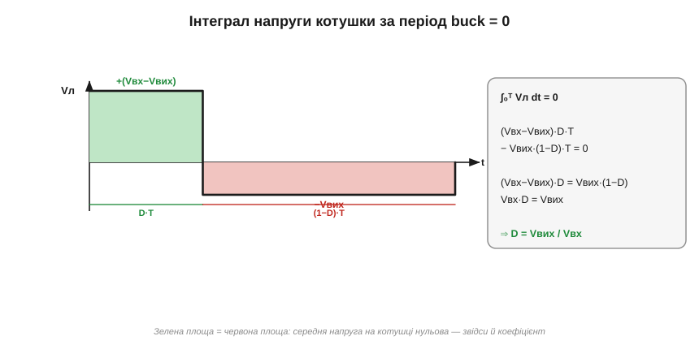

# 🧮 Вольт-секундний баланс: чому D = Vвих/Vвх у buck

> Математична вставка до [перетворювача buck](topic:hw-power/buck): формальне виведення «на пів сторінки», як саме з вольт-секундного балансу випадає коефіцієнт buck D = Vвих/Vвх.

### Означення

**Вольт-секундний баланс** (*inductor volt-second balance*): у періодичному сталому режимі **середнє** значення напруги на котушці за період дорівнює нулю — або, що те саме, інтеграл напруги за період нульовий:

```
⟨Vл⟩ = (1/T) · ∫₀ᵀ Vл(t) dt = 0      ⇔      ∫₀ᵀ Vл(t) dt = 0
```

«Вольт-секунда» — це одиниця цього інтеграла (вольт × секунда), звідки й назва закону.

### Інтуїція: чому інтеграл нульовий

Напруга на котушці пов'язана зі швидкістю зміни струму: Vл = L·(di/dt). Помножимо на dt і проінтегруємо за повний період:

```
∫₀ᵀ Vл dt = L · ∫₀ᵀ (di/dt) dt = L · [ iл(T) − iл(0) ] = L · Δiпер
```

А тепер ключове спостереження: у **сталому** режимі процес періодичний, тож струм котушки наприкінці періоду дорівнює струмові на початку — інакше цикл не повторювався б. Отже Δiпер = iл(T) − iл(0) = 0, а з ним і весь інтеграл:

```
iл(T) = iл(0)   ⇒   Δiпер = 0   ⇒   ∫₀ᵀ Vл dt = 0
```

Закон не накладають — він **випливає** з самої періодичності сталого режиму.

### Формальний апарат: виведення для buck

У buck напруга на котушці у двох фазах стала (вхід і вихід тримаємо незмінними за період):

```
фаза ВКЛ,  0 ≤ t < D·T:     Vл = Vвх − Vвих
фаза ВИКЛ, D·T ≤ t < T:     Vл = −Vвих
```

Інтеграл за період — це сума двох прямокутних площ (стала напруга × тривалість фази):

```
∫₀ᵀ Vл dt = (Vвх − Vвих)·D·T  +  (−Vвих)·(1−D)·T  =  0
```


*Напруга на котушці buck: високий додатний імпульс (Vвх−Vвих) протягом D·T і нижчий від'ємний (−Vвих) протягом (1−D)·T. Баланс означає рівність площ — звідси алгебра праворуч дає D = Vвих/Vвх.*

Скоротимо T (воно в кожному доданку) і розкриємо дужки:

```
(Vвх − Vвих)·D − Vвих·(1−D) = 0
Vвх·D − Vвих·D − Vвих + Vвих·D = 0
Vвх·D − Vвих = 0
```

Звідки одразу:

```
Vвих = D · Vвх        ⇔        D = Vвих / Vвх
```

Знаки тут не випадкові, і саме на них найлегше помилитися: у фазі ВКЛ котушка під **додатною** напругою (вхід вищий за вихід — струм росте), у фазі ВИКЛ — під **від'ємною** (−Vвих, бо лівий кінець котушки сидить на землі крізь діод — струм спадає). Рівно тому площі мають **протилежні** знаки й можуть зійтися в нуль.

### Той самий апарат для інших топологій

Цей самий розрахунок — написати Vл у двох фазах і прирівняти інтеграл до нуля — дає коефіцієнт **будь-якої** топології. Для [boost](topic:hw-power/boost) і [buck-boost](topic:hw-power/buck-boost) змінюється лише напруга на котушці у двох фазах, а спосіб лишається тим самим:

```
buck:        Vл(ВКЛ)=Vвх−Vвих, Vл(ВИКЛ)=−Vвих   →  Vвих = D·Vвх
boost:       Vл(ВКЛ)=Vвх,      Vл(ВИКЛ)=Vвх−Vвих →  Vвих = Vвх/(1−D)
buck-boost:  Vл(ВКЛ)=Vвх,      Vл(ВИКЛ)=Vвих     →  Vвих = −Vвх·D/(1−D)
```

Тобто вольт-секундний баланс — не окрема формула для buck, а **спільний інструмент** усіх імпульсних топологій: один закон замість таблиці коефіцієнтів. Варто лише пам'ятати межу його застосування — він діє в **сталому** режимі (на перехідних процесах струм навмисно не повертається до себе, і баланс тимчасово порушується, доки система не осяде) і за **безперервного** струму котушки; у переривчастому режимі (DCM) з'являється третя фаза, і коефіцієнт уже інший.
