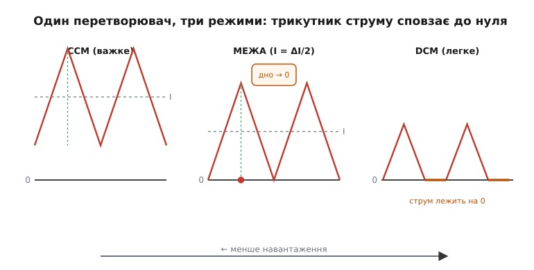
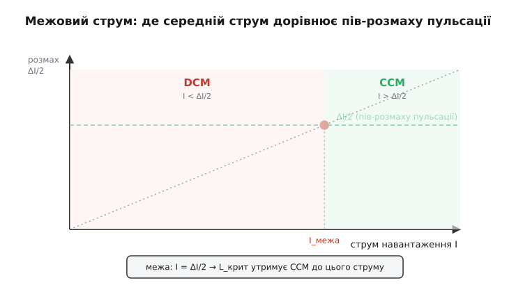
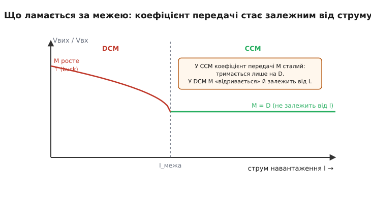

# Межа CCM/DCM у DC-DC перетворювачах

Будь-який імпульсний перетворювач із котушкою — знижувальний, підвищувальний, обернений — щоцикла качає струм у котушку і випускає його назад. Струм у котушці не стрибає, а плавно гойдається трикутником: наростає, коли котушку живлять, спадає, коли з неї віддають. І весь характер перетворювача — його точна формула, динаміка, ефективність, спектр завад — залежить від однієї-єдиної обставини: **чи торкається цей трикутник нуля**.

Поки трикутник висить над нулем і струм у котушці тече **безперервно**, перетворювач живе в одному світі. Щойно трикутник просідає так, що дном лягає на нуль і струм на частину циклу **зникає**, — це вже інший світ, з іншими законами. Межа між цими двома світами — не абстракція з підручника, а конкретна точка, у яку перетворювач заходить сам, тільки-но зменшити навантаження. Розуміти цю межу — означає розуміти, чому вузол, що ідеально тримав напругу під навантаженням, раптом «спливає» на холостому ходу, чому ККД падає саме там, де струму найменше, і чому один і той самий чип поводиться як два різні пристрої.

Далі — що це за межа, звідки береться, де саме проходить і що ламається, коли її перетнути. Механіка тут спільна для всіх топологій; де вона розходиться, буде сказано окремо.

## Дві сторони межі: безперервний і переривчастий струм

Почнемо з того, що взагалі коїться зі струмом котушки за цикл. Перетворювач працює у дві фази (спрощено — без урахування дрібних перехідних ділянок). У першій фазі до котушки прикладено напругу в один бік, і струм наростає; у другій — напруга розвертається (котушка віддає накопичене), і струм спадає. Це прямий наслідок того, що [котушка перетворює напругу на швидкість зміни струму](topic:ph-electromagnetism/inductance): V = L·(ΔI/Δt), тож стала напруга дає **лінійне** наростання чи спад. Звідси й трикутна форма.

Середина цього трикутника — **середній струм** котушки. У сталому режимі він дорівнює струмові, який споживає навантаження (усе, що зайде в котушку понад середнє, вихідний конденсатор ковтне і поверне). А розмах трикутника — **пульсація струму** ΔI — заданий котушкою і частотою і від навантаження майже не залежить: він лише «їде» вгору-вниз разом із середнім.

Тепер уявімо, що навантаження слабшає. Середній струм сповзає вниз, а розмах трикутника лишається тим самим. Трикутник опускається — і рано чи пізно його **нижній край торкається нуля**. Доти струм тік безперервно — це **безперервний режим провідності** (continuous conduction mode, **CCM**, від лат. *continuus* — суцільний). Саме для нього діють чисті формули перетворювача.

Що станеться, коли навантаження ще менше? Тут усе вирішує елемент, що замикає струм у другій фазі, — **діод або нижній ключ**. Він проводить струм лише в один бік. Тому щойно струм котушки, спадаючи, дійде нуля — цей елемент **закривається**, і струм не може піти в мінус: він просто **лежить на нулі** до наступного циклу. Трикутник розпадається на окремі острівці з паузами: піднявся, спав до нуля, почекав, знову піднявся. Це **переривчастий режим провідності** (discontinuous conduction mode, **DCM**, від лат. *discontinuus* — перерваний).


*Зі зменшенням навантаження середній струм сповзає вниз, а розмах пульсації лишається сталим. У CCM трикутник увесь над нулем. На межі його дно рівно торкається нуля. У DCM струм лягає на нуль на частину циклу — з'являється третя, «мертва» фаза, коли в котушці струму немає взагалі.*

> 🔧 **Навіщо це.** Той самий перетворювач на повному навантаженні (CCM) і в дрімоті (DCM) — практично два різні пристрої: інша формула виходу, інша динаміка контуру, інший спектр завад, інший ККД. Тому, міряючи живлення «на холостому», не дивуйтеся, що поведінка інша — ви просто по інший бік межі. А коли бачите, що вихід трохи «підріс» на малесенькому струмі, це майже завжди прикмета DCM.

## Де саме проходить межа

Межу легко записати точно. Вона настає тоді, коли дно трикутника рівно торкається нуля — а це той самий момент, коли середній струм дорівнює **половині розмаху** пульсації (бо середина трикутника стоїть якраз посередині між дном і вершиною):

```
I_межа = ΔI / 2
```

Оце і є **межовий струм** (boundary current) — струм навантаження, на якому перетворювач балансує рівно на межі CCM і DCM. Понад нього — CCM, менше — DCM.


*Робоча точка (середній струм) рухається діагоналлю. Стала горизонталь — пів-розмаху пульсації ΔI/2. Де вони перетинаються, там межа: праворуч струму досить, щоб триматися CCM; ліворуч його замало — DCM. Змінюючи котушку, ми рухаємо горизонталь, а отже, і саму межу.*

Цю саму межу можна дивитися з іншого боку — не «за якого струму», а «за якої котушки». Розмах пульсації обернено пропорційний індуктивності: більший L — вужчий трикутник, нижча межа. Тож для заданого навантаження існує **мінімальна індуктивність**, за якої перетворювач ще тримається CCM; менша котушка дасть ширший трикутник, що торкнеться нуля раніше, і кине вузол у DCM. Цю величину звуть **критичною індуктивністю** (critical inductance). Для знижувального перетворювача вона виходить така:

```
L_крит = (1 − D) · R / (2 · f)
```

де D — коефіцієнт заповнення, R — опір навантаження (Vвих / Iвих), f — частота перемикання. Формула читається прямо: більший опір навантаження (тобто менший струм) і нижча частота вимагають більшої котушки, щоб утриматися в CCM. Виведення цього виразу з умови «дно трикутника = 0» — механічне; хто хоче простежити його крок за кроком і побачити, як воно міняється для boost і buck-boost, знайде це в [🧮 математичній вставці про критичну індуктивність](topic:hw-power/ccm-dcm-boundary/math-critical-inductance.md).

**Приклад (межовий струм і критична котушка).** Знижувальний вузол 12 В → 3.3 В, частота f = 500 кГц, котушка L = 6.8 мкГ. За якого струму навантаження він зісковзне в DCM?

```
D  = Vвих / Vвх = 3.3 / 12 ≈ 0.275
Розмах пульсації (за фазу спаду тривалістю (1−D)·T):
ΔI = Vвих · (1 − D) / (L · f)
   = 3.3 · (1 − 0.275) / (6.8·10⁻⁶ · 500·10³)
   = 3.3 · 0.725 / 3.4
   = 2.393 / 3.4 ≈ 0.70 А (розмах)

Межовий струм:
I_межа = ΔI / 2 ≈ 0.35 А
```

Отже, поки з вузла беруть понад ≈ 0.35 А, він у CCM. Опустилися нижче 0.35 А — і він у DCM. Якщо цей перетворювач мав би працювати аж до 50 мА в режимі очікування, він більшу частину «легкого» діапазону проведе саме в DCM — і саме там треба перевіряти його поведінку, а не лише на повному навантаженні.

## Що ламається, коли межу перетнути

Найважливіше: DCM — це **не** «той самий перетворювач, тільки слабший». У ньому змінюються самі рівняння, бо з'являється **третя фаза** циклу — та, коли струм у котушці нульовий і жоден ключ по суті нічого не робить. Через цю паузу баланс напруг на котушці за період ділиться інакше, і кілька речей поводяться по-новому.

**Коефіцієнт передачі відривається від коефіцієнта заповнення.** У CCM відношення виходу до входу тримається лише на D — для знижувального це чисте Vвих = D·Vвх, і навантаження на нього не впливає. У DCM ця опора зникає: коефіцієнт передачі **починає залежати від струму навантаження** (а також від L і f). Для знижувального перетворювача це означає, що за тим самим D вихідна напруга на легкому навантаженні **підростає** — і тим більше, чим менший струм. Для підвищувального — навпаки, коефіцієнт може «розноситися» вгору небезпечно.


*У CCM коефіцієнт передачі M = Vвих/Vвх сталий — тримається лише на D і не помічає струму. За межею, у DCM, він «відривається» й починає залежати від навантаження: у знижувальному лізе вгору при спаданні струму. Саме тому нерегульований вихід у DCM спливає.*

На щастя, у справжньому перетворювачі за виходом стежить [контур зворотного зв'язку](topic:hw-power/feedback-stability): він бачить, що вихід підріс, і **зменшує D**, щоб утримати задану напругу. Тож зовні перетворювач і в DCM тримає свої 3.3 В — читач зі споживчого боку може навіть не помітити переходу. Але **всередині** все інакше: контур працює в іншій робочій точці, з іншим підсиленням.

**Динаміка контуру змінюється.** Це прямий наслідок зміни коефіцієнта передачі. Оскільки в DCM зв'язок «D → вихід» інший (слабший і залежить від струму), передавальна функція перетворювача як об'єкта керування теж інша: зникає характерний для CCM подвійний полюс від котушки з конденсатором, натомість поведінка стає ближчою до одно-полюсної. Компенсація контуру, вилизана під CCM, у глибокому DCM може виявитися або надто млявою, або, навпаки, метастабільною. Тому перетворювачі, яким важлива стабільність у всьому діапазоні, проєктують з оглядкою на **обидва** режими.

**Ефективність і завади зсуваються.** У CCM струм тече завжди, втрати провідності передбачувані. У DCM з'являється пауза, форма струму гостріша (той самий заряд проходить за коротший час — вищий пік), і баланс втрат інший. На дуже легкому навантаженні головною втратою стає вже не провідність, а саме **перемикання** — заряджати затвори й гойдати вузол перемикання коштує енергії щоцикла, незалежно від того, скільки струму несе котушка. Саме тому «чесний» перетворювач зі сталою частотою на холостому ходу має жалюгідний ККД: він однаково часто перемикає, майже не віддаючи корисної потужності.

> 🔧 **Навіщо це.** Якщо міряєте ККД і бачите, що на малому струмі він завалюється, — це не поломка, а фізика DCM: перемикання з'їдає майже все. Якщо нерегульований вихід (наприклад, допоміжна обмотка) на холостому ходу підскакує на кілька відсотків — теж DCM. А якщо контур, що ідеально тримався під навантаженням, починає повільно «дихати» на малому струмі — шукайте зміну динаміки на переході через межу.

## Межа як інструмент, а не халепа

Досі виходило, що DCM — прикрість, у яку перетворювач звалюється мимоволі. Але той самий перехід можна **використати навмисно**, і саме так роблять у двох дуже поширених випадках.

**Розумний легкий режим.** Синхронний перетворювач (де діод замінено нижнім MOSFET) має підступ: MOSFET проводить струм в **обидва** боки, тож на легкому навантаженні струм котушки, замість спинитися на нулі, піде **в мінус** і почне даремно циркулювати туди-сюди, гріючи ключі. Щоб цього не було, схема навмисно **імітує діод**: стежить за струмом і вимикає нижній ключ рівно тоді, коли струм дійшов нуля, — тобто добровільно заганяє себе в DCM. Це прибирає марну циркуляцію. А на зовсім малому струмі перетворювач іде далі й **пропускає імпульси**: видає пачку, підзаряджає конденсатор і засинає, доки вихід просяде. Тонкощі цих режимів легкого навантаження — окрема тема; тут важливо бачити, що перехід у DCM тут **бажаний**, а не аварійний. Механіку синхронного випрямляча й режимів спокою розібрано у статті про [синхронний випрямляч](topic:hw-power/sync-rectifier), а весь набір компромісів навколо buck — у статті про [знижувальний перетворювач](topic:hw-power/buck).

**Робота рівно на межі.** Є цілий клас перетворювачів, що навмисне тримаються **точно на межі**: вмикають ключ рівно тоді, коли струм котушки щойно впав до нуля, — ні миті раніше, ні пізніше. Цей режим має купу назв-синонімів: **межовий** (boundary conduction mode, **BCM**), **критичний** (critical conduction mode, CrM), **прикордонний**, **перехідний** — усі про одне: працювати рівно в точці I = ΔI/2. Навіщо? Бо в цей момент струм у діоді (чи нижньому ключі) вже нульовий, тож немає **зворотного відновлення** діода — одного з головних джерел втрат і завад на вимиканні; а ще ключ вмикається за нульового струму, м'яко. Ціна — **змінна частота**: період сам «плаває» залежно від навантаження й входу, бо схема щоразу чекає саме на нульовий струм. Такий підхід — основа багатьох коректорів коефіцієнта потужності й недорогих обернених (flyback) перетворювачів. Що таке [обернений перетворювач із гальванічною розв'язкою](topic:hw-power/flyback-isolated) і чому BCM так пасує до нього — окрема розмова; історію самої ідеї «вмикатися на нульовому струмі» та як вона розвинулася в контролерах наведено у [📜 історичній вставці](topic:hw-power/ccm-dcm-boundary/hist-boundary-mode.md).

> 🔧 **Навіщо це.** Побачили в datasheet «BCM», «CrM», «transition mode», «квазірезонансний» — знайте: перетворювач навмисне сидить на межі CCM/DCM. Плюс — низькі втрати на вимиканні й тихіше вимикання діода; мінус — частота гуляє з навантаженням, тож фільтр завад треба рахувати на весь її діапазон, а не на одну точку.

## Топологія міняє деталі, не суть

Усе сказане про **саму межу** — трикутник, умову I = ΔI/2, появу третьої фази — однакове для будь-якого перетворювача з котушкою. Різниться те, **як** саме перехід у DCM переписує формулу виходу, бо в кожній топології котушку заряджають і розряджають по-своєму.

- У [знижувальному (buck)](topic:hw-power/buck) коефіцієнт передачі в DCM **росте** над D — вихід спливає на легкому навантаженні.
- У [підвищувальному (boost)](topic:hw-power/boost) у DCM коефіцієнт теж відривається від простого 1/(1−D) і залежить від струму — а на холостому ходу нерегульований boost узагалі здатний піти в небезпечно високу напругу.
- У [buck-boost](topic:hw-power/buck-boost) картина проміжна, зі своїм виразом.

Спільне ядро всіх цих топологій — те, що всі вони гойдають струм у котушці двома фазами, — розібрано у статті про [спільне ядро імпульсних топологій](topic:hw-power/switching-core); а те, як розмах пульсації задається самою котушкою й частотою, — у статтях про [котушку перетворювача](topic:hw-power/converter-inductor) і [контролер із його частотою](topic:hw-power/controller-fsw). Для розуміння межі досить одного: у якому б перетворювачі ви не працювали, є струм, нижче якого трикутник торкається нуля, і по той бік цієї межі діють інші рівняння.

## Підсумок

Межа CCM/DCM — це точка, у якій нижній край трикутного струму котушки торкається нуля, тобто де середній струм навантаження дорівнює половині розмаху пульсації: **I_межа = ΔI/2**. Понад неї струм тече безперервно (CCM) і працюють чисті формули перетворювача; нижче — струм на частину циклу зникає (DCM), з'являється третя, «мертва» фаза, і рівняння змінюються: коефіцієнт передачі відривається від коефіцієнта заповнення й починає залежати від навантаження, міняється динаміка контуру, зсувається баланс втрат. Ту саму межу задає **критична індуктивність** — мінімальна котушка, за якої вузол ще тримається CCM на заданому струмі. Перетворювач заходить у DCM сам, тільки-но зменшити навантаження, — але той самий перехід використовують і навмисне: щоб не марнувати енергію на легкому ходу (імітація діода, пропуск імпульсів) або щоб сидіти рівно на межі (режими BCM/CrM) заради м'якого вимикання діода. Топологія міняє конкретну формулу по той бік межі, але не саму межу: у будь-якому перетворювачі з котушкою є струм, нижче якого світ інший.
