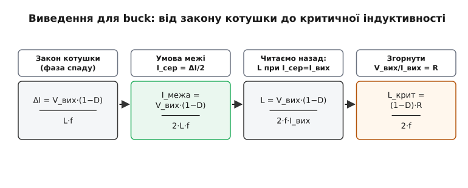
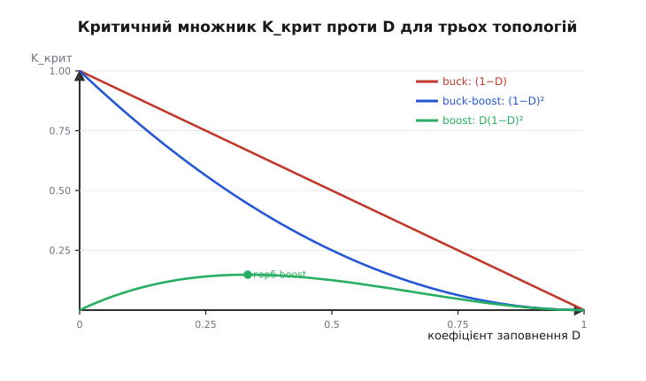
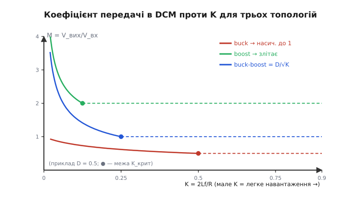

# 🧮 Критична індуктивність і межовий струм: виведення з умови «дно трикутника = 0»

Уся межа між безперервним і переривчастим режимом тримається на одному-єдиному геометричному факті: нижній край трикутного струму котушки торкається нуля. Це одне речення можна записати рівнянням і **вирахувати** з нього дві практично важливі величини — струм навантаження, на якому вузол балансує на межі (**межовий струм**), і найменшу котушку, за якої він ще тримається безперервного струму (**критична індуктивність**). Тут ми виведемо обидві крок за кроком, спершу для знижувального перетворювача, а тоді покажемо, як той самий розрахунок дає інші множники для підвищувального й оберненого. Наприкінці — що стається з коефіцієнтом передачі по той бік межі, коли з'являється третя фаза, і чому там він уже залежить від струму.

Нічого нового, крім арифметики, тут не буде: усе випливає з одного закону котушки V = L·(di/dt) і з того, що в сталому режимі струм за період повертається туди, звідки почав. Але саме проходячи це руками, видно, **чому** межа стоїть там, де стоїть, і **чому** її множник міняється від топології до топології.

## Означення: два імені однієї межі

Робочу точку перетворювача задає **середній струм котушки** — середина трикутника. У сталому режимі він дорівнює струмові, що йде в навантаження: усе, що котушка проносить понад середнє, вихідний конденсатор ковтає й повертає, тож у навантаження в середньому тече саме середина. Розмах трикутника — **пульсацію** ΔI — задають котушка, прикладена напруга й час; від навантаження вона майже не залежить і лише «їде» вгору-вниз разом із середнім.

Межа настає, коли дно трикутника лягає на нуль. Дно — це середнє мінус піврозмаху, тож умова «дно = 0» — це рівно

```
I_сер − ΔI/2 = 0     ⇔     I_сер = ΔI/2
```

Те значення середнього струму, за якого рівність виконується, і є **межовий струм** (boundary current) I_межа = ΔI/2. Це перше ім'я межі — «за якого струму».

Але ΔI саме залежить від індуктивності: більша котушка — повільніша зміна струму — вужчий трикутник. Тож ту саму умову можна прочитати навпаки: за фіксованого навантаження існує **найменша** індуктивність, за якої трикутник ще не дістає нуля. Це **критична індуктивність** (critical inductance) L_крит. Понад неї — трикутник вузький, дно висить над нулем, безперервний струм; менше за неї — трикутник ширшає, дно провалюється за нуль (точніше, впирається в нуль і чекає), і вузол падає в переривчастий режим. Це друге ім'я тієї самої межі — «за якої котушки».

> 🔧 **Навіщо це.** Проєктуючи котушку, ви майже завжди рахуєте саме L_крит: береться найлегше навантаження, на якому вузол ще має триматися безперервного струму, і котушку беруть **не меншу** за критичну для цього струму. Візьмете меншу — на цьому струмі вузол уже в переривчастому режимі з усіма його наслідками; візьмете надто велику — переплатите розміром, ціною й опором обмотки. L_крит — це та точка балансу.

## Інтуїція: чому «дно = 0» — це саме I = ΔI/2, і які тут важелі

Перш ніж рахувати, варто відчути дві прості пропорції, бо на них тримається все.

Перша: **середина трикутника стоїть рівно посередині** між дном і вершиною — це властивість самого трикутника, у якого підйом і спад лінійні. Тому «дно торкається нуля» й «середина стоїть на висоті піврозмаху» — це буквально те саме твердження, записане двома способами. Звідси й береться множник ½ у I = ΔI/2: не з якоїсь глибокої фізики, а з геометрії рівнобедреного трикутника.

Друга: у нас **два незалежні важелі**, і межа — там, де вони зрівнялися.

- Середній струм тягне вниз **навантаження**: I_сер = I_вих, а I_вих = V_вих/R. Легше навантаження (більший R) — нижча діагональ робочої точки.
- Піврозмах ΔI/2 тримає **котушка й частота**: більший L або вища f — вужчий трикутник — нижча горизонталь.

Зменшуючи навантаження, ми опускаємо діагональ, поки вона не проб'є горизонталь ΔI/2, — і там межа. Або, тримаючи навантаження, ми міняємо котушку — рухаємо горизонталь — і так саме переносимо межу. Обидва імені межі — це просто «звідки ми на неї дивимося»: тримаємо L, шукаємо струм — виходить I_межа; тримаємо струм, шукаємо L — виходить L_крит.

Лишилося одне: підставити в I = ΔI/2 конкретний вираз для ΔI даної топології — і межа розкриється формулою. Саме тут топології й розходяться, бо ΔI в кожній своє.

## Формальний апарат: виведення для buck крок за кроком

Візьмемо знижувальний (buck) перетворювач і пройдемо ланцюжок до кінця.

**Крок 1 — розмах пульсації.** Пульсацію найзручніше рахувати за **фазою спаду**, коли ключ розімкнено (D·T позаду, лишилося (1−D)·T). У цій фазі лівий кінець котушки сидить на землі крізь діод чи нижній ключ, тож до котушки прикладено −V_вих, і струм спадає лінійно. Закон котушки V = L·(di/dt) для сталої напруги перетворюється на V = L·(ΔI/Δt), звідки

```
ΔI = |V_л| · Δt / L = V_вих · (1 − D)·T / L
```

Замінимо період на частоту (T = 1/f), щоб вираз читався в звичних величинах:

```
ΔI = V_вих · (1 − D) / (L · f)
```

Це та сама формула, з якої в самій темі рахують приклад: ΔI ∝ 1/L і ∝ 1/f — більша котушка чи вища частота дають вужчий трикутник. (Її окреме, докладніше виведення живе в [математичній вставці про пульсацію струму](topic:hw-power/buck/math-inductor-ripple.md); тут вона нам потрібна лише як цеглинка.)

**Крок 2 — умова межі.** На межі середній струм дорівнює піврозмаху. Середній струм buck — це прямо струм навантаження (котушка стоїть послідовно з виходом), тож I_сер = I_вих = V_вих/R:

```
I_межа = ΔI / 2 = V_вих · (1 − D) / (2 · L · f)
```

Це вже готовий **межовий струм** для buck: понад нього — безперервний струм, менше — переривчастий. Зверніть увагу, що V_вих у ньому лишилося — межовий струм залежить від того, яку напругу вузол видає.

**Крок 3 — перехід до критичної котушки.** Тепер прочитаємо ту саму рівність навпаки: не «який струм на межі за даної котушки», а «яка котушка ставить межу рівно на заданий струм навантаження I_вих». Прирівняємо межовий струм до фактичного навантаження, I_межа = I_вих, і виразимо L:

```
V_вих · (1 − D) / (2 · L · f) = I_вих
L = V_вих · (1 − D) / (2 · f · I_вих)
```

Лишилося прибрати напругу й струм на користь опору навантаження. За означенням R = V_вих/I_вих, тобто V_вих/I_вих = R, і множник V_вих/I_вих у чисельнику згортається просто в R:

```
L_крит = (1 − D) · R / (2 · f)
```

Оце і є критична індуктивність знижувального перетворювача. Вона читається прямо: більший опір навантаження (тобто менший струм) вимагає більшої котушки, щоб дотягнути дно трикутника до нуля лише на цьому меншому струмі; нижча частота — так само більшої, бо за довший період той самий нахил встигає прогнати ширший трикутник. Коефіцієнт заповнення входить множником (1−D): що ближче вихід до входу (D→1), то менша котушка потрібна, бо фаза спаду коротка й пульсація мала.

**Приклад (зчитати назад той самий вузол).** Візьмемо вузол із самої теми: 12 В → 3.3 В, f = 500 кГц, і спитаємо навпаки — яка котушка ставить межу рівно на I_вих = 0.35 А? Спершу опір навантаження на цьому струмі:

```
R = V_вих / I_вих = 3.3 / 0.35 ≈ 9.43 Ом
D = V_вих / V_вх = 3.3 / 12 ≈ 0.275

L_крит = (1 − D) · R / (2 · f)
       = (1 − 0.275) · 9.43 / (2 · 500·10³)
       = 0.725 · 9.43 / 1.0·10⁶
       = 6.84 / 10⁶
       ≈ 6.8 мкГ
```

Виходить рівно та котушка (6.8 мкГ), яку вузол і має, — і це не збіг: у прикладі теми ця котушка давала межу саме на ≈ 0.35 А. Ми лише пройшли ту саму рівність з іншого боку. Це добра перевірка: якщо взяти котушку **більшу** за 6.8 мкГ, межа зсунеться на струм **менший** за 0.35 А (вузол триматиме безперервний струм глибше вниз), а менша котушка кине його в переривчастий режим уже вище 0.35 А.


*Ланцюжок для buck: закон котушки на фазі спаду дає розмах ΔI = V_вих·(1−D)/(L·f); умова межі I_сер = ΔI/2 із I_сер = V_вих/R; підстановка й згортання V_вих/I_вих у R дає L_крит = (1−D)·R/(2·f). Кожна стрілка — одна алгебраїчна дія, жодного стрибка.*

## Ті самі кроки для boost і buck-boost: чому множник інший

Найголовніше, що варто винести: **спосіб той самий, змінюється лише ΔI і те, як середній струм котушки пов'язаний зі струмом навантаження**. У buck котушка стоїть послідовно з виходом, тож її середній струм — це прямо I_вих. У підвищувальному й оберненому це вже не так, і саме звідси беруться інші множники з D.

**Boost (підвищувальний).** Тут котушка заряджається від входу, коли ключ замкнено: до неї прикладено весь V_вх протягом D·T. Розмах рахуємо за фазою заряду:

```
ΔI = V_вх · D / (L · f)
```

Але середній струм котушки в boost — це **вхідний** струм, а не вихідний. Уся енергія йде у навантаження крізь котушку на вході, тож із балансу потужності (входу = виходу, ідеально) I_л,сер = I_вх = I_вих/(1−D): котушка несе більший струм, ніж бере навантаження, бо віддає його у вихід лише частку (1−D) періоду. Підставляємо в умову межі I_л,сер = ΔI/2 і виражаємо L через R = V_вих/I_вих, пам'ятаючи V_вих = V_вх/(1−D):

```
L_крит = D · (1 − D)² · R / (2 · f)
```

З'явився множник **D·(1−D)²** замість простого (1−D). Він не з повітря: (1−D)² приходить від того, що і напруга заряду (V_вх = V_вих·(1−D)), і зв'язок струмів (I_л = I_вих/(1−D)) тягнуть свою (1−D); множник D — від того, що заряд іде лише частку D періоду.

**Buck-boost (обернений).** Тут, як і в boost, котушка заряджається від входу протягом D·T, тож ΔI = V_вх·D/(L·f). Але у вихід вона віддає протягом (1−D)·T, і її середній струм пов'язаний із навантаженням як I_л,сер = I_вих/(1−D). Коефіцієнт передачі за модулем |V_вих| = V_вх·D/(1−D). Пройшовши ту саму підстановку, дістаємо:

```
L_крит = (1 − D)² · R / (2 · f)
```

Множник — чистий **(1−D)²**, без окремого D: обидві (1−D) тут від зв'язку струмів і від напруги віддачі, а фаза заряду D скорочується з D у коефіцієнті передачі. Buck-boost — ніби «геометричне середнє» поведінки: його множник лежить між buck-івським (1−D) і boost-івським D(1−D)².

> 🔧 **Навіщо це.** Ці три множники — причина, чому не можна перенести котушку з buck у boost «за тим самим правилом». За однакових R, f і D підвищувальний і обернений вимагають **іншої** критичної індуктивності, ніж знижувальний, — і помилка тут означає, що вузол зісковзне в переривчастий режим не там, де ви думали. Коли берете готову формулу з datasheet чи калькулятора, спершу гляньте, для якої топології вона писана.

## Зведений вигляд: межовий струм і критична котушка на три топології

Зберемо все в одну картину. Скрізь D — коефіцієнт заповнення, R = V_вих/I_вих — опір навантаження, f — частота перемикання; K_крит — той самий множник у безрозмірному вигляді (про нього — нижче). Формули розкладені так, щоб було видно спільний кістяк ·R/(2f) і те, чим топології різняться.

```
топологія     ΔI (розмах)            I_межа = ΔI/2                 L_крит = K_крит·R/(2f)
─────────────────────────────────────────────────────────────────────────────────────────
buck          V_вих·(1−D)/(L·f)      V_вих·(1−D)/(2·L·f)           (1−D)·R/(2·f)
boost         V_вх·D/(L·f)           V_вих·D·(1−D)/(2·L·f)         D·(1−D)²·R/(2·f)
buck-boost    V_вх·D/(L·f)           |V_вих|·D/(2·L·f)             (1−D)²·R/(2·f)
```

Читати варто по стовпчиках. Кістяк **R/(2f)** — спільний для всіх трьох: більший опір (менший струм) і нижча частота завжди тягнуть критичну котушку вгору. А безрозмірний множник **K_крит** — це «підпис топології»: (1−D) для buck, D(1−D)² для boost, (1−D)² для buck-boost. Саме він каже, за якого D дана топологія найлегше зісковзує в переривчастий режим.


*Безрозмірний множник K_крит = 2·L_крит·f/R як функція D для трьох топологій. Buck-івський (1−D) спадає від 1 до 0 прямою; buck-boost (1−D)² лежить під ним; boost D(1−D)² має горб і опускається до нуля на обох краях. Де крива вища, там за тих самих R та f потрібна більша котушка, щоб утриматися в безперервному струмі.*

Одна тонкість, помітна на графіку boost: множник D(1−D)² має максимум усередині (біля D = 1/3) і йде в нуль на обох краях. Це означає, що дуже глибокий чи дуже мілкий boost сам собою тримається безперервного струму навіть із малою котушкою, а найважче йому в середині діапазону — саме там критична котушка найбільша. У buck такого горба немає: чим ближче вихід до входу, тим менша котушка потрібна, монотонно.

## Що по той бік межі: коефіцієнт передачі в DCM

Досі ми лише знаходили, **де** межа. Тепер — що стається з формулою виходу, коли її перетнути. У переривчастому режимі з'являється **третя фаза**: струм котушки, спавши до нуля, лежить на нулі до кінця періоду, бо діод (чи навмисно вимкнений нижній ключ) не пускає його в мінус. Позначимо частку періоду, коли струм **спадає** (котушка віддає), через D₂. Тоді період ділиться на три: D — заряд, D₂ — віддача, і решта (1 − D − D₂) — мертва пауза. У безперервному режимі паузи немає, тож там D₂ = 1 − D; у переривчастому D₂ **менше** за (1−D), і саме ця недостача все й міняє.

Апарат виведення — той самий вольт-секундний баланс, але тепер треба **два** рівняння, бо невідомих теж два (коефіцієнт передачі й новий D₂). Ідея така. Перше рівняння — баланс напруги на котушці за три фази (у мертвій фазі напруга на котушці нульова, тож вона просто випадає). Друге — баланс заряду: середній струм котушки, поданий у вихід, має дорівнювати струмові навантаження V_вих/R. У переривчастому режимі струм котушки — це серія трикутних острівців, тож його середнє за період — площа трикутника, поділена на період, а не проста «середина». Саме поява R у другому рівнянні й затягує навантаження в коефіцієнт передачі.

Розписувати всю алгебру тут не будемо — вона механічна, — але результат для buck зручно подати через один безрозмірний параметр, що збирає в себе котушку, навантаження й частоту:

```
K = 2·L·f / R          (K = 2L / (R·T),  T = 1/f)
```

Це той самий K, що стояв у зведеній таблиці як K_крит. Сенс його прямий: K порівнює котушку з навантаженням. Велика котушка, легке навантаження (великий R) чи низька частота дають **мале** K — і навпаки. Межа проходить рівно там, де K дорівнює критичному множникові топології:

```
K > K_крит  →  безперервний струм (CCM)
K < K_крит  →  переривчастий струм (DCM)
```

тобто для buck межа — це K = (1−D), для boost — K = D(1−D)², для buck-boost — K = (1−D)². (Легко перевірити, що K = K_крит — це те саме, що L = L_крит: підставте K = 2Lf/R і K_крит = 2L_крит·f/R.)

**Коефіцієнт передачі buck у DCM.** Розв'язавши ту пару рівнянь, дістаємо для знижувального:

```
M = V_вих / V_вх = 2 / (1 + √(1 + 4·K/D²))
```

Перевіримо, чи це не суперечить тому, що ми вже знаємо, на двох краях.

- **На самій межі**, K = K_крит = 1−D, вираз має зійтися з безперервним M = D. Підставимо: 4K/D² = 4(1−D)/D², під коренем 1 + 4(1−D)/D² = (D² + 4 − 4D)/D² = ((2−D)/D)²... точніше (2/D − 1)², корінь = 2/D − 1, тоді M = 2/(1 + 2/D − 1) = 2/(2/D) = D. Сходиться точно. Межа — не розрив, а гладке стикування двох формул.
- **Глибоко в DCM**, K → 0 (мале навантаження), корінь → 1, і M → 2/(1+1) = 1. Тобто на легкому навантаженні вихід buck **повзе вгору** до входу — рівно те «спливання» виходу, про яке говорить сама тема. І що менший струм (менший K), то вище повзе.

Отже коефіцієнт передачі в DCM — функція **трьох** речей, що в K сидять разом: струму навантаження (крізь R), індуктивності L і частоти f. У безперервному режимі жодного з них у M не було — там був чистий D. Ось у чому суть переходу: D перестає одноосібно правити виходом, і кермо перехоплюють L, f та навантаження.

**Boost і buck-boost — так само, з іншими виразами.** Той самий метод (два рівняння, той самий K) дає:

```
buck:        M = 2 / (1 + √(1 + 4·K/D²))
boost:       M = (1 + √(1 + 4·D²/K)) / 2
buck-boost:  |M| = D / √K
```

Кожен із них на своїй межі (K = K_крит відповідної топології) гладко переходить у безперервний коефіцієнт: buck → D, boost → 1/(1−D), buck-boost → D/(1−D). А в глибокому DCM (K → 0) поведінка різна й показова: buck насичується до 1 (вихід не перевищить входу), а boost і buck-boost **розносить угору** — їхній M росте без стелі, коли навантаження зникає. Саме тому нерегульований boost на холостому ходу здатний піти в небезпечно високу напругу: формула прямо каже, що M → ∞ при K → 0. Найпростіший із трьох — buck-boost: його |M| = D/√K, чиста степенева залежність, де видно голими очима, що менша L, менша f чи легше навантаження (усе це — менше K) тягнуть вихід вгору як 1/√K.


*Коефіцієнт передачі M у DCM проти K (мале K = легке навантаження, ліворуч). Кожна крива на своїй межі K_крит гладко зшивається зі сталим CCM-рівнем (пунктир) і по той бік від неї відхиляється: buck насичується до 1, boost і buck-boost злітають угору при K→0. Права зона від K_крит — це вже CCM, де M від K не залежить.*

> 🔧 **Навіщо це.** Ці DCM-формули потрібні не щоб рахувати вихід (за ним у реальному вузлі стежить контур зворотного зв'язку й підганяє D), а щоб розуміти **робочу точку контуру** й **межі безпеки**. Нерегульована допоміжна обмотка, знята з тієї ж котушки, підскочить на легкому ходу рівно за цими виразами — і це треба закласти в запас конденсаторів і стабілітронів. А для нерегульованого boost формула M → ∞ при K → 0 — це пряме попередження: без навантаження або без контуру вихід злетить, тож холостий хід треба або виключати схемотехнічно, або обмежувати клампом.

## Де це працює в самій темі

Усе, що ми тут вивели, — це та сама межа, тільки з боку арифметики. I_межа = ΔI/2 — не постулат, а прямий наслідок геометрії трикутника; L_крит = (1−D)·R/(2f) для buck — результат трьох механічних кроків від закону котушки; інші множники для boost і buck-boost беруться тим самим шляхом, лишень із іншим зв'язком середнього струму котушки з навантаженням. А коефіцієнт передачі в DCM, що «відривається» від D і залежить від L, f та струму, — це те, що дає та сама пара балансів, коли в період вклинюється третя, мертва фаза.

Практичний висновок один і той самий, з якого боку не дивись: щоб вузол тримався безперервного струму до заданого найлегшого навантаження, котушку беруть **не меншою** за критичну для цього струму на цій топології; а якщо він таки заходить у переривчастий режим — свідомо чи мимоволі, — його вихід і динаміку описують уже DCM-формули, не чисті CCM-и. Дві величини, L_крит та I_межа, і одна безрозмірна мірка K — це весь інструмент, щоб сказати наперед, по який бік межі опиниться вузол і що там на нього чекає.
