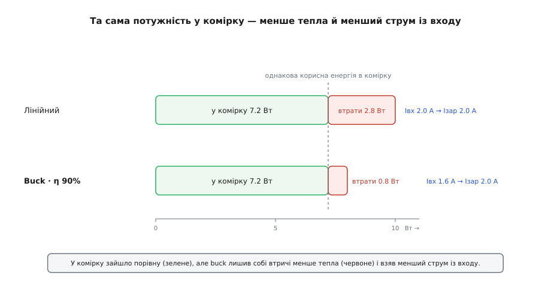
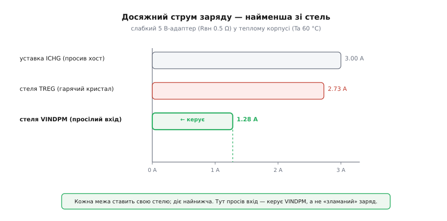

# 🧮 Баланс потужності buck-зарядника: скільки струму витягти з кволого входу

> Імпульсний зарядник віддає в батарею **більший** струм, ніж бере з входу. Це не фокус і не обхід законів фізики — це прямий наслідок того, що через перетворювач зберігається **потужність**, а не струм. Тут ми виводимо цей баланс через [buck](topic:hw-power/buck), рахуємо, скільки заряду реально вичавити з кволого USB-порту, і дивимось, як дві межі — просілий вхід і гарячий кристал — збивають той струм назад.

### Що зберігається насправді

Найпоширеніша інтуїтивна помилка про зарядник звучить так: «скільки струму зайшло з розетки, стільки й тече в батарею». Для лінійного зарядника це правда — прохідний транзистор увімкнений послідовно, і той самий струм тече через вхід, через чип і в комірку. Але імпульсний зарядник цього правила **не** тримається, і в цьому вся його сила.

Причина проста, коли її назвати. Через перетворювач зберігається не струм, а **потужність** — добуток напруги на струм. Ідеальний перетворювач без втрат виконував би:

```
Pвх = Pвих
Uвх · Iвх = Uсист · Iзаряду
```

Реальний перетворювач частину потужності лишає собі — гріється на опорі ключів, на перемиканні, на котушці. Цю частку описує **ККД** η (частка потужності, що дійшла до виходу), тож у житті рівняння таке:

```
Uвх · Iвх · η = Uсист · Iзаряду
```

Вузол на виході buck — це SYS, але під час заряду BATFET відкритий, і його падіння мале, тож напруга SYS практично дорівнює напрузі комірки: Uсист ≈ Uком. Якщо система в цей момент майже нічого не бере (весь вихід іде в батарею), то, розв'язавши рівняння відносно струму заряду, дістаємо серцевину всієї теми:

```
           Uвх
Iзаряду = ───── · η · Iвх
           Uком
```

Ось воно. Струм у комірку дорівнює струмові з входу, **помноженому на відношення напруг** Uвх/Uком і на ККД. А що напруга входу зазвичай **вища** за напругу комірки (5 В проти 3.6 В), то множник Uвх/Uком більший за одиницю — і струм на виході виходить більшим за струм на вході навіть після втрат.

Зручно ввести один число — **виграш по струму** G, у скільки разів струм у комірку більший за струм із входу:

```
        Iзаряду     Uвх
   G = ───────── = ───── · η
          Iвх       Uком
```

Для 5 В на вході, 3.6 В на комірці й η = 0.90:

```
G = (5 / 3.6) · 0.90 = 1.389 · 0.90 = 1.25
```

Тобто **1 А з USB обертається на 1.25 А в комірку**. Лінійний зарядник тут завжди має G = 1 рівно — і жоден трюк цього не змінить, бо в нього вхід і вихід — та сама послідовна гілка.

### Чому струм на виході більший: buck як «трансформатор постійного струму»

Формула формулою, а хочеться відчути **механізм**. Звідки береться зайвий струм? Хіба не порушується закон збереження заряду?

Ні — і ключ до розуміння в тому, що вхід і вихід buck **не з'єднані одним проводом**. Верхній ключ під'єднує котушку до входу лише **частину** періоду — цю частку називають скважністю D. Решту періоду верхній ключ закритий, вхід від котушки відрізаний, а струм у навантаження далі жене нижній ключ разом із запасеною в котушці енергією. Котушка тут — маховик: вона тримає **безперервний** вихідний струм, тоді як вхід бере струм лише **уривками**.

Порахуймо середні струми. Позначмо середній струм у котушці Iₗ — це і є вихідний струм, Iзаряду = Iₗ. З входу ж струм тече тільки коли відкритий верхній ключ, тобто частку D часу, і в ці миті він дорівнює Iₗ. Отже, усереднений за період вхідний струм:

```
Iвх = D · Iₗ = D · Iзаряду
```

А скважність ідеального buck задає саме відношення напруг: D = Uком/Uвх. Підставмо:

```
Iвх = (Uком/Uвх) · Iзаряду   →   Iзаряду/Iвх = Uвх/Uком
```

Той самий результат, що й із балансу потужності, тільки виведений з інший бік — через **час**, а не через енергію. Струм у комірку більший рівно тому, що вхід «підключений» лише частку D періоду: за той короткий доступ він мусить набрати всю потрібну енергію, тож у миті доступу тече сильно, а в середньому — слабко. Закон збереження заряду цілий: сумарний заряд, який зайшов з входу за період, менший за той, що вийшов, — просто тому, що виходу ще підкидає котушка.

> 🔧 **Навіщо це.** Аналогія — коробка передач. Низька передача міняє швидкість обертання на момент: колесо крутиться повільніше за двигун, зате штовхає сильніше, а добуток «оберти × момент» (потужність) зберігається. Buck робить те саме з електрикою: віддає менше вольтів, зате більше ампер, а добуток «вольти × ампери» тримає з точністю до ККД. Де аналогія ламається: у коробки передатне число фіксоване зубцями, а в buck воно — скважність D, яку контролер міняє щомиті. Саме тому той самий каскад уміє підлаштовуватися під будь-який вхід і будь-яку напругу комірки.

### Скільки заряду з кволого USB-порту

Тепер найпрактичніше питання: маємо благенький порт, який дає всього пів-ампера. Скільки з нього насправді натече в батарею?

**Приклад (USB-порт 5 В, 0.5 А).** Вхід віддає максимум Iвх = 0.5 А при 5 В; комірка 3.6 В; ККД 90%.

```
Потужність із входу:  Pвх = 5 · 0.5 = 2.5 Вт
Дійшло до виходу:     Pвих = 2.5 · 0.90 = 2.25 Вт
Струм у комірку:      Iзаряду = 2.25 / 3.6 = 0.625 А
```

Кволий порт на 500 мА заряджає комірку струмом **625 мА** — на чверть більше, ніж узяв. Лінійний зарядник у тих самих умовах дав би рівно 500 мА (та й ті довелося б ділити з системою). Різниця в 125 мА здається дрібницею, але на повному циклі це помітно коротший час заряду — і все задарма, з тієї самої розетки.

Це та сама арифметика, що ховається за фразою «1 А з USB обертається приблизно на 1.25 А в комірку»: підставте Iвх = 1 А — і дістанете Iзаряду = 0.9 · (5/3.6) · 1 = 1.25 А. Виграш по струму не залежить від того, скільки саме ампер дає джерело; він залежить лише від **відношення напруг і ККД**. Дасте вдвічі більший вхідний струм — отримаєте вдвічі більший виграш у тих самих 1.25 раза.

### Лінійний проти імпульсного: та сама енергія в комірку, менше тепла

Виграш по струму — це один бік медалі. Другий, не менш важливий, — **куди дівається тепло**. Порівняймо два зарядники, що ллють у комірку однаковий струм, за одним рахунком потужності.

**Приклад (заряд 2 А, вхід 5 В, комірка 3.6 В).**

Лінійний зарядник — керований опір; уся різниця напруг згоряє на ньому:

```
Лінійний:
  Pвх   = 5 · 2 = 10.0 Вт
  Pвих  = 3.6 · 2 = 7.2 Вт        (у комірку)
  Pвтр  = 10.0 − 7.2 = 2.8 Вт     (у тепло)
  η     = 7.2 / 10.0 = 72%
  Iвх   = 2.0 А                   (= Iзаряду)
```

Той самий заряд через buck із ККД 90%:

```
Buck:
  Pвих  = 3.6 · 2 = 7.2 Вт        (у комірку — те саме!)
  Pвх   = 7.2 / 0.90 = 8.0 Вт
  Pвтр  = 8.0 − 7.2 = 0.8 Вт      (у тепло)
  Iвх   = 8.0 / 5 = 1.6 А
```

У комірку зайшло **порівну — 7.2 Вт** в обох. Але лінійний, щоб це зробити, спалив на собі 2.8 Вт, а buck — лише 0.8 Вт: **у 3.5 раза менше тепла** на тому самому кристалику 3×3 мм. І з розетки buck узяв 1.6 А замість 2.0 А. Ось чому телефони пішли на складніший імпульсний каскад: не заради самого струму, а щоб не перетворювати кристал на грілку.


*Зелений відрізок — потужність, що дійшла до комірки; він однаковий в обох рядках. Червоний — втрати в чипі: у лінійного вони величезні, у buck куці. Праворуч — струми: buck бере з входу менше, ніж віддає в батарею.*

Варто одразу зняти дві ілюзії про ті 90%. По-перше, ККД **не сталий** — він [гуляє із навантаженням і напругами](topic:hw-power/converter-efficiency-curve): на малих струмах його з'їдають перемикання, на великих — опір ключів, тож 90% це радше типова точка, ніж закон. По-друге, ці «загублені» 10% не зникають у нікуди — вони [осідають на ключах, котушці й перемиканні](topic:hw-components/switching-losses) як тепло, і саме вони тримають чип теплим. Для конкретного чипа класу BQ25896 виробник наводить ККД близько 92.5% при 2 А і 90.5% при 3 А заряду — тобто наші 90% це чесна робоча оцінка, а не оптимізм.

### Вища напруга входу — ще більший струм у комірку

Формула Iзаряду = η·(Uвх/Uком)·Iвх ховає ще один важіль: множник Uвх/Uком росте, якщо **підняти напругу входу**. Саме тому швидка зарядка домовляється з адаптером про 9 чи 12 вольт замість п'яти — після [узгодження USB-PD](topic:com-devices/usb-pd) вхід стає високовольтним, і той самий вхідний струм дає куди більший струм заряду.

**Приклад (USB-PD, 9 В при 2 А, комірка 3.8 В, η = 92%).**

```
Потужність із входу:  Pвх = 9 · 2 = 18.0 Вт
Дійшло до виходу:     Pвих = 18.0 · 0.92 = 16.56 Вт
Струм у комірку:      Iзаряду = 16.56 / 3.8 = 4.36 А
Виграш по струму:     G = 4.36 / 2 = 2.18
```

З входу тече лише 2 А — а в комірку **4.36 А**, більш ніж удвічі. І тут ховається справжня причина, чому швидка зарядка полюбила високу напругу, а не просто високий струм. Щоб дати ті самі ~16.5 Вт у батарею з п'яти вольт, з розетки довелось би тягнути близько 3.7 А — і всі ці ампери пішли б **тонким USB-кабелем**, гріючи його на власному опорі (втрати в дроті ростуть як квадрат струму). А 9 В несуть ту саму потужність лише двома амперами: кабель ледь теплий, а множення струму до потрібних [«кількох C»](topic:hw-power/c-rate) відбувається вже в чипі, за сантиметр від комірки. Висока напруга — це спосіб протягти потужність крізь тонкий провід, а тоді розміняти її на струм там, де це безпечно.

### Дві стелі, що збивають струм заряду назад

Досі ми рахували так, ніби вхід віддає рівно стільки, скільки просимо, а чип лишається холодним. У житті обидва припущення часто ламаються, і тоді формула балансу дає лише **верхню оцінку** — а реальний струм притискають донизу два запобіжники.

**Стеля перша — просілий вхід (VINDPM).** Жодне джерело не тримає свою напругу залізно: у нього є внутрішній опір Rвн, і що більше струму тягнеш, то нижче [просідає його напруга під навантаженням](topic:hw-power/battery-sag): Uвх = Uₓₓ − Iвх·Rвн. Якщо жадібно нарощувати відбір, вхід просто завалиться в нуль. Щоб цього не сталося, чип тримає **поріг** VINDPM: щойно напруга входу просіла до нього, контур перестає збільшувати вхідний струм — фактично фіксує вхідну потужність на тому, що джерело віддає при цій напрузі.

**Приклад (слабкий адаптер: Uₓₓ = 5 В, Rвн = 0.5 Ω; поріг VINDPM = 4.4 В).** Поріг 4.4 В — це типова заводська уставка для 5-вольтового входу в чипах цього класу.

```
Струм на порозі:      Iвх = (Uₓₓ − Vпор)/Rвн = (5 − 4.4)/0.5 = 1.2 А
Потужність на порозі: Pвх = Vпор · Iвх = 4.4 · 1.2 = 5.28 Вт
Струм у комірку:      Iзаряду = 5.28 · 0.90 / 3.7 = 1.28 А
```

Спробуй чип відібрати «за паспортом» 2 А, і вхід просів би до 5 − 2·0.5 = 4.0 В — нижче порога 4.4 В, тобто в напівколапс. Тому VINDPM зупиняється раніше, на 1.2 А вхідних, і віддає в комірку 1.28 А. Зверніть увагу: це **не** гонитва за абсолютним максимумом потужності (той був би при просіданні аж до 2.5 В, та з такого напівзруйнованого входу вже не живиться система). VINDPM свідомо тримає вхід високим і чистим — і все одно витягує з невідомого адаптера майже все, що той може дати без завалу.

**Стеля друга — гарячий кристал (TREG).** Ті самі втрати Pвтр, що ми рахували, нікуди не діваються — вони гріють кристал. Перепад температури над довкіллям задає [тепловий опір Rθ від переходу до середовища](topic:ph-thermodynamics/thermal-resistance): Tj = Ta + Pвтр·Rθ. Коли Tj дістає порога теплового регулювання TREG, чип не вимикається різко, а плавно **зменшує струм заряду** рівно настільки, щоб утримати кристал на цьому порозі.

**Приклад (η = 90%, комірка 3.6 В, Rθ = 55 °C/Вт, Ta = 60 °C, TREG = 120 °C; хост просить 3.0 А).** У BQ25896 поріг TREG обирають із ряду 60/80/100/120 °C, і 120 °C — заводське значення.

```
Втрати при 3 А:   Pвтр = Pвих·(1−η)/η = (3.6·3)·(0.1/0.9) = 1.20 Вт
Температура:      Tj = 60 + 1.20·55 = 126 °C   → більше за 120, TREG втручається
Дозволені втрати: Pвтр,доп = (120 − 60)/55 = 1.09 Вт
Урізаний струм:   Iзаряду = 1.09 / (3.6 · 0.1/0.9) = 1.09 / 0.40 = 2.73 А
```

Хост просив 3.0 А, а кристал віддав лише **2.73 А** — решту відкотив, щоб не перевалити 120 °C. Тут варто відзначити чесну обставину: оскільки ККД високий, чип на повних 3 А розсіює всього ~1.2 Вт, тож TREG кусає лише в справді гарячих умовах — теплий корпус, тонка мідь під чипом, максимальний струм. Це і є нагорода за buck: лінійний на тих самих 2 А палив би 2.8 Вт і зварився б задовго до будь-якого «гарячого корпусу».

Обидві стелі можна записати формулою через ті самі величини — і тоді видно, що вони однорідні з рештою:

```
стеля VINDPM:  Iзаряду ≤ η · Vпор · (Uₓₓ − Vпор) / (Rвн · Uком)
стеля TREG:    Iзаряду ≤ η · (TREG − Ta) / (Rθ · Uком · (1 − η))
```

### Одна формула, у якій усе сходиться

Усі числа цієї вставки — це той самий [вибір мінімуму](topic:hw-power/error-amplifier), тільки виражений не через контури, а через **потужність**. Реальний струм у комірку — це найнижча з кількох стель, кожну з яких задає своя межа:

```
             ⎧ Iнабір                              ← уставка ICHG (що просив хост)
             ⎪ η · Uвх · Iвх,огр / Uком            ← ліміт вхідного струму (IINDPM)
Iзаряду = min⎨ η · Vпор · (Uₓₓ − Vпор)/(Rвн·Uком)  ← просілий вхід (VINDPM)
             ⎪ η · (TREG − Ta)/(Rθ · Uком · (1−η)) ← гарячий кристал (TREG)
             ⎩ …
```


*Для слабкого адаптера в теплому корпусі хост просить 3.0 А, тепло дозволяє 2.73 А, а просілий вхід — лише 1.28 А. Діє найнижча: заряд іде на 1.28 А, і «винен» не чип, а квола розетка.*

Коли на столі струм заряду впирається не туди, куди ви чекали, ця формула — готовий діагностичний список. Струм нижчий за заданий, хоча батарея порожня? Порахуйте кожну стелю: якщо винен вхід — множник Uвх/Uком або просідання втягнули VINDPM; якщо кристал теплий — межа (TREG − Ta)/Rθ. Майже завжди виявиться, що керує не «поламаний заряд», а слабке джерело чи тонкий кабель — рівно та стеля, яка зараз найнижча.
