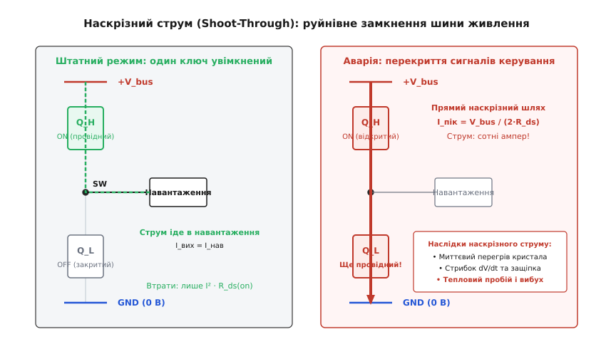
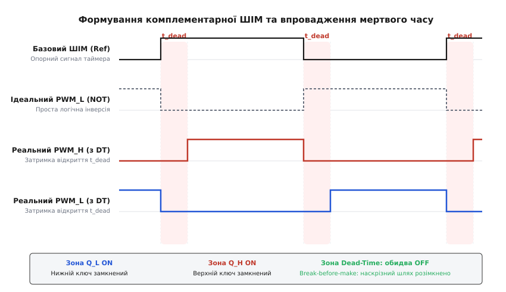
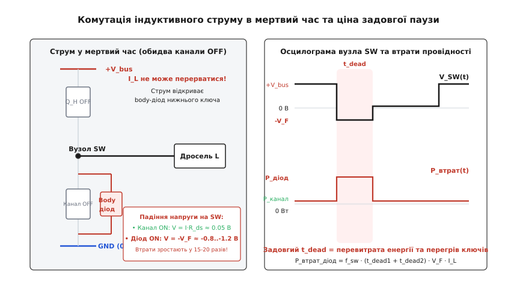
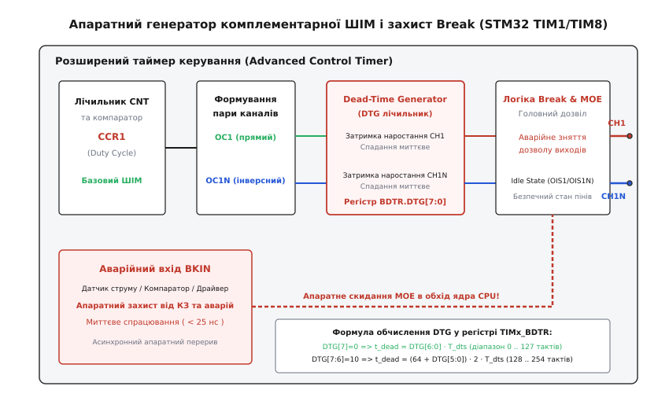

# Комплементарна ШІМ і мертвий час

<preknowlist>
- [Широтно-імпульсна модуляція](root:hw-analog/pwm) — регулювання середньої напруги шляхом зміни коефіцієнта заповнення імпульсів сталої частоти.
- [Силовий MOSFET-ключ](root:hw-components/mosfet-power-switch) — принцип роботи польового транзистора в ключовому режимі та його опір відкритого каналу.
- [Ємність затвора](root:hw-components/gate-capacitance) — паразитні ємності кристала, плато Міллера та кінцева швидкість перезаряду затвора.
- [Драйвер затвора](root:hw-power/gate-driver) — формування потужних струмів перезаряду ємностей затворів верхнього й нижнього ключів.
- [Синхронне випрямлення](root:hw-power/sync-rectifier) — заміна пасивного діода керованим транзистором для кардинального зменшення втрат провідності.
- [Півміст і H-міст](root:hw-motion/h-bridge) — топологія стійки ключів між шиною живлення й землею зі спільним вихідним вузлом.
</preknowlist>

У класичних імпульсних перетворювачах напруги нижнє плече схеми довгі десятиліття залишалося пасивним: коли верхній транзистор розмикав коло, струм накопичувального дроселя підхоплював напівпровідниковий діод Шотткі. Проте діод має нездоланне фізичне обмеження — пряме падіння напруги на p-n переході або бар'єрі метал-напівпровідник, що становить від 0.4 до 0.9 В. Коли сучасний перетворювач живить цифровий процесор напругою 1.2 В струмом 30 А, постійне падіння 0.6 В на діоді перетворює на чисте тепло 18 Вт потужності — більше, ніж споживає саме корисне навантаження. 

Щоб подолати цей глухий кут, пасивний діод замінили другим активним транзистором із наднизьким опором відкритого каналу (від одиниць до часток міліома). Відкритий канал створює на шляху струму падіння лише в кілька десятків мілівольтів замість майже вольта на діоді, піднімаючи коефіцієнт корисної дії перетворювача з 80% до 96–98%. Але ця заміна докорінно змінює логіку керування: тепер нижній транзистор не відкривається сам по собі фізикою струму, а вимагає власного активного керувального сигналу. Верхній і нижній ключі мусять працювати у суворій протифазі — коли один увімкнений, другий зобов'язаний бути вимкненим. Таке синхронне протифазне керування парою ключів однієї стійки отримало назву **комплементарна широтно-імпульсна модуляція** *(від латинського complementum — доповнення; сигнал другого ключа логічно доповнює сигнал першого)*.

### Кремнієва пастка: чому логічне заперечення спалює перетворювачі

На рівні булевої алгебри взаємне чергування сигналів здається тривіальним: якщо на верхній транзистор подається логічний сигнал `PWM_H`, то на нижній транзистор достатньо подати його інверсію `PWM_L = NOT PWM_H`. У теоретичній схемі без затримок у будь-який момент часу відкритий рівно один ключ, а середній вузол стійки поперемінно підключається то до позитивної шини живлення `V_bus`, то до землі `GND`.

Проте реальний напівпровідниковий кристал не є математичною абстракцією. Силовий польовий транзистор має відчутні внутрішні ємності між затвором, витоком і стоком (`C_gs`, `C_gd`), а вихідний каскад драйвера та опір доріжок мають скінченний опір. Щоб перевести транзистор у відкритий стан, у його затвор необхідно закачати електричний заряд, а щоб закрити — викачати цей заряд назад до нуля. 


*Зліва — штатний режим, коли струм іде в навантаження через один відкритий ключ. Справа — аварійне перекриття сигналів: через затримку вимкнення нижнього транзистора обидва канали одночасно проводять струм, утворюючи пряме коротке замикання шини живлення на землю.*

Процес вимкнення транзистора триває відчутний час (від десятків до сотень наносекунд) і проходить через так зване плато Міллера — область, де напруга на затворі тимчасово зависає на рівні порогового відкриття, поки через внутрішній опір драйвера стікає ємнісний заряд затвор-стік. Поки цей заряд не стече повністю, опір каналу залишається низьким, і транзистор продовжує проводити струм, хоча логічний рівень на вході вже впав у нуль.

Вимкнення транзистора практично завжди відбувається повільніше, ніж його вмикання. Якщо мікроконтролер одночасно подасть команду вимкнення на нижній ключ і команду ввімкнення на верхній, верхній транзистор стрімко відкриється за 15–30 нс, тоді як нижній ключ ще 60–100 нс залишатиметься прочиненим. У цей момент між шиною високої напруги `V_bus` та землею утворюється прямий нерозривний металізований канал із сумарним опором лише в десятки міліом.

Виникає явище **наскрізного струму** *(англ. shoot-through або cross-conduction — «простріл наскрізь», наскрізна провідність стійки)*. Струм короткого замикання через стійку обмежується лише паразитним опором кристалів і друкованих провідників:

```
I_shoot_peak = V_bus / (R_ds_on_H + R_ds_on_L + R_pcb)
```

При напрузі шини 48 В та сумарному опорі 20 мОм амплітуда імпульсу струму сягає 2400 А. За кілька десятків наносекунд у мікроскопічному об'ємі напівпровідникового кристала виділяється колосальна енергія `I² · R · Δt`. Густина струму перевищує критичну межу, виникає локальний перегрів, деградація p-n переходів, паразитна защіпка вбудованого біполярного транзистора структури MOSFET і вибухове руйнування корпусу деталі з відривом контактних розварок. Без надійного запобігання перекриттю жодна комплементарна силова схема не здатна пропрацювати навіть частки секунди.

> 🔧 **Навіщо це.** Залізне правило силового інженера: ніколи не подавайте пряму інверсію сигналу на протилежний ключ стійки. Фізична тривалість розпаду провідного каналу завжди відстає від логічного сигналу керування. Безпека схеми тримається на примусовому рознесенні моментів перемикання в часі.

### Принцип «розірви перед тим, як з'єднати» і впровадження мертвого часу

Єдиний надійний спосіб ліквідувати наскрізний струм — гарантувати, що перед відкриттям будь-якого транзистора протилежний ключ стійки вже повністю закрився, а його затворний заряд вичерпано до нуля. Для цього в керування впроваджують класичний електромеханічний принцип **«розірви перед тим, як з'єднати»** *(англ. break-before-make)*: спершу подається наказ на закриття провідного ключа, потім витримується захисна часова пауза, коли обидва канали примусово знеструмлені, і лише після цього надходить наказ на відкриття парного ключа.

Цей захисний інтервал між вимкненням одного транзистора та ввімкненням другого називається **мертвим часом** *(англ. dead-time — «мертвий час», оскільки протягом цієї паузи жоден із транзисторів активно не керує виходом)*.


*Формування комплементарної ШІМ: на кожному фронті перемикання сигнал спадання видається миттєво, а сигнал наростання затримується на апаратний інтервал t_dead. У виділених рожевих зонах обидва канали гарантовано закриті.*

Формування мертвого часу змінює часові діаграми імпульсів. Нехай базовий генератор ШІМ формує прямокутний імпульс бажаної тривалості. Апаратний блок формування комплементарних сигналів модифікує цей сигнал за таким алгоритмом:

```
Перехід 1 (вимикання нижнього ключа, вмикання верхнього):
  t = 0:          Нижній канал PWM_L скидається в 0 (миттєве вимкнення)
  0 < t < t_dead: Обидва канали PWM_H = 0 та PWM_L = 0 (захисна пауза)
  t = t_dead:     Верхній канал PWM_H встановлюється в 1 (затримане вмикання)

Перехід 2 (вимикання верхнього ключа, вмикання нижнього):
  t = T_on:               Верхній канал PWM_H скидається в 0 (миттєве вимкнення)
  T_on < t < T_on+t_dead: Обидва канали PWM_H = 0 та PWM_L = 0 (захисна пауза)
  t = T_on + t_dead:      Нижній канал PWM_L встановлюється в 1 (затримане вмикання)
```

Таким чином, тривалість активного високого стану верхнього сигналу скорочується на величину `t_dead`, а тривалість активного стану нижнього сигналу скорочується на ту саму величину `t_dead`. Фронт спадання кожного сигналу передається без затримок, тоді як кожен фронт наростання зсувається праворуч у часі на величину `t_dead`. Це повністю виключає геометричне перекриття керувальних сигналів на вході драйвера.

### Топологічні особливості: синхронний понижувач, підвищувач та двонаправлений потік енергії

Заміна пасивного діода комплементарним ключем докорінно змінює не лише тепловий баланс, а й саму топологічну поведінку перетворювача. У звичайному асинхронному понижувальному перетворювачі (Buck) діод проводить струм лише в одному напрямку — від землі до навантаження. Коли струм навантаження спадає до нуля (наприклад, у режимі очікування процесора), струм дроселя обривається, і перетворювач переходить у режим переривчастих струмів (Discontinuous Conduction Mode, DCM), де напруга вузла `SW` починає вільно коливатися.

У синхронному перетворювачі з комплементарною ШІМ нижній транзистор є двонаправленим провідником: металевий канал польового транзистора однаково добре проводить струм як від витоку до стоку, так і від стоку до витоку. 

Це породжує такі фізичні наслідки:

1. **Примусовий режим неперервних струмів (Forced Continuous Conduction Mode, FCCM):** Навіть коли зовнішній струм навантаження дорівнює нулю, перетворювач продовжує працювати в режимі жорсткої комутації. Під час фази відкритого нижнього ключа струм дроселя проходить через нуль і змінює напрямок на протилежний — починає текти **з вихідного конденсатора назад у дросель**. 
2. **Двонаправлений потік потужності (Four-Quadrant Operation):** Під час наступного такту, коли відкривається верхній ключ, накопичена в дроселі від'ємна енергія скидається назад у вхідне джерело живлення `V_bus`. Синхронний понижувач природним чином перетворюється на підвищувальний (Boost), який качає енергію у зворотному напрямку. Ця властивість є незамінною в рекуперативному гальмуванні електродвигунів, але стає шкідливою у простих джерелах живлення: на холостому ході виникають значні реактивні струми циркуляції, що марно спалюють енергію акумулятора на оми опорів `I_rms² · R_ds(on)`.
3. **Емуляція діода (Diode Emulation Mode / Pulse Skipping):** Щоб зберегти високий ККД на малих струмах, інтелектуальні контролери живлення містять швидкий компаратор нульового струму (Zero-Crossing Detector, ZCD). Щойно датчик струму фіксує проходження струму дроселя через нуль, комплементарний сигнал `PWM_L` достроково скидається в нуль, перекриваючи зворотний потік енергії та емулюючи роботу ідеального діода.

### Дилема тривалості: ціна завеликої паузи

На перший погляд здається, що для абсолютної надійності достатньо встановити мертвий час із великим запасом — наприклад, одну чи дві мікросекунди замість кількох десятків наносекунд. Проте надмірне збільшення мертвого часу породжує вторинні фізичні проблеми, які знижують енергетичну ефективність схеми та спотворюють форму вихідного сигналу.

Коли обидва транзистори напівмоста закриті під час мертвого часу, силове навантаження перетворювача не зникає. У 99% випадків навантаженням імпульсної стійки є індуктивний елемент — дросель стабілізатора напруги, первинна обмотка трансформатора або фазна обмотка електродвигуна. Згідно з фундаментальним законом електромагнітної індукції Фарадея, струм в індуктивності не може обірватися миттєво (`V = - L · di/dt` прямує до нескінченності при спробі розриву кола). Струм самоіндукції **змушений** продовжувати свій рух у тому самому напрямку.

Не маючи змоги пройти крізь закриті металеві канали транзисторів, цей струм знаходить інший фізичний шлях — він відкриває внутрішній зворотний **body-діод** *(англ. body diode — інтегральний антипаралельний діод, що неминуче утворюється між підкладкою і стоком у кремнієвій структурі польового транзистора)*.


*Під час мертвого часу індуктивний струм дроселя відкриває body-діод нижнього транзистора. Падіння напруги стрибає з 50 мВ до 0.9 В, спричиняючи різкий сплеск розсіювання тепла та просадку вихідного потенціалу вузла SW.*

У той момент, коли струм перехоплює body-діод, виникають дві важкі інженерні проблеми: різкий стрибок теплових втрат та ефект зворотного відновлення заряду.

#### 1. Втрати провідності на прямому падінні діода

Поки працює металевий канал відкритого транзистора, падіння напруги на ньому підпорядковується закону Ома: `V_drop = I · R_ds(on)`. Для сучасного MOSFET з опором `R_ds(on) = 3 мОм` при струмі 20 А падіння становить лише `20 А · 0.003 Ом = 0.06 В (60 мВ)`.

Але коли канал зачиняється на час `t_dead`, струм тече крізь кремнієвий p-n перехід body-діода. Пряме падіння напруги стрибком зростає до рівня `V_F ≈ 0.8–1.2 В` (а в високовольтних карбід-кремнієвих SiC-транзисторах — до 3.0–4.5 В). Миттєва розсіювана потужність втрат під час мертвого часу злітає в 15–20 разів:

```
P_канал = I² · R_ds(on) = 20² · 0.003 = 1.2 Вт
P_діод  = I · V_F       = 20 · 0.9    = 18.0 Вт
```

Середня потужність цих діодних втрат за період прямо пропорційна тривалості мертвого часу та частоті комутації:

```
P_dead_loss = 2 · f_sw · t_dead · V_F · I_load
```

Якщо перетворювач працює на високій частоті (наприклад, 200–500 кГц), сумарна тривалість двох пауз мертвого часу за період може складати відчутну частку циклу. Завищений мертвий час нівелює всю перевагу синхронного випрямлення, перетворюючи високоефективний конвертер на нагрівальний прилад.

#### 2. Заряд зворотного відновлення (Reverse Recovery Charge, Q_rr)

Внутрішній body-діод звичайного кремнієвого транзистора — це повільний діод із великим часом життя неосновних носіїв заряду. Коли струм тече крізь діод протягом інтервалу `t_dead`, у його базі накопичується просторовий заряд дірок і електронів.

Коли мертвий час добігає кінця й протилежний транзистор стійки відкривається, він намагається прикласти до закритого діода повну напругу живлення `V_bus`. Проте діод не може замкнутися, поки весь накопичений заряд `Q_rr` не буде викачаний у зворотному напрямку. На короткий час (20–60 нс) відкритий верхній транзистор працює практично на коротке замикання через зворотний струм відновлення нижнього діода:

```
P_rr = f_sw · Q_rr · V_bus
```

Сплеск струму зворотного відновлення `I_rr_peak` додається до комутаційних втрат верхнього транзистора, перегріває кристал і збуджує паразитні коливальні контури, утворені індуктивністю виводів і ємністю кристала. Це створює високочастотний дзвін (ringing) напругою в десятки вольт, який генерує потужні електромагнітні завади (ЕМЗ) та загрожує пробоєм діелектрика затвора.

Детальний аналітичний розрахунок втрат, балансу потужностей та формул оптимізації наведено в [🧮 математичному аналізі втрат і гармонік від мертвого часу](root:hw-power/complementary-pwm-generation/math-deadtime.md).

> 🔧 **Навіщо це.** Мертвий час завжди тримають у найвужчому безпечному коридорі: він має бути рівно настільки довгим, щоб перекрити найгірший час розряду затвора в усьому діапазоні температур, і ані на одну наносекунду довшим. Розрахункова точка відліку для більшості кремнієвих MOSFET лежить у межах 50–150 нс.

### Паразитні ефекти друкованої плати, dV/dt та хибне відмикання за Міллером

Існує вкрай небезпечна аварійна ситуація, коли мертвий час розрахований і витриманий бездоганно, але напівміст все одно вибухає від наскрізного струму при першому включенні під високою напругою. Причина криється у взаємодії крутих фронтів напруги з паразитними ємностями транзистора та індуктивностями друкованої плати.

Це явище називається **паразитним відмиканням за Міллером під дією dV/dt** *(англ. dV/dt-induced Miller turn-on)*:

1. Нехай нижній транзистор `Q_L` успішно вимкнувся, мертвий час сплив, і тепер починає стрімко відкриватися верхній транзистор `Q_H`.
2. Потенціал середнього вузла `SW` стрибає від 0 В до повної напруги шини `V_bus` зі швидкістю наростання `dV/dt` від 20 до 100 В/нс.
3. Цей колосальний стрибок напруги прикладений безпосередньо до стоку закритого нижнього транзистора `Q_L`. Через внутрішню ємність затвор-стік `C_gd` (ємність Міллера) починає текти ємнісний струм зміщення:
   ```
   I_miller = C_gd · (dV/dt)
   ```
4. Цей струм стікає в землю крізь внутрішній опір затвора `R_gate_int`, зовнішній резистор та відкритий вихідний n-канальний транзистор драйвера `R_driver_sink`.
5. На опорі кола затвора виникає падіння напруги:
   ```
   V_gs_induced = I_miller · (R_gate_int + R_gate_ext + R_driver_sink)
   ```
6. Якщо наведена напруга `V_gs_induced` перевищить порогову напругу відкриття транзистора `V_th` (яка для сучасних польових транзисторів становить лише 1.5–2.5 В і додатково знижується при нагріванні кристала), **нижній транзистор мимовільно прочиняється знову**.

У цей момент верхній ключ уже повністю відкритий, а нижній раптово відкривається сам по собі через наведену на затворі напругу. Виникає катастрофічний наскрізний струм, який неможливо усунути простим збільшенням тривалості мертвого часу, оскільки він виникає **після** закінчення паузи, під час активного фронту наростання напруги.

#### Інженерні методи придушення ефекту Міллера:

- **Активний затискач Міллера (Active Miller Clamp):** Сучасні драйвери напівмостів містять додатковий вивід `CLAMP` і внутрішній швидкодіючий ключ. Поки транзистор закритий, внутрішній ключ драйвера закорочує затвор безпосередньо на витік в обхід зовнішнього затворного резистора, знижуючи імпеданс розряду практично до нуля.
- **Негативна напруга закриття (Negative Gate Drive):** Замість нульового потенціалу драйвер подає на затвор закритого транзистора негативну напругу (наприклад, -3 В або -5 В). У такому разі наведений імпульс амплітудою навіть у +3 В підніме потенціал затвора лише до 0 В, що гарантовано нижче порога відкриття `V_th`.
- **Мінімізація індуктивності спільного витоку (Kelvin Source):** Паразитна індуктивність виводу витоку `L_source` утворює негативний зворотний зв'язок по струму (`V_L = L_source · di/dt`), який уповільнює розряд затвора. Використання корпусів із виділеним виводом витоку Кельвіна (TO-247-4, D2PAK-7) повністю ізолює керувальний контур затвора від силового контуру струму стоку.

### Спотворення вихідної напруги та вищі гармоніки в інверторах

У трифазних інверторах векторного керування електродвигунами (PMSM, BLDC, асинхронні приводи) та звукових підсилювачах класу D мертвий час викликає ще один шкідливий ефект — нелінійне спотворення вихідної вольт-секундної площі імпульсів.

Коли верхній і нижній транзистори одночасно закриті в паузі мертвого часу, потенціал вихідного вузла `SW` більше не контролюється сигналами мікроконтролера. Його стан цілком визначається **напрямком струму фази**, що тече через напівміст:

1. **Струм тече з напівмоста у двигун (`I_phase > 0`):** індуктивність намагається підтримати струм, підтягуючи потенціал `SW` нижче потенціалу землі. Відкривається **нижній** body-діод і фіксує вузол `SW` на рівні `-V_F ≈ 0 В`. Навіть якщо алгоритм керування планував тримати вихід під високим потенціалом, мертвий час примусово зануляє його. Вихідна напруга виявляється **меншою** за розрахункову.
2. **Струм втікає з двигуна в напівміст (`I_phase < 0`):** індуктивність виштовхує струм у шину живлення, піднімаючи потенціал `SW` вище `V_bus`. Відкривається **верхній** body-діод і притискає вузол `SW` до рівня `V_bus + V_F`. Вихідна напруга виявляється **більшою** за розрахункову.

У результаті кожна комутація мертвого часу вносить у вихідний сигнал паразитну похибку напруги `ΔV`, знак якої жорстко прив'язаний до знака струму навантаження:

```
ΔV_error = - sign(I_phase) · V_bus · (t_dead / T_sw)
```

При синусоїдальній формі струму функція `sign(I_phase)` перетворюється на прямокутний меандр тієї самої частоти. Додавання прямокутного меандру похибки до чистої синусоїди викликає такі наслідки:

- **Сходинка біля нульового струму (Zero-Crossing Distortion):** коли фазний струм переходить через нульову лінію, знак похибки стрибком змінюється на протилежний. На синусоїді виникає характерна «сходинка» або плоска ділянка.
- **Генерація непарних вищих гармонік:** спектральний розклад меандру похибки містить потужні 5-ту, 7-му, 11-ту та 13-ту гармоніки. У трифазному двигуні 5-та гармоніка обертає магнітне поле статора назад, а 7-ма — вперед. Це породжує паразипульсації обертального моменту на 6-кратній частоті (`6 · f_fund`), вібрацію вала та характерний акустичний писк двигуна.
- **Деградація просторово-векторної модуляції (SVPWM):** у системі координат d-q вектор напруги зміщується, спотворюючи регулювання потокозчеплення та моменту.
- **Деградація керування на малих швидкостях:** при роботі приводу на низьких обертах амплітуда бажаної напруги мала (кілька вольтів), тому постійна за амплітудою похибка від мертвого часу стає порівнянною з самим корисним сигналом, руйнуючи точність векторного позиціонування.

У сучасних промислових сервоприводах цю проблему вирішують алгоритмічно: сигнальний процесор вимірює миттєвий напрямок струму фази й автоматично додає компенсуючу поправку `+ΔV` або `-ΔV` до заданого коефіцієнта заповнення ШІМ у кожному циклі розрахунку.

### Апаратні генератори мертвого часу та захист Break у мікроконтролерах

Через критичну важливість часових інтервалів формування комплементарної ШІМ ніколи не реалізують програмним перемиканням виводів GPIO чи перериваннями процесора. Будь-яка затримка на обробку вищого за пріоритетом переривання або витіснення потоку в операційній системі реального часу (RTOS) викликала б тремтіння фронтів (jitter) і негайне спалення ключів.

Усі сучасні 32-бітні мікроконтролери для керування приводами й перетворювачами (серії STM32G4, STM32F4, TI C2000, Espressif ESP32) оснащені спеціалізованими апаратними таймерами з вбудованими блоками мертвого часу (Dead-Time Generator, DTG).


*Структурна схема вихідного каскаду розширеного таймера STM32 TIM1: блок порівняння формує опорний ШІМ, розгалужувач генерує прямий і комплементарний канали, лічильник DTG вставляє захисні паузи, а блок Break асинхронно гасить виходи при аварії.*

Розглянемо внутрішню архітектуру на прикладі розширених таймерів STM32 (Advanced Control Timers TIM1/TIM8):

#### 1. Комплементарні канали та конфігурація виходів

Таймер містить пари апаратних виводів для кожного каналу: прямий вихід `TIMx_CH1` (High-Side) та комплементарний `TIMx_CH1N` (Low-Side). Обидва сигнали синтезуються з єдиного регістра порівняння `CCR1`. У регістрах конфігурації захоплення/порівняння `CCER` задається активна полярність кожного виходу (`CC1P`, `CC1NP`), що дозволяє підлаштуватися під пряму або інверсну логіку вхідних каскадів драйвера.

У регістрі `TIMx_CR2` налаштовуються біти безпечного стану виводів при неактивному таймері (`OIS1`, `OIS1N` — Output Idle State). Якщо виходи відключені, апаратна логіка жорстко утримує обидва піни в заздалегідь визначеному стані (зазвичай нульовому), запобігаючи довільному відмиканню транзисторів стійки під час ініціалізації чи перепрошивки чипа.

#### 2. Генератор мертвого часу (Dead-Time Generator, DTG)

Регістр `TIMx_BDTR` містить 8-бітне конфігураційне поле `DTG[7:0]`. Внутрішній апаратний лічильник автоматично перехоплює фронти наростання сигналів і затримує їх на задану кількість тактів базової частоти `T_dts`.

Для покриття широкого діапазону тривалостей при збереженні високої роздільної здатності поле `DTG` розбите на чотири нелінійні діапазони:

```
DTG[7] = 0:     t_dead = DTG[6:0] · T_dts                 [діапазон 0..127 тактів, крок 1 такт]
DTG[7:6] = 10:  t_dead = (64 + DTG[5:0]) · 2 · T_dts     [діапазон 128..254 тактів, крок 2 такти]
DTG[7:5] = 110: t_dead = (32 + DTG[4:0]) · 8 · T_dts     [діапазон 256..504 тактів, крок 8 тактів]
DTG[7:5] = 111: t_dead = (32 + DTG[4:0]) · 16 · T_dts    [діапазон 512..1008 тактів, крок 16 тактів]
```

При частоті тактування ядра 168 МГц (`T_dts ≈ 5.95 нс`) перший діапазон дозволяє регулювати мертвий час із точністю до 6 наносекунд у межах до 755 нс (ідеально для швидких MOSFET та GaN транзисторів), а четвертий діапазон розширює паузу до 6 мікросекунд (для потужних модулів IGBT).

#### 3. Апаратний аварійний захист Break (Вхід BKIN)

Найважливіша функція розширеного таймера — наявність асинхронного входу аварійного захисту **Break** (`BKIN`, `BKIN2`). Цей вхід безпосередньо підключається до виходу аналогового компаратора струмового захисту або контакту аварії драйвера затвора (FAULT).

Коли на вході `BKIN` виникає активний рівень напруги:
1. Апаратна логіка таймера **повністю в обхід процесорного ядра** за час менше ніж 25 наносекунд скидає біт головного дозволу виходів `MOE` (Main Output Enable) у регістрі `TIMx_BDTR`.
2. Усі виходи ШІМ (`CH1..CH4`, `CH1N..CH3N`) миттєво переводяться в захисний стан `OIS`, закриваючи всі транзистори силового моста.
3. Одночасно генерується апаратне переривання `TIMx_BRK_IRQn`, яке сповіщає операційну систему про аварію.

Навіть якщо ядро мікроконтролера повністю зависло в нескінченному циклі або зупинене точкою зупину відладчика JTAG/SWD, апаратна лінія Break гарантовано знеструмить силову частину при короткому замиканні, рятуючи ключі від фізичного вибуху.

Практичні приклади ініціалізації регістрів STM32 LL та модулів ESP32 MCPWM наведено в [⚙️ конфігурації апаратних таймерів STM32 TIM1 та ESP32 MCPWM](root:hw-power/complementary-pwm-generation/proj-mcu-pwm.md).

### Практична методика вимірювання та налаштування на осцилографі

Налаштування мертвого часу в реальному пристрої ніколи не завершується виключно теоретичним розрахунком за паспортом транзистора. Реальний монтаж, довжина провідників, температура радіатора та технологічний розкид параметрів вимагають обов'язкової верифікації на вимірювальному стенді.

#### Методика вимірювання:

1. **Підключення вимірювальних щупів:** Дослідження напівмоста потребує щонайменше чотириканального осцилографа з високою смугою пропускання (не менше 200–500 МГц). Перший щуп підключають до напруги затвор-витік нижнього ключа `V_gs_L`, другий — через ізольований диференційний пробник до напруги затвор-витік верхнього ключа `V_gs_H`, а третій щуп — до потенціалу середнього вузла `V_SW`.
2. **Аналіз осцилограми вузла SW:** На сигналі напруги `V_SW` шукають характерну діодно-провідну сходинку. Перед тим, як напруга підніметься до `V_bus` (при ввімкненні верхнього ключа), напруга `V_SW` спочатку провалюється нижче нуля до рівня `-0.7..-1.2 В` — це body-діод веде струм під час мертвого часу. Тривалість цього негативного плато точно показує фактичний час роботи паразитного діода.
3. **Покрокова мінімізація:** Інженер поступово зменшує значення мертвого часу в прошивці, спостерігаючи за звуженням негативного плато на осцилографі. Мета регулювання — стиснути тривалість провідності діода до короткого сплеску в 10–20 нс.
4. **Контроль струму споживання шини живлення:** Паралельно осцилографу струмові кліщі стежать за постійним струмом шини живлення `I_bus`. Якщо мертвий час зменшити занадто сильно, на осцилограмі струму виникне різкий сплеск амперної амплітуди — це ознака початку наскрізного струму перекриття. Мертвий час негайно збільшують на 30–50% для забезпечення надійного запасу стабільності.

### Сучасна еволюція: GaN-транзистори та адаптивний мертвий час

Традиційні проблеми мертвого часу кардинально трансформуються з переходом силової електроніки на широкозонні напівпровідники — карбід кремнію (SiC) та нітрид галію (GaN).

Транзистори GaN HEMT (High Electron Mobility Transistor) мають дві революційні властивості:
1. **Відсутність фізичного p-n переходу:** у структурі GaN немає класичного body-діода, а зворотний струм замикається через той самий двовимірний електронний газ (2DEG). Тому заряд зворотного відновлення дорівнює нулю (`Q_rr = 0`). Комутація не супроводжується сплесками струму розсмоктування та високочастотним дзвоном.
2. **Надмалі ємності затвора:** час перемикання GaN становить одиниці наносекунд, що дозволяє скоротити мертвий час із класичних 100–200 нс до рекордних **5–15 нс**.

Паралельно розвивається технологія **адаптивного мертвого часу** *(англ. adaptive dead-time control)*. Інтелектуальний драйвер затвора не спирається на фіксований таймер із надлишковим запасом, а безперервно відстежує реальну напругу на вихідному вузлі `SW` за допомогою надшвидкого внутрішнього компаратора. Щойно напруга на вузлі `SW` природним чином доходить до протилежної шини під дією індуктивного струму (режим нульової напруги, ZVS — Zero Voltage Switching), драйвер миттєво відкриває відповідний транзистор.

Адаптивне керування автоматично підлаштовує тривалість паузи під миттєвий струм навантаження та температуру кристала в кожному окремому такті комутації, повністю виключаючи провідність паразитного діода та оптимізуючи енергетичну ефективність перетворювача до теоретичної фізичної межі.
