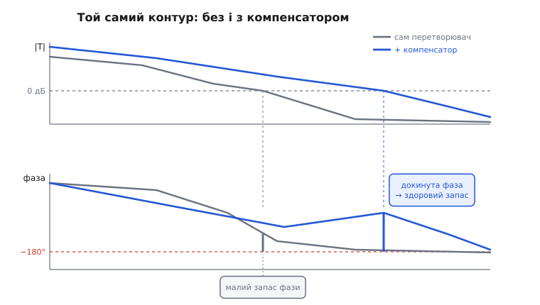
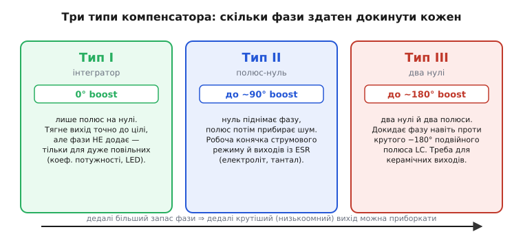
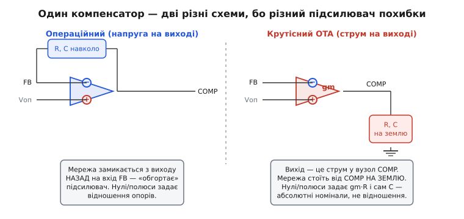

# Компенсатор і стійкість зворотного зв'язку DC-DC

Імпульсний перетворювач тримає вихід рівним контуром зворотного зв'язку: міряє напругу, порівнює з ціллю, підкручує шпаруватість. Але між «вихід просів» і «додана енергія дійшла назад до виходу» завжди минає час, і саме через це запізнення надто жвавий контур перестрибує ціль і розгойдує вихід у дзвін. Постає гостре питання: як зробити контур **і швидким, і спокійним**? Відповідь — не в тому, щоб послабити контур, а в тому, щоб **надати йому правильну форму**. Цим і займається **компенсатор** (від лат. *compensare* — зрівноважувати) — жменька резисторів і конденсаторів навколо підсилювача похибки, навмисне підібрана так, щоб контур був жвавий там, де треба, і стриманий там, де він схильний зірватися.

Тут ми розберемо саме **компенсатор**: що він фізично робить із контуром, які бувають його різновиди (їх звуть Тип I, II, III), як їх обирають під конкретний перетворювач, і чому та сама «схема компенсації» виглядає по-різному залежно від того, який усередині підсилювач похибки. Не задля виведення передатних функцій — а щоб розуміти, **що** саме крутить кожен резистор і **чому** заміна одного конденсатора здатна перетворити зразковий стабілізатор на генератор.

### Що взагалі означає «надати контуру форму»

Почнімо з головного факту, без якого нічого не станеться на місце. Стійкість контуру вирішує одна величина — **підсилення в контурі** (*loop gain*): у скільки разів і з яким зсувом фази сигнал міняється за один повний оберт по петлі «підсилювач похибки → силова частина → дільник → назад». Контур зривається в коливання, коли цей оберт повертає сигнал **у фазі із собою** (набіг фази −180°) і при цьому **не ослабленим** (підсилення ще ≥ 1). Два числа, якими міряють запас до цього зриву, — [запас фази й запас підсилення](root:hw-analog/stability-margins); практично інженер стежить передусім за **запасом фази** на частоті, де підсилення падає до одиниці (частота зрізу).

> 🔧 **Навіщо це.** Уся справа компенсації зводиться до одного числа — запасу фази на частоті зрізу. Здорові 45–60° означають, що плата переживе розкид деталей, нагрів і зміну навантаження й лишиться чемною. Менше 30° — на столі працює, а в полі дзвенить або співає. Компенсатор існує рівно для того, щоб цей запас підняти.

Тепер ключове спостереження. Повне підсилення в контурі — це **добуток** двох частин: підсилення **силової частини** (перетворювач від шпаруватості до виходу) і підсилення **компенсатора** (від похибки до шпаруватості). А раз добуток — то на діаграмі Боде їхні криві просто **додаються**. Силову частину ви змінити майже не можете: її форму диктують котушка, конденсатор і топологія. Зате компенсатор — цілком у ваших руках. Отже, задача проста на слух: **надати компенсаторові таку форму, щоб їхня сума мала гарний вигляд** — потрібну частоту зрізу й здоровий запас фази на ній.

А чому силова частина сама по собі негарна? Бо вона з'їдає фазу саме там, де болить. У знижувального buck пара котушка-конденсатор дає на своєму резонансі **подвійний полюс** — крутий завал підсилення на −40 дБ/декаду й, головне, різку втрату фази аж до −180°. Ця та інші риси описані [малосигнальною моделлю перетворювача](root:hw-power/small-signal-converter): рівний виграш на низах, подвійний полюс LC, нуль від паразитного опору конденсатора (ESR), а в boost — ще й підступний нуль правої півплощини. Якщо пропустити контур крізь таку силову частину «як є», фаза на частоті зрізу вже сповзе небезпечно близько до −180°, і запасу не лишиться. Компенсатор має цю фазу **повернути назад**.


*Що робить компенсатор, одним поглядом. Сам перетворювач (сіре): підсилення завалюється рано, фаза встигає сповзти майже до −180° — запас фази на частоті зрізу мізерний. Той самий контур із компенсатором (синє): підсилення підняте на низьких частотах (менша похибка), частота зрізу зсунута туди, де фаза ще здорова, а сам компенсатор докидає горб фази прямо коло зрізу. Це і є «надати контуру форму».*

### Серце компенсатора: інтегратор, що тягне похибку в нуль

Перше, що є в кожному компенсаторі, — **інтегратор**. На мові Боде це полюс на самому нулі частоти: підсилення на постійному струмі прямує до нескінченності й спадає, доки росте частота. Навіщо? Щоб **вибити статичну похибку геть**. Поки на виході є бодай крихітне відхилення від цілі, інтегратор його **накопичує** й додає до керування дедалі більше, аж поки похибка не стане точно нулем. Без інтегратора вихід стояв би трохи нижче цілі — рівно настільки, щоб дати контурові ненульовий сигнал для роботи. З інтегратором вихід сідає **точно** на ціль. Це та сама роль, що інтегральна частина грає в [ПІД-регуляторі](root:com-signal/discrete-pid), і будується вона так само — [конденсатором у зворотному зв'язку підсилювача похибки](root:hw-analog/integrator-differentiator).

Але за точність інтегратор бере плату — **фазою**. Полюс на нулі відразу й назавжди відкручує −90° фази по всьому діапазону. Тобто, ще нічого не зробивши, компенсатор уже витратив −90° із тих −180°, за якими зрив. Складіть це з −180° подвійного полюса силової частини — і ви глибоко за межею. Сам собою інтегратор робить контур точним, але **менш** стійким. Отут і починається справжня робота компенсатора: повернути втрачену фазу назад.

### Як докинути фазу: нуль

Полюс фазу відкручує вниз. Його протилежність — **нуль** — фазу підкручує **вгору**: кожен нуль додає на своїй околиці до **+90°** фази. Оце і є інструмент. Ідея компенсації в одному реченні: **поставити нуль (чи кілька) якраз нижче частоти зрізу, щоб на самому зрізі фаза була вже піднята — і запас фази здоровий**.

Простежмо механізм. Нуль починає підіймати фазу приблизно за декаду **до** своєї частоти й закінчує приблизно за декаду **після**. Тож якщо ми хочемо максимум фазового підйому саме на частоті зрізу, нуль ставлять помітно **нижче** за неї — щоб на зрізі опинитися вже на висхідній частині його дії. Один нуль може відіграти назад до +90° — рівно те, що відкрутив інтегратор. Поставили один нуль коло зрізу — і фаза, замість −180° сповзати, повертається в район −135°, тобто запас фази ~45°. Контур врятовано.

Чому б тоді не ліпити нулів багато? Бо нуль, підіймаючи корисну фазу, водночас **задирає підсилення на високих частотах** — а там живе шум комутації, пульсація, наводки з вузла перемикання. Компенсатор, що на високих частотах має великий виграш, старанно **підсилює саме цей бруд** і закачує його в шпаруватість, аж до тремтіння й хибних перемикань. Тому після нуля обов'язково ставлять **полюс** — щоб десь вище зрізу знову завалити підсилення й прибрати шум. Компенсатор — це завжди танець «нуль підняв фазу — полюс прибрав шум», підібраний так, щоб корисний підйом припав на зріз, а завал — на область шуму.

> 🔧 **Навіщо це.** Звідси випливає найпоширеніша порада даташитів: не ставте на вихід «кращий» конденсатор наосліп. Компенсатор налаштований під конкретне розташування нулів і полюсів, зокрема під нуль від ESR вихідного конденсатора. Заміните електроліт на кераміку з мізерним ESR — цей нуль поїде вгору, підйому фази на зрізі забракне, і [стійкий контур розхитається](root:hw-power/feedback-stability). Тому даташити задають діапазон допустимих C та ESR не заради пульсації, а заради збереження форми контуру.

### Три типи компенсатора: сходинка по фазі

На практиці компенсатори не винаходять щоразу — їх беруть із трьох стандартних форм, що відрізняються тим, **скільки фази здатні докинути**. Ці форми називають Тип I, Тип II і Тип III (термінологію ввів інженер Дін Венейбл). Різниця між ними — просто в кількості нулів.


*Три стандартні компенсатори як сходинка по фазовому підйому. Тип I — самий інтегратор, фази не додає взагалі: годиться лише там, де силова частина повільна й фазу не з'їдає. Тип II — інтегратор плюс пара нуль-полюс: докидає до ~90° фази, робоча конячка. Тип III — ще одна пара нуль-полюс: до ~180° підйому, коли треба перебороти крутий подвійний полюс LC. Що низькоомніший (керамічний) вихід — то більший підйом потрібен.*

**Тип I** — це самий інтегратор і нічого більше. Фази він не додає (навіть відкручує свої −90°), тож придатний лише там, де силова частина **сама по собі повільна й фазу майже не з'їдає**: керування коефіцієнтом потужності, драйвери світлодіодів, повільні зарядні контури. Для звичайного buck він заслабкий — контур вийде або млявим, або нестійким.

**Тип II** — інтегратор плюс **одна** пара «нуль-полюс». Нуль докидає фазу (до ~90°), полюс потім прибирає шум. Це **робоча конячка** імпульсних перетворювачів, надто у **струмовому режимі** керування (де силова частина поводиться простіше — ближче до одного полюса, а не двох) і на виходах з електролітичними чи танталовими конденсаторами, де власний нуль ESR уже підпирає фазу й багато докидати не треба.

**Тип III** — інтегратор плюс **дві** пари «нуль-полюс», тобто два нулі. Він здатен підняти фазу аж до ~180° — достатньо, щоб перебороти крутий подвійний полюс LC у **напруго-режимному** buck. Саме Тип III потрібен, коли вихід стоїть на **керамічних** конденсаторах: у них ESR настільки малий, що його нуль їде далеко вгору й на зрізі вже не помагає — увесь фазовий підйом мусить дати компенсатор. Плата за це — складніша схема (більше R і C) і трохи вища чутливість до шуму.

Отже, вибір типу — не смак, а наслідок фізики: **скільки фази з'їдає силова частина на частоті зрізу, стільки має докинути компенсатор**. Струмовий режим і «замащений» ESR-ом вихід — вистачить Типу II; напруго-режим із чистою керамікою — потрібен Тип III; повільне навантаження без фазової біди — досить Типу I.

### Куди саме ставити нулі й полюси: рецепт, а не наздогад

Сказати «постав нуль нижче зрізу» легко, а от **де саме** нижче — питання на точні числа. Тут криється спокуса крутити номінали наздогад, аж поки перестане дзвеніти. Але є акуратний рецепт, і саме він зробив компенсацію ремеслом, а не ворожінням, — **метод K-factor** (K-фактор), який 1983 року подав [Дін Венейбл](root:hw-power/control-loop-compensation/hist-venable.md).

Ідея методу — геометрична й на диво проста. Ви задаєте **дві** цілі: частоту зрізу fc (як швидко хочете контур) і запас фази на ній (як стійко). Метод рахує, скільки фази треба **докинути** на зрізі, а тоді розставляє нуль(і) й полюс(и) **симетрично навколо** fc так, щоб їхній сукупний підйом досяг максимуму саме там. Для Типу II нуль ставлять на fc/K, а полюс — на fc·K, де єдине число K випливає з бажаного підйому фази: більший підйом — ширше розсунуті нуль і полюс. Частота зрізу опиняється **геометричним центром** між нулем і полюсом — точкою, де фазовий горб найвищий.

```
Тип II, метод K-factor:
   потрібний підйом фази:  boost = ЗФ_ціль − ЗФ_силовоі − 90°   (−90° відкрутив інтегратор)
   коефіцієнт:             K = tan(45° + boost/2)
   нуль компенсатора:      f_нуль  = fc / K
   полюс компенсатора:     f_полюс = fc · K
```

Практична сила рецепта в тому, що ви йдете **від бажаного результату до номіналів**, а не навпаки: задав «зріз 50 кГц, запас 55°» — дістав конкретні R і C з кількох формул, часто з першого разу. Повне виведення цих формул для Типу II і Типу III, разом із передатними функціями кожного типу, — у [математичній вставці про метод K-factor](root:hw-power/control-loop-compensation/math-k-factor.md).

Одна важлива засторога до всякого рецепта: він відштовхується від **моделі** силової частини — від того, де сидить подвійний полюс LC і нуль ESR. Помилилися в номіналі котушки, ємності чи ESR — і нуль компенсатора стане не там, де фаза насправді потрібна. Тому після розрахунку контур **завжди перевіряють** — вимірюванням на живій платі (аналізатором частотної характеристики) або хоча б [тестом стрибком навантаження](root:hw-power/feedback-stability) на осцилографі: малий провал без дзвону — форму вгадано, дзвін — щось поїхало.

### Одна схема — два різні кола, бо різний підсилювач похибки

Тепер підступ, на якому спотикаються навіть ті, хто добре засвоїв типи. Компенсатор фізично будується **навколо підсилювача похибки** — того вузла, що порівнює сигнал зворотного зв'язку з опорною напругою. А підсилювачі похибки бувають **двох різних порід**, і від породи докорінно залежить, **як** саме навісити R та C, щоб вийшов, скажімо, Тип II.


*Той самий Тип II, дві несумісні схеми. Ліворуч — операційний підсилювач: на виході в нього **напруга**, тож мережа компенсації замикається з виходу **назад на вхід** FB, «обгортаючи» підсилювач; нулі й полюси задає **відношення** опорів. Праворуч — крутісний OTA: на виході в нього **струм** у вузол COMP, тож мережа стоїть від COMP **на землю**; нулі й полюси задають **абсолютні** номінали через gm·R. Переплутати схеми — зробити зайвий нуль полюсом і навпаки.*

Перша порода — звичайний **[операційний підсилювач у контурі](root:hw-power/error-amplifier)**: на його виході — **напруга**. Щоб зробити з нього компенсатор, мережу з резисторів і конденсаторів вішають так, що вона замикається **з виходу назад на інвертувальний вхід** (той самий вузол FB), «обгортаючи» підсилювач. Нулі й полюси тут задає **відношення** імпедансів — вхідного до зворотного, — тож абсолютні номінали резисторів у певних межах не важать, важить їхнє співвідношення. Це класична схема з [інтегратора на ОП](root:hw-analog/integrator-differentiator), лише з додатковими R і C для нулів-полюсів.

Друга порода — **крутісний підсилювач** (OTA, від англ. *operational transconductance amplifier*): на його виході не напруга, а **струм**, пропорційний різниці входів через [крутість gm](root:hw-analog/transconductance). Такий підсилювач вливає струм у окремий вивід — його зазвичай звуть **COMP** — і мережу компенсації вішають зовсім інакше: **від COMP на землю**, а не назад на вхід. Тепер нуль і полюс задають уже не відношення, а **абсолютні** номінали через добуток gm·R: та сама послідовна RC-ланка від COMP до землі дає нуль на 1/(2π·R·C) і робочий виграш, пропорційний gm·R.

Звідси суто практичний висновок, який рятує години. **Формула типу спільна, а схема — ні.** Побачивши в даташиті вивід COMP і слово «transconductance» чи «gm», ви знаєте: мережа йде **на землю**, і рахувати треба через gm та абсолютні номінали. Побачивши повноцінний операційний підсилювач похибки з доступом до інвертувального входу — мережа **обгортає** його, і в грі відношення опорів. Узяти схему компенсації від OTA-контролера й наліпити на ОП-контролер (чи навпаки) — певний спосіб дістати не той нуль там, де мав бути полюс, і розхитати контур, який на папері був бездоганний.

### Worked-приклад: порахувати Тип II методом K-factor

Порахуймо компенсатор Типу II для типового струмово-режимного buck на крутісному підсилювачі. Нехай силова частина на частоті зрізу дає фазу −65° (одиничний полюс плюс трохи від інших ефектів), а ми хочемо зріз fc = 50 кГц із запасом фази 60°. Порахуємо, скільки фази докинути, знайдемо K і розставимо нуль-полюс, а тоді переведемо в номінали. Код короткий і робить рівно ту саму арифметику, що інженер зробив би на папері.

**Дано:** fc = 50 кГц; фаза силової частини на fc дорівнює −65°; ціль по запасу фази 60°; крутість підсилювача gm = 1.2 мА/В; потрібний робочий виграш компенсатора на середніх частотах A = 8 разів (він задає розташування контуру по рівню).

:::tabs
```c
#include <stdio.h>
#include <math.h>

int main(void) {
    const double fc  = 50.0e3;     // бажана частота зрізу, Гц
    const double pm_goal = 60.0;   // бажаний запас фази, градуси
    const double ph_plant = -65.0; // фаза силовоі частини на fc, градуси
    const double gm  = 1.2e-3;     // крутість підсилювача похибки, А/В
    const double A   = 8.0;        // робочий виграш компенсатора, рази

    // 1. скільки фази має докинути пара нуль-полюс над −90° інтегратора
    //    boost = запас_ціль − фаза_силовоі − 90°
    double boost = pm_goal - ph_plant - 90.0;
    printf("boost = %.1f deg\n", boost);               // 35.0

    // 2. коефіцієнт K із потрібного підйому
    double K = tan((45.0 + boost/2.0) * M_PI/180.0);
    printf("K = %.3f\n", K);                            // ~1.921

    // 3. нуль і полюс — симетрично навколо fc (fc — їхній геом. центр)
    double f_zero = fc / K;
    double f_pole = fc * K;
    printf("f_нуль  = %.0f Hz\n", f_zero);              // ~26030
    printf("f_полюс = %.0f Hz\n", f_pole);              // ~96040

    // 4. номінали для OTA-схеми (послідовна ланка R2+C1 від COMP на землю,
    //    плюс малий C2 паралельно на полюс):
    double R2 = A / gm;                                 // виграш gm·R2 = A  →  R2, Ом
    double C1 = 1.0 / (2.0*M_PI*R2*f_zero);             // нуль,  Ф
    double C2 = 1.0 / (2.0*M_PI*R2*f_pole);             // полюс, Ф
    printf("R2 = %.0f Ohm\n", R2);                      // ~6667
    printf("C1 = %.0f pF\n", C1*1e12);                  // ~918
    printf("C2 = %.0f pF\n", C2*1e12);                  // ~249
    return 0;
}
```
```python
import math

fc       = 50.0e3   # бажана частота зрізу, Гц
pm_goal  = 60.0     # бажаний запас фази, градуси
ph_plant = -65.0    # фаза силовоі частини на fc, градуси
gm       = 1.2e-3   # крутість підсилювача похибки, А/В
A        = 8.0      # робочий виграш компенсатора, рази

# 1. скільки фази має докинути пара нуль-полюс над −90° інтегратора
#    boost = запас_ціль − фаза_силовоі − 90°
boost = pm_goal - ph_plant - 90.0
print(f"boost = {boost:.1f} deg")               # 35.0

# 2. коефіцієнт K із потрібного підйому
K = math.tan(math.radians(45.0 + boost/2.0))
print(f"K = {K:.3f}")                           # ~1.921

# 3. нуль і полюс — симетрично навколо fc (fc — їхній геом. центр)
f_zero = fc / K
f_pole = fc * K
print(f"f_нуль  = {f_zero:.0f} Hz")             # ~26030
print(f"f_полюс = {f_pole:.0f} Hz")             # ~96040

# 4. номінали для OTA-схеми (послідовна ланка R2+C1 від COMP на землю,
#    плюс малий C2 паралельно на полюс):
R2 = A / gm                                     # виграш gm·R2 = A  →  R2, Ом
C1 = 1.0 / (2.0*math.pi*R2*f_zero)              # нуль,  Ф
C2 = 1.0 / (2.0*math.pi*R2*f_pole)              # полюс, Ф
print(f"R2 = {R2:.0f} Ohm")                     # ~6667
print(f"C1 = {C1*1e12:.0f} pF")                 # ~918
print(f"C2 = {C2*1e12:.0f} pF")                 # ~249
```
:::

Покрокова арифметика, щоб бачити, звідки числа:

```
підйом пари нуль-полюс:  boost = 60 − (−65) − 90 = 35°
K = tan(45° + 35°/2) = tan(62.5°) ≈ 1.921
нуль:   50 000 / 1.921 ≈ 26.0 кГц
полюс:  50 000 · 1.921 ≈ 96.0 кГц
R2 = 8 / 0.0012 ≈ 6.67 кОм         (виграш gm·R2 = 8)
C1 = 1/(2π·6667·26000) ≈ 918 пФ    (нуль)
C2 = 1/(2π·6667·96000) ≈ 249 пФ    (полюс, прибирає шум)
```

Висновок: три деталі — R2 ≈ 6.8 кОм, C1 ≈ 1 нФ, C2 ≈ 240 пФ від виводу COMP на землю — дають контур зі зрізом коло 50 кГц і запасом фази ~60°. Числа округлюють до найближчого ряду E12 і **перевіряють на живій платі**: рецепт дає гарну відправну точку, а останнє слово — за виміряною характеристикою, бо реальні ESR, паразити й розкид gm завжди трохи зсувають картину.

### Пастка умовної стійкості й межа наздогад-крутіння

Наостанок — про пастку, що виглядає безневинно. Іноді контур роблять **умовно стійким**: фаза десь усередині діапазону встигає торкнутися −180°, але саме там підсилення ще високе (більше за одиницю), тож формально зриву немає — обоє ворота одночасно не відчиняються. Такий контур працює й буває навіть швидким. Небезпека в тому, що він втрачає стійкість не лише коли підсилення **росте**, а й коли воно **падає**: варто виграшу просісти (стара батарея, гаряча мікросхема, менше навантаження) — і точка зрізу може сповзти якраз у ту западину фази. Тому умовну стійкість застосовують свідомо й з великим запасом, а не випадково натрапляють на неї, крутячи номінали.

Це підводить до головного правила культури компенсації. Крутити R та C **наздогад**, доки перестане дзвеніти на столі, — оманливо: ви налаштуєтеся на одну точку (одна температура, один екземпляр, одне навантаження) і не знатимете, скільки запасу лишилось на всі інші. Правильний шлях — рахунок (метод K-factor чи фірмовий калькулятор даташита) плюс **перевірка в кутах**: мінімальний і максимальний вхід, мале й повне навантаження, гарячий і холодний стан. Компенсатор, що тримає запас фази в усіх кутах, — оце і є по-справжньому приборканий контур; той, що ледь тримається в одній зручній точці, зрадить у полі.

> 🔧 **Навіщо це.** У сучасних інтегрованих перетворювачах компенсатор дедалі частіше **вже зашитий усередину** під типовий вихід — тоді вам лишається тільки не виходити за рекомендовані даташитом діапазони котушки й конденсаторів, під які його й розраховано. Ручна компенсація потрібна там, де контролер дає вивід COMP назовні: гнучкість повна, але й відповідальність — розставити нулі й полюси й перевірити запас — тепер на вас.

### Що з цього забрати

Компенсатор — це не «ще один блок», а **інструмент надання контурові форми**. Повне підсилення в контурі є добутком силової частини (яку ви майже не міняєте) і компенсатора (який цілком ваш), тож на Боде їхні криві додаються — і задача зводиться до того, щоб їхня сума мала потрібну частоту зрізу й здоровий запас фази на ній. Серце компенсатора — **інтегратор**: він тягне статичну похибку в нуль, але коштує −90° фази. Повертає фазу назад **нуль**, поставлений нижче зрізу; за ним іде **полюс**, щоб прибрати комутаційний шум. Скільки нулів — стільки й фазового підйому: **Тип I** (самий інтегратор, 0° — для повільних навантажень), **Тип II** (один нуль, до 90° — робоча конячка струмового режиму й ESR-виходів), **Тип III** (два нулі, до 180° — для напруго-режиму й керамічних виходів). Розставляють нулі й полюси не наздогад, а **методом K-factor**: від бажаних зрізу й запасу фази — до конкретних номіналів. І пам'ятайте про дві породи підсилювача похибки: у **операційного** мережа обгортає його з виходу на вхід (грають відношення опорів), у **крутоспадного OTA** — стоїть від виводу COMP на землю (грають абсолютні номінали через gm). Порахований контур завжди перевіряють на живій платі, у кутах діапазону, — бо реальні ESR і паразити роблять останнє слово, а не формула.
