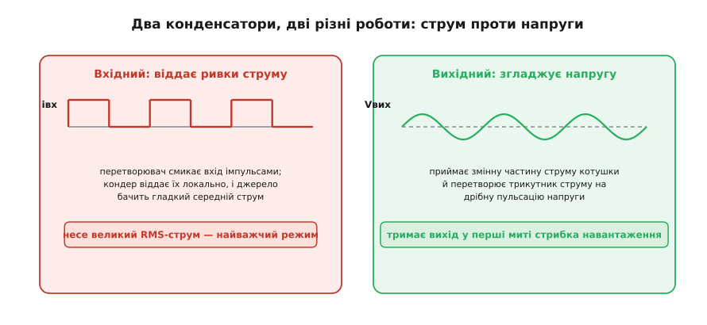
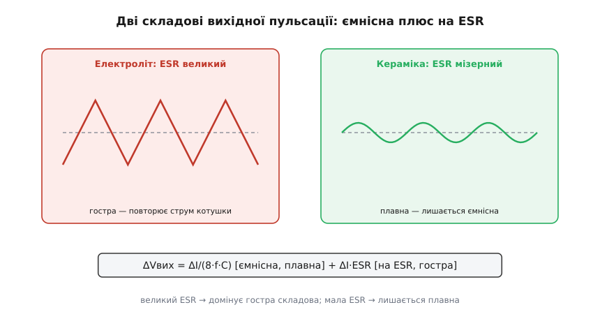
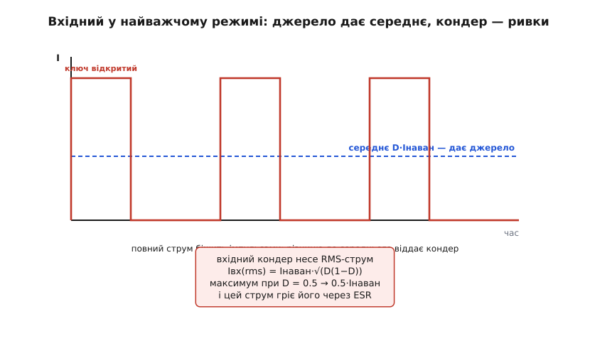
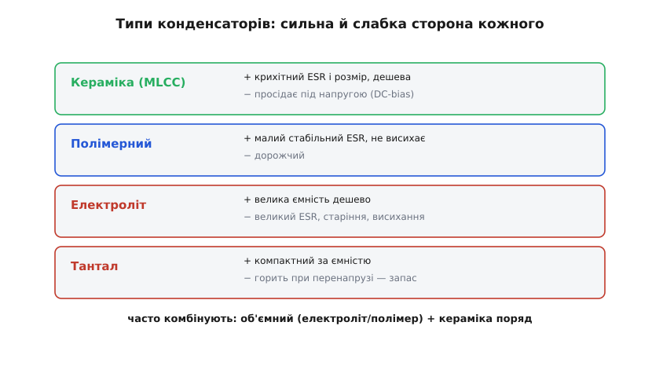
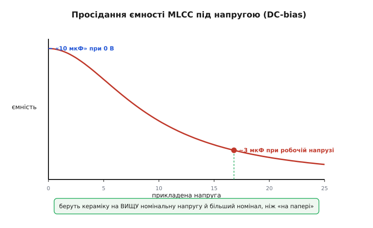
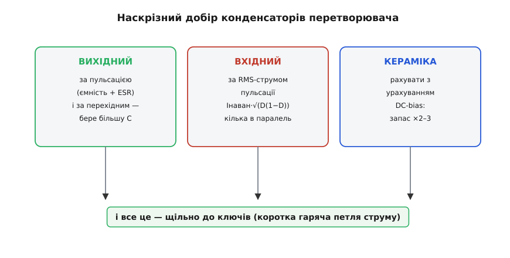

# Конденсатори перетворювача

Котушка не працює сама — обабіч перетворювача стоять [конденсатори](root:hw-components/capacitor), і їх двоє різних, із геть різними завданнями. Вихідний бореться з пульсацією напруги; вхідний — із ривками струму, і саме він, усупереч інтуїції, опиняється в найважчому режимі. Спільний лиходій обох — паразитний опір ESR (англ. *equivalent series resistance*, еквівалентний послідовний опір), той самий внутрішній опір, що перетворює пульсуючий струм на тепло й на зайву пульсацію напруги.

### Дві ролі: вхідний і вихідний


*Вхідний конденсатор стоїть на боці струму: перетворювач смикає вхід імпульсами, і конденсатор віддає ці ривки локально, тож джерело бачить гладкий середній струм. Через нього тече великий діючий струм — найважчий режим. Вихідний конденсатор стоїть на боці напруги: згладжує трикутник струму котушки в дрібну пульсацію напруги й тримає вихід під час стрибка навантаження.*

Дві ролі легко сплутати, бо «конденсатор для згладжування» звучить однаково. Та вихідний конденсатор працює з **напругою**: він приймає змінну частину струму котушки й перетворює її на дрібну пульсацію вихідної напруги, а ще тримає вихід у перші миті стрибка навантаження. Вхідний натомість працює зі **струмом**: [понижувальний перетворювач](root:hw-power/buck) смикає з входу різкі імпульси (повний струм, поки ключ відкритий, і нуль, поки закритий), і вхідний конденсатор мусить ці імпульси віддавати локально, щоб батарея чи джерело бачили гладкий струм.

### Вихідний: ESR і пульсація напруги

Вихідну пульсацію [понижувального перетворювача](root:hw-power/buck) задають дві складові, і ESR — ключ до того, яка з них домінує.


*Повна пульсація — сума ємнісної складової (ΔI/8fC, плавна, спадає з більшою ємністю) і складової на ESR (ΔI·ESR, гостра, у фазі зі струмом котушки). З електролітом ESR великий, тож домінує гостра складова; з керамікою ESR мізерний, і лишається плавна ємнісна.*

```
ΔVвих = ΔI/(8·f·C)   [ємнісна]   +   ΔI·ESR   [на ESR]
```

Перша складова спадає з більшою ємністю, друга — з меншим ESR. У старих **електролітичних** конденсаторах ESR великий (десятки-сотні міліом), тож пульсація напруги майже повторює трикутник струму — домінує доданок на ESR. У сучасній **кераміці** ESR мізерний (одиниці міліом), і лишається переважно плавна ємнісна складова. Саме тому на виходи перетворювачів ставлять кераміку: вона прибирає гостру складову майже повністю.

**Приклад (вихідна пульсація).** Вузол: ΔI ≈ 1.03 А, f = 500 кГц, кераміка з ESR ≈ 3 мОм:

```
на ESR:   ΔV = ΔI·ESR = 1.03·0.003 ≈ 3 мВ        (крихітна)
ємнісна:  щоб ΔVємн ≈ 20 мВ:  C = ΔI/(8·f·ΔV)
          = 1.03 / (8·500·10³·0.02) ≈ 13 мкФ
```

З керамікою доданок на ESR (3 мВ) майже не видно, а пульсацію визначає ємність: ~13 мкФ дають ~20 мВ — у межах технічного завдання (≤50 мВ).

> 🧮 **Числове порівняння у вставці.** Наскільки по-різному поводяться кераміка й електроліт (7.7 мВ ємнісної проти 136 мВ на ESR — попри вдесятеро більшу ємність) і яку стратегію зменшення пульсації обрати для кожного — у математичній вставці [🧮 Дві складові пульсації](root:hw-power/converter-caps/math-ripple-esr.md).

### Вихідний і перехідний процес

Пульсацією добір вихідного конденсатора не закінчується. За [технічним завданням](root:hw-power/converter-spec) на стрибку навантаження вихід не сміє провалитися глибше за ΔVмакс. У перші миті стрибка, поки контур ще не відреагував, увесь додатковий струм віддає саме вихідний конденсатор — за рахунок запасеної енергії. Тому вимога на перехідний процес часто диктує **більшу** ємність, ніж сама пульсація.

Прикиньмо: стрибок 0.5 → 3 А (ΔIнаван = 2.5 А), контур реагує за ~10 мкс, провал ≤ 150 мВ. Грубо конденсатор має віддати цей струм за час реакції, не просівши понад межу:

```
C ≳ ΔIнаван · Δt / ΔV = 2.5 · 10·10⁻⁶ / 0.15 ≈ 167 мкФ
```

Це на порядок більше за 13 мкФ, потрібні для самої пульсації. Отже, вихідну ємність визначає **жорсткіша** з двох вимог — і тут це перехідний процес, а не пульсація. Звідси й практика: кілька керамічних конденсаторів у паралель, щоб набрати і ємність для перехідного, і низький ESR для пульсації.

> 🔧 **Навіщо це.** Рахуючи вихідний конденсатор, перевірте обидві вимоги — пульсацію й перехідний процес — і візьміть більшу ємність. Найчастіша помилка: підібрати ємність лише за пульсацією, а тоді ловити просадки й перезавантаження на стрибках навантаження, бо запасеної енергії забракло.

### Вхідний: найважчий режим

Найбільш навантажена деталь живлення — часто саме вхідний конденсатор. Чому?


*Понижувальний перетворювач смикає з входу струм імпульсами: повний струм навантаження, поки ключ відкритий, і нуль, поки закритий. Джерело має давати лише середнє (D·Iнаван), а всю різницю — гострі ривки — бере на себе вхідний конденсатор. Через нього тече великий діючий струм Iнаван·√(D(1−D)), і цей струм гріє його через ESR.*

Понижувальний перетворювач бере з входу рваний струм, а батарея чи джерело з довгим дротом такого не люблять (дріт має [індуктивність](root:ph-electromagnetism/inductance), і на ривках виникає дзвін і завади). Тому вхідний конденсатор ставлять локально, щоб він віддавав ці імпульси сам, а джерело бачило гладкий середній струм. Платою є великий діючий струм пульсації (англ. *RMS*, *root mean square* — корінь із середнього квадрата), що тече крізь конденсатор:

```
Iвх(rms) ≈ Iнаван · √(D·(1−D))   — максимум при D=0.5 (≈ 0.5·Iнаван)
```

**Приклад (діючий струм вхідного).** Vвх = 16.8 В, Vвих = 5 В, D = 0.30, Iнаван = 3 А:

```
Iвх(rms) ≈ 3 · √(0.30·0.70) = 3 · √0.21 ≈ 3 · 0.46 ≈ 1.4 А
```

Цей струм тече крізь ESR конденсатора й гріє його (Irms²·ESR), тож вхідний добирають за діючим струмом, а не лише за ємністю. Конденсатор із замалим рейтингом діючого струму перегріється й помре першим — і це найчастіша причина «несподіваної» відмови живлення. Часто доводиться ставити кілька конденсаторів у паралель, щоб розподілити цей струм.

Є й друга причина, чому вхідний конденсатор критичний, — **швидкість** цих ривків. Струм перемикається за наносекунди, а будь-який дріт чи доріжка має [індуктивність](root:ph-electromagnetism/inductance); різкий di/dt на цій індуктивності дає викид напруги (V = L·di/dt) і дзвін на вході. Якщо вхідний конденсатор далеко від ключів, петля струму довга, її індуктивність велика — і дзвін б'є по входу й випромінюється завадами. Тому вхідну кераміку тулять впритул до ключів, замикаючи цю гарячу [петлю струму](root:hw-power/converter-layout) якомога коротше. Вхідний конденсатор — це не лише запас заряду, а й глушник високочастотного дзвону.

> 🔧 **Навіщо це.** Не недооцінюйте вхідний конденсатор: за діючим струмом він нерідко найважче навантажена деталь усього вузла. Дивіться в даташит не лише ємність, а й допустимий пульсаційний струм (та ще й при робочій температурі — у спеку він нижчий), і беріть із запасом. Згоріла «на рівному місці» зарядка — часто це засохлий чи перегрітий вхідний конденсатор.

### Типи: кераміка, полімер, електроліт, тантал

Який конденсатор куди — залежить від типу.


*Кераміка (MLCC): крихітний ESR і розмір, але просідає під напругою. Полімерний: малий ESR, стабільний, дорожчий. Електроліт: велика ємність, але великий ESR і старіння. Тантал: компактний, та горить при перенапрузі. Часто комбінують об'ємний (електроліт чи полімер) із керамікою поряд.*

- **Кераміка** (MLCC, англ. *multilayer ceramic capacitor*, багатошаровий керамічний конденсатор) — крихітний ESR, малий розмір, дешева; ідеальна для пульсації й високих частот. Вада — просідання ємності під напругою і схильність до мікротріщин та «співу».
- **Полімерний** — малий стабільний ESR, велика ємність, не висихає; чудовий, але дорожчий. Часто заміняє електроліт там, де важить ESR.
- **Електролітичний** (алюмінієвий) — велика ємність дешево, але великий ESR, старіння й висихання (особливо в спеку). Для об'ємного накопичення, не для високих частот.
- **Тантал** — компактний за ємністю, середній ESR; небезпечний тим, що при перенапрузі може **загорітися**, тож вимагає запасу за напругою.

Тут діє правило **запасу за напругою**, як і [з котушкою](root:hw-power/converter-inductor): конденсатор на 25 В не ставлять на 25-вольтову шину — беруть із запасом, типово ×1.5–2, бо реальні сплески перевищують номінал, а близька до межі деталь старіє швидше (тантал так і поготів). Окрема історія — ресурс електроліта: він поступово **висихає**, і то швидше, що гарячіше (кожні +10 °C приблизно вдвічі коротять життя — це закон Арреніуса для дифузії електроліту). Тому в гарячому вузлі електроліт — слабка ланка надійності, і там, де можна, його заміняють полімером чи керамікою.

Звідси поширена практика — **комбінувати**: великий об'ємний конденсатор (електроліт чи полімер) тримає низькочастотну енергію, а дрібна кераміка поряд гасить високочастотну пульсацію й ривки. Так дістають і ємність, і низький ESR на всіх частотах.

Чому саме разом? Бо в кожного конденсатора **імпеданс залежить від частоти**, і жоден не добрий на всьому діапазоні. Великий електроліт має багато ємності, але його власна індуктивність і ESR роблять його «глухим» на високих частотах — швидкий ривок він не встигає віддати. Дрібна кераміка навпаки: ємності мало, зате імпеданс малий аж до десятків мегагерц — вона миттєво гасить гострі фронти. У паралель вони дають низький імпеданс і на низах (об'ємний тримає енергію), і на верхах (кераміка ловить фронти) — рівно те, що треба перетворювачу, який працює одразу на багатьох частотах.

### Підступ кераміки: просідання під напругою

Кераміка має одну пастку, на якій спотикаються всі новачки, — **просідання ємності під напругою** (англ. *DC bias*, зміщення постійною напругою).


*Ємність MLCC падає зі зростанням прикладеної напруги: конденсатор, маркований «10 мкФ», при робочій напрузі може дати лише ~3 мкФ. Тому беруть кераміку на вищу номінальну напругу й більший номінал, ніж потрібно «на папері».*

Маркована ємність MLCC — це значення при **нулі** вольт. Прикладіть робочу напругу — і ємність обвалюється: «10 мкФ» при напрузі, близькій до номінальної, можуть стати 3–4 мкФ. Причина — у властивостях діелектрика (титанату барію), що змінюється під полем: домени поляризуються вздовж поля й перестають додавати ємність. Наслідок жорсткий: якщо порахували, що треба 13 мкФ, і поставили один «10 мкФ» — реально матимете втричі менше, і пульсація вийде поза технічне завдання.

Рятунок — **запас**: брати кераміку на вищу робочу напругу (де просідання менше) і більший номінал, ніж потрібно за розрахунком (типово ×2–3). І завжди звіряти не з маркуванням, а з **кривою ємність-напруга** в даташиті — як і [з котушкою](root:hw-power/converter-inductor), правду кажуть лише графіки.

У кераміки є й дрібніші підступи. Перший — **спів**: MLCC п'єзоелектрична, тож пульсація напруги змушує її механічно вібрувати, і на чутних частотах конденсатор тоненько пищить — той самий ефект, що й «спів» котушки. Другий — **тріщини**: керамічне тіло крихке, і згин плати (від кріплення, удару, теплового розширення) може його надламати — а тріщина в конденсаторі живлення дає або обрив, або поступове коротке замикання. Тому крупні MLCC ставлять подалі від країв і отворів плати, а часом беруть варіанти з гнучкими виводами. Третій — параметри кераміки **плавають із температурою** (хоч із роками вона стабільна, на відміну від електроліта, що висихає в спеку) — це теж дивляться в даташиті.

### Наскрізний вибір конденсаторів


*Вихідний добирають за пульсацією (ємність плюс ESR) і за перехідним процесом (бере більше); вхідний — за діючим струмом пульсації; кераміку рахують з урахуванням DC-bias; і все це розміщують щільно до ключів, замикаючи коротку гарячу петлю.*

Процедура для вузла 5 В / 3 А складається так. **Вихідний** — кераміка, ємність за жорсткішою з вимог (тут ~167 мкФ за перехідним, не 13 за пульсацією), низький ESR; набираємо кількома MLCC з урахуванням DC-bias. **Вхідний** — кераміка з сумарним рейтингом діючого струму ≥ 1.4 А (із запасом — кілька штук у паралель), на робочу напругу 16.8 В плюс запас. **DC-bias** — номінали кераміки беремо із запасом ×2–3. А [**розміщення**](root:hw-power/converter-layout) не менш важливе за номінали: кераміку тулять щільно до ключів, бо саме там біжать найгарячіші імпульсні струми.

### Підсумок

Обабіч перетворювача — два конденсатори з різними завданнями. Вихідний бореться з пульсацією напруги (ΔV = ємнісна ΔI/8fC плюс на ESR ΔI·ESR; з керамікою домінує ємнісна), але його розмір частіше диктує перехідний процес, що вимагає більшої ємності, ніж сама пульсація. Вхідний — несподівано найважча деталь: перетворювач смикає вхід імпульсами, і конденсатор несе великий діючий струм Iнаван·√(D(1−D)) (тут ≈ 1.4 А), що гріє його через ESR, — тож його добирають за пульсаційним струмом, а не ємністю. Типи різняться: кераміка (низький ESR, але просідання під напругою), полімер (стабільний), електроліт (об'ємний, але ESR і старіння), тантал (компактний, та горючий); часто їх комбінують — об'ємний плюс кераміка — щоб дістати низький імпеданс на всіх частотах. Головний підступ кераміки — просідання ємності під напругою, через що беруть запас ×2–3 і вищу робочу напругу; до цього додаються спів, тріщини, запас за напругою й висихання електролітів у спеку. Підібрані номінали важать рівно стільки, скільки [розводка](root:hw-power/converter-layout): гаряча петля вхідної кераміки коло ключів вирішує, чи буде живлення тихим і надійним.

---
