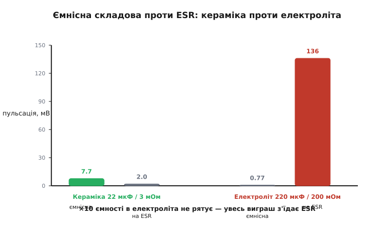

# 🧮 Дві складові пульсації: ємність проти ESR

Вихідна пульсація перетворювача — це сума двох доданків різної природи. Розкладемо її й числами покажемо, хто з них головний — і чому з керамікою та електролітом відповідь протилежна.

### Означення

Пульсація вихідної напруги складається з **двох** доданків, що мають різну природу:

```
ΔVвих = ΔVємн + ΔVesr
   ΔVємн = ΔI / (8 · f · C)     [ємнісна: конденсатор міняє напругу, ковтаючи струм]
   ΔVesr = ΔI · ESR             [на ESR: пряме падіння струму пульсації на опорі]
```

Перша спадає з більшою **ємністю** C, друга — з меншим **ESR** (англ. *equivalent series resistance*, еквівалентний послідовний опір). Який доданок домінує — залежить від **типу** конденсатора, і це визначає, що робити для зменшення пульсації.

### Звідки береться 1/8

Множник 1/8 у ємнісному доданку не випадковий — він виходить просто з форми струму. Через вихідний конденсатор тече змінна частина струму котушки — **трикутник** із розмахом ΔI. За пів періоду (T/2) цей струм то заряджає, то розряджає конденсатор; накопичений заряд — це площа трикутника струму над середнім:

```
ΔQ = ½ · (T/2) · (ΔI/2) = ΔI·T / 8 = ΔI / (8·f)
```

А приріст напруги на конденсаторі — це заряд, поділений на ємність (ΔV = ΔQ/C). Звідси й береться ємнісний доданок:

```
ΔVємн = ΔQ / C = ΔI / (8·f·C)
```

Тобто 1/8 — це наслідок саме **трикутної** форми струму (½ за основу трикутника й ½ за висоту, ще ½ за пів періоду дають 1/8). Якби струм був інакшої форми, змінився б і множник; для понижувального перетворювача в режимі неперервного струму він рівно такий.

### Інтуїція

Ємнісний доданок — це «повільна» хвиля: конденсатор не встигає миттєво поглинути трикутник струму, тож трохи міняє напругу. Доданок на ESR — «гострий»: пульсуючий струм просто падає на паразитному опорі (закон Ома) і повторює форму струму. У кераміки ESR мізерний, тож лишається ємнісна хвиля; в електроліта ESR великий — і він заглушує все інше.

### Формальний апарат: числове порівняння

Візьмемо ΔI = 0.68 А (з [розрахунку котушки перетворювача](root:hw-power/converter-inductor/math-inductor-selection.md)) і f = 500 кГц та порахуємо обидва доданки для двох конденсаторів.


*З керамікою (22 мкФ, ESR 3 мОм) пульсацію задає ємнісна складова (7.7 мВ проти 2 мВ на ESR). З електролітом (220 мкФ — удесятеро більше, але ESR 200 мОм) усе навпаки: на ESR аж 136 мВ, і десятикратна ємність майже не рятує.*

```
Кераміка:  C = 22 мкФ,  ESR = 3 мОм
   ΔVємн = 0.68 / (8 · 500·10³ · 22·10⁻⁶) = 0.68 / 88   ≈ 7.7 мВ
   ΔVesr = 0.68 · 0.003                                 ≈ 2.0 мВ
   → домінує ЄМНІСНА; щоб зменшити пульсацію — додай ємності

Електроліт:  C = 220 мкФ (×10),  ESR = 200 мОм
   ΔVємн = 0.68 / (8 · 500·10³ · 220·10⁻⁶) = 0.68 / 880 ≈ 0.77 мВ
   ΔVesr = 0.68 · 0.2                                    ≈ 136 мВ
   → домінує ESR; десятикратна ємність майже не допомогла
```

Результат разючий: електроліт із удесятеро більшою ємністю дає пульсацію в десятки разів гіршу за кераміку — бо весь виграш від ємності з'їдає його величезний ESR. Точна сума двох доданків не проста (у них різна форма й фаза, тож беруть зазвичай більший із них чи корінь із суми квадратів), але домінантний і так визначає результат.

### Звідки це в доборі

Звідси — **дві різні стратегії** зменшення пульсації, і обрати правильну критично. На **кераміці** (ESR мізерний) ви **обмежені ємністю**: пульсація завелика → додайте ємності (більший номінал чи паралельні MLCC, не забуваючи про просідання під напругою). На **електроліті** ви **обмежені ESR**: тут нарощувати ємність майже марно, треба знижувати ESR.

Чому паралель допомагає саме від ESR, видно з формули. N однакових конденсаторів у паралель — це і ємності в N разів більше, і опори, що діляться як паралельні резистори:

```
C_заг = N·C        ESR_заг = ESR / N
```

Обидва доданки падають у N разів, але стартують вони з різних рівнів: в електроліта доданок на ESR величезний, тож саме його ділення дає головний виграш. Тому паралель кількох конденсаторів — це передусім спосіб **збити ESR**, а вже потім — додати ємності. Те саме дає полімерний конденсатор (у нього ESR і так у рази менший) чи додана поряд кераміка, що зіб'є високочастотну частину.

Саме тому в сучасних перетворювачах на виході майже завжди кераміка чи полімер: вони прибирають той самий доданок на ESR, що псував картину в електроліта. А коли об'ємний електроліт поєднують із керамікою — електроліт дає ємність, кераміка збиває ESR, і пульсація виходить малою на всіх частотах.
