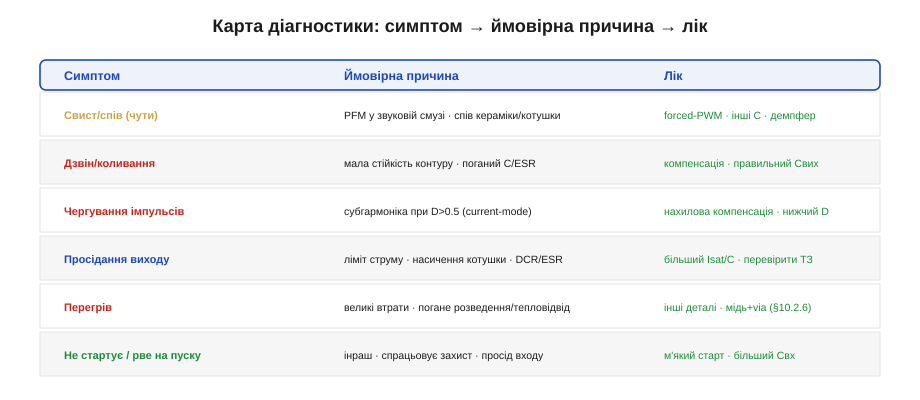
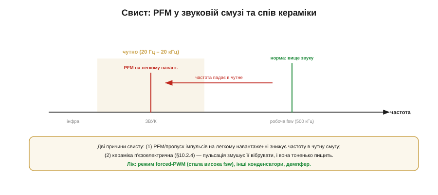
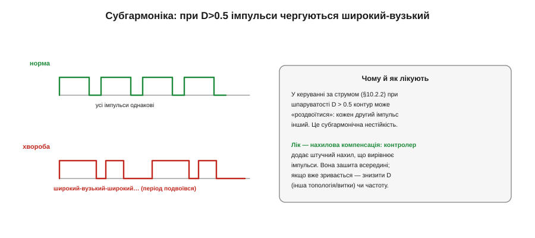
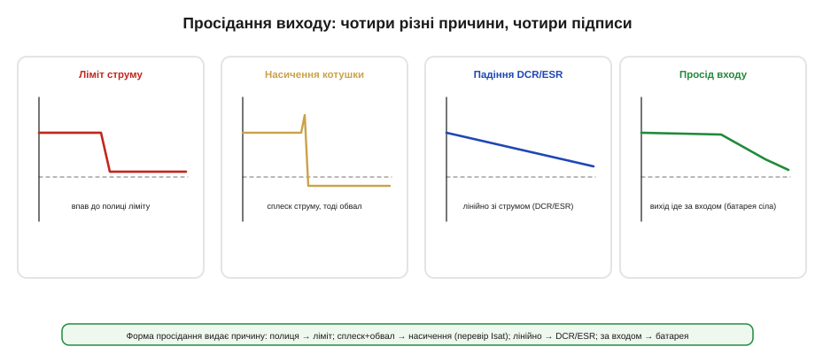
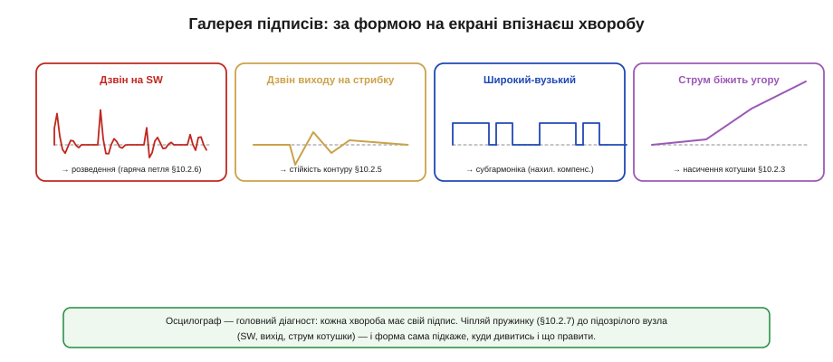
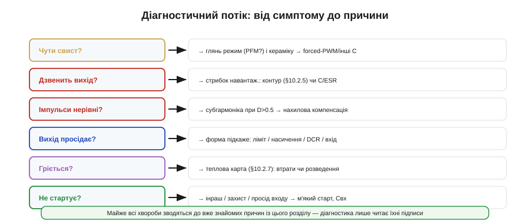

# Типові хвороби: свист, нестабільність, просідання

Навіть ретельно спроєктований перетворювач інколи «хворіє»: свистить, дзвенить, просідає чи гріється. Ця тема — про **діагностику**: типові хвороби, їхні підписи на осцилографі та лік. Добра новина в тому, що майже кожна хвороба зводиться до знайомої причини з самого проєктування перетворювача, — тож діагностика здебільшого не вимагає нового знання, лише вміння **прочитати симптом**. Це окремий навик, корисніший за будь-яку формулу: відрізнити, що саме не так, за формою на екрані.

### Карта хвороб

Почнімо з оглядової карти — симптом, ймовірна причина, лік.

*Шість найчастіших хвороб і їхні причини: свист (PFM у звуковій смузі чи спів кераміки), дзвін (мала стійкість контуру), чергування імпульсів (субгармоніка), просідання (ліміт струму, насичення, падіння DCR/ESR), перегрів (втрати чи розведення), проблеми пуску (інраш, захист). Майже всі причини — знайомі поняття силового перетворення.*

Зверніть увагу: у стовпці «причина» нема нічого нового — це все ті самі поняття силового перетворення (режим керування, стійкість, насичення, ESR, розведення). Діагностика лише **зіставляє** симптом із відомою причиною. У цьому й уся таємниця: інженер, що опанував проєктування, уже знає всі причини — лишається навчитися впізнавати їх з іншого боку, за наслідком. Тому ця тема не додає нового знання про схему, а вчить **дивитися назад**: від симптому до того місця, де воно народилося. Розгляньмо найцікавіші хвороби докладніше — і побачимо, як кожна вказує на знайому ділянку перетворювача.

### Свист і спів

Перетворювач, що **свистить** (чути вухом), бентежить новачка — електроніка ж має бути тихою. Та причин дві, і обидві прості.

*Робоча частота (сотні кГц) — вище звуку, її не чути. Але на легкому навантаженні режим PFM (пропуск імпульсів) знижує частоту — і вона падає у чутну смугу (20 Гц – 20 кГц). Друга причина — п'єзоефект кераміки: пульсація змушує конденсатор вібрувати, і він тоненько пищить. Лік — forced-PWM, інші конденсатори, демпфер.*

Перша причина — **PFM**. На повному навантаженні перетворювач працює на високій сталій частоті, вище за поріг чутності. Але на легкому навантаженні він переходить у [режим пропуску імпульсів](topic:hw-power/controller-fsw), і ефективна частота **падає** — інколи прямо в чутну смугу. Тоді ви чуєте тихе цвірчання, що міняється з навантаженням. Друга причина — **спів кераміки**: [MLCC п'єзоелектрична](topic:hw-power/converter-caps), і пульсація напруги змушує її механічно вібрувати; на чутних частотах вона пищить. Лік: для PFM — перемкнути у forced-PWM (стала висока частота); для співу — інші конденсатори, м'якші виводи чи демпфер. Свист майже завжди нешкідливий для роботи, та дратує — і псує враження про якість пристрою.

### Субгармоніка: чергування імпульсів

Найхитріша нестабільність — **субгармонічні коливання**. Її легко не впізнати, бо вихід може здаватися майже нормальним, а підпис ховається в **формі імпульсів**.

*У нормі всі імпульси однакові. При субгармоніці імпульси **чергуються**: широкий-вузький-широкий-вузький (період подвоївся). Виникає вона в керуванні за струмом при шпаруватості D > 0.5. Лік — нахилова компенсація: контролер додає штучний нахил, що вирівнює імпульси (вона зашита всередині; якщо вже зривається — знизити D чи частоту).*

Описати її можна суто якісно, без жодної математики. У перетворювачі з [керуванням **за струмом**](topic:hw-power/controller-fsw) при шпаруватості **D понад 0.5** контур схильний «роздвоюватися»: замість однакових імпульсів він видає широкий, тоді вузький, тоді знову широкий — період роботи **подвоюється**. На виході це дає дрібний дзвін на половині частоти комутації, а на струмі котушки — характерне чергування. Лік відомий: **нахилова компенсація** (*slope compensation*) — контролер навмисно додає до сигналу струму невеликий штучний нахил, що вирівнює імпульси. Її майже завжди зашито всередину; та якщо ви заганяєте перетворювач у дуже високу D (близько до межі), субгармоніка може прорватися — і тоді рятують нижча D (інша топологія чи витки) або нижча частота.

> 🔧 **Навіщо це.** Якщо вихід ледь чутно дзвенить на **половині** частоти комутації, а імпульси на струмі котушки чергуються широкий-вузький — це субгармоніка, а не звичайна нестійкість контуру. Лік інший: не компенсація петлі, а зменшення D або опертя на нахилову компенсацію. Упізнати її — половина справи.

### Просідання: чотири причини, чотири підписи

**Просідання** виходу під навантаженням має аж чотири різні причини — і, на щастя, кожна лишає свій підпис.

*Форма просідання видає причину. Вихід упав на **полицю** й не падає далі — спрацював ліміт струму (foldback). Струм дав **сплеск і обвал** — котушка насичується: перевір Isat. Вихід падає **лінійно** зі струмом — це падіння на DCR/ESR. Вихід **іде за входом** униз — просідає сама батарея, перетворювач ні до чого.*

Розрізняти їх просто за формою. **Полиця**: вихід упав до певного рівня й тримається — спрацював **захист за струмом** (перевантаження; інколи з «foldback», коли ліміт ще й знижується). **Сплеск і обвал**: струм котушки різко стрибнув, тоді вихід обвалився — [котушка **насичується**](topic:hw-power/converter-inductor), пік перевищив Isat; лік — котушка з більшим Isat. **Лінійне** падіння зі струмом — це просто **омічні втрати** на DCR котушки й ESR/опорах; лік — товщі доріжки, менший DCR/ESR. І **вихід іде за входом** униз — це не перетворювач винен, а [**батарея просіла**](topic:hw-power/c-rate): дивіться на вхід, а не на вузол. Один симптом — чотири різні діагнози, і форма їх розводить.

### Завади: коли вузол «світить» в ефір

Ще одна хвороба не видна на власному виході, зате чути сусідам — **електромагнітні завади**. Симптоми: пристрій валить сертифікаційний ЕМС-тест, або поряд тріщить радіо, плавають покази давачів, «глючить» бездротовий зв'язок. Причина майже завжди та сама трійця: завелика [**гаряча петля**](topic:hw-power/converter-layout), що випромінює; розлитий **вузол SW**, що працює антеною; брак **вхідного фільтра**, через що шум перемикання розповзається дротами живлення по всьому пристрою. Лік — туди ж: стиснути петлю, зменшити SW, додати вхідний LC-фільтр чи [спред-спектрум](topic:hw-power/controller-fsw). ЕМС — не окрема магія, а наслідок тих самих рішень розведення; зробив петлю малою — і половини завад нема.

### Перегрів: яка деталь гаряча — та й винна

**Перегрів** діагностують [тепловою картою](topic:hw-power/converter-measure), і тут підказка — **яка саме** деталь найгарячіша. Гарячий **ключ** — це втрати на перемиканні (зависока частота, кволий драйвер) або великий Rds(on) на струмі; лік — нижча частота, кращий драйвер, ключ із меншим Rds(on). Гаряча **котушка** — мідні втрати (DCR) чи втрати в осерді (висока частота/пульсація); лік — менший DCR, інше осердя. Гарячий **вхідний конденсатор** — [завеликий RMS-струм пульсації](topic:hw-power/converter-caps); лік — конденсатор із більшим струмовим рейтингом чи кілька в паралель. А якщо все гаряче «рівномірно» понад розрахунок — винне [**розведення**](topic:hw-power/converter-layout): тонкі доріжки, поганий тепловідвід. Тобто перегрів — не одна хвороба, а вказівник: дивіться, **що** гріється, і причина майже названа.

### Не стартує: пуск і «гикавка»

Окремий клас — **проблеми пуску**. Перетворювач **не стартує** або **перезапускається** циклічно. Часта причина — **інраш**: при ввімкненні вихідні (а в boost — і прохідні) конденсатори заряджаються кидком струму, той спрацьовує захист, перетворювач вимикається, пробує знову — і так по колу. Це **режим «гикавки»** (*hiccup*): вузол тихо «цокає» чи цвірчить із періодом у частки секунди, раз по раз пробуючи стартувати. Інша причина — **просідання входу** на пуску: слабке джерело не тягне пусковий струм, вхід падає, контролер скидається. Лік — [**м'який старт**](topic:hw-power/feedback-stability), що розтягує заряд конденсаторів у часі; більший вхідний конденсатор; і перевірка, що захист за струмом не спрацьовує на штатному інраші. Гикавка, до речі, — це **захист, який працює**: він не дає вузлу згоріти при КЗ, лиш періодично перевіряючи, чи коротке ще там.

### Осцилограф — головний діагност

Спільне в усіх хворобах одне: їхній **підпис** видно на осцилографі, треба лише знати, [куди чіпляти щуп](topic:hw-power/converter-measure) (пружинкою) і що шукати.

*Кожна хвороба має форму. Дзвін на вузлі SW — завелика гаряча петля (розведення). Дзвін виходу на стрибку навантаження — мала стійкість контуру. Чергування широкий-вузький — субгармоніка. Струм котушки біжить угору без упину — насичення. Прочитав форму — знаєш діагноз.*

Це і є головний інструмент діагностики. **Дзвін на SW** на кожному фронті → гаряча петля завелика (розведення). **Дзвін виходу** після стрибка навантаження → контур на межі стійкості. **Імпульси широкий-вузький** → субгармоніка. **Струм котушки, що не повертається, а повзе вгору** → насичення (а далі захист обріже). Звикнувши до цих чотирьох-п'яти підписів, ви діагностуєте більшість проблем живлення за секунди — не гадаючи, а **читаючи** екран.

Варто знати й **куди** чіпляти щуп. Три точки розповідають майже все. **Вузол SW** (пружинкою, з обмеженням смуги) — про розведення й перемикання: форма фронтів, викид, дзвін. **Вихід** (пружинкою на Cвих, AC-зв'язок) — про пульсацію й перехідні процеси. А **струм котушки** — найцінніше: його знімають струмовими кліщами чи по падінню на шунті, і саме він видає і насичення (повзе вгору), і субгармоніку (чергування), і режим (CCM/DCM). Хто навчився читати струм котушки, той бачить нутро перетворювача наживо — і більшість діагнозів стають очевидними з одного погляду.

### Діагностичний потік

Зведімо в простий потік: симптом → куди дивитись → причина → лік.

*Від симптому до причини: чути свист → режим і кераміка; дзвенить → контур чи C/ESR; нерівні імпульси → субгармоніка; просідає → форма підкаже (ліміт/насичення/DCR/вхід); гріється → теплова карта; не стартує → інраш/захист/вхід. Майже все зводиться до знайомих причин силового перетворення.*

Кілька слів про **підхід** до пошуку несправності, бо він важить не менше за знання хвороб. По-перше, **міняйте одне за раз**: підмінили відразу котушку, конденсатор і частоту — і навіть як полегшало, не знаєте, що саме допомогло (а могло й нашкодити в іншому місці). По-друге, тримайте **еталон**: якщо є плата, що працює, порівняйте з нею осцилограми у тих самих точках — різниця одразу вкаже на проблему. По-третє, коли схема бездоганна, а вузол усе одно хворіє, — **підозрюйте паразити**: [розведення, гарячу петлю](topic:hw-power/converter-layout), землю, наведення. Здорове живлення — це не лише правильна схема, а правильна схема **в правильній міді**.

> 🔧 **Навіщо це.** Не лагодьте навмання, міняючи деталі по черзі. Спершу **зніміть підпис** осцилографом і зведіть його до причини за цією картою — а тоді міняйте саме те, що треба. Дев'ять із десяти «загадкових» проблем живлення мають чіткий підпис і відому причину; загадковими вони здаються лише тому, що на них не подивилися як слід.

### Підсумок

Типові хвороби перетворювача — **свист** (PFM у звуковій смузі чи спів кераміки → forced-PWM, інші C), **нестабільність** (дзвін від малого запасу контуру → компенсація, правильний Cвих/ESR), **субгармоніка** (чергування імпульсів при D>0.5 → нахилова компенсація, нижча D), **просідання** (ліміт струму, насичення, DCR/ESR чи просід входу — розрізняються за формою) та **перегрів** і **проблеми пуску**. Майже кожна причина — знайоме поняття силового перетворення, тож діагностика зводиться до **читання підпису** на осцилографі: знімаєш форму на SW, виході чи струмі котушки — і вона сама вказує на причину. Це вміння «дивитися назад» — від наслідку до причини — і відрізняє інженера, що швидко лагодить, від того, хто навмання міняє деталі.
