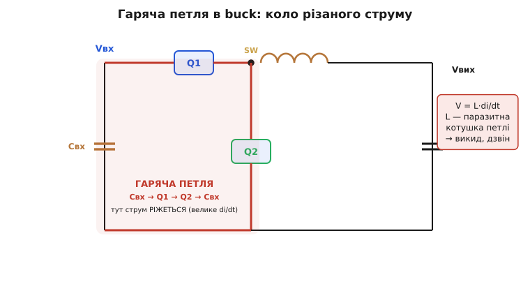
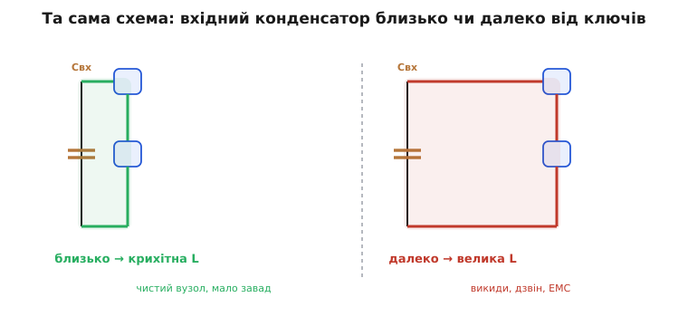
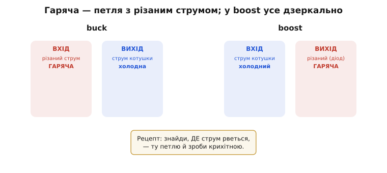
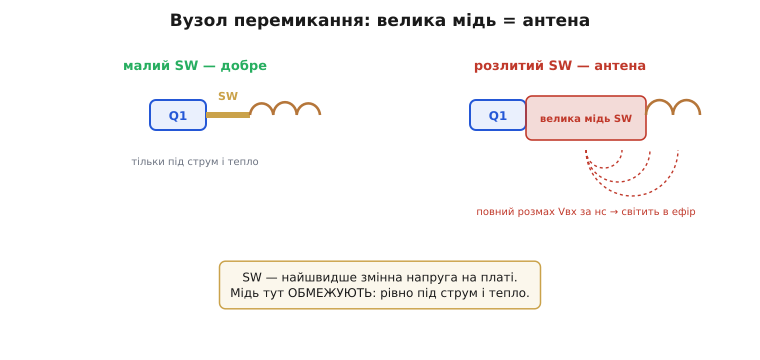
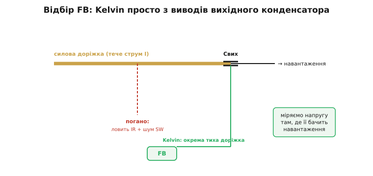
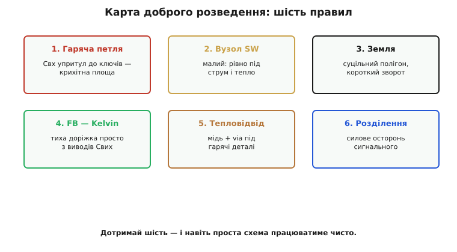

# Розведення перетворювача

Усі деталі пораховані, схема бездоганна — і саме тут починається найважче. В імпульсному перетворювачі **розведення плати — це частина схеми**, а не оформлення. Доріжки мають індуктивність і опір, які на високих частотах і різких струмах стають **реальними компонентами**, яких немає в принциповій схемі. Тому ідеальна схема з поганим розведенням працює погано або не працює зовсім: креслення плати тут важить не менше за вибір деталей. На розведенні видно найголовніше про силову електроніку — як геометрія міді перетворюється на електроніку.

### Гаряча петля: коло різаного струму

Центральне поняття — **гаряча петля** (англ. *hot loop*, також *power loop* — «силова петля»): замкнене коло, яким біжить різко перемикуваний струм.


*У buck гаряча петля — це коло Cвх → Q1 → Q2 → Cвх. Саме в ньому струм ріжеться (повний, поки Q1 відкритий, і нуль, поки закритий), тобто має величезне di/dt. Площа цієї петлі — її паразитна індуктивність L; на ній різкий струм дає викид V = L·di/dt, а з ним дзвін на ключах і завади в ефір.*

Розгляньмо buck. Коли верхній ключ Q1 вмикається, струм миттєво кидається з вхідного конденсатора крізь Q1; коли вимикається — так само різко обривається (підхоплює нижній Q2). Цей струм біжить колом **Cвх → Q1 → Q2 → Cвх**, і він **різаний** — стрибає від повного до нуля за наносекунди. Саме тому вхідний конденсатор тут — не просто запас енергії [на вхідній шині](root:hw-power/converter-caps), а **локальне джерело** цих різких імпульсів: він мусить віддавати їх сам, прямо тут, бо до батареї через довгі доріжки різаний струм «не добіжить» без величезного викиду. А будь-яке коло має паразитну [**індуктивність**, пропорційну до його **площі**](root:ph-electromagnetism/inductance). Помножте величезне di/dt на цю індуктивність — і дістанете різкий **викид напруги** (V = L·di/dt) на ключах щоразу при перемиканні. Цей викид б'є по ключах (аж до пробою), дзвенить, гріє й випромінюється завадами. Звідси й уся робота над розведенням: цей викид треба приборкати, і відповідь одна — **зменшити площу гарячої петлі**.

> 🔧 **Навіщо це.** Якщо запам'ятати про розведення одне — нехай це буде: **знайди гарячу петлю й зроби її крихітною**. Конденсатор, поставлений за правилами схеми, але далеко від ключів, дає дзвінкий, гарячий, шумний перетворювач — при бездоганній принциповій схемі. Це причина №1, чому «та сама» плата в одного інженера працює, а в іншого ні.

### Правило №1: гаряча петля має бути маленькою


*Та сама схема, та сама деталь — лише вхідний конденсатор ближче чи далі від ключів. Близько: крихітна площа петлі, мала паразитна L, чистий вузол перемикання, мало завад. Далеко: велика площа, велика L, викиди, дзвін, ЕМС. Розведення є частиною кола — погана топологія вбиває гарну схему.*

Звідси найголовніше правило розведення імпульсних блоків живлення: **вхідний конденсатор ставлять упритул до ключів**, щоб гаряча петля Cвх → Q1 → Q2 була якомога **меншою за площею**. Мала площа — мала паразитна індуктивність — малі викиди й завади. Це не косметика: та сама схема з конденсатором за сантиметр від ключів і за міліметр від них поводиться **по-різному**, бо площа петлі (а отже, паразитна котушка в ній) відрізняється в рази. Тому [вхідну кераміку](root:hw-power/converter-caps) тулять до самих виводів ключів першою, ще до решти розведення — це рішення №1.

Наскільки це важить, видно з простого рахунку. Візьмімо реальний buck і оцінімо викид на ключі для двох варіантів розведення.

**Умова.** Струм навантаження I = 5 А, фронт перемикання MOSFET tᵣ ≈ 10 нс. Погана петля (конденсатор за ~12 мм): паразитна індуктивність L₁ ≈ 12 нГн. Добра петля (конденсатор упритул, ~2 мм): L₂ ≈ 2 нГн. Який викид напруги V = L·di/dt дасть кожна?

```c
// di/dt при обриві струму: весь струм спадає за час фронту
//   di/dt = I / t_r = 5 А / 10e-9 с = 5e8 А/с  (0.5 А/нс)
const double I    = 5.0;       // А
const double t_r  = 10e-9;     // с
double didt = I / t_r;         // = 5.0e8 А/с

// V = L * di/dt
double V_bad  = 12e-9 * didt;  // = 6.0 В   викид
double V_good =  2e-9 * didt;  // = 1.0 В   викид
```

```text
погана петля:  V = 12 нГн × 5·10⁸ А/с = 6.0 В
добра петля:   V =  2 нГн × 5·10⁸ А/с = 1.0 В
```

Висновок: при вхідних 12 В погана петля додає 6 В викиду — миттєвий стрес 18 В на ключі, прямий шлях до пробою й гучного дзвону. Та сама схема з конденсатором упритул дає лише 1 В викиду. Між «працює тихо» і «дзвенить та пробивається» стоять десять міліметрів міді — більш нічого в схемі не змінилося.

Навіть із крихітною петлею частина шуму перемикання все ж проситься на вхідну шину — і там, де її чистота важлива (поряд із радіо чи спільна з чутливими вузлами), на вході ставлять **фільтр**: невелику LC-ланку (або феритову бусину з конденсатором), що не пускає високочастотний шум назад у живлення. Це продовження тих самих турбот про електромагнітну сумісність, що їх диктує [вибір частоти перемикання](root:hw-power/controller-fsw): гаряча петля локалізує шум, а вхідний фільтр доловлює рештки, щоб вони не розповзлися дротами по всьому пристрою.

### Яка петля гаряча: шукай різаний струм

Петель у перетворювачі кілька — то яку саме мінімізувати? Правило просте: гаряча та, де струм **різаний** (переривчастий), а не та, де він безперервний.


*У buck вхідна петля несе різаний струм (повний/нуль) — вона гаряча. Вихідна петля (котушка → Cвих) несе безперервний струм котушки, що міняється плавно, — вона холодна, менш критична. У boost усе навпаки: різаний струм на виході, тож гаряча — вихідна петля.*

У buck **вхідна** петля несе різаний струм, а **вихідна** (котушка → Cвих → назад) — струм котушки, що тече **безперервно** й міняється плавно (трикутником). Тому вихідна петля «холодна»: її геометрія важить менше. А от у [**boost** усе дзеркально](root:hw-power/boost): там безперервний струм на вході (котушка перша), а різаний — на виході, де діод рве струм; отже, гаряча петля boost — **вихідна**. Звідси універсальний рецепт: знайдіть, **де струм рветься** (де стоїть ключ, що комутує повний струм), — і саме ту петлю зробіть крихітною. Це працює для будь-якої топології.

### Вузол перемикання: найгаласливіша мідь

Поряд із петлею є ще одна гаряча точка — **вузол перемикання** (англ. *switch node*, SW — «вузол ключа»): мідь між ключем і котушкою. Її напруга стрибає **всім розмахом Vвх** за наносекунди — це найшвидше змінна напруга на всій платі.


*SW коливається на повний Vвх із величезною швидкістю. Велика площа міді тут перетворюється на антену, що випромінює завади. Тому SW роблять малим — рівно стільки міді, скільки треба для струму й тепловідводу, і не більше. Це компроміс: достатньо для струму, але не настільки, щоб світити в ефір.*

Тут компроміс зворотний до звичайного. Зазвичай більше міді — краще (менший опір, кращий тепловідвід). Але SW — виняток: велика площа міді, що швидко коливається на повний Vвх, стає **антеною** й випромінює завади. Тому SW тримають **малим** — рівно таким, щоб провести струм і відвести тепло від ключа, але не більшим. Це одне з небагатьох місць, де мідь **обмежують** навмисно.

### Земля: суцільний полігон і розділення

Третій стовп розведення — **земля**. Зворотні струми (і силові, і сигнальні) повертаються через «землю», і якщо вона погана, ці струми наводяться одне на одного. Тому під перетворювачем тримають **суцільний полігон землі** (полігон — від грец. *polýgōnos* «багатокутний»; англ. *ground plane* — «площина землі»): суцільна мідна заливка дає кожному струмові короткий тихий шлях назад і екранує.

Та найважливіше — **розділення силового й сигнального**. Гучні силові струми (та сама гаряча петля) не повинні текти крізь ту ділянку землі, до якої під'єднані тихі сигнали — еталон, дільник зворотного зв'язку, давачі. Інакше падіння напруги від силового струму на спільній землі «підмішається» в сигнал, і контролер бачитиме хибну напругу. Силову й сигнальну землю зводять разом в **одній точці** (зазвичай біля контролера, під його тепловим майданчиком), щоб гучні струми не текли крізь тиху зону.

Тут у пригоді стає **багатошарова** плата. Силові доріжки кладуть на верхній шар, а **прямо під ними** — суцільний полігон землі на сусідньому шарі. Тоді зворотний струм біжить у землі точно під своєю доріжкою, і площа петлі (а отже, паразитна індуктивність) стає мінімальною **сама собою** — земляний шар «віддзеркалює» силове коло й стискає його. Тому серйозні перетворювачі не роблять на односторонніх платах: без землі під низом гарячу петлю годі стиснути. Сигнальні ж доріжки ховають на внутрішні чи нижній шари, подалі від силового верху.

### Зворотний зв'язок: Kelvin до справжнього виходу

Вузол зворотного зв'язку (FB, англ. *feedback* — «зворотний зв'язок») чутливий — саме він замикає [петлю зворотного зв'язку](root:hw-power/feedback-stability). Розведення вирішує, чи побачить контролер **справжню** вихідну напругу, чи спотворену.


*Поганий відбір FB — посеред силової доріжки: там тече струм, і контролер ловить падіння IR на доріжці плюс шум від SW. Добрий відбір — Kelvin: окрема тиха доріжка просто з виводів вихідного конденсатора, якою струм не тече. Так контролер міряє напругу саме там, де її бачить навантаження.*

Прийом зветься **відбір Kelvin** (англ. *Kelvin sense*; на честь Вільяма Томсона, лорда Кельвіна — британського фізика, що ввів чотиридротову схему вимірювання, аби виключити падіння на підвідних дротах): сигнальну доріжку FB ведуть **окремо** від силової й під'єднують прямо до виводів вихідного конденсатора — у точку, де напруга найближча до тієї, що бачить навантаження. Якщо ж відібрати FB посеред силової доріжки, контролер «прочитає» ще й падіння IR уздовж неї (а воно міняється зі струмом) і наведений шум від SW — і триматиме хибну напругу. Доріжку FB ведуть короткою, подалі від SW і гарячої петлі, а землю дільника беруть із тихої сигнальної точки. Дрібна сигнальна доріжка — а вирішує точність усього виходу.

### Тепловідвід: куди подіти втрати

Останнє — **тепло**. Втрати на ключах, котушці й діоді треба кудись відвести, а єдиний шлях на платі — мідь. Тому під гарячими деталями роблять **мідні полігони** й «зашивають» їх **перехідними отворами** (англ. *via*, від лат. *via* «шлях» — металізований отвір крізь плату) на внутрішні й нижній шари, розмазуючи тепло по більшій площі. Це той випадок, коли більше міді справді краще (на відміну від SW). Добрий тепловідвід дозволяє тримати менший радіатор або взагалі обійтися без нього — а отже, і менший, дешевший вузол.

### Карта доброго розведення

Зведімо все в контрольну карту.


*Шість правил: вхідний конденсатор упритул до ключів (крихітна гаряча петля), малий вузол SW, суцільна земля-полігон, FB-відбір Kelvin із Cвих, тепловідвід міддю з перехідними отворами під гарячими деталями, і розділення силового й сигнального. Дотримай їх — і навіть проста схема працюватиме чисто.*

Порядок дій на практиці: спершу розмістити **гарячу петлю** (вхідний конденсатор і ключі) якнайщільніше; тоді короткий малий **SW** до котушки; під низ — **полігон землі**; **FB** — окремою тихою Kelvin-доріжкою з виходу; під гарячі деталі — **мідь із перехідними отворами** для тепла; і весь час тримати **силове осторонь сигнального**. Це не прикраси, а схема, продовжена в мідь.

> 🔧 **Навіщо це.** Розведення роблять **до**, а не **після** того, як «схема готова»: вона і є частина схеми. Класична пастка новачка — намалювати бездоганну принципову схему, а тоді абияк розкидати деталі по платі — і дістати дзвінкий, гарячий, шумний вузол, що валить тести на електромагнітну сумісність і перегрівається. Тому хороший інженер живлення думає про гарячу петлю вже тоді, коли тільки малює схему.

### Як упізнати погане розведення на столі

Погане розведення видно ще до лабораторії електромагнітної сумісності — за симптомами на столі. **Дзвін на вузлі SW**: причепили щуп [осцилографа](root:hw-sensing/oscilloscope) до SW (правильно — короткою пружинкою замість довгого «крокодила», щоб не додати своєї петлі) і бачите гострі викиди й затухаючі коливання на кожному фронті — це гаряча петля завелика. **Гарячі точки**, яких не пояснюють розрахункові втрати, — це поганий тепловідвід або зайвий опір доріжок. **Завади в радіо чи давачах** поряд — велика гаряча петля чи розлитий SW світять в ефір. **Несподівана нестійкість** чи хибна напруга — шум проліз у FB або силовий струм тече крізь сигнальну землю. Усі ці симптоми лікуються не заміною деталей, а **переробкою розведення** — і саме тому його варто зробити правильно з першого разу.

### Підсумок

В імпульсному перетворювачі **розведення — це частина кола**, бо паразитні індуктивність і опір доріжок стають реальними компонентами. Центральне поняття — **гаряча петля**, коло різаного струму (у buck: Cвх → Q1 → Q2): її площа є паразитною котушкою, на якій різке di/dt дає викиди, дзвін і завади, тож **правило №1** — зробити цю петлю крихітною, поставивши вхідний конденсатор упритул до ключів. Гарячу петлю знаходять за **різаним струмом** (у buck — вхідну, у boost — вихідну). **Вузол SW** тримають малим, щоб не світив антеною; **землю** роблять суцільним полігоном і розділяють силове від сигнального; **FB** відбирають **Kelvin** просто з виводів вихідного конденсатора; під гарячі деталі кладуть **мідь із перехідними отворами** для тепла. А впізнати погане розведення можна ще на столі — за дзвоном на SW, гарячими точками, завадами й нестійкістю, що лікуються не заміною деталей, а переробкою плати. Розведення — місце, де бездоганна схема живе або вмирає від геометрії міді. А коли плата готова, лишається [виміряти перетворювач](root:hw-power/converter-measure) — пульсації, ккд, теплову карту, — щоб переконатися, що він справді відповідає технічному завданню.
