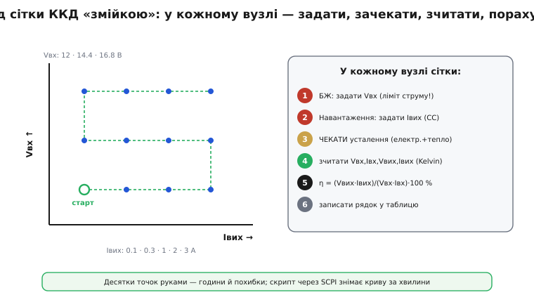

# ⚙️ Автоматизація вимірів ККД: знімаємо криву точками

### Задача

Одне число ккд нічого не доводить: ккд **залежить від навантаження** — у [понижувального перетворювача](topic:hw-power/buck) крива має провал на малому струмі й максимум посередині. Тому реальний вимір — це не точка, а **крива**, а точніше родина кривих: кілька значень Vвих на кожне з кількох значень Vвх. Навіть скромна сітка — три входи на п'ять навантажень — це вже п'ятнадцять робочих точок, а пристойна сітка легко переростає в кілька десятків.

Зняти їх руками означає в кожній точці виставити струм на [електронному навантаженні](topic:hw-power/converter-measure/comp-electronic-load.md), дочекатися, поки вузол і прилади заспокояться, переписати з екранів чотири числа, поділити два добутки — і так разів сорок. Це не просто марудно: кожне ручне переписування — шанс на очепятку, а «дочекатися» на втомі легко скорочується до «глянув одразу», і число виходить хибним. Тож щойно сітка переростає кілька точок, її **автоматизують**: один скрипт обходить усі вузли сам, у кожному виставляє режим, витримує паузу, зчитує й рахує — і кладе готову криву в таблицю.

### Чому це взагалі можливо

Автоматизація тримається на одній зручній обставині: серйозні лабораторні прилади не лише показують числа на екрані, а й **слухають команди ззовні**. Програмований блок живлення (БЖ) і програмоване електронне навантаження мають порт керування — і їм можна **наказати** «постав 14.4 В», «тримай 2 А», «віддай свій вимір напруги».

Спільну мову цих наказів дає **SCPI** (англ. *Standard Commands for Programmable Instruments* — «стандартні команди для програмованих приладів») — текстовий набір команд, який Hewlett-Packard виростив зі своєї мови TML і вивів галузевим стандартом 1990 року поверх формату даних IEEE-488.2. Команди в ньому читаються майже як фрази: `VOLT 14.4` задає напругу, `CURR 2.0` — струм, `MEAS:VOLT?` запитує виміряну напругу. Стандарт навмисно **не прив'язаний до конкретної шини**: історично прилади з'єднували приладовим інтерфейсом GPIB, та ті самі текстові команди однаково ходять USB, локальною мережею чи послідовним портом. Тому той самий скрипт працює і зі старим приладом на GPIB, і з новим на USB — змінюється лише спосіб відкрити з'єднання, а не самі команди.

Звідси й уся ідея вставки: якщо приладам можна наказувати текстом і питати їх про вимір, то весь нудний обхід сітки — це звичайний вкладений цикл у програмі.

### Ідея: вкладений цикл по сітці

Скрипт будує **дві петлі одна в одній**. Зовнішня йде по входах Vвх, внутрішня — по навантаженнях Iвих. У кожному вузлі сітки виконується той самий короткий ритуал: задати вхідну напругу на БЖ → задати струм на навантаженні (режим стабілізації струму, CC) → дочекатися усталення → зчитати чотири величини (Vвх, Iвх, Vвих, Iвих) → порахувати η → записати рядок. Коли внутрішня петля пройшла всі струми, зовнішня переходить до наступного входу — і так доки сітка не вичерпана.


*Зовнішня петля веде по Vвх, внутрішня — по Iвих; обхід іде «змійкою», щоб не стрибати щоразу з 3 А назад на 0.1 А. У кожному вузлі — той самий ритуал: задати, дочекатися усталення, зчитати чотири величини Kelvin-відбором, порахувати η, записати рядок. Десятки точок, зняті за хвилини й без помилок переписування.*

Порядок обходу варто зробити **«змійкою»**: внутрішню петлю на парних рядках розвертати. Інакше після кожного рядка струм стрибав би з максимуму назад на мінімум — зайвий великий перехід, на якому DUT щоразу заново гойдається й довше вгамовується. А між рядками Vвх навантаження варто **повністю знімати** (`INPUT OFF`): міняти вхідну напругу під повним струмом — це наражати вузол на стрибок саме в найгрубіший момент.

### Реальний приклад: знімаємо криву точками

Найчастіше такий скрипт крутиться на **ПК** — Python з бібліотекою приладів пише в порт ті самі текстові команди. Але та сама логіка чудово лягає й на **мікроконтролер**: якщо МК сам керує цифровим навантаженням (тим же текстовим протоколом через UART) і має точний АЦП на вимір V та I, він прогонить сітку без жодного ПК — наприклад, у вбудованому самотесті плати. Покажемо саме цей варіант реальною прошивкою на C: МК шле SCPI-команди в порт приладу й рахує криву точку за точкою.

Спершу — дрібний «словник» приладу: відправити команду й зчитати відповідь-число. Деталі шини (UART) сховані за двома функціями `port_send()`/`port_readline()`, щоб видно було саму логіку.

**Прошивка: один вузол сітки — задати, витримати, зчитати, порахувати.**
:::tabs
```c
#include <stdio.h>      // snprintf

// --- тонкий шар приладу (SCPI текстом у порт) ---
void  port_send(const char *line);          // дописує "\n" і шле в UART
float port_query(const char *line);         // шле запит, парсить число з відповіді

static void psu_set_voltage(float v) { char c[32]; snprintf(c, sizeof c, "VOLT %.3f", v); port_send(c); }
static void load_set_current(float a) { char c[32]; snprintf(c, sizeof c, "CURR %.3f", a); port_send(c); }

// один вузол сітки: повертає ккд у % (або -1 при відмові DUT)
float measure_point(float vin_set, float iout_set, float vout_nom)
{
    psu_set_voltage(vin_set);   port_send("OUTP ON");      // вхід під напругою
    load_set_current(iout_set); port_send("INP ON");       // навантаження тримає струм

    settle_ms(2000);            // ЧЕКАТИ усталення: електрика + тепловий дрейф

    float vin  = port_query("MEAS:VOLT? PSU");   // Kelvin-відбір — окремі дроти на клемах
    float iin  = port_query("MEAS:CURR? PSU");
    float vout = port_query("MEAS:VOLT? LOAD");
    float iout = port_query("MEAS:CURR? LOAD");

    if (vout < vout_nom * 0.9f) {                // вихід просів > 10 % → DUT у захисті/відмові
        port_send("INP OFF");                    // негайно зняти струм, не палити плату
        return -1.0f;
    }
    float pin = vin * iin, pout = vout * iout;
    return (pin > 0.0f) ? (pout / pin) * 100.0f : -1.0f;
}
```
```python
import time

# --- тонкий шар приладу (SCPI текстом у порт) ---
# port_send(line)  — дописує "\n" і шле в UART (pyserial)
# port_query(line) — шле запит, парсить число з відповіді

def psu_set_voltage(v):  port_send(f"VOLT {v:.3f}")
def load_set_current(a): port_send(f"CURR {a:.3f}")

# один вузол сітки: повертає ккд у % (або -1 при відмові DUT)
def measure_point(vin_set, iout_set, vout_nom):
    psu_set_voltage(vin_set);   port_send("OUTP ON")      # вхід під напругою
    load_set_current(iout_set); port_send("INP ON")       # навантаження тримає струм

    time.sleep(2.0)             # ЧЕКАТИ усталення: електрика + тепловий дрейф

    vin  = port_query("MEAS:VOLT? PSU")   # Kelvin-відбір — окремі дроти на клемах
    iin  = port_query("MEAS:CURR? PSU")
    vout = port_query("MEAS:VOLT? LOAD")
    iout = port_query("MEAS:CURR? LOAD")

    if vout < vout_nom * 0.9:             # вихід просів > 10 % → DUT у захисті/відмові
        port_send("INP OFF")             # негайно зняти струм, не палити плату
        return -1.0

    pin, pout = vin * iin, vout * iout
    return (pout / pin) * 100.0 if pin > 0.0 else -1.0
```
```go
import (
	"fmt"
	"time"
)

// --- тонкий шар приладу (SCPI текстом у порт) ---
// portSend(line)  — дописує "\n" і шле в UART
// portQuery(line) — шле запит, парсить число з відповіді

func psuSetVoltage(v float64)  { portSend(fmt.Sprintf("VOLT %.3f", v)) }
func loadSetCurrent(a float64) { portSend(fmt.Sprintf("CURR %.3f", a)) }

// один вузол сітки: повертає ккд у % (або -1 при відмові DUT)
func measurePoint(vinSet, ioutSet, voutNom float64) float64 {
	psuSetVoltage(vinSet)
	portSend("OUTP ON") // вхід під напругою
	loadSetCurrent(ioutSet)
	portSend("INP ON") // навантаження тримає струм

	time.Sleep(2 * time.Second) // ЧЕКАТИ усталення: електрика + тепловий дрейф

	vin := portQuery("MEAS:VOLT? PSU") // Kelvin-відбір — окремі дроти на клемах
	iin := portQuery("MEAS:CURR? PSU")
	vout := portQuery("MEAS:VOLT? LOAD")
	iout := portQuery("MEAS:CURR? LOAD")

	if vout < voutNom*0.9 { // вихід просів > 10 % → DUT у захисті/відмові
		portSend("INP OFF") // негайно зняти струм, не палити плату
		return -1.0
	}

	pin, pout := vin*iin, vout*iout
	if pin > 0.0 {
		return (pout / pin) * 100.0
	}
	return -1.0
}
```
:::

Тепер — самі дві петлі по сітці, «змійкою», з друком готових рядків кривої:

**Прошивка: обхід усієї сітки Vвх × Iвих «змійкою».**
:::tabs
```c
void sweep_efficiency(void)
{
    const float vin[]  = { 12.0f, 14.4f, 16.8f };          // сітка по входу
    const float iout[] = { 0.1f, 0.3f, 1.0f, 2.0f, 3.0f }; // сітка по навантаженню
    const int   NV = 3, NI = 5;
    const float VOUT_NOM = 5.0f;

    port_send("CURR:PROT 4.0");        // ліміт струму БЖ за паспортом DUT — запобіжник
    port_send("FUNC CURR");            // навантаження в режим стабілізації струму (CC)
    printf("Vin\tIout\tVout\teta%%\n");

    for (int r = 0; r < NV; r++) {
        for (int k = 0; k < NI; k++) {
            int idx = (r & 1) ? (NI - 1 - k) : k;   // парний рядок — у зворотному порядку
            float i_set = iout[idx];
            float eta = measure_point(vin[r], i_set, VOUT_NOM);

            if (eta < 0.0f) { printf("# %.1f V @ %.2f A: DUT поза нормою\n", vin[r], i_set); continue; }
            printf("%.1f\t%.2f\t%.3f\t%.1f\n", vin[r], i_set, VOUT_NOM, eta);
        }
        port_send("INP OFF");          // розвантажити DUT між рядками Vвх
    }
    port_send("OUTP OFF"); port_send("INP OFF");   // безпечне завершення
}
```
```python
def sweep_efficiency():
    vin  = [12.0, 14.4, 16.8]            # сітка по входу
    iout = [0.1, 0.3, 1.0, 2.0, 3.0]     # сітка по навантаженню
    VOUT_NOM = 5.0

    port_send("CURR:PROT 4.0")           # ліміт струму БЖ за паспортом DUT — запобіжник
    port_send("FUNC CURR")               # навантаження в режим стабілізації струму (CC)
    print("Vin\tIout\tVout\teta%")

    for r, v in enumerate(vin):
        order = reversed(iout) if r & 1 else iout   # парний рядок — у зворотному порядку
        for i_set in order:
            eta = measure_point(v, i_set, VOUT_NOM)

            if eta < 0.0:
                print(f"# {v:.1f} V @ {i_set:.2f} A: DUT поза нормою")
                continue
            print(f"{v:.1f}\t{i_set:.2f}\t{VOUT_NOM:.3f}\t{eta:.1f}")
        port_send("INP OFF")             # розвантажити DUT між рядками Vвх

    port_send("OUTP OFF"); port_send("INP OFF")   # безпечне завершення
```
```go
func sweepEfficiency() {
	vin := []float64{12.0, 14.4, 16.8}           // сітка по входу
	iout := []float64{0.1, 0.3, 1.0, 2.0, 3.0}   // сітка по навантаженню
	const voutNom = 5.0

	portSend("CURR:PROT 4.0") // ліміт струму БЖ за паспортом DUT — запобіжник
	portSend("FUNC CURR")     // навантаження в режим стабілізації струму (CC)
	fmt.Println("Vin\tIout\tVout\teta%")

	for r, v := range vin {
		for k := range iout {
			idx := k
			if r&1 == 1 { // парний рядок — у зворотному порядку
				idx = len(iout) - 1 - k
			}
			iSet := iout[idx]
			eta := measurePoint(v, iSet, voutNom)

			if eta < 0.0 {
				fmt.Printf("# %.1f V @ %.2f A: DUT поза нормою\n", v, iSet)
				continue
			}
			fmt.Printf("%.1f\t%.2f\t%.3f\t%.1f\n", v, iSet, voutNom, eta)
		}
		portSend("INP OFF") // розвантажити DUT між рядками Vвх
	}
	portSend("OUTP OFF")
	portSend("INP OFF") // безпечне завершення
}
```
:::

Підставимо в `measure_point()` одну реальну точку й пройдемо обчислення вручну — щоб видно було, що саме рахує прошивка. Нехай у вузлі (14.4 В, 2.0 А) прилади після усталення повернули такі чотири числа:

**Умова: вузол Vвх = 14.4 В, Iвих = 2.0 А; зчитано Vвх 14.38 В, Iвх 0.760 А, Vвих 5.01 В, Iвих 2.00 А.**
```
pin  = vin · iin   = 14.38 · 0.760 = 10.93 Вт
pout = vout · iout =  5.01 · 2.000 = 10.02 Вт
eta  = pout / pin · 100 = 10.02 / 10.93 · 100 = 91.7 %
```
Перевірка на відмову не спрацювала: vout 5.01 В вище за поріг 0.9·5.0 = 4.5 В, тож точка чесна. Рядок `14.4  2.00  5.000  91.7` лягає в таблицю — і так у кожному вузлі сітки народжується одна точка кривої. Пройшли всі вузли — маємо повну криву ккд від навантаження для кожного входу.

### Складність і пастки

- **Усталення — головна пастка.** Зчитати одразу після зміни струму — отримати хибне число: і перетворювач, і самі прилади мають перехідний процес, а на великій потужності додається **тепловий** дрейф (опори ростуть, поки вузол гріється, тож ккд ще кілька секунд сповзає). Тому `settle_ms()` дають із запасом, а на потужних точках — секунди, не мілісекунди. Спокуса «зчитати швидше» псує саме ті точки, де ккд найважливіший.
- **Безпека передусім.** Виставте ліміт струму БЖ і межі навантаження за паспортом DUT **до** першого ввімкнення; на кожному кроці **перевіряйте Vвих** і аварійно знімайте навантаження, якщо вихід випав із норми — DUT міг піти в захист або горіти. Саме це й робить перевірка `vout < vout_nom·0.9` у прикладі: скрипт без такого аварійного виходу здатен спалити плату, поки ви відвернулися.
- **Точність — це Kelvin і усереднення.** ККД — різниця двох близьких потужностей, тож груба похибка струму прямо лягає в результат. Напругу читайте **Kelvin-відбором** — окремими тонкими дротами просто на клемах перетворювача, щоб падіння на струмових дротах не входило в замір (та сама причина, що й для дротів зворотного зв'язку у [правильному розведенні](topic:hw-power/converter-layout)). А кожен вимір варто **усереднити** по кількох відліках: миттєвий шумить.
- **Порядок обходу й розвантаження.** «Змійкою» (вгору-вниз по струму) — щоб не робити зайвий великий стрибок струму між рядками; між рядками Vвх **розвантажуйте** DUT, щоб не міняти вхід під повним струмом.
- **ПК чи МК — пастки ті самі.** На ПК зручніші бібліотеки й файли, на МК скрипт автономний (самотест плати), але **затримки на усталення й точність вимірювача** однакові для обох. На МК ще й точність вбудованого АЦП обмежена, тож для чесного ккд на самій платі ставлять окремий точний АЦП або зовнішній вимірювач.

> 🔧 **Навіщо це.** Крива ккд — це не «гарний графік для звіту», а спосіб довести **кожен** рядок ТЗ: «≥ 90 % @ 3 А» і «≥ 80 % @ 0.3 А» перевіряються в **різних** точках сітки, а не в одній зручній. Автоматизація прибирає головну причину брехливих чисел — нетерплячість і втому руки: скрипт чекає усталення однаково сумлінно і на першій точці, і на сороковій, тож крива виходить така, якій можна вірити.
