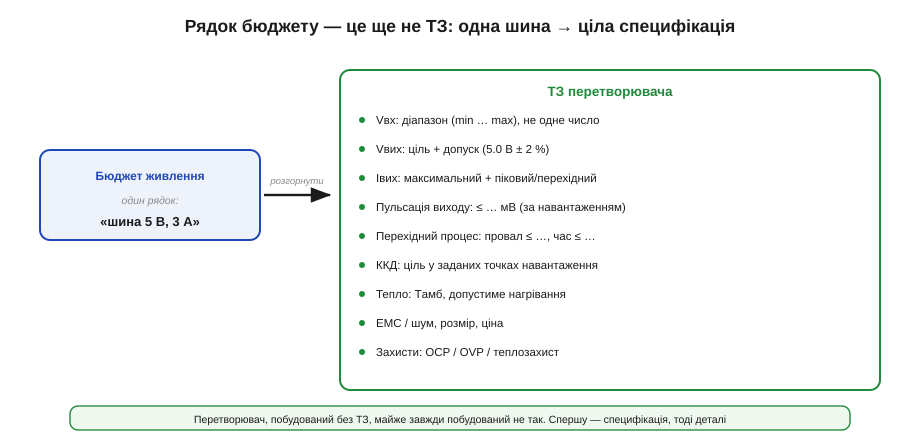
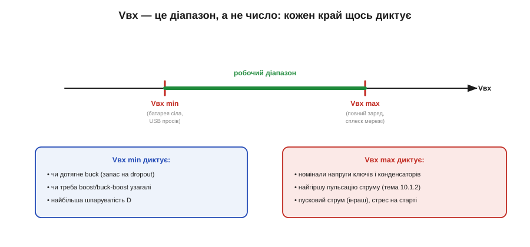
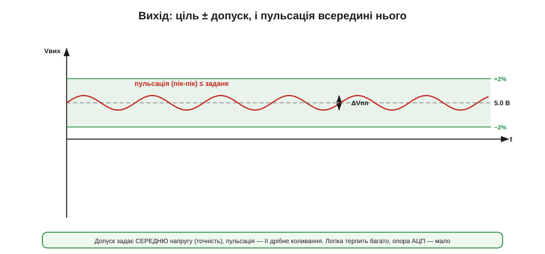
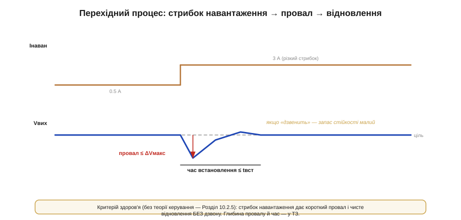
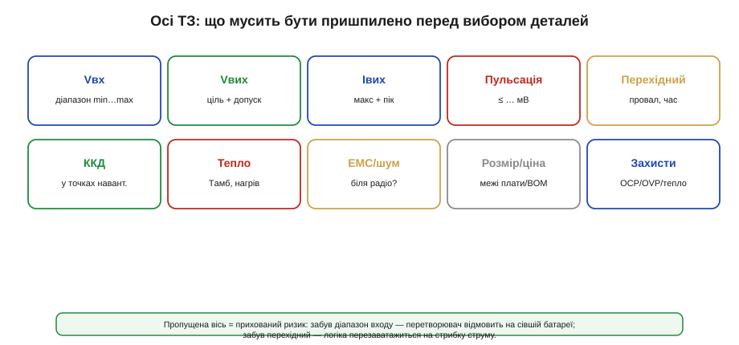
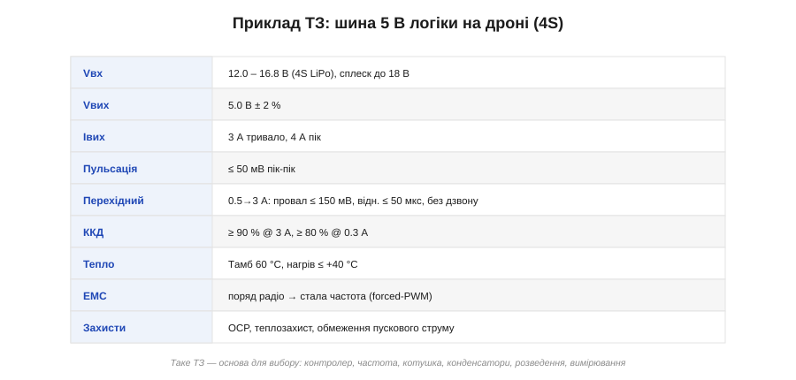

# ТЗ перетворювача: діапазони, пульсації, перехідні процеси

<preknowlist>
- [Buck (знижувальний перетворювач)](topic:hw-power/buck) — як імпульсний DC-DC знижує напругу, що таке шпаруватість, пульсація й крива ККД.
- [Просідання батареї](topic:hw-power/battery-sag) — чому напруга джерела падає під навантаженням і по ходу розряду.
</preknowlist>

Перш ніж паяти, малювати плату чи навіть вибирати мікросхему, інженер пише **технічне завдання** (ТЗ) на перетворювач — специфікацію того, що вузол має робити. Це нудна на вигляд, але найважливіша сторінка проєкту: перетворювач, побудований без ТЗ, майже завжди побудований **не так**. Суть роботи проста: перетворити рядок бюджету живлення на конкретну, придатну до реалізації специфікацію.

Чому саме **перед** вибором деталей? Бо вартість виправлення росте лавиною з кожним етапом. Невказана вимога, помічена на стадії ТЗ, коштує рядка тексту; помічена після розведення — нової плати; помічена в полі — відкликання партії й репутації. Контролер, котушка, конденсатори, розведення — усе це похідні від ТЗ, тож змінена наприкінці вимога тягне за собою перероблення всього ланцюга. Година, витрачена на чесне ТЗ, економить тижні переробок.

### Від бюджету до ТЗ

Відправна точка — **бюджет живлення**: перелік усіх шин апарата, їхні напруги й потрібні струми. Бюджет каже, наприклад: «потрібна шина 5 В на 3 А». Здавалося б, цього досить — бери buck та й роби 5 В. Але рядок бюджету — це ще **не** ТЗ.

*Один рядок бюджету («5 В, 3 А») розгортається в цілу специфікацію: діапазон входу, ціль і допуск виходу, максимальний і піковий струм, пульсація, перехідний процес, ККД, тепло, ЕМС, захисти. Кожен із цих пунктів — окреме рішення, без якого вузол неповний.*

Чому одного рядка мало? Бо «5 В, 3 А» не каже, **з чого** робити ці 5 В (вхід же плаває), **наскільки точно** їх тримати, **як чисто**, **як швидко** реагувати на стрибки навантаження, **скільки** тепла можна відвести й **що** робити при аварії. Усе це — окремі осі ТЗ, і кожна потребує свого рішення.

### Діапазон входу: Vвх — це не число

Найперша й найчастіше забута річ: **вхідна напруга — це діапазон**, а не одне значення. Батарея сповзає під час розряду й [просідає під навантаженням](topic:hw-power/battery-sag); мережа гуляє ±10 %; USB просідає на тонкому кабелі. Тому ТЗ задає Vвх **від мінімуму до максимуму**, і проєктувати треба на **весь** діапазон, причому кожен край диктує своє.

*Vвх — це смуга min…max. Нижній край (батарея сіла) диктує, чи дотягне buck і чи не потрібен boost, та задає найбільшу шпаруватість. Верхній край (повний заряд, сплеск мережі) диктує номінали напруги ключів і конденсаторів, найгіршу пульсацію струму й пусковий струм.*

**Vвх мінімальний** вирішує саму **здійсненність**: чи зможе buck іще знизити до виходу із запасом на падіння (dropout), чи вже потрібен boost або [buck-boost](topic:hw-power/buck-boost) — як у випадку, коли вхід то вищий, то нижчий за вихід. **Vвх максимальний** вирішує **стрес**: на яку напругу брати ключі й конденсатори (з запасом!), де буде найгірша [пульсація струму](topic:hw-power/buck) (для buck вона максимальна саме за макс. Vвх) і який буде пусковий кидок. Пропустите діапазон — і вузол, що чудово працює на столі за 12 В, відмовить у полі, коли батарея сяде до 12 В або підскочить до 16.8.

Тут криється тонкість із **запасом на падіння** (*dropout*). Buck не може зробити вихід, рівний входу: на ключі, котушці й доріжках завжди губиться частка вольта, тож потрібен запас Vвх − Vвих хоча б у кілька десятих. Якщо ваш вихід 5 В, а вхід може сісти до 5.1 В, чистий buck **не дотягне** — і це видно лише тоді, коли в ТЗ чесно вписано Vвх мінімальний. Звідси загальне правило проєктування живлення: рахувати **кожен край у найгіршу сторону** — здійсненність за мінімумом входу, стрес за максимумом, найбільший струм за повним навантаженням. Вузол, спроєктований лише «на номінал», ламається на краях, яких ніхто не порахував.

### Вихід: ціль, допуск і пульсація

Вихід задають **двома** різними числами, які легко сплутати. Перше — **ціль із допуском**: скажімо, 5.0 В ± 2 %. Це про **середню** напругу — наскільки точно вузол її тримає попри дрейф входу, навантаження й температури. Друге — **пульсація**: дрібне швидке коливання навколо середнього, що його [залишає перемикання](topic:hw-power/buck).

*Дві різні вимоги до виходу. Смуга допуску (5.0 В ± 2 %) обмежує СЕРЕДНЮ напругу — точність. Пульсація (пік-пік) — це дрібна хвиля всередині цієї смуги. Скільки пульсації терпимо — залежить від навантаження: цифрова логіка ковтає десятки мВ, а опорна напруга АЦП чи радіо хочуть одиниці.*

Скільки пульсації дозволити — питання не перетворювача, а **навантаження**. Цифрова логіка незворушна до десятків мілівольт; а ось опора аналого-цифрового перетворювача чи живлення радіоприймача хочуть чистоти на рівні одиниць мілівольт, інакше пульсація просочиться в покази чи ефір. Тому пульсацію в ТЗ беруть **від вимог споживача** цієї шини — і вже вона потім задасть котушку, конденсатори та їхній ESR.

### Перехідні процеси: реакція на стрибок

Статика — це ще не все. Реальне навантаження **стрибає**: процесор прокинувся, мотор смикнув, радіо ввімкнуло передавач — і струм за мікросекунди підскочив з 0.5 до 3 А. Перетворювач не встигає зреагувати миттєво, тож вихід на мить **провалюється**, а тоді відновлюється. ТЗ мусить обмежити і **глибину** цього провалу, і **час** відновлення.

*Стрибок навантаження (0.5 → 3 А) дає короткий провал виходу, після чого контур повертає напругу до цілі. ТЗ задає максимальний провал (ΔVмакс) і час встановлення (tвст). Здоровий перетворювач відновлюється чисто; якщо вихід «дзвенить» — запас стійкості малий.*

Тут є простий **критерій здоров'я**, який не потребує теорії керування: стрибок навантаження має дати короткий провал і **чисте відновлення без дзвону**. Глибокий провал означає, що контур повільний або конденсаторів замало; дзвін означає, що [запас стійкості](topic:hw-power/feedback-stability) на межі. Поряд із навантаженням ТЗ часом обмежує й реакцію на **стрибок входу** (line transient) — коли, скажімо, підмикають свіжу батарею, і вхід підскакує: вихід має лишитися в допуску.

Глибину провалу задають дві речі. Перша — **вихідний конденсатор**: у перші миті стрибка, поки контур ще не відреагував, увесь зайвий струм віддає саме він, і чим більше в ньому запасеної енергії, тим менший провал. Друга — **швидкість контуру**: як скоро перетворювач підніме шпаруватість і добере струм. Тому жорстка вимога на перехідний процес у ТЗ наперед визначає і [ємність вихідних конденсаторів](topic:hw-power/converter-caps), і потрібну [смугу контуру](topic:hw-power/feedback-stability). Це ще один приклад, як рядок ТЗ тягне за собою конкретні деталі: «провал ≤ 150 мВ» — це не побажання, а майбутній номінал конденсатора.

> 🔧 **Навіщо це.** Більшість «незрозумілих» збоїв живлення — це пропущений перехідний процес у ТЗ. Логіка перезавантажується не тому, що середня напруга погана, а тому, що на стрибку струму вихід на мить провалився нижче порога brownout. Тому провал і час відновлення — не дрібниця, а часто найжорсткіша вимога всього ТЗ.

### Решта осей: ккд, тепло, ЕМС, захисти

Кілька осей лишаються, і пропуск кожної — прихований ризик.

*Десять осей, які мусять бути пришпилені перед вибором деталей. Пропущена вісь = прихований ризик: забув діапазон входу — відмова на сівшій батареї; забув перехідний — перезавантаження на стрибку; забув тепло — термозахист вимикає вузол у спеку.*

- **ККД** — і не одним числом, а **в точках навантаження**: ≥ 90 % на повному струмі (де важить тепло) і пристойно на малому (де важить автономність — [крива ККД залежить від навантаження](topic:hw-power/buck)).
- **Тепло** — за якої температури довкілля (Tамб) працює вузол і скільки він сміє нагрітися; це вирішує, чи потрібен радіатор і який запас за струмом.
- **ЕМС / шум** — чи стоїть перетворювач поряд із радіо або чутливим давачем; якщо так, у ТЗ йде стала частота (forced-PWM) і вимоги до фільтрації.
- **Розмір і ціна** — межі плати й BOM, що часто й вирішують [між дискретом та інтегрованим модулем](root:embedded/topology-map).
- **Захисти** — які саме потрібні: від перевантаження струму (OCP), перенапруги (OVP), перегріву, обмеження пускового струму. Краще вирішити це в ТЗ, ніж дізнатися про потребу після згорілої плати.

### Запас: не проєктуйте на межі

Усе ТЗ пронизує одна інженерна звичка — **запас** (*margin*, derating). Жоден компонент не ставлять працювати на його паспортній межі: ключ на 20 В не беруть на шину, де буває рівно 20 В; конденсатор на 25 В не ставлять на 25-вольтову лінію; котушку з насиченням 4 А не вантажать піком 4 А. Беруть із запасом — типово 20–50 % за напругою й струмом, а біля тепла й поготів. Причини прості: реальні сплески перевищують номінал, параметри деталей плавають із температурою та старінням, а близька до межі деталь гріється й деградує швидше.

Тому ТЗ — це не лише цілі, а й **умови найгіршого випадку**, у яких ці цілі мусять триматися: найвищий вхід, найбільший струм, найгарячіше довкілля — одночасно. Перетворювач, що ледь проходить ТЗ за ідеальних умов, у полі відмовить; той, що проходить його із запасом за найгірших, — працюватиме роками. Запас коштує трохи грошей і місця, але економить згорілі плати й нічні дзвінки з поля.

### Приклад ТЗ: шина 5 В на дроні

Зведімо все в конкретну специфікацію — для шини 5 В логіки на апараті з 4S-батареєю:

| Параметр | Значення |
|---|---|
| **Vвх** | 12.0 – 16.8 В (4S LiPo), сплеск до 18 В |
| **Vвих** | 5.0 В ± 2 % |
| **Iвих** | 3 А тривало, 4 А пік |
| **Пульсація** | ≤ 50 мВ пік-пік |
| **Перехідний** | 0.5 → 3 А: провал ≤ 150 мВ, відновлення ≤ 50 мкс, без дзвону |
| **ККД** | ≥ 90 % @ 3 А, ≥ 80 % @ 0.3 А |
| **Тепло** | Tамб 60 °C, нагрів ≤ +40 °C |
| **ЕМС** | поряд радіо → стала частота (forced-PWM) |
| **Захисти** | OCP, теплозахист, обмеження пускового струму |

*Готове ТЗ вузла. Саме за цими числами добирають контролер і частоту, котушку, конденсатори, а тоді розводять плату й вимірюють результат. Кожен рядок ТЗ перетворюється на інженерне рішення.*

Зверніть увагу, як кожен рядок **вже містить** напрямок рішення. Діапазон входу 12–18 В і вихід 5 В → це чисте зниження, отже buck; великий струм і вимога ККД → синхронний; «поряд радіо» → forced-PWM; пульсація ≤ 50 мВ і провал ≤ 150 мВ → ємність і ESR вихідних конденсаторів; сплеск входу до 18 В → ключі щонайменше на 25–30 В із запасом. ТЗ не просто описує мету — воно наполовину диктує реалізацію. Тому добре написане ТЗ — це вже половина проєкту: кожен його рядок **перетворюється на конкретну деталь чи число**, а перший із цих виборів — [контролер і частота комутації](topic:hw-power/controller-fsw) — стоїть уже наступним.
