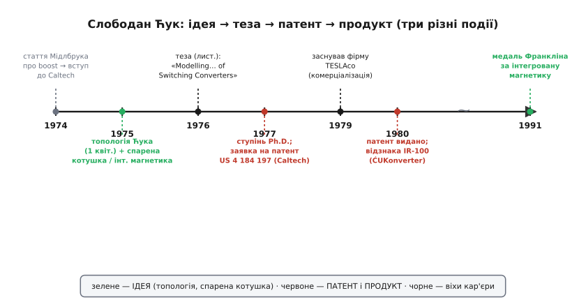

# 📜 Як Слободан Ћук «зігнав» пульсацію в парну обмотку

Є прийоми, що народжуються з розпачу перед конкретною поломкою, а є ті, що виростають з упертого питання «а що, як зробити ідеально?». Спарена котушка в перетворювачі — з других. За нею стоїть жива людина, конкретна докторантура в конкретному місці й конкретний рік, а ще — приємно рідкісна для інженерії ясність, хто саме що придумав, бо майже все лягло в датовані статті й патенти. Тож розберімо не «як воно працює» (це в самій темі), а **звідки воно взялося**: що бентежило, хто зняв питання й чому його ім'я тепер на цілому класі топологій.

## Хто такий Ћук — і чому не «російський»

Почнімо з імені, бо його регулярно спотворюють. **Слободан Ћук** (серб. Слободан Ћук, англ. Slobodan Ćuk; прізвище часто пишуть без діакритики — «Cuk», і англомовні читають його то «Кук», то «Чук») — **серб**, не «російський» і не «радянський» інженер. Народився в Югославії, диплом інженера (Dipl.-Ing.) здобув у **Белградському університеті 1970 року**; батьки — Мілойко та Юліяна Ћук. Це важливо проговорити чітко, бо в науково-популярних текстах слов'янське прізвище за інерцією тягне до ярлика «російське» — а тут перед нами саме серб із тодішньої Югославії, і жодна частина його роботи не належить радянській школі. Точна дата й місце народження в доступних джерелах не задокументовані надійно, тож вигадувати їх не будемо; певне — етнічність, громадянство на старті (Югославія) та освіта.

> 🔧 **Навіщо це.** Розрізняти виміри ідентичності — не педантизм. Слов'янське прізвище саме собою нічого не каже про наукову школу, громадянство чи внесок: Ћук — серб, який зробив свою фундаментальну роботу вже у США, у Caltech. Плутати це з «радянським» — та сама помилка, що клеїти українцям, полякам чи грузинам ярлик «російське». Атрибуція винаходу — це передусім точність, а не національна гордість.

Далі — переїзд, що визначив усе. **29 лютого 1972 року** Ћук прилетів до США чартерним рейсом, спонсорованим **NASA**, щоб продовжити навчання. Спершу — магістратура: **M.S. з електротехніки в Університеті Санта-Клара (Каліфорнія), 1974**. А тоді — Caltech, і саме там, у стінах Каліфорнійського технологічного, за якихось два роки народилося все, що ми сьогодні звемо його ім'ям.

## Іскра: чужа стаття про boost

Цікаво, що завело Ћука в силову електроніку **не** його власна ідея, а **чужа стаття**. У січні 1974-го йому до рук потрапила робота професора Caltech **Роберта Д. Мідлбрука** (Robert David Middlebrook, для колег — «Дейв») про [підвищувальний boost-перетворювач](root:hw-power/boost). Стаття так його зачепила, що він **подав документи до Caltech** саме заради роботи в групі Мідлбрука. Так почалося те, що згодом сам Ћук назве своїм «маніфестом силової електроніки».

Тут варто зупинитися на постаті Мідлбрука, бо історія спареної котушки — це історія **двох** людей, а не одної. Мідлбрук на той час уже був визнаним теоретиком аналогових схем; його ім'я знають кожен, хто колись рахував стійкість зворотного зв'язку (згадайте «критерій Мідлбрука» для розриву петлі). Він став **науковим керівником** Ћука. І далі їхні внески переплетуться так, що розплутувати їх треба обережно — що ми й зробимо.

## Перша ідея: «оптимальна топологія» — четвертий фундаментальний перетворювач

Уже за рік після приходу Ћук зробив перший великий крок. **1 квітня 1975 року** (дату він називає сам у своїх спогадах) він винайшов те, що спершу звав **«перетворювачем оптимальної топології»** (*optimum topology converter*), а світ згодом назве просто **перетворювачем Ћука** (*Ćuk converter*). Його поставили в один ряд із трьома «класичними» — [buck](root:hw-power/buck), [boost](root:hw-power/boost) і [buck-boost](root:hw-power/buck-boost) — як **четверту фундаментальну топологію** знижувально-підвищувального роду.

Що в ній було нового? Класичні три топології передають енергію **через котушку**: у якійсь фазі струм через неї рветься, і тому вхідний або вихідний струм неминуче **імпульсний** — рвучкий, з різкими фронтами, що засмічують і джерело, і навантаження завадами. Ћук зробив інакше: у його схемі енергію з входу на вихід переносить **конденсатор**, а на вході й на виході стоять **дві окремі котушки, кожна з безперервним струмом**. Струм ніде не рветься — ані на вході, ані на виході. Це й була «оптимальність»: перетворювач, що з обох боків тягне й віддає **плавний, непульсуючий** струм.

І ось де зав'язується вузол нашої теми. Раз на вході й на виході — **дві котушки**, і раз на них (як з'ясувалося з аналізу) прикладено **однакову** змінну напругу, то напрошується зухвале питання: а що, як намотати їх на **одне** осердя?

## Народження спареної котушки: «а зженемо пульсацію туди, де вона не заважає»

Тут і криється справжня іскра винаходу, і вона не про економію деталей. Наївний мотив «дві котушки на одному сердечнику — дешевше й компактніше» правильний, але дрібний. Ћука вело питання гостріше: **чи можна пульсацію струму прибрати зовсім — не зменшити, а звести до нуля?**

Логіка була така. Кожна реальна обмотка — це тісно зв'язана «ідеальна» частина плюс маленька [незв'язана індуктивність витоку](root:hw-components/inductor-parasitics). Пульсацію струму в обмотці жене саме напруга на **витоковій** частині — бо зв'язана частина «прив'язана» до сусідки й напруга на ній нав'язана. А коли на обох обмотках **однакова** змінна напруга (як у цій топології!), то, підібравши зв'язок між ними, можна домогтися, щоб чиста змінна напруга на витоку однієї обмотки стала **рівно нуль**. Немає напруги на витоку — немає й пульсації через нього. Струм тієї обмотки перестає гойдатися зовсім.

Куди ж поділася пульсація? Вона нікуди не зникла — її **зіштовхнули в парну обмотку**. Змінну складову струму навмисне «зігнали» з тієї шини, де вона шкодить, на ту, де байдуже. Пізніше цей прийом дістане влучну назву **керування пульсацією** (*ripple steering*) — пульсацію не гасять, а **скеровують**, як воду по жолобу.

Це і є момент, коли **спарена котушка** стала не просто «двома котушками на спільному осерді заради дешевизни», а **інструментом**. І звідси ж виріс ширший метод, який Ћук назве **інтегрованою магнетикою** (*integrated magnetics*): якщо на кількох котушках перетворювача змінні напруги узгоджені, їх усі можна звести на **одне** осердя й керувати потоками так, щоб пульсації складалися чи гасилися за задумом. Замість купки окремих дроселів — один магнітний вузол, спроєктований як ціле. Ідея коупльованих котушок та інтегрованої магнетики визріла в нього приблизно **1975 року**, поруч із самою топологією.

## Умова нуля пульсації: не просто «k = n»

Тепер — точний момент, який варто проговорити, бо в стислому вигляді його часто спрощують до формули «k = n», а насправді умов **дві**, і вони симетричні. У патенті, де це вперше зафіксовано строго (US 4 184 197, про нього нижче), сказано ясно: якщо дві котушки зробити обмотками спільної магнітної структури з коефіцієнтом витків **n** і коефіцієнтом зв'язку **k**, то

```
n = k     →  нуль пульсації ВИХІДНОГО струму
n = 1/k   →  нуль пульсації ВХІДНОГО струму
```

Тобто одним і тим самим магнітом можна **обрати**, яку шину зробити ідеально гладкою — вхідну чи вихідну (обидві водночас точно занулити не можна, бо k однакове для пари, а умови різні; але наблизити обидві — можна). Оскільки k завжди трохи менше за одиницю, для нуля вихідної пульсації витків вторинної роблять **трохи менше**, ніж дала б проста рівність, — рівно настільки, наскільки зв'язок неідеальний.

А як виставити це на практиці, коли витки — цілі числа й точного k «під замовлення» не намотаєш? Відповідь фізично гарна: **положенням повітряного зазору** в осерді. Зазор ближче до однієї обмотки перерозподіляє, чий витік куди тече, і плавно підганяє ефективний зв'язок — так пульсацію потрібної шини доводять до нуля **механічним** доведенням, без перемотування. Саме тому наступний патент Ћука так і назветься — «перетворювач зі зниженою пульсацією **без потреби в підстроюванні**» (US 4 274 133): у ньому знайдено конструкцію, де нуль тримається сам, конструктивно.

> 🔧 **Навіщо це.** Це рідкісний в електроніці випадок, коли параметр доводять до **точного нуля**, а не просто «поменшав». І платня за нуль — не додаткова схема, не активне гасіння, а **геометрія осердя**: де покласти зазор. Розуміти, що умов дві (n = k проти n = 1/k) — це розуміти, що інженер **вибирає**, яку шину принести в жертву заради ідеалу іншої. У реальному живленні це буквально визначає, чи піде завада в мережу, чи в навантаження.

## Тонший вузол: state-space averaging і хто його автор

Паралельно з топологією й магнетикою в тій самій докторантурі народилося ще дещо, і саме тут атрибуцію треба вести найакуратніше, бо це **спільна** робота Ћука й Мідлбрука.

Проблема була така: імпульсний перетворювач — це схема, що **стрибками** перемикається між двома станами тисячі разів на секунду. Як порахувати її **плавну** динаміку — стійкість петлі, реакцію на зміну навантаження — не тонучи в кожному окремому перемиканні? Ћук і Мідлбрук дали елегантну відповідь — **усереднення у просторі станів** (*state-space averaging*): описати кожен стан рівняннями в змінних стану, а тоді **усереднити** їх за період з вагою шпаруватості. Одним рухом перемикання «розмазується», і лишається гладка модель, придатна для звичайного аналізу стійкості.

Це виклали у праці **Р. Д. Мідлбрук і Слободан Ћук, «A General Unified Approach to Modeling Switching-Converter Power Stages»**, представленій на конференції **IEEE Power Electronics Specialists Conference (PESC) 1976 року**. Метод став **класикою**: сьогодні його вчать у кожному курсі силової електроніки, і саме він перетворив проєктування імпульсних джерел із мистецтва «покрути й подивись» на інженерію з передбачуваною петлею.

Хто ж «автор»? Чесна відповідь — **обидва**, і краще не приписувати state-space averaging одному Ћукові. Це вийшло зі спільної роботи керівника й докторанта; спогади самого Ћука й хвалебні відгуки Мідлбрука про «дуже елегантне розв'язання» узгоджено малюють картину співавторства, а не одноосібного прориву. Натомість **топологія Ћука** й **спарена котушка / інтегрована магнетика** — це вже виразно його власний внесок, хоч і зроблений під керівництвом Мідлбрука і з ним у співавторах ключового патенту. Розрізняймо: метод аналізу — спільний; конкретна топологія й магнітний прийом — його.

## Теза 1976-го: коли саме «народилося» поняття

Тепер зберемо докупи датування, бо джерела дають два роки — **1976** і **1977** — і це збиває з пантелику.

Розв'язка проста, щойно розділити дві події. **Сама дисертація** — «Modelling, Analysis and Design of Switching Converters» — датована **листопадом 1976 року**: це момент, коли ідеї були викладені, оформлені й, по суті, «народилися» як завершене ціле. А **ступінь** Ph.D. Caltech формально присуджує **1977 року** — звідси й друга дата в біографіях. Обидві правильні, просто про різне: **робота готова — кінець 1976; диплом на руках — 1977**. Коли кажемо, що спарена котушка й топологія Ћука «народилися в докторантурі, теза листопад 1976» — маємо на увазі саме дату завершеної роботи.

Ось як лягає вся послідовність:


*Хронологія: іскрою була чужа стаття Мідлбрука про boost (січень 1974), сама топологія — 1 квітня 1975, спарена котушка й інтегрована магнетика — того ж 1975-го, теза — листопад 1976 (ступінь — 1977). Патент на топологію (зі зниженням пульсації через спарену котушку) подано 1977-го й видано 1980-го; далі — власна фірма TESLAco (1979) і медаль Франкліна за інтегровану магнетику (1991). Ідея, патент і комерціалізація — три різні події, рознесені в часі.*

## Ідея, патент, продукт — три різні речі

Історія Ћука — гарна нагода побачити, як **ідея**, **патент** і **комерціалізація** — то три окремі кроки, які плутати не можна. Тут вони гарно рознесені в часі й підписані.

**Ідея** визріла в докторантурі: топологія — квітень 1975, спарена котушка й інтегрована магнетика — 1975, оформлена теза — листопад 1976.

**Патент** прийшов пізніше й — важлива деталь — **не на саму топологію взагалі**, а на конкретну реалізацію з непульсуючими струмами. Заявку US 4 184 197 «DC-to-DC switching converter» подав **Caltech 28 вересня 1977 року**, а видано патент **15 січня 1980-го**. Винахідників у ньому **двоє — Слободан М. Ћук і Роберт Д. Мідлбрук**, а власник — **Caltech** (як і належить роботі, зробленій в університеті: права в інституту, імена — авторів). Саме цей патент строго фіксує коупльовану котушку й умови нуля пульсації n = k та n = 1/k. Наступний, US 4 274 133, доводить ідею до конструкції «без підстроювання». Тобто «хто перший подумав» і «на що є патент» — не одне й те саме: подумали про непульсуючий перетворювач у 1975-му, а юридично закріпили конкретну схему з двома іменами аж у 1980-му.

**Комерціалізація** — ще окремий крок і ще пізніше. У **1979 році** Ћук заснував власну фірму **TESLAco** (Laguna Niguel, Каліфорнія) — з прямим наміром перетворити базові дослідження Caltech на реальні цивільні й військові вироби. Технологію продавали під маркою **ĆUKonverter**. У **1980-му** він дістав галузеву відзнаку **IR-100** (журнал *Industrial Research*) саме за нову запатентовану топологію та її розширення. Так замкнулося коло: стаття → ідея → теза → патент → фірма → продукт на полиці.

> 🔧 **Навіщо це.** Коли читаєте «Х винайшов Y», привчіть себе питати: винайшов **ідею**? опублікував **теорію**? зібрав **робочу схему**? отримав **патент**? випустив **продукт**? У Ћука всі п'ять кроків **різні за датою й почасти за складом авторів** — і це нормальний, чесний вигляд винаходу. Міф «геній вигадав усе одним махом» майже завжди ховає таку саму розтягнуту в часі й розділену між людьми реальність.

## Чому спарена котушка стала класикою

Лишилося сказане, чому цей прийом пережив свого автора в підручниках. Причина проста: він розв'язує задачу, що **не зникає** з роками. Будь-яке імпульсне джерело живлення засмічує і власне навантаження, і мережу, з якої живиться, — пульсацією струму, а з нею й [електромагнітними завадами](root:hw-power/controller-fsw). Способів **зменшити** пульсацію багато; спосіб довести її на потрібній шині до **нуля однією деталлю, без активних схем** — рідкість. Тому керування пульсацією й інтегрована магнетика й досі в арсеналі там, де чистота живлення критична: автомобільна електроніка, радіочастотні тракти, чутлива вимірювальна техніка.

І визнання це підтвердило. У **1991 році** Інститут Франкліна (Philadelphia) вручив Ћукові **медаль Едварда Лонгстрета** (Edward Longstreth Medal) з формулюванням «за піонерську роботу й пришвидшення розвитку **інтегрованої магнетики** та імпульсного перетворення енергії». Тобто відзначили не топологію як таку, а саме **магнітний прийом** — той, що починається зі спареної котушки. Понад **30 патентів** з його іменем, понад тридцять докторів, підготованих під його керівництвом за двадцять із гаком років у Caltech (до 1 січня 2000-го), — усе це виросло з одного впертого питання, поставленого молодим сербом у 1975-му: **а що, як пульсацію не зменшити, а зовсім прибрати — просто зігнавши її туди, де вона нікому не заважає?**
