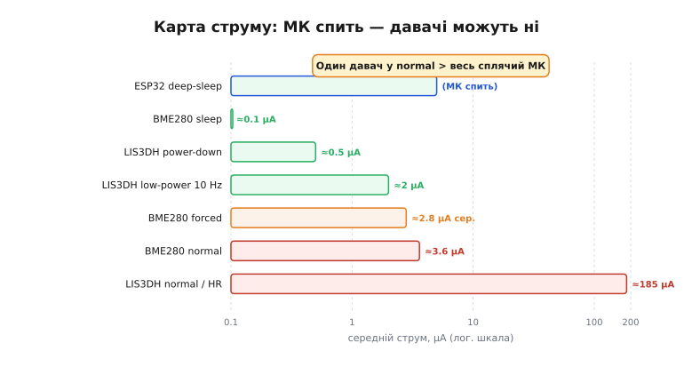
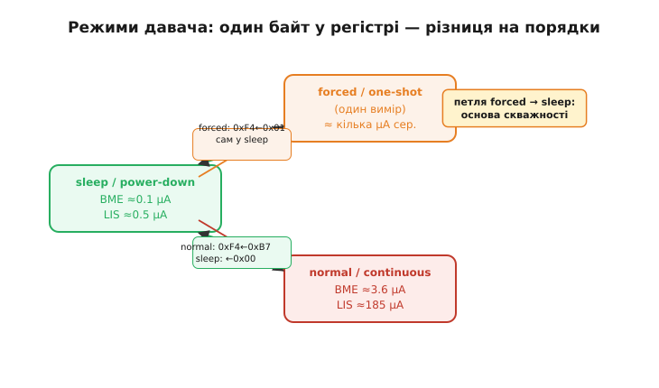

# 🔌 Хто на платі не спить: standby-струми давачів (BME/LIS-класи)

> Карта споживання самого чипа — ядро, радіо, периферія, витоки, стабілізатор — це лише половина історії. Решта струму тече назовні: у давачі, що висять на шині й тихо тягнуть струм, навіть коли МК уже спить. Тут давачі цікавлять нас суто з боку струму — не ніжка INT, а доданок до бюджету.

---

## Що це за клас

Цифрові давачі на I²C/SPI, яких МК час від часу опитує: давачі середовища (BME280-клас — тиск/вологість/температура) і руху (LIS3DH-клас — акселерометр). Тут нас цікавить не те, як вони повідомляють про подію, а скільки струму тягнуть.

Ключова теза: такий давач має кілька режимів живлення, і **після ввімкнення він типово опиняється в безперервному (normal/continuous mode, від латин. *continuus* — «суцільний») — найненажерливішому**. Він **не засинає сам** тільки тому, що заснув МК: на шині є живлення, давач вимірює й споживає струм. Слово «standby» (англ. «напоготові») тут і означає цей стан очікування, у якому давач усе одно тягне струм.

[Бюджет батареї](topic:hw-power/battery-budget) — це **середній струм** за добу. Забутий у normal-режимі давач додає постійний доданок, що легко перевершує мікроамперний сон самого чипа.

> 🔧 **Навіщо це.** Режим давача — значення одного байта в конфігураційному регістрі. Це значення вирішує, чи проживе пристрій місяці чи лише дні від однієї батареї.

---

## Блок-схема: що на платі споживає

Готовий модуль із давачем несе кілька споживачів: сенсорний кристал, інтерфейсну логіку, а часто — ще й власний LDO та підтяжки шини. Ці елементи споживають окремо й не вимикаються командою sleep (детально — [споживання плати в цілому](root:embedded/board-consumption)).

Але головне — порівняти доданки самого кристала залежно від режиму:



*Карта струму, продовжена на давачі: сплячий МК поряд із давачем у sleep і в normal-режимі. Один забутий у normal давач перевершує весь сплячий чип.*

Типові орієнтири (з даташитів, не абсолют):

| Стан | BME280 | LIS3DH |
|------|--------|--------|
| sleep / power-down | ≈0.1 µA | ≈0.5 µA |
| forced / one-shot (рідкісні виміри) | ≈2–3 µA сер. | — |
| low-power 10 Hz | — | ≈2 µA |
| normal / high-res безперервно | ≈3.6 µA | ≈185 µA |

Сплячий ESP32 у deep-sleep — одиниці–десятки µA. LIS3DH у normal дає ≈185 µA. **Один забутий давач у безперервному режимі споживає більше за весь сплячий МК** — і це не крайній випадок, а норма, якщо не думати про режим давача заздалегідь.

Керує цим конфігураційний регістр — розгляньмо підключення й сам регістр.

---

## Підключення (акцент — струм)

Лінії стандартні для цифрового давача: VCC, GND, SDA/SCL (I²C) або SPI, опціонально INT.

```
VCC ──→ 3V3   GND ──→ GND
SDA ──→ GPIO_SDA (з підтяжкою до 3V3)
SCL ──→ GPIO_SCL (з підтяжкою до 3V3)
INT ──→ GPIO_INT (вихід open-drain) [опціонально]
```

Поки на VCC є живлення — давач активний і споживає відповідно до свого режиму. Сон МК нічого не змінює. Радикальний вихід — load switch на VCC (його ставлять на [пробудження за зовнішнім сигналом](topic:hw-arch/wakeup-sources) і розглядають у балансі [споживання плати](root:embedded/board-consumption)). Дешевший і поширеніший — перевести давач у sleep командою по шині перед тим, як МК засне.

---

## Перший байт: приспати давача

**BME280**, регістр `CTRL_MEAS` (`0xF4`), біти `mode[1:0]`:
- `00` — sleep mode (≈0.1 µA)
- `01`/`10` — forced mode: один вимір, далі сам у sleep
- `11` — normal mode: безперервно

**LIS3DH**, регістр `CTRL_REG1` (`0x20`), біти `ODR[3:0]`:
- `0000` — power-down (≈0.5 µA)
- ненульовий ODR — low-power або normal залежно від LPen/HR

Приспати = один байт по I²C. Діаграма нижче показує переходи між режимами й струм у кожному стані:



*Режими давача й струм кожного стану; стрілки підписані тим, що пишемо в регістр. Петля forced → sleep — основа скважності.*

Зверніть увагу на петлю **forced → sleep**: давач прокидається на один вимір і сам засинає. Це фундамент скважності — частки часу, яку давач проводить активним.

---

**Worked-приклад: приспати BME280 і LIS3DH перед deep-sleep**

Умова: перед переходом у [deep-sleep](topic:hw-arch/sleep-modes) обидва давачі мають лишитись у найекономнішому стані.

:::tabs
```cpp
#include <Wire.h>

constexpr uint8_t BME280_ADDR   = 0x76;  // або 0x77 (ADR=1)
constexpr uint8_t LIS3DH_ADDR   = 0x18;  // або 0x19 (SA0=1)
constexpr uint8_t BME_CTRL_MEAS = 0xF4;  // mode[1:0] → 00 = sleep
constexpr uint8_t LIS_CTRL_REG1 = 0x20;  // ODR[3:0]=0000 → power-down

void i2cWrite8(uint8_t addr, uint8_t reg, uint8_t val) {
    Wire.beginTransmission(addr);
    Wire.write(reg); Wire.write(val);
    Wire.endTransmission();
}

void sensorsSleep() {
    i2cWrite8(BME280_ADDR, BME_CTRL_MEAS, 0x00);  // BME → sleep
    i2cWrite8(LIS3DH_ADDR, LIS_CTRL_REG1, 0x00);  // LIS → power-down
    // esp_deep_sleep_start();  // далі — у deep-sleep
}
```
```python
from machine import I2C, Pin
import machine

BME280_ADDR   = 0x76  # або 0x77 (ADR=1)
LIS3DH_ADDR   = 0x18  # або 0x19 (SA0=1)
BME_CTRL_MEAS = 0xF4  # mode[1:0] → 00 = sleep
LIS_CTRL_REG1 = 0x20  # ODR[3:0]=0000 → power-down

i2c = I2C(0, scl=Pin(22), sda=Pin(21))

def i2c_write8(addr, reg, val):
    i2c.writeto_mem(addr, reg, bytes([val]))

def sensors_sleep():
    i2c_write8(BME280_ADDR, BME_CTRL_MEAS, 0x00)  # BME → sleep
    i2c_write8(LIS3DH_ADDR, LIS_CTRL_REG1, 0x00)  # LIS → power-down
    # machine.deepsleep()  # далі — у deep-sleep
```
:::

Один запис у регістр прибирає доданок «десятки–сотні µA» з бюджету. Для масштабу:

```
185 µA − 0.5 µA = 184.5 µA  (LIS3DH: normal vs power-down)
184.5 µA × 24 h ≈ 4.4 mA·h зекономлено за добу
```

Для 150 mA·h LiPo це ≈3 % ємності щодня — тільки від одного забутого в normal-режимі давача.

---

## Чому forced-режим виграє: рахунок скважності

Сама по собі назва «forced» нічого не економить — економить **скважність** (англ. duty cycle, «робочий цикл»): частка часу, яку давач проводить активним. У forced-режимі давач прокидається на один вимір, віддає результат і сам падає в sleep, тож його внесок у бюджет — це не струм виміру, а **середній** струм за повний період.

Середній струм складається лінійно з двох доданків — короткого сплеску виміру і довгого хвоста sleep:

```
I_сер = I_active · (t_active / T) + I_sleep · (1 − t_active / T)
   I_active  — струм під час виміру
   t_active  — тривалість одного виміру
   T         — період між вимірами
   I_sleep   — струм у sleep між вимірами
```

Підставимо типові числа для BME280, що міряє раз на хвилину (вимір триває близько 10 мс при ≈0.6 мА):

```
I_active = 0.6 мА,  t_active = 0.01 с,  T = 60 с,  I_sleep = 0.1 µA

I_сер = 600 µA · (0.01 / 60) + 0.1 µA · (майже 1)
      = 600 µA · 0.000167 + 0.1 µA
      = 0.10 µA + 0.1 µA ≈ 0.2 µA
```

Той самий давач у normal-режимі тягнув би 3.6 µA безперервно — у вісімнадцять разів більше, хоч корисних вимірів стільки ж. Уся різниця — в одному біті режиму й у тому, що між вимірами кристал спить. Звідси й правило: чим рідші виміри, тим важливіший forced-режим, бо хвіст sleep розтягується, а сплеск виміру лишається тим самим.

> 🔧 **Навіщо це.** Перш ніж міняти давач на «економніший», порахуй його скважність у твоєму циклі: часто той самий кристал у forced-режимі вже дає мікроампери, і дорожчий давач не потрібен. Лівер — не модель, а режим і період опитування.

---

## Типові помилки

- **Забули приспати перед deep-sleep.** МК спить, давач у normal — невидимі десятки–сотні µA. Класична причина «пристрій живе дні замість місяців».

- **Прокинувся МК — давач уже спить.** Після deep-sleep МК стартує з нуля (зберігши хіба що вміст [RTC-памʼяті](topic:hw-arch/rtc-memory)), а давач лишається у sleep. Перед виміром треба явно розбудити — інакше нульові або застарілі дані.

- **«Спить», а струм не падає.** Споживає не кристал, а обв'язка модуля: LDO, підтяжки, світлодіод. Їх не вимикає команда sleep — тільки load switch (див. [споживання плати в цілому](root:embedded/board-consumption)).

- **Підтяжки шини течуть.** Якщо лінія в LOW — через підтяжку 10 kΩ до 3.3 V тече ≈330 µA. На сплячому пристрої це помітний доданок до [споживання плати](root:embedded/board-consumption); тому підтяжки часто живлять не від постійного рядка, а від ніжки МК, яку перед сном переводять у LOW, і струм крізь резистор зникає.

- **Давач живить сплячий МК назад.** Якщо давач лишився активним, а МК зняв своє живлення, напруга з лінії шини може просочитися крізь захисні діоди виводів МК і паразитно його живити. Тоді «вимкнений» контролер тягне струм, якого немає в даташиті, а виміряти джерело важко, бо формально все спить. Вихід той самий — присипляти давача (або знімати з нього живлення) **разом** із МК, а не після.

- **Latched-конфігурація.** Деякі давачі скидають режим після reset або провалу живлення. Корисна звичка: записав sleep → перечитав регістр і переконався, що біти режиму справді ті, що треба.

---

## Варіації класу

Майже кожен цифровий давач на I²C/SPI має ту саму ієрархію: power-down (десяті µA) → forced/one-shot (середній струм за скважністю) → normal/continuous (максимум). Назви різні, ідея одна.

**forced/one-shot + рідкісні виміри** — головний прийом економії на боці давача; він готує ґрунт під цикл «прокинувся → виміряв → заснув», де середній струм визначає [скважність](root:embedded/duty-cycle-current).

Карта струму чипа має продовжуватись на кожен давач — інакше [бюджет батареї](topic:hw-power/battery-budget) рахується неправильно.
