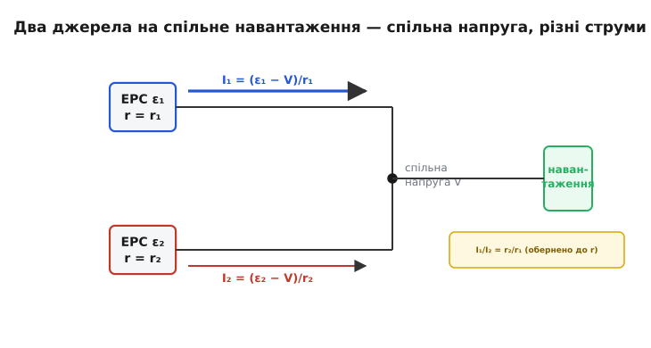
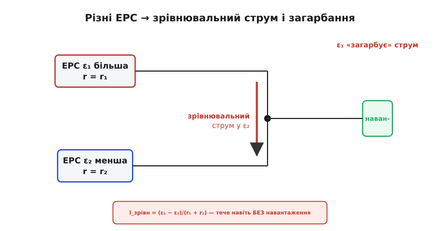

# Розподіл струму між паралельними джерелами

Поставити два однакові блоки живлення (чи два акумулятори) паралельно й чекати, що кожен віддасть рівно половину струму, — спокуслива, але хибна думка. На папері «12 В паралельно з 12 В» дають ті самі 12 В, а скільки бере кожне джерело — рівняння наче й не каже. Насправді каже, просто відповідь ховається в дрібниці, яку ідеалізована схема відкидає: у **внутрішньому опорі** джерела й у крихітній різниці їхніх напруг. Саме ця тема — про те, як струм навантаження ділиться між паралельно з'єднаними джерелами, чому поділ майже завжди **нерівний** і що з цим роблять.

### Чому ідеальна картинка не працює

Почнемо з пастки. Два **ідеальні** джерела напруги на 12 В, з'єднані паралельно, — це суперечність уже в постановці. Ідеальне джерело за визначенням тримає на клемах задану напругу за **будь-якого** струму. Якщо їхні напруги хоч на мілівольт різняться, між ними тече **нескінченний** струм (різниця напруг ділиться на нульовий опір); якщо ж напруги рівні до останнього знака, то скільки бере кожне — невизначено, бо рівняння задовольняється за будь-якого поділу. Ідеалізація тут просто розвалюється — і це сигнал, що ми викинули щось важливе.

Важливе — це [внутрішній опір](root:hw-analog/internal-resistance). Жодне реальне джерело не тримає сталу напругу: щойно з нього беруть струм, напруга на клемах **просідає** за моделлю V = ε − I·r, де ε — електрорушійна сила (внутрішня «справжня» напруга), а r — внутрішній опір. Саме цей r розв'язує парадокс. Він обмежує струм скінченним значенням і робить поділ визначеним. Тож паралельні джерела треба розглядати не як дві ідеальні стрілки напруги, а як дві пари «ЕРС плюс опір» — і тоді все стає на місця.

> 🔧 **Навіщо це.** Це не академічна тонкість. Хочете подвоїти струмову віддачу — паралелите два блоки; хочете резервування (один помер — другий тягне) — теж паралелите. У потужній електроніці паралелять і самі ключі-транзистори, щоб поділити струм і тепло. У всіх цих випадках питання одне: чи поділиться струм **порівну**, чи один елемент перевантажиться й згорить, тягнучи за двох. Відповідь — у цій темі.

### Однакові джерела: спільна напруга, поділ обернено до опору


*Два реальні джерела (ЕРС ε₁, ε₂ з внутрішніми опорами r₁, r₂) під спільним навантаженням. На клемах в обох одна напруга V; струм кожного — I = (ε − V)/r. Що менший внутрішній опір, то більший струм віддає джерело.*

Розгляньмо спершу простий випадок: два джерела з **однаковою** ЕРС ε, але внутрішніми опорами r₁ і r₂, що живлять спільне навантаження. Оскільки клеми з'єднані, напруга на них в обох джерел **одна** — назвімо її V. Тоді струм кожного джерела дає та сама модель просідання:

```
I₁ = (ε − V)/r₁
I₂ = (ε − V)/r₂
```

Поділивши одне на одне, бачимо суть одразу:

```
I₁/I₂ = r₂/r₁
```

Струми відносяться **обернено** до внутрішніх опорів. Це той самий закон, що й у [дільнику струму](root:hw-analog/current-divider): спільна напруга, а струм розливається гілками **прямо** до їхньої провідності (G = 1/r) — більша провідність (менший опір) забирає більше. Менш опірне, «жорсткіше» джерело віддає більший струм; «м'якше» лінується. За однакових r₁ = r₂ поділ точно порівну — але це ідеал, до якого реальність лише наближається.

Чому наближається, а не дорівнює? Бо внутрішні опори двох навіть однаково маркованих блоків **ніколи** не збігаються точно: розкид компонентів, різні довжини проводів, різний контактний опір клем. Якщо r відрізняються на 10 %, то й струми розійдуться приблизно на 10 % — поки що не страшно. Страшно стає, коли різняться **напруги**.

### Різні напруги: зрівнювальний струм і «загарбання»


*Якщо ЕРС різняться (ε₁ > ε₂), частина струму джерела 1 не йде в навантаження, а «провалюється» в джерело 2 — це зрівнювальний струм Δε/(r₁+r₂). Сильніше джерело перевантажене, слабше може навіть заряджатися.*

Тепер хай ЕРС різняться: ε₁ трохи більша за ε₂. Що буде? Джерело з вищою ЕРС «передавлює» сусіда. Частина його струму йде не лише в навантаження, а й **назад у слабше джерело** — між ними тече **зрівнювальний струм** (його ще звуть циркуляційним). Навіть **без жодного навантаження**, просто з'єднавши два джерела з різними ЕРС, ми пускаємо струм по контуру з двох внутрішніх опорів:

```
I_зрівн = (ε₁ − ε₂)/(r₁ + r₂)
```

Звідки видно небезпеку. Внутрішні опори зазвичай **малі** (частки ома, а в потужних блоках — міліоми). Тож навіть скромна різниця ЕРС, поділена на крихітну суму опорів, дає **великий** зрівнювальний струм. Скажімо, два джерела з опорами по 0.05 Ω і різницею напруг лише 0.5 В женуть один в одного 0.5/0.1 = 5 А — і це **до** того, як підключене навантаження.

Під навантаженням картина та сама, лише накладена на корисний струм: сильніше джерело тягне **набагато** більше за свою частку, слабше — мало (а то й заряджається від сусіда). Це явище звуть **загарбанням струму** (англ. *current hogging* — «жадоба до струму»): один елемент захоплює непропорційно великий струм. І воно **самопідсилюється** через нагрів. У багатьох джерел напруга з нагрівом падає, та якщо опір падає швидше за напругу — перевантажений елемент гріється, його опір ще зменшується, він бере ще більше струму, гріється ще дужче. Класична петля з додатним знаком — рідня [тепловому розгону](root:hw-components/power-derating) в транзисторах. Кінець — вихід із ладу того елемента, що «старався за всіх».

**Приклад. Два «однакові» блоки на 12 В: ε₁ = 12.10 В, ε₂ = 11.95 В, r₁ = r₂ = 0.05 Ω. Навантаження бере 20 А. Як поділиться струм?**

Запишемо два рівняння просідання й закон струмів у вузлі (I₁ + I₂ = 20 А), де V — спільна напруга на клемах:

```
I₁ = (12.10 − V)/0.05
I₂ = (11.95 − V)/0.05
I₁ + I₂ = 20
```

Додаємо перші два й прирівнюємо до 20:

```
(12.10 − V)/0.05 + (11.95 − V)/0.05 = 20
(24.05 − 2V)/0.05                    = 20
24.05 − 2V                           = 1.0
V                                    = 11.525 В
```

Тепер струми кожного:

```
I₁ = (12.10 − 11.525)/0.05 = 0.575/0.05 = 11.5 А
I₂ = (11.95 − 11.525)/0.05 = 0.425/0.05 =  8.5 А
```

Різниця ЕРС лише 0.15 В (трохи більше одного відсотка!) — а струми розійшлися 11.5 А проти 8.5 А, тобто майже на третину. Перший блок перевантажений, другий недовантажений. Якби різниця ЕРС була ще більша або опори ще менші, слабше джерело пішло б у **мінус** (від'ємний струм — заряджалося б від сусіда). Ось чому «просто паралельно» — погана ідея: мізерний, неминучий розкид напруг обертається грубим перекосом струмів.

### Як вирівняти поділ

Корінь проблеми ясний: малий внутрішній опір робить струм **надчутливим** до різниці напруг. Звідси й ліки — або **збільшити** ефективний опір кожної гілки, або **активно** підрівнювати напруги.

**Баластні (зрівнювальні) резистори.** Найпростіше — додати в кожну гілку невеликий послідовний резистор R_б. Тепер у знаменнику чутливості стоїть не крихітний r, а помітний (r + R_б), і той самий розкид напруг дає **набагато менший** перекіс струму. У прикладі вище додаймо по 0.2 Ω у кожну гілку — і поділ 20 А стане куди рівнішим (11.5/8.5 → приблизно 10.9/9.1), бо різниця 0.15 В тепер ділиться на 0.5 Ω сумарно, а не на 0.1 Ω. Плата за це — втрати потужності й тепло на баласті, тож резистор беруть якомога меншим, аби лиш приборкати перекіс. Той самий прийом — обов'язковий, коли паралелять силові транзистори: малі резистори в емітерах (для BJT) чи стоках змушують їх ділити струм. Чому крихітні резистори дають великий вирівнювальний ефект і як їх рахувати — у вставці [баласт і зрівнювальні резистори](root:hw-power/current-sharing/math-ballast-sharing.md).

**Розв'язувальні діоди.** Якщо мета — резервування (щоб несправне джерело не тягнуло струм із живого, а навантаження не лишилося без живлення), у кожну гілку ставлять **діод** вістрям до навантаження. Він пропускає струм лише **в** спільний вузол і блокує зворотний, тож зрівнювальний струм просто неможливий: слабше джерело не може «провалитися» у мінус. Це класична схема **діодного АБО** (англ. *diode-OR*) для резервованого живлення. Ціна — спад напруги на діоді (тому беруть Шотткі, а ще краще — активний «ідеальний діод» на MOSFET). Як це працює й де ховаються граблі — у вставці [розв'язувальні діоди для резервування](root:hw-power/current-sharing/comp-diode-or.md).

**Просідання й активний розподіл.** Промислові блоки живлення для паралельної роботи мають вбудовану схему **розподілу струму** (англ. *current sharing*). Найпростіший варіант — **просідання** (англ. *droop*): блок навмисне трохи знижує вихідну напругу зі зростанням свого струму (типово на 1–5 %). Тоді блок, що почав брати забагато, сам **опускає** собі напругу — і сусіди підхоплюють надлишок; система сама вирівнюється, без жодних проводів між блоками. Коли просідання напруги недопустиме (логіка на 3.3 чи 5 В його не стерпить), застосовують **активний** розподіл: між блоками тягнуть сигнальний провід, напруга на якому пропорційна сумарному струму, і кожен блок підстроює свій вихід так, щоб віддавати рівну частку. Звідки взялася потреба паралелити джерела й хто першим зробив це надійно — у [історії паралельного живлення й резервування N+1](root:hw-power/current-sharing/hist-parallel-redundancy.md).

> 🔧 **Навіщо це.** Практичний підсумок для розробника. Ніколи не паралельте джерела «в лоб», сподіваючись на рівний поділ, — мізерний розкид ЕРС дасть грубий перекіс і перегрів сильнішого. Для **більшого струму** беріть блоки, **спеціально призначені** для паралельної роботи (з просіданням чи активним розподілом), або додавайте баласт. Для **резервування** ставте розв'язувальні діоди (краще активні). А якщо паралелите силові транзистори — обов'язково давайте кожному малий струмовирівнювальний резистор і дбайте про спільне охолодження, інакше один захопить струм і згорить.

### Звідки береться сама нерівність

Варто на мить піднятися над формулами й побачити загальний образ. Усе нещастя — від того, що ми ставимо паралельно **джерела напруги**, тобто пристрої, які за своєю природою **нав'язують** напругу, а не струм. Два таких пристрої на одних клемах неминуче «сперечаються», чию напругу тримати, і програш цієї суперечки вимірюється струмом, що тече туди-сюди. Чим «жорсткіше» джерело (менший r), тим упертіше воно стоїть на своєму — і тим болючіший конфлікт за найменшої незгоди.

Порівняйте з паралельними **джерелами струму**: ті задають струм, а напруга в них вільна — тож паралельні джерела струму просто **додають** свої струми без жодного конфлікту (повна двоїстість!). Саме тому в інтегральних схемах, де треба точно поділити чи скласти струми, користуються не паралельними джерелами напруги, а [дзеркалами струмів](root:hw-analog/current-mirror) — там поділ керований і чистий. А паралельні джерела напруги лишаються випадком, який доводиться **приборкувати** — баластом, діодами, просіданням чи активним розподілом.

---

Підсумок: струм між паралельними джерелами ділиться **обернено** до їхніх внутрішніх опорів (I₁/I₂ = r₂/r₁) — рівно за законом [дільника струму](root:hw-analog/current-divider), накладеним на моделі просідання V = ε − I·r. За однакових ЕРС поділ майже рівний, та найменша різниця напруг, поділена на крихітні внутрішні опори, породжує великий **зрівнювальний струм** Δε/(r₁+r₂) і **загарбання струму** сильнішим джерелом — аж до його перегріву. Лікують це збільшенням опору гілки (баластні резистори), блокуванням зворотного струму (розв'язувальні діоди), або спеціальними схемами **розподілу струму** — просіданням і активним вирівнюванням. Глибша причина проста: паралельні **джерела напруги** завжди сперечаються за напругу, на відміну від джерел струму, що мирно складаються.

---
