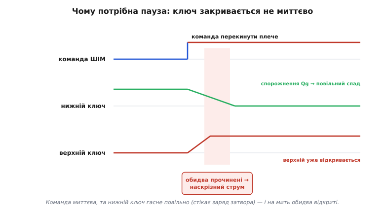
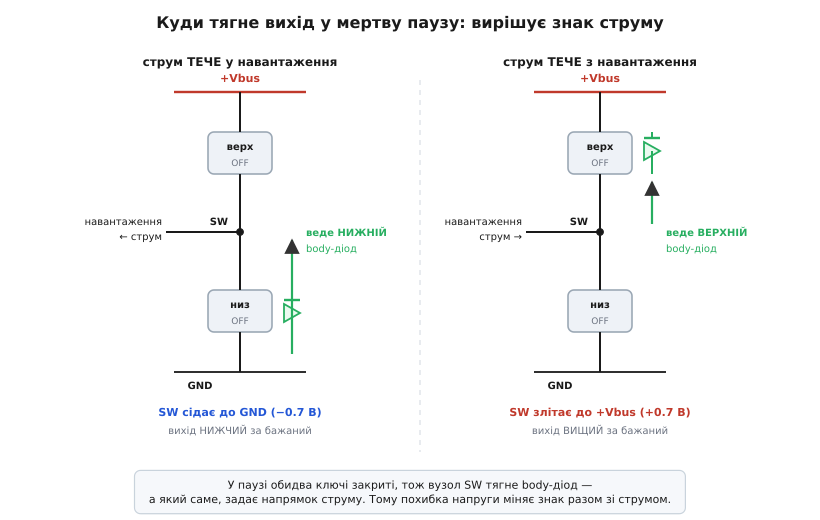
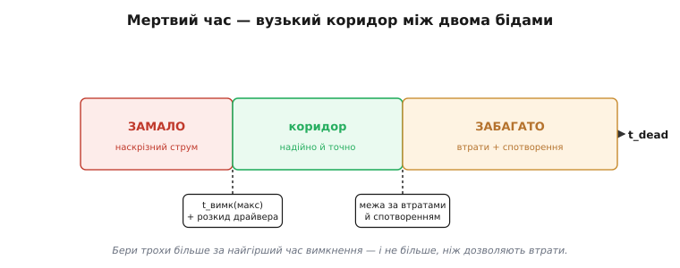

# Dead-time у напівмості: пауза, що рятує ключі

<preknowlist>
- [Півміст і H-міст](root:hw-motion/h-bridge) — верхній і нижній ключі одного плеча зі спільним вузлом SW; чому їх не можна відкривати разом.
- [Силовий MOSFET-ключ](root:hw-components/mosfet-power-switch) — як польовий ключ вмикає й вимикає струм і що таке його вбудований body-діод.
- [Ємність затвора](root:hw-components/gate-capacitance) — затвор поводиться як конденсатор, тож ключ вимикається не миттєво, а поки стікає заряд.
- [Драйвер затвора](root:hw-power/gate-driver) — приставка, що заганяє й висмоктує заряд затвора та формує сигнали для обох плечей.
</preknowlist>

Візьміть будь-який півміст — два ключі стовпчиком між «плюсом» живлення й землею, з виходом посередині. Це серце майже кожного силового вузла: плече H-моста, стійка інвертора, синхронний перетворювач. І над кожним таким плечем висить одне залізне правило: **верхній і нижній ключі не можна тримати відкритими одночасно**, бо це замкнуло б живлення прямо на землю крізь обидва ключі — наскрізний струм *(англ. shoot-through — «прострілити наскрізь»)*, амперний сплеск, що вбиває кристал за мить.

Здавалося б, правило легко виконати: коли один ключ відкритий — другий закритий, точна протилежність, і все. Але тут ховається пастка, через яку горять саморобні мости. Ключ **не закривається миттєво**. І саме щоб дати йому час закритися, у керування вставляють коротку паузу, коли закриті **обидва** ключі. Ця пауза й зветься **мертвий час** *(англ. dead time — «мертвий», «неробочий» час; «мертвий», бо в цей проміжок жоден ключ активно не веде)*.

### Чому протилежних сигналів замало

Уявімо найпростіше керування: беремо один сигнал ШІМ, подаємо його прямо на нижній ключ, а його інверсію — на верхній. Логічно бездоганно: рівно один із них завжди «1». Де ж біда?

Біда в тому, що затвор силового ключа — це [конденсатор](root:hw-components/gate-capacitance) на десятки нанокулонів еквівалентного заряду. Щоб ключ **відкрився**, у затвор треба влити цей заряд; щоб **закрився** — висмоктати його назад. І висмоктування триває скінченний час: заряд стікає крізь опір драйвера й резистор затвора не за нуль секунд, а за десятки-сотні наносекунд. Поки заряд ще не стік нижче порогової напруги, ключ лишається **прочиненим**, хай команда вже й наказала «закрийся».

Тепер складімо це разом. У момент, коли ШІМ перекидає плече, верхній ключ починає **відкриватися** (у нього ллється заряд), а нижній тільки починає **закриватися** (з нього заряд лише почав стікати). На коротку мить обидва прочинені — і крізь них летить наскрізний струм.


*Команда ШІМ перемикається різко, але нижній ключ гасне поступово — його затвор розряджається не миттєво. Якщо верхній пускати одразу за командою, він устигне прочинитися раніше, ніж догасне нижній: у рожевій смузі відкриті обидва — це вікно наскрізного струму.*

> 🔧 **Навіщо це.** Це головна причина, чому «просто інвертувати сигнал» — рецепт спаленого моста. Перш ніж відкривати один ключ плеча, треба **дочекатися**, поки протилежний справді закрився, а не лише отримав команду. Розрив між «наказав закритися» і «закрився фізично» — це і є час, який мусить покрити мертва пауза.

### Ідея: розірви, перш ніж з'єднати

Розв'язок прямий, як двері шлюзу: **спершу гарантовано закрий один ключ, витримай паузу, і лише тоді відкрий другий**. У ту паузу закриті обидва — плече «висить у повітрі», зате наскрізного шляху немає фізично. Це той самий давній принцип **«розірви, перш ніж з'єднати»** *(англ. break-before-make)*, за яким працюють якісні перемикачі й реле: контакт спершу повністю відпускає одну доріжку і лише потім торкається іншої, аби на мить не з'єднати обидві.

Отже, на кожному фронті ШІМ логіка робить не один перехід, а два, розсунуті в часі:

```
фронт вгору:   верхній OFF  →  [пауза]  →  нижній ON
фронт вниз:    нижній OFF   →  [пауза]  →  верхній ON
```

Мертвий час — це ширина того `[пауза]`. Одразу видно натуру задачі: пауза має бути **достатньо довгою**, щоб ключ, який вимикається, устиг догаснути навіть у найгіршому випадку, — але й розтягувати її не можна, бо задовга пауза псує вихідну напругу (механізм цього — трохи згодом).

### Скільки має тривати пауза

Мертвий час має перекрити **найгірший час вимкнення ключа** плюс запас на розкид. А час вимкнення визначається просто: скільки заряду треба висмоктати з затвора й наскільки швидко драйвер його висмоктує. Головну роль грає заряд активної ділянки — так зване Міллерове плато, [заряд Qgd](root:hw-components/gate-capacitance/math-gate-charge.md): поки він не стече, канал ще прочинений.

```
t_вимк  ≈  Qgd / I(розряду)
I(розряду)  =  Vdrive / (Rdrv + Rg)
```

Тут `Vdrive` — напруга, якою драйвер стягує затвор донизу, `Rdrv` — внутрішній опір виходу драйвера, `Rg` — зовнішній резистор затвора. Що більший опір розряду, то повільніше гасне ключ — і то довша потрібна пауза.

**Worked-приклад: пауза для конкретного плеча.**
Плече з ключем, у якого Qgd = 15 нКл; драйвер стягує затвор крізь сумарний опір 10 Ω від Vdrive = 10 В.

```
I(розряду) = Vdrive / (Rdrv + Rg)
           = 10 / 10             = 1.0   А
t_вимк     = Qgd / I(розряду)
           = 15·10⁻⁹ / 1.0       = 15    нс
t_dead     = 2 × t_вимк                       (запас ×2 на розкид і температуру)
           = 2 × 15              = 30    нс
```

Тридцять наносекунд — ось безпечна пауза для цього плеча. Запас ×2 не примха: реальний t_вимк повзе з температурою (гарячий ключ гасне повільніше), гуляє від партії до партії, залежить від навантаження. Тому паузу закладають із похибкою **у свій бік** — краще на кілька наносекунд задовго, ніж на одну наносекунду закоротко.

У прошивці цю паузу задають не рядками коду, а **апаратним таймером**. Сучасні мікроконтролери (STM32, ESP32 та інші «моторні» МК) мають режим комплементарного ШІМ із вбудованим регістром мертвого часу: ви задаєте одну шпаруватість, а залізо саме видає два протилежні сигнали з гарантованою паузою між фронтами — точно, без тремтіння, незалежно від того, чим зайнятий процесор. Порахований мертвий час треба лише перевести в такти таймера й записати в регістр:

```c
// Переведення мертвого часу в такти таймера ШІМ і запис у регістр паузи.
const double t_dead = 30e-9;      // потрібна пауза, с  (з розрахунку 2×t_вимк)
const double f_tim  = 168e6;      // частота лічби таймера, Гц (тактується від ядра)

uint16_t dead_ticks = (uint16_t)(t_dead * f_tim + 0.5);  // = round(30e-9 · 168e6) = 5
// dead_ticks іде в регістр мертвого часу таймера (напр. BDTR.DTG у STM32).
```

Як саме з одного ШІМ народжуються два протилежні сигнали з апаратною паузою і чому це категорично не можна робити двома `digitalWrite` у циклі — розписано в [алгоритмічній вставці про комплементарний ШІМ](root:hw-motion/h-bridge/proj-shoot-through.md).

> 🔧 **Навіщо це.** Практичне правило: візьміть найгірший `t_вимк ≈ Qgd / I(розряду)`, помножте на два — і це ваш стартовий мертвий час. Замалий ризикує мостом; надмірний коштує якості (спотворенням виходу й нагрівом body-діода). І довіряйте формування паузи **апаратурі** — таймеру чи готовому драйверу, — а не програмному перемиканню ніжок, бо ціна одного збою тут вимірюється згорілими транзисторами.

### Ціна задовгої паузи: куди дівається струм

Здавалося б, чому не поставити паузу «з великим запасом» — хай буде мікросекунда, аби напевно? Бо в ту паузу, коли **обидва** ключі закриті, з навантаженням щось відбувається — і що довша пауза, то гірше.

Майже завжди навантаження півмоста індуктивне: обмотка мотора, дросель перетворювача, первинка трансформатора. А [котушка не дає струмові урватися миттєво](root:ph-electromagnetism/inductance): щойно обидва ключі плеча зачинилися, накопичений в обмотці струм **мусить** кудись далі текти. Він знаходить дорогу крізь [паразитний body-діод](root:hw-components/body-diode) одного з ключів — того, що «в напрямку» струму, — і кільцем добігає, поки не відкриється наступний ключ. Тобто вихід SW у паузу не «нікуди не під'єднаний»: його **притискає** відкритий body-діод.

А тепер найтонше й найважливіше: **який саме** діод відкриється — верхній чи нижній — залежить від **напрямку струму навантаження**. І звідси випливає похибка напруги, якої не було в наказі.


*У мертву паузу обидва ключі закриті, тож вузол SW притискає body-діод — а який саме, вирішує напрямок струму навантаження. Струм тече в навантаження: заряд у вузол постачає нижній діод, SW сідає до землі (−0.7 В), вихід виходить нижчим за бажаний. Струм тече з навантаження: його приймає верхній діод, SW злітає до плюса (+0.7 В), вихід вищий. Тому похибка напруги міняє знак разом зі струмом.*

Розберімо обидва випадки, бо це серце «ефекту мертвого часу». Хай струм **витікає** з вузла SW у навантаження (додатний). У паузі його треба чимось живити — і струм піднімається з землі крізь **нижній** body-діод у вузол, притискаючи SW до −0.7 В (діодне падіння нижче землі). Отже, весь час паузи SW сидить **унизу**, байдуже, що ми намірялися вивести. Якщо ми в цей півперіод хотіли тримати SW **угорі** (верхній ключ мав вести), пауза «краде» в нас частину високого рівня — середня напруга виходить **нижчою** за бажану.

Тепер навпаки: струм **втікає** у вузол SW із навантаження (від'ємний). Його треба кудись прийняти — і струм іде крізь **верхній** body-діод угору, до «плюса», піднімаючи SW до Vbus + 0.7 В. Тепер SW усю паузу сидить **угорі** — і якщо ми хотіли тримати його внизу, вихід виходить **вищим** за бажаний.

Висновок разючий: **похибка напруги від мертвого часу міняє знак разом зі струмом навантаження**. Кожна пауза «з'їдає» або «додає» вольт-секунди — маленьку площу під кривою напруги, пропорційну ширині паузи. Одна така помилка мала, але за період ШІМ їх тисячі, і вони накопичуються в помітне спотворення. У приводах це виглядає як спотворення струму біля переходу синусоїди через нуль (де струм якраз міняє знак — а отже, і похибка стрибком перевертається), у звукових підсилювачах класу D — як чутні гармоніки. Плюс сам body-діод на амперному струмі гріється (падіння ~0.7 В × струм), тобто задовга пауза ще й марно спалює потужність.

Ось звідки **вузький коридор**: замало — наскрізний струм і смерть ключів; забагато — втрати на діоді й спотворення виходу. Мертвий час тримають **мінімально достатнім** — рівно стільки, щоб найгірший ключ устиг закритися, і ані наносекунди більше.


*Мертвий час живе у вузькому коридорі. Ліворуч від нижньої межі (найгірший час вимкнення ключа) — наскрізний струм. Праворуч від верхньої межі — зростають втрати на body-діоді й спотворення виходу. Мета — сісти в зелену смугу: трохи більше за час вимкнення, але не настільки, щоб псувати сигнал.*

### Хитра пастка: пауза витримана, а міст усе одно горить

Є підступний випадок, коли мертвий час дотримано бездоганно, а наскрізний струм усе одно виникає. Причина — **хибне відмикання за Міллером**. Коли парне плече (чи протилежний ключ) різко вмикається, напруга на стоку нашого «надійно закритого» ключа стрибає зі швидкістю в кілька-десятки вольт за наносекунду. Цей стрибок крізь ємність затвір-стік **упорскує** струм у вузол затвора, а той на опорі розряду наводить хибну напругу:

```
Vgs(хибна)  =  Cgd · (dV/dt) · (Rdrv,off + Rg)
```

Якщо ця хибна напруга перевищить поріг відкриття, «закритий» ключ **сам** привідкриється — попри витриману паузу — і дасть наскрізний струм. Тому мертвий час рятує лише від **повільного** перекриття (кінцевого часу вимкнення), а від Міллерового хибного відмикання лікують інакше: **сильним стяганням затвора донизу** (малий Rg на вимиканні тримає наведену напругу низькою), а в гострих випадках — [від'ємною напругою вимкнення](root:hw-power/negative-gate-supply) на затворі, щоб навіть кілька хибних вольт не дотяглися до порога. Механізм цього хибного відмикання докладно розписано в статті про [драйвер затвора](root:hw-power/gate-driver). Тобто безпека плеча стоїть на **двох** ногах: мертвий час проти повільного гасіння **і** міцне стягання затвора проти Міллера.

### Чому паузу не роблять «раз і назавжди»

Найгірший час вимкнення — рухома ціль. Він росте з температурою, падає зі збільшенням сили привода затвора, гуляє з навантаженням і розкидом партії. Тому фіксований мертвий час доводиться брати за **найгіршим** сценарієм — а отже, у типових умовах він завжди трохи задовгий, і ви платите зайвим спотворенням майже весь час.

Звідси два напрями вдосконалення. Перший — **компенсація мертвого часу**: керування знає знак струму навантаження, тож наперед підправляє шпаруватість — трохи додає там, де пауза краде вольт-секунди, і трохи віднімає там, де додає, — вирівнюючи середню напругу назад до бажаної. Другий — **адаптивний (передбачувальний) мертвий час**: розумний драйвер стежить за реальним станом ключа (наприклад, за напругою на вузлі SW) і відкриває протилежний ключ **точно** тоді, коли перший справді закрився, а не за фіксованим таймером із запасом. Так пауза стискається до фізичного мінімуму в кожному циклі. Обидва підходи — це вже глибший шар (математика вольт-секундної похибки, алгоритми оцінки знаку струму й контролю стану ключа), і на них варта окрема детальна розмова.

### Де це живе

Мертвий час — не рідкісна тонкість, а **повсюдна** дисципліна силової електроніки. Він стоїть у кожному плечі [H-моста](root:hw-motion/h-bridge), що крутить мотор; у кожній із трьох стійок інвертора, що живить трифазний [BLDC-двигун](root:hw-motion/bldc-motor) дрона чи електросамоката; у синхронному перетворювачі, де замість повільного діода в паузі вмикають [протилежний MOSFET](root:hw-power/sync-rectifier) — але вмикають **лише** витримавши мертвий час, інакше знову відчиниться смертельна діагональ. Що потужніший і повільніший ключ, то ширша потрібна пауза: для IGBT-модулів це часто мікросекунди, тоді як для швидких MOSFET — десятки наносекунд. Готові драйвери мостів і півмостів вставляють мертвий час **автоматично**, ховаючи всю цю арифметику всередині; у саморобних схемах про нього дбають окремо — бо ціна забудькуватості тут не «трохи гірше працює», а «дим і мовчання».

> 🔧 **Навіщо це.** Запам'ятайте суть одним рядком: **на кожному фронті спершу закрий ключ, витримай паузу, тоді відкрий протилежний** — а паузу бери трохи довшою за найгірший час вимкнення (`t_вимк ≈ Qgd / I(розряду)`, ×2 на запас). Замало — наскрізний струм палить міст; забагато — body-діод гріється й псує вихід. І пам'ятайте, що мертвий час — половина захисту: другу половину (проти Міллера) дає сильне стягання затвора донизу. На практиці довіряйте паузу апаратному комплементарному ШІМ або готовому драйверу, а не ручному перемиканню двох ніжок.
