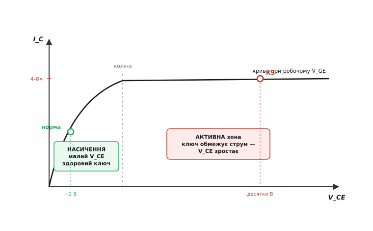
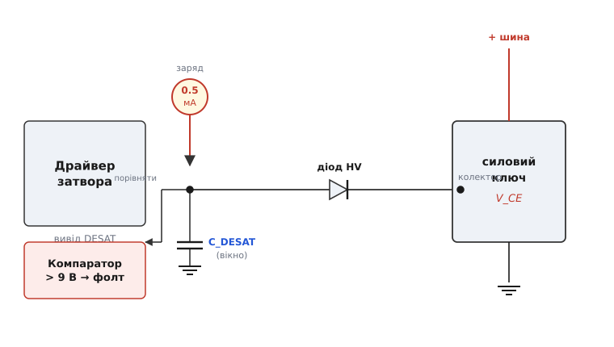
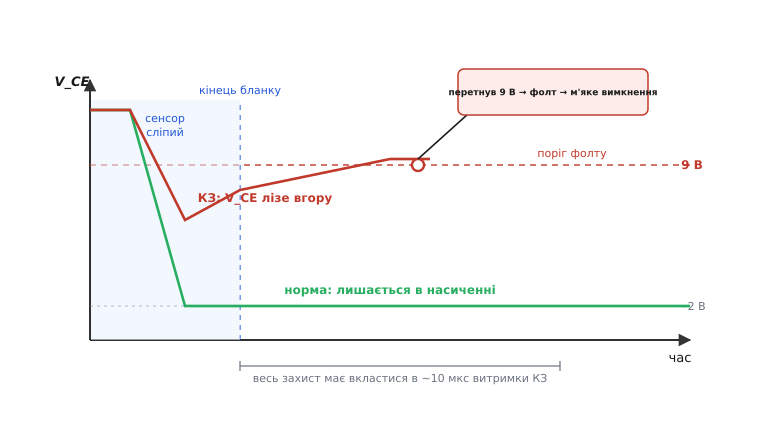

# Захист по десатурації (desat)

<preknowlist>
- [Силовий ключ](topic:hw-components/mosfet-power-switch) — транзистор, що вмикає й вимикає великий струм; у відкритому стані на ньому мала напруга.
- [IGBT](topic:hw-components/igbt) — біполярний транзистор із ізольованим затвором; його «насичена» напруга колектор-емітер — одиниці вольт.
- [Драйвер затвора](topic:hw-power/gate-driver) — підсилювач струму, що керує затвором силового ключа; сюди й вбудовують захист по десатурації.
- [Коротке замикання](topic:hw-analog/short-circuit) — аварія, коли струм обмежує вже не навантаження, а самі внутрішні опори джерела й ключа.
</preknowlist>

### Ідея: здоровий ключ «насичений», хворий — ні

Візьмімо силовий ключ, що керує великим струмом — приводом мотора, зваркою, інвертором. Коли він **повністю відкритий**, він поводиться майже як шматок дроту: через нього тече робочий струм, а падіння напруги на ньому крихітне. У [IGBT](topic:hw-components/igbt) це падіння колектор-емітер називають напругою насичення V_CE(sat), і воно становить типово 1.5–2 В хоч при ста амперах. Ключ «сидить у насиченні» — у режимі, де він віддає струму все, що той просить, майже задарма.

Тепер уявімо аварію: вихід ключа замкнуло накоротко на шину. Струм більше не обмежує навантаження — його стримують лише внутрішні опори джерела й самого ключа. Струм злітає в 4–8 разів вище за робочий за лічені мікросекунди. І ось ключове спостереження, на якому тримається весь захист: **при такому струмі транзистор уже не може лишатися насиченим**. Він виходить у режим, де сам обмежує струм, — і напруга на ньому підскакує з двох вольт до десятків, а то й до повної напруги шини.

Отже, напруга на відкритому ключі — це готовий сигнал тривоги. Здоровий стан: V_CE мала. Аварія: V_CE велика, хоча ключ нібито «увімкнений». Цей вихід із насичення й зветься **десатурацією** *(від лат. de- — «зняття» + saturatio — «насичення»; буквально «рознасичення»)*. Захист по десатурації — це просто вартовий, що весь час дивиться на V_CE відкритого ключа: підскочила над порогом — вимикай негайно, поки транзистор не згорів.

> 🔧 **Навіщо це.** Пряме вимірювання струму давачем — це шунт чи трансформатор струму, затримка й гроші. А десат дає майже безкоштовний надшвидкий струмовий захист: одна нога драйвера, один високовольтний діод, один конденсатор. Тому саме desat — стандартний захист у драйверах потужних IGBT і SiC, де ціна пропущеної аварії — вибух модуля за одиниці мікросекунд.

### Чому напруга росте: транзистор стає обмежувачем струму

Щоб довіряти цьому вартовому, треба відчути **чому** V_CE неодмінно росте — це не побічний ефект, а сама фізика транзистора. Вихідну характеристику будь-якого силового ключа — залежність струму від напруги на ньому при заданому керуванні затвором — можна розбити на дві зони.


*Робоча точка здорового ключа сидить біля лівого краю кривої — струм заданий навантаженням, а V_CE лишається малим (насичення). Коротке замикання жене струм угору по кривій за «коліно» в активну зону, де ключ поводиться як джерело струму: далі струм майже не залежить від V_CE, зате сам V_CE підскакує до десятків вольт. Саме цей стрибок і ловить захист.*

Ліворуч від «коліна» — **зона насичення**: тут крива йде майже вертикально вгору, тобто невелика зміна V_CE дає велику зміну струму. Практично це означає, що струм задає не транзистор, а зовнішнє коло (навантаження), а на ключі падає лише стільки, скільки треба, — одиниці вольт. Здоровий відкритий ключ живе саме тут.

Праворуч від коліна — **активна зона**: крива стає майже горизонтальною. Тут транзистор поводиться як **джерело струму**, кероване напругою на затворі: він пропускає рівно стільки струму, скільки «дозволяє» його канал при цій напрузі затвора, і хоч як піднімай V_CE — струм більше майже не росте.

Тепер прикладімо це до аварії. Затвор відкритий на робочу напругу (скажімо, 15 В), а ця напруга здатна «пропустити» струм лише до якоїсь стелі — вона в кілька разів вища за номінал, але **скінченна**. Коли коротке замикання вимагає струму понад цю стелю, транзистор фізично не може його віддати: він упирається в свою межу й переходить у активну зону — стає обмежувачем струму. А оскільки коло все одно тисне повною напругою шини, вся ця напруга лягає тепер на сам транзистор. V_CE стрибає з двох вольт до десятків. Ключ перетворюється на резистор під повною напругою й повним струмом одночасно — і починає розсіювати кіловати, стрімко нагріваючись до руйнування.

Ось чому десат працює **завжди**, незалежно від того, де саме сталося замикання: щойно струм перевищує здатність відкритого затвора його провести, вихід у активну зону й підйом V_CE неминучі за самою природою транзистора.

> 🔧 **Навіщо це.** Це та сама межа, що описує [зона безпечної роботи](topic:hw-components/safe-operating-area) ключа: одночасно висока напруга й високий струм — заборонена комбінація, у якій прилад живе лічені мікросекунди. Десат ловить прилад рівно в мить, коли він у цю комбінацію потрапив, і встигає його з неї витягти.

### Сенсор: діод, джерело струму й конденсатор

Як драйверу «побачити» V_CE відкритого ключа? Проблема в тому, що це напруга на **колекторі**, а колектор у роботі гуляє від майже нуля (ключ відкритий) до повної напруги шини (ключ закритий) — сотні, а то й тисячі вольт. Тягти таку напругу прямо на вхід драйвера не можна. Класичне рішення напрочуд ощадне.


*Драйвер має окремий вивід DESAT. До нього приєднано слабке внутрішнє джерело струму (типово 0.5 мА), зовнішній конденсатор на землю й високовольтний блокувальний діод, катод якого йде на колектор ключа. Напруга вузла DESAT весь час порівнюється з внутрішнім порогом ≈ 9 В. Поки ключ насичений, діод «притискає» вузол до низької V_CE; коли ключ десатурує, діод відпускає вузол, і струм 0.5 мА заганяє напругу вгору аж до порога.*

Розберімо роботу вузла DESAT крок за кроком.

Поки ключ **відкритий і здоровий**, його колектор сидить на низькій V_CE ≈ 2 В. Високовольтний діод відкритий і жорстко притягує вузол DESAT до цих двох вольт (плюс власне падіння діода). Слабке джерело струму 0.5 мА не може підняти вузол вище — увесь його струм стікає через діод у колектор. Напруга вузла лишається низькою, добряче нижчою за поріг 9 В. Тиша, аварії нема.

Коли ключ **десатурує**, колектор злітає до десятків вольт. Тепер напруга на колекторі стала вищою за вузол DESAT — і діод **закривається** (він же пропускає струм лише в один бік). Вузол DESAT відрізаний від колектора, і слабкому джерелу струму 0.5 мА більше нема куди стікати, окрім як у конденсатор. Воно починає його заряджати, напруга вузла повзе вгору. Щойно вона дійде до 9 В — компаратор спрацьовує, драйвер оголошує **фолт** *(англ. fault — несправність)* і вимикає ключ.

Навіщо тут високовольтний діод, а не простий дільник? Бо діод робить дві речі одразу: у нормі **притискає** вузол до низької V_CE (сенсор мовчить), а в аварії **відрізає** високу напругу колектора від тендітного входу драйвера (вузол ніколи не бачить більше за 9 В). Дільник напруги так не вміє — він або весь час навантажував би колектор, або пропускав би небезпечну напругу всередину. Діод тут потрібен **швидкий і високовольтний** — саме з класу [Шотткі](topic:hw-power/schottky-diode) чи надшвидких, бо він мусить перемкнутися за наносекунди й тримати повну напругу шини у закритому стані.

### Час бланкування: чому сенсор мусить бути сліпим на старті

Тут ховається підступність. Щойно ключ **вмикається**, його колектор ще не встиг упасти з високої напруги в насичення — потрібен якийсь час, поки заряд у транзисторі перерозподілиться й V_CE осяде до двох вольт. У цей короткий проміжок після вмикання V_CE **висока цілком законно** — ключ здоровий, просто ще перемикається. Якби сенсор дивився на V_CE вже в цю мить, він щоразу хибно оголошував би аварію на кожному нормальному вмиканні.

Тому desat навмисне робиться **сліпим** на перші мікросекунди після вмикання — це й зветься **час бланкування** *(англ. blanking — «затемнення, засліплення»)*. І найгарніше те, що конденсатор на виводі DESAT дає це бланкування безкоштовно: щоб зарядити його струмом 0.5 мА до порога 9 В, теж потрібен час, і цей час — і є бланкування. Більший конденсатор — довша сліпота.


*Після команди ввімкнення сенсор сліпий (заштрихована зона) — рівно стільки, скільки конденсатор заряджається до порога. Здоровий ключ (зелена крива) за цей час осідає в насичення, і V_CE лишається низьким назавжди — фолту нема. При короткому замиканні (червона крива) V_CE не падає, а лізе вгору й перетинає 9 В — щойно вікно бланкування скінчилося, компаратор оголошує фолт і драйвер починає м'яко гасити ключ. Весь захист мусить укластися у витримку короткого замикання — історично близько 10 мкс.*

Тут криється головний компроміс усього захисту. Час бланкування треба зробити **достатньо довгим**, щоб перекрити найповільніше нормальне вмикання ключа (інакше хибні спрацювання), але **достатньо коротким**, щоб разом із рештою затримок укластися у **час витримки короткого замикання** — той проміжок, який ключ узагалі здатен пережити в аварії. Історично цей час був близько 10 мкс, а сучасні швидкі IGBT і вищі напруги шин тиснуть його до 5 мкс і навіть менше. Типове бланкування — 1…3 мкс: вистачає перекрити вмикання й лишає запас на детекцію та гасіння.

**Приклад: підбір конденсатора бланкування.**
Драйвер має джерело заряду I = 0.5 мА і поріг спрацювання V_th = 9 В. Треба бланкування t_blank ≈ 2 мкс, щоб надійно перекрити вмикання ключа. Скільки поставити ємності? Заряд, струм і напруга зв'язані просто: `заряд = струм × час`, а на конденсаторі `заряд = ємність × напруга`. Прирівнюємо:

```
I · t_blank = C · V_th
```

Звідси ємність:

```
C = I · t_blank / V_th
  = 0.5e-3 · 2e-6 / 9
  = 1.0e-9 / 9
  ≈ 111 пФ
```

Ставимо стандартні 100 пФ і перевіряємо реальний час назад:

```
t_blank = C · V_th / I
        = 100e-12 · 9 / 0.5e-3
        = 900e-12 / 0.5e-3
        = 1.8e-6 с
        = 1.8 мкс
```

1.8 мкс — саме в потрібній смузі. Якщо ключ вмикається повільніше й 1.8 мкс мало, беремо 150 пФ і дістаємо 2.7 мкс. Ось так одним конденсатором задають, наскільки довго захист «дивиться в інший бік» на старті кожного імпульсу.

### М'яке вимкнення: не рубати сплеча

Виявити аварію — півсправи. Друга половина, і вона неочевидна: **вимикати аварійний ключ треба повільніше, ніж звичайний**. Здається парадоксом — ключ гине, гаси його якнайшвидше! Але тут інша фізика.

У момент аварії через ключ тече величезний струм — у кілька разів вищий за робочий. Будь-яке коло має паразитну **індуктивність**: доріжки, шини, виводи модуля. А індуктивність опирається зміні струму й наводить напругу за законом `U = L · (швидкість зміни струму)`. Якщо різко обірвати аварійний струм — за наносекунди звести його з сотень ампер до нуля — швидкість зміни струму буде колосальна, і паразитна індуктивність підкине **сплеск напруги** на колекторі, здатний перевищити пробивну напругу ключа. Ми рятували транзистор від перегріву — і вбили б його перенапругою.

Тому драйвери з desat роблять **м'яке вимкнення** *(англ. soft turn-off)*: виявивши фолт, вони не стягують затвор миттєво в нуль потужним ключем, а зливають заряд затвора **повільно** — через окремий слабкий шлях розряду або спеціальний «м'який» транзистор у драйвері. Струм у ключі спадає полого, `швидкість зміни струму` мала, і сплеск на індуктивності лишається безпечним. Так, повільне гасіння означає ще трохи тепла в ключі — але ці зайві мікроджоулі він переживе, а от пробій перенапругою — ні.

**Приклад: наскільки страшний сплеск при різкому обриві.**
У силовій петлі паразитна індуктивність L = 30 нГн (типова для коротких шин модуля). Аварійний струм I = 600 А. Порівняймо два способи вимкнення.

Різко, за t = 50 нс (як звичайний швидкий ключ):

```
dI/dt      = 600 / 50e-9      = 1.2e10  А/с
U(сплеск)  = L · dI/dt
           = 30e-9 · 1.2e10   = 360 В
```

360 В додаткової напруги поверх шини — для ключа на 650 В це майже гарантований пробій. Тепер м'яко, розтягнувши обрив на t = 2 мкс:

```
dI/dt      = 600 / 2e-6       = 3.0e8   А/с
U(сплеск)  = 30e-9 · 3.0e8    = 9 В
```

9 В замість 360 В — сплеск зник. Ось чому desat завжди йде в парі з м'яким вимкненням: одне без одного або не рятує, або саме вбиває ключ. Про боротьбу зі сплесками напруги на індуктивностях у ширшому контексті — [снабери й керування dV/dt](topic:hw-power/snubbers-dvdt).

> 🔧 **Навіщо це.** Проєктуючи захист, закладайте два таймінги окремо: час **виявлення** (бланкування + затримка компаратора) має вкластися у витримку КЗ ключа, а час **гасіння** — бути достатньо довгим, щоб приборкати L·dI/dt, але коротким проти теплового руйнування. Це дві протилежні вимоги, і жодну не можна пускати самопливом.

### Де воно спотикається

**MOSFET має не «насичення», а R_ds(on) — але метод той самий.** У польового ключа немає біполярного насичення; у відкритому стані він поводиться як маленький опір R_ds(on), і напруга на ньому — просто струм на цей опір. Та для desat це байдуже: у нормі напруга стік-витік мала (струм × малий опір), а при короткому струм злітає, MOSFET виходить із омічної зони в зону насичення струму (у польових термінах це саме «saturation», плутанина назв!) — і напруга однаково підскакує. Той самий вузол DESAT ловить те саме, лише поріг зазвичай беруть нижчий, бо робоча напруга MOSFET менша за V_CE(sat) IGBT.

**Падіння діода й нагрів зсувають поріг.** Напруга вузла DESAT — це насправді V_CE ключа плюс падіння на високовольтному діоді (і на струмообмежувальному резисторі, якщо він є). Це падіння залежить від температури й струму, тож ефективний поріг «плаває». Тому 9 В беруть із запасом над найгіршою нормальною V_CE(sat) гарячого ключа — щоб гарячий здоровий ключ не сплутали з аварійним.

**Занадто коротке бланкування — хибні спрацювання.** Найчастіша хвороба при налаштуванні: поставили малий конденсатор, і на кожному нормальному вмиканні V_CE ще не встигає осісти, а сенсор уже кричить фолт. Ключ навіть не встигає попрацювати. Лікування — збільшити ємність DESAT, перерахувавши час за формулою вище, доки бланкування надійно перекриє найповільніше вмикання з запасом.

**Занадто довге бланкування — пропущена аварія.** Зворотна крайність: розтягнули сліпоту так, що разом із детекцією й гасінням не вкладаєтеся у витримку КЗ ключа. Тоді ключ згорить раніше, ніж захист розплющить очі. Тому бланкування не «побільше про всяк випадок», а рівно стільки, скільки треба перекрити вмикання, — і ні мікросекундою більше, ніж дозволяє бюджет витримки.

**Затвор під час фолту.** Поки триває м'яке вимкнення, парне плече напівмоста мусить лишатися закритим, інакше отримаєте наскрізний струм поверх уже наявної аварії. Розумні драйвери на час фолту самі блокують обидва плечі й повідомляють мікроконтролер сигналом несправності, щоб той не намагався знову ввімкнути ключ, доки причину не з'ясовано.

Захист по десатурації — гарний приклад того, як одне точне спостереження (насичений ключ має малу напругу, хворий — велику) розгортається в цілий вузол зі своєю дисципліною таймінгів. Слабке джерело струму, один діод і один конденсатор дають надшвидкий струмовий захист без жодного струмового давача, а м'яке вимкнення рятує вже від власного порятунку. Усе тримається на тому, що транзистор, вичерпавши свою здатність провести струм, чесно піднімає напругу — і цим сам себе видає.
