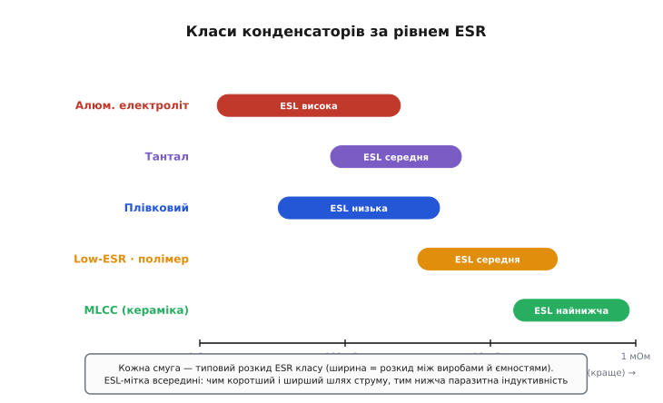
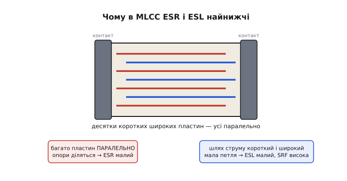
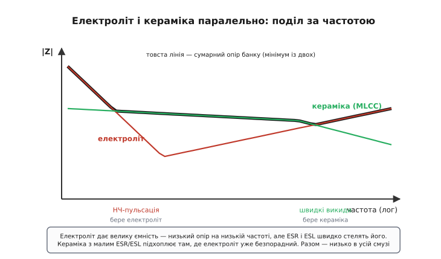

# 🔌 Класи конденсаторів за рівнем ESR

Конденсатор на схемі — один значок: дві риски. Та коли доходить до плати, цей значок розпадається на півдесятка геть різних фізичних речей, і відрізняються вони не ємністю (її задає схема), а тим, **скільки опору й індуктивності тягне за собою кожен ампер**, що крізь них тече. Поставити в те саме гніздо алюмінієвий електроліт чи багатошарову кераміку — це не «дешевше vs дорожче», це різниця в ESR у сотні разів, у ESL — у десятки, і, відповідно, у тому, чи згладить конденсатор пульсацію, чи зварить сам себе, чи протримає сталу часу без дрейфу.

Тут — карта родин конденсаторів **за рівнем ESR і ESL**, без жодного партномера: самі класи, типові діапазони, фізика, чому кожен опинився саме там, де опинився, і просте правило, який клас брати під яку задачу. Партномер у даташиті уточнить число для конкретного виробу; клас визначає **порядок** цього числа й сам характер поведінки — а саме порядок зазвичай вирішує, годиться річ чи ні.

> 🔧 **Навіщо це.** Дев'ять із десяти помилок із конденсаторами — це взятий не той **клас**, а не похибка в ємності. Ємність промахнути важко: її пишуть на корпусі, її дає розрахунок. А клас тихо вирішує, чи буде «правильний за розрахунком» конденсатор гарячим, чи дзвенітиме живлення, чи попливе генератор. Уміти з ходу сказати «сюди — електроліт, сюди — кераміку C0G, а отут потрібен полімер» — це й є та різниця між схемою, що працює на папері, і платою, що працює роками.

## Що насправді стоїть за значком: ті самі два виводи, різна начинка

Хоч який клас, читачеві він являє **одне й те саме**: два виводи й між ними не чиста ємність, а ланцюжок «паразитна індуктивність виводів ESL → опір усіх втрат ESR → ідеальна ємність C», увімкнений послідовно. Це універсальна «розпіновка» будь-якого конденсатора: куди не приклади щуп, струм зайде через ESL, проштовхнеться крізь ESR і лише тоді сяде на обкладки. Звідки беруться ESR і ESL і чому вони вирішують долю конденсатора під струмом — у [статті про ESR конденсатора](topic:hw-power/esr-capacitor): коротко, ESR — зведений в одне число опір металу, контактів, електроліту й діелектрика, на якому кожен ампер пульсації лишає тепло P = I²·ESR, а ESL — паразитна індуктивність геометрії, що задає власний резонанс, нижче якого опір конденсатора впасти не може.

Уся різниця між класами — у тому, **наскільки великі ці два паразити** й наскільки вони стабільні. А визначає їх не магія, а проста механіка: довжина й переріз шляху, яким тече струм усередині, та провідність речовини на цьому шляху. Звідси й випливає вся карта.

*Класи конденсаторів, розкладені за типовим ESR (горизонтальна вісь — логарифмічна, праворуч менше = краще). Ширина смуги — розкид усередині класу: він залежить і від ємності, і від конкретного виробу. Видно, що класи перекриваються, але порядок незмінний: рідкий електроліт — десятки міліом і вище, MLCC — одиниці й частки міліома. Підпис у смузі — типовий рівень ESL, паразитної індуктивності.*

Пройдімо драбину згори вниз — від найгіршого за ESR до найкращого, щоразу питаючи **чому саме тут**.

## Алюмінієвий електролітичний: багато ємності ціною найгіршого ESR

Почнімо з найпоширенішого й водночас найпроблемнішого за ESR класу. Алюмінієвий електролітичний конденсатор будують так: дві довгі стрічки тонкої алюмінієвої фольги перекладають папером, просоченим рідким **електролітом**, і згортають у тугий рулон (англ. *electrolytic* — від електроліту, провідної рідини). Робочою «обкладкою» з боку мінуса слугує сам електроліт; діелектрик — надтонка плівка оксиду алюмінію, вирощена на фользі. Така будова дає величезну ємність у малому об'ємі — звідси й популярність. Але вона ж робить ESR найгіршим серед поширених класів, і ось чому по черзі.

Струм мусить пройти **вздовж усієї згорнутої фольги** — а це десятки сантиметрів тонкого металу, кожен сантиметр додає опору. Далі струм іде крізь шар **рідкого електроліту**, а рідина проводить набагато гірше за метал. Додайте контакти фольги з виводами. Усе разом дає типові **десятки міліом — одиниці ома**, причому конденсатори більшої ємності мають ESR нижчий (більша площа фольги — ширший шлях струму).

Найгірша риса класу — **сильна залежність ESR від температури**. Електроліт — рідина, а в рідини провідність різко падає на холоді: на морозі вона густішає, і ESR підскакує **в рази**, інколи на порядок. Звідси класична зимова халепа: блок живлення, що влітку працював, на морозі не запускається або дзвенить пульсаціями — бо ESR його вихідних електролітів злетів. У теплі та сама рідина поступово **випаровується** крізь ущільнення, конденсатор «висихає», ESR повзе вгору з роками — і врешті спрацьовує петля саморуйнування: вищий ESR → більше тепла на пульсації → швидше висихання → ще вищий ESR. Масова епідемія таких відмов на платах початку 2000-х навіть дістала ім'я [«чума конденсаторів»](topic:hw-power/esr-capacitor/hist-capacitor-plague.md).

ESL у класі **висока**: довгий згорнутий рулон — це фактично виток, та ще й довгі дротяні виводи. Тому власний резонанс електроліта низький (часто десятки-сотні кілогерц), і на високих частотах він безпорадний — поводиться вже як котушка.

> 🔧 **Навіщо це.** Алюмінієвий електроліт беруть туди, де треба **багато ємності дешево**, а висока частота не критична: основний згладжувальний конденсатор на вході/виході живлення, резервуар енергії, буфер за випрямлячем. Сюди ж дивляться на **гранично допустимий пульсівний струм** із даташита — він прямо впирається в ESR і визначає, скільки тепла корпус відведе, не зварившись. Чого з електролітом не роблять — не ставлять його одного там, де є швидкі високочастотні викиди: на них його ESR і ESL уже не працюють, і поряд обов'язково потрібна кераміка.

## Low-ESR і полімерний: та сама будова, але втрати вибили цілеспрямовано

Наступна сходинка вниз по ESR — це той самий алюмінієвий конденсатор, але перероблений саме проти втрат. «Low-ESR» — не окремий фізичний клас, а **електроліт, у якому з ESR боролися конструкцією**: товстіша й чистіша фольга, провідніший склад електроліту, коротший рулон, кращі зварні контакти виводів. Усе це збиває ESR у кілька разів проти звичайного електроліта тієї самої ємності — типово до **одиниць-десятків міліом**. Ємність і дешевизна майже ті самі; платиш трохи більше й дещо втрачаєш у строку служби на спеці.

Радикальний крок робить **полімерний** (твердотільний) конденсатор: рідкий електроліт у ньому замінено **твердим провідним полімером** (зазвичай PEDOT — провідна органіка). І тут одразу два виграші. По-перше, твердий полімер проводить набагато краще за рідину, тож ESR падає до **одиниць міліом** — у 5–10 разів нижче за рідкий електроліт тієї самої ємності. По-друге, зникає сама рідина, якій було куди випаровуватися: полімерний конденсатор **не висихає**, його ESR стабільний роками й куди слабше реагує на холод. Платня — нижча робоча напруга на той самий розмір, вища ціна й трохи більший струм витоку.

> 🔧 **Навіщо це.** Полімерні (й гібридні — полімер плюс трохи рідини для вищої напруги) конденсатори — це сучасна відповідь на «чуму»: туди, де раніше горіли звичайні електроліти під серйозною пульсацією, тепер ставлять полімер і забувають про здуті банки. Типове місце — вихід імпульсного перетворювача поряд із процесором, материнські плати, відеокарти: великий пульсівний струм, потрібен малий ESR, бажано без старіння. Якщо в схемі електроліт регулярно вмирає за рік-два — майже завжди правильна заміна не «така сама банка», а полімер.

## Танталовий: компактний і стабільний, але з вибуховою вдачею

Танталовий конденсатор стоїть осторонь драбини: за ESR він між електролітом і полімером, зате має власну фізику й власну, доволі небезпечну, ваду. Будують його не з фольги, а зі **спеченого порошку тантала** (метал, назва — від міфічного Тантала): мікроскопічні зерна дають колосальну площу поверхні в крихітному об'ємі, тож ємність на міліметр у тантала чи не найвища серед усіх класів. Діелектрик — оксид тантала на зернах; «обкладкою» з боку катода служить шар діоксиду марганцю (MnO₂) або, у новіших, той самий провідний полімер.

ESR тантала з марганцевим катодом — **десяті-сотні міліом**, помітно нижче за звичайний електроліт і доволі стабільний у часі: твердий катод не висихає. Полімерний тантал збиває ESR ще нижче, до рівня полімерного алюмінію. Залежність від температури м'якша, ніж у рідкого електроліта. За компактність і стабільність тантал і цінують.

Та є гостра вада, через яку до тантала ставляться сторожко. Марганцевий катод при пробої діелектрика поводиться **екзотермічно**: дефект розігрівається, MnO₂ при ~500 °C віддає кисень, а поряд — металевий тантал, що з киснем реагує бурхливо. Виходить мікропожежа: танталовий конденсатор при відмові не просто коротить, а може **спалахнути**. Найнебезпечніший момент — **пусковий стрибок струму** (англ. *inrush*): коли на конденсатор різко подають напругу з низькоомного джерела, крізь нього б'є великий короткий струм, і слабке місце діелектрика може пробитися саме тоді. Тому марганцевий тантал жорстко **дератять за напругою — на 50–60 %** (ставлять конденсатор удвічі вищої номінальної напруги, ніж робоча) і не люблять на «гарячих» входах живлення без обмеження струму. Полімерний тантал тут значно безпечніший: полімерний катод кисню в собі не має, при пробої він просто **втрачає провідність** близько 300 °C і гасить струм без вогню — це т. зв. **доброякісна відмова**, тож його дератять лише на ~20 %.

> 🔧 **Навіщо це.** Тантал беруть, коли треба **багато ємності стабільно й у крихітному корпусі** — портативка, плати, де нема місця на велику банку, фільтри живлення в малих пристроях. Але два правила залізні: суворо тримати **полярність** (тантал полярний і пробою зворотної напруги не пробачає) і **закладати запас за напругою** — для марганцевого вдвічі. Сумнів між марганцевим і полімерним танталом на вході живлення з кидком струму — бери полімерний: він не спалахне.

## Багатошарова кераміка MLCC: чому в неї ESR і ESL найнижчі

На дні драбини — багатошаровий керамічний конденсатор, MLCC (англ. *multi-layer ceramic capacitor*). Його ESR — **одиниці міліом і менше**, ESL — найнижча з усіх класів, і це не випадковість, а пряме породження геометрії. Варто розібрати чому, бо саме звідси видно, чого взагалі коштує малий ESR.

Усередині MLCC — стос **десятків тонких керамічних шарів**, між якими гребінкою заходять металеві електроди: парні з'єднані з одним торцевим контактом, непарні — з протилежним. Виходить багато дрібних конденсаторів, **увімкнених паралельно**. А паралельне з'єднання робить із ESR головне: **опори діляться**. Якщо кожен шар має опір R, то сто шарів паралельно дають R/100. Тому навіть при кепській провідності самих електродів сумарний ESR виходить крихітним — його збиває сама кількість паралельних шляхів.

*Чому в MLCC ESR і ESL найнижчі. Усередині — десятки коротких широких пластин, з'єднаних гребінкою з двома торцевими контактами, тобто ввімкнених паралельно. Паралельне з'єднання ділить опір (звідси малий ESR), а короткий і широкий шлях струму дає крихітну петлю (звідси малий ESL і високий резонанс). Жодного рідкого електроліту й довгого рулона тут нема.*

З ESL та сама логіка, але через **петлю струму**. Індуктивність народжується там, де струм окреслює велику площу. У MLCC пластини короткі й широкі, контакти — на торцях упритул, тож петля, яку обходить струм, мізерна — звідси ESL у частки наногенрі для дрібних корпусів і одиниці наногенрі для більших. Малий ESL означає **високий власний резонанс**: MLCC лишається ємністю до сотень мегагерц, де електроліт давно став котушкою. Існують навіть конденсатори **оберненої геометрії**, де контакти переносять на довгі сторони корпусу — петля коротшає ще, і ESL падає в кілька разів проти звичайного MLCC.

Але за все платять, і ціна низького ESR у кераміки — **нестабільність ємності**, причому підступна. Висока ємність MLCC тримається на діелектрику з титанату барію (BaTiO₃) — а він **сегнетоелектрик**, тобто його діелектрична проникність сама залежить від поля. Звідси три неприємні ефекти класів «2» діелектриків (їх позначають кодами на кшталт X7R, X5R, Y5V):

- **Просідання від постійної напруги** (DC bias): прикладена робоча напруга вирівнює домени в кераміці, і ємність **падає** — типово на 30–60 %, а біля номінальної напруги буває й до 80–90 %. Конденсатор на 10 мкФ під робочою напругою легко перетворюється на 4 мкФ, хоч на корпусі чесно написано 10.
- **Старіння**: ємність повільно сповзає з часом (поки кераміка «релаксує» після пайки) — відсотки за декаду годин.
- **Мікрофонність**: сегнетоелектрик ще й **п'єзоелектрик** — механічно деформується від напруги й навпаки. MLCC класу 2 під змінною напругою тихо «співає», а від вібрації плати наводить на живлення шум. У звукових і точних колах це чути.

Діелектрики класу **1** (код C0G, він же NP0) цих вад позбавлені: їхня ємність стабільна за напругою, часом і температурою, вони не п'єзо — але й ємність у них мала (пікофаради-нанофаради). Це різні інструменти: клас 2 — велика ємність ціною стабільності; клас 1 — мала ємність, зате як скеля.

> 🔧 **Навіщо це.** MLCC класу 2 — стандартна **розв'язка по живленню** (decoupling): дрібний конденсатор упритул до виводу живлення мікросхеми гасить швидкі викиди струму, на яких електроліт безсилий. Тут просідання ємності під напругою не біда — аби лишилося достатньо; тому в розв'язку завжди закладають **запас за ємністю** (беруть номінал з лишком, бо під напругою половина зникне) і не женуться за найвищою ємністю в найменшому корпусі, де просідання найгірше. А от у часозадавальне коло чи точний фільтр MLCC класу 2 ставити **не можна** — попливе і від напруги, і від старіння, і заспіває від вібрації; туди йде клас 1 (C0G) або плівка.

## Плівковий: не рекордсмен за ESR, зате найчистіший і незношуваний

Лишився плівковий конденсатор. За ESR він **не найнижчий** (одиниці-десятки міліом, між кращим електролітом і танталом), і ємність у нього скромна — нанофаради-мікрофаради, бо тонку пластикову плівку важко зробити настільки тонкою, як оксид у електроліті. Зате він має риси, яких бракує решті класів.

Будова: дві стрічки металізованої **полімерної плівки** (поліпропілен, поліестер) згорнуті або складені в пакет; діелектрик — сама плівка, обкладки — тонкий метал, напилений на неї. Звідси випливає все хороше. Діелектрик неполярний і дуже **стабільний**: ємність майже не залежить ні від напруги, ні від часу, плівка не висихає й не старіє — конденсатор практично незношуваний. ESR і ESL низькі та рівні в широкій смузі. І головна особливість — **самозагоєння** (self-healing): якщо в плівці стається мікропробій, тонкий метал навколо дефекту вмить **випаровується** від струму дуги й «вигоряє», ізолюючи пробите місце; конденсатор втрачає мізерну частку ємності, але **лишається живим і не коротить**. Тому плівка терпить великі імпульсні струми й високі напруги там, де електроліт або тантал давно б згоріли.

> 🔧 **Навіщо це.** Плівку беруть, коли важить **стабільність і чистота, а не ємність на міліметр**: часозадавальні й інтегрувальні кола, точні аналогові фільтри, демпфери (снабери) на силових ключах, кола змінного струму й високої напруги, придушення завад у мережі. Скрізь, де конденсатор має тримати свою ємність незмінно роками й переживати імпульси без вибуху, плівка — природний вибір. Чого з нею не роблять — не намагаються набрати нею велику ємність у малому об'ємі: для цього вона завелика, туди йде електроліт чи тантал.

## Чому в живленні ставлять електроліт і кераміку поряд

Тепер — найпрактичніший висновок із усієї карти, той, що пояснює, чому на будь-якій пристойній платі біля мікросхеми живлення стоять конденсатори **різних класів одночасно**. Причина проста: жоден клас не добрий у всій смузі частот, а пульсація й кидки струму в живленні живуть у дуже широкій смузі — від кілогерц перемикання перетворювача до сотень мегагерц фронтів цифрового струму.

Тут вступає галочка повного опору, докладно розібрана в [статті про ESR](topic:hw-power/esr-capacitor): кожен конденсатор має дно (рівень ESR) і власний резонанс, вище якого він стає котушкою. В електроліта дно високе (ESR великий), зате ємність величезна, тож на **низькій частоті** його опір малий — він добре бере повільну пульсацію. Але резонанс електроліта низький, і на високій частоті він уже безпорадний. У кераміки навпаки: ємність мала (на низькій частоті опір вищий), зате ESR крихітний і резонанс високий — вона панує на **високих частотах**, де електроліт здався. Поставивши їх **паралельно**, дістаємо банк, чий сумарний опір малий у всій смузі: на низах працює електроліт, на верхах — кераміка, а сумарна крива йде по нижчій із двох.

*Чому в живленні ставлять електроліт і кераміку разом. Електроліт (велика ємність, але високий ESR і низький резонанс) тримає низ смуги — повільну пульсацію. Кераміка (малий ESR, високий резонанс) тримає верх — швидкі викиди струму. Сумарний опір банку (товста лінія — мінімум із двох) лишається низьким у всій робочій смузі, чого жоден клас сам не дав би. Це той самий принцип, що й у [розв'язці живлення](topic:hw-components/decoupling).*

Звідси й типова трисходинкова розв'язка живлення на реальній платі: великий електроліт або полімер як **резервуар** на вході (бере найповільнішу пульсацію й тримає просадки), середня кераміка для середніх частот і дрібний MLCC **упритул до кожного виводу живлення** мікросхеми — на найшвидші викиди. Кожна сходинка закриває свою смугу; разом вони дають живлення, рівне у всьому діапазоні. Це і є практичний сенс того, що класи конденсаторів різні: їх не вибирають «або-або», їх **складають** так, щоб слабкість одного закрив інший.

## Як вибрати клас під задачу: коротке правило

Зведімо всю карту в робоче правило. Дивишся не на ємність першою, а на **характер задачі** — і характер одразу називає клас:

- **Фільтр живлення, велика повільна пульсація, потрібна ємність дешево.** Алюмінієвий електроліт (а під серйозний пульсівний струм без старіння — полімерний). Головне число — допустимий пульсівний струм, бо саме ESR гріє корпус.
- **Розв'язка по живленню, швидкі викиди струму впритул до мікросхеми.** MLCC класу 2 (X7R/X5R) — найнижчі ESR і ESL. Закладай запас за ємністю, бо під напругою вона просяде вдвічі.
- **Уся смуга одразу — реальне живлення.** Не один клас, а **банк**: електроліт/полімер на низах паралельно з керамікою на верхах. Слабкість одного класу закриває інший.
- **Часозадавальне коло, точний фільтр, інтегратор — ємність має бути незмінна.** Кераміка класу 1 (C0G/NP0) або плівка. Класу 2 тут не місце: попливе від напруги, старіння й вібрації.
- **Компактність плюс стабільність у малому корпусі.** Тантал — але тримай полярність і закладай запас за напругою (марганцевий — удвічі), а на «гарячому» вході з кидком струму бери полімерний, щоб не спалахнув.
- **Високі напруги, великі імпульси, демпфери, кола змінного струму.** Плівка: стабільна, незношувана, самозагоюється під пробоєм.

Уся суть однією думкою: **ємність каже, скільки заряду тримає конденсатор, а клас каже, як він поводиться під струмом і в часі — і саме клас, а не ємність, найчастіше вирішує, чи годиться річ для цього гнізда.** Хто звик питати спершу «який тут потрібен клас», той не дивується ні гарячій банці у фільтрі, ні генератору, що поплив, ні живленню, що дзвенить попри «правильну за розрахунком» ємність.

---

*Джерела (звірка фактів):* типові діапазони ESR за класами (рідкий електроліт — до одиниць ом; MLCC ~0.01–0.1 Ом, найнижчі на ВЧ; плівка — низький рівний ESR; полімер у 5–10× нижче за рідкий) — [Wikipedia: Equivalent series resistance](https://en.wikipedia.org/wiki/Equivalent_series_resistance), [Passive Components: ESR mechanisms and impact](https://passive-components.eu/esr-of-capacitors-mechanisms-measurements-and-impact-to-applications/), [Altium: which capacitor type to use](https://resources.altium.com/p/which-type-capacitor-should-you-use); просідання ємності MLCC класу 2 від постійної напруги (30–60 %, до 80–90 % біля номіналу), старіння й мікрофонність сегнетоелектрика BaTiO₃, стабільність класу 1 (C0G/NP0) — [Passive Components: MLCC DC bias and ageing](https://passive-components.eu/high-cv-mlcc-dc-bias-and-ageing-capacitance-loss-explained-2/), [Electronic Design: Class II MLCC under DC bias](https://www.electronicdesign.com/technologies/analog/article/21135733/diagnosing-class-ii-mlcc-effective-capacitance-and-aging-under-dc-bias); вибуховий механізм відмови марганцевого тантала (екзотермія Ta+O₂ з перегрітого MnO₂, дерейтинг 50–60 %) і доброякісна відмова полімерного (PEDOT гасить струм ~300 °C, дерейтинг ~20 %) — [Passive Components: reliability and failure mode in solid tantalum](https://passive-components.eu/reliability-and-failure-mode-in-solid-tantalum-capacitors/), [Vishay: conductive polymer capacitors FAQ](https://www.vishay.com/docs/42106/faqconductivepolymercaps.pdf); типові ESL (0402 MLCC ~0.3–0.5 нГн, 1206 ~1–2 нГн, плівка ~5–50 нГн) і обернена геометрія (LICC) як спосіб скоротити петлю струму — [Passive Components: low inductance ceramic capacitors](https://passive-components.eu/low-inductance-ceramic-capacitors-for-high-speed-decoupling/), [KYOCERA AVX: low inductance chip capacitors](https://www.kyocera-avx.com/products/ceramic-capacitors/low-inductance/low-inductance-chip-capacitors/). Усе — усталені інженерні факти.*
