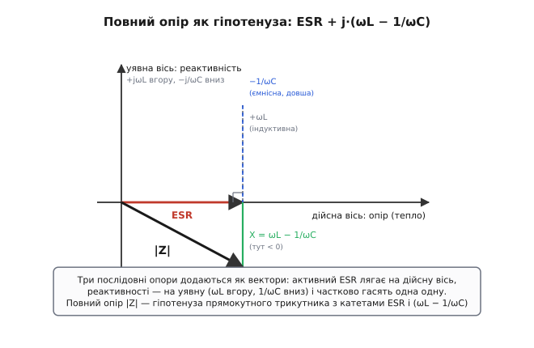
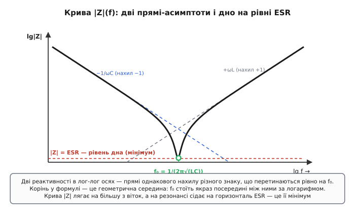
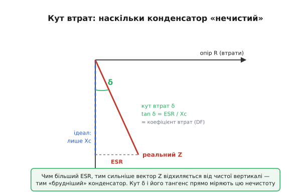

# 🧮 Звідки береться «галочка» |Z(ω)|: складання трьох опорів у комплексній площині

Криву повного опору реального конденсатора часто показують як готовий факт: спадає, упирається в дно, знову росте. Але саму форму — оту галочку з гострим дном на резонансі — мало хто виводить, а вона того варта, бо в ній цілий конденсатор як на долоні. Тут ми збудуємо цю криву з нуля: візьмемо три опори, що сидять у реальному конденсаторі один за одним, складемо їх **правильно** (не арифметично, а як вектори на площині) і подивимося, що з цього неминуче випливе. Випливе все одразу — і чому крива має форму галочки, і де саме її дно, і чому дно дорівнює рівно ESR, і звідки береться частота власного резонансу f₀ = 1/(2π√(L·C)). А наприкінці та сама математика дасть нам коефіцієнт втрат і добротність — не як окремі визначення, а як два прочитання одного й того самого трикутника.

Усе будується на одному факті, який ми приймаємо за відомий: змінні напруги й струми зручно зображати **стрілками** на комплексній площині (фазорами), а опори реактивних елементів при цьому стають комплексними числами — множником при уявній одиниці j. Якщо ця мова ще не вляглася, варто спершу глянути сусідню вставку.

> Спираємося на: синусоїду пакують в одну стрілку-фазор; множення на j — це поворот на 90°; реактивності стають уявними «опорами» (jωL у котушки, 1/(jωC) = −j/(ωC) у конденсатора). Усе це — у вставці [«Комплексні числа й фазори»](topic:ph-electromagnetism/phasors), де показано, чому фаза перетворюється на кут стрілки, а похідна за часом — на множення на jω.

## Чому опори додаються не числами, а стрілками

Почнімо з найголовнішого непорозуміння. Реальний конденсатор — це три речі поспіль на шляху струму: паразитна індуктивність виводів і обкладок ESL, опір усіх втрат ESR і власне ємність C. Усі троє стоять **послідовно** — той самий струм тече крізь усіх по черзі. Перша рука пише: послідовні опори додаються, отже повний опір — це сума трьох. І це **правда** — але сума не звичайна, а векторна, і весь фокус саме в цьому слові.

Чому не можна додати їх просто числами? Бо ці три опори **по-різному зсувають струм за фазою**, а додавати можна лише величини, що дивляться в один бік. На резисторі напруга й струм синхронні: коли струм у максимумі, напруга теж у максимумі. На ємності напруга **відстає** від струму на чверть періоду — поки струм уже спадає, напруга ще тільки доходить до піку. На індуктивності навпаки: напруга **випереджає** струм на чверть періоду. Спробувати скласти ці три падіння напруги як числа — однаково що складати довжини трьох палиць, не дивлячись, куди кожна спрямована. Палиці, спрямовані під кутом, так не складеш — їх складають **як вектори**, кінець до початку.

Ось чому мова стрілок тут не примха, а необхідність. Кожному з трьох опорів зіставляють стрілку на площині, і **напрям стрілки кодує зсув фази**:

```
резистор ESR:   стрілка вздовж дійсної осі       →   опір  +ESR   (фаза 0°)
котушка ESL:    стрілка вгору по уявній осі       →   опір  +jωL   (фаза +90°)
ємність C:      стрілка вниз по уявній осі         →   опір  −j/(ωC) (фаза −90°)
```

Дійсна вісь (горизонталь) — це опір, що **палить енергію на тепло**; уявна вісь (вертикаль) — опір, що енергію лише **запасає й повертає**. Вони перпендикулярні саме тому, що це дві принципово різні речі: тепло й запас не змішуються, як не змішуються «вправо» й «угору». А множник j — це якраз інструкція «поверни стрілку на 90°»: помножити опір на j означає поставити його під прямим кутом до резистивного.

> 🔧 **Навіщо це.** Прошивка будь-якого вимірювача імпедансу — LCR-метра, аналізатора — оперує саме парою чисел (дійсна частина, уявна частина), бо одного числа замало: воно не розрізнить, де тепло, а де запас. Розуміючи, що повний опір — це **стрілка**, а не скаляр, ви ніколи не складете ESR із реактивністю «в лоб» і не здивуєтеся, чому |Z| на резонансі не нуль, хоч реактивності й «скоротилися».

## Складаємо три стрілки в одну

Тепер просто складімо їх. Векторне додавання — це «кінець до початку»: куди прийшла остання стрілка, такий і результат. Дійсні частини додаються між собою, уявні — між собою, бо вони на перпендикулярних осях і одна в одну не перетікають. Дійсна частина в нас одна — ESR. Уявних дві, і вони **протилежні за знаком**: котушка тягне стрілку вгору (+jωL), ємність — вниз (−j/(ωC)). Складаємо повний опір як комплексне число:

```
Z(ω) = ESR + jωL + 1/(jωC)
     = ESR + jωL − j/(ωC)              ← бо 1/j = −j
     = ESR + j·(ωL − 1/(ωC))
```

Подивімося, що вийшло, бо це серце всієї теми. Дійсна частина — самий **ESR**, він стоїть осторонь і ні від чого більше не залежить: опір втрат від частоти майже не змінюється. А вся уявна частина зібралася в одну дужку — **ωL − 1/(ωC)**, різницю двох реактивностей, що тягнуть у протилежні боки. Це і є **чиста реактивність** X(ω): індуктивна мінус ємнісна. Конденсатор віддає вниз свою −1/(ωC), котушка додає вгору свою +ωL, і на уявній осі лишається лише їхня різниця.


*Складання трьох послідовних опорів у комплексній площині. Активний ESR лягає на дійсну вісь (тепло), реактивності — на уявну: ωL тягне вгору, 1/ωC униз, і вони частково гасять одна одну. Унизу за резонансом ємнісна вітка довша, тож чиста реактивність X = ωL − 1/ωC дивиться вниз. Повний опір |Z| — гіпотенуза прямокутного трикутника з катетами ESR (горизонтальний) і X (вертикальний).*

Тепер видно геометрію: ESR і X — два **перпендикулярні катети**, а повний опір Z — стрілка від початку координат до спільного кінця, тобто **гіпотенуза**. А довжину гіпотенузи дає теорема Піфагора. Ось вона, шукана формула модуля повного опору:

```
|Z(ω)| = √( ESR² + (ωL − 1/(ωC))² )
```

Це не нове означення, яке треба прийняти на віру, — це просто довжина стрілки, що ми її щойно склали з трьох. Катет горизонтальний (ESR, тепло) і катет вертикальний (X, чиста реактивність), а |Z| — їхня гіпотенуза. Уся подальша форма кривої вже захована в цій одній формулі; лишилося її прочитати.

## Звідки форма галочки

Прочитаймо формулу очима, женучи частоту ω від дуже малої до дуже великої й стежачи лише за дужкою (ωL − 1/(ωC)) — бо ESR² під коренем стале, всю гру веде дужка.

**На низькій частоті** член 1/(ωC) величезний (ділимо на маленьке ω), а ωL — крихітний. Дужка глибоко від'ємна, її квадрат великий, і він геть забиває маленьке ESR². Тоді корінь ≈ √(дужка²) = |дужка| ≈ 1/(ωC). Повний опір майже дорівнює самому ємнісному опору й спадає, як йому й належить, обернено до частоти. Конденсатор поводиться як конденсатор.

**На високій частоті** все навпаки: 1/(ωC) зник, зате ωL виріс. Дужка тепер глибоко **додатна**, її квадрат знову великий, знову забиває ESR², і корінь ≈ ωL. Повний опір росте лінійно з частотою — конденсатор поводиться як котушка. Це й є та паразитна ESL, що бере гору за резонансом.

**А посередині?** Між цими двома краями дужка переходить від великого мінуса до великого плюса, а отже **десь неминуче проходить через нуль**. У тій точці вертикальний катет зникає зовсім — лишається сама горизонталь:

```
коли  ωL − 1/(ωC) = 0:   |Z| = √(ESR² + 0²) = √(ESR²) = ESR
```

Ось воно, дно. У точці, де реактивності зрівнялися й погасили одна одну, гіпотенуза стискається до самого катета ESR — повний опір сягає **найменшого можливого значення, рівного ESR**. Не нуля, як в ідеального конденсатора, а саме ESR: під реактивністю завжди лежить твердий резистивний поверх, і нижче нього стрілка не вкоротиться, бо катет ESR нікуди не дівається.

Складімо три ділянки докупи. Зліва крива спадає (панує ємність), посередині сідає на дно ESR (реактивності погасилися), справа знову росте (панує індуктивність). Дві гілки, спадна й висхідна, що сходяться в гострому дні, — це і є **галочка**. Її форма не намальована рукою, а **виведена** з однієї піфагорової формули: спадна вітка — це член 1/(ωC), висхідна — член ωL, а дно — це момент їхньої рівноваги, коли під коренем лишається саме ESR².


*Та сама галочка, прочитана з формули. Дві реактивності в подвійно-логарифмічних осях — прямі однакового нахилу різного знаку: ємнісна −1/ωC спадає (нахил −1), індуктивна ωL росте (нахил +1). Вони перетинаються рівно на f₀. Крива |Z| лягає на ту з віток, що в цій точці більша, а на резонансі, де вони зрівнялися, сідає на горизонталь ESR — це і є мінімум кривої.*

Логарифмічні осі тут не випадкові: у них кожна реактивність стає **прямою лінією**. Ємнісний опір 1/(ωC) у подвійному логарифмі — пряма з нахилом −1 (на декаду частоти вгору опір падає на декаду), індуктивний ωL — пряма з нахилом +1. Дві прямі різного знаку перетинаються в одній точці, і ця точка частоти — рівно той момент, коли реактивності зрівнялися. Тобто **f₀ — це абсциса перетину двох асимптот**, а дно галочки сідає під цей перетин на рівень ESR.

## Частота резонансу: де саме дно

Залишилося знайти **на якій частоті** реактивності зрівнюються — це і є частота власного резонансу f₀ (англ. *self-resonant frequency*). Прирівнюємо обидва члени дужки й розв'язуємо відносно ω. Покажу два шляхи: швидкий і той, що пояснює корінь.

**Швидко.** Умова дна — рівність реактивностей:

```
ωL = 1/(ωC)        помножимо обидва боки на ω
ω²·L = 1/C         поділимо на L
ω² = 1/(L·C)       візьмемо корінь
ω₀ = 1/√(L·C)      перейдемо від ω до f через ω = 2π·f
f₀ = 1/(2π·√(L·C))
```

Маємо її — **формулу Томсона**. Її першим вивів британський фізик Вільям Томсон (William Thomson, згодом лорд Кельвін; народився в Белфасті, Ірландія) ще 1853 року, аналізуючи коливальний розряд лейденської банки крізь дріт; формула давно усталена й носить його ім'я. У нашому конденсаторі та сама формула стосується не зовнішнього коливального контуру, а **паразитної пари** ESL+C, що сидить усередині самої деталі, — але математика одна.

**Чому корінь і чому «посередині».** Швидкий вивід дає формулу, та ховає її зміст. Гляньмо на резонанс як на **геометричну середину** двох реактивностей. У точці рівноваги ωL = 1/(ωC); назвімо це спільне значення X₀ — реактивність на резонансі. Перемножмо ліву й праву частини самі на себе хрест-навхрест:

```
ωL = 1/(ωC)   ⟹   (ωL)·(1/(ωC)) теж дорівнює X₀·X₀ = X₀²
тобто         X₀² = ωL · 1/(ωC) = L/C        (ω скоротилося!)
              X₀ = √(L/C)
```

Ось чому корінь і ось чому «середина»: реактивність на резонансі X₀ = √(L/C) — це **середнє геометричне** «характерних опорів» двох елементів. На логарифмічній шкалі середнє геометричне — це буквально точка **посередині** між двома значеннями, рівно під перетином двох асимптот на рисунку. Подвоїли L — частота впала лише в √2 разів, бо в добуток L·C обидва входять симетрично, а корінь половинить вплив кожного. Щоб знизити f₀ удвічі, добуток L·C треба збільшити **вчетверо** — наслідок, що дивує, поки не побачиш у формулі корінь.

> Те саме виведення формули Томсона з рівності реактивностей і з динаміки коливального контуру, з механічною аналогією «маса на пружині» (L — це маса, 1/C — жорсткість), розібране докладніше в [виведенні формули Томсона](topic:hw-analog/lc-resonance/math-thomson-formula.md). Там показано ще й чому контур, у якому реактивності зрівнялися, **сам** коливається без джерела — глибший зміст тієї самої рівності.

Підставивши f₀ назад у формулу модуля, ще раз переконуємося в головному: на цій частоті дужка нульова, отже |Z(f₀)| = ESR. **Дно галочки стоїть рівно під частотою резонансу, а його висота — рівно ESR.** Дві незалежні характеристики конденсатора — де дно (це L і C через f₀) і яке дно (це ESR) — читаються з графіка кожна окремо, і саме тому крива |Z|(f) така цінна: вона показує всі три паразитні величини деталі — C по лівій вітці, ESR на дні, ESL по правій — на одній картинці.

## ESR через фазу: коефіцієнт втрат і добротність

Та сама стрілка Z дає й другий, фазовий погляд на ESR — і з нього без жодних нових припущень випадають коефіцієнт втрат і добротність. Уся справа в **куті**, під яким стрілка Z нахилена до осей.

В ідеального конденсатора (ESR = 0) горизонтального катета немає, стрілка лежить чисто вздовж уявної осі — кут між нею й віссю реактивності рівно 0°, а зсув струму відносно напруги — повні 90°. Щойно з'являється ESR, горизонтальний катет відштовхує стрілку від уявної осі, і вона нахиляється на якийсь кут. Цей кут між реальною стрілкою Z і «ідеальною» вертикаллю звуть **кутом втрат** δ (англ. *loss angle*): він прямо міряє, наскільки конденсатор відхилився від ідеалу. Тангенс цього кута — відношення протилежного катета до прилеглого, а катети ми знаємо:

```
              протилежний катет     ESR
tan δ  =  ──────────────────────  =  ─────
              прилеглий катет        Xc
```

де Xc = 1/(ωC) — ємнісний опір на робочій частоті (далеко нижче резонансу, де реактивність ще суто ємнісна). Це відношення активного опору до реактивного і зветься **коефіцієнтом втрат** (англ. *dissipation factor*, DF) або **тангенсом кута втрат**. Чим більший ESR проти Xc, тим ширший кут δ і тим «брудніший» конденсатор:

```
tan δ = ESR / Xc = DF
```


*Той самий трикутник, прочитаний через кут. В ідеального конденсатора вектор Z спрямований чисто вниз (сама реактивність Xc). ESR додає горизонтальну складову, і вектор нахиляється на кут втрат δ. Тангенс цього кута — відношення горизонтального катета ESR до вертикального Xc, тобто коефіцієнт втрат DF. Перевернувши те саме відношення, Xc/ESR, дістанемо добротність Q — обидві величини живуть в одному трикутнику.*

А тепер переверніть це відношення — і дістанете **[добротність](topic:hw-analog/quality-factor)** конденсатора:

```
Q = Xc / ESR = 1 / tan δ
```

Це той самий Q, що в коливальних кіл: наскільки реактивний (запасальний) опір переважає над втратним. Висока добротність — малі втрати, гострий резонанс. Зверніть увагу, що Q і DF — просто обернені одне одному (Q = 1/tan δ), бо це одна гіпотенуза, поміряна то відношенням «тепло до запасу», то «запас до тепла». Тому ESR, кут втрат δ, коефіцієнт втрат DF і добротність Q — **чотири імені одного трикутника**, і всі вони ростуть або спадають разом із втратами. Знаючи будь-яке, дістанеш решту трьох однією дією.

> 🔧 **Навіщо це.** Виробники нормують різні з цих чотирьох величин: на електроліт часто пишуть tan δ, на високочастотну кераміку — Q, на щось — прямо ESR. Маючи будь-яке з них на заданій частоті, інше дістаєте миттєво: ESR = DF·Xc = Xc/Q. Без цього переходу даташити різних виробників просто не зіставити між собою.

## Worked-приклад: де дно й яке воно

**Умова.** Керамічний конденсатор C = 100 нФ із паразитною індуктивністю виводів L = 2 нГ і опором втрат ESR = 0.03 Ом. Знайти частоту власного резонансу f₀ (де дно галочки) і значення |Z| у дні, а заразом DF і Q на робочій частоті 100 кГц.

Спершу руками, по виведених формулах:

```
Частота резонансу (дно галочки):
  f₀ = 1/(2π·√(L·C))
     = 1/(2π·√(2·10⁻⁹ · 100·10⁻⁹))
     = 1/(2π·√(2·10⁻¹⁶))
     = 1/(2π·1.414·10⁻⁸)
     = 1/(8.886·10⁻⁸)
     ≈ 11.25·10⁶ Гц  ≈  11.3 МГц

Повний опір у дні (на резонансі реактивності гасяться):
  |Z|min = ESR = 0.03 Ом      ← рівно ESR, не нуль

Робоча частота 100 кГц — ємнісний опір:
  Xc = 1/(2π·f·C) = 1/(2π·10⁵·100·10⁻⁹) = 1/(0.0628) ≈ 15.9 Ом

Коефіцієнт втрат і добротність на 100 кГц:
  DF = ESR / Xc = 0.03 / 15.9 ≈ 0.00188   (тангенс кута втрат)
  Q  = Xc / ESR = 15.9 / 0.03 ≈ 530        ( = 1/DF )
```

Тепер та сама арифметика робочим кодом прошивки — як її лічив би вимірювач, що знімає з конденсатора три параметри й рахує криву:

:::tabs
```c
// Параметри реального конденсатора → точки галочки |Z(f)|.
// f0 — дно (резонанс), |Z|min = ESR, плюс DF і Q на заданій частоті.
#include <stdio.h>
#include <math.h>

// модуль повного опору в одній точці частоти: |Z| = sqrt(ESR^2 + (wL - 1/wC)^2)
double z_mag(double f, double C, double L, double esr) {
    double w  = 2.0 * M_PI * f;
    double X  = w * L - 1.0 / (w * C);   // чиста реактивність: індуктивна − ємнісна
    return sqrt(esr * esr + X * X);
}

int main(void) {
    double C = 100e-9;        // 100 нФ
    double L = 2e-9;          // 2 нГ паразитної індуктивності
    double esr = 0.03;        // 0.03 Ом
    double f_work = 100e3;    // робоча частота 100 кГц

    double f0 = 1.0 / (2.0 * M_PI * sqrt(L * C));   // дно галочки
    double Xc = 1.0 / (2.0 * M_PI * f_work * C);    // ємнісний опір на 100 кГц
    double DF = esr / Xc;                            // коефіцієнт втрат
    double Q  = Xc / esr;                            // добротність = 1/DF

    printf("f0      = %.2f MHz\n", f0 / 1e6);
    printf("|Z|@f0  = %.3f Ohm  (= ESR)\n", z_mag(f0, C, L, esr));
    printf("|Z|@100kHz = %.2f Ohm\n",       z_mag(f_work, C, L, esr));
    printf("DF      = %.5f\n", DF);
    printf("Q       = %.0f\n", Q);
    return 0;
}
```
```python
# Параметри реального конденсатора → точки галочки |Z(f)|.
# f0 — дно (резонанс), |Z|min = ESR, плюс DF і Q на заданій частоті.
import math


# модуль повного опору в одній точці частоти: |Z| = sqrt(ESR^2 + (wL - 1/wC)^2)
def z_mag(f, C, L, esr):
    w = 2.0 * math.pi * f
    X = w * L - 1.0 / (w * C)   # чиста реактивність: індуктивна − ємнісна
    return math.sqrt(esr * esr + X * X)


C = 100e-9         # 100 нФ
L = 2e-9           # 2 нГ паразитної індуктивності
esr = 0.03         # 0.03 Ом
f_work = 100e3     # робоча частота 100 кГц

f0 = 1.0 / (2.0 * math.pi * math.sqrt(L * C))   # дно галочки
Xc = 1.0 / (2.0 * math.pi * f_work * C)          # ємнісний опір на 100 кГц
DF = esr / Xc                                     # коефіцієнт втрат
Q = Xc / esr                                      # добротність = 1/DF

print(f"f0      = {f0 / 1e6:.2f} MHz")
print(f"|Z|@f0  = {z_mag(f0, C, L, esr):.3f} Ohm  (= ESR)")
print(f"|Z|@100kHz = {z_mag(f_work, C, L, esr):.2f} Ohm")
print(f"DF      = {DF:.5f}")
print(f"Q       = {Q:.0f}")
```
```js
// Параметри реального конденсатора → точки галочки |Z(f)|.
// f0 — дно (резонанс), |Z|min = ESR, плюс DF і Q на заданій частоті.

// модуль повного опору в одній точці частоти: |Z| = sqrt(ESR^2 + (wL - 1/wC)^2)
function zMag(f, C, L, esr) {
  const w = 2.0 * Math.PI * f;
  const X = w * L - 1.0 / (w * C);   // чиста реактивність: індуктивна − ємнісна
  return Math.sqrt(esr * esr + X * X);
}

const C = 100e-9;        // 100 нФ
const L = 2e-9;          // 2 нГ паразитної індуктивності
const esr = 0.03;        // 0.03 Ом
const fWork = 100e3;     // робоча частота 100 кГц

const f0 = 1.0 / (2.0 * Math.PI * Math.sqrt(L * C));   // дно галочки
const Xc = 1.0 / (2.0 * Math.PI * fWork * C);          // ємнісний опір на 100 кГц
const DF = esr / Xc;                                    // коефіцієнт втрат
const Q = Xc / esr;                                     // добротність = 1/DF

console.log(`f0      = ${(f0 / 1e6).toFixed(2)} MHz`);
console.log(`|Z|@f0  = ${zMag(f0, C, L, esr).toFixed(3)} Ohm  (= ESR)`);
console.log(`|Z|@100kHz = ${zMag(fWork, C, L, esr).toFixed(2)} Ohm`);
console.log(`DF      = ${DF.toFixed(5)}`);
console.log(`Q       = ${Q.toFixed(0)}`);
```
```go
// Параметри реального конденсатора → точки галочки |Z(f)|.
// f0 — дно (резонанс), |Z|min = ESR, плюс DF і Q на заданій частоті.
package main

import (
	"fmt"
	"math"
)

// модуль повного опору в одній точці частоти: |Z| = sqrt(ESR^2 + (wL - 1/wC)^2)
func zMag(f, C, L, esr float64) float64 {
	w := 2.0 * math.Pi * f
	X := w*L - 1.0/(w*C) // чиста реактивність: індуктивна − ємнісна
	return math.Sqrt(esr*esr + X*X)
}

func main() {
	C := 100e-9      // 100 нФ
	L := 2e-9        // 2 нГ паразитної індуктивності
	esr := 0.03      // 0.03 Ом
	fWork := 100e3   // робоча частота 100 кГц

	f0 := 1.0 / (2.0 * math.Pi * math.Sqrt(L*C)) // дно галочки
	Xc := 1.0 / (2.0 * math.Pi * fWork * C)      // ємнісний опір на 100 кГц
	DF := esr / Xc                                // коефіцієнт втрат
	Q := Xc / esr                                 // добротність = 1/DF

	fmt.Printf("f0      = %.2f MHz\n", f0/1e6)
	fmt.Printf("|Z|@f0  = %.3f Ohm  (= ESR)\n", zMag(f0, C, L, esr))
	fmt.Printf("|Z|@100kHz = %.2f Ohm\n", zMag(fWork, C, L, esr))
	fmt.Printf("DF      = %.5f\n", DF)
	fmt.Printf("Q       = %.0f\n", Q)
}
```
:::

Програма надрукує f₀ ≈ 11.25 МГц, |Z| у дні ≈ 0.030 Ом (рівно ESR, як і має бути), |Z| на 100 кГц ≈ 15.9 Ом (тут панує ємність, ESR ще непомітний на тлі 15.9 Ом), DF ≈ 0.00188 і Q ≈ 530. Зверніть увагу на головне: на робочих 100 кГц повний опір 15.9 Ом — це майже чистий Xc, ESR у ньому тоне; зате в дні, на 11 МГц, від усього конденсатора лишилися самі 0.03 Ом ESR. Те, що було незначущим на низькій частоті, на резонансі стає **єдиним, що лишилося**. Ось чому конденсатор, чудовий на 100 кГц, на високій частоті працює не краще, ніж дозволяє його ESR.

## Де ця математика працює в темі

Уся практична цінність ESR виростає рівно з цієї кривої. **Підлога повного опору.** Формула |Z|min = ESR — строге доведення того, що конденсатор не «коротшає» нижче за свій ESR хоч би на якій частоті: під реактивністю завжди катет ESR, і гіпотенуза коротша за нього бути не може. Коли конденсатор ставлять, щоб «коротити» завади на землю чи гасити пульсації, він гасить їх не краще, ніж його ESR, — і це не емпіричне спостереження, а наслідок Піфагора.

**Вибір конденсатора за резонансом.** Формула f₀ = 1/(2π√(L·C)) каже, що велика ємність із помітною паразитною індуктивністю має **низьку** частоту резонансу — і вище за неї поводиться вже як котушка, а не конденсатор. Тому один великий конденсатор не покриває весь діапазон частот: на високих його дно вже позаду, працює ESL. Звідси практика ставити **кілька конденсаторів різної ємності паралельно** — у кожного своя f₀, і їхні галочки перекривають широку смугу там, де поодинці кожен уже безпорадний.

**Перехід між паспортними числами.** Зв'язки tan δ = ESR/Xc = DF і Q = Xc/ESR = 1/tan δ — щоденний інструмент читання даташитів: вони дозволяють дістати ESR із будь-якого нормованого параметра конденсатора на будь-якій частоті. А головне — усі вони, разом із самою галочкою, виявилися не чотирма різними фактами, які треба запам'ятати, а **одним прямокутним трикутником** із катетами ESR і X(ω), прочитаним з різних боків: то як гіпотенуза |Z|, то як її дно, то як кут нахилу δ, то як відношення катетів Q. Хто побачив цей трикутник, тому вся тема ESR складається в одну картинку.
