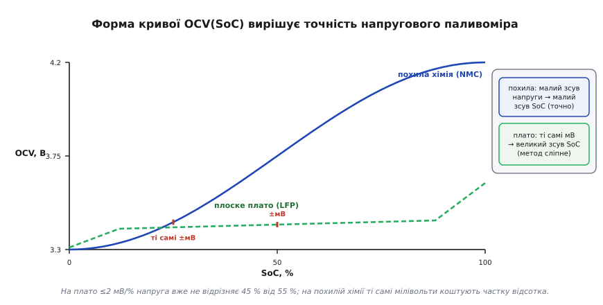
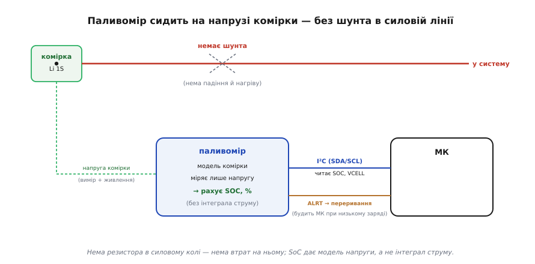

# Fuel gauge

**Паливомір** (англ. *fuel gauge* — буквально «покажчик пального»; назву взято від автомобільного покажчика рівня в баку) — це мікросхема, що показує, скільки заряду лишилось у батареї, у відсотках. Назва влучна: як стрілка в авто показує, скільки бензину в баку, так паливомір показує «скільки бензину» в комірці. Цілий клас таких чипів оцінює заряд однієї літієвої комірки (SoC, *state of charge* — стан заряду) **без струмового шунта**, спираючись лише на напругу. Канонічний представник такого підходу — родина MAX17048; на ньому й розберемо метод, але всі міркування стосуються будь-якого безшунтового паливоміра.

Щоб зрозуміти, чому оцінка заряду без шунта взагалі можлива й де ховається підступ, варто протиставити її [кулонометрії](root:hw-power/state-of-charge) — класичному методу лічби заряду.

У кулонометрії заряд не міряють напряму — заряд узагалі не вимірюваний прилад. Натомість міряють **струм** як падіння напруги на маленькому резисторі в силовій лінії й **інтегрують** його за часом: ∫I·dt і є той заряд, що втік або притік. Підхід чесний, бо спирається на фізичний закон збереження, але має дві вади, що випливають саме з інтегрування. По-перше, шунт стоїть у силовому колі, тож на ньому завжди є падіння й завжди є нагрів — данина за сам факт виміру. По-друге, інтеграл **накопичує помилку**: крихітне постійне зміщення нуля підсилювача, помножене на години, перетворюється на відсотки дрейфу, і нема способу його «забути» без зовнішнього калібрування на повному чи порожньому стані.

Безшунтовий паливомір обходить обидві вади, бо взагалі **не інтегрує струм**. Він сидить лише на **напрузі** комірки й, маючи її **модель**, оцінює SoC алгоритмічно з цієї напруги. Нема шунта — нема падіння й нагріву; нема інтеграла — нема накопиченого дрейфу. Натомість з'являється інша залежність, якої не мав кулонометр: точність тепер тримається на тому, **наскільки добре модель усередині чипа збігається з реальною кривою вашої комірки**. Звідси й три питання, що визначають увесь метод: чому напруга взагалі несе інформацію про заряд (це чиста термодинаміка), чому ця інформація така хитка під навантаженням, і що саме та «модель» робить, аби з хиткої напруги витягти стабільний відсоток.

### Чому напруга комірки взагалі знає про заряд: OCV і термодинаміка

В основі всього лежить **напруга розімкненого кола** (OCV, open-circuit voltage) — та напруга, яку комірка показує на клемах, коли через неї **не тече струм** і вона **усталилась**. Саме OCV, а не миттєва напруга під навантаженням, монотонно (для більшості літій-іонних хімій) пов'язана зі станом заряду. Зрозуміти, **чому** такий зв'язок існує, важливо — бо інакше «оцінка SoC з напруги» виглядає магією, а вона має точну фізичну причину.

OCV — це **рівноважна електрорушійна сила** електрохімічної комірки, і вона задається термодинамікою через рівняння Нернста. Потенціал визначається вільною енергією Гіббса реакції: E = −ΔG/(n·F), де n — число перенесених електронів на формульну одиницю, а F — стала Фарадея (96485 Кл/моль). У ході розряду активний матеріал електрода змінює свій склад — у катоді росте частка літованої фази, в аноді падає. Через це **хімічний потенціал літію** в електродах змінюється зі ступенем заповнення, а разом з ним і ΔG, і OCV. Іншими словами, OCV — це пряме віддзеркалення того, скільки літію вже вставилось у ґратку: рівень заряду «записаний» у самій термодинаміці матеріалу.

Звідси випливає й форма кривої OCV(SoC), і чому вона **не лінійна**. На краях діапазону (майже повна чи майже порожня комірка) хімічний потенціал міняється різко — крива круто йде вгору/вниз, тут невеликий зсув напруги відповідає малому зсуву заряду, й оцінка точна. У середині, навпаки, крива пологіша. У крайньому випадку — хімій на кшталт LiFePO₄ (LFP) — реакція йде через **двофазну рівновагу**: одночасно співіснують літована й делітована фази, і поки обидві присутні, хімічний потенціал літію майже не змінюється. Це дає сумнозвісне **плоске плато**, де OCV міняється на ≤2 мВ на кожен відсоток SoC. На такому плато (для LFP типово в зонах ~30–60% і ~70–90% заряду) напруговий паливомір майже сліпне: 2 мВ — це менше, ніж його ж шум і температурний дрейф, тож відрізнити 45% від 55% по напрузі практично неможливо. Тому безшунтовий паливомір найкраще працює саме з «похилими» хіміями (звичайний LiCoO₂/NMC), де крива OCV(SoC) має достатній нахил по всьому діапазону.


*Та сама помилка напруги в кілька мілівольтів дає на похилій кривій частку відсотка SoC, а на плоскому плато LFP — десятки відсотків. Точність напругового методу впирається у форму термодинамічної кривої комірки, а не в якість АЦП.*

> 🔧 **Навіщо це.** Коли ви добираєте комірку під безшунтовий паливомір, дивіться не лише на ємність, а й на **форму розрядної кривої**. Похила крива (кобальтат, NMC) — паливомір буде точним усюди. Плоске плато (LFP) — у середині діапазону відсотки «попливуть», і це не дефект чипа, а фізика хімії; під LFP беруть або кулонометр із шунтом, або спеціальні паливоміри з гібридним алгоритмом.

### Чому OCV «дихає» з температурою

Та сама термодинаміка, що дає зв'язок OCV(SoC), приносить і незручність: OCV **залежить від температури**, причому не як завгодно, а строго за термодинамічним правилом. Вільна енергія розкладається на ентальпійну та ентропійну частини, ΔG = ΔH − T·ΔS, і температурна похідна потенціалу виходить майже цілком із ентропійного члена:

```
dE_ocv/dT = (1/(n·F)) · dΔS/dT
```

бо внесок dΔH/dT малий і ним зазвичай нехтують. Практично це означає: при тій самій кількості запасеного літію (тому самому **істинному** SoC) холодна й тепла комірка покажуть **різну** OCV. Порядок величини — близько **3 мВ на кожні 10 °C** зміни (знак і точна величина залежать від хімії та від самого SoC). Здавалося б, дрібниця — але на пологій ділянці кривої ці 3 мВ можуть «коштувати» кілька відсотків SoC. Тому **температурна компенсація** для напругового паливоміра не розкіш, а необхідність: такий чип сам термометра не має, тож температуру міряє зовнішній сенсор біля комірки, а мікроконтролер за нею підправляє модель (компенсацію реалізують через системний МК — він пише в чип поправний коефіцієнт за виміряною температурою).

> 🔧 **Навіщо це.** Якщо ваш пристрій працює і на морозі, і в теплі (вуличний датчик, дрон), без термокомпенсації відсотки гулятимуть на кілька пунктів просто від погоди. Поставте термістор поряд із коміркою й передавайте його значення в алгоритм — інакше «100%» зранку на холоді стане «92%» опівдні без жодного реального розряду.

### Що насправді робить «модель» усередині чипа

Найслабше місце опису «чип має модель комірки» — спокуса лишити цю модель чорним ящиком. Розкриємо його, бо саме тут — суть і межі методу.

Наївна ідея «виміряв напругу → глянув у таблицю OCV(SoC) → отримав відсоток» працює лише в спокої. Щойно потече струм, на клемах буде вже не OCV, а **напруга під навантаженням**: з OCV віднімається падіння на **внутрішньому опорі** комірки (миттєве, омічне) плюс повільніша **поляризація** (дифузійні й кінетичні затримки, що наростають і спадають секундами-хвилинами). Прочитати таблицю по такій напрузі — значить помилитись: під розрядним піком комірка «здається» порожнішою, ніж є, а одразу після зняття навантаження — навпаки, повнішою, поки напруга **релаксує** назад до OCV.

Тому ModelGauge-подібний алгоритм усередині — це не таблиця, а **динамічна модель** комірки. Спрощено вона тримає кілька речей: криву OCV(SoC) (термодинамічний «кістяк»), оцінку внутрішнього опору й одну-дві ланки поляризації (як у RC-моделі: резистор + конденсатор, що моделюють інерцію напруги). Маючи їх, алгоритм за миттєвою напругою на клемах **відновлює OCV**: він віднімає змодельовані падіння й «дочекується» того, що показала б усталена комірка, не чекаючи реально. По відновленій OCV він читає SoC з термодинамічної кривої. Ключова перевага саме цього класу — алгоритм **не потребує циклу навчання**: він стартує з розумної оцінки одразу, на відміну від старих паливомірів, яким треба було хоч раз пройти повний заряд-розряд, щоб «звикнути» до комірки. Ціна — модель усередині налаштована під **певний клас хімії**; якщо ваша комірка суттєво інша, її параметри (опір, форма кривої) не збігаються, і відсотки систематично зміщені, доки не завантажиш власну модель.

### Блок-схема


*Чип під'єднано лише до напруги комірки — звідти ж він і живиться, — а в силовій лінії немає шунта. Усередині модель комірки оцінює SoC з напруги. Назовні I²C (МК читає SOC і VCELL) і вивід ALRT, що перериванням будить МК при низькому заряді.*

### Типова розпіновка

```
CELL / VDD   напруга комірки — і вимір, і живлення чипа
GND          нуль
SDA, SCL     I²C — читати SOC, VCELL; налаштування
ALRT         переривання при порозі (низький заряд тощо)
QSTRT        «швидкий старт» — перерахувати від поточної напруги
```

### Підключення

Найприємніше — підключення **тривіальне**, і це пряме наслідок безшунтового підходу: раз нема резистора в силовій лінії, то й розводити нічого. Вивід CELL/VDD йде на плюс комірки (звідти чип і живиться, і міряє), GND на мінус, лінії I²C у мікроконтролер. І все — **жодного шунта** в силовому колі, отже, нічого не гріється й не падає на ньому, а сам силовий тракт можна вести товстим коротким провідником без огляду на паливомір. Вивід **ALRT** заводять на вхід переривання МК: чип сам смикне його, коли заряд впаде нижче заданого порога, тож процесору не треба весь час опитувати паливомір — досить прокинутись на сигнал. Для наднизькоспоживних вузлів це принципово: МК спить, паливомір (одиниці мікроампер спокою) тихо стежить за напругою й будить систему лише по факту.

### «Перший байт»

«Заговорити» з паливоміром — це прочитати по I²C регістр **SOC** (дає відсоток заряду) і, за бажанням, **VCELL** (напругу). Для тонкого налаштування вантажать поріг ALRT або параметри моделі комірки; команда **QSTRT** змушує чип швидко переоцінити SoC від поточної напруги (корисно одразу після ввімкнення, поки внутрішня модель ще не «розкачалась»). Тобто «перший байт» — це читання SOC, і вже одне воно дає готовий відсоток — без жодного циклу навчання, бо стартова модель закладена в чип.

Як це виглядає в реальній прошивці, видно на MAX17048. Чип віддає кожен регістр **двома байтами, старший перший** (big-endian), а адреса в I²C-шині — 7-бітна `0x36` (тобто 8-бітна `0x6C` для запису). SOC лежить за адресою `0x04`, VCELL — за `0x02`. Сире 16-бітне значення SOC ділиться на 256 (роздільність регістра — 1/256 відсотка), а сире VCELL множиться на крок АЦП 78.125 мкВ.

**Прочитати SoC і напругу комірки по I²C (MAX17048, типовий драйвер на C):**

:::tabs
```c
#include <stdint.h>

#define MAX17048_ADDR   0x36u   /* 7-бітна адреса в шині           */
#define REG_VCELL       0x02u   /* напруга комірки, 2 байти        */
#define REG_SOC         0x04u   /* стан заряду, 2 байти            */

/* hal_i2c_read_u16: прочитати 2 байти з регістра reg, повернути їх
   як 16-бітне ціле зі старшим байтом попереду (big-endian чипа). */
static uint16_t reg_read_u16(uint8_t reg)
{
    uint8_t b[2];
    hal_i2c_read(MAX17048_ADDR, reg, b, 2);   /* ваша HAL-обгортка I²C */
    return ((uint16_t)b[0] << 8) | b[1];      /* старший байт — перший */
}

/* SoC у відсотках: регістр має роздільність 1/256 % */
float max17048_soc(void)
{
    return reg_read_u16(REG_SOC) / 256.0f;
}

/* Напруга комірки у вольтах: крок АЦП 78.125 мкВ на молодший біт */
float max17048_vcell(void)
{
    return reg_read_u16(REG_VCELL) * 78.125e-6f;
}
```
```micropython
from machine import I2C

MAX17048_ADDR = 0x36   # 7-бітна адреса в шині
REG_VCELL     = 0x02   # напруга комірки, 2 байти
REG_SOC       = 0x04   # стан заряду, 2 байти

def reg_read_u16(i2c, reg):
    # прочитати 2 байти з регістра reg й зібрати їх у 16-бітне
    # ціле зі старшим байтом попереду (big-endian чипа)
    b = i2c.readfrom_mem(MAX17048_ADDR, reg, 2)
    return (b[0] << 8) | b[1]               # старший байт — перший

def max17048_soc(i2c):
    # SoC у відсотках: регістр має роздільність 1/256 %
    return reg_read_u16(i2c, REG_SOC) / 256.0

def max17048_vcell(i2c):
    # напруга комірки у вольтах: крок АЦП 78.125 мкВ на молодший біт
    return reg_read_u16(i2c, REG_VCELL) * 78.125e-6
```
```python
import smbus2

MAX17048_ADDR = 0x36   # 7-бітна адреса в шині
REG_VCELL     = 0x02   # напруга комірки, 2 байти
REG_SOC       = 0x04   # стан заряду, 2 байти

def reg_read_u16(bus, reg):
    # прочитати 2 байти з регістра reg й зібрати їх у 16-бітне
    # ціле зі старшим байтом попереду (big-endian чипа)
    hi, lo = bus.read_i2c_block_data(MAX17048_ADDR, reg, 2)
    return (hi << 8) | lo                   # старший байт — перший

def max17048_soc(bus):
    # SoC у відсотках: регістр має роздільність 1/256 %
    return reg_read_u16(bus, REG_SOC) / 256.0

def max17048_vcell(bus):
    # напруга комірки у вольтах: крок АЦП 78.125 мкВ на молодший біт
    return reg_read_u16(bus, REG_VCELL) * 78.125e-6
```
:::

Покрокова перевірка чисел на одному читанні: нехай чип повернув для SOC байти `0x5A 0x80`, а для VCELL `0xBA 0x40`.

```
SOC сире   = 0x5A80 = 23168
SoC %      = 23168 / 256 = 90.5 %

VCELL сире = 0xBA40 = 47680
напруга    = 47680 × 78.125 мкВ = 3.725 В
```

Висновок: одне читання двох регістрів дає одразу і відсоток (90.5 %), і напругу (3.725 В) — без інтеграла, без калібрування, без циклу навчання. Уся «розумна» частина (відновлення OCV із напруги під навантаженням) уже відпрацювала всередині чипа; прошивці лишається поділити й помножити на константи.

### Скільки коштує 50 мВ помилки напруги

Покажемо на числах, чому форма кривої OCV(SoC) вирішує все. Нехай комірка — звичайна Li-ion (NMC) з типовим робочим діапазоном OCV приблизно від 3.3 В (≈0%) до 4.2 В (≈100%), і ми оцінюємо, на скільки помилиться SoC, якщо паливомір помилився в напрузі на 50 мВ (наприклад, недокомпенсував температуру або просадку).

**Похила ділянка (середина, ~50% SoC).** Тут крива NMC має нахил порядку:

```
розмах OCV     ≈ 4.2 − 3.3 = 0.9 В на 100% SoC
середній нахил ≈ 0.9 В / 100% = 9 мВ на 1% SoC
помилка SoC    = 50 мВ / (9 мВ/%) ≈ 5.6%
```

Майже 6% похибки від 50 мВ — відчутно, але терпимо для індикатора заряду.

**Плоске плато (уявімо LFP, ~50% SoC).** Тут нахил падає до ≤2 мВ/%:

```
нахил на плато  ≤ 2 мВ на 1% SoC
помилка SoC     = 50 мВ / (2 мВ/%) ≥ 25%
```

Ті самі 50 мВ дають **щонайменше 25%** похибки — оцінка фактично марна. Той самий чип, та сама електроніка, та сама помилка напруги — а результат відрізняється вчетверо й більше **виключно через форму термодинамічної кривої комірки**. Ось чому безшунтовий паливомір — рішення для похилих хімій, а під LFP беруть кулонометр.

### Типові граблі

- **Залежність від моделі.** Точність тримається на тому, що ваша комірка схожа на ту, під яку налаштований чип: збігаються і форма кривої OCV(SoC), і внутрішній опір. Дуже інша хімія чи незвичайна комірка вимагає завантажити власну модель — інакше відсотки систематично попливуть, бо алгоритм відніматиме «не ті» падіння при відновленні OCV.
- **Нема виміру струму.** Без шунта чип не знає реального струму, тож «час до розряду» він оцінює зі **швидкості зміни напруги**, а не з фактичного споживання. Під різкими піками ([просадка напруги](root:hw-power/battery-sag)) миттєва напруга падає на внутрішньому опорі, і поки модель не відновить OCV, оцінка може на мить хитнутись.
- **Чутливість до плато.** На пологих ділянках кривої (а тим паче на плато LFP) мала помилка напруги перетворюється на велику помилку SoC — як показує розрахунок ціни 50 мВ помилки вище. Це не лікується точнішим АЦП, бо причина в самій фізиці комірки.
- **Температурний дрейф.** OCV «дихає» з температурою (~3 мВ/10 °C через ентропійний член), тож без зовнішньої термокомпенсації відсотки гулятимуть від самої лише зміни температури, без реального розряду.
- **Завжди живиться з комірки.** Чип бере крихітний струм спокою постійно, поволі розряджаючи батарею; для звичайних пристроїв дрібниця, але для наднизькоспоживних це закладають у бюджет.
- **Тільки 1S.** Такий чип — для однієї комірки; багатокоміркові пакети потребують іншого паливоміра (у родині MAX17048 двокоміркова рідня — MAX17049).
- **Потрібне усталення.** Як і всякий [напруговий метод оцінки заряду](root:hw-power/state-of-charge), одразу після навантаження він читає неточно, поки напруга не **релаксує** назад до OCV; алгоритм це частково компенсує моделлю поляризації, але не миттєво.

### Варіації класу

Дзеркальна альтернатива — **шунтові** паливоміри з [кулонометрією](root:hw-power/state-of-charge): вони ставлять струмовий резистор і інтегрують струм (точніший «час до розряду», бо міряють фактичне споживання, та з шунтом, його нагрівом і накопиченим дрейфом). Найточніші сучасні чипи **поєднують** обидва підходи: кулонометрія дає короткостроковий точний інтеграл струму, а періодичне відновлення OCV у спокої скидає накопичений дрейф — кожен метод латає слабкість іншого. Є паливоміри, **вбудовані** в зарядні чипи й PMIC; є **багатокоміркові** для пакетів; є складніші чипи з **самонавчанням**, що поступово уточнюють модель (форму кривої й опір) під конкретну комірку та її старіння. Безшунтовий мінімалістичний паливомір (як MAX17048) же цінують саме за простоту: три дроти, жодного шунта — і готовий відсоток заряду одразу, без циклу навчання.
