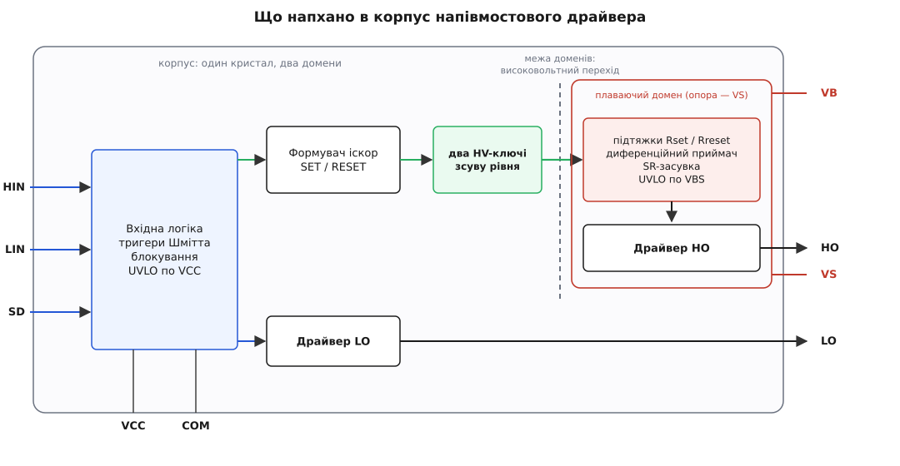
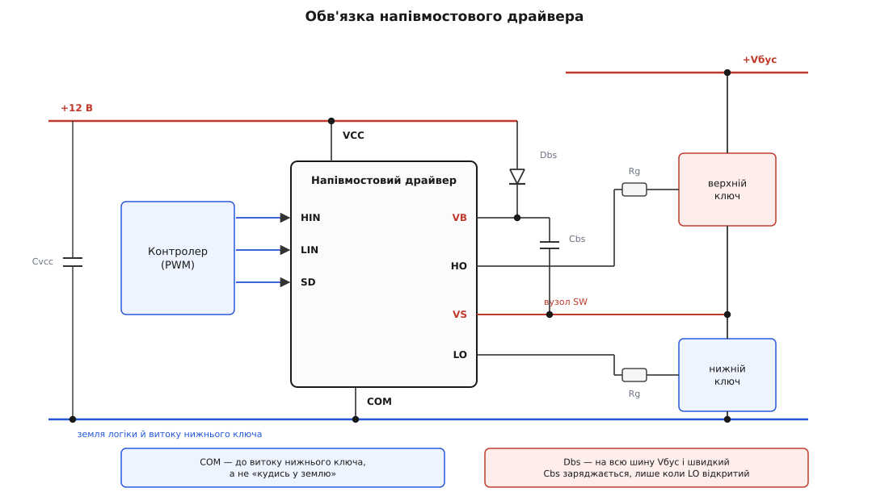
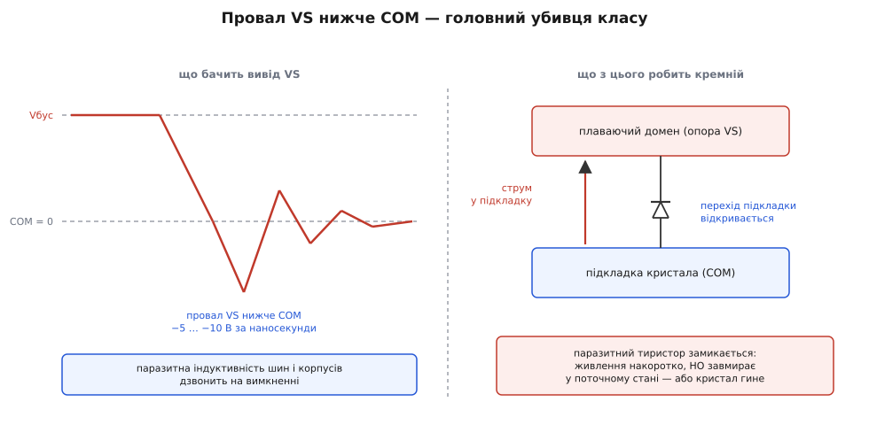

# 🔌 Напівмостовий драйвер: анатомія класу

Восьминіжка коло силового плеча коштує як чашка кави, а всередині неї співіснують два електричні світи, розведені на сотні вольт. Це **монолітний напівмостовий драйвер** — у паспортах його часто звуть HVIC (*high-voltage integrated circuit*, високовольтна інтегральна схема). Бере від контролера два кволі логічні сигнали, повертає два потужні затворні струми: один нижньому ключу плеча, другий — верхньому, чия опора гуляє від нуля до силової шини.

Клас упізнається з першого погляду на схему. Підписи `HIN`, `LIN`, `HO`, `LO`, `VB`, `VS`, `VCC`, `COM` повторюються від виробника до виробника майже слово в слово — це радше галузева абетка, ніж чиясь фірмова вигадка. Тому клас і варто знати цілком: побачивши ці вісім підписів, ви вже прочитали половину схеми, ще не знаючи, чий саме чип стоїть на платі.

### Що це за клас

Робота драйвера — перекласти намір у струм. Контролер каже «ключ відкритий» рівнем 3.3 В і струмом у мікроампери; [затвор силового ключа](topic:hw-components/gate-capacitance) — це кількананофарадна ємність, яку треба перезарядити за десятки наносекунд, а це вже ампери. Ось цим підсиленням і живе будь-який [драйвер затвора](topic:hw-power/gate-driver): вхід — біт, вихід — коротка потужна порція заряду.

Напівмостовий драйвер робить це **двічі й несиметрично**. Нижній ключ плеча стоїть витоком на землі, спільній із логікою, — його драйвер тривіальний, звичайний двотактний вихід коло нуля. Верхній ключ — інша історія: [щоб тримати N-канальний ключ відкритим у верхньому плечі](topic:hw-power/high-side-switch), затвор треба тягнути **над** силовою шиною, а сам витік цього ключа злітає до шини щоразу, коли ключ відкривається. Тож верхній драйвер мусить жити у власному домені, що їде вгору разом із витоком, — і команду туди треба якось передати.

Уся хитрість класу — в тому, що обидва драйвери сидять **на одному кристалі**. Не два чипи, не бар'єр між ними, а один шматок кремнію, поділений високовольтним переходом на заземлений закуток і плаваючий. Звідси і вся вигода класу, і всі його межі.

> 🔧 **Навіщо це.** Клас пізнають не за номером, а за трійкою виводів `VB`/`VS`/`HO`. Побачили їх на схемі — знайте: праворуч від них живе окремий домен напруги, і будь-яка ваша дія з тими вузлами (щуп, резистор, земля) міряється **відносно VS**, а не відносно землі плати. Дев'ять із десяти помилок із цим класом починаються з того, що людина забула цей рядок.

### Що напхано в корпус

Розкриймо восьминіжку. Усередині — не «два підсилювачі», а виразно два різні за складністю тракти.


*Що напхано в корпус. Ліворуч — заземлений домен: вхідна логіка з тригерами Шмітта, блокуванням і UVLO, звідти прямий шлях на драйвер LO. Праворуч, за високовольтним переходом, — плаваючий домен зі своїм приймачем, засувкою, власним UVLO й драйвером HO. Нижній бік простий; уся складність — угорі.*

**Вхідна логіка** спільна на обидва боки. Входи `HIN`/`LIN` — не голі затвори, а [тригери Шмітта](topic:hw-analog/schmitt-trigger): вони мають гістерезис, тож повільний або замурзаний фронт від контролера не викликає дрижання на виході. Тут-таки сидить **блокування** (interlock) — логіка, що фізично не дає обом виходам піднятися разом, хоч би що подав контролер. І тут-таки — [UVLO](topic:hw-power/uvlo) по `VCC`: поки живлення нижнього боку не доросло до порога, виходи тримаються притиснутими, бо напівпригашений ключ — це ключ у лінійному режимі, тобто грілка.

**Нижній тракт** після логіки — це просто драйвер: підсилювач струму, що жене ампери в `LO`. Все.

**Верхній тракт** — довга дорога. Логіка перетворює рівень на дві короткі іскри (SET і RESET), ті продавлюють два високовольтні ключі зсуву, іскри перетинають межу доменів, нагорі їх ловить диференційний приймач, кладе стан у [SR-засувку](topic:hw-digital/sr-latch), і вже засувка керує драйвером `HO`. Плюс **другий, окремий UVLO** — по `VBS`, тобто по напрузі плаваючого живлення `VB` відносно `VS`.

Ця асиметрія — не дрібниця, вона тече далі в паспорт. Два тракти різної довжини мають різну затримку, тож у характеристиках з'являється окремий рядок **узгодження затримок** (*delay matching*) — на скільки наносекунд шляхи HIN→HO і LIN→LO розбігаються. Розбіг з'їдає ваш [мертвий час](topic:hw-power/dead-time-sizing) мовчки: ви заклали 200 нс паузи, а драйвер із розбігом 50 нс лишив від неї 150.

### Типова розпіновка

Вісім виводів — канонічна форма класу. У ширших корпусах виводів більше, але вісім опорних лишаються ті самі:

```
             ┌────────U────────┐
    VCC   1 ─┤●                ├─ 8   VB    плаваюче живлення
    HIN   2 ─┤   нижній,       ├─ 7   HO    затвор верхнього ключа
    LIN   3 ─┤   заземлений    ├─ 6   VS    опора плаваючого домену
    COM   4 ─┤   бік           ├─ 5   LO    затвор нижнього ключа
             └─────────────────┘
                                  ← високовольтний бік →
```

Читаємо по одному:

- **`VCC`** — живлення заземленої частини, типово 10…20 В. Це та сама напруга, з якої заряджається плаваюче «відерце».
- **`COM`** — опора всього нижнього боку й **витік нижнього ключа**. Не «земля взагалі», а конкретна точка в силовій схемі.
- **`HIN`, `LIN`** — логічні входи. Часто сумісні з 3.3-вольтовою логікою, але це треба перевіряти щоразу.
- **`LO`** — вихід на затвор нижнього ключа, міряний від `COM`.
- **`VS`** — опора плаваючого домену; йде просто на вузол плеча, тобто на витік верхнього ключа.
- **`HO`** — вихід на затвор верхнього ключа, міряний **від `VS`**, не від землі.
- **`VB`** — плюс плаваючого живлення. `VB − VS` і є ті 12 В, якими верхній драйвер орудує затвором.

Тепер найцікавіше — **геометрія**. Погляньте на порядок: усі низьковольтні виводи (1–4) зібрані на одному боці корпусу, усі високовольтні (6–8) — на протилежному. Це не випадковість і не зручність розводки. Між `COM` і `VS` у найгіршу мить стоїть уся силова шина, і ця напруга мусить витримуватися не лише всередині кристала, а й **зовні** — по повітрю між ніжками (зазор) і по поверхні пластику (шлях витоку, *creepage*). Виробники цього класу виносять цю властивість просто в заголовок паспорта — «усі високовольтні виводи на одному боці», «збільшений шлях витоку».

Звідси ж дивина ширших корпусів: у чотирнадцятиніжкових версій частина виводів посередині позначена як **непід'єднані** (NC). Кремнієві кристали там нікуди не поділися — ніжки навмисно **пожертвувано**, щоб рознести низьковольтний і високовольтний береги якнайдалі. Порожня ніжка коштує дешевше за пробій.

> 🔧 **Навіщо це.** Із геометрії корпусу випливає геометрія плати. Смуга під корпусом між `COM`-боком і `VS`-боком — заповідник: жодних доріжок, жодного полігона землі, жодних перехідних отворів. Виробник розсунув береги на кристалі й у корпусі, а ви, протягнувши там доріжку сигналу «на зручний бік», зводите його роботу нанівець — і зазор тепер визначає ваша доріжка, а не його пластик.

### Обв'язка: що навісити

Клас навмисне лишає зовні мінімум — але кожна з тих деталей обов'язкова.


*Що навісити навколо. Cvcc тримає живлення драйвера, коли той рве ампери в затвор. Dbs і Cbs роблять плаваюче «відерце»: конденсатор заряджається з шини +12 через діод, поки нижній ключ відкритий і вузол SW притиснутий до землі. VS іде просто на вузол плеча, COM — просто на витік нижнього ключа.*

**Конденсатор по `VCC`.** Драйвер у момент перемикання висмикує з живлення кілька ампер за десятки наносекунд. Тонкий дріт від блока живлення такого не дасть — тож поруч із корпусом мусить стояти [розв'язувальний конденсатор](topic:hw-components/decoupling): одиниці мікрофарад плюс дрібний керамічний упритул до ніжок. Без нього драйвер просаджує сам собі живлення на кожному фронті, лізе у власний UVLO й поводиться незбагненно — «то працює, то ні».

**Bootstrap-діод і конденсатор.** [Bootstrap-конденсатор](topic:hw-power/bootstrap-capacitor) між `VB` і `VS` — єдине джерело верхнього драйвера. Заряджається він так: поки нижній ключ відкритий, вузол плеча притиснутий до землі, `VS ≈ 0`, і з шини `VCC` через діод у конденсатор перетікає заряд. Відкрився верхній ключ — `VS` злетів до шини, `VB` злетів разом із ним на 12 В вище, діод замкнувся зворотним зміщенням, і «відерце» їде вгору автономно.

Звідси дві вимоги до діода, і обидві жорсткі. **Зворотна напруга — на всю шину**: коли `VB` угорі, діод тримає на собі всю `Vбус`. **Відновлення — швидке**: у мить закриття верхнього ключа `VS` падає, і повільний діод устигає провести назад пачку заряду з «відерця» просто в шину живлення. Звичайний випрямний діод тут не лише марнує заряд, а й вистрілює викидом у `VB`.

**Затворні резистори.** Між `HO` і затвором, між `LO` і затвором — послідовний опір. Він задає швидкість фронту ключа, а швидкість фронту — це прямий важіль і на [комутаційні втрати](topic:hw-components/switching-losses), і на dV/dt, яким плече лупить по власному драйверу.

**Дві опори — просто й буквально.** `COM` іде на **витік нижнього ключа**, `VS` — на **вузол плеча**. Не «на найближчий полігон землі» і не «на зручну доріжку». Кожен зайвий сантиметр між `COM` і справжнім витоком — це паразитна індуктивність, на якій під час перемикання виникає напруга, і саме вона породжує головну біду класу.

**Входи не лишати в повітрі.** Наявність внутрішніх підтяжок — властивість конкретного приладу, а не класу. Мовчазні `HIN`/`LIN` під час подавання живлення — це два входи, що ловлять наводки, поки контролер ще не прокинувся. Резистори вниз коло виводів коштують копійки й знімають цілий клас загадкових стартових аварій.

### Перший імпульс

Байта тут нема — є перший фронт. І перше правило: **не заводьте драйвер одразу на робочій шині**. Помилка розводки на 400 В обходиться в дві мертві мікросхеми, два мертві ключі й вигорілу доріжку; та сама помилка на 24 В обходиться в думку «ага, ось воно».

Порядок, що ловить майже все:

1. **Шина знята.** Живлення силового плеча вимкнене або на найнижчій напрузі, яку схема стерпить, — 12…24 В. Ключі вже стоять, обв'язка вже стоїть.
2. **Тільки `VCC`.** Подайте живлення драйвера й погляньте на струм спокою: одиниці міліампер. Десятки міліампер або нуль — далі не йдіть, шукайте коротке чи ненадійне живлення.
3. **Тільки `LIN`.** Погоніть PWM лише в нижній канал. `LO` повинен видати чисту меандрову хвилю відносно `COM`. Це найдешевша перевірка, бо тут усе заземлене: звичайний щуп, звичайна земля, жодної містики.
4. **Погляньте на `VB` відносно `VS`.** Поки `LIN` клацає, «відерце» заряджається, і між `VB` і `VS` мусять з'явитися ті самі ~12 В. Не з'явилися — винен діод, конденсатор або сам вузол плеча, що не сідає на землю.
5. **Аж тепер `HIN`.** Верхній канал перевіряється **останнім**, бо він фізично не може працювати, доки кроки 3–4 не пройшли.
6. **І тільки потім піднімайте шину.**

Крок 5 має свою пастку — вимірювання. Про неї нижче, бо саме вона з'їдає найбільше мікросхем.

> 🔧 **Навіщо це.** Найпоширеніший «дефект» цього класу — новий драйвер, у якого `HO` мовчить. Дев'ять разів із десяти мікросхема ціла: людина подала `HIN` без `LIN`, «відерце» ніколи не заряджалося, спрацював UVLO по `VBS`, і верхній драйвер чесно тримає ключ закритим. Клас **не вміє** підняти верхній ключ «з холодного старту» — нижній мусить кліпнути першим. Якщо ваша схема цього дозволити не може, то ця обв'язка вам не підходить: беріть [зарядову помпу](topic:hw-power/charge-pump), яка тримає напругу над шиною без пауз.

### Типові граблі

**Заземлений щуп на `HO` або `VS`.** Ось вона, найдорожча помилка. Земляний вусик щупа осцилографа з'єднаний усередині приладу з захисним заземленням — тобто із землею вашої плати. Причепіть його до `VS`, і ви **закоротили вузол плеча на землю** через тонкий дріт. Поки верхній ключ закритий — нічого не станеться, і ви навіть побачите «гарну картинку». А в мить, коли верхній ключ відкриється, шина ляже просто на цей вусик. Верхній бік міряють **лише** диференційним щупом (або, у скрутному разі, повністю розв'язавши осцилограф — але це вже про безпеку оператора, а не про зручність). І це не примха класу: `HO` та `VS` за визначенням не мають нічого спільного із землею, тож будь-яке однокінцеве вимірювання на них позбавлене змісту.

**Провал `VS` нижче `COM`.** Головний убивця класу — і найпідступніший, бо в схемі його нема: він народжується з паразитної індуктивності доріжок і ніжок.


*Провал VS нижче COM. На вимкненні верхнього ключа паразитна індуктивність шин дзвонить, і вузол плеча на кілька наносекунд провалюється на кілька вольт нижче землі. Для кремнію це означає, що перехід підкладки відкривається й упорскує струм у підкладку — а там на нього чекає паразитний тиристор.*

Механізм такий. Плаваючий домен лежить на спільній підкладці, і між ними є перехід, який у нормальній роботі зміщений зворотно (домен завжди **вище** підкладки). Провалився `VS` нижче `COM` — перехід відкривається просто, як звичайний діод, і жене струм у підкладку. А підкладка, поділена на області різного типу, містить паразитну тиристорну структуру. Досить її «підпалити» — вона замикається й тримає себе сама, вже без вашої участі: живлення накоротко, кристал гине.

Виробники цей край нормують: типово гарантують несприйнятливість до провалу **щонайменше 5 В** відносно `COM`. Глибший провал ще не обов'язково вбиває — спершу з'являється м'якший симптом: **верхній вихід тимчасово завмирає в поточному стані** й перестає слухати `HIN`. Далі — залежно від того, скільки струму встигло влізти в підкладку.

Практично це означає: борня йде не з мікросхемою, а з індуктивністю. Коротка й широка петля між ключами, `COM` просто на витік нижнього ключа, `VS` просто на вузол плеча, конденсатор ланки постійного струму впритул до плеча. Далі — пом'якшити фронт затворним резистором чи [снабером](topic:hw-power/snubbers-dvdt), а вже в найтяжчому разі — резистор у лінії `VS` і клампувальні діоди.

**Два UVLO працюють нарізно — і це збиває з пантелику.** UVLO по `VCC` глушить обидва виходи; UVLO по `VBS` — **лише верхній**. Уявіть картину: bootstrap-конденсатор недобирає (замалий, повільний діод, надто довга пауза), напруга `VB − VS` просідає під поріг — і верхній ключ мовчки перестає відкриватися, тоді як нижній справно клацає далі. Міст працює наполовину. У найпростіших приладах класу ніхто вам про це не скаже — виводу несправності просто немає. Мотор смикається, шина гріється, а на входах драйвера — бездоганний PWM.

**Блокування — це не мертвий час.** Ця плутанина коштує ключів. **Блокування** гарантує лише те, що обидва виходи не піднімуться **одночасно**. Воно нічого не знає про те, скільки часу ваш ключ насправді закривається: реальний MOSFET має затримку вимкнення й хвіст, і поки він її відпрацьовує, блокування вже дозволило протилежному виходу піднятися. Наскрізний струм проходить крізь бездоганно справне блокування. **Мертвий час** — інша річ: це навмисна пауза, коли закриті обидва. Частина приладів класу її вставляє (фіксовану або задавану резистором — типово від сотні до кількох сотень наносекунд), частина не вставляє **зовсім** і покладає це цілком на контролер. Тож перше питання до конкретного приладу: він мені паузу вставить чи ні? Якщо ні — [мертвий час](topic:hw-power/dead-time-sizing) ваш і тільки ваш.

**`SD` мовчки перевернутий.** Вивід вимкнення в межах класу трапляється обох полярностей — десь активний високий, десь активний низький, а десь третій вхід узагалі суміщений із `LIN`. Помилка полярності дає драйвер, що не заводиться взагалі або не глушиться ніколи. Це рівно той випадок, коли клас підказує **питання**, а відповідь є лише в паспорті конкретного приладу.

**Рівні входів проти 3.3-вольтового контролера.** «Сумісний із логікою» — не те саме, що «сумісний із вашою логікою». Частина приладів класу має пороги, прив'язані до `VCC`, і на 12-вольтовому живленні вимагає для одиниці більше, ніж 3.3 В. Драйвер тоді працює «майже» — і тим гірший, що працює.

### Варіації класу

Усередині класу ці риси комбінуються майже вільно.

**Стеля напруги.** Три сходинки, за якими родини й поділені: **200 В** (низьковольтні мостові вузли, дрібні привóди), **600 В** (мережні перетворювачі, найлюдніша поличка) і **1200 В** (промислові привóди, здебільшого на [IGBT](topic:hw-components/igbt)). Це стеля не «рекомендована», а фізична: вище тримати домен на спільній підкладці нема чим.

**Скільки каналів.** Той самий кремній різають на різні продукти: лише верхній канал; лише нижній; два незалежні нижні; напівміст (наш випадок); **трифазний** — шість виходів, три плаваючі домени, по одному на кожне плече. Трифазні версії — це вже майже готовий інвертор на [комутацію BLDC](topic:hw-motion/bldc-commutation).

**Скільки входів на канал.** Або два незалежні (`HIN`/`LIN`) — контролер сам ліпить мертвий час; або **один** вхід PWM плюс вхід дозволу, а прилад сам розводить його на два виходи з власною паузою. Другий варіант економить ніжку контролера й таймер, але забирає у вас керування паузою — за швидких ключів це саме те, чого ви віддавати не хочете.

**Вбудований bootstrap-діод.** Частина приладів несе діод усередині — часто не діод як такий, а високовольтний ключ, що вмикається тоді, коли відкритий нижній вихід. Мінус деталь і місце на платі; натомість струм заряджання обмежений тим, що вклали всередину.

**Захисти.** Просунуті версії (насамперед трифазні) додають повний обвід: вхід струмової відсічки, що глушить **усі** виходи від зовнішнього шунта; вивід несправності з відкритим стоком, який можна зібрати монтажним АБО з кількох корпусів у одну лінію до контролера; вхід із RC-ланкою, що задає, за скільки аварію скинути автоматично. У драйверах під IGBT до цього додається [контроль насичення](topic:hw-power/desaturation-detection).

**Процес кристала.** Найтихіша, але, може, найважливіша відмінність. Класичні прилади роблять на кремнії з переходом-ізоляцією — з тією самою паразитною тиристорною структурою. Прилади на **кремнії-на-ізоляторі** (SOI) розділяють області оксидом, і паразитного тиристора там просто **нема**: заклинити ніяк, тож стійкість до провалу `VS` різко вища. Якщо ваше плече дзвінке — це і є причина переплатити.

### Де клас закінчується

Дві межі варто знати ще до вибору.

**Це не розв'язка.** Обидва домени ділять одну підкладку, між ними лише перехід, що блокує напругу, поки вона в межах. [Гальванічна розв'язка](topic:hw-components/galvanic-isolation) розриває коло фізично; тут нема чого розривати. Тому там, де верхній бік висить на мережі, а до низьковольтного може дотягтися людина, клас **не годиться** — ні як інженерне рішення, ні як відповідність нормам. Це територія [ізольованого драйвера](topic:hw-power/isolated-gate-driver) зі справжнім бар'єром.

**Це не для найшвидших ключів.** Стрибок домену наводить у лініях зсуву паразитний струм, і надто крутий фронт приймач уже не відрізняє від чесної команди. Паспортна межа dV/dt — тверда стеля. Карбід-кремнієві та нітрид-галієві ключі дають такі фронти, що монолітний зсув на них часто вже не витягує, — [їхнє затворне господарство](topic:hw-power/sic-gan-gate-drive) живе за іншими правилами.

### Коротко про суть

Монолітний напівмостовий драйвер пакує в одну восьминіжку весь вузол керування плечем: вхідну логіку з тригерами Шмітта й блокуванням, простий драйвер нижнього ключа, зсув рівня з двома високовольтними ключами й засувкою, плаваючий драйвер верхнього ключа і **два незалежні** UVLO. Абетка виводів галузева: `VCC`/`COM` — заземлений бік, `VB`/`VS`/`HO` — плаваючий, і рознесені вони по протилежних боках корпусу навмисне, заради зазору й шляху витоку. Обв'язка мінімальна, але без варіантів: конденсатор по `VCC`, швидкий діод на всю шину плюс «відерце» між `VB` і `VS`, затворні резистори, `COM` просто на витік нижнього ключа, `VS` просто на вузол плеча. Заводять знизу вгору й на низькій шині: спершу `LIN` і `LO`, потім перевірка `VB − VS`, і лише тоді `HIN` — бо верхній канал фізично не працює, доки нижній не кліпнув і не зарядив «відерце». Убивають цей клас три речі: заземлений щуп на плаваючому боці, провал `VS` нижче `COM` (паразитний тиристор у підкладці) і плутанина блокування з мертвим часом. А варіації — стеля 200/600/1200 В, кількість каналів, один вхід чи два, вбудований діод, струмова відсічка з виводом несправності та процес кристала — це вже вибір під конкретне плече.
