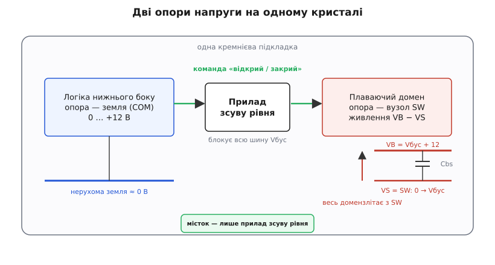
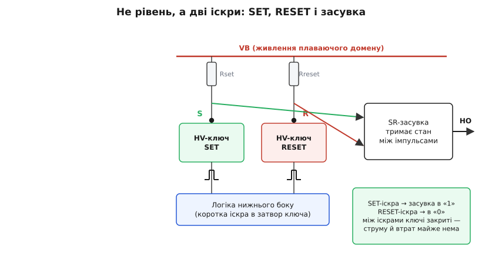
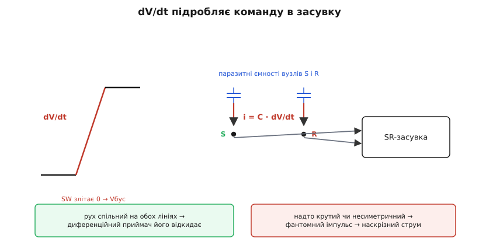

# Зсув рівня у плаваючий домен

<preknowlist>
- [Верхній ключ](topic:hw-power/high-side-switch) — чому затвор верхнього N-канального ключа треба тримати над силовою шиною, а його опора (витік) злітає разом із вузлом плеча.
- [Драйвер затвора](topic:hw-power/gate-driver) — підсилювач струму на затвор і два електричні світи всередині: нерухома логіка й плаваючий верхній бік.
- [Bootstrap-конденсатор](topic:hw-power/bootstrap-capacitor) — плаваюче *живлення* верхнього драйвера: «відерце» заряду, що їде вгору разом із витоком ключа.
- [Перетворювач рівнів](topic:hw-digital/level-shifter) — загальна ідея перекинути логічний сигнал між двома опорами напруги.
</preknowlist>

Верхній драйвер напівмоста живе високо над логікою: його опора висить на силовій шині, за сотні вольт над землею контролера. [Bootstrap-конденсатор](topic:hw-power/bootstrap-capacitor) розв'язує, звідки взяти там *живлення*. Та жива схема потребує не лише живлення — комусь треба ще й сказати верхньому ключу «відкрийся» і «закрийся». А команда народжується внизу, у заземленій логіці, коло нуля. Як бітам «відкрий/закрий» видертися з домену 0 В у домен, що плаває на +540 В?

Один шлях — прорубати між світами бар'єр і перекинути біт крізь нього світлом чи магнітним полем; так роблять [ізольовані драйвери](topic:hw-power/isolated-gate-driver), і платять за це окремою мікросхемою та окремим плаваючим живленням. Але є дешевший шлях, що вміщається на тому самому кремнієвому кристалі: проштовхнути команду просто вгору крізь високовольтний прилад, без жодного бар'єра. Це і є **зсув рівня у плаваючий домен** *(домен — від лат. dominium, «володіння»; тут — область одного спільного потенціалу)* — трюк, захований усередині копійчаних напівмостових драйверів.

### Плаваючий домен на одному кристалі

Щоб трюк став зрозумілим, треба побачити головне: верхній драйвер — це не окрема мікросхема, приклеєна збоку, а **закуток на тому самому кристалі**, що вміє їхати вгору. На монолітному високовольтному драйвері *(монолітний — гр. monólithos, «з одного каменя»)* один шматок кремнію розділено на дві області. Нижня — заземлена логіка, що сидить коло нуля. Верхня — плаваючий домен, який може підніматися майже до всієї силової шини над спільною підкладкою. Між ними — вбудований у кристал високовольтний перехід, що тримає ці сотні вольт і не дає верхньому закутку «замкнути» на нижній.


*Дві опори напруги на одній підкладці. Ліворуч логіка притиснута до землі, праворуч плаваючий домен їде вгору разом із витоком верхнього ключа (вузол SW), а живиться від bootstrap-конденсатора між VB і VS. Єдиний місток для команди через прірву напруги — прилад зсуву рівня.*

Ось де ховається слово «плаваючий»: верхній закуток не прибитий до жодної фіксованої напруги. Поки нижній ключ відкритий, вузол плеча SW притиснутий до землі, і верхній домен теж коло нуля. Щойно відкривається верхній ключ, SW злітає до силової шини — і весь домен разом із ним, бо його опора **і є** цей вузол. Напруга під ним рухається на сотні вольт за одиниці наносекунд, а домен спокійно їде на цій хвилі, зберігаючи всередині свої власні 12 В (VB відносно VS).

Тепер видно, чому місток мусить бути особливим. Команду треба перекинути із заземленого закутка у той, що плаває на +540 В, а коли верхній ключ закритий — прилад-місток тримає на собі всю цю різницю, не пробиваючись. Звичайний логічний ключ на 20–30 В тут згорів би вмить; потрібен **високовольтний бічний ключ**, здатний блокувати всю шину. Саме вміння виростити такий прилад поряд зі звичайною логікою на одному кристалі й народило цілий клас мікросхем — [як це вдалося зробити вперше](topic:hw-power/high-side-level-shift/hist-hvic.md), окрема історія: монолітний високовольтний драйвер з'явився наприкінці 1980-х, коли навчилися суміщати на одній підкладці слабку логіку й прилади, що тримають 600 В і вище.

> 🔧 **Навіщо це.** Побачивши напис «600 V HVIC» чи «high/low-side driver» на восьминіжці біля напівмоста, ви одразу читаєте задум: усередині — заземлена логіка, плаваючий верхній драйвер і місток зсуву рівня між ними, усе на одному кристалі. Це principово інша річ, ніж ізольований драйвер: тут між боками **нема** бар'єра, вони ділять спільну підкладку. Дешево й компактно — але й межі звідси, про них далі.

### Як команда лізе вгору

Механізм зсуву гарний своєю прямотою. Візьмімо високовольтний N-канальний ключ, чий витік сидить унизу, на землі логіки. Його стік тягнеться **вгору**, у плаваючий домен, і там під'єднаний через підтяжку-резистор до верхньої шини VB. Поки ключ закритий, струму нема, і вузол стоку висить угорі, притягнутий до VB. Логіка знизу відкриває ключ — той починає проводити й **тягне вузол стоку вниз**, продавлюючи через підтяжку струм. На резисторі падає напруга I·R, і цей провал верхній приймач бачить **відносно своєї плаваючої опори** як сигнал: «команда прийшла».

Ось у чому дотепність. Один і той самий фізичний провідник простягнутий крізь усю прірву від 0 до 540 В, але **значущий** сигнал — це маленький провал напруги там, нагорі, коло VB. Приймач у плаваючому домені міряє не абсолютний потенціал (той шалено стрибає разом із SW), а лише падіння на підтяжці всередині свого світу. Інформація перетнула межу у вигляді **струму, продавленого вниз через резистор**, — а струм байдужий до того, на якій висоті висить домен.

Високу напругу тут тримає сам ключ зсуву. Поки він закритий, майже вся шина падає на ньому (стік угорі коло VB, витік унизу коло землі), і саме тому це має бути прилад, розрахований на всю Vбус. Відкрився — провів коротку порцію струму — знову закрився. І тут з'являється найважче питання всієї схеми: **як довго його тримати відкритим?**

### Чому імпульсами, а не рівнем

Найпростіша, наївна відповідь: тримати ключ зсуву відкритим увесь час, поки верхній ключ має бути ввімкнений. Логіка каже «увімкни» — тримаємо струм; каже «вимкни» — відпускаємо. Просто, доки не порахуєш, у що це стає.

Поки ключ зсуву проводить, крізь нього тече струм I, а на ньому падає майже вся шина Vбус. Добуток — це потужність, що виділяється просто на кристалі, увесь час, поки ключ тримають відкритим:

**Тримаємо рівнем: скільки гріє один ключ зсуву.**
Шина Vбус = 540 В, струм зсуву I = 2 мА, шпаруватість (частка часу, коли верхній ключ відкритий) D = 0.5.

```
P = Vбус · I · D
  = 540 · 0.002 · 0.5   = 0.54 Вт
```

Пів вата — на одному крихітному ключі всередині восьминіжки, лише щоб **тримати** команду. А ще цей струм увесь час тече з плаваючого домену вниз, тобто спорожняє bootstrap-конденсатор рівно тоді, коли той і так працює єдиним джерелом. Півватним обігрівачем усередині корпусу платити за просте «тримати біт» — марнотратство, якого кремній не подарує.

Вихід один: **не тримати, а бити іскрами**. Коротка іскра SET перекидає верхній ключ у стан «відкрито», коротка іскра RESET — у «закрито», а тримає стан між іскрами вже не струм, що гріє, а [SR-засувка](topic:hw-digital/sr-latch) у самому плаваючому домені. Тому ключів зсуву роблять **два**: один продавлює вузол SET, другий — вузол RESET, і кожен спрацьовує лише на мить переходу.


*Команда йде не рівнем, а двома іскрами. Логіка нижнього боку на мить відкриває ключ SET (стан «1») або RESET (стан «0»); провали на підтяжках Rset і Rreset ловить SR-засувка й тримає вихід HO між іскрами. Поки іскри нема — обидва ключі закриті, струму й нагріву майже нема.*

Тепер порахуймо ту саму схему в імпульсному режимі. Ключ зсуву проводить лише під час переходів — двічі за період (одна іскра на ввімкнення, одна на вимкнення), кожна завширшки tp.

**Б'ємо іскрами: скільки гріє той самий ключ.**
Ті самі 540 В і 2 мА, ширина іскри tp = 120 нс, частота перемикання fsw = 100 кГц.

```
P = Vбус · I · tp · 2 · fsw
  = 540 · 0.002 · 120e-9 · 2 · 100e3
  = 0.026 Вт             = 26 мВт
```

Двадцять шість міліват замість пів вата — у два десятки разів менше, і це вже не гріє нічого помітно. Той самий місток, та сама фізика — уся різниця в тому, що замість тримати струм ми лишень **коротко клацаємо** ним, а пам'ять про стан переклали на засувку, яка нічого не витрачає. Заряд, що йде з bootstrap-конденсатора на кожен такий перехід, — це та сама дрібна порція «заряду зсуву рівня», яку враховують у балансі bootstrap-«відерця». Детальніше, з вибором ширини іскри й межею, за якою вона стає ненадійною, — у [викладенні потужності зсуву рівня](topic:hw-power/high-side-level-shift/math-levelshift-power.md).

> 🔧 **Навіщо це.** Правило «імпульс + засувка, а не рівень» — не оптимізація, а умова існування схеми: тримати рівнем через високовольтний ключ означало б гріти корпус ватами й висмоктувати bootstrap. Тому будь-який монолітний верхній драйвер усередині — це два ключі зсуву (set/reset) і засувка. Знаючи це, ви правильно читаєте його струм спокою й межу шпаруватості: команда коштує лише коротких іскор, тому драйвер майже не гріється навіть на високій напрузі.

### dV/dt — злодій, що підробляє команду

За економію імпульсами доводиться платити новою бідою, і вона підступна. Пригадаймо: коли плече мосту перемикається, увесь плаваючий домен **стрибком** злітає чи падає на всю шину — сотні вольт за наносекунди. А вузли SET і RESET, куди приймач вслухається, мають паразитну ємність на цей рухомий домен і на підкладку. Будь-яка ємність під різкою зміною напруги проводить струм:

```
i = C · dV/dt
```

І цей струм упорскується просто в підтяжки — рівно туди, де приймач чекає на справжню іскру. Провал, що його наводить рух домену, на вигляд **не відрізнити** від чесного імпульсу SET чи RESET. А хибний SET, що прилетів не в ту мить, відкриє верхній ключ, поки ще відкритий нижній, — і це прямий шлях до [наскрізного струму](topic:hw-power/dead-time-sizing), який убиває обидва ключі плеча.


*Коли SW злітає, паразитні ємності вузлів SET і RESET проводять струм i = C·dV/dt просто в підтяжки. Оскільки рух спільний для обох ліній, диференційний приймач його відкидає. Та якщо dV/dt надто крутий або лінії несиметричні, фантомний імпульс прослизає — і засувка хибно перемикається, відкриваючи шлях наскрізному струму.*

Наскільки це реальна загроза — видно з чисел.

**Фантомний струм проти чесного.**
Паразитна ємність вузла Cp = 1 пФ, крутість фронту dV/dt = 50 В/нс.

```
i = Cp · dV/dt
  = 1e-12 · 50e9   = 0.05 А = 50 мА
```

Чесна іскра несе 2 мА, а стрибок домену впорскує 50 мА — у двадцять п'ять разів більше за корисний сигнал. Наївний приймач, що дивиться на одну лінію, така хвиля збила б неминуче.

Рятує **диференційність**. Лінії SET і RESET проводять так, щоб синфазний стрибок (рух усього домену) бив по обох **однаково**, а приймач реагував лише на **різницю** між ними. Що спільне для двох ліній — відкидається як завада; що прийшло лише в одну — читається як команда. Поверх цього ставлять «сліпі вікна» (blanking): на час відомого фронту SW приймач навмисне глухне до переходів. Саме тому в паспорті монолітного драйвера стоїть окреме число — гранична крутість dV/dt (у вольтах за наносекунду чи кіловольтах за мікросекунду), яку він стерпить без хибного спрацювання. Це прямий родич [CMTI ізольованого драйвера](topic:hw-power/isolated-gate-driver), тільки для немостового, монолітного зсуву.

> 🔧 **Навіщо це.** Загадковий дефект «на малому струмі все гаразд, а під повним навантаженням плече раптом гине» майже завжди — про побитий dV/dt зсув рівня. Перевіряйте паспортну межу dV/dt драйвера проти реального фронту вашого ключа (порахуйте dV/dt = Vшина / tфронт) і беріть запас. Швидкі SiC- і GaN-ключі дають такі круті фронти, що монолітний зсув на них часто вже не витягує — і це одна з головних причин переходити на ізольований драйвер.

### Межі домену: 600 В і не мережа

Тепер, коли видно і трюк, і його платню, місце монолітного зсуву на карті стає чітким. Один кристал, жодного окремого ізольованого живлення, дешево, компактно й досить швидко — тому саме такі драйвери панують там, де силова частина ділить із логікою спільну землю, а шина не надто висока: приводи моторів, імпульсні блоки живлення, підсилювачі класу D, LED-драйвери, перетворювачі до ~600 В (окремі сімейства — до 1200 В). Увесь цей вузол — два ключі зсуву, підтяжки, засувку, приймач і обидва драйвери — пакують в один клас мікросхем, [монолітний напівмостовий драйвер](topic:hw-power/high-side-level-shift/comp-halfbridge-hvic.md), із упізнаваною цоколівкою (входи HIN/LIN, виходи HO/LO, плаваючі виводи VB/VS).

Але кожна межа цього класу випливає прямо з фізики зсуву, і знати їх обов'язково.

**Стеля напруги — це пробій приладу зсуву.** Плаваючий закуток на кристалі тримає стільки, скільки витримує вбудований високовольтний перехід: типово 600 В, у міцніших процесах 1200 В. Вище — верхній домен уже не ізолювати від нижнього на одній підкладці, і монолітний зсув просто не існує.

**Це не гальванічна розв'язка.** Два домени ділять кристал і спільну підкладку — між ними **нема бар'єра**, лише високовольтний перехід, що блокує напругу, поки вона в межах. [Гальванічна розв'язка](topic:hw-components/galvanic-isolation) розриває коло фізично; зсув рівня — ні. Тому там, де людина може торкнутися низьковольтного боку, а верхній висить на **мережі** 230 В, монолітний зсув **заборонено**: він не рятує ні від пробою на палець, ні від вимоги норм на ізоляцію. Це територія [ізольованого драйвера](topic:hw-power/isolated-gate-driver) зі справжнім бар'єром. Монолітний зсув — це співіснування двох світів на одному кристалі, а не їх розділення.

**dV/dt обмежує швидкість.** Як щойно бачили, надто круті фронти прориваються фантомним імпульсом; паспортна межа dV/dt — жорстка стеля, а не побажання.

**Прив'язка до bootstrap.** Плаваючий домен зазвичай живиться від bootstrap-конденсатора, тож успадковує його межу «не можна 100 % шпаруватості» — конденсаторові потрібні паузи на перезаряд. Де верхній ключ мусить стояти відкритим постійно, беруть натомість [зарядову помпу](topic:hw-power/charge-pump), що тримає напругу над шиною без пауз.

> 🔧 **Навіщо це.** Обираючи монолітний драйвер, дивіться на три числа. **Робоча напруга зсуву** (offset, максимум VS) — чи вкладається ваша шина під стелю приладу. **Межа dV/dt** — чи витримає стрибок вашого найшвидшого ключа. **Заряд зсуву Qls за такт** — він входить у баланс bootstrap-«відерця». І тверде правило поверх усього: є мережа чи доступний людині бік — монолітний зсув не годиться, тут потрібен бар'єр.

### Коротко про суть

Верхньому драйверу напівмоста потрібне не лише плаваюче живлення, а й команда — а вона народжується внизу, у заземленій логіці. Монолітний зсув рівня перекидає цю команду вгору на тому самому кристалі, без ізолювального бар'єра: заземлений високовольтний ключ продавлює струм через підтяжку у плаваючий домен, і приймач читає провал напруги відносно своєї рухомої опори. Тримати ключ відкритим рівнем не можна — на ньому падає вся шина, це грітиме ватами й висмокче bootstrap; тому команду шлють двома короткими іскрами (SET і RESET), а стан між ними тримає SR-засувка. Платня за економію — вразливість до dV/dt: стрибок домену впорскує в підтяжки струм C·dV/dt і підробляє команду, тож приймач роблять диференційним і зі «сліпими вікнами», а в паспорті з'являється межа dV/dt. Клас цей панує в немостових вузлах до 600–1200 В зі спільною землею, але не дає гальванічної розв'язки — де мережа чи доступний людині бік, місце лише ізольованому драйверу зі справжнім бар'єром.
