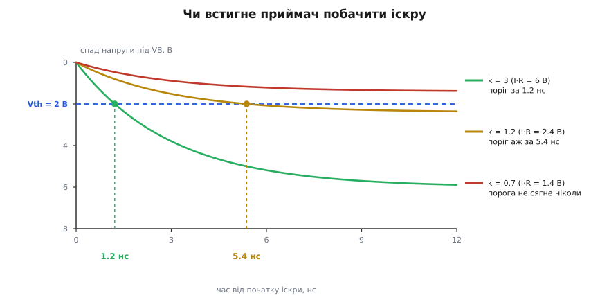
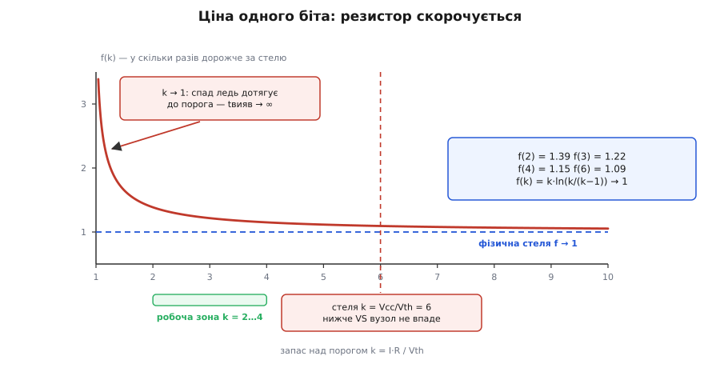
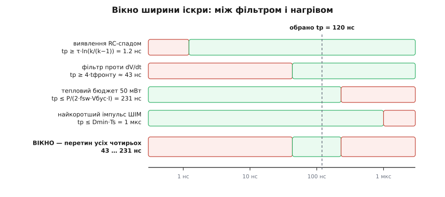

# 🧮 Скільки коштує біт, що видерся на 540 В

Груба оцінка «пів вата рівнем проти двадцяти шести міліват іскрами» показує, що імпульсний зсув виграє. Але вона не каже головного: **чому іскра саме така, як є**. Чому 120 наносекунд, а не 12 і не 1200? Хто заважає зробити її вдесятеро коротшою й заощадити ще порядок? І де та межа, за якою іскра з надійної команди перетворюється на лотерею?

Відповідь виявиться несподіваною. Ширину іскри визначає не швидкість приймача — той упорався б за одиниці наносекунд. Її визначає **завада, від якої приймач боронять**. Щоб це побачити, доведеться порахувати не саму потужність, а обидва рахунки, що їх виставляє одна коротка команда, — і знайти, між якими двома стінами вона мусить пролізти.

## Дві валюти одного вчинку

Перше, що треба розділити, бо їх постійно плутають: одна іскра списує з системи **дві різні величини**, і платять їх **різні джерела**.

**Заряд** Qзс — це скільки кулонів витекло з плаваючого домену вниз. Він списується з bootstrap-конденсатора й проїдає його напругу: ΔV = Q/Cbs. Наслідок — просідання VBS і, у крайньому разі, спрацювання захисту від зниженої напруги.

**Енергія** Eзс — це скільки джоулів перетворилося на тепло просто на кристалі. Наслідок — нагрів корпусу.

Ці дві валюти **не пропорційні одна одній**. Зараз побачимо, що заряд списується симетрично з обох іскор, а тепло — майже все з однієї. Плутати їх — означає або даремно боятися нагріву там, де насправді загрожує просідання, або навпаки.

```
Qзс = I · tp              [Кл]   — заряд однієї іскри
Eзс = V · I · tp          [Дж]   — тепло однієї іскри
```

Тут I — струм іскри, tp — її ширина, а V — та напруга, яку іскра долає. Уся дальша розмова — про те, що ставити замість V і як обирати tp.

## Хто насправді платить

Простежмо коло, яким тече струм іскри, коли верхній ключ відкритий і вузол SW сидить на шині. Струм виходить із вузла VB, спускається підтяжкою R, проходить каналом ключа зсуву й повертається в COM — на землю логіки. Але звідки заряд узявся у VB? З верхньої обкладки bootstrap-конденсатора. А на його нижню обкладку, прив'язану до VS, заряд натікає з **силової шини** — крізь відкритий верхній ключ.

Отже, коло замикається так: шина → верхній ключ → VS → Cbs → VB → R → ключ зсуву → COM → назад до шини. Обійдімо його за напругою:

```
Vбус + Vcc = I·R + Vкз
```

де Vcc = VB − VS — плаваюче живлення (12 В), а Vкз — падіння на ключі зсуву. І одразу видно, хто скільки вніс:

```
конденсатор дав   Vcc · I · tp  =  12 · 2 мА · 120 нс  =   2.9 нДж
шина дала        Vбус · I · tp  = 540 · 2 мА · 120 нс  = 129.6 нДж
```

Ось вона, асиметрія. **Конденсатор віддає весь заряд, але майже жодної енергії** — лише 2 % тепла. Решту 98 % оплачує силова шина крізь верхній ключ. Тому нагрів кристала — це рахунок від шини, а просідання VBS — рахунок конденсатору, і зменшення одного не полегшує другого.

Тепер розділімо саме тепло між двома тілами, що його поглинають, — підтяжкою й ключем. Візьмімо мить, поки ключ зсуву проводить:

```
на підтяжці   I² · R                 = (2 мА)² · 3 кОм  = 0.012 Вт    (1.1 %)
на ключі      (Vбус + Vcc − I·R) · I = 546 В · 2 мА     = 1.092 Вт   (98.9 %)
──────────────────────────────────────────────────────────────────────────────
разом         (Vбус + Vcc) · I       = 552 В · 2 мА     = 1.104 Вт
```

Ключ зсуву забирає **98.9 %** усього тепла. І це не вада, а замисел: підтяжка мусить дати корисний сигнал I·R = 6 В, а ключ мусить витримати решту — 546 В. Зсув рівня — це навмисне до краю перекошений подільник, у якому сигнал забирає один відсоток напруги, а прилад — дев'яносто дев'ять. Тому гріється завжди ключ, і саме його доля вирішує все.

> 🔧 **Навіщо це.** Коли в паспорті бачите і Qзс (нанокулони), і струм спокою (мікроампери), не зводьте їх до одного числа: перше проїдає bootstrap-«відерце», друге гріє корпус, і лікуються вони різним. Просідання VBS рятує більший Cbs; нагрів більший Cbs не рятує **взагалі**, бо тепло платить шина, а не конденсатор.

## Тримати рівнем: рахунок, що росте, коли сповільнюєшся

Тепер порахуймо наївний варіант чесно — з обома валютами.

**Тепло, якщо тримати ключ зсуву відкритим.**

```
P = (Vбус + Vcc) · I · D
  = 552 · 0.002 · 0.5      = 0.552 Вт
```

Пів вата, як і в грубій оцінці. Але зверніть увагу на те, чого в цій формулі **нема**: частоти. Тримати рівнем коштує однаково на 5 кГц і на 500 кГц — бо гріє не подія, а тривалість.

А тепер заряд — і тут ховається справжня катастрофа:

```
Q = I · D · Ts = I · D / fsw
```

Заряд росте, **коли частота падає** — бо ключ відкритий довше. Порахуймо для трьох режимів при Cbs = 100 нФ:

```
100 кГц, D = 0.5:  Q =  10 нК  →  ΔV = 0.10 В
 20 кГц, D = 0.5:  Q =  50 нК  →  ΔV = 0.50 В
  5 кГц, D = 0.9:  Q = 360 нК  →  ΔV = 3.60 В
```

Для порівняння: [заряд затвора](root:hw-components/gate-charge-curve-phases) силового ключа — скільки кулонів треба влити в затвор, щоб той відкрився, — у типовому прикладі 40 нК. Тобто вже на 20 кГц «просто потримати біт» коштує **більше заряду, ніж відкрити сам силовий ключ**. А на 5 кГц із довгим імпульсом воно з'їдає 3.6 В з дванадцяти — і захист від зниженої напруги вимикає драйвер. Не через нагрів. Просто тому, що відерце вичерпалося.

Ось чому рівень неприйнятний навіть там, де пів вата стерпіли б: тихохідний привід — саме той випадок, де тримати найдовше, а перезаряджати найрідше.

## Бити іскрою: рахунок, що росте, коли пришвидшуєшся

Іскра перевертає обидві залежності.

```
P = (Vбус + Vcc) · I · tp · 2 · fsw
Q = 2 · I · tp                        = 0.48 нК
```

Заряд тепер **не залежить від частоти зовсім** — дві іскри на такт, і крапка. Проти 360 нК у тихохідному режимі це у 750 разів менше; ΔV = 0.005 В замість 3.6 В. Саме це, а не економія тепла, дозволяє одному драйверу обслуговувати і 5-кілогерцовий привід, і 500-кілогерцове живлення з тим самим конденсатором.

А тепло тепер, навпаки, росте з частотою. Порівняймо два способи одним відношенням:

```
P_іскри / P_рівня = 2 · fsw · tp / D
                  = 2 · 100e3 · 120e-9 / 0.5   = 0.048   = 1/21
```

Гарна форма: це **шпаруватість самої іскри проти шпаруватості команди**. І звідси одразу видно, де виграш скінчиться:

```
fsw = D / (2·tp) = 0.5 / 240 нс = 2.08 МГц
```

На двох мегагерцах іскри зіллються в суцільний рівень, і хитрість утратить сенс. Запас у двадцять разів на ста кілогерцах — це просто те, наскільки ми далеко від цієї межі.

**Чому множник 2 — це найгірший випадок, а не типовий.** Погляньмо, коли саме б'є кожна іскра. SET іде **перед** тим, як верхній ключ відкриється, — тобто поки SW ще внизу, а VB ≈ 12 В. Ключ зсуву SET долає якихось дванадцять вольт: іскра майже безплатна. RESET іде, поки верхній ключ **ще відкритий**, — SW угорі, VB = 552 В, і ця іскра оплачує все. Отже, при жорсткому перемиканні чесна сума ближча до **однієї** дорогої іскри на такт, а не двох, і реальний нагрів удвічі менший за оцінку.

Але множник 2 не дарма стоїть у розрахунку. Якщо навантаження встигає підтягнути SW угору **до** приходу SET (м'яке перемикання, вільний хід крізь діод), то SET застає домен уже піднятим — і платить повну ціну. Дві дорогі іскри на такт — випадок рідший, але цілком реальний, тож у бюджет беруть саме його.

## Підлога перша: чи встигне приймач

Тепер до головного питання — ширини. Чому не коротшати далі?

Перша межа фізично прозора. Вузол стоку в плаваючому домені має паразитну ємність Cp, і підтяжка R не може продавити його вниз миттєво — виходить звичайний RC-спад:

```
Δv(t) = I·R · (1 − e^(−t/τ)),   τ = R · Cp = 3 кОм · 1 пФ = 3 нс
```

Приймач спрацьовує, коли спад сягне порога Vth. Прирівняймо й розв'яжімо відносно часу:

```
Vth = I·R · (1 − e^(−t/τ))
1 − Vth/(I·R) = e^(−t/τ)
t_вияв = τ · ln( I·R / (I·R − Vth) )
```

Уся суть цієї формули стискається в одне число — **запас спаду над порогом**:

```
k = I·R / Vth                    (у нас: 6 В / 2 В = 3)
t_вияв = τ · ln( k / (k − 1) )   = 3 нс · ln(1.5) = 1.22 нс
```

І ось де ховається межа надійності. Логарифм ln(k/(k−1)) при k → 1 **вибухає в нескінченність**. Це не математичний курйоз, а точний опис фізики: якщо спад ледь-ледь перевищує поріг, крива підповзає до нього по асимптоті, і мить перетину стає як завгодно пізньою — а головне, шалено чутливою до розкиду R, I, Cp й самого порога. А якщо k < 1, тобто I·R менший за поріг, спад **не сягне його ніколи**: команди не буде взагалі, скільки не тримай.


*Одна й та сама τ = 3 нс, різний лише запас k = I·R/Vth. Здоровий запас (k = 3) перетинає поріг за 1.2 нс. Межовий (k = 1.2) — аж за 5.4 нс, учетверо пізніше, і кожен відсоток розкиду зсуває цю мить. Мертвий (k = 0.7) не перетне ніколи: спад упирається у стелю нижче за поріг.*

Згори запас теж обмежений, і теж жорстко. Вузол не може впасти нижче за VS — нижньої опори плаваючого домену. Отже I·R не має перевищувати Vcc, а значить:

```
k ≤ Vcc / Vth = 12 / 2 = 6
```

Робочий діапазон затиснуто між k ≈ 2 (нижче — розкид з'їдає надійність) і k ≈ 6 (вище — фізично нікуди падати).

## Резистор скорочується

Тут напрошується природна думка: підтяжку ж можна змінити. Візьмемо R меншим — τ скоротиться, іскра стане коротшою, і ми заощадимо. Порахуймо, скільки коштує **одна помічена іскра** — тобто найкоротша, яку приймач іще встигає прочитати:

```
E = Vбус · I · t_вияв
```

Підставмо I = k·Vth/R і t_вияв = R·Cp·ln(k/(k−1)):

```
E = Vбус · (k·Vth/R) · R·Cp·ln(k/(k−1))
```

І **R скорочується**. Начисто.

```
E = Vбус · Cp · Vth · f(k),    де  f(k) = k · ln( k/(k−1) )
```

Це найважливіший результат усього викладення, тож перевірмо його не вірою, а числом — трьома зовсім різними підтяжками з тим самим запасом k = 3:

```
R =   750 Ом,  I = 8.0 мА  →  τ = 0.75 нс,  t_вияв = 0.30 нс,  E = 1.314 нДж
R =  3000 Ом,  I = 2.0 мА  →  τ = 3.00 нс,  t_вияв = 1.22 нс,  E = 1.314 нДж
R = 12000 Ом,  I = 0.5 мА  →  τ = 12.0 нс,  t_вияв = 4.87 нс,  E = 1.314 нДж
```

Однаково. До третього знаку. Резистор — це важіль, що обмінює струм на швидкість (менший R — більший струм, коротша іскра), але **добуток не зрушується ні на йоту**: заощаджений час рівно компенсується подорожчалим струмом.

Що ж лишається, коли резистор пішов? Лише f(k) — і та впирається в стелю:

```
f(1.2) = 2.15      f(3) = 1.216
f(1.5) = 1.648     f(4) = 1.151
f(2)   = 1.386     f(6) = 1.094      f(k) → 1 при k → ∞
```

Функція монотонно спадає **до одиниці**. Отже:

```
E ≥ Vбус · Cp · Vth = 540 · 1 пФ · 2 В = 1.08 нДж
```

Ось вона — фізична ціна одного біта, що видерся на 540 В. Її сенс прозорий: щоб приймач помітив команду, треба **розгойдати паразитну ємність Cp на висоту порога Vth, і зробити це проти шини Vбус**. Три множники, жодного вільного параметра. І запас k майже нічого не змінює: при k = 2 платимо 39 % понад стелю, при k = 3 — 22 %, при k = 6 — 9 %. Уся свобода конструктора в цьому місці варта третини.


*Ціна однієї поміченої іскри в одиницях фізичної стелі Vбус·Cp·Vth. Ліворуч, при k → 1, ціна злітає — це та сама розбіжність t_вияв. Праворуч крива майже лягає на стелю, але туди не дійти: запас упирається в k = Vcc/Vth = 6, бо нижче за VS вузол не впаде. Уся робоча зона — k = 2…4, і в ній ціна коливається лише між 1.39 і 1.15 від стелі.*

> 🔧 **Навіщо це.** З формули E = Vбус·Cp·Vth видно, за що насправді йде боротьба всередині таких мікросхем, і чого туди **не** купиш іззовні. Vбус диктує застосунок, Vth — процес, лишається **Cp** — паразитна ємність високовольтного вузла. Тому поступ у цьому класі йде не через хитрішу схемотехніку підтяжок, а через компактніший високовольтний прилад. Схоже, звідси ж і те, чому зсув на 1200 В **енергетично** дорожчий не вдвічі, а вчетверо: у добутку Vбус·Cp подвоюється обидва множники — і шина, і ємність міцнішого приладу.

## Підлога друга, справжня: пересидіти фронт

Отже, приймач готовий прочитати іскру за 1.22 нс. Чому ж її роблять у сто разів ширшою?

Згадаймо злодія. Стрибок домену вганяє в підтяжки струм i = Cp·dV/dt = 1 пФ · 50 В/нс = **50 мА** — у двадцять п'ять разів більший за чесні 2 мА. Диференційний приймач відкидає його як синфазний, але не ідеально, тож поверх ставлять фільтр: усе, що коротше за певний час, вважається сміттям. А скільки триває саме сміття?

```
t_фронту = Vбус / (dV/dt) = 540 / 50 = 10.8 нс
```

Фільтр мусить із запасом пересидіти ці 10.8 нс — скажімо, глухнути на ~2·t_фронту ≈ 22 нс. Але тоді **чесна іскра мусить із запасом пережити фільтр** — інакше драйвер відкине власну команду. Ще вдвічі:

```
tp ≥ 2 · 2 · t_фронту = 4 · 540/50 ≈ 43 нс
```

Ось вона, справжня підлога — і вона в **тридцять п'ять разів** вища за ту, яку ставить фізика виявлення. Іскра завширшки 120 нс не тому така, що приймач повільний. Вона така, бо мусить бути помітно довшою за сміття, яке породжує сам міст, комутуючи сотні вольт.

Перерахуймо на цю мірку енергію. Найкоротша іскра, яку наш приймач іще прочитав би, коштує 1.31 нДж (абсолютна фізична стеля — 1.08 нДж). Реальна, завширшки 120 нс, — 129.6 нДж. **Стократ** переплати, і всі сто — не за передачу біта, а за те, щоб його не сплутали з відлунням власного перемикання. Уся вартість зсуву рівня — це, по суті, вартість завадостійкості.

Тут варто розчепити дві речі, які легко змішати. Швидший фронт робить сміття **коротшим** (фільтр можна вкоротити), але водночас **вищим** (i = Cp·dV/dt росте). Тривалість бере на себе фільтр, амплітуду — диференційність. Тому крутіші фронти не полегшують життя: вони переносять тиск з однієї стінки на другу.

Обидві межі узгоджуються з тим, що радить класичний довідник International Rectifier по цьому класу: перевіряти, що dV/dt на VS відносно COM **не перевищує 50 В/нс**, і що вхідні логічні сигнали **довші за 50 нс**. Друге число — зовнішній прояв тієї самої внутрішньої підлоги: нижче драйвер просто не ручається, що встигне пропхати команду крізь власний фільтр.

## Стеля

Згори тиснуть теж двоє.

**Тепловий бюджет.** Погодьмося спалити на зсуві не більше 50 мВт:

```
tp ≤ P / (2 · fsw · Vбус · I) = 0.05 / (2 · 100e3 · 540 · 0.002) = 231 нс
```

**Найкоротший імпульс ШІМ.** Іскра SET мусить скінчитися раніше, ніж прийде RESET. При найменшій шпаруватості Dmin = 10 %:

```
tp ≤ Dmin · Ts = 0.10 / 100e3 = 1000 нс
```

Теплова стеля вчетверо жорсткіша — саме вона й вирішує.

## Вікно

Складімо всі чотири умови докупи.


*Кожна смуга — одна умова: зелене дозволено, червоне ні. Перетин усіх чотирьох і є вікно ширини іскри. Дві перші межі тиснуть знизу, дві наступні — згори, і живого місця лишається менш ніж декада.*

```
підлога: виявлення   1.2 нс   ─┐
підлога: фільтр       43 нс   ─┴→  беремо більшу:  43 нс
стеля:   тепло       231 нс   ─┐
стеля:   ШІМ        1000 нс   ─┴→  беремо меншу:  231 нс

вікно tp = 43 … 231 нс
```

Вікно є, але воно вузьке — усього в 5.4 раза. Куди в ньому ставати? Обидві стінки — це не порогові події, а місця, де надійність гладко псується, і обидві рухаються з розкидом **у рази**, а не на відсотки. Тому запас має сенс рахувати не в наносекундах, а в **разах** — і рівний відносний запас у обидва боки дає середнє геометричне:

```
tp = √(43 · 231) = 100 нс
```

Обрані в схемі 120 нс лежать практично там: у 2.8 раза над фільтром і у 1.9 раза під тепловою стелею. Не «кругле число», а центр вікна.

Ось той самий розрахунок як робочий інструмент — підставте свої числа й подивіться, чи лишається вікно:

```python
import math

# Прилад і схема
Vbus = 540.0      # В    силова шина
Vcc = 12.0        # В    плаваюче живлення VB − VS
Vth = 2.0         # В    поріг приймача, відлічений униз від VB
Cp = 1e-12        # Ф    паразитна ємність вузла SET/RESET
R = 3e3           # Ом   підтяжка
I = 2e-3          # А    струм іскри
dVdt = 50e9       # В/с  найкрутіший фронт вузла SW
fsw = 100e3       # Гц   частота перемикання
Dmin = 0.10       # —    найкоротша шпаруватість ШІМ
Pbudget = 50e-3   # Вт   скільки згодні спалити на зсуві рівня

k = I * R / Vth                              # запас спаду над порогом
tau = R * Cp

t_front = Vbus / dVdt                        # скільки триває стрибок домену
t_filter = 2 * t_front                       # фільтр мусить пересидіти стрибок
lo_detect = tau * math.log(k / (k - 1))      # встигнути перетнути поріг
lo_blank = 2 * t_filter                      # іскра мусить пережити фільтр
hi_power = Pbudget / (2 * fsw * Vbus * I)    # не спалити тепловий бюджет
hi_pwm = Dmin / fsw                          # влізти в найкоротший імпульс ШІМ

lo, hi = max(lo_detect, lo_blank), min(hi_power, hi_pwm)

print("запас k         = %.1f   (стеля k = Vcc/Vth = %.1f)" % (k, Vcc / Vth))
print("підлога: вияв   = %6.2f нс" % (lo_detect * 1e9))
print("підлога: фільтр = %6.2f нс" % (lo_blank * 1e9))
print("стеля:   тепло  = %6.1f нс" % (hi_power * 1e9))
print("стеля:   ШІМ    = %6.1f нс" % (hi_pwm * 1e9))
if lo < hi:
    print("вікно tp        = %.0f … %.0f нс  →  брати %.0f нс"
          % (lo * 1e9, hi * 1e9, math.sqrt(lo * hi) * 1e9))
else:
    print("вікна НЕМА: приладу з такими числами не існує")
```

```
запас k         = 3.0   (стеля k = Vcc/Vth = 6.0)
підлога: вияв   =   1.22 нс
підлога: фільтр =  43.20 нс
стеля:   тепло  =  231.5 нс
стеля:   ШІМ    = 1000.0 нс
вікно tp        = 43 … 231 нс  →  брати 100 нс
```

А тепер найцікавіше. Підлога від частоти не залежить, а теплова стеля падає як 1/fsw — отже, стінки сходяться. Прирівняймо їх:

```
4·Vбус/(dV/dt) = P / (2·fsw·Vбус·I)

fsw(межа) = P · (dV/dt) / (8 · Vбус² · I)
          = 0.05 · 50e9 / (8 · 540² · 0.002)   = 536 кГц
```

На 536 кілогерцах вікно **зачиняється повністю**: найвужча припустима іскра вже гріє понад бюджет. Не «стає гірше» — перестає існувати законна ширина. І зверніть увагу на Vбус у квадраті: подвоєння шини звужує вікно вчетверо. Саме тому монолітний зсув почувається вдома на десятках-сотнях кілогерц при кількох сотнях вольт і задихається, щойно підняти обидва числа.

## Що з цього читається в паспорті

Звірмо модель з реальністю. Наш заряд на такт — 2·I·tp = 0.48 нК. Що кажуть довідники?

- Класичний довідник International Rectifier по цьому класу: **Qзс ≈ 5 нК** для приладів на 500/600 В і **20 нК** для 1200 В.
- Свіжий приклад розрахунку bootstrap-кола в Infineon: **QLS = 1.2 нК** — поряд із Qg = 40 нК, IQBS = 150 мкА, ILK = 50 мкА.

Порядок наша модель ловить: 0.48 нК проти 1.2–5 нК. Різниця очікувана й повчальна — паспортне Qзс **більше за голий I·tp**, бо це гуртове найгірше число: у нього входить і перезаряд паразитних ємностей після кожного стрибка домену, і власне споживання приймача, фільтра та засувки, і розкид по температурі й партії. Модель пояснює **механізм і масштаб**; у бюджет ставлять паспортне.

А ось співвідношення 5 нК на 600 В проти 20 нК на 1200 В — учетверо на подвоєння напруги — вимагає обережності, бо тут легко змахлювати. Виведена вище стеля Vбус·Cp·Vth — про **енергію**, і на заряд її переносити не можна: у Q = 2·I·tp шини взагалі нема. Що модель таки каже: заряд росте з двох незалежних боків — ширшає іскра (підлога від фільтра ∝ Vбус, отже вдвічі) і росте струм (у міцнішого приладу більша Cp, а щоб продавлювати її так само жваво, треба більше струму). Два множники, кожен правдоподібно близький до двійки, разом дають четвірку. Але це **правдоподібне прочитання, не доведення**: розкладу Qзс по складниках довідник не дає, а вага кожного множника залежить від того, як обрано підтяжку.

Хай там як, у бюджеті [bootstrap-конденсатора](root:hw-power/bootstrap-capacitor) — того «відерця», що єдине живить верхній драйвер, поки він угорі, і мусить дотерпіти до наступного перезаряду — заряд зсуву стоїть окремим доданком поряд із зарядом затвора, струмом спокою та витоками:

```
Qсум = Qg + Qзс + (Iспок + Iвит) · tвідкр
ΔVBS = Qсум / Cbs
```

При Qg = 40 нК заряд зсуву — це від 1 % (наша модель) до 12 % (паспортні 5 нК) бюджету: доданок дрібний, але не той, що викидають. І весь його дріб'язковий розмір — заслуга іскри: тримали б рівнем, на місці 0.48 нК стояло б 360 нК, і жоден розумний Cbs цього не витягнув би.

> 🔧 **Навіщо це.** Три паспортні числа монолітного драйвера — межа dV/dt, найменша ширина вхідного імпульсу й заряд зсуву Qзс — це не три різні характеристики, а **три проєкції однієї фізики**, яку ми щойно вивели. Перше каже, наскільки товстий фільтр усередині; друге — наскільки широкою через це мусить бути іскра; третє — скільки заряду ця ширина коштує відерцю. Тому й перевіряти їх треба разом: сповільнили фронти заради першого — полегшили друге; підняли частоту заради щільності — з'їли запас до теплової стелі.

## Де модель бреше

Чесно про межі викладеного. Ключ зсуву тут — ідеальне джерело струму I, вузол — лінійна RC-ланка, приймач — миттєвий компаратор із порогом Vth. У кремнії все м'якше: ємність стоку високовольтного приладу нелінійна й помітно росте при малій напрузі на ньому; ключ має скінченний вихідний опір, тож на початку іскри струм не одразу I; приймач — не компаратор, а фільтр із гістерезисом, і його «поріг» — радше смуга; Vth, R і Cp пливуть із температурою й партією на десятки відсотків.

Тому числа вище — це **закони подібності, а не заміна паспорта**. Що з них справді варте довіри — не «231 нс», а форма залежностей: що резистор скорочується; що ціна біта впирається в Vбус·Cp·Vth; що підлогу ставить фільтр, а не приймач; що стінки сходяться як 1/fsw і як 1/Vбус². Саме ці залежності підказують, куди дивитися, коли міст поводиться дивно, — а точні числа завжди беруть із паспорта конкретного приладу.
