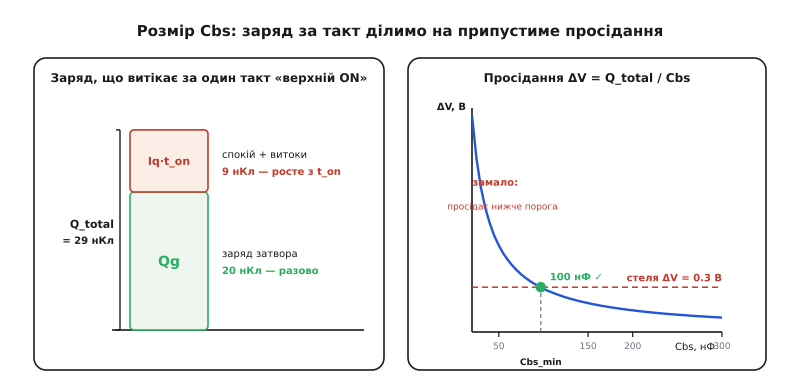

# 🧮 Скільки фарад у «відерці»: розмір бутстрепного конденсатора

> Бутстрепний конденсатор Cbs — це «відерце» заряду, з якого живиться верхня частина драйвера, поки верхній ключ відкритий. А поки він відкритий, діод Dbs замкнений, і доливати «відерце» нема звідки — отже, усе, що з нього вип'ється за цей час, мусило вже там бути. Порахуймо, скільки саме заряду треба, щоб напруга не стекла нижче порога за один такт, і чому для типового ключа виходить близько 100 нФ.

### Чому «відерце» мілішає — і чому це питання розміру

Сама стаття вже називає головну ваду бутстрепа: поки верхній ключ відкритий, напруга на Cbs **поволі стікає**. Тут перетворимо це на число. Ключ до всього — один факт зі схеми: щойно верхній ключ відкрився, точка SW злітає до шини, діод Dbs опиняється під зворотною напругою й **замикається**. А це означає, що на весь час відкритого стану Cbs **відрізаний** від живлення Vdrv і лишається єдиним джерелом заряду для всього, що висить на плаваючій (верхній) частині драйвера. Скільки заряду з нього витече за цей час — рівно на стільки впаде його напруга. «Відерце» з краником, але без доливу.

А далі — проста, майже шкільна механіка. Заряд і напруга на конденсаторі пов'язані як `Q = C·V`, тож якщо пішов заряд ΔQ, напруга просіла на `ΔV = ΔQ / C`. Хочемо мале просідання ΔV — мусимо або зменшити ΔQ (а він заданий схемою), або **збільшити C**. Уся задача зводиться до одного: порахувати ΔQ за один такт і вибрати C так, щоб ΔV лишилося в межах дозволеного.

### Хто п'є з конденсатора

Складімо весь заряд, що витікає з Cbs за один такт «верхній відкритий». Складників три, і вони різної природи.

**Перший — заряд затвора Qg.** Щоб відчинити верхній ключ, драйвер мусить улити в його затвор повний [заряд затвора](root:hw-components/gate-capacitance/math-gate-charge.md) Qg — і бере він його саме з Cbs. Це **разова** порція на кожне ввімкнення: скільки разів за такт відчиняємо ключ, стільки Qg і вилили. У звичайному ШІМ — один раз за період. Зазвичай це найбільший шматок бюджету.

**Другий — струм спокою драйвера** *(quiescent, від лат. quiescere — «спочивати»: струм, що тече навіть «у спокої», коли нічого не перемикається)*. Плаваюча частина драйвера — її логіка, схема зсуву рівня, компаратори — споживає невеликий струм Iq весь час, поки живиться від Cbs. Це вже не разова порція, а **цівка**: заряд `Iq · t_on`, тим більший, чим довше ключ тримають відкритим.

**Третій — струми витоку.** Зворотний струм діода Dbs (він не ідеальний вентиль), власний витік конденсатора, витік затвора ключа, струм схеми зсуву рівня — усе це теж потроху сточує заряд, знову ж пропорційно часу: `I_leak · t_on`. Поодинці дрібниця, але вони **ростуть із температурою** (зворотний струм діода — особливо різко), тож на гарячій платі цей складник підкрадається.

Складаємо все докупи:

```
Q_total = Qg + (Iq + I_leak) · t_on
          └┬┘   └──────┬──────┘
        разово     цівка × час відкритого ключа
```

Тут і видно механізм «стікання» в числах: разова частина Qg злітає миттєво на старті, а далі заряд тане лінійно з часом — що довший t_on, то глибше просідання. Саме тому бутстреп не любить високої шпаруватості: довгий t_on роздуває другий і третій складники.

### Наскільки взагалі можна просісти

Тепер — межі. Cbs заряджається у фазі доливу до `Vdrv − Vf`, де Vf — падіння на діоді Dbs (для звичайного діода ≈ 0.7 В, для діода Шотткі менше). При Vdrv = 12 В старт виходить ≈ 11.3 В. Це **стеля**; від неї напруга тільки падає.

А де **підлога**? Її задають дві умови, і брати треба **вищу** з них:

- **Повне відмикання ключа.** Щоб Rds(on) лишався малим, на затворі потрібна напруга «з запасом» — паспортний Rds(on) міряють зазвичай при Vgs = 10 В. Просядемо нижче — канал почне «прикриватися», опір полізе вгору, ключ грітиметься. Тож підлога — там, де Vgs ще **впевнено** тримає ключ відкритим.
- **Поріг живлення драйвера** (UVLO *— undervoltage lockout, англ. «блокування за зниженої напруги»*). Драйвер сам себе вимикає, якщо його живлення VB−VS впаде нижче внутрішнього порога (часто 8…9 В) — захист, щоб не керувати ключем напівсилою.

Різниця між стелею й підлогою і є **припустиме просідання ΔV**. Якщо хочемо тримати Rds(on) як укопаний, ΔV беремо геть малим — десяті частки вольта (типово 0.1…0.5 В). Якщо згодні просісти аж до порога UVLO, запас більший, але тоді ключ частину такту працює з підвищеним опором. Менше ΔV — надійніше, але, як побачимо, дорожче в ємності.

### Формула розміру

Тепер усе складається в один рядок. Просідання — це злитий заряд, поділений на ємність; вимагаємо, щоб воно не перевищило припустиме:

```
ΔV = Q_total / Cbs  ≤  ΔV_доп
```

Розв'язуємо відносно Cbs:

```
Cbs ≥ Q_total / ΔV_доп
```

Ось і вся серцевина. Більший Q_total (жадібніший затвор, довший t_on, гарячіша плата) тягне Cbs угору; жорсткіша вимога до просідання (мале ΔV) — теж. Формула чесна й симетрична до механізму «стікання»: вона рахує рівно те, як швидко тане «відерце», і вимагає взяти його таким, щоб не дотекти до підлоги за один такт.

### Порахуймо на числах

**Півміст на 20 кГц, висока шпаруватість 90 %; верхній ключ із Qg = 20 нКл; драйвер живиться від Vdrv = 12 В.**

```
дано:
  Qg            = 20 нКл           заряд затвора верхнього ключа
  Iq + I_leak   = 0.20 мА          спокій плаваючої частини + витоки
  f             = 20 кГц  → T = 50 мкс
  шпаруватість  = 90 %    → t_on = 0.90 × 50 мкс = 45 мкс
  ΔV_доп        = 0.3 В            тримаємо Rds(on) майже незмінним
```

```
заряд за один такт «верхній ON»:
  цівка    = (Iq + I_leak) · t_on = 0.20 мА × 45 мкс = 9 нКл
  Q_total  = Qg + цівка           = 20 + 9           = 29 нКл
```

```
розмір конденсатора:
  Cbs ≥ Q_total / ΔV_доп = 29 нКл / 0.3 В ≈ 97 нФ
  → беремо найближчий стандартний номінал: 100 нФ
```

Сто нанофарад тримають верхню шину в межах 0.3 В просідання впродовж 45 мкс відкритого стану — рівно те, що треба. Зверніть увагу на пропорції: затвор з'їв 20 нКл із 29 — більшу частину бюджету, а цівка за 45 мкс додала ще 9. Підніміть шпаруватість до 99 % — t_on розтягнеться, цівка роздметься, і той самий конденсатор уже може не дотягнути; тоді або беруть більший номінал, або додають зарядову помпу.


*Ліворуч — заряд, що витікає з Cbs за один такт: разовий Qg (20 нКл) плюс цівка спокою й витоків (9 нКл) разом дають Q_total 29 нКл. Праворуч — просідання ΔV = Q_total/Cbs як функція ємності: крива круто падає, замала ємність дає завелике просідання (зона «замало»), а перетин зі стелею 0.3 В і задає мінімальний Cbs ≈ 97 нФ, звідки й беремо стандартні 100 нФ.*

### Правило великого пальця

На практиці точних Iq, витоків і найгіршого t_on часто немає під рукою, а в аварії (зависла логіка, пропущений фронт) ключ може лишитися відкритим куди довше за номінал. Тому **береться із запасом**. Найпоширеніше швидке правило: брати Cbs у **10…20 разів** більшим за те, що диктує сам заряд затвора. Тобто хай Qg з'їдає лише десяту-двадцяту частку бюджету просідання, а решта лишається на витоки, спеку й затяжний t_on.

Цікаво, що дві різні дороги сходяться в тому самому місці. Полічімо по-другому, відпустивши просідання аж до порога UVLO (нехай старт 11.3 В, поріг ≈ 8.7 В, тобто запас 2.6 В):

```
гола вимога від затвора:  Qg / ΔV = 20 нКл / 2.6 В ≈ 7.7 нФ
із запасом ×10…20:        77 … 154 нФ  →  знову близько 100 нФ
```

Перший шлях (мале ΔV, щоб тримати Rds(on)) дав ~97 нФ; другий (правило великого пальця, від порога UVLO) — ~80…150 нФ. Обидва кладуть стрілку на ту саму сотню нанофарад — тому 100 нФ і є типовий стартовий вибір для верхнього ключа середнього розміру. Де t_on довгі чи шпаруватість близька до 100 %, піднімають до 1 мкФ (часто ставлять 100 нФ паралельно з більшим резервуаром: маленький встигає віддати імпульс у затвор, великий тримає середню напругу).

### Завелике — теж пастка

Може здатися: візьми Cbs побільше — і спи спокійно. Не зовсім. «Відерце» треба ще й **встигати наповнювати**, а наповнюється воно лише в короткій фазі, коли нижній ключ відкритий і SW унизу. Долив іде через діод Dbs і вихідний опір живлення з якоюсь сумарною послідовною R; це звичайна [RC-зарядка зі сталою часу](root:hw-analog/rc-time-constant) τ = R·Cbs. Щоб «відерце» долилося повністю, потрібно приблизно `t_off ≥ 3…5·τ`.

```
R ≈ 10 Ом,  Cbs = 100 нФ  →  τ = 1 мкс
t_off = 10 % × 50 мкс = 5 мкс  →  t_off ≈ 5·τ   ✓ ледве встигає
а Cbs = 1 мкФ             →  τ = 10 мкс > t_off = 5 мкс   ✗ не долити
```

Ось і верхня межа: завеликий Cbs **не встигає** перезарядитися за коротку паузу, і напруга бутстрепа сповзає від такту до такту — той самий «стік», тільки вже з іншої причини. Тому розмір — це **вилка**: достатньо великий, щоб не просісти за відкритий t_on, але достатньо малий, щоб долитися за закритий t_off. Між ними й живе правильний номінал.

> 🔧 **Навіщо це.** Коли на реальній платі верхній ключ «здихає» на високій шпаруватості або гарячим — найперший підозрюваний саме Cbs: його не вистачає, і напруга стікає нижче порога ще до перезаряду. Полічіть Q_total за робочого t_on, поділіть на той запас напруги, що маєте від стелі до UVLO, — і порівняйте з тим, що стоїть на платі. Якщо тісно, є три ходи: більший Cbs, діод із меншим витоком (краще Шотткі) або драйвер із вбудованою зарядовою помпою, що дотягує заряд при близькій до 100 % шпаруватості. І не женіться за «якомога більшим»: завелике «відерце» не встигне наповнитися в коротку паузу — і ви дістанете те саме просідання з протилежного боку.
