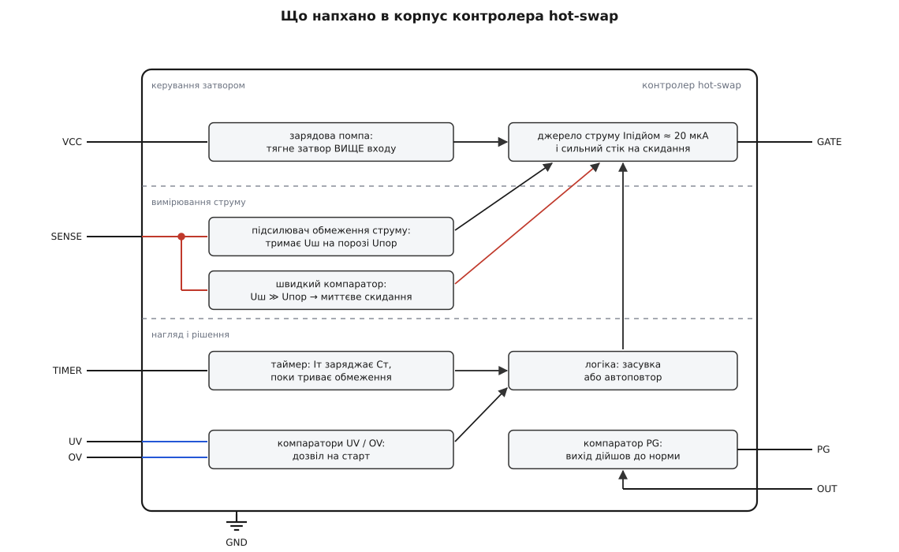
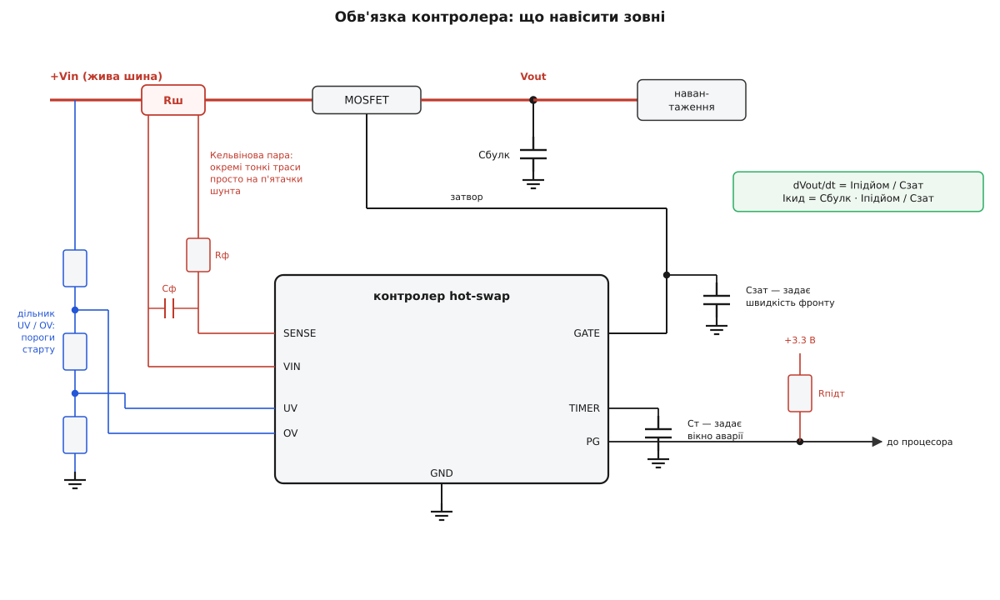
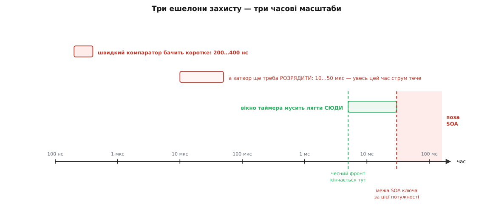

# 🔌 Контролер hot-swap: анатомія класу

Уся робота цієї мікросхеми вміщується в десять мілісекунд на початку життя плати — і в кілька мікросекунд аварії, які, може, ніколи не настануть. Решту часу, роками, вона просто сидить і дивиться на спад напруги на шматочку металу. Але платять їй саме за ті дві миті, і платять справедливо: у першу вона рятує сусідів по шині, у другу — саму плату.

Клас упізнається з першого погляду на схему. Підписи `VIN`, `SENSE`, `GATE`, `OUT`, `TIMER`, `UV`, `OV`, `PG` повторюються від виробника до виробника майже слово в слово — це радше галузева абетка, ніж чиясь фірмова вигадка. Тому клас і варто знати цілком: побачивши коло силового ключа восьминіжку з `SENSE` і `GATE`, ви вже прочитали половину схеми, ще не знаючи, чий саме чип там стоїть.

### Що це за клас

Почнімо з незручної правди: [силовий MOSFET](topic:hw-components/mosfet-power-switch) — це шматок кремнію без жодного розуму. Він робить рівно те, що йому кажуть напругою на затворі, і робить це однаково охоче, хоч ви його рятуєте, хоч убиваєте. Щоб він підняв живлення плати плавно, хтось мусить тримати його затвор у точно потрібній точці кожну мікросекунду тих десяти мілісекунд — не відкритим, не закритим, а **ледь прочиненим**, і дедалі ширше за розкладом. Оцим «кимось» і є контролер.

Звідси головна думка про клас, з якої випливає геть усе інше. **Контролер не вмикає ключ — він керує затвором як важелем.** Вихід у нього по суті один — `GATE`. А входів, що на цей важіль тиснуть, кілька, і всі вони, крім одного-єдиного, тягнуть затвор **униз**: підсилювач обмеження струму, швидкий компаратор, таймер, логіка блокування. Угору затвор тягне лише зарядова помпа — тихенько, слабеньким струмом у десятки мікроампер.

Ця асиметрія навмисна й вона є суттю класу. Слабке підіймання означає повільне відкривання, повільне відкривання означає малий кидок струму — тобто **саме та кволість помпи, яка виглядає як недолік, і є головним захистом**. А от опускати затвор треба швидко, бо опускають його тоді, коли вже щось горить. Один важіль, багато рук, і всі руки, крім однієї, тиснуть у бік «закрити».

> 🔧 **Навіщо це.** Тримайте в голові цю картину, коли читатимете будь-який паспорт цього класу. Кожен рядок характеристик — це відповідь на питання «хто, коли й як сильно смикає затвор». Струм підіймання — як швидко ключ відкривається. Струм стоку — як швидко закривається. Пороги компараторів — за яких умов рука лягає на важіль. Більше в тому паспорті нічого й немає.

### Що напхано в корпус

Розкриймо восьминіжку. Усередині — не «мікроконтролер із програмою», а суто аналогова машина з трьох поясів, і кожен пояс живе у своєму часовому масштабі.


*Три пояси в одному корпусі. Угорі — керування затвором: зарядова помпа й слабке джерело струму, що піднімає затвор, плюс сильний стік, що його скидає. Посередині — вимірювання струму: той самий спад на шунті читають двоє, повільний підсилювач обмеження й швидкий компаратор. Унизу — нагляд: таймер, логіка засувки чи автоповтору, компаратори дозволу UV/OV і компаратор PG. Усі стрілки, крім помпи, сходяться в одну точку — затвор.*

**Пояс керування затвором.** Тут ховається річ, яка спершу дивує. Ключ стоїть у плюсовій шині, N-канальний, і його **витік — це вихід**, тобто вузол, що під час фронту їде вгору від нуля до вхідної напруги. А затвор мусить бути вище за витік на кілька вольт, інакше ключ не відкритий. Отже, наприкінці фронту затвор мусить опинитися **вище за вхідну напругу** — вище за все, що є на платі. Узяти таку напругу нізвідки, тож її роблять на місці: усередині сидить [зарядова помпа](topic:hw-power/charge-pump), яка накачує затвор над шиною.

Далі — краса цієї схеми. Поки затвор їде вгору, ключ працює **витоковим повторювачем**: вихід слухняно йде за затвором, відстаючи на порогову напругу. Тобто контролер не керує виходом безпосередньо — він керує затвором, а вихід просто повторює. Помпа віддає сталий струм `Iпідйом` (типово одиниці — десятки мікроампер), той струм заряджає ємність на затворі, затвор їде вгору зі сталою швидкістю, і рівно з тією ж швидкістю їде вихід. Ось звідки береться керований фронт: не з якоїсь хитрої математики, а з того, що **стале джерело струму на ємності дає пряму лінію**.

І одразу — тонкість, що видає добрий паспорт. Затвор не можна пускати вгору без стелі: різниця «затвор мінус витік» — це напруга на тонкому підзатворному оксиді, і в реального ключа її стеля десь ±20 В. Тому в цьому класі стоїть обмежувач, і — увага — він міряє не від землі, а **від `OUT`**, тобто від витоку. Стеля їде вгору разом із ключем. Логічно: оксид не знає, де там земля плати, він знає лише різницю між своїми двома обкладками.

**Пояс вимірювання струму.** Спад на шунті читають **двоє**, і це не надмірність, а поділ праці за швидкістю.

*Підсилювач обмеження струму* — повільний і акуратний. Він порівнює спад на шунті з внутрішнім порогом (у цього класу типово близько 50 мВ) і, якщо струм пре за межу, підтискає затвор рівно настільки, щоб спад лишався **на порозі**. Це справжній аналоговий зворотний зв'язок, петля, яка тримає струм на плато. Саме він малює те плоске плато під час фронту.

*Швидкий компаратор* — грубий і миттєвий. Він не регулює нічого; він дивиться, чи не перевищив спад на шунті поріг у рази більший за поріг обмеження, і якщо так — просто скидає затвор. Бо ситуація «струм ушестеро понад межу» означає не «навантаження трохи забагато їсть», а «на виході мідь по міді», і тут ніщо регулювати не треба, тут треба рвати.

**Пояс нагляду.** Тут вирішують, що з усім цим робити далі. *Таймер* — це просто джерело струму, що заряджає зовнішній конденсатор, поки триває обмеження. Поки конденсатор не набрав свого порогу, контролер терпить: мовляв, обмеження — це нормально, ми ж заряджаємо банк. Набрав — терпіння скінчилося. *Логіка* по цьому вирішує: замкнутися засувкою назавжди чи спробувати ще раз. *Компаратори `UV`/`OV`* дивляться, чи взагалі гідна вхідна напруга того, щоб стартувати. *Компаратор `PG`* дивиться на `OUT` і каже світові, що вихід дійшов до норми.

### Типова розпіновка

Вісім виводів — канонічна форма класу:

```
             ┌────────U────────┐
    VIN   1 ─┤●                ├─ 8   GATE   затвор зовнішнього ключа
    SENSE 2 ─┤                 ├─ 7   OUT    витік ключа / бік навантаження
    UV/EN 3 ─┤                 ├─ 6   TIMER  конденсатор вікна аварії
    GND   4 ─┤                 ├─ 5   PG     «плата стартувала» (відкритий стік)
             └─────────────────┘
```

Читаємо по одному:

- **`VIN`** — верхній кінець шунта. Дуже часто цей самий вивід годує й сам чип, тож він одночасно і вимірювальний вхід, і живлення.
- **`SENSE`** — нижній кінець шунта. Уся інформація про струм у цій схемі — це різниця `VIN − SENSE`, кількадесят мілівольт. Більше про струм контролер не знає **нічого**.
- **`GND`** — опора всієї внутрішньої схеми.
- **`GATE`** — той самий важіль.
- **`OUT`** — і ось тут найчастіше плутають. Це **не силовий вивід**: крізь нього не тече струм навантаження, він тонкий. Це вимірювальний вхід, який робить три роботи одразу: від нього відлічує стелю обмежувач затвора, за ним стежить компаратор `PG`, і від нього ж бере опору просідання порогу, якщо воно в приладі є.
- **`TIMER`** — конденсатор на землю. Найдешевша деталь на платі й водночас єдине, що стоїть між вашим ключем і його [безпечною робочою областю](topic:hw-components/soa-power-devices).
- **`UV/EN`** — дозвіл на старт. Через [дільник](topic:hw-analog/voltage-divider) від вхідної шини він каже «напруга доросла, можна»; він же слугує звичайним входом вмикання, якщо просто смикати його логікою. У виводу є гістерезис — інакше на порозі контролер клацав би без кінця.
- **`PG`** — вихід із відкритим стоком, «живлення в нормі». Відкритий стік тут не примха: так кілька плат чи кілька шин збираються монтажним І в одну лінію до процесора.

Тепер найцікавіше — **геометрія**. Погляньте на порядок: `VIN` і `SENSE` стоять поруч, вивід у вивід. Це не для краси. Ці двоє — **Кельвінова пара**, вони мусять піти на плату як дві тонкі траси-близнючки просто до п'ятачків шунта, і виробник розташував їх суміжно, щоб ви цю пару не розганяли по корпусу. Так само поруч стоять `GATE` і `OUT` — вони йдуть до однієї деталі, до ключа. **Розпіновка цього класу вже містить у собі підказку про розводку**: виводи, що стоять поруч, і на платі мусять іти поруч.

Ширші корпуси додають `OV` (стеля вхідної напруги), окреме живлення `VCC` окремо від `VIN`, вивід несправності, вхід скидання засувки. Але вісім опорних лишаються ті самі, і показово, чим жертвують першим: у восьминіжці `OV` зникає, а `UV` бере на себе ще й роль `EN`. Тобто **дозвіл стартувати клас вважає важливішим за захист від перенапруги** — і це, як на мене, чесний порядок пріоритетів.

### Обв'язка: що навісити

Клас лишає зовні мало деталей, але кожна з них — це число, яке ви задаєте власноруч. Тут немає «поставте будь-який»: кожна деталь керує однією фізичною величиною.


*Що навісити навколо. Rш задає поріг струму; від його п'ятачків до VIN і SENSE йде Кельвінова пара тонких трас із RC-фільтром проти голок. Cзат на затворі задає швидкість фронту, Cт на таймері — вікно терпіння. Дільник від вхідної шини задає пороги старту, підтяжка робить із PG сигнал для процесора. Cбулк — той самий банк, заради приборкання якого все й затіяли.*

**Шунт.** Одне число: `Iмежа = Uпор / Rш`. Внутрішній поріг — це стала приладу, тож весь ваш вплив на межу струму — в опорі цієї залізячки. Про фізику й вибір самої деталі є окрема розмова — [шунт-резистор](topic:hw-components/shunt-resistor); тут важливо, що вона мусить пережити повний струм обмеження протягом усього вікна таймера, а не лише робочий струм.

**Кельвінова пара.** `VIN` і `SENSE` — просто на п'ятачки шунта, окремими тонкими трасами, поруч, без перехідних отворів. Це не «бажано», а «інакше не працює», і чому саме — за кілька абзаців, у граблях. Загальна ідея цього прийому — [чотирипровідне підключення](topic:hw-sensing/kelvin-connection).

**RC-фільтр на `SENSE`.** Дрібний резистор у трасі й дрібний конденсатор упоперек пари. Проти чого — теж у граблях; поки що просто знайте, що [ця ланка](topic:hw-analog/pwm-filter-sizing) там мусить бути й що робити її товстою не можна.

**Ключ.** Обирають його **за SOA**, а не за малим `Rds(on)` — у сталому режимі він майже не гріється, уся драма на фронті.

**`Cзат` — конденсатор на затворі, від `GATE` до землі.** Ось головна ручка керування, і вона варта того, щоб розібратися до кінця. Помпа віддає сталий струм, конденсатор його інтегрує, вихід повторює затвор:

```
dVout/dt = Iпідйом / Cзат
Iкид     = Cбулк · dVout/dt = Cбулк · Iпідйом / Cзат
```

Тобто **кидок струму задається відношенням двох ємностей**, помноженим на струм помпи. Гарно: жодних резисторів, жодних підбирань — чиста арифметика.

Дві засторожі, і обидві важливі. Перша: `Cзат` мусить із запасом перекривати власну прохідну ємність ключа (ту, що між затвором і стоком) — інакше нахил фронту задаватимете не ви, а [ємності самого MOSFET](topic:hw-components/gate-capacitance), які нелінійні, гуляють від напруги й нормуються абияк. Разів у двадцять–тридцять більше — і формула вище стає правдою. Друга: конденсатор іде **на землю**, а не на витік. Причина пряма: під час фронту ключ — повторювач, різниця «затвор мінус витік» майже не міняється, тож конденсатор, почеплений між ними, не бачить зміни напруги, майже не бере струму й нахилу вам не задасть. А от при вимиканні розряджати його доведеться — тобто нашкодить він охоче, а допоможе ніяк.

**`Cт` — конденсатор таймера.** Задає, скільки контролер терпітиме обмеження, перш ніж рубати.

**Дільник `UV`/`OV`** — від вхідної шини на землю, з відводами на пороги.

**Підтяжка `PG`** — резистор до логічної шини, бо вивід із відкритим стоком сам угору не піднімається.

Порахуймо все це на одній платі.

**Умова.** Плата 12 В, вхідний банк `Cбулк` = 1000 мкФ, робочий струм навантаження до 6 А. Хочемо кидок не більший за 1.5 А. Струм помпи `Iпідйом` = 20 мкА, внутрішній поріг `Uпор` = 50 мВ.

```
Потрібний нахил виходу:
  dVout/dt = Iкид / Cбулк = 1.5 / (1000·10⁻⁶) = 1500 В/с

Конденсатор затвора під цей нахил:
  Cзат = Iпідйом / (dVout/dt) = 20·10⁻⁶ / 1500 = 13.3·10⁻⁹ Ф ≈ 13 нФ
  беремо зі стандартного ряду 15 нФ (більше = плавніше = безпечніше)

Перевірка з узятими 15 нФ:
  dVout/dt = 20·10⁻⁶ / (15·10⁻⁹)  = 1333 В/с
  Iкид     = 1000·10⁻⁶ · 1333     = 1.33 А        ✔ менше за 1.5 А
  tфронт   = Vin / (dVout/dt) = 12 / 1333 = 9.0 мс

Шунт під межу струму з запасом над робочими 6 А:
  Rш    = Uпор / Iмежа = 0.050 / 10 = 5 мОм       (межа 10 А)

Найгірша точка на ключі — початок фронту:
  Pпік  = Vin · Iмежа = 12 · 10 = 120 Вт          ← ЯКЩО впреться в обмеження

Таймер мусить пережити чесний фронт:
  tт > 9.0 мс з запасом → беремо ≈ 20 мс
```

**Висновок.** Зверніть увагу, що сталося з останніми двома рядками. Чесний фронт бере лише 1.33 А — обмеження в 10 А під час нормального старту навіть не прокидається, і на ключі розсіюється якийсь десяток ват. Але **на випадок аварії ви щойно дозволили 120 Вт протягом 20 мс**, і саме цю точку — не робочий струм, не `Rds(on)` — ключ мусить витримати за паспортом. Ось так три невинні числа в обв'язці перетворюються на вирок транзистору.

### Перше вмикання

Байта тут немає — є перший фронт. І перше правило: **не заводьте контролер одразу на живій шині з реальною платою**. Ціна помилки надто несиметрична: на стенді ви побачите «ага, ось воно», на живій полиці — покладете сусідів.

Порядок, що ловить майже все:

1. **Низька шина, стенд.** Замість 12 В подайте 5 В, замість реальної плати — резистор. Обмеження струму на лабораторному джерелі **зніміть або задеріть високо**: джерело з увімкненим обмеженням саме починає керувати напругою, і ви дивитиметесь не на роботу контролера, а на бійку двох регуляторів.
2. **Тільки живлення, `EN` притиснутий.** Погляньте на струм спокою: одиниці міліампер. І перевірте, що `GATE` лежить **на нулі**, а не десь посередині: затвор посередині — це ключ у лінійному режимі, тобто грілка, і далі йти не можна.
3. **Відпустіть `EN` — і зловіть фронт одноразовим запуском.** Дивитися треба на `OUT`, і побачити ви мусите **пряму лінію** потрібної тривалості. Не експоненту, не сходинку — пряму. Крива замість прямої означає, що нахил задає не ваш `Cзат`, а ємності ключа.
4. **Зміряйте фронт секундоміром осцилографа й запишіть це число.** Воно вам знадобиться двічі: щоб перевірити таймер і щоб згадати його через рік, коли хтось збільшить банк на платі.
5. **Перевірте `PG`.** Він мусить піднятися **після** кінця фронту, а не десь посередині.
6. **Аж тепер зробіть аварію навмисне.** Закоротіть вихід через щось, що переживе дослід, і подивіться, за скільки закриється ключ. Це єдиний спосіб дізнатися, чи ваше вікно таймера справжнє. Аварію, яку ви жодного разу не влаштували самі, за вас влаштує замовник.
7. **І тільки потім — реальна плата й реальна шина.**

> 🔧 **Навіщо це.** Крок 6 люди пропускають найчастіше — «навіщо навмисне ламати те, що працює». А тим часом захист, який жодного разу не спрацював на столі, — це не захист, а припущення. Різниця між ними виявляється рівно один раз, і зазвичай не на столі.

### Типові граблі

**Таймер затиснутий з двох боків — і це головна пастка класу.** Ось де сходяться всі числа.


*Три ешелони — три часові масштаби. Швидкий компаратор бачить коротке за сотні наносекунд, але скинути затвор устигає лише за десятки мікросекунд — увесь цей час струм тече. А вікно таймера затиснуте між двома межами: воно мусить бути довшим за чесний фронт, інакше плата не стартує, і коротшим за межу SOA ключа, інакше плата стартує рівно раз.*

Дивіться, у які лещата потрапило одне число. **Знизу** його підпирає чесний фронт: якщо вікно коротше за час заряду банку, контролер щоразу рубатиме власний нормальний старт. Симптом гидотний своєю невинністю — «плата не заводиться», хоч на ній усе справне; або, ще гірше, вона заводиться на столі й не заводиться в стійці, де банк на пару сотень мікрофарад більший. **Згори** його підпирає SOA: під час аварії ключ сидить під повною напругою з повним струмом обмеження рівно стільки, скільки ви написали в цьому вікні. Продовжили вікно «щоб напевне стартувало» — власноруч подовжили й агонію ключа.

І пастка тут та, що обидві межі **невидимі в схемі**. Нижня межа сидить у ємності банку, який хтось інший поставив на іншому кінці плати. Верхня — у кривій із паспорта ключа. Жодна з них не написана коло `Cт`.

**Поріг обмеження, вибраний без запасу.** Спокуса поставити межу впритул до робочого струму («хай захищає чутливіше») ламається об те, що **до вашої точної цифри домішується стос похибок**. Внутрішній поріг має розкид. Шунт має допуск. Шунт має температурний коефіцієнт — а він, зауважте, під час аварії гріється **власним** струмом, опір повзе вгору, і межа сама від'їжджає. І зверху ще похибка Кельвіна, якщо трасування не бездоганне. Складіть їх і зрозумієте, чому межу ставлять із помітним відривом від найгіршого робочого струму — а тоді **перевіряють ключ за SOA саме на цій, задертій межі**, бо саме її він одного дня й побачить.

**Кельвін, зроблений «майже».** Найдорожча дрібниця класу. Чверть дюйма мідної траси має опір близько 0.9 мОм. Ваш шунт — 5 мОм. Підключили `SENSE` не просто до п'ятачка, а «десь поруч на полігоні», через ці нещасні шість міліметрів міді — і до вимірюваного опору додалося майже 20 %, а якщо так само схибити з обох боків, то й усі 30. Ви не помітите **нічого**: плата стартує, працює, і лише межа струму насправді не там, де ви її задали. Гірше: та мідь ще й гріється разом із платою, тож похибка гуляє. Правило просте — дві траси, тонкі, поруч, від самих п'ятачків, без перехідних отворів; це саме той випадок, коли [розводка](topic:hw-pcb/pcb-layout) є частиною схеми, а не її оформленням.

**Голка на шунті від власної індуктивності.** Шунт — не чистий опір, у нього є паразитна індуктивність. У мить різкої зміни струму на ній підскакує `L·di/dt`, і контролер бачить голку, якої в струмі не було. Наслідок — хибне спрацювання: плата рубається «просто так». Проти цього і ставлять RC-фільтр на `SENSE`. Але ось де тонко: **той самий фільтр гальмує і швидкий компаратор**. Задерли сталу часу «щоб напевне не хибило» — і прогавили справжнє коротке. Фільтр роблять рівно таким, щоб з'їсти голку, і ані на йоту повільнішим.

**Рішення за наносекунди, виконання за мікросекунди.** Найконтрінтуїтивніша річ у класі. Швидкий компаратор бачить коротке за 200–400 нс — блискавично. А от **закрити ключ** контролер устигає щойно за 10–50 мкс, бо стік мусить фізично вибрати заряд із затвора. Тобто між «побачив» і «зробив» лежить прірва в сто разів, і весь цей час крізь ключ іде струм короткого. І тут вилазить прикра підступність: **`Cзат`, який ви поставили заради плавного фронту, під час аварії висить на тому самому затворі** й уповільнює скидання. Плавніший старт — довша аварія. Ця суперечність вбудована в клас, її не обходять, з нею домовляються — і саме тому в добрих приладах стік затвора роблять непропорційно сильним проти помпи.

**Навантаження, що прокидається посеред фронту.** Класика, яку не видно на резисторі-навантаженні. Ви піднімаєте `OUT` плавно, і десь на середині дороги перетворювач на платі бачить, що напруга доросла до його власного [порогу вмикання](topic:hw-power/uvlo), і стартує. А імпульсний перетворювач — це навантаження **сталої потужності**: напруга ще низька, тож струм він бере тим більший. Він упирається у ваше обмеження, фронт розтягується, таймер добігає кінця — і плата, яка «на резисторі стартувала бездоганно», не стартує з реальним навантаженням. Ліки прості: тримати все, що нижче, вимкненим до `PG`. Саме заради цього `PG` і придумали.

**Автоповтор, спрямований у мертве коротке.** Вибір «засувка чи автоповтор» здається питанням зручності, а насправді це питання про те, скільки разів ключ витримає найгіршу мить. Кожен повтор — це ще один повний удар по SOA. Автоповтор чудовий там, де аварія скороминуща, і згубний там, де вона стала: ключ методично забиває сам себе, поки не здасться. Тому в приладах із повтором завжди є **шпаруватість** — довга пауза між спробами, щоб кристал устигав охолонути. І звідси ж дивна хвороба: якщо конденсатор таймера **не встигає розрядитися** між спробами, наступне вікно виходить куцим, і плата не стартує вже й тоді, коли аварія давно минула.

### Варіації класу

Усередині класу ці риси комбінуються майже вільно.

**Полярність — і звідси вся будова.** У плюсовому варіанті ключ стоїть у плюсовій шині, витік їде вгору, тож без зарядової помпи не обійтися. У телекомівському варіанті на −48 В усе інакше: контролер живе **відносно найвід'ємнішого вузла**, ключ стоїть у зворотному проводі, і його витік сидить на тій самій опорі, що й сам чип. Затвор треба підняти лише над цією місцевою опорою — а це звичайні дванадцять вольт від місцевого стабілізатора. Дертися над шиною не треба, помпа не потрібна. Та сама задача, та сама абетка виводів, той самий поріг у 50 мВ — а нутрощі різні, бо різне питання «відносно чого».

**Чим саме стримують фронт.** Три сходинки складності. Найпростіша — **лише нахил**: помпа, `Cзат`, пряма лінія, жодного зворотного зв'язку по струму. Дешево й передбачувано, поки на виході чесний банк. Далі — **обмеження струму**: петля тримає плато, і справжнє коротке вже не пройде. І найрозумніша — **просідання за потужністю**, коли межу струму знижують у міру того, як падає напруга на виході.

Останнє варте окремого слова, бо в ньому — гарна думка. Межа SOA за фіксований час на площині «напруга — струм» має вигляд **гіперболи сталої потужності**: добуток `U·I` мусить лишатися під межею. А проста межа струму — це **горизонтальна пряма**. Пряма й гіпербола неминуче перетинаються: там, де на ключі мало напруги, ваша межа надміру сувора й дарма душить старт, а там, де напруги багато (тобто на самому початку фронту й у найгіршій аварії), вона вже **проткнула** гіперболу — формально струм у межах, а ключ за межами. Тому клас і доріс до того, щоб обмежувати не струм, а **потужність**: ця межа має правильну форму, ту саму, що й SOA. Вивід `PWR` із резистором, що задає стелю ват, — ознака саме такого приладу.

**Що по аварії.** Засувка назавжди (доки не скинуть `EN`) — для того, де повторна спроба небезпечніша за простій. Нескінченний автоповтор — для того, де плата має ожити сама. Повтор із жорсткою шпаруватістю — розумний компроміс.

**Що інтегровано.** Є прилади зі ключем усередині, є навіть зі ключем **і шунтом** усередині — тоді зникає ціла купа граблів: Кельвін уже зроблений на кристалі, SOA ключа виробник знає точно й сам стежить за нею. Ціна — стеля струму, у яку вас поставили.

**Цифрова телеметрія.** Помітна гілка класу: до аналогової машини додають АЦП і шину — і контролер починає **розповідати**. Скільки вольт на вході, скільки ампер тече, скільки ват і навіть скільки джоулів набігло, а головне — **чому саме він вимкнувся**. Для полиці з десятками плат це переворот: замість «щось десь моргнуло» ви маєте журнал. Розмовляють такі прилади здебільшого по [шині I²C](topic:com-devices/i2c-bus) чи її похідній.

**Скільки каналів і що поруч.** Багатоканальні версії ведуть кілька шин однієї плати з правильною чергою вмикання. А сусідній родич — прилади, де ту саму передню частину поєднано з [ідеальним діодом](topic:hw-power/ideal-diode): один корпус і плату вставляє, і два джерела [об'єднує](topic:hw-power/power-oring), не даючи струмові піти назад.

### Де клас закінчується

Три межі варто знати ще до вибору.

**Це не захист роз'єму.** Контролер стоїть **на платі**, за роз'ємом, і рятує він плату та шину. Іскру між штирями в мить торкання він не бачить і бачити не може — вона стається до нього. Проти неї працює зовсім інший засіб — довжини штирів.

**Це не заміна SOA.** Контролер не додає ключу жодного вата витривалості. Таймер, обмеження, просідання за потужністю — усе це лише **обіцянки не перевищити** те, що ключ і так може. Якщо ви взяли транзистор із бідною SOA, найкращий контролер світу чесно доведе його до смерті рівно в межах свого паспорта. У цій парі фізику визначає ключ, а мікросхема лише не дає йому вийти за неї.

**Це не масштабується простим паралеленням.** Спокуса «поставлю два ключі поруч, буде вдвічі більше SOA» не працює — і саме через той режим, у якому ключі тут живуть. У повністю відкритому стані паралельні MOSFET діляться струмом чудово. А от у **лінійному**, з ледь прочиненим затвором — навпаки: той із них, у кого поріг трохи нижчий, бере більше струму, від того гріється, від нагріву його поріг падає ще нижче, і він забирає ще більше. Струм замість поділитися **збігається в один ключ**, і той гине сам. Це не хвороба контролера — це [властивість приладів у лінійній області](topic:hw-components/soa-power-devices), і саме тому великі струми ведуть інакше: окремим ключем на розгін, або приладом із чесним обмеженням потужності, або й зовсім іншою схемою.

### Коротко про суть

Контролер hot-swap — це аналогова машина з одним важелем. Важіль — `GATE`; угору його тягне лише слабка зарядова помпа (десятки мікроампер, і саме ця кволість і є захистом), униз — усі решта: підсилювач обмеження струму, швидкий компаратор, таймер і логіка. Ключ під час фронту працює витоковим повторювачем, тож вихід просто йде за затвором, а сталий струм на ємності `Cзат` перетворює це на пряму лінію: `Iкид = Cбулк · Iпідйом / Cзат`. Абетка виводів галузева: `VIN`/`SENSE` — Кельвінова пара до шунта (і стоять вони поруч не випадково), `GATE`/`OUT` — до ключа, причому `OUT` не силовий, а вимірювальний, `TIMER` — конденсатор, що вирішує долю транзистора, `UV/EN` — дозвіл, `PG` — доповідь. Заводять на низькій шині, дивляться на пряму лінію фронту, записують її тривалість і **навмисне влаштовують аварію**, поки це дешево. Убивають цей клас три речі: вікно таймера, затиснуте між чесним фронтом і SOA (закоротке — плата не стартує, задовге — ключ згорає), Кельвін, зроблений «майже» (чверть дюйма міді — і ваша межа струму зсунулася на чверть), і забуття про те, що рішення тут ухвалюють за наносекунди, а виконують за десятки мікросекунд. А варіації — плюсова чи мінусова шина, нахил проти обмеження струму проти обмеження потужності, засувка проти автоповтору, вбудований ключ, цифрова телеметрія — це вже вибір під конкретну полицю.
