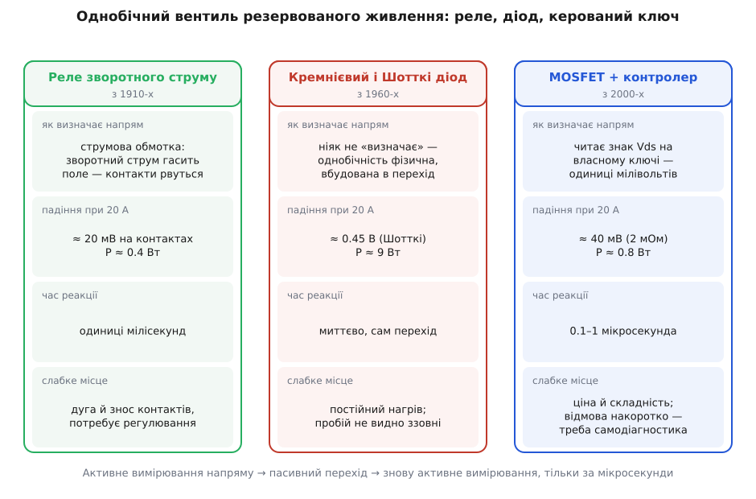

# 📜 Спершу було реле: як резервоване живлення двічі міняло собі однобічний вентиль

Ідея активно керованого діода-без-втрат народилася не з мрії «зробити діод без падіння», а з дуже конкретної біди систем резервованого живлення: коли на одну шину працюють два джерела, здорове може вилити весь свій струм у мертве — і резервування, куплене за гроші, обертається на спільну смерть. Дивовижа в тому, що першою реалізацією однобічного вентиля для такої шини був **не діод**, а активний прилад, що вимірював напрям струму й розмикав контакти. Діод прийшов пізніше й на півстоліття витіснив активний підхід — щоб потім поступитися йому знову, уже в кремнії. Ця вставка про те, чому маятник хитнувся туди й назад і що саме довелося винайти на другому колі.

## Чому резервування взагалі потребує вентиля

Резервування джерела живлення виглядає обманливо просто: постав два блоки замість одного, з'єднай їхні виходи, і якщо один помре — другий підхопить. Так живуть [резервовані системи живлення](root:hw-power/power-redundancy) — телефонні станції, стійки серверів, бортові мережі. Але з'єднати виходи «в лоба» не можна, і причина не в тому, що блоки трохи розходяться по напрузі (це окрема морока про те, як змусити їх [ділити навантаження](root:hw-power/current-sharing)). Причина страшніша: **аварія в одному джерелі стає аварією для шини**.

Уяви, що у блоці А пробило вихідний конденсатор. Тепер вихід А — це майже коротке замикання на землю. Якщо виходи з'єднані прямо, здоровий блок Б бачить не навантаження, а замикання: він викидає в нього весь струм, на який здатен, шина просідає до нуля, і вся апаратура вимикається. Другий блок не врятував — він допоміг убити. Тобто без вентиля резервування працює лише проти однієї відмови — «джерело перестало давати», — а проти другої, «джерело почало забирати», не працює зовсім. А саме друга й трапляється частіше: конденсатори, силові ключі й випрямні діоди в блоці живлення відмовляють переважно накоротко.

Звідси й вимога до вентиля: **пропускати вперед і не пускати назад**, причому «назад» треба перекрити швидше, ніж просяде шина. Це і є задача, що звалася [об'єднанням джерел](root:hw-power/power-oring). Сама назва прийшла з логіки: два діоди, з'єднані катодами в спільний вузол, — це класичний вентиль «АБО» діодної логіки, де на виході з'являється найвищий із входів. Коли той самий прийом перенесли на силові шини, назва поїхала за схемою, тільки «входами» стали блоки живлення, а «одиницею» — вища напруга.

## Перший вентиль був активним: реле зворотного струму

Задача «не пускати струм назад у джерело» стала масовою задовго до напівпровідників — у бортовій мережі автомобіля. Динамо-машина заряджає акумулятор, поки крутиться швидко; щойно оберти падають або двигун глушать, її напруга стає нижчою за напругу батареї, і батарея починає гнати струм назад в обмотку якоря. Динамо перетворюється на мотор, батарея розряджається за ніч, обмотка гріється. Точнісінько та сама халепа, що й із двома блоками живлення, тільки на сімдесят років раніше.

Розв'язали її електромеханічно — **реле зворотного струму** (англ. reverse-current cutout), яке ставили в зарядне коло приблизно з середини 1910-х (статус: усталено за історією автомобільної електрики; конкретний рік першого зразка різниться за джерелами й переказами). Механізм його вартий уваги, бо це буквально предок сучасного контролера. На осерді реле сиділи **дві** обмотки. Тонка **напругова** підключалася до динамо: коли машина розкручувалася й видавала більше за батарею, її поле притягало якір і замикало контакти — коло з'єднано, заряджання пішло. Товста **струмова** була ввімкнена послідовно в силове коло, і поки струм тік уперед, її поле додавалося до напругового й тримало контакти зімкненими. А тільки-но струм розвертався, поле струмової обмотки розверталося теж, гасило напругове — і пружина рвучко розмикала контакти.

Придивись, що тут відбувається. Прилад не має жодної вбудованої однобічності: контакти — просто шматок міді, струм крізь них іде куди завгодно. Однобічність тут **синтезована**: одна обмотка стежить, у який бік тече струм, друга — за якої напруги коло взагалі варто зводити, а рішення втілює звичайний двобічний ключ. Це та сама архітектура, яку через дев'яносто років повторить мікросхема: давач напряму плюс байдужий до напряму ключ плюс логіка, що зв'язує їх у вентиль. Ідея «стежити за напрямом потужності й розривати коло» настільки фундаментальна для енергетики, що дістала власний код у стандарті ANSI/IEEE C37.2 — пристрій № 32, реле напрямку потужності; тими самими реле десятиліттями захищали від «моторного» режиму генератори на електростанціях і суднах.

Ціна цієї однобічності була майже нульовою. Опір зімкнених срібних контактів — частки міліома, тож при 20 А на них падало кілька десятків мілівольтів, а розсіювалося менш як ват. За критерієм втрат реле 1915 року було рівно таким самим «ідеальним діодом», який сьогодні продають як досягнення. Платили іншим: контакти щоразу розмикали струмове коло з дугою, вигорали, злипалися, реле треба було періодично регулювати, а спрацьовувало воно за одиниці мілісекунд — вічність за мірками електроніки.

## Чому перемогла пасивність

У 1960-х динамо-машину в автомобілі змінив генератор змінного струму з кремнієвим випрямлячем — і реле зворотного струму зникло **саме собою**. Не тому, що його перемогли в чесному змаганні, а тому, що випрямні діоди генератора вже стояли в силовому колі й уже були однобічними: окремий вентиль став непотрібним. Той самий перехід відбувся всюди, де потрібен був однобічний прохід: діод не має контактів, які згоряють, не потребує налаштування, не має механічної інерції, а його однобічність — властивість самого переходу, і вона не «спрацьовує», вона просто **є**.

За це віддали постійне [пряме падіння](root:hw-components/diode-iv-curve): близько 0.7 В на кремнієвому переході, близько 0.4 В на [бар'єрі Шотткі](root:hw-power/schottky-diode). Обмін здавався очевидно вигідним. У бортовій мережі 14 В десята частка напруги — прийнятна плата за те, щоб забути про обслуговування. У живленні 5-вольтової логіки 1970-х ті самі 0.4 В на кількох амперах давали одиниці ватів — теплий радіатор, не більше. Діод став універсальною й безальтернативною відповіддю на «АБО» в силових колах, а «ORing-діод» — назвою окремого класу компонентів.


*Реле й керований ключ втрачають десятки мілівольтів і мусять напрям вимірювати; діод втрачає в десять разів більше, зате однобічний фізично, безплатно й миттєво. Півстоліття ця безплатність важила більше за втрати.*

## Арифметика, що зламала обмін

Обмін «падіння за простоту» тримався доти, доки падіння лишалося малою часткою напруги, а розсіяна на ньому потужність — малою часткою потужності. Обидві частки зіпсувалися одночасно й з одної причини: цифрова техніка пішла вниз по напрузі й угору по струму. Логіка з 5 В опустилася до 3.3, потім до 2.5, 1.8, 1.2 В, а споживання стійки виросло на порядки, тож ті самі ватти доводилося доставляти дедалі більшим струмом. Падіння діода при цьому не зменшилося ані на мілівольт — воно задане фізикою переходу й від наших планів не залежить.

**Один ORing-діод Шотткі з прямим падінням ≈ 0.4 В на різних рейках і струмах:**

```text
рейка 5.0 В,  5 А : P = 0.4·5  = 2.0 Вт    з'їдено рейки 0.4/5.0 = 8 %
рейка 3.3 В, 20 А : P = 0.4·20 = 8.0 Вт    з'їдено 0.4/3.3 = 12 %
рейка 1.8 В, 40 А : P = 0.4·40 = 16  Вт    з'їдено 0.4/1.8 = 22 %

І це ОДИН тракт. Резервування означає щонайменше два —
подвій потужність і подвій місце під тепловідвід.
```

Насправді ще гірше: пряме падіння Шотткі при великому струмі підростає до 0.5–0.6 В, а нагрів його ж і підганяє. Шістнадцять ватів у корпусі, який треба охолодити в стійці висотою в один юніт, — це вже не «теплий радіатор», це вентилятор, місце й ризик. Патент International Rectifier на активний ORing прямо називає цю цифру мотивом розробки: розсіювання на діодному об'єднанні джерел у тодішніх системах сягало **близько 3 Вт** на тракт, і саме воно стало нестерпним (статус: усталено — формулювання розділу передумов патенту US 7 038 433 B2).

Отже, повертатися до активного ключа довелося не з естетичних міркувань. Просто друга частка обміну — «зате безплатно й без обслуговування» — раптом перестала перекривати першу.

## Підказка, що вже лежала поруч, і чому вона не підійшла

Прийом «замінити випрямний діод на MOSFET» на той час був давно відомий і освоєний — у [синхронному випрямлянні](root:hw-power/sync-rectifier) імпульсних перетворювачів. Там на місце діода ставлять транзистор і відкривають його рівно в ті проміжки, коли діод мав би проводити; замість Vf на ключі падає I·[Rds(on)](root:hw-components/rds-on), і ККД помітно росте саме на низьких вихідних напругах — з тієї ж причини, з якої діод став нестерпним і в об'єднанні джерел.

Але перенести цей прийом на ORing прямо не вийшло, і причина влучає в саму суть винаходу. У перетворювачі **момент відомий наперед**: ключами керує той самий контролер, що задає такт, тож він точно знає, коли синхронному випрямлячеві належить провести, а коли закритися. В об'єднанні джерел такту немає. Блоки живлення асинхронні, аварія не оголошує про себе, а мить, коли струм розвернеться, вирішує не годинник, а фізика — просів вихід одного блока нижче за спільну шину, і струм пішов туди сам.

Тобто транзистор як ключ був готовий, а от **знання, коли ним клацати, не було**. Його довелося добувати вимірюванням. Ось цей перехід — від керування за розкладом до керування за виміряним знаком струму — і є змістовним кроком, який відрізняє контролер об'єднання джерел від синхронного випрямляча.

## Що саме довелося винайти

Розробники, які на початку 2000-х узялися будувати таку мікросхему, вперлися в три задачі, і жодна з них не була очевидною.

**Виміряти напрям без шунта.** Ставити в силовий тракт струмовий шунт безглуздо: він поверне ту частину втрат, заради якої все затівалося. Лишалося міряти падіння на самому ключі. Але це одиниці мілівольтів на шині, де поруч комутують десятки ампер, — сигнал, який легко потонути в наведеннях. Половина складності мікросхеми виявилася не в силі, а в тому, щоб чесно прочитати цю дрібку.

**Розвести швидкість на два боки.** Закриватися ключ мусить якнайшвидше — за мікросекунду й менше, бо в ці мікросекунди здорове джерело віддає заряд у пробитий блок. А от відкриватися — навпаки, неквапливо. Інакше кожна наводка, що на мить показала «струм уперед», вмикатиме ключ, і той дрижатиме на межі, підмішуючи в шину власний шум. Розв'язок — навмисно **несиметричні** затримки: миттєво на вимкнення, з витримкою на ввімкнення. Патент International Rectifier згадує цю асиметрію як окрему заявлену властивість, поряд із зменшенням втрат приблизно на 90 % проти діода (статус: усталено — за текстом патенту).

**Побачити власну відмову.** Тут ховається найтонше. Діод, що пробився накоротко, зовні поводиться пристойно: шина живиться, індикатори зелені, а резервування вже немає — його з'їла невидима відмова. Патент прямо називає це слабким місцем діодного об'єднання: «непросто виявити потенційну відмову діода накоротко». MOSFET успадковує ту саму хворобу — пробитий канал теж мовчазний. Тому активна схема мусила взяти на себе ще й діагностику: періодично перевіряти, що ключ справді керується й справді ізолює. Активний вентиль виправляє не лише втрати — він робить відмову вентиля **помітною**, а це для резервованої системи важить не менше за ватти.

## Хто це зробив

Найчіткіший датований слід — заявка **International Rectifier** «Active ORing controller for redundant power systems» із пріоритетом **19 серпня 2003 року**; автори — Вейдун Фань (Weidong Fan), Ґоран Стойчич (Goran Stojcic) і Деніел Юм (Daniel Yum). Патент США № 7 038 433 B2 видано **2 травня 2006 року**; права згодом перейшли до Infineon Technologies North America — International Rectifier увійшла до складу Infineon у 2015 році (статус: усталено — реєстрові дані патенту). Це не «винахід ідеального діода» одною людиною: у ті самі роки контролери об'єднання джерел випускали Intersil, Texas Instruments, Maxim, National Semiconductor і Vicor, і патентний ландшафт тут густий. Але сама постановка задачі в цьому документі сформульована рівно так, як її досі розв'язують: замінити діод на MOSFET, керований так, щоб уперед він був низькоомним ключем, а назад — швидко зачиненими дверима, і додати діагностику.

Друга гілка йшла з іншого боку — від живлення портативної техніки. Linear Technology випустила **LTC4412**, контролер, що керує зовнішнім P-канальним MOSFET і тримає на ньому пряме падіння близько 20 мВ, — призначений для перемикання між батареєю й зовнішнім живленням та для розподілу навантаження (статус: усталено за паспортом; рік першої появи за доступними джерелами не встановлено — паспорт у обігу принаймні з 2007 року). Саме в цій лінійці закріпилося формулювання «near ideal diode function», з якого й виріс маркетинговий термін **ideal diode**. Пізніші мікросхеми цієї лінії перейшли на N-канальний ключ у верхньому плечі — а це вже вимагало нести всередині [зарядний насос](root:hw-power/charge-pump), щоб підняти затвор вище за вхід.

Дві гілки розв'язували, по суті, одну задачу з різних кінців: серверна й телекомівська — заради ватів і місця в стійці, портативна — заради годин автономності й того, щоб плата не гріла кишеню. До кінця 2000-х вони зійшлися в один клас приладів. Оглядова стаття 2012 року вже перелічує його як усталений ринок: Vicor Cool-ORing (PI2122, PI2126, PI2127) із заявленою реакцією аж до 80 нс і затримкою вимкнення на зворотному струмі близько 140 нс, Texas Instruments TPS2412/2413 для шин 0.8–16.5 В, Maxim MAX5963 на 7.5–76 В (статус: усталено — за оглядом Digi-Key 2012 року).

## Про що сперечалися

Найдовша суперечка була про те, **як тримати ключ** біля нуля струму. Одна школа каже: відкривай MOSFET повністю й лови розворот компаратором із невеликим порогом — так падіння мінімальне, а це ж і була вся мета. Друга заперечує: при повністю відкритому ключі падіння біля нуля струму — це одиниці мілівольтів, тобто рівень шуму, і схема втрачає надійну робочу точку, з якої видно початок розвороту. Тому краще навмисно недовідкривати ключ, тримаючи невелике стале падіння, — платимо дещицею ККД за впевнене розпізнавання напряму. Практика звелася до компромісу: мале регульоване падіння на малих струмах і повністю відкритий ключ на великих, плюс гістерезис біля нуля, щоб схема не дрижала.

Друга суперечка — термінологічна, і вона не порожня. Пуристи заперечували проти назви «ідеальний діод»: прилад не діод зовсім. По-перше, у ньому лишається [вбудований діод](root:hw-components/body-diode) MOSFET, який проводить уперед ще до того, як контролер устигне відкрити канал, — тобто в перші миті це не вентиль, а просто діод із поганим падінням. По-друге, для справжньої двобічної ізоляції потрібна [пара ключів спина-до-спини](root:hw-power/mosfet-back-to-back), бо один MOSFET блокує лише в один бік. По-третє, вентильність тут існує, лише поки живий і живиться контролер: зникло живлення схеми — і «діод» перетворюється на шматок дроту з паралельним переходом. Назва все одно прижилася, бо описує не будову, а обіцянку: вентиль із падінням, що прямує до нуля.

Третя суперечка — про потрібну швидкість, і в неї є арифметика. Поки ключ закривається, здорове джерело віддає заряд у пробите:

```text
Шина 48 В, ключ 2 мОм, опір аварійного тракту разом ≈ 8 мОм.
Пік зворотного струму:  I = 48 / 0.008 = 6000 А (обмежений уже
                            індуктивністю шини, реально сотні ампер)

Заряд, перекачаний за час вимкнення, при 300 А:
  за 100 нс : q = 300 · 100e-9 = 30 мкКл
  за   1 мкс: q = 300 · 1e-6   = 300 мкКл
  за  30 мкс: q = 300 · 30e-6  = 9000 мкКл = 9 мКл
```

Різниця між сотнею наносекунд і десятками мікросекунд — це різниця між «шина здригнулася» і «шина просіла й система перезавантажилася». Тому виробники змагалися саме затримкою вимкнення, і тому пасивні схеми, де затвор розряджається крізь резистор, з цієї гонки випали одразу.

## Що тут легенда

Побутує уявлення, ніби «ідеальний діод» — винахід епохи смартфонів і USB, який згодом розповсюдили на серверне живлення. Це перевернуто: датований слід веде до стійок і телекому, де боролися з ватами й тепловідводом, а портативна гілка підхопила прийом і зробила його масовим. Друга поширена спрощеність — що контролер «скасував діод». Не скасував: там, де струм малий, місця вистачає, а зайва мікросхема — це зайва відмова, дешевий Шотткі досі виграє, і його ставлять без вагань. Активний вентиль купують тоді, коли ватти, місце під тепловідвід або мікросекунди відсічки коштують дорожче за складність.

І остання деталь, заради якої варто було проходити цю історію. Реле зворотного струму мало струмову обмотку, яка стежила за напрямом, і контакти, яким на напрям було байдуже; розмикалося воно за мілісекунди й губило десятки мілівольтів. Сучасний контролер має вхід, що читає знак падіння на ключі, і MOSFET, якому на напрям байдуже; закривається він за мікросекунди й губить ті самі десятки мілівольтів. Півстоліття між ними — це епоха, коли ми дозволили собі платити цілим вольтом за те, щоб напрям не треба було вимірювати. Щойно вольт став задорогим, довелося повернутися до вимірювання — тільки замість якоря й пружини цю роботу тепер робить [компаратор](root:hw-analog/comparator), і робить її в тисячу разів швидше.
